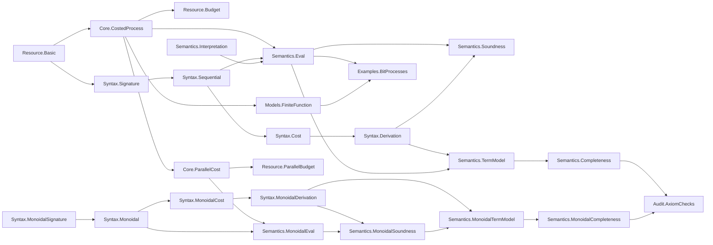

# Ript Formalization Blueprint

This document records only kernel-checked implementation status. Allowed status
values are `DEFINED`, `STATEMENT_FORMALIZED`, `PROVED`, `BLOCKED`, and
`OPEN_RESEARCH`.

## Dependency graph



Every node in this graph is an existing compiled module.

## Stage status

| Stage | Scope | Status |
| --- | --- | --- |
| 0 | Environment, project scaffold, documentation, CI, audit baseline | PROVED |
| 1 | Sequential resource-process vertical slice | PROVED |
| 2 | Tensor, symmetry, and parallel resources | PROVED |
| 3 | Executable finite stochastic model | OPEN_RESEARCH |
| 4 | Finite-distribution Kleisli representation | OPEN_RESEARCH |
| 5-11 | Semantic models and higher layers | OPEN_RESEARCH |

## Stage-1 flagship theorem records

### `Ript.Resource.budgeted_id`

- Natural-language statement: every categorical identity is available at zero
  resource budget.
- Lean type:

  ```lean
  theorem budgeted_id (X : C) : WithinBudget (0 : R) (𝟙 X)
  ```

- Prerequisites: `HasProcessCost.cost_id`, `WithinBudget`.
- Status: `PROVED`.
- Classical choice: no.
- Computable: yes at the budgeted-data boundary; this theorem supplies proof data.
- Kernel assumptions: `[propext]`.
- Source: `Ript/Resource/Budget.lean`.

### `Ript.Resource.budgeted_comp`

- Natural-language statement: composing processes within budgets `r` and `s`
  yields a process within `r + s`.
- Lean type:

  ```lean
  theorem budgeted_comp {f : X ⟶ Y} {g : Y ⟶ Z}
      (hf : WithinBudget r f) (hg : WithinBudget s g) :
      WithinBudget (r + s) (f ≫ g)
  ```

- Prerequisites: process-cost subadditivity and monotonicity of resource addition.
- Status: `PROVED`.
- Classical choice: no.
- Computable: yes at the budgeted-data boundary; this theorem supplies proof data.
- Kernel assumptions: `[propext, Quot.sound]`.
- Source: `Ript/Resource/Budget.lean`.

### `Ript.Semantics.eval_cost_le`

- Natural-language statement: semantic evaluation never costs more than the
  recursively computed syntax cost.
- Lean type:

  ```lean
  theorem eval_cost_le (interpretation : Interpretation signature C)
      (expression : Expr signature X Y) :
      processCost (eval interpretation expression) ≤ expression.syntaxCost
  ```

- Prerequisites: generator cost bounds, identity cost, composition
  subadditivity, and ordered resource addition.
- Status: `PROVED`.
- Classical choice: no.
- Computable: `eval` and `syntaxCost` are executable; the inequality is proof data.
- Kernel assumptions: `[propext, Quot.sound]`.
- Source: `Ript/Semantics/Eval.lean`.

### `Ript.Semantics.soundness`

- Natural-language statement: every formal category-law derivation evaluates to
  an equality in every interpretation.
- Lean type:

  ```lean
  theorem soundness (interpretation : Interpretation signature C)
      (derivation : Derives f g) : eval interpretation f = eval interpretation g
  ```

- Prerequisites: `Derives`, recursive evaluation, and the ordinary category laws.
- Status: `PROVED`.
- Classical choice: no.
- Computable: proof by structural recursion on a derivation.
- Kernel assumptions: `[propext]`.
- Source: `Ript/Semantics/Soundness.lean`.

### `Ript.Semantics.complete_via_term_model`

- Natural-language statement: equality under the canonical term-model
  interpretation implies a formal derivation.
- Lean type:

  ```lean
  theorem complete_via_term_model
      (h : eval (TermModel.interpretation signature) f =
        eval (TermModel.interpretation signature) g) : Derives f g
  ```

- Prerequisites: derivation setoid, quotient category, and
  `TermModel.eval_interpretation`.
- Status: `PROVED`.
- Classical choice: no.
- Computable: no; deliberately confined to the quotient proof layer.
- Kernel assumptions: `[propext, Quot.sound]`.
- Source: `Ript/Semantics/Completeness.lean`.

### `Ript.Semantics.budget_complete_in_free_model`

- Natural-language statement: in the term model, evaluated cost is exactly the
  syntax cost, so the general semantic upper bound is tight.
- Lean type:

  ```lean
  theorem budget_complete_in_free_model (expression : Expr signature X Y) :
      processCost (eval (TermModel.interpretation signature) expression) =
        expression.syntaxCost
  ```

- Prerequisites: cost invariance under derivation and the canonical term-model interpretation.
- Status: `PROVED`.
- Classical choice: no.
- Computable: no; this is a quotient proof-layer result.
- Kernel assumptions: `[propext, Quot.sound]`.
- Source: `Ript/Semantics/Completeness.lean`.

## Stage-2 flagship theorem records

### `Ript.Resource.budgeted_tensor`

- Natural-language statement: tensoring processes within budgets `r` and `s`
  produces a process within the parallel budget `r + s`.
- Prerequisites: parallel process-cost subadditivity and monotonicity of
  resource addition.
- Status: `PROVED`.
- Classical choice: no.
- Computable: yes at the packaged-budget boundary.
- Kernel assumptions: `[propext, Quot.sound]`.
- Source: `Ript/Resource/ParallelBudget.lean`.

### `Ript.Semantics.monoidalEval_cost_le`

- Natural-language statement: interpreting tensor, composition, generators,
  and structural rewiring never exceeds the recursively computed syntax cost.
- Prerequisites: sequential and parallel cost bounds plus zero-cost
  associators, unitors, and braidings.
- Status: `PROVED`.
- Classical choice: no.
- Computable: evaluation and syntax cost are executable; the bound is proof data.
- Kernel assumptions: `[propext, Quot.sound]`.
- Source: `Ript/Semantics/MonoidalEval.lean`.

### `Ript.Semantics.monoidal_soundness`

- Natural-language statement: every explicit symmetric monoidal derivation is
  respected by every symmetric monoidal interpretation.
- Prerequisites: category, monoidal coherence, braiding naturality, symmetry,
  and the primitive forward and reverse hexagon laws.
- Status: `PROVED`.
- Classical choice: no.
- Computable: proof by structural recursion on the derivation.
- Kernel assumptions: `[propext, Quot.sound]`.
- Source: `Ript/Semantics/MonoidalSoundness.lean`.

### `Ript.Semantics.monoidal_complete_via_term_model`

- Natural-language statement: equality under the canonical symmetric
  monoidal term-model interpretation implies formal derivability.
- Prerequisites: the explicit derivation quotient, distinct wrapped object
  carrier, canonical object comparisons, and exact evaluation-by-quotation.
- Status: `PROVED`.
- Classical choice: no.
- Computable: no; deliberately confined to the quotient proof layer.
- Kernel assumptions: `[propext, Quot.sound]`.
- Source: `Ript/Semantics/MonoidalCompleteness.lean`.

### `Ript.Semantics.monoidal_budget_complete_in_free_model`

- Natural-language statement: monoidal evaluation in the free term model has
  exactly the computed syntax cost.
- Prerequisites: derivation-invariant syntax cost and exact costs for quotient
  composition, tensor, and canonical object comparisons.
- Status: `PROVED`.
- Classical choice: no.
- Computable: no; this is a quotient proof-layer result.
- Kernel assumptions: `[propext, Quot.sound]`.
- Source: `Ript/Semantics/MonoidalCompleteness.lean`.

## Design decisions

1. The sequential core remains independently usable. Stage 2 adds a separate
   typed symmetric monoidal syntax rather than changing stage-1 expression and
   interpretation contracts.
2. Costs use an ordered additive commutative monoid interface. No stronger
   lattice or quantale structure is introduced without two concrete consumers.
3. The term model exposes exactly the derivation quotient needed for relative
   completeness; executable syntax remains unquotiented.
4. The nontrivial finite deterministic cost model is fixed to small Lean types
   in stage 1. Universe-polymorphic finite models can be added when a downstream
   model needs them, without changing the process interfaces.
5. The monoidal term model uses a one-field object wrapper instead of a
   reducible alias. This prevents Lean from confusing its quotient category
   instance with Mathlib's existing category on raw free-monoidal object trees.
