# Ript Formalization Blueprint

This document records only kernel-checked implementation status. Allowed status
values are `DEFINED`, `STATEMENT_FORMALIZED`, `PROVED`, `BLOCKED`, and
`OPEN_RESEARCH`.

## Dependency graph

```mermaid
flowchart LR
  Resource["Resource.Basic"] --> Costed["Core.CostedProcess"]
  Costed --> Budget["Resource.Budget"]
  Costed --> Filtration["Resource.Filtration"]
  ParallelBudget --> Filtration
  Filtration --> CostFiltrationExample["Examples.CostFiltration"]
  CostFiltrationExample --> Audit
  Resource --> Signature["Syntax.Signature"]
  Signature --> Sequential["Syntax.Sequential"]
  Sequential --> Cost["Syntax.Cost"]
  Cost --> Derivation["Syntax.Derivation"]
  Costed --> Eval["Semantics.Eval"]
  Sequential --> Eval
  Interpretation["Semantics.Interpretation"] --> Eval
  Eval --> Soundness["Semantics.Soundness"]
  Derivation --> Soundness
  Derivation --> TermModel["Semantics.TermModel"]
  Eval --> TermModel
  TermModel --> Completeness["Semantics.Completeness"]
  Costed --> FiniteFunction["Models.FiniteFunction"]
  Capabilities["Core.Capabilities"] --> FiniteFunctionMonoidal["Models.FiniteFunction.Monoidal"]
  FiniteFunction --> FiniteFunctionMonoidal
  FiniteFunctionMonoidal --> ClassicalCopy["Examples.ClassicalCopy"]
  ClassicalCopy --> Audit
  Eval --> BitProcesses["Examples.BitProcesses"]
  FiniteFunction --> BitProcesses["Examples.BitProcesses"]
  Completeness --> Audit["Audit.AxiomChecks"]
  Costed --> ParallelCost["Core.ParallelCost"]
  Costed --> Monotone["Core.Monotone"]
  Budget --> ResourceMonotone["Resource.Monotone"]
  Monotone --> ResourceMonotone
  ParallelCost --> ParallelBudget["Resource.ParallelBudget"]
  MonoidalSignature["Syntax.MonoidalSignature"] --> MonoidalExpr["Syntax.Monoidal"]
  MonoidalExpr --> MonoidalCost["Syntax.MonoidalCost"]
  MonoidalCost --> MonoidalDerivation["Syntax.MonoidalDerivation"]
  ParallelCost --> MonoidalEval["Semantics.MonoidalEval"]
  MonoidalExpr --> MonoidalEval
  MonoidalDerivation --> MonoidalSoundness["Semantics.MonoidalSoundness"]
  MonoidalEval --> MonoidalSoundness
  MonoidalDerivation --> MonoidalTermModel["Semantics.MonoidalTermModel"]
  MonoidalSoundness --> MonoidalTermModel
  MonoidalTermModel --> MonoidalCompleteness["Semantics.MonoidalCompleteness"]
  MonoidalTermModel --> MonoidalInitiality["Semantics.MonoidalInitiality"]
  ResourceMonotone --> MonoidalInitiality
  MonoidalCompleteness --> Audit
  MonoidalInitiality --> Audit
  Costed --> FiniteStochastic["Models.FiniteStochastic"]
  FiniteStochastic --> StochasticBits["Examples.StochasticBits"]
  Eval --> StochasticBits
  StochasticBits --> Audit
  FiniteStochastic --> FiniteDistribution["Models.FiniteDistribution"]
  FiniteDistribution --> FiniteKleisli["Models.FiniteStochastic.Kleisli"]
  FiniteStochastic --> FiniteKleisli
  FiniteKleisli --> KleisliBits["Examples.KleisliBits"]
  StochasticBits --> KleisliBits
  FiniteKleisli --> Audit
  FiniteStochastic --> StochFunctor["Models.Probability.StochFunctor"]
  FiniteDistribution --> FiniteKL["Models.Probability.FiniteKL"]
  StochFunctor --> FiniteKL
  StochFunctor --> StochBits["Examples.StochBits"]
  StochasticBits --> StochBits
  StochFunctor --> Audit
  ParallelCost --> Simulation["Core.Simulation"]
  StochFunctor --> Blackwell["Models.Decision.Blackwell"]
  Simulation --> Blackwell
  FiniteKleisli --> Blackwell
  Blackwell --> FiniteRisk["Models.Decision.FiniteRisk"]
  FiniteRisk --> DeterministicBlackwell["Models.Decision.DeterministicBlackwell"]
  DeterministicBlackwell --> DeterministicBlackwellExample["Examples.DeterministicBlackwell"]
  DeterministicBlackwellExample --> Audit
  FiniteRisk --> DecisionSeparation["Models.Decision.Separation"]
  DecisionSeparation --> GarblingPolytope["Models.Decision.GarblingPolytope"]
  RationalConvexHull["ForMathlib.RationalConvexHull"] --> RationalSeparation["Models.Decision.RationalSeparation"]
  GarblingPolytope --> RationalSeparation
  RationalSeparation --> Audit
  DecisionSeparation --> EmptyParameterBoundary["Examples.EmptyParameterBoundary"]
  EmptyParameterBoundary --> Audit
  DecisionSeparation --> StochasticSeparation["Examples.StochasticSeparation"]
  StochasticSeparation --> Audit
  FiniteRisk --> ResourceDecision["Models.Decision.ResourceBounded"]
  ResourceDecision --> SemanticValue["Models.Decision.SemanticValue"]
  SemanticValue --> SimpleDecision["Examples.SimpleDecision"]
  SimpleDecision --> Audit
  SemanticValue --> Audit
  Resource --> ComputationResource["Models.Computation.Resource"]
  ComputationResource --> TotalComputation["Models.Computation.Total"]
  TotalComputation --> PartialComputation["Models.Computation.Partial"]
  Eval --> SimpleComputation["Examples.SimpleComputation"]
  TotalComputation --> SimpleComputation
  PartialComputation --> SimpleComputation
  SimpleComputation --> Audit
  FiniteDistribution --> CausalModel["Models.Causal.Model"]
  CausalDAG["Models.Causal.DAG"] --> CausalModel
  CausalModel --> Intervention["Models.Causal.Intervention"]
  Intervention --> CausalFinStoch["Models.Causal.FinStoch"]
  FiniteStochastic --> CausalFinStoch
  CausalFinStoch --> SimpleCausal["Examples.SimpleCausalModel"]
  SimpleCausal --> Audit
  FiniteDistribution --> ThermalEquilibrium["Models.Thermal.Equilibrium"]
  FiniteStochastic --> ThermalEquilibrium
  ThermalEquilibrium --> GibbsPreserving["Models.Thermal.GibbsPreserving"]
  GibbsPreserving --> ThermalProtocol["Models.Thermal.Protocol"]
  GibbsPreserving --> ThermalMonotone["Models.Thermal.Monotone"]
  FiniteKL --> ThermalKL["Models.Thermal.KLDivergence"]
  ThermalMonotone --> ThermalKL
  ThermalEquilibrium --> ThermalGibbs["Models.Thermal.Gibbs"]
  ThermalGibbs --> RationalGibbs["Models.Thermal.RationalGibbs"]
  RationalGibbs --> RationalGibbsSpectra["Examples.RationalGibbsSpectra"]
  ThermalGibbs --> ThermalFreeEnergy["Models.Thermal.FreeEnergy"]
  ThermalKL --> ThermalFreeEnergy
  ThermalFreeEnergy --> ThermalCorrelation["Models.Thermal.Correlation"]
  ThermalFreeEnergy --> ThermalWork["Models.Thermal.Work"]
  ThermalCorrelation --> CorrelatedWork["Models.Thermal.CorrelatedWork"]
  ThermalWork --> CorrelatedWork
  ThermalWork --> ThermalBath["Models.Thermal.Bath"]
  ThermalProtocol --> SimpleThermal
  CorrelatedWork --> SimpleThermal["Examples.SimpleThermalModel"]
  SimpleThermal --> ApproximateErasure["Examples.ApproximateErasure"]
  ThermalBath --> ExplicitBathErasure["Examples.ExplicitBathErasure"]
  SimpleThermal --> ExplicitBathErasure
  ThermalWork --> ExactWorkErasure["Examples.ExactWorkErasure"]
  SimpleThermal --> ExactWorkErasure
  ExactWorkErasure --> ExactWorkCycle["Examples.ExactWorkCycle"]
  ThermalProtocol --> ExactWorkCycle
  ApproximateErasure --> Audit
  ExplicitBathErasure --> Audit
  ExactWorkErasure --> Audit
  ExactWorkCycle --> Audit
  RationalGibbsSpectra --> Audit
  QuantumBasic["Models.Quantum.Basic"] --> QuantumKraus["Models.Quantum.Kraus"]
  QuantumKraus --> QuantumTensor["Models.Quantum.Tensor"]
  QuantumTensor --> QuantumCP["Models.Quantum.CompletePositivity"]
  QuantumTensor --> QuantumDiscard["Models.Quantum.Discard"]
  QuantumCP --> QubitChannel["Examples.QubitChannel"]
  QuantumDiscard --> QubitChannel["Examples.QubitChannel"]
  QubitChannel --> Audit
  FiniteDistribution --> ClassicalEmbedding["Models.Quantum.ClassicalEmbedding"]
  FiniteStochastic --> ClassicalEmbedding
  QuantumCP --> ClassicalEmbedding
  ClassicalEmbedding --> ClassicalQuantumExample["Examples.ClassicalQuantum"]
  ClassicalQuantumExample --> Audit
  StructuralCost["Core.StructuralCost"] --> ModelHom["Higher.ModelHom"]
  ModelHom --> ModelBicategory["Higher.ModelBicategory"]
  ModelBicategory --> ModelCoherence["Higher.Coherence"]
  ModelCoherence --> ModelEquivalence["Higher.Equivalence"]
  MonoidalTermModel --> HigherModels["Examples.HigherModels"]
  ModelEquivalence --> HigherModels
  HigherModels --> Audit
  ModelBicategory --> ModelHomotopy["ForMathlib.Bicategory.HomotopyCategory"]
  ModelHomotopy --> BicatMarks["ForMathlib.Bicategory.MorphismProperty"]
  BicatMarks --> BicatLocalizationSpec["ForMathlib.Bicategory.Localization"]
  ModelHomotopy --> PithBridge["ForMathlib.Bicategory.PithToHomotopy"]
  BicatMarks --> ModelLocalization["Higher.Localization"]
  PithBridge --> ModelLocalization
  ModelEquivalence --> ModelLocalization
  ModelLocalization --> HigherLocalization["Examples.HigherLocalization"]
  FiniteFunctionMonoidal --> HigherTwoCell["Examples.HigherNoninvertibleTwoCell"]
  ModelLocalization --> HigherTwoCell
  BicatLocalizationSpec --> ModelLocalization
  HigherLocalization --> Audit
  HigherTwoCell --> Audit
  UnivalentSyntax["Univalent.Syntax"] --> UnivalentModel["Univalent.Model"]
  UnivalentModel --> UnivalentSoundness["Univalent.Soundness"]
  UnivalentSoundness --> UnivalentBoundary["Univalent.Boundary"]
  UnivalentSoundness --> UnivalentProcess["Univalent.Process"]
  UnivalentSoundness --> UnivalentCompletion["Univalent.Completion"]
  UnivalentBoundary --> UnivalentExample["Examples.UnivalentProcessUniverse"]
  UnivalentProcess --> UnivalentExample
  UnivalentExample --> UnivalentCompletionExample["Examples.UnivalentCompletion"]
  UnivalentCompletion --> UnivalentCompletionExample
  UnivalentCompletion --> UnivalentPresheaf["Univalent.Presheaf"]
  UnivalentCompletionExample --> UnivalentPresheafExample["Examples.UnivalentPresheaf"]
  UnivalentPresheaf --> UnivalentPresheafExample
  GroupoidNerve["ForMathlib.GroupoidNerve"] --> UnivalentSimplicial["Univalent.Simplicial"]
  UnivalentPresheaf --> UnivalentSimplicial["Univalent.Simplicial"]
  UnivalentPresheafExample --> UnivalentSimplicialExample["Examples.UnivalentSimplicial"]
  UnivalentSimplicial --> UnivalentSimplicialExample
  UnivalentSimplicial --> UnivalentClassifying["Univalent.ClassifyingDiagram"]
  UnivalentExample --> Audit
  UnivalentCompletionExample --> Audit
  UnivalentPresheafExample --> Audit
  GroupoidNerve --> Audit
  UnivalentSimplicialExample --> Audit
  UnivalentClassifying --> Audit
```



Every node in this graph is an existing compiled module.

## Stage status

| Stage | Scope | Status |
| --- | --- | --- |
| 0 | Environment, project scaffold, documentation, CI, audit baseline | PROVED |
| 1 | Sequential resource-process vertical slice | PROVED |
| 1 (finite deterministic model) | Explicit cartesian tensor, coherent classical copy/discard, causality, and executable Boolean evidence | PROVED |
| 1 (representation) | Cost functions and attained budget filtrations, with exact round trips and serial/tensor closure | PROVED |
| 2 | Tensor, symmetry, parallel resources, and the strict free universal lift | PROVED |
| 3 | Executable finite stochastic model | PROVED |
| 4 | Finite-distribution Kleisli representation | PROVED |
| 5 | Exact finite stochastic channels to Mathlib `Stoch` | PROVED |
| 6 | Blackwell order, finite decision risk, deterministic and full stochastic finite converses, necessary nonempty-state boundary, exact rational garbling simplex, rational convex-hull reflection and strict separation, decision certificates, resource bounds, and task-relative value | PROVED |
| 7 (computation) | Multidimensional total and `Option`-partial computation models | PROVED |
| 7 (causal) | Finite DAG mechanisms, normalized joint distributions, interventions, and `FinStoch` semantics | PROVED |
| 8 | Finite equilibrium systems, exact rational-Gibbs classification of finite real spectra, closed-protocol exact-erasure no-go, Gibbs/KL/free-energy theory, correlation decomposition, exact/rational-error Landauer bounds, bath-resolved accounting, a bath-returning information-battery witness, entropy-neutral nondegenerate work-battery saturation, and an exact closed erasure–recharge cycle | PROVED |
| 9 (finite quantum channels) | Complex density matrices, trace-preserving finite Kraus channels, canonical tensor/interchange, trace discard, causal uniqueness, and finite identity-amplification complete positivity | PROVED |
| 9 (extension) | Faithful classical finite-stochastic measurement-preparation embedding into the dephasing-idempotent Kraus subcategory, preserving composition and tensor | PROVED |
| 10 | Resource-indexed model bicategory, monoidal 2-cells, coherence, and cost-exact equivalence transport | PROVED |
| 10 (ordinary model localization) | Invertible-2-cell-saturated cost-exact marking, exact homotopy descent, canonical pith pseudofunctor, Mathlib Gabriel--Zisman universal property, and noninvertible marked-arrow/2-cell witnesses | PROVED |
| 11 | Axiom-free deep process syntax, quotient groupoid semantics, internal univalence, and interpretation soundness | PROVED |
| 12 (truncated foundation) | Choice-free object completion, skeletal groupoid completion, descent universal properties, and executable invariants | PROVED |
| 12 (presheaf foundation) | Fully faithful Yoneda semantics, representable identity/equivalence correspondence, and essential-image envelope | PROVED |
| 12 (groupoidal localization foundation) | Identity, skeletal-completion, and restricted-Yoneda localization models at all internal identities, with Mathlib functor-category universal properties | PROVED |
| 12 (simplicial foundation) | Categorical nerve, complete Kan horn filling, exact strict Segal reconstruction, quasicategory and 2-coskeletal structure, and homotopy-category recovery | PROVED |
| 12 (classifying-diagram foundation) | Rezk classifying diagram as a simplicial object in simplicial sets, vertical and horizontal groupoid/Kan structure, strict outer Segal equivalences, exact project-local groupoidal complete-Segal packaging, natural simplex-mapping presentation, genuine boundary matching limits, and matching-map fibrations | PROVED |
| 12 (higher-localization specification) | Mark inversion into adjoint equivalences, pseudofunctor precomposition, local equivalence on strong transformations/modifications, identity and walking-arrow base cases, and a non-locally-discrete parameterized inverse-adjoining construction with retained-, localized-, separable mixed-coordinate, and replete-equivalence-closure lift families plus local full faithfulness | PROVED |
| 12 (higher-localization construction) | A pseudofunctor from the full resource-process bicategory satisfying the compiled bicategorical localization predicate, plus Mathlib-native simplicial weak-equivalence/standard complete-Segal comparison | OPEN_RESEARCH |

## Finite deterministic copy-discard theorem records

Ript keeps discarding outside the common process core. `DiscardingProcess`
selects coherent discards without granting copy; `ClassicalCopyingProcess` is
an alias for Mathlib's stronger `CopyDiscardCategory`. The finite deterministic
model uses explicit `PUnit` and product-type limit cones, after which Mathlib's
cartesian construction supplies the commutative-comonoid laws. Thus the model
gets genuine categorical structure without duplicating Mathlib's theory.

### `Ript.Core.CausalProcess.comp`

- Natural-language statement: serial composition of discard-preserving
  processes is discard-preserving.
- Lean type:

  ```lean
  theorem CausalProcess.comp {f : X ⟶ Y} {g : Y ⟶ Z}
      (hf : CausalProcess f) (hg : CausalProcess g) :
      CausalProcess (f ≫ g)
  ```

- Prerequisites: a monoidal category and `DiscardingProcess`.
- Status: `PROVED`.
- Classical choice: no.
- Computable: the composite and discard maps may compute; causality is proof data.
- Kernel assumptions: none.
- Source: `Ript/Core/Capabilities.lean`.

### `Ript.Models.FiniteFunction.tensor_apply`

- Natural-language statement: the cartesian tensor of finite deterministic
  functions applies each function to its corresponding component.
- Lean type:

  ```lean
  theorem tensor_apply (f : W ⟶ X) (g : Y ⟶ Z) (value : W × Y) :
      (f ⊗ₘ g) value = (f value.1, g value.2)
  ```

- Prerequisites: explicit `PUnit` terminal cone and product-type binary cones.
- Status: `PROVED`.
- Classical choice: present only in Mathlib's generic categorical proof
  infrastructure; no chosen value enters the componentwise function.
- Computable: yes; the operation reduces under `#eval`.
- Kernel assumptions: `[propext, Classical.choice, Quot.sound]`.
- Source: `Ript/Models/FiniteFunction/Monoidal.lean`.

### `Ript.Models.FiniteFunction.copy_natural`

- Natural-language statement: every finite deterministic function commutes
  with classical diagonal copying.
- Lean type:

  ```lean
  theorem copy_natural (f : X ⟶ Y) :
      f ≫ Δ[Y] = Δ[X] ≫ (f ⊗ₘ f)
  ```

- Prerequisites: Mathlib cartesian copy-discard structure and deterministic
  morphisms.
- Status: `PROVED`.
- Classical choice: yes in generic categorical proof dependencies only.
- Computable: copy is the executable diagonal function; equality is proof data.
- Kernel assumptions: `[propext, Classical.choice, Quot.sound]`.
- Source: `Ript/Models/FiniteFunction/Monoidal.lean`.

### `Ript.Models.FiniteFunction.copy_coassociative`

- Natural-language statement: iterated finite copying is coassociative up to
  the chosen cartesian associator.
- Lean type:

  ```lean
  theorem copy_coassociative (X : FintypeCat) :
      Δ[X] ≫ X ◁ Δ[X] =
        Δ[X] ≫ (Δ[X] ▷ X) ≫ (α_ X X X).hom
  ```

- Prerequisites: Mathlib's objectwise commutative comonoid supplied by the
  cartesian monoidal structure.
- Status: `PROVED`.
- Classical choice: yes in generic categorical proof dependencies only.
- Computable: the diagonal computes; coherence is proof data.
- Kernel assumptions: `[propext, Classical.choice, Quot.sound]`.
- Source: `Ript/Models/FiniteFunction/Monoidal.lean`.

### `Ript.Models.FiniteFunction.causal`

- Natural-language statement: every finite deterministic function preserves
  discard and is therefore causal.
- Lean type:

  ```lean
  theorem causal (f : X ⟶ Y) : CausalProcess f
  ```

- Prerequisites: the deterministic-to-causal bridge and cartesian
  copy-discard structure.
- Status: `PROVED`.
- Classical choice: yes in the concrete cartesian structure's generic proof
  dependencies; the generic bridge itself uses no axioms.
- Computable: discard is executable; causality is proof data.
- Kernel assumptions: `[propext, Classical.choice, Quot.sound]`.
- Source: `Ript/Models/FiniteFunction/Monoidal.lean`.

## Cost--filtration representation theorem records

The representation layer needs only the ordered additive resource structure
already used by the core. `AttainedHomFiltration` stores a least admissible
budget and proofs of its universal property. This is the attained infimum as
data: it covers discrete resources such as `Nat`, introduces no choice, and
does not force every resource order to be a complete lattice.

### `Ript.Resource.costToFiltration_toCost`

- Natural-language statement: the least budget of the filtration generated by
  a process cost is exactly that original cost.
- Lean type:

  ```lean
  theorem costToFiltration_toCost [HasProcessCost C R] (f : X ⟶ Y) :
      filtrationToCost (costToAttainedFiltration (C := C) (R := R)) f =
        processCost (R := R) f
  ```

- Prerequisites: lax additive process cost and ordered additive resources.
- Status: `PROVED`.
- Classical choice: no.
- Computable: yes; the induced minimum is the original cost by construction.
- Kernel assumptions: `[propext, Quot.sound]` through the category interface.
- Source: `Ript/Resource/Filtration.lean`.

### `Ript.Resource.filtrationToCost_toFiltration_of_attained`

- Natural-language statement: rebuilding budget layers from their attained
  least costs recovers the original filtration pointwise.
- Lean type:

  ```lean
  theorem filtrationToCost_toFiltration_of_attained (r : R) (f : X ⟶ Y) :
      filtrationToCost F f ≤ r ↔ F.Mem r f
  ```

- Prerequisites: monotone filtration and an attained least budget per process.
- Status: `PROVED`.
- Classical choice: no.
- Computable: yes when the supplied minimum operation is executable.
- Kernel assumptions: none.
- Source: `Ript/Resource/Filtration.lean`.

### `Ript.Resource.filtrationToCost_comp`

- Natural-language statement: costs reconstructed from an attained filtration
  are subadditive under serial composition.
- Lean type:

  ```lean
  theorem filtrationToCost_comp (f : X ⟶ Y) (g : Y ⟶ Z) :
      filtrationToCost F (f ≫ g) ≤
        filtrationToCost F f + filtrationToCost F g
  ```

- Prerequisites: additive serial closure and least-budget minimality.
- Status: `PROVED`.
- Classical choice: no.
- Computable: the cost is executable; the inequality is proof data.
- Kernel assumptions: none.
- Source: `Ript/Resource/Filtration.lean`.

### `Ript.Resource.filtrationToCost_tensor`

- Natural-language statement: tensor-compatible attained filtrations
  reconstruct a cost subadditive under parallel composition.
- Lean type:

  ```lean
  theorem filtrationToCost_tensor
      (hTensor : F.toHomFiltration.TensorCompatible)
      (f : X₁ ⟶ Y₁) (g : X₂ ⟶ Y₂) :
      filtrationToCost F (f ⊗ₘ g) ≤
        filtrationToCost F f + filtrationToCost F g
  ```

- Prerequisites: monoidal process category, tensor closure, and least budgets.
- Status: `PROVED`.
- Classical choice: no.
- Computable: the cost is executable; the inequality is proof data.
- Kernel assumptions: none.
- Source: `Ript/Resource/Filtration.lean`.

## Stage-1 flagship theorem records

### `Ript.Resource.budgeted_id`

- Natural-language statement: every categorical identity is available at zero
  resource budget.
- Lean type:

  ```lean
  theorem budgeted_id (X : C) : WithinBudget (0 : R) (𝟙 X)
  ```

- Prerequisites: `HasProcessCost.cost_id`, `WithinBudget`.
- Status: `PROVED`.
- Classical choice: no.
- Computable: yes at the budgeted-data boundary; this theorem supplies proof data.
- Kernel assumptions: `[propext]`.
- Source: `Ript/Resource/Budget.lean`.

### `Ript.Resource.budgeted_comp`

- Natural-language statement: composing processes within budgets `r` and `s`
  yields a process within `r + s`.
- Lean type:

  ```lean
  theorem budgeted_comp {f : X ⟶ Y} {g : Y ⟶ Z}
      (hf : WithinBudget r f) (hg : WithinBudget s g) :
      WithinBudget (r + s) (f ≫ g)
  ```

- Prerequisites: process-cost subadditivity and monotonicity of resource addition.
- Status: `PROVED`.
- Classical choice: no.
- Computable: yes at the budgeted-data boundary; this theorem supplies proof data.
- Kernel assumptions: `[propext, Quot.sound]`.
- Source: `Ript/Resource/Budget.lean`.

### `Ript.Semantics.eval_cost_le`

- Natural-language statement: semantic evaluation never costs more than the
  recursively computed syntax cost.
- Lean type:

  ```lean
  theorem eval_cost_le (interpretation : Interpretation signature C)
      (expression : Expr signature X Y) :
      processCost (eval interpretation expression) ≤ expression.syntaxCost
  ```

- Prerequisites: generator cost bounds, identity cost, composition
  subadditivity, and ordered resource addition.
- Status: `PROVED`.
- Classical choice: no.
- Computable: `eval` and `syntaxCost` are executable; the inequality is proof data.
- Kernel assumptions: `[propext, Quot.sound]`.
- Source: `Ript/Semantics/Eval.lean`.

### `Ript.Semantics.soundness`

- Natural-language statement: every formal category-law derivation evaluates to
  an equality in every interpretation.
- Lean type:

  ```lean
  theorem soundness (interpretation : Interpretation signature C)
      (derivation : Derives f g) : eval interpretation f = eval interpretation g
  ```

- Prerequisites: `Derives`, recursive evaluation, and the ordinary category laws.
- Status: `PROVED`.
- Classical choice: no.
- Computable: proof by structural recursion on a derivation.
- Kernel assumptions: `[propext]`.
- Source: `Ript/Semantics/Soundness.lean`.

### `Ript.Semantics.complete_via_term_model`

- Natural-language statement: equality under the canonical term-model
  interpretation implies a formal derivation.
- Lean type:

  ```lean
  theorem complete_via_term_model
      (h : eval (TermModel.interpretation signature) f =
        eval (TermModel.interpretation signature) g) : Derives f g
  ```

- Prerequisites: derivation setoid, quotient category, and
  `TermModel.eval_interpretation`.
- Status: `PROVED`.
- Classical choice: no.
- Computable: no; deliberately confined to the quotient proof layer.
- Kernel assumptions: `[propext, Quot.sound]`.
- Source: `Ript/Semantics/Completeness.lean`.

### `Ript.Semantics.budget_complete_in_free_model`

- Natural-language statement: in the term model, evaluated cost is exactly the
  syntax cost, so the general semantic upper bound is tight.
- Lean type:

  ```lean
  theorem budget_complete_in_free_model (expression : Expr signature X Y) :
      processCost (eval (TermModel.interpretation signature) expression) =
        expression.syntaxCost
  ```

- Prerequisites: cost invariance under derivation and the canonical term-model interpretation.
- Status: `PROVED`.
- Classical choice: no.
- Computable: no; this is a quotient proof-layer result.
- Kernel assumptions: `[propext, Quot.sound]`.
- Source: `Ript/Semantics/Completeness.lean`.

## Stage-2 flagship theorem records

### `Ript.Resource.budgeted_tensor`

- Natural-language statement: tensoring processes within budgets `r` and `s`
  produces a process within the parallel budget `r + s`.
- Prerequisites: parallel process-cost subadditivity and monotonicity of
  resource addition.
- Status: `PROVED`.
- Classical choice: no.
- Computable: yes at the packaged-budget boundary.
- Kernel assumptions: `[propext, Quot.sound]`.
- Source: `Ript/Resource/ParallelBudget.lean`.

### `Ript.Semantics.monoidalEval_cost_le`

- Natural-language statement: interpreting tensor, composition, generators,
  and structural rewiring never exceeds the recursively computed syntax cost.
- Prerequisites: sequential and parallel cost bounds plus zero-cost
  associators, unitors, and braidings.
- Status: `PROVED`.
- Classical choice: no.
- Computable: evaluation and syntax cost are executable; the bound is proof data.
- Kernel assumptions: `[propext, Quot.sound]`.
- Source: `Ript/Semantics/MonoidalEval.lean`.

### `Ript.Semantics.monoidal_soundness`

- Natural-language statement: every explicit symmetric monoidal derivation is
  respected by every symmetric monoidal interpretation.
- Prerequisites: category, monoidal coherence, braiding naturality, symmetry,
  and the primitive forward and reverse hexagon laws.
- Status: `PROVED`.
- Classical choice: no.
- Computable: proof by structural recursion on the derivation.
- Kernel assumptions: `[propext, Quot.sound]`.
- Source: `Ript/Semantics/MonoidalSoundness.lean`.

### `Ript.Semantics.monoidal_complete_via_term_model`

- Natural-language statement: equality under the canonical symmetric
  monoidal term-model interpretation implies formal derivability.
- Prerequisites: the explicit derivation quotient, distinct wrapped object
  carrier, canonical object comparisons, and exact evaluation-by-quotation.
- Status: `PROVED`.
- Classical choice: no.
- Computable: no; deliberately confined to the quotient proof layer.
- Kernel assumptions: `[propext, Quot.sound]`.
- Source: `Ript/Semantics/MonoidalCompleteness.lean`.

### `Ript.Semantics.monoidal_budget_complete_in_free_model`

- Natural-language statement: monoidal evaluation in the free term model has
  exactly the computed syntax cost.
- Prerequisites: derivation-invariant syntax cost and exact costs for quotient
  composition, tensor, and canonical object comparisons.
- Status: `PROVED`.
- Classical choice: no.
- Computable: no; this is a quotient proof-layer result.
- Kernel assumptions: `[propext, Quot.sound]`.
- Source: `Ript/Semantics/MonoidalCompleteness.lean`.

### `Ript.Semantics.Free.lift_on_generator`

- Natural-language statement: the functor induced by an interpretation agrees
  with that interpretation on every primitive generator.
- Prerequisites: the quotient symmetric monoidal term model, semantic
  soundness, and recursive monoidal evaluation.
- Status: `PROVED`.
- Classical choice: no.
- Computable: the map is executable on raw representatives; quotient
  elimination confines this result to the proof layer.
- Kernel assumptions: `[propext, Quot.sound]`.
- Source: `Ript/Semantics/MonoidalInitiality.lean`.

### `Ript.Semantics.Free.lift_preserves_cost`

- Natural-language statement: the universal functor induced by any legal
  interpretation never increases the resource cost of a process.
- Prerequisites: generator cost bounds, sequential and parallel
  subadditivity, and zero-cost structural rewiring.
- Status: `PROVED`.
- Classical choice: no.
- Computable: the underlying evaluation is executable; the inequality is
  proof data over the quotient term model.
- Kernel assumptions: `[propext, Quot.sound]`.
- Source: `Ript/Semantics/MonoidalInitiality.lean`.

### `Ript.Semantics.Free.lift_unique`

- Natural-language statement: every strict resource-aware symmetric monoidal
  extension agreeing with a given interpretation on generators has exactly
  the same action as the universal lift on every quotient morphism.
- Prerequisites: strict preservation of identity, composition, tensor,
  associators, unitors, braiding, and generators.
- Status: `PROVED`.
- Classical choice: no.
- Computable: no; literal uniqueness is stated at the quotient proof layer.
- Kernel assumptions: `[propext, Quot.sound]`.
- Source: `Ript/Semantics/MonoidalInitiality.lean`.

## Stage-3 flagship theorem records

Stage 3 uses exact nonnegative rationals throughout. A stochastic object bundles
its `Fintype` enumeration and `DecidableEq` procedure as computational data;
the channel definitions contain neither `noncomputable` nor `classical`.

### `Ript.Models.FiniteStochastic.FinStoch.id_apply`

- Natural-language statement: the identity channel is the Dirac stochastic
  matrix, with probability one exactly when input and output agree.
- Lean type:

  ```lean
  theorem id_apply (X : Object) (x y : X) :
      (𝟙 X : X ⟶ X).prob x y = if x = y then 1 else 0
  ```

- Prerequisites: the explicit `DecidableEq` carried by `Object` and the
  category identity definition.
- Status: `PROVED`.
- Classical choice: yes in proof dependencies through Mathlib's generic
  finite-type infrastructure; no choice produces runtime channel data.
- Computable: yes; the matrix entry reduces to an equality test in `ℚ≥0`.
- Kernel assumptions: `[propext, Classical.choice, Quot.sound]`.
- Source: `Ript/Models/FiniteStochastic.lean`.

### `Ript.Models.FiniteStochastic.FinStoch.comp_apply`

- Natural-language statement: sequential channel composition is exactly the
  Chapman–Kolmogorov finite sum over the intermediate carrier.
- Lean type:

  ```lean
  theorem comp_apply (f : X ⟶ Y) (g : Y ⟶ Z) (x : X) (z : Z) :
      (f ≫ g).prob x z = ∑ y, f.prob x y * g.prob y z
  ```

- Prerequisites: explicit finite enumeration of `Y`, exact `ℚ≥0`
  multiplication and addition, and normalized stochastic rows.
- Status: `PROVED`.
- Classical choice: yes in proof dependencies through Mathlib's generic
  finite-sum infrastructure; runtime enumeration is explicit.
- Computable: yes; composition evaluates to a finite exact rational sum.
- Kernel assumptions: `[propext, Classical.choice, Quot.sound]`.
- Source: `Ript/Models/FiniteStochastic.lean`.

### `Ript.Models.FiniteStochastic.FinStoch.tensor_apply`

- Natural-language statement: independent parallel composition multiplies
  the two component probabilities entrywise.
- Lean type:

  ```lean
  theorem tensor_apply (f : FinStoch W X) (g : FinStoch Y Z)
      (input : W × Y) (output : X × Z) :
      (tensor f g).prob input output =
        f.prob input.1 output.1 * g.prob input.2 output.2
  ```

- Prerequisites: product finite types, product-sum factorization, and
  normalization of both channels.
- Status: `PROVED`.
- Classical choice: yes in proof dependencies through Mathlib's generic
  finite-sum infrastructure; product data and multiplication are executable.
- Computable: yes; tensor entries are exact products in `ℚ≥0`.
- Kernel assumptions: `[propext, Classical.choice, Quot.sound]`.
- Source: `Ript/Models/FiniteStochastic.lean`.

### `Ript.Models.FiniteStochastic.FinStoch.dirac_comp`

- Natural-language statement: the Dirac embedding preserves deterministic
  function composition exactly.
- Lean type:

  ```lean
  theorem dirac_comp (f : X → Y) (g : Y → Z) :
      dirac (fun x ↦ g (f x)) = comp (dirac f) (dirac g)
  ```

- Prerequisites: executable equality on the intermediate finite carrier,
  Chapman–Kolmogorov composition, and the single-support finite-sum identity.
- Status: `PROVED`.
- Classical choice: yes in proof dependencies through Mathlib's finite-sum
  theorem; the Dirac channel itself is definitionally executable.
- Computable: yes; both sides evaluate to exact zero-or-one matrices.
- Kernel assumptions: `[propext, Classical.choice, Quot.sound]`.
- Source: `Ript/Models/FiniteStochastic.lean`.

### `Ript.Models.FiniteStochastic.FinStoch.dirac_faithful`

- Natural-language statement: equality of Dirac channels implies equality of
  the deterministic functions that generated them.
- Lean type:

  ```lean
  theorem dirac_faithful {f g : X → Y} (h : dirac f = dirac g) : f = g
  ```

- Prerequisites: matrix extensionality, executable equality on `Y`, and
  `one_ne_zero` in `ℚ≥0`.
- Status: `PROVED`.
- Classical choice: yes in audited proof dependencies; no choice is used by
  the runtime Dirac definition.
- Computable: the Dirac mapping is executable; faithfulness is proof data.
- Kernel assumptions: `[propext, Classical.choice, Quot.sound]`.
- Source: `Ript/Models/FiniteStochastic.lean`.

### `Ript.Models.FiniteStochastic.FinStoch.comp_discard`

- Natural-language statement: every normalized finite stochastic channel is
  causal—following it by discard equals immediate discard.
- Lean type:

  ```lean
  theorem comp_discard (f : FinStoch X Y) :
      comp f (discard Y) = discard X
  ```

- Prerequisites: row normalization, the deterministic discard channel, and
  exact finite summation.
- Status: `PROVED`.
- Classical choice: yes in proof dependencies through Mathlib's finite-sum
  infrastructure; discard and composition remain executable.
- Computable: both channels are executable; equality is proof data.
- Kernel assumptions: `[propext, Classical.choice, Quot.sound]`.
- Source: `Ript/Models/FiniteStochastic.lean`.

## Stage-4 flagship theorem records

Stage 4 represents normalized stochastic-matrix rows as exact finite
distributions. Its Kleisli category is restricted to finite source and target
carriers because the type of all rational distributions on a finite carrier is
generally infinite and therefore is not closed in the finite-object category.

### `Ript.Models.FiniteDistribution.FinDist.pure_bind`

- Natural-language statement: substituting into a point distribution returns
  the distribution selected at that point.
- Lean type:

  ```lean
  theorem pure_bind (x : X) (f : X → FinDist Y) :
      bind (pure x) f = f x
  ```

- Prerequisite definitions: exact normalized `FinDist`, executable `pure`, and
  executable finite-sum `bind`.
- Prerequisite lemmas: `Fintype.sum_ite_eq` and finite-sum simplification over
  exact `ℚ≥0` values.
- Status: `PROVED`.
- Classical choice: yes in proof dependencies through Mathlib's finite-sum
  infrastructure; `pure` and `bind` use explicit runtime finite data.
- Computable: yes; both sides reduce to exact finite mass functions.
- Kernel assumptions: `[propext, Classical.choice, Quot.sound]`.
- Source: `Ript/Models/FiniteDistribution.lean`.

### `Ript.Models.FiniteDistribution.FinDist.bind_pure`

- Natural-language statement: substituting point distributions into an exact
  finite distribution leaves it unchanged.
- Lean type:

  ```lean
  theorem bind_pure (p : FinDist X) : bind p pure = p
  ```

- Prerequisite definitions: `FinDist`, `pure`, and `bind`.
- Prerequisite lemmas: finite-sum elimination for the single nonzero Dirac
  entry and `FinDist.ext`.
- Status: `PROVED`.
- Classical choice: yes in proof dependencies through Mathlib's finite-sum
  infrastructure; no choice produces a distribution value.
- Computable: yes; the equality relates executable exact mass functions.
- Kernel assumptions: `[propext, Classical.choice, Quot.sound]`.
- Source: `Ript/Models/FiniteDistribution.lean`.

### `Ript.Models.FiniteDistribution.FinDist.bind_assoc`

- Natural-language statement: nested exact finite-distribution substitution is
  associative.
- Lean type:

  ```lean
  theorem bind_assoc (p : FinDist W) (f : W → FinDist X)
      (g : X → FinDist Y) :
      bind (bind p f) g = bind p (fun w ↦ bind (f w) g)
  ```

- Prerequisite definitions: normalized `FinDist` and finite-sum `bind`.
- Prerequisite lemmas: distributivity of multiplication over finite sums,
  `Finset.sum_comm`, and associativity of multiplication in `ℚ≥0`.
- Status: `PROVED`.
- Classical choice: yes in proof dependencies through Mathlib's generic finite
  summation; all substituted distributions remain executable.
- Computable: yes; both sides execute as nested finite rational sums.
- Kernel assumptions: `[propext, Classical.choice, Quot.sound]`.
- Source: `Ript/Models/FiniteDistribution.lean`.

### `Ript.Models.FiniteStochastic.kleisliToChannel_channelToKleisli`

- Natural-language statement: converting a stochastic matrix to its family of
  row distributions and back recovers the original channel.
- Lean type:

  ```lean
  theorem kleisliToChannel_channelToKleisli (f : FinStoch X Y) :
      kleisliToChannel (channelToKleisli f) = f
  ```

- Prerequisite definitions: `channelToKleisli`, `kleisliToChannel`, `FinStoch`,
  and `FinDist`.
- Prerequisite lemmas: entrywise extensionality for `FinStoch`.
- Status: `PROVED`.
- Classical choice: yes in audited proof dependencies inherited from the
  finite structures; the conversion functions are definitionally executable.
- Computable: yes; every converted matrix entry is the original exact entry.
- Kernel assumptions: `[propext, Classical.choice, Quot.sound]`.
- Source: `Ript/Models/FiniteStochastic/Kleisli.lean`.

### `Ript.Models.FiniteStochastic.channelToKleisli_kleisliToChannel`

- Natural-language statement: converting a finite-carrier Kleisli morphism to
  a stochastic matrix and back recovers the original family of distributions.
- Lean type:

  ```lean
  theorem channelToKleisli_kleisliToChannel (f : X → FinDist Y) :
      channelToKleisli (kleisliToChannel f) = f
  ```

- Prerequisite definitions: both row/matrix conversions and finite-carrier
  Kleisli morphisms.
- Prerequisite lemmas: function extensionality and `FinDist.ext`.
- Status: `PROVED`.
- Classical choice: yes in audited proof dependencies; no choice is used to
  calculate the converted distributions.
- Computable: yes; conversion reduces entrywise.
- Kernel assumptions: `[propext, Classical.choice, Quot.sound]`.
- Source: `Ript/Models/FiniteStochastic/Kleisli.lean`.

### `Ript.Models.FiniteStochastic.kleisliEquivalence`

- Natural-language statement: exact finite stochastic matrices are
  categorically equivalent to finite-carrier Kleisli morphisms of exact finite
  distributions.
- Lean type:

  ```lean
  def kleisliEquivalence : Object ≌ Kleisli
  ```

- Prerequisite definitions: the finite-carrier Kleisli category,
  `toKleisli`, `fromKleisli`, `unitIso`, and `counitIso`.
- Prerequisite lemmas: the three `FinDist` laws, both conversion inverse
  theorems, and the ordinary category laws.
- Status: `PROVED`.
- Classical choice: yes in proof dependencies through finite sums and
  Mathlib's categorical equivalence infrastructure; the packaged functors map
  morphisms by executable conversions.
- Computable: the two functors and their morphism maps are executable; the
  natural isomorphisms and equivalence laws are proof data.
- Kernel assumptions: `[propext, Classical.choice, Quot.sound]`.
- Source: `Ript/Models/FiniteStochastic/Kleisli.lean`.

## Stage-5 flagship theorem records

Stage 5 is a one-way semantic bridge. The exact `ℚ≥0` matrix model remains the
executable source of truth; `Ript.Models.Probability.StochFunctor` equips each
finite carrier with the discrete measurable space and interprets each row as a
finite weighted sum of Dirac measures in Mathlib. Noncomputability is confined
to this semantic module.

### `Ript.Models.Probability.StochFunctor.rowMeasure_singleton`

- Natural-language statement: the measure assigned to a matrix row gives a
  singleton exactly the corresponding matrix entry, coerced to `ℝ≥0∞`.
- Prerequisites: finite Dirac sums and discrete measurability.
- Status: `PROVED`.
- Computable: semantic proof layer; the source probability remains executable.
- Kernel assumptions: `[propext, Classical.choice, Quot.sound]`.
- Source: `Ript/Models/Probability/StochFunctor.lean`.

### `Ript.Models.Probability.StochFunctor.toKernel_comp`

- Natural-language statement: interpreting exact Chapman–Kolmogorov
  composition equals Mathlib kernel composition.
- Prerequisites: `lintegral_rowMeasure`, `Kernel.comp_apply'`, and exact cast
  preservation for finite sums and products.
- Status: `PROVED`.
- Computable: no; this is the measure-theoretic semantic layer.
- Kernel assumptions: `[propext, Classical.choice, Quot.sound]`.
- Source: `Ript/Models/Probability/StochFunctor.lean`.

### `Ript.Models.Probability.StochFunctor.toStoch_map_dirac`

- Natural-language statement: the bridge sends a finite Dirac matrix to
  Mathlib's deterministic-kernel constructor.
- Prerequisites: discrete measurability and singleton measure extensionality.
- Status: `PROVED`.
- Computable: the source Dirac matrix is executable; its `Stoch` image is semantic.
- Kernel assumptions: `[propext, Classical.choice, Quot.sound]`.
- Source: `Ript/Models/Probability/StochFunctor.lean`.

### `Ript.Models.Probability.StochFunctor.toStoch_map_eq_iff`

- Natural-language statement: two interpreted `Stoch` morphisms are equal if
  and only if their exact source matrices are equal.
- Prerequisites: singleton recovery and injectivity of `ℚ≥0 → ℝ≥0∞`.
- Status: `PROVED`; equivalently, `toStoch` is faithful.
- Computable: equality reflection is proof data.
- Kernel assumptions: `[propext, Classical.choice, Quot.sound]`.
- Source: `Ript/Models/Probability/StochFunctor.lean`.

### `Ript.Models.Probability.StochFunctor.productMeasurableSpace_eq_top`

- Natural-language statement: the product σ-algebra on two finite discrete
  carriers contains every subset and therefore equals `⊤`.
- Prerequisites: finite countability and measurable singletons.
- Status: `PROVED`.
- Computable: proof-layer identification of measurable structures.
- Kernel assumptions: `[propext, Classical.choice, Quot.sound]`.
- Source: `Ript/Models/Probability/StochFunctor.lean`.

### `Ript.Models.Probability.StochFunctor.toStoch_map_tensor`

- Natural-language statement: interpreting independent finite tensor
  composition agrees with Mathlib parallel kernel composition, up to the
  canonical identity-kernel isomorphism between the product and explicit
  discrete measurable structures.
- Prerequisites: `Kernel.parallelComp_apply_prod`, product discreteness, and
  exact preservation of nonnegative-rational multiplication in `ℝ≥0∞`.
- Status: `PROVED`.
- Computable: no; the source tensor is executable, while this comparison lives
  in the semantic `Stoch` layer.
- Kernel assumptions: `[propext, Classical.choice, Quot.sound]`.
- Source: `Ript/Models/Probability/StochFunctor.lean`.

## Stage-6 flagship theorem records

Stage 6 formalizes experiments as exact finite stochastic channels and orders
them by stochastic post-processing. It supplies both an executable finite-risk
development based on genuine finite minima and a noncomputable semantic bridge
to Mathlib's existing measure-theoretic Bayes-risk theorem. Semantic value is
explicitly relative to a prior, actions, loss, baseline, and optional decision
budget; it is not presented as Shannon information or as a task-independent
quantity. For deterministic finite experiments, a full-support zero-one
target-reconstruction problem gives a direct converse: risk comparison recovers
an exact garbling witness, equivalently a refinement relation on source fibers.
For arbitrary finite stochastic experiments with nonempty hidden states, the
universe-polymorphic converse is also proved. Exact garblings are rational
mixtures of deterministic post-processings; rational convex-hull reflection,
real strict separation followed by rationalization, and the separator-to-
decision-certificate conversion close the reverse implication. Certificate
soundness and a genuinely stochastic Boolean witness remain executable.

### `Ript.Core.Simulates.trans`

- Natural-language statement: if `g` is a post-processing of `f` and `h` is a
  post-processing of `g`, then `h` is a post-processing of `f`.
- Lean type:

  ```lean
  theorem Simulates.trans {f : W ⟶ X} {g : W ⟶ Y} {h : W ⟶ Z}
      (hfg : Simulates f g) (hgh : Simulates g h) : Simulates f h
  ```

- Prerequisites: a category and associativity of composition.
- Status: `PROVED`.
- Classical choice: no.
- Computable: the witnessing post-processings compose directly.
- Kernel assumptions: `none`.
- Source: `Ript/Core/Simulation.lean`.

### `Ript.Core.SimulatesWithin.trans`

- Natural-language statement: resource-certified post-processings compose and
  their budgets add.
- Lean type:

  ```lean
  theorem SimulatesWithin.trans {f : W ⟶ X} {g : W ⟶ Y} {h : W ⟶ Z}
      [ResourceAlgebra R]
      (hfg : SimulatesWithin r f g) (hgh : SimulatesWithin s g h) :
      SimulatesWithin (r + s) f h
  ```

- Prerequisites: `HasProcessCost`, composition subadditivity, and ordered
  addition from `ResourceAlgebra`.
- Status: `PROVED`.
- Classical choice: no.
- Computable: yes at the certificate boundary; the theorem constructs the
  composite post-processing and its bound.
- Kernel assumptions: `[propext, Quot.sound]`.
- Source: `Ript/Core/Simulation.lean`.

### `Ript.Models.Decision.Blackwell.dominates_tensor`

- Natural-language statement: independent products preserve Blackwell
  dominance componentwise.
- Lean type:

  ```lean
  theorem dominates_tensor
      {P₁ : FinStoch Θ₁ X₁} {Q₁ : FinStoch Θ₁ Y₁}
      {P₂ : FinStoch Θ₂ X₂} {Q₂ : FinStoch Θ₂ Y₂}
      (h₁ : BlackwellDominates P₁ Q₁)
      (h₂ : BlackwellDominates P₂ Q₂) :
      BlackwellDominates (tensor P₁ P₂) (tensor Q₁ Q₂)
  ```

- Prerequisites: exact finite garblings and compatibility of matrix tensor
  with channel composition.
- Status: `PROVED`.
- Classical choice: yes in audited finite/category proof dependencies; the
  tensor and witness channels remain executable.
- Computable: yes for channel data; dominance is proof data.
- Kernel assumptions: `[propext, Classical.choice, Quot.sound]`.
- Source: `Ript/Models/Decision/Blackwell.lean`.

### `Ript.Models.Decision.Blackwell.semanticBayesRisk_mono`

- Natural-language statement: a Blackwell-dominating experiment has no larger
  Mathlib Bayes risk for every exact finite prior and loss.
- Lean type:

  ```lean
  theorem semanticBayesRisk_mono {P : FinStoch Θ X} {Q : FinStoch Θ Y}
      (hPQ : BlackwellDominates P Q) (loss : Θ → A → ℚ≥0)
      (π : FinDist Θ) :
      semanticBayesRisk loss π P ≤ semanticBayesRisk loss π Q
  ```

- Prerequisites: the faithful `FinStoch → Stoch` bridge,
  `toKernel_comp`, and Mathlib's `bayesRisk_le_bayesRisk_comp`.
- Status: `PROVED`; this is the forward data-processing direction, not the
  converse Blackwell representation theorem.
- Classical choice: yes in Mathlib's measure/category infrastructure.
- Computable: no; `semanticBayesRisk` is deliberately confined to the
  measure-theoretic semantic layer.
- Kernel assumptions: `[propext, Classical.choice, Quot.sound]`.
- Source: `Ript/Models/Decision/Blackwell.lean`.

### `Ript.Models.Decision.FiniteRisk.finiteBayesRisk_le_randomizedDecisionRisk`

- Natural-language statement: no randomized finite decision rule can beat the
  exact sum of observation-wise finite minima.
- Lean type:

  ```lean
  theorem finiteBayesRisk_le_randomizedDecisionRisk
      (problem : DecisionProblem Θ A) (P : FinStoch Θ X)
      (δ : FinStoch X A) :
      finiteBayesRisk problem P ≤ randomizedDecisionRisk problem P δ
  ```

- Prerequisites: normalized exact decision channels, finite action minima, and
  exact finite-sum rearrangement over `ℚ≥0`.
- Status: `PROVED`.
- Classical choice: yes in audited generic finite-sum proof dependencies; no
  choice computes the minimum or risk.
- Computable: yes; both risk definitions reduce to exact rational arithmetic.
- Kernel assumptions: `[propext, Classical.choice, Quot.sound]`.
- Source: `Ript/Models/Decision/FiniteRisk.lean`.

### `Ript.Models.Decision.FiniteRisk.finiteBayesRisk_mono`

- Natural-language statement: stochastic garbling cannot improve exact finite
  optimal decision risk.
- Lean type:

  ```lean
  theorem finiteBayesRisk_mono {P : FinStoch Θ X} {Q : FinStoch Θ Y}
      (hPQ : BlackwellDominates P Q) (problem : DecisionProblem Θ A) :
      finiteBayesRisk problem P ≤ finiteBayesRisk problem Q
  ```

- Prerequisites: existence of a finite optimal deterministic rule, randomized
  rules cannot beat the finite minimum, and associativity of channel
  composition.
- Status: `PROVED`; this is an independent executable proof of the forward
  Blackwell implication.
- Classical choice: yes in proof dependencies; all optimized finite data are
  computed using `Finset.min'`.
- Computable: yes; the theorem relates executable exact risks.
- Kernel assumptions: `[propext, Classical.choice, Quot.sound]`.
- Source: `Ript/Models/Decision/FiniteRisk.lean`.

### `Ript.Models.Decision.DeterministicBlackwell.deterministic_dominates_iff_reconstructionRisk_le`

- Natural-language statement: for deterministic finite experiments and any
  exact full-support prior, the source Blackwell-dominates the target exactly
  when it has no larger optimal zero-one target-reconstruction risk than
  observing the target directly.
- Lean type:

  ```lean
  theorem deterministic_dominates_iff_reconstructionRisk_le
      (prior : FinDist Θ) (fullSupport : ∀ θ, 0 < prior.prob θ)
      (source : Θ → X) (target : Θ → Y) (reference : Θ) :
      BlackwellDominates (FinStoch.dirac source) (FinStoch.dirac target) ↔
        finiteBayesRisk (reconstructionProblem prior target reference)
            (FinStoch.dirac source) ≤
          finiteBayesRisk (reconstructionProblem prior target reference)
            (FinStoch.dirac target)
  ```

- Prerequisites: exact finite zero-one risk, a full-support prior, existence of
  an optimal deterministic rule, and zero direct-observation risk.
- Status: `PROVED`; this is a complete converse for deterministic finite
  experiments, not a claim about arbitrary stochastic matrices.
- Classical choice: yes in proof-only finite minimization dependencies; no
  choice-derived datum is returned by the executable risk evaluator.
- Computable: yes for all experiment and risk data.
- Kernel assumptions: `[propext, Classical.choice, Quot.sound]`.
- Source: `Ript/Models/Decision/DeterministicBlackwell.lean`.

### `Ript.Models.Decision.DeterministicBlackwell.deterministic_dominates_iff_fiber_refines`

- Natural-language statement: one deterministic finite experiment
  Blackwell-dominates another exactly when the target observation is constant
  on every fiber of the source observation.
- Lean type:

  ```lean
  theorem deterministic_dominates_iff_fiber_refines
      (source : Θ → X) (target : Θ → Y) (reference : Θ) :
      BlackwellDominates (FinStoch.dirac source) (FinStoch.dirac target) ↔
        ∀ θ θ', source θ = source θ' → target θ = target θ'
  ```

- Prerequisites: deterministic channels as `FinStoch.dirac`, exact channel
  composition, and a reference action to extend the induced map off the source
  image.
- Status: `PROVED`.
- Classical choice: `Classical.choose` is used only inside the existence proof
  to select a preimage for observations in the source image.
- Computable: the theorem is proposition-level; the four-state aligned and
  crossing fiber predicates reduce under ordinary `#eval`.
- Kernel assumptions: `[propext, Classical.choice, Quot.sound]`.
- Source: `Ript/Models/Decision/DeterministicBlackwell.lean`.

### `Ript.Models.Decision.Separation.DecisionSeparationCertificate.not_dominates`

- Natural-language statement: if a concrete rule using `Q` has strictly less
  risk than the optimal risk attainable from `P`, then `Q` cannot be any
  stochastic post-processing of `P`.
- Lean type:

  ```lean
  theorem DecisionSeparationCertificate.not_dominates
      {P : FinStoch Θ X} {Q : FinStoch Θ Y}
      (certificate : DecisionSeparationCertificate P Q) :
      ¬BlackwellDominates P Q
  ```

- Prerequisites: exact deterministic decision risk, executable finite Bayes
  risk, and forward Blackwell data processing.
- Status: `PROVED`.
- Classical choice: only through the existing forward finite-risk theorem and
  generic finite/category proof infrastructure.
- Computable: certificate fields and risk comparisons are exact `ℚ≥0` data;
  non-dominance is proof data.
- Kernel assumptions: `[propext, Classical.choice, Quot.sound]`.
- Source: `Ript/Models/Decision/Separation.lean`.

### `Ript.Models.Decision.Separation.not_finiteDecisionOrder_iff_certificate`

- Natural-language statement: failure of the universal finite decision-risk
  order is equivalent to existence of a concrete finite action carrier,
  decision problem, and `Q`-rule that strictly beats the optimal `P`-risk.
- Lean type:

  ```lean
  theorem not_finiteDecisionOrder_iff_certificate
      (P : FinStoch Θ X) (Q : FinStoch Θ Y) :
      ¬FiniteDecisionOrder P Q ↔
        Nonempty (DecisionSeparationCertificate P Q)
  ```

- Prerequisites: classical negation of a universal quantifier and existence of
  an optimal deterministic decision rule on every finite carrier.
- Status: `PROVED`.
- Classical choice: yes, proof-only, to expose a failed universally quantified
  task and select an optimal rule for `Q`.
- Computable: supplied certificates are finite executable data; the theorem is
  a proposition-level existence equivalence.
- Kernel assumptions: `[propext, Classical.choice, Quot.sound]`.
- Source: `Ript/Models/Decision/Separation.lean`.

### `Ript.Models.Decision.Separation.finiteBlackwellShermanStein_iff_certificateComplete`

- Natural-language statement: the full exact finite stochastic Blackwell
  converse holds exactly when every non-garbling pair has a concrete finite
  decision-separation certificate.
- Lean type:

  ```lean
  theorem finiteBlackwellShermanStein_iff_certificateComplete :
      FiniteBlackwellShermanStein ↔
        ∀ (Θ X Y : Object) (_ : Nonempty Θ.carrier)
          (P : FinStoch Θ X) (Q : FinStoch Θ Y),
          DecisionSeparationComplete P Q
  ```

- Prerequisites: forward finite-risk data processing and
  `not_finiteDecisionOrder_iff_certificate`.
- Status: `PROVED`; the certificate completeness condition and
  `FiniteBlackwellShermanStein` are both proved downstream by rational strict
  separation.
- Classical choice: yes through the finite decision certificate equivalence.
- Computable: no global solver is claimed. Individual certificates and the
  noisy Boolean `1/4 < 1/2` witness execute exactly.
- Kernel assumptions: `[propext, Classical.choice, Quot.sound]`.
- Source: `Ript/Models/Decision/Separation.lean`.

### `Ript.Examples.EmptyParameterBoundary.converse_fails_without_nonempty`

- Natural-language statement: if the hidden-state carrier is empty, universal
  finite decision comparison can hold vacuously even though the target is not
  a stochastic post-processing of the source.
- Lean type:

  ```lean
  theorem converse_fails_without_nonempty :
      ¬BlackwellShermanSteinConverse
        unitObservationExperiment emptyObservationExperiment
  ```

- Prerequisites: the absence of a normalized distribution on `Empty` and the
  fact that a normalized channel row has nonempty support.
- Status: `PROVED`; this is why the global theorem explicitly requires
  `Nonempty Θ.carrier`.
- Classical choice: inherited only from generic finite/category proof
  infrastructure; no state is chosen from the empty carrier.
- Computable: the source and target experiments are explicit empty-domain
  channels; the contradiction is proposition-level.
- Kernel assumptions: `[propext, Classical.choice, Quot.sound]`.
- Source: `Ript/Examples/EmptyParameterBoundary.lean`.

### `Ript.Models.Decision.GarblingPolytope.deterministicMixtureDominates_iff`

- Natural-language statement: an exact finite stochastic garbling exists
  exactly when the target is an exact `ℚ≥0` simplex mixture of deterministic
  post-processings of the source.
- Lean type:

  ```lean
  theorem deterministicMixtureDominates_iff
      (P : FinStoch Θ X) (Q : FinStoch Θ Y) :
      DeterministicMixtureDominates P Q ↔ BlackwellDominates P Q
  ```

- Prerequisites: `independentGarblingLaw`, whose weight on a deterministic
  function is the product of its selected channel-row probabilities, and
  `mixedGarbling_independentGarblingLaw`, which proves exact marginal recovery.
- Status: `PROVED`.
- Classical choice: only the standard finite-sum/category infrastructure; the
  mixture weights are defined explicitly and contain no chosen decomposition.
- Computable: yes, all weights, marginals, and channel equalities use exact
  `ℚ≥0` arithmetic over finite carriers.
- Kernel assumptions: `[propext, Classical.choice, Quot.sound]`.
- Source: `Ript/Models/Decision/GarblingPolytope.lean`.

### `Ript.ForMathlib.RationalConvexHull.mem_convexHull_of_ratCastVector_mem_convexHull`

- Natural-language statement: if a rational vector lies in the real convex
  hull of a finite family of rational vectors after coordinatewise casting,
  then it already lies in their convex hull over `ℚ`.
- Lean type:

  ```lean
  theorem mem_convexHull_of_ratCastVector_mem_convexHull
      (vertex : ι → κ → ℚ) (point : κ → ℚ)
      (hmem : ratCastVector point ∈
        convexHull ℝ (Set.range fun i => ratCastVector (vertex i))) :
      point ∈ convexHull ℚ (Set.range vertex)
  ```

- Prerequisites: finite same-index convex weights, Carathéodory minimum support,
  rational affine-span reflection, and uniqueness of barycentric coordinates
  for an affinely independent support.
- Status: `PROVED`.
- Classical choice: yes, proof-only, for the minimum-support representation and
  finite-dimensional affine-algebra infrastructure.
- Computable: proposition-level existence proof; no convex-hull solver is
  extracted.
- Kernel assumptions: `[propext, Classical.choice, Quot.sound]`.
- Source: `Ript/ForMathlib/RationalConvexHull.lean`.

### `Ript.ForMathlib.RationalConvexHull.exists_rational_strictSeparator_of_not_mem_convexHull`

- Natural-language statement: every rational vector outside the rational
  convex hull of finitely many rational vertices admits a rational linear score
  that is strictly smaller at the point than at every vertex.
- Lean type:

  ```lean
  theorem exists_rational_strictSeparator_of_not_mem_convexHull
      (vertex : ι → κ → ℚ) (point : κ → ℚ)
      (hnotMem : point ∉ convexHull ℚ (Set.range vertex)) :
      ∃ coefficient : κ → ℚ,
        ∀ i, rationalDot coefficient point <
          rationalDot coefficient (vertex i)
  ```

- Prerequisites: rational-to-real convex-hull reflection, real strict
  Hahn--Banach separation of a point from a compact finite convex hull, and
  density of rational coefficient vectors in the finite real coefficient
  space.
- Status: `PROVED`.
- Classical choice: yes, proof-only, through Hahn--Banach separation and dense
  range selection.
- Computable: no separator algorithm is claimed; the returned witness is an
  exact rational vector at the proposition boundary.
- Kernel assumptions: `[propext, Classical.choice, Quot.sound]`.
- Source: `Ript/ForMathlib/RationalConvexHull.lean`.

### `Ript.Models.Decision.RationalSeparation.channelVector_mem_convexHull_iff`

- Natural-language statement: finite Blackwell dominance is exactly membership
  of the target channel vector in the rational convex hull of all deterministic
  post-processings of the source.
- Lean type:

  ```lean
  theorem channelVector_mem_convexHull_iff
      (P : FinStoch Θ X) (Q : FinStoch Θ Y) :
      channelVector Q ∈ convexHull ℚ
        (Set.range fun decision : X.carrier → Y.carrier =>
          channelVector (deterministicPostprocessing P decision)) ↔
      BlackwellDominates P Q
  ```

- Prerequisites: explicit finite convex weights and
  `deterministicMixtureDominates_iff`.
- Status: `PROVED`.
- Classical choice: only finite function-space and convex-hull proof
  infrastructure; each converted `FinDist` is explicit exact data.
- Computable: channel vectors, mixtures, and equality checks are executable;
  the equivalence itself is proposition-level.
- Kernel assumptions: `[propext, Classical.choice, Quot.sound]`.
- Source: `Ript/Models/Decision/RationalSeparation.lean`.

### `Ript.Models.Decision.RationalSeparation.rationalSeparationComplete`

- Natural-language statement: every finite target experiment that is not a
  garbling of the source has an exact signed rational score strictly separating
  it from every deterministic post-processing vertex.
- Lean type:

  ```lean
  theorem rationalSeparationComplete
      (P : FinStoch Θ X) (Q : FinStoch Θ Y) :
      RationalSeparationComplete P Q
  ```

- Prerequisites: `channelVector_mem_convexHull_iff` and finite rational strict
  separation.
- Status: `PROVED`.
- Classical choice: inherited from the proposition-level convex separation
  proof.
- Computable: a supplied rational separator is exact finite data, but this
  theorem does not expose a solver that computes it.
- Kernel assumptions: `[propext, Classical.choice, Quot.sound]`.
- Source: `Ript/Models/Decision/RationalSeparation.lean`.

### `Ript.Models.Decision.RationalSeparation.rationalGarblingSeparator_nonempty_iff_certificate`

- Natural-language statement: over a nonempty hidden-state carrier, a signed
  rational score strictly separating the target from every deterministic
  garbling vertex exists exactly when a concrete nonnegative-rational decision
  certificate exists.
- Lean type:

  ```lean
  theorem rationalGarblingSeparator_nonempty_iff_certificate
      [Nonempty Θ.carrier] (P : FinStoch Θ X) (Q : FinStoch Θ Y) :
      Nonempty (RationalGarblingSeparator P Q) ↔
        Nonempty (DecisionSeparationCertificate P Q)
  ```

- Prerequisites: exact uniform prior, per-hidden-state row shifts making every
  signed score nonnegative, finite optimal-decision existence, and the direct
  score extracted from any supplied decision certificate.
- Status: `PROVED`.
- Classical choice: proof-only selection of a target default action and an
  optimal finite source decision in the separator-to-certificate direction.
- Computable: each supplied score, shifted loss, and certificate is exact
  rational data; the proposition-level existence conversion is not a global
  separation solver.
- Kernel assumptions: `[propext, Classical.choice, Quot.sound]`.
- Source: `Ript/Models/Decision/RationalSeparation.lean`.

### `Ript.Models.Decision.RationalSeparation.finiteBlackwellShermanStein_iff_rationalSeparationComplete`

- Natural-language statement: the corrected finite stochastic Blackwell
  converse is equivalent to rational strict-separation completeness for every
  pair with nonempty hidden-state carrier.
- Lean type:

  ```lean
  theorem finiteBlackwellShermanStein_iff_rationalSeparationComplete :
      FiniteBlackwellShermanStein ↔
        ∀ (Θ X Y : Object) (_ : Nonempty Θ.carrier)
          (P : FinStoch Θ X) (Q : FinStoch Θ Y),
          RationalSeparationComplete P Q
  ```

- Prerequisites: exact garbling-simplex representation, decision-certificate
  completeness reduction, and separator/certificate equivalence.
- Status: `PROVED`; both sides are independently discharged by
  `rationalSeparationComplete` and `finiteBlackwellShermanStein`.
- Classical choice: inherited from the finite certificate conversion and
  rational separation proof.
- Computable: no global separator constructor is claimed.
- Kernel assumptions: `[propext, Classical.choice, Quot.sound]`.
- Source: `Ript/Models/Decision/RationalSeparation.lean`.

### `Ript.Models.Decision.RationalSeparation.blackwellShermanSteinConverse`

- Natural-language statement: for a fixed pair of finite experiments with a
  nonempty hidden-state carrier, being no worse in every exact finite decision
  problem forces exact stochastic garbling.
- Lean type:

  ```lean
  theorem blackwellShermanSteinConverse [Nonempty Θ.carrier]
      (P : FinStoch Θ X) (Q : FinStoch Θ Y) :
      BlackwellShermanSteinConverse P Q
  ```

- Prerequisites: rational separation completeness and the exact two-way
  conversion between rational separators and decision certificates.
- Status: `PROVED`.
- Classical choice: inherited from those proof-only existence conversions.
- Computable: theorem-level implication; any displayed experiment, garbling,
  score, or certificate remains exact finite data.
- Kernel assumptions: `[propext, Classical.choice, Quot.sound]`.
- Source: `Ript/Models/Decision/RationalSeparation.lean`.

### `Ript.Models.Decision.RationalSeparation.finiteBlackwellShermanStein`

- Natural-language statement: uniformly over every universe-polymorphic finite
  hidden-state, source-observation, and target-observation carrier, with the
  necessary nonempty hidden-state hypothesis, universal exact finite decision
  order implies Blackwell dominance.
- Lean type:

  ```lean
  theorem finiteBlackwellShermanStein :
      FiniteBlackwellShermanStein.{u}
  ```

- Prerequisites: the pairwise converse above. The compiled empty-hidden-state
  counterexample proves that its nonemptiness hypothesis cannot be removed.
- Status: `PROVED`.
- Classical choice: inherited from rational convex reflection, real separation,
  rational coefficient selection, and finite decision-certificate conversion.
- Computable: proposition-level theorem, not an extracted optimizer or
  post-processing synthesis algorithm.
- Kernel assumptions: `[propext, Classical.choice, Quot.sound]`.
- Source: `Ript/Models/Decision/RationalSeparation.lean`.

### `Ript.Models.Decision.ResourceBounded.resourceBayesRisk_antitone`

- Natural-language statement: increasing the decision budget cannot worsen
  the minimum achievable exact risk.
- Lean type:

  ```lean
  theorem resourceBayesRisk_antitone (problem : DecisionProblem Θ A)
      (P : FinStoch Θ X) (resources : DecisionResourceModel X A)
      {small large : Nat} (hbudget : small ≤ large) :
      resourceBayesRisk problem P resources large ≤
        resourceBayesRisk problem P resources small
  ```

- Prerequisites: explicit finite enumeration of decision functions and
  monotonicity of the feasible set under a natural-number budget.
- Status: `PROVED`.
- Classical choice: yes in finite function-space proof infrastructure.
- Computable: yes; feasible rules and their exact risks are finitely
  enumerated and minimized.
- Kernel assumptions: `[propext, Classical.choice, Quot.sound]`.
- Source: `Ript/Models/Decision/ResourceBounded.lean`.

### `Ript.Models.Decision.ResourceBounded.resourceBayesRisk_le_of_reduction`

- Natural-language statement: a certified decision reduction transports a
  target budget to the dominating experiment while paying its stated additive
  overhead.
- Lean type:

  ```lean
  theorem resourceBayesRisk_le_of_reduction
      (reduction : DecisionReduction problem P Q sourceResources
        targetResources overhead) :
      resourceBayesRisk problem P sourceResources (budget + overhead) ≤
        resourceBayesRisk problem Q targetResources budget
  ```

- Prerequisites: a rule-lifting map with explicit risk and cost inequalities,
  plus attainment of the finite budgeted minimum.
- Status: `PROVED`.
- Classical choice: yes in finite minimization proof dependencies.
- Computable: risks and costs are executable; the reduction certificate is
  proof-carrying data.
- Kernel assumptions: `[propext, Classical.choice, Quot.sound]`.
- Source: `Ript/Models/Decision/ResourceBounded.lean`.

### `Ript.Models.Decision.SemanticValue.semanticValue_mono`

- Natural-language statement: garbling cannot increase task-relative semantic
  value measured against a fixed baseline.
- Lean type:

  ```lean
  theorem semanticValue_mono
      (problem : DecisionProblem Θ A) (baseline : FinStoch Θ B)
      {P : FinStoch Θ X} {Q : FinStoch Θ Y}
      (hPQ : BlackwellDominates P Q) :
      semanticValue problem baseline Q ≤ semanticValue problem baseline P
  ```

- Prerequisites: executable finite Bayes-risk monotonicity and truncated
  subtraction in `ℚ≥0`.
- Status: `PROVED`.
- Classical choice: yes through the finite-risk proof dependency.
- Computable: yes; semantic value is an exact rational difference of
  executable finite risks.
- Kernel assumptions: `[propext, Classical.choice, Quot.sound]`.
- Source: `Ript/Models/Decision/SemanticValue.lean`.

### `Ript.Models.Decision.SemanticValue.resourceSemanticValue_mono_reduction`

- Natural-language statement: a certified rule reduction prevents
  post-processing from creating resource-bounded task value, after charging
  the reduction's explicit additive overhead.
- Lean type:

  ```lean
  theorem resourceSemanticValue_mono_reduction
      (baselineRisk : ℚ≥0)
      (reduction : DecisionReduction problem P Q sourceResources
        targetResources overhead) :
      resourceSemanticValue baselineRisk problem Q targetResources budget ≤
        resourceSemanticValue baselineRisk problem P sourceResources
          (budget + overhead)
  ```

- Prerequisites: `resourceBayesRisk_le_of_reduction` and monotonicity of
  truncated subtraction.
- Status: `PROVED`; the zero-overhead specialization is
  `resourceSemanticValue_mono_free_reduction`.
- Classical choice: yes through the resource-risk proof dependency.
- Computable: yes; the numerical values use finite exact minimization.
- Kernel assumptions: `[propext, Classical.choice, Quot.sound]`.
- Source: `Ript/Models/Decision/SemanticValue.lean`.

## Stage-7 computation flagship theorem records

The computation half of Stage 7 separates formal cost from physical runtime.
Its resource is a pointwise ordered four-coordinate vector for abstract steps,
queries, storage, and gates. Total functions and `Option`-valued partial
functions form separate executable categories. Both have exact additive serial
cost, an independent-product bifunctor with exact additive parallel cost, and
an executable budget check connected to the generic `WithinBudget` interface.
The causal half of Stage 7 is recorded separately below.

### `Ript.Models.Computation.ComputationResource.within_sound`

- Natural-language statement: a successful executable componentwise resource
  check yields the corresponding proof-level order judgment.
- Lean type:

  ```lean
  theorem ComputationResource.within_sound
      {cost budget : ComputationResource}
      (h : ComputationResource.within cost budget = true) : cost ≤ budget
  ```

- Prerequisite definitions: `ComputationResource := Fin 4 → Nat` and the
  decidable Boolean checker `ComputationResource.within`.
- Prerequisite lemmas: `ComputationResource.within_eq_true_iff`.
- Status: `PROVED`.
- Classical choice: no.
- Computable: yes; the checker evaluates four natural-number comparisons.
- Kernel assumptions: `[propext]`.
- Source: `Ript/Models/Computation/Resource.lean`.

### `Ript.Models.Computation.Total.tensor_comp`

- Natural-language statement: independent parallel execution of total
  computations satisfies interchange with serial function composition.
- Lean type:

  ```lean
  theorem Total.tensor_comp
      (f : A ⟶ B) (f' : B ⟶ C) (g : D ⟶ E) (g' : E ⟶ F) :
      Total.tensor (f ≫ f') (g ≫ g') =
        Total.tensor f g ≫ Total.tensor f' g'
  ```

- Prerequisite definitions: the total-function category, product interface,
  exact additive morphism resources, and `Total.tensor`.
- Prerequisite lemmas: function extensionality and commutativity of pointwise
  resource addition.
- Status: `PROVED`.
- Classical choice: no.
- Computable: yes; both sides execute the same pair of total functions.
- Kernel assumptions: `[propext, Quot.sound]`.
- Source: `Ript/Models/Computation/Total.lean`.

### `Ript.Models.Computation.Partial.tensor_comp`

- Natural-language statement: independent parallel execution of possibly
  failing computations satisfies interchange with `Option` Kleisli
  composition.
- Lean type:

  ```lean
  theorem Partial.tensor_comp
      (f : A ⟶ B) (f' : B ⟶ C) (g : D ⟶ E) (g' : E ⟶ F) :
      Partial.tensor (f ≫ f') (g ≫ g') =
        Partial.tensor f g ≫ Partial.tensor f' g'
  ```

- Prerequisite definitions: the costed `Option` Kleisli category,
  `Partial.pairOptions`, and exact additive resource composition.
- Prerequisite lemmas: exhaustive `Option` failure/success cases and
  commutativity of pointwise resource addition.
- Status: `PROVED`.
- Classical choice: no.
- Computable: yes; failure propagation and successful pairs reduce directly.
- Kernel assumptions: `[propext, Quot.sound]`.
- Source: `Ript/Models/Computation/Partial.lean`.

### `Ript.Models.Computation.Partial.ofTotal_resource`

- Natural-language statement: embedding a total function as an
  always-successful partial computation preserves every formal resource
  coordinate exactly.
- Lean type:

  ```lean
  theorem Partial.ofTotal_resource {X Y : Total.Object} (f : X ⟶ Y) :
      (Partial.ofTotal.map f).resource = f.resource
  ```

- Prerequisite definitions: `Partial.ofTotalObject`, `Partial.ofTotalHom`, and
  the functor `Partial.ofTotal`.
- Prerequisite lemmas: none; preservation is definitional.
- Status: `PROVED`.
- Classical choice: no.
- Computable: yes; the embedding wraps the result in `some` and copies cost.
- Kernel assumptions: `[propext, Quot.sound]`.
- Source: `Ript/Models/Computation/Partial.lean`.

### `Ript.Examples.SimpleComputation.total_interpreter_cost_sound`

- Natural-language statement: the generic syntax interpreter bounds the
  concrete total executor by the program's four-coordinate syntax cost.
- Lean type:

  ```lean
  theorem total_interpreter_cost_sound :
      processCost (R := ComputationResource)
        (eval totalInterpretation pipeline) ≤ pipeline.syntaxCost
  ```

- Prerequisite definitions: a typed query/negation/guard signature, its total
  interpretation, and the generic recursive evaluator.
- Prerequisite lemmas: `Ript.Semantics.eval_cost_le`.
- Status: `PROVED`.
- Classical choice: no.
- Computable: yes; the interpreted program and exact resource vector execute.
- Kernel assumptions: `[propext, Quot.sound]`.
- Source: `Ript/Examples/SimpleComputation.lean`.

### `Ript.Examples.SimpleComputation.partial_budget_checker_sound`

- Natural-language statement: the executable partial-model checker certifies
  the interpreted program at its exact syntax-computed resource budget.
- Lean type:

  ```lean
  theorem partial_budget_checker_sound :
      WithinBudget pipeline.syntaxCost
        (eval partialInterpretation pipeline)
  ```

- Prerequisite definitions: the typed program, its `Option` interpretation,
  exact resource equality, and `Partial.withinBudget`.
- Prerequisite lemmas: `Partial.withinBudget_sound` and
  `partial_pipeline_resource`.
- Status: `PROVED`.
- Classical choice: yes in the audited proof that the closed finite Boolean
  comparison reduces to true; no choice produces runtime data.
- Computable: the checker and interpreted program are executable; the theorem
  is proof data.
- Kernel assumptions: `[propext, Classical.choice, Quot.sound]`.
- Source: `Ript/Examples/SimpleComputation.lean`.

## Stage-7 causal flagship theorem records

The first causal model uses nodes `Fin n` with an explicit topological
numbering certificate: every parent has a smaller index than its child. A
local mechanism receives values only for its declared parents and returns an
exact `FinDist`. The common finite value carrier is an explicit first-version
restriction. Observational and hard-interventional joints are executable
exact rational distributions and stochastic states in `FinStoch`.

### `Ript.Models.Causal.FiniteDAG.acyclic`

- Natural-language statement: the certified parent relation contains no
  nonempty directed cycle.
- Lean type:

  ```lean
  theorem FiniteDAG.acyclic (graph : FiniteDAG n) (node : Fin n) :
      ¬ Relation.TransGen graph.Parent node node
  ```

- Prerequisite definitions: finite parent sets and the proof that every parent
  precedes its child.
- Prerequisite lemmas: transitive parent paths strictly increase node indices.
- Status: `PROVED`.
- Classical choice: reported through generic finite-set infrastructure; the
  topological order itself is supplied data rather than chosen.
- Computable: yes; the graph and its canonical order are finite data.
- Kernel assumptions: `[propext, Classical.choice, Quot.sound]`.
- Source: `Ript/Models/Causal/DAG.lean`.

### `Ript.Models.Causal.FiniteCausalModel.prefixFactorMass_normalized`

- Natural-language statement: multiplying normalized local mechanisms over
  any initial topological prefix produces total mass one.
- Lean type:

  ```lean
  theorem FiniteCausalModel.prefixFactorMass_normalized
      (model : FiniteCausalModel n Value) :
      ∀ {k : Nat} (hkn : k ≤ n),
        ∑ assignment : Assignment k Value,
          model.prefixFactorMass hkn assignment = 1
  ```

- Prerequisite definitions: parent-local `Mechanism`, prefix parent
  assignments, next-node conditionals, and factor products.
- Prerequisite lemmas: `prefixFactorMass_snoc`, finite tuple splitting by
  `Fin.snocEquiv`, and normalization of each next-node `FinDist`.
- Status: `PROVED`.
- Classical choice: yes through Mathlib finite products and exact rational
  proof infrastructure; no choice constructs probability data.
- Computable: yes; every finite sum, product, and conditional mass evaluates.
- Kernel assumptions: `[propext, Classical.choice, Quot.sound]`.
- Source: `Ript/Models/Causal/Model.lean`.

### `Ript.Models.Causal.FiniteCausalModel.observational_factorization`

- Natural-language statement: the observational joint mass of a complete
  assignment is exactly the product of its local conditional probabilities.
- Lean type:

  ```lean
  theorem FiniteCausalModel.observational_factorization
      (model : FiniteCausalModel n Value)
      (assignment : Assignment n Value) :
      model.joint.prob assignment =
        ∏ node,
          ((model.mechanism node).run
            (fun parent ↦ assignment parent.1)).prob (assignment node)
  ```

- Prerequisite definitions: `FiniteCausalModel.joint` and the normalized
  topological factor mass.
- Prerequisite lemmas: `prefixFactorMass_normalized`.
- Status: `PROVED`.
- Classical choice: yes through the finite-product proof dependency.
- Computable: yes; the equality exposes the executable factorization formula.
- Kernel assumptions: `[propext, Classical.choice, Quot.sound]`.
- Source: `Ript/Models/Causal/Model.lean`.

### `Ript.Models.Causal.FiniteCausalModel.intervene_same`

- Natural-language statement: `do(node = value)` replaces the target
  mechanism by the point distribution at `value`, independently of parents.
- Lean type:

  ```lean
  theorem FiniteCausalModel.intervene_same
      (model : FiniteCausalModel n Value) (node : Fin n) (value : Value)
      (parents : model.dag.ParentAssignment Value node) :
      (((model.intervene (Intervention.doAt node value)).mechanism node).run
        parents) = FinDist.pure value
  ```

- Prerequisite definitions: executable partial interventions and
  mechanism-replacement semantics.
- Prerequisite lemmas: none; target replacement reduces definitionally.
- Status: `PROVED`.
- Classical choice: reported through imported finite-distribution
  infrastructure; no choice is used by the replacement.
- Computable: yes.
- Kernel assumptions: `[propext, Classical.choice, Quot.sound]`.
- Source: `Ript/Models/Causal/Intervention.lean`.

### `Ript.Models.Causal.FiniteCausalModel.intervene_idempotent`

- Natural-language statement: applying the same hard intervention twice has
  exactly the same model as applying it once.
- Lean type:

  ```lean
  theorem FiniteCausalModel.intervene_idempotent
      (model : FiniteCausalModel n Value)
      (intervention : Intervention n Value) :
      (model.intervene intervention).intervene intervention =
        model.intervene intervention
  ```

- Prerequisite definitions: pointwise mechanism replacement.
- Prerequisite lemmas: extensionality of local mechanisms.
- Status: `PROVED`.
- Classical choice: yes through imported finite proof infrastructure.
- Computable: yes; equality follows by cases on each `Option` setting.
- Kernel assumptions: `[propext, Classical.choice, Quot.sound]`.
- Source: `Ript/Models/Causal/Intervention.lean`.

### `Ript.Models.Causal.FiniteCausalModel.intervene_comm_of_disjoint`

- Natural-language statement: two hard interventions commute when their
  executable target supports are disjoint.
- Lean type:

  ```lean
  theorem FiniteCausalModel.intervene_comm_of_disjoint
      (model : FiniteCausalModel n Value)
      (first second : Intervention n Value)
      (hdisjoint : Disjoint first.support second.support) :
      (model.intervene first).intervene second =
        (model.intervene second).intervene first
  ```

- Prerequisite definitions: `Intervention.support` and mechanism replacement.
- Prerequisite lemmas: support membership characterizes a nonempty setting,
  plus mechanism extensionality.
- Status: `PROVED`.
- Classical choice: yes through finite-set proof infrastructure.
- Computable: target support and both transformed models are executable.
- Kernel assumptions: `[propext, Classical.choice, Quot.sound]`.
- Source: `Ript/Models/Causal/Intervention.lean`.

### `Ript.Models.Causal.FiniteCausalModel.intervention_preserves_normalization`

- Natural-language statement: replacing any finite family of local mechanisms
  by Dirac mechanisms preserves normalization of the generated joint.
- Lean type:

  ```lean
  theorem FiniteCausalModel.intervention_preserves_normalization
      (model : FiniteCausalModel n Value)
      (intervention : Intervention n Value) :
      ∑ assignment,
        (model.intervene intervention).joint.prob assignment = 1
  ```

- Prerequisite definitions: intervened model and topological joint.
- Prerequisite lemmas: the general prefix normalization theorem applied to the
  intervened model.
- Status: `PROVED`.
- Classical choice: yes through finite sums and products in the proof layer.
- Computable: yes; intervened joint probabilities are exact rational data.
- Kernel assumptions: `[propext, Classical.choice, Quot.sound]`.
- Source: `Ript/Models/Causal/Intervention.lean`.

### `Ript.Models.Causal.FiniteCausalModel.interventional_factorization`

- Natural-language statement: an interventional stochastic state factors into
  original conditionals at untargeted nodes and zero-or-one Dirac factors at
  targeted nodes.
- Lean type:

  ```lean
  theorem FiniteCausalModel.interventional_factorization
      (model : FiniteCausalModel n Value)
      (intervention : Intervention n Value) (input : Object.unit)
      (assignment : Assignment n Value) :
      (model.interventionalChannel intervention).prob input assignment =
        ∏ node,
          match intervention.setting node with
          | none =>
              ((model.mechanism node).run
                (fun parent ↦ assignment parent.1)).prob (assignment node)
          | some forced => if forced = assignment node then 1 else 0
  ```

- Prerequisite definitions: local `Mechanism.toFinStoch`, observational state,
  interventional state, and hard intervention.
- Prerequisite lemmas: observational factorization and `FinDist.pure_apply`.
- Status: `PROVED`.
- Classical choice: yes through finite stochastic and product proof
  infrastructure.
- Computable: yes; both the channel entry and factor product execute exactly.
- Kernel assumptions: `[propext, Classical.choice, Quot.sound]`.
- Source: `Ript/Models/Causal/FinStoch.lean`.

### `Ript.Examples.SimpleCausalModel.intervention_replaces_child_mechanism`

- Natural-language statement: in the Boolean chain with a fair root and
  deterministic-copy child, `do(effect = true)` leaves the root fair, forces
  the child, and gives exact mass `1/2` to each compatible assignment.
- Lean type:

  ```lean
  theorem intervention_replaces_child_mechanism :
      interventionalProbability false false = 0 ∧
      interventionalProbability false true = (1 : ℚ≥0) / 2 ∧
      interventionalProbability true false = 0 ∧
      interventionalProbability true true = (1 : ℚ≥0) / 2
  ```

- Prerequisite definitions: the two-node chain DAG, fair root, copying child,
  and hard child intervention.
- Prerequisite lemmas: observational factorization for the intervened model.
- Status: `PROVED`.
- Classical choice: yes through the generic causal normalization dependency;
  the four closed probabilities themselves execute exactly.
- Computable: yes; five checked `#eval decide` assertions accompany the proof.
- Kernel assumptions: `[propext, Classical.choice, Quot.sound]`.
- Source: `Ript/Examples/SimpleCausalModel.lean`.

## Stage-8 thermal flagship theorem records

The first thermodynamic model is deliberately finite and operational. A
`ThermalObject` consists of an executable finite system and one exact
normalized equilibrium distribution. A `GibbsPreserving X Y` process is an
exact `FinStoch` channel that maps the equilibrium of `X` exactly to the
equilibrium of `Y`. These morphisms form a category, independent product is a
bifunctor, and the distinguished equilibrium is a free preparation from the
thermal unit. No energy spectrum, inverse temperature, Gibbs exponential, or
analytic limit is assumed by that operational layer.

`FiniteClosedProtocol X` makes finite same-system protocols explicit. Its
ordered `List` of Gibbs-preserving endomorphisms has stepwise `run`, complete
`trace`, and composite `process` semantics. Ript proves that stepwise execution
equals pushforward through the composite channel and that concatenating
protocols agrees with serial composition. Consequently every finite closed
protocol fixes equilibrium, so no target distinct from equilibrium is
reachable from equilibrium in this closed model. The Boolean example supplies
a nontrivial two-flip cycle with exact trajectory
`pure false -> pure true -> pure false`, proves its composite is identity, and
proves that no finite closed protocol exactly erases the fair equilibrium.
This is an explicit cyclic protocol and a closed-system no-go theorem, not an
external-bath or work-storage realization of Landauer erasure.

The concrete KL layer is separate and semantic. It interprets exact rational
`FinDist` values as discrete probability measures, defines `finiteKL` by
specializing Mathlib's `InformationTheory.klDiv`, and takes values in `ℝ≥0∞`
so that support violations remain genuinely infinite. It then proves the
bridge between executable pushforward and measure--kernel composition and
specializes Mathlib's Markov-kernel data-processing theorem to every exact
finite stochastic channel. Thus KL data processing is a compiled theorem, not
an axiom or structure premise. Logarithms, integration, and noncomputability
remain downstream of the exact executable model.

The Gibbs refinement preserves that boundary. `FiniteGibbsData` carries a real
energy function, strictly positive inverse temperature, a nonempty-carrier
witness, Boltzmann weights, and the finite partition function. It constructs a
strictly positive normalized real Gibbs probability. `GibbsThermalObject` then
certifies that the already executable rational equilibrium agrees with this
analytic probability after coercion to `ℝ`; generic exponential weights are
not asserted to be rational. Conversely, any exact full-support equilibrium
has a canonical realization at every positive inverse temperature by setting
`E(x) = -log γ(x) / β`; the resulting weight is exactly `γ(x)` and the chosen
gauge has `Z = 1`.

The rationality boundary for an independently supplied finite real spectrum is
also exact. After choosing any reference microstate, its normalized Gibbs
probabilities are rational iff every ratio
`exp(-β(E(x) - E(reference)))` is a positive rational number. The criterion is
gauge invariant. Explicit positive rational weights construct their logarithmic
real spectrum and recover an executable normalized `FinDist`; weights `(2, 1)`
and `(1, 2, 3)` give `(2/3, 1/3)` and `(1/6, 1/3, 1/2)`. A separately supplied
two-level spectrum with ratio `sqrt 2` is proved not to have rational Gibbs
probabilities. This theorem classifies the mathematics but does not make
equality of arbitrary real exponential expressions algorithmically decidable.

The free-energy layer defines mean energy, Shannon entropy, nonequilibrium
Helmholtz free energy, equilibrium free energy, and their difference. It proves
the exact finite identity `D(p || γ) = β (F(p) - F(γ))`. Because the realized
equilibrium has full support, the KL value is finite. Combined with the compiled
KL DPI, the identity proves monotonicity of the free-energy gap under
Gibbs-preserving channels between realized systems at common inverse
temperature. Common-temperature realized systems also tensor: Boltzmann
weights and probabilities factor, partition functions multiply, and mean
energy, entropy, both free energies, and the free-energy gap are additive on
product states.

The work-assisted layer makes the missing accounting boundary explicit. A
`WorkAssistedTransition` carries exact source, target, and battery endpoint
states, common-temperature certificates, a Gibbs-preserving joint channel,
and an exact product-to-product evolution equation. Free-energy monotonicity
and tensor additivity prove that the system's free-energy increase is at most
the battery's free-energy decrease. Only an additional equality of the
battery's initial and final entropies converts this into a mean-energy work
bound. For a degenerate Boolean memory, the exact erasure transition from the
uniform state to a pure state therefore costs at least `log 2 / β`. This does
not assert existence or tightness of an erasure channel.

The correlated work layer removes the product-endpoint restriction. Exact
left and right marginals are executable. Their entropy deficit is proved equal
to finite KL divergence from the joint state to the product of its marginals,
so mutual information and correlation free energy are nonnegative. Arbitrary
joint excess free energy decomposes into the two marginal gaps plus `I / β`.
The resulting Landauer theorem charges the battery for the system free-energy
increase plus the change in correlation free energy, with an entropy-neutral
battery work form. The correlated fair Boolean pair realizes
`I = log 2` and correlation free energy `log 2 / β`.

The exact finite approximate-erasure example then fixes a rational error
`0 ≤ ε ≤ 1/2`. Its executable target assigns mass `1 - ε` to the intended
erased value and mass `ε` to the error value. The target entropy is exactly
Mathlib's `binEntropy ε`, so its excess free energy is
`(log 2 - binEntropy ε) / β`. This cost is nonnegative, antitone in the
allowed error, equals `log 2 / β` at zero error, and vanishes at error one
half. Product-endpoint and correlation-corrected work bounds are proved for
supplied transition certificates.

The bath-assisted layer then separates exact system, bath, and battery
endpoints around one global Gibbs-preserving process. Its generic theorem
charges a system free-energy increase to the combined bath and battery
free-energy decrease. Exact bath return removes the bath term; only an
additional entropy-neutral battery certificate converts the remainder into a
mean-energy work bound. The executable Boolean witness uses the permutation
`((system, bath), battery) -> ((battery, bath), system)` to map
`(fair, fair, erased)` to `(erased, fair, fair)`. It returns the bath, preserves
the global uniform Gibbs state, and saturates the free-energy balance at
`log 2 / β`. Its battery entropy changes from `0` to `log 2`, so it is an
information-battery protocol rather than an entropy-neutral work-bearing
protocol.

The exact-work example closes the complementary one-shot existence question
without a bath. Its nondegenerate Boolean battery has equilibrium weights
`2/3` and `1/3`, hence canonical energy gap `log 2 / β`. An executable exact
rational channel preserves the joint Gibbs equilibrium while mapping fair
memory with pure high battery to erased memory with pure low battery. Both
battery endpoints have entropy zero, and its mean-energy decrease equals the
memory free-energy increase at `log 2 / β`. Thus the mechanical Landauer work
bound is attained exactly. A matched executable recharge channel randomizes
the erased memory back to equilibrium and raises the pure battery from low to
high by the same `log 2 / β`. Erasure followed by recharge has exact trace
`fair/high → erased/low → fair/high`; both signed memory and battery balances
sum to zero, so it is a closed work-storage cycle rather than a net-work
source.

### `Ript.Models.Thermal.FiniteGibbsData.hasRationalProbabilities_iff_hasRationalBoltzmannRatiosAt`

- Natural-language statement: for any reference microstate, an independently
  supplied finite real Gibbs spectrum has exact rational normalized
  probabilities iff all Boltzmann ratios to that reference are positive
  rational numbers.
- Lean type:

  ```lean
  theorem hasRationalProbabilities_iff_hasRationalBoltzmannRatiosAt
      {X : Object} (data : FiniteGibbsData X) (reference : X) :
      data.HasRationalProbabilities ↔
        data.HasRationalBoltzmannRatiosAt reference
  ```

- Prerequisite definitions: real finite Gibbs data, exact `FinDist`, normalized
  Gibbs probability, and positive rational relative Boltzmann factors.
- Prerequisite lemmas: cancellation of the partition function in probability
  ratios, the exponential energy-gap formula, and exact coercion between
  `ℚ≥0` and `ℝ`.
- Status: `PROVED` for every nonempty finite real spectrum and every reference
  microstate; the criterion is independent of the energy gauge.
- Classical choice: inherited through finite-sum and exact-distribution
  infrastructure; it enters no returned operational data.
- Computable: the proposition handles arbitrary real exponential equalities
  and is not generally decidable; explicit rational witnesses remain exact.
- Kernel assumptions: `[propext, Classical.choice, Quot.sound]`.
- Source: `Ript/Models/Thermal/RationalGibbs.lean`.

### `Ript.Models.Thermal.FiniteGibbsData.ofPositiveRationalWeights_probability`

- Natural-language statement: the logarithmic spectrum generated from any
  finite positive rational weights has analytic Gibbs probabilities exactly
  equal to the coerced executable rational normalization.
- Lean type:

  ```lean
  theorem ofPositiveRationalWeights_probability {X : Object}
      (weights : X → ℚ≥0) (nonempty : Nonempty X)
      (positive : ∀ x, 0 < weights x) (β : ℝ) (hβ : 0 < β) (x : X) :
      (ofPositiveRationalWeights weights nonempty positive β hβ).probability x =
        ((normalizedRationalWeights weights nonempty positive).prob x : ℝ)
  ```

- Prerequisite definitions: exact normalization of positive rational weights
  and the gauge `E(x) = -log(weights x) / β`.
- Prerequisite lemmas: `exp(log w) = w` for positive weights, exact partition
  function coercion, and rational division coercion.
- Status: `PROVED` for every nonempty finite positive rational weight family
  and every positive inverse temperature.
- Classical choice: inherited only through finite-sum infrastructure.
- Computable: the normalized `FinDist` is executable exact rational data; the
  associated logarithmic real energy is analytic and noncomputable.
- Kernel assumptions: `[propext, Classical.choice, Quot.sound]`.
- Source: `Ript/Models/Thermal/RationalGibbs.lean`.

### `Ript.Examples.RationalGibbsSpectra.irrationalTwoLevelSpectrum_not_hasRationalProbabilities`

- Natural-language statement: the independently specified two-level spectrum
  whose nontrivial relative Boltzmann factor is `sqrt 2` cannot have an exact
  rational Gibbs distribution.
- Lean type:

  ```lean
  theorem irrationalTwoLevelSpectrum_not_hasRationalProbabilities :
      ¬irrationalTwoLevelSpectrum.HasRationalProbabilities
  ```

- Prerequisite definitions: the two-level real spectrum with energies `0` and
  `-log(sqrt 2)` at inverse temperature one.
- Prerequisite lemmas: the exact rationality classification, positivity of
  `sqrt 2`, `exp(log(sqrt 2)) = sqrt 2`, and Mathlib's irrationality theorem
  for `sqrt 2`.
- Status: `PROVED`; this is a strict nonexistence result, not a failed search
  for a rational witness.
- Classical choice: inherited from the analytic finite infrastructure only.
- Computable: the nonexistence proof is kernel checked; the real logarithmic
  spectrum is not executable exact-rational data.
- Kernel assumptions: `[propext, Classical.choice, Quot.sound]`.
- Source: `Ript/Examples/RationalGibbsSpectra.lean`.

### `Ript.Models.FiniteDistribution.FinDist.push_comp`

- Natural-language statement: evolving a finite distribution through a
  composite stochastic channel is exactly the same as evolving it through the
  two channels in sequence.
- Lean type:

  ```lean
  theorem FinDist.push_comp (p : FinDist X)
      (f : FinStoch X Y) (g : FinStoch Y Z) :
      p.push (FinStoch.comp f g) = (p.push f).push g
  ```

- Prerequisite definitions: exact finite-distribution evolution and
  Chapman--Kolmogorov channel composition.
- Prerequisite lemmas: distributivity over finite sums, `Finset.sum_comm`, and
  associativity in `ℚ≥0`.
- Status: `PROVED`.
- Classical choice: yes through generic finite-sum proof infrastructure; the
  distribution and channel calculations use explicit executable data.
- Computable: yes; both sides reduce to the same finite exact rational sum.
- Kernel assumptions: `[propext, Classical.choice, Quot.sound]`.
- Source: `Ript/Models/FiniteDistribution.lean`.

### `Ript.Models.FiniteDistribution.FinDist.push_tensor`

- Natural-language statement: independently evolving two product states is
  exactly the product of their separately evolved states.
- Lean type:

  ```lean
  theorem FinDist.push_tensor (p : FinDist W) (q : FinDist Y)
      (f : FinStoch W X) (g : FinStoch Y Z) :
      (p.tensor q).push (FinStoch.tensor f g) =
        (p.push f).tensor (q.push g)
  ```

- Prerequisite definitions: product distributions, product channels, and
  finite stochastic evolution.
- Prerequisite lemmas: product finite-sum decomposition and
  `Fintype.sum_mul_sum`.
- Status: `PROVED`.
- Classical choice: yes through Mathlib's finite-product proof
  infrastructure; all state and channel entries remain executable.
- Computable: yes; each side evaluates to exact products of finite sums.
- Kernel assumptions: `[propext, Classical.choice, Quot.sound]`.
- Source: `Ript/Models/FiniteDistribution.lean`.

### `Ript.Models.Thermal.GibbsPreserving.tensor_id`

- Natural-language statement: tensoring two thermal identity processes gives
  the identity on the product thermal system.
- Lean type:

  ```lean
  theorem GibbsPreserving.tensor_id (X Y : ThermalObject) :
      GibbsPreserving.tensor (GibbsPreserving.identity X)
        (GibbsPreserving.identity Y) =
      GibbsPreserving.identity (ThermalObject.tensor X Y)
  ```

- Prerequisite definitions: `ThermalObject.tensor`, Gibbs-preserving identity,
  and product of Gibbs-preserving channels.
- Prerequisite lemmas: `FinStoch.tensor_id` and morphism extensionality.
- Status: `PROVED`.
- Classical choice: yes through imported finite stochastic proof
  infrastructure; no choice constructs the identity channel.
- Computable: yes; underlying channel entries are executable zero-or-one
  probabilities.
- Kernel assumptions: `[propext, Classical.choice, Quot.sound]`.
- Source: `Ript/Models/Thermal/GibbsPreserving.lean`.

### `Ript.Models.Thermal.GibbsPreserving.tensor_comp`

- Natural-language statement: independent tensor of Gibbs-preserving
  processes satisfies interchange with serial composition.
- Lean type:

  ```lean
  theorem GibbsPreserving.tensor_comp
      (f : GibbsPreserving A B) (f' : GibbsPreserving B C)
      (g : GibbsPreserving D E) (g' : GibbsPreserving E F) :
      GibbsPreserving.tensor (GibbsPreserving.comp f f')
          (GibbsPreserving.comp g g') =
        GibbsPreserving.comp (GibbsPreserving.tensor f g)
          (GibbsPreserving.tensor f' g')
  ```

- Prerequisite definitions: the Gibbs-preserving category and product
  bifunctor candidate.
- Prerequisite lemmas: `FinDist.push_tensor`, preservation of each source
  equilibrium, and `FinStoch.tensor_comp`.
- Status: `PROVED`; together with `tensor_id`, this packages
  `GibbsPreserving.tensorFunctor`.
- Classical choice: yes through finite-sum and category proof infrastructure.
- Computable: yes for every underlying process; equality is proof data.
- Kernel assumptions: `[propext, Classical.choice, Quot.sound]`.
- Source: `Ript/Models/Thermal/GibbsPreserving.lean`.

### `Ript.Models.Thermal.GibbsPreserving.equilibrium_is_free`

- Natural-language statement: the distinguished equilibrium distribution of
  every thermal object is a free preparation from the thermal tensor unit.
- Lean type:

  ```lean
  theorem GibbsPreserving.equilibrium_is_free (X : ThermalObject) :
      ThermalObject.unit.equilibrium.push
        (GibbsPreserving.equilibriumFreeState X).channel = X.equilibrium
  ```

- Prerequisite definitions: the unique unit equilibrium, distribution-as-state
  channel, `FreeState`, and `equilibriumFreeState`.
- Prerequisite lemmas: `FinDist.pure_unit_push_toState`.
- Status: `PROVED`.
- Classical choice: reported through imported finite proof infrastructure;
  preparation itself reads the supplied equilibrium mass function directly.
- Computable: yes; the free state channel is executable exact data.
- Kernel assumptions: `[propext, Classical.choice, Quot.sound]`.
- Source: `Ript/Models/Thermal/GibbsPreserving.lean`.

### `Ript.Models.Probability.FiniteKL.distributionMeasure_push`

- Natural-language statement: interpreting the result of executable finite
  stochastic evolution as a measure is exactly composition of the interpreted
  source measure with the interpreted Markov kernel.
- Lean type:

  ```lean
  theorem distributionMeasure_push (p : FinDist X)
      (channel : FinStoch X Y) :
      toKernel channel ∘ₘ distributionMeasure p =
        distributionMeasure (p.push channel)
  ```

- Prerequisite definitions: finite sums of Dirac measures, `FinDist.push`, and
  the exact-channel `toKernel` interpretation.
- Status: `PROVED` by singleton-measure extensionality and exact finite-sum
  cast preservation.
- Classical choice: inherited from Mathlib's measure and finite-sum proof
  infrastructure; no interpreted value is returned to executable code.
- Computable: source evolution is executable; the measure interpretation is a
  noncomputable semantic boundary.
- Kernel assumptions: `[propext, Classical.choice, Quot.sound]`.
- Source: `Ript/Models/Probability/FiniteKL.lean`.

### `Ript.Models.Probability.FiniteKL.distributionMeasure_absolutelyContinuous_iff`

- Natural-language statement: for exact finite distributions, measure
  absolute continuity is equivalent to containment of nonzero support.
- Lean type:

  ```lean
  theorem distributionMeasure_absolutelyContinuous_iff :
      distributionMeasure p ≪ distributionMeasure q ↔
        ∀ x, q.prob x = 0 → p.prob x = 0
  ```

- Prerequisite definitions: discrete distribution measures and Mathlib measure
  absolute continuity.
- Status: `PROVED` for arbitrary finite carriers, including exact zero masses.
- Classical choice: proof-only, inherited from the same measure infrastructure.
- Computable: the support predicate is decidable on executable rational data;
  absolute continuity is semantic proof data.
- Kernel assumptions: `[propext, Classical.choice, Quot.sound]`.
- Source: `Ript/Models/Probability/FiniteKL.lean`.

### `Ript.Models.Probability.FiniteKL.finiteKL_toReal_eq_sum_of_fullSupport`

- Natural-language statement: when the reference distribution is positive at
  every outcome, the real value of measure-theoretic finite KL is exactly the
  classical finite sum of `p(x) log (p(x) / q(x))`.
- Lean type:

  ```lean
  theorem finiteKL_toReal_eq_sum_of_fullSupport
      (h_full : ∀ x, q.prob x ≠ 0) :
      (finiteKL p q).toReal = ∑ x, finiteKLRealTerm p q x
  ```

- Prerequisite lemmas: the discrete Radon--Nikodym density formula, the
  real-valued integral-as-finite-sum bridge, and full support implying absolute
  continuity.
- Status: `PROVED` for every exact finite state and full-support reference.
- Classical choice: proof-only through Mathlib's finite measure integration.
- Computable: the rational inputs and support check are executable; logarithms
  and the KL value are analytic semantic data.
- Kernel assumptions: `[propext, Classical.choice, Quot.sound]`.
- Source: `Ript/Models/Probability/FiniteKL.lean`.

### `Ript.Models.Probability.FiniteKL.finiteKL_eq_zero_iff`

- Natural-language statement: concrete finite KL divergence is zero exactly
  when the two exact finite distributions are equal.
- Lean type:

  ```lean
  theorem finiteKL_eq_zero_iff : finiteKL p q = 0 ↔ p = q
  ```

- Prerequisite definitions: the injective discrete-measure interpretation and
  Mathlib's converse Gibbs inequality for finite measures.
- Status: `PROVED`.
- Classical choice: inherited from the analytic measure theorem only.
- Computable: no; `finiteKL` contains logarithmic measure semantics.
- Kernel assumptions: `[propext, Classical.choice, Quot.sound]`.
- Source: `Ript/Models/Probability/FiniteKL.lean`.

### `Ript.Models.Probability.FiniteKL.finiteKL_eq_top_of_support_violation`

- Natural-language statement: if `p` assigns positive mass to an outcome to
  which the reference distribution `q` assigns zero mass, then
  `finiteKL p q = ∞`.
- Lean type:

  ```lean
  theorem finiteKL_eq_top_of_support_violation
      (h : ∃ x, p.prob x ≠ 0 ∧ q.prob x = 0) :
      finiteKL p q = ∞
  ```

- Prerequisite lemmas: the finite support characterization of absolute
  continuity and Mathlib's `klDiv_of_not_ac`.
- Status: `PROVED`; `finiteKL_pure` specializes it to show that distinct point
  masses have infinite divergence.
- Classical choice: proof-only at the measure-theoretic boundary.
- Computable: the support violation witness is executable data; KL evaluation
  itself is noncomputable.
- Kernel assumptions: `[propext, Classical.choice, Quot.sound]`.
- Source: `Ript/Models/Probability/FiniteKL.lean`.

### `Ript.Models.Probability.FiniteKL.finiteKL_eq_top_iff_support_violation`

- Natural-language statement: finite KL is infinite exactly when the source
  puts nonzero mass on an outcome with zero reference mass.
- Lean type:

  ```lean
  theorem finiteKL_eq_top_iff_support_violation :
      finiteKL p q = ∞ ↔ ∃ x, p.prob x ≠ 0 ∧ q.prob x = 0
  ```

- Prerequisite lemmas: the forward support characterization of absolute
  continuity, finiteness under absolute continuity, and
  `finiteKL_eq_top_of_support_violation`.
- Status: `PROVED`; it covers both finite and infinite boundary directions.
- Classical choice: proof-only at the measure-theoretic boundary.
- Computable: the support witness is exact finite data; analytic KL evaluation
  remains noncomputable.
- Kernel assumptions: `[propext, Classical.choice, Quot.sound]`.
- Source: `Ript/Models/Probability/FiniteKL.lean`.

### `Ript.Models.Probability.FiniteKL.finiteKL_dataProcessing`

- Natural-language statement: applying the same arbitrary exact finite
  stochastic channel to two distributions cannot increase their finite KL
  divergence.
- Lean type:

  ```lean
  theorem finiteKL_dataProcessing (channel : FinStoch X Y)
      (p q : FinDist X) :
      finiteKL (p.push channel) (q.push channel) ≤ finiteKL p q
  ```

- Prerequisite lemmas: `distributionMeasure_push`, the Markov proof for
  `toKernel channel`, and Mathlib's `InformationTheory.klDiv_comp_right_le`.
- Status: `PROVED` for every finite carrier, distribution, and stochastic
  matrix; no positivity-of-reference shortcut or deterministic-only
  restriction is used.
- Classical choice: inherited from Mathlib's KL and kernel data-processing
  development; no optimizer or chosen representative enters Ript data.
- Computable: no; the theorem concerns the semantic analytic interpretation.
- Kernel assumptions: `[propext, Classical.choice, Quot.sound]`.
- Source: `Ript/Models/Probability/FiniteKL.lean`.

### `Ript.Models.Thermal.Divergence.athermality_monotone`

- Natural-language statement: for any divergence satisfying stochastic data
  processing, divergence of a state from equilibrium cannot increase under a
  Gibbs-preserving process.
- Lean type:

  ```lean
  theorem Divergence.athermality_monotone
      (divergence : Divergence Value)
      (process : GibbsPreserving X Y) (state : FinDist X.system) :
      divergence.athermality Y (state.push process.channel) ≤
        divergence.athermality X state
  ```

- Prerequisite definitions: preorder-valued `Divergence`, its explicit
  `dataProcessing` field, equilibrium-relative `athermality`, and
  `GibbsPreserving.preserves_equilibrium`.
- Prerequisite lemmas: only the supplied data-processing proof and exact
  equilibrium preservation.
- Status: `PROVED`; `Divergence.toThermalMonotone` packages the theorem as a
  `ThermalMonotone`.
- Classical choice: yes only through imported finite distribution and channel
  interfaces; the proof does not choose any optimizer or analytic witness.
- Computable: conditional on the supplied divergence's `measure`; the lifting
  itself is a direct executable function and proof field.
- Kernel assumptions: `[propext, Classical.choice, Quot.sound]`.
- Source: `Ript/Models/Thermal/Monotone.lean`.

### `Ript.Models.Thermal.klAthermality_monotone`

- Natural-language statement: finite KL divergence from the distinguished
  equilibrium cannot increase under any exact Gibbs-preserving stochastic
  process.
- Lean type:

  ```lean
  theorem klAthermality_monotone (process : GibbsPreserving X Y)
      (state : FinDist X.system) :
      klAthermality Y (state.push process.channel) ≤
        klAthermality X state
  ```

- Prerequisite definitions: `finiteKLDivergence`, which packages the proved
  finite KL DPI as a `Divergence`, and generic equilibrium-relative
  athermality.
- Status: `PROVED`; `klThermalMonotone` packages the result as a concrete
  reusable `ThermalMonotone ℝ≥0∞`.
- Classical choice: inherited only from the measure-theoretic KL proof layer.
- Computable: equilibrium and channel evolution remain executable; the KL
  value is a noncomputable analytic semantic value.
- Kernel assumptions: `[propext, Classical.choice, Quot.sound]`.
- Source: `Ript/Models/Thermal/KLDivergence.lean`.

### `Ript.Models.Thermal.FiniteGibbsData.sum_probability`

- Natural-language statement: normalized Boltzmann weights over a nonempty
  finite carrier sum exactly to one.
- Lean type:

  ```lean
  theorem FiniteGibbsData.sum_probability (data : FiniteGibbsData X) :
      ∑ x, data.probability x = 1
  ```

- Prerequisite definitions: real energy levels, positive inverse temperature,
  `weight x = exp (-β E(x))`, and the finite partition function.
- Prerequisite lemmas: `Real.exp_pos`, positivity of a nonempty finite sum, and
  division by the nonzero partition function.
- Status: `PROVED`; `partitionFunction_pos`, `probability_pos`, and
  `log_probability` provide the positivity and logarithmic companion facts.
- Classical choice: only to extract a witness from the explicitly stored
  `Nonempty X` proof for finite-sum positivity.
- Computable: no; real exponential evaluation belongs to the analytic layer.
- Kernel assumptions: `[propext, Classical.choice, Quot.sound]`.
- Source: `Ript/Models/Thermal/Gibbs.lean`.

### `Ript.Models.Thermal.FiniteGibbsData.ofFullSupport_probability`

- Natural-language statement: every exact finite equilibrium with full
  support has a canonical Gibbs realization at any selected positive inverse
  temperature.
- Lean type:

  ```lean
  theorem FiniteGibbsData.ofFullSupport_probability
      (thermal : ThermalObject) (β : ℝ) (hβ : 0 < β)
      (hfull : ∀ x, thermal.equilibrium.prob x ≠ 0)
      (x : thermal.system) :
      (FiniteGibbsData.ofFullSupport thermal β hβ hfull).probability x =
        (thermal.equilibrium.prob x : ℝ)
  ```

- Prerequisite definitions: the canonical energy
  `E(x) = -log γ(x) / β` and exact finite-distribution normalization.
- Prerequisite lemmas: positivity from full support, `Real.exp_log`, and
  preservation of the normalized rational sum under coercion to `ℝ`.
- Status: `PROVED`; the same construction proves each weight equals `γ(x)`
  and the partition function is one.
- Classical choice: inherited through finite exact-distribution proof
  infrastructure; the construction does not choose a microstate.
- Computable: the exact equilibrium remains executable; real logarithmic
  energies are noncomputable analytic data.
- Kernel assumptions: `[propext, Classical.choice, Quot.sound]`.
- Source: `Ript/Models/Thermal/Gibbs.lean`.

### `Ript.Models.Thermal.FiniteGibbsData.tensor_partitionFunction`

- Natural-language statement: the partition function of two independent
  finite Gibbs systems at the same inverse temperature is the product of the
  two partition functions.
- Lean type:

  ```lean
  theorem FiniteGibbsData.tensor_partitionFunction
      (left : FiniteGibbsData X) (right : FiniteGibbsData Y)
      (hTemperature : left.inverseTemperature =
        right.inverseTemperature) :
      (left.tensor right hTemperature).partitionFunction =
        left.partitionFunction * right.partitionFunction
  ```

- Prerequisite definitions: additive product energy and a common inverse
  temperature.
- Prerequisite lemmas: `Real.exp_add` and factorization of a finite double
  sum. Companion theorems factor weights and normalized probabilities.
- Status: `PROVED` for arbitrary finite realized Gibbs factors at a common
  inverse temperature.
- Classical choice: no new choice beyond the bundled finite-model proof
  infrastructure.
- Computable: no; this is an equality of real exponential sums.
- Kernel assumptions: `[propext, Classical.choice, Quot.sound]`.
- Source: `Ript/Models/Thermal/Gibbs.lean`.

### `Ript.Models.Thermal.GibbsThermalObject.equilibrium_fullSupport`

- Natural-language statement: if an exact rational equilibrium realizes the
  analytic finite Gibbs probability, every exact equilibrium mass is nonzero.
- Lean type:

  ```lean
  theorem GibbsThermalObject.equilibrium_fullSupport
      (X : GibbsThermalObject) :
      ∀ x, X.thermal.equilibrium.prob x ≠ 0
  ```

- Prerequisite definitions: `GibbsThermalObject.equilibrium_eq_probability`.
- Prerequisite lemmas: strict positivity of every Gibbs probability and
  injectivity of the rational-to-real coercion at zero.
- Status: `PROVED`; this rules out the infinite KL boundary relative to a
  realized Gibbs equilibrium.
- Classical choice: inherited from the finite Gibbs positivity proof.
- Computable: the certified exact equilibrium remains executable; the
  realization equality and positivity are analytic proof data.
- Kernel assumptions: `[propext, Classical.choice, Quot.sound]`.
- Source: `Ript/Models/Thermal/Gibbs.lean`.

### `Ript.Models.Thermal.GibbsThermalObject.klAthermality_toReal_eq_inverseTemperature_mul_freeEnergyGap`

- Natural-language statement: KL divergence from a realized Gibbs equilibrium
  equals inverse temperature times nonequilibrium Helmholtz free energy above
  the equilibrium value.
- Lean type:

  ```lean
  theorem klAthermality_toReal_eq_inverseTemperature_mul_freeEnergyGap
      (X : GibbsThermalObject) (state : FinDist X.thermal.system) :
      (klAthermality X.thermal state).toReal =
        X.gibbs.inverseTemperature * X.freeEnergyGap state
  ```

- Prerequisite definitions: mean energy, Shannon entropy,
  `F(p) = U(p) - S(p) / β`, `F(γ) = -log Z / β`, and full-support finite KL.
- Prerequisite lemmas: the explicit real finite-KL sum, the logarithmic Gibbs
  formula, exact probability normalization after coercion to `ℝ`, and
  `β ≠ 0` from positive inverse temperature.
- Status: `PROVED` for every exact state of every realized finite Gibbs system.
- Classical choice: proof-only through the finite-KL analytic layer and finite
  Gibbs positivity.
- Computable: exact input states remain executable; logarithms, exponentials,
  KL, entropy, and free energy are noncomputable semantic values.
- Kernel assumptions: `[propext, Classical.choice, Quot.sound]`.
- Source: `Ript/Models/Thermal/FreeEnergy.lean`.

### `Ript.Models.Thermal.WorkAssistedTransition.landauer_work_bound`

- Natural-language statement: for an exact product-endpoint Gibbs-preserving
  transition of a system and battery at common inverse temperature, if the
  battery entropy is unchanged, the system's excess-free-energy increase is
  at most the battery's mean-energy decrease.
- Lean type:

  ```lean
  theorem WorkAssistedTransition.landauer_work_bound
      {source target battery : GibbsThermalObject}
      (transition : WorkAssistedTransition source target battery)
      (hEntropy : battery.entropy transition.initialBattery =
        battery.entropy transition.finalBattery) :
      transition.systemFreeEnergyIncrease ≤
        transition.batteryEnergyDecrease
  ```

- Prerequisite definitions: common-temperature realized Gibbs tensors,
  exact product endpoint states, a Gibbs-preserving joint process, system
  free-energy increase, and battery free-energy/mean-energy decrease.
- Prerequisite lemmas: free-energy-gap monotonicity, tensor additivity, and
  cancellation of the unchanged entropy and equilibrium free-energy terms.
- Status: `PROVED`. The companion `landauer_freeEnergy_bound` needs no battery
  entropy assumption and bounds the system increase by battery free-energy
  decrease.
- Classical choice: inherited only through the finite KL/Gibbs analytic
  layer; the transition endpoints and stochastic channel are explicit data.
- Computable: exact endpoint states, channels, and the evolution certificate
  are based on executable `FinDist`/`FinStoch`; real free energy and work
  accounting are noncomputable semantic values.
- Kernel assumptions: `[propext, Classical.choice, Quot.sound]`.
- Source: `Ript/Models/Thermal/Work.lean`.

### `Ript.Examples.SimpleThermalModel.thermalBit_erasure_landauer_work_bound`

- Natural-language statement: at every `β > 0`, any certified work-assisted
  erasure of a degenerate Boolean memory from its uniform Gibbs equilibrium to
  the pure `false` state requires at least `log 2 / β` of battery mean-energy
  decrease when the battery entropy is unchanged.
- Lean type:

  ```lean
  theorem thermalBit_erasure_landauer_work_bound
      (β : ℝ) (hβ : 0 < β) {battery : GibbsThermalObject}
      (transition : WorkAssistedTransition
        (gibbsThermalBitAt β hβ) (gibbsThermalBitAt β hβ) battery)
      (hInitial : transition.initialSystem = fairEquilibrium)
      (hFinal : transition.finalSystem = erasedBit)
      (hEntropy : battery.entropy transition.initialBattery =
        battery.entropy transition.finalBattery) :
      Real.log 2 / β ≤ transition.batteryEnergyDecrease
  ```

- Prerequisite lemmas: zero equilibrium free-energy gap, zero energy and
  entropy of the erased degenerate bit, its exact excess-free-energy value
  `log 2 / β`, and the generic work-assisted Landauer theorem.
- Status: `PROVED` as a necessary lower bound for every transition certificate
  satisfying the displayed hypotheses; existence and saturation are not
  claimed.
- Classical choice: inherited only from the audited analytic layer.
- Computable: the uniform and erased Boolean states are exact and executable;
  the logarithmic lower bound is analytic semantics.
- Kernel assumptions: `[propext, Classical.choice, Quot.sound]`.
- Source: `Ript/Examples/SimpleThermalModel.lean`.

### `Ript.Models.Thermal.GibbsThermalObject.mutualInformation_eq_finiteKL_toReal`

- Natural-language statement: the entropy deficit of any exact finite joint
  state is its finite KL divergence from the product of its executable
  marginals.  Consequently, mutual information and correlation free energy
  are nonnegative without a full-support assumption on the joint state.
- Lean type:

  ```lean
  theorem mutualInformation_eq_finiteKL_toReal
      (left right : GibbsThermalObject)
      (hTemperature : left.gibbs.inverseTemperature =
        right.gibbs.inverseTemperature)
      (joint : FinDist (Object.tensor left.thermal.system
        right.thermal.system)) :
      left.mutualInformation right hTemperature joint =
        (finiteKL joint
          (joint.leftMarginal.tensor joint.rightMarginal)).toReal
  ```

- Prerequisite definitions: exact left and right marginals, product
  distributions, Shannon entropy, finite KL, mutual information, and
  correlation free energy.
- Prerequisite lemmas: joint support is contained in the support of the
  product of its marginals, the zero-mass logarithmic boundary cases, and
  finite-sum reindexing over products.
- Status: `PROVED` for every exact finite joint state.  The companion theorems
  `mutualInformation_nonneg` and `correlationFreeEnergy_nonneg` follow from
  finite-KL nonnegativity and positive inverse temperature.
- Classical choice: proof-only through the finite-KL analytic layer.
- Computable: the joint state, marginals, and tensor product are executable;
  logarithmic KL and entropy are noncomputable semantic values.
- Kernel assumptions: `[propext, Classical.choice, Quot.sound]`.
- Source: `Ript/Models/Thermal/Correlation.lean`.

### `Ript.Models.Thermal.GibbsThermalObject.freeEnergyGap_eq_marginals_add_correlation`

- Natural-language statement: the excess Helmholtz free energy of an
  arbitrary exact joint state equals the sum of the two marginal excess free
  energies and the correlation free energy `I / β`.
- Lean type:

  ```lean
  theorem freeEnergyGap_eq_marginals_add_correlation
      (left right : GibbsThermalObject)
      (hTemperature : left.gibbs.inverseTemperature =
        right.gibbs.inverseTemperature)
      (joint : FinDist (Object.tensor left.thermal.system
        right.thermal.system)) :
      (left.tensor right hTemperature).freeEnergyGap joint =
        left.freeEnergyGap joint.leftMarginal +
          right.freeEnergyGap joint.rightMarginal +
            left.correlationFreeEnergy right hTemperature joint
  ```

- Prerequisite definitions: common-temperature Gibbs tensor, executable
  marginals, mean energy, Shannon entropy, equilibrium and nonequilibrium
  free energy, and correlation free energy.
- Prerequisite lemmas: marginal decomposition of mean energy, entropy-deficit
  definition of mutual information, and equilibrium-free-energy additivity.
- Status: `PROVED` for arbitrary exact joint states; product states specialize
  to the existing additive theorem because their correlation term is zero.
- Classical choice: inherited only from the audited finite Gibbs and analytic
  entropy layers.
- Computable: endpoints and marginals are executable; real free-energy
  evaluation is noncomputable semantics.
- Kernel assumptions: `[propext, Classical.choice, Quot.sound]`.
- Source: `Ript/Models/Thermal/Correlation.lean`.

### `Ript.Models.Thermal.CorrelatedWorkAssistedTransition.landauer_work_bound`

- Natural-language statement: for a Gibbs-preserving transition with
  arbitrary exact joint system--battery endpoints, an entropy-neutral battery
  must pay both the system free-energy increase and any increase in
  correlation free energy.
- Lean type:

  ```lean
  theorem CorrelatedWorkAssistedTransition.landauer_work_bound
      {source target battery : GibbsThermalObject}
      (transition : CorrelatedWorkAssistedTransition source target battery)
      (hEntropy : battery.entropy transition.initialBattery =
        battery.entropy transition.finalBattery) :
      transition.systemFreeEnergyIncrease +
          transition.correlationFreeEnergyIncrease ≤
        transition.batteryEnergyDecrease
  ```

- Prerequisite definitions: arbitrary exact joint endpoints, their executable
  system and battery marginals, a common-temperature Gibbs-preserving joint
  channel, marginal free-energy accounting, and correlation free energy.
- Prerequisite lemmas: joint free-energy monotonicity, the arbitrary-joint
  free-energy decomposition, and equality of battery free-energy and energy
  decreases under marginal entropy neutrality.
- Status: `PROVED` as a necessary bound.  The companion
  `landauer_freeEnergy_bound` requires no entropy-neutrality hypothesis; no
  transition-existence or saturation claim is made.
- Classical choice: inherited only through the analytic KL/Gibbs layer; all
  endpoints, marginals, channels, and exact evolution are explicit data.
- Computable: joint endpoints and channels are executable; the real-valued
  resource accounting is noncomputable semantics.
- Kernel assumptions: `[propext, Classical.choice, Quot.sound]`.
- Source: `Ript/Models/Thermal/CorrelatedWork.lean`.

### `Ript.Examples.SimpleThermalModel.correlatedBits_freeEnergyGap`

- Natural-language statement: the exact fair Boolean pair supported on
  `(false, false)` and `(true, true)` has fair marginals, mutual information
  `log 2`, and excess free energy exactly `log 2 / β`.
- Lean type:

  ```lean
  theorem correlatedBits_freeEnergyGap (β : ℝ) (hβ : 0 < β) :
      ((gibbsThermalBitAt β hβ).tensor
        (gibbsThermalBitAt β hβ) rfl).freeEnergyGap correlatedBits =
          Real.log 2 / β
  ```

- Prerequisite lemmas: exact marginal calculations, the uniform-bit entropy,
  joint entropy, correlation free energy, and the arbitrary-joint
  free-energy decomposition.
- Status: `PROVED` for every positive inverse temperature.  The companion
  `thermalBit_correlated_erasure_landauer_work_bound` specializes the generic
  corrected bound to erasure and charges `log 2 / β` plus the endpoint
  correlation-free-energy increase.
- Classical choice: inherited only from the audited analytic layer.
- Computable: all four joint masses and both marginals have executable
  `#eval decide` contracts; logarithms and free energy are analytic semantics.
- Kernel assumptions: `[propext, Classical.choice, Quot.sound]`.
- Source: `Ript/Examples/SimpleThermalModel.lean`.

### `Ript.Examples.SimpleThermalModel.approximateErasureCost_antitone`

- Natural-language statement: for a positive inverse temperature and exact
  rational errors between zero and one half, allowing more error cannot
  increase the binary-entropy-deficit cost of Boolean erasure.
- Lean type:

  ```lean
  theorem approximateErasureCost_antitone (β : ℝ) (hβ : 0 < β)
      {ε₁ ε₂ : ℚ≥0} (hε₁ : ε₁ ≤ (1 : ℚ≥0) / 2)
      (hε₂ : ε₂ ≤ (1 : ℚ≥0) / 2) (hε : ε₁ ≤ ε₂) :
      approximateErasureCost β ε₂ ≤ approximateErasureCost β ε₁
  ```

- Prerequisite definitions: exact rational approximate-erasure targets and
  `approximateErasureCost β ε =
  (Real.log 2 - Real.binEntropy (ε : ℝ)) / β`.
- Prerequisite lemmas: Mathlib's strict monotonicity of binary entropy on
  `[0, 1/2]` and positivity of the inverse temperature.
- Status: `PROVED`; companion endpoint theorems identify zero error with the
  exact Landauer cost and one-half error with zero cost.
- Classical choice: inherited only from the audited real-analysis layer.
- Computable: the rational error order and target masses are executable; the
  logarithmic cost comparison is analytic semantics.
- Kernel assumptions: `[propext, Classical.choice, Quot.sound]`.
- Source: `Ript/Examples/ApproximateErasure.lean`.

### `Ript.Examples.SimpleThermalModel.approximateErasedBit_freeEnergyGap`

- Natural-language statement: the exact Boolean target with rational error
  `ε ≤ 1/2` has excess free energy equal to its binary-entropy deficit divided
  by inverse temperature.
- Lean type:

  ```lean
  theorem approximateErasedBit_freeEnergyGap (ε : ℚ≥0)
      (hε : ε ≤ (1 : ℚ≥0) / 2) (β : ℝ) (hβ : 0 < β) :
      (gibbsThermalBitAt β hβ).freeEnergyGap
          (approximateErasedBit ε hε) =
        approximateErasureCost β ε
  ```

- Prerequisite definitions: the executable target with masses `1 - ε` and
  `ε`, the zero-energy Boolean Gibbs realization, Shannon entropy, and excess
  Helmholtz free energy.
- Prerequisite lemmas: exact target normalization, the two-point entropy sum,
  Mathlib's binary-entropy formula, zero mean energy, and equilibrium free
  energy `-log 2 / β`.
- Status: `PROVED` for every exact rational error at most one half and every
  positive inverse temperature.
- Classical choice: inherited only from the audited analytic entropy/Gibbs
  layer.
- Computable: zero-, quarter-, and half-error masses have an executable
  `#eval decide` contract; entropy and free energy are noncomputable semantics.
- Kernel assumptions: `[propext, Classical.choice, Quot.sound]`.
- Source: `Ript/Examples/ApproximateErasure.lean`.

### `Ript.Examples.SimpleThermalModel.thermalBit_approximate_erasure_landauer_work_bound`

- Natural-language statement: any certified product-endpoint transition from
  a fair degenerate Boolean memory to the exact error-`ε` target, with an
  entropy-neutral battery, requires at least
  `(log 2 - binEntropy ε) / β` of battery mean-energy decrease.
- Lean type:

  ```lean
  theorem thermalBit_approximate_erasure_landauer_work_bound
      (ε : ℚ≥0) (hε : ε ≤ (1 : ℚ≥0) / 2)
      (β : ℝ) (hβ : 0 < β) {battery : GibbsThermalObject}
      (transition : WorkAssistedTransition
        (gibbsThermalBitAt β hβ) (gibbsThermalBitAt β hβ) battery)
      (hInitial : transition.initialSystem = fairEquilibrium)
      (hFinal : transition.finalSystem = approximateErasedBit ε hε)
      (hEntropy : battery.entropy transition.initialBattery =
        battery.entropy transition.finalBattery) :
      approximateErasureCost β ε ≤ transition.batteryEnergyDecrease
  ```

- Prerequisite definitions: a product-endpoint work-assisted transition, the
  entropy-neutral battery condition, and the exact approximate-erasure target.
- Prerequisite lemmas: the generic work-assisted Landauer bound, zero excess
  free energy of the fair state, and the approximate-target free-energy
  identity.
- Status: `PROVED` as a necessary bound for supplied transition data. The
  companion free-energy theorem removes battery entropy neutrality. No
  transition-existence or saturation claim is made.
- Classical choice: inherited only through the audited analytic KL/Gibbs
  layer; exact endpoints and evolution certificates remain explicit data.
- Computable: target masses and stochastic transitions are executable; the
  real-valued work account is noncomputable semantics.
- Kernel assumptions: `[propext, Classical.choice, Quot.sound]`.
- Source: `Ript/Examples/ApproximateErasure.lean`.

### `Ript.Examples.SimpleThermalModel.thermalBit_correlated_approximate_erasure_landauer_work_bound`

- Natural-language statement: with arbitrary joint system--battery endpoints,
  approximate Boolean erasure must pay the binary-entropy-deficit cost plus
  any increase in correlation free energy.
- Lean type:

  ```lean
  theorem thermalBit_correlated_approximate_erasure_landauer_work_bound
      (ε : ℚ≥0) (hε : ε ≤ (1 : ℚ≥0) / 2)
      (β : ℝ) (hβ : 0 < β) {battery : GibbsThermalObject}
      (transition : CorrelatedWorkAssistedTransition
        (gibbsThermalBitAt β hβ) (gibbsThermalBitAt β hβ) battery)
      (hInitial : transition.initialSystem = fairEquilibrium)
      (hFinal : transition.finalSystem = approximateErasedBit ε hε)
      (hEntropy : battery.entropy transition.initialBattery =
        battery.entropy transition.finalBattery) :
      approximateErasureCost β ε +
          transition.correlationFreeEnergyIncrease ≤
        transition.batteryEnergyDecrease
  ```

- Prerequisite definitions: arbitrary exact joint endpoints, executable
  marginals, correlation free energy, and the entropy-neutral battery margin.
- Prerequisite lemmas: the generic correlation-corrected work bound, zero
  excess free energy of the fair source, and the exact target free-energy
  identity.
- Status: `PROVED` as a necessary bound. The companion free-energy theorem
  does not require battery entropy neutrality; neither theorem asserts a
  realizing protocol or equality case.
- Classical choice: inherited only through the audited analytic KL/Gibbs
  layer; all endpoint distributions and channels remain explicit data.
- Computable: target masses, joint states, marginals, and channels are
  executable; free-energy accounting is noncomputable real semantics.
- Kernel assumptions: `[propext, Classical.choice, Quot.sound]`.
- Source: `Ript/Examples/ApproximateErasure.lean`.

### `Ript.Models.Thermal.BathAssistedTransition.landauer_freeEnergy_bound`

- Natural-language statement: in an explicit finite product-endpoint
  system--bath--battery transition, every system free-energy increase is at
  most the combined free-energy decrease of bath and battery.
- Lean type:

  ```lean
  theorem BathAssistedTransition.landauer_freeEnergy_bound
      {source target bath battery : GibbsThermalObject}
      (transition : BathAssistedTransition source target bath battery) :
      transition.systemFreeEnergyIncrease ≤
        transition.bathFreeEnergyDecrease +
          transition.batteryFreeEnergyDecrease
  ```

- Prerequisite definitions: explicit system, bath, and battery endpoint states;
  nested common-temperature Gibbs tensors; one certified global
  Gibbs-preserving channel; exact product-to-product evolution.
- Prerequisite lemmas: global free-energy-gap monotonicity and two applications
  of independent-state tensor additivity.
- Status: `PROVED`; exact bath return is separately proved to zero the bath
  contribution, and entropy-neutral battery endpoints yield the mean-energy
  work form.
- Classical choice: yes, inherited from the finite KL/free-energy semantic
  layer; no choice-derived data enters the executable channel.
- Computable: endpoint states and channel are executable; real free-energy
  accounting is noncomputable.
- Kernel assumptions: `[propext, Classical.choice, Quot.sound]`.
- Source: `Ript/Models/Thermal/Bath.lean`.

### `Ript.Examples.ExplicitBathErasure.bathBatterySwap_erases`

- Natural-language statement: swapping the system and information battery
  while fixing the bath maps fair system and bath bits plus an erased battery
  exactly to an erased system, returned fair bath, and fair battery.
- Lean type:

  ```lean
  theorem bathBatterySwap_erases :
      ((fairEquilibrium.tensor fairEquilibrium).tensor erasedBit).push
          bathBatterySwapChannel =
        (erasedBit.tensor fairEquilibrium).tensor fairEquilibrium
  ```

- Prerequisite definitions: exact Boolean distributions and the deterministic
  permutation `((s, b), w) ↦ ((w, b), s)` as a `FinStoch.dirac` channel.
- Prerequisite lemmas: finite-product and Boolean sum expansion.
- Status: `PROVED`; the same channel separately preserves the global uniform
  Gibbs equilibrium.
- Classical choice: theorem audit reports the standard exact finite
  distribution footprint.
- Computable: yes; three `#eval decide` checks exercise the routing, a positive
  output mass, and the forbidden non-erased output.
- Kernel assumptions: `[propext, Classical.choice, Quot.sound]`.
- Source: `Ript/Examples/ExplicitBathErasure.lean`.

### `Ript.Examples.ExplicitBathErasure.explicitBathErasure_saturates`

- Natural-language statement: for every positive inverse temperature, the
  explicit returned-bath information-battery protocol saturates the Landauer
  free-energy balance.
- Lean type:

  ```lean
  theorem explicitBathErasure_saturates (beta : ℝ) (hbeta : 0 < beta) :
      (explicitBathErasure beta hbeta).systemFreeEnergyIncrease =
        (explicitBathErasure beta hbeta).batteryFreeEnergyDecrease
  ```

- Prerequisite definitions: `BathAssistedTransition`, the three-bit
  Gibbs-preserving permutation, uniform/erased Boolean Gibbs states.
- Prerequisite lemmas: both sides are proved equal to `Real.log 2 / beta`; the
  bath-return equation is definitional. A separate theorem proves the battery
  entropy changes from `0` to `Real.log 2`.
- Status: `PROVED`; this is an existence and saturation theorem for an
  information battery, not an entropy-neutral mechanical-work theorem.
- Classical choice: yes, inherited only in the analytic free-energy proof.
- Computable: the underlying transition is executable; logarithmic accounting
  is noncomputable.
- Kernel assumptions: `[propext, Classical.choice, Quot.sound]`.
- Source: `Ript/Examples/ExplicitBathErasure.lean`.

### `Ript.Examples.ExactWorkErasure.exactWorkErasureChannel_erases`

- Natural-language statement: the executable two-bit channel maps a fair
  memory with a pure high work battery exactly to an erased memory with a pure
  low battery.
- Lean type:

  ```lean
  theorem exactWorkErasureChannel_erases :
      (fairEquilibrium.tensor batteryHigh).push
          exactWorkErasureChannel =
        erasedBit.tensor batteryLow
  ```

- Prerequisite definitions: exact Boolean distributions, the biased battery
  equilibrium with low/high masses `2/3` and `1/3`, and the explicit four-row
  `FinStoch` channel.
- Prerequisite lemmas: Boolean/product finite-sum expansion and exact rational
  normalization. A separate theorem proves that the same channel preserves
  the joint Gibbs equilibrium.
- Status: `PROVED`; this is an exact transition-existence result, not only a
  lower bound.
- Classical choice: theorem audit reports the standard exact finite
  distribution footprint.
- Computable: yes; three `#eval decide` checks exercise discharge routing, the
  compensating half-probability row, and exclusion of a non-erased output.
- Kernel assumptions: `[propext, Classical.choice, Quot.sound]`.
- Source: `Ript/Examples/ExactWorkErasure.lean`.

### `Ript.Examples.ExactWorkErasure.exactWorkErasure_batteryEntropy_neutral`

- Natural-language statement: the pure high and pure low endpoints of the
  nondegenerate work battery have exactly equal Shannon entropy.
- Lean type:

  ```lean
  theorem exactWorkErasure_batteryEntropy_neutral
      (beta : ℝ) (hbeta : 0 < beta) :
      (workBatteryAt beta hbeta).entropy
          (exactWorkErasure beta hbeta).initialBattery =
        (workBatteryAt beta hbeta).entropy
          (exactWorkErasure beta hbeta).finalBattery
  ```

- Prerequisite lemmas: the generic theorem that every pure finite state has
  zero Shannon entropy.
- Status: `PROVED`; another audited theorem proves the battery is genuinely
  nondegenerate, with low energy strictly below high energy.
- Classical choice: inherited from finite-sum analytic infrastructure only.
- Computable: endpoint states are exact; Shannon-entropy evaluation belongs to
  the noncomputable analytic layer.
- Kernel assumptions: `[propext, Classical.choice, Quot.sound]`.
- Source: `Ript/Examples/ExactWorkErasure.lean`.

### `Ript.Examples.ExactWorkErasure.exactWorkErasure_saturates_landauer_work`

- Natural-language statement: at every positive inverse temperature, the
  exact entropy-neutral battery discharge supplies exactly the memory's
  free-energy increase, attaining the mechanical Landauer work bound.
- Lean type:

  ```lean
  theorem exactWorkErasure_saturates_landauer_work
      (beta : ℝ) (hbeta : 0 < beta) :
      (exactWorkErasure beta hbeta).systemFreeEnergyIncrease =
        (exactWorkErasure beta hbeta).batteryEnergyDecrease
  ```

- Prerequisite definitions: `WorkAssistedTransition`, the exact
  Gibbs-preserving two-bit channel, the degenerate fair memory, and the
  nondegenerate biased work battery.
- Prerequisite lemmas: pure-state mean energy and entropy, strict canonical
  battery energy gap `log 2 / beta`, exact erasure, and the Boolean memory's
  exact free-energy cost. Both sides are independently proved equal to
  `Real.log 2 / beta`.
- Status: `PROVED`; this is the discharge half of the separately audited
  closed cycle. It does not classify arbitrary spectra.
- Classical choice: yes, inherited only from the audited finite
  KL/free-energy analytic layer.
- Computable: the channel and endpoint distributions are executable;
  logarithmic energy/free-energy accounting is noncomputable.
- Kernel assumptions: `[propext, Classical.choice, Quot.sound]`.
- Source: `Ript/Examples/ExactWorkErasure.lean`.

### `Ript.Models.Thermal.FiniteClosedProtocol.trace_twoSteps`

- Natural-language statement: any certified transition from an initial state
  to a middle state followed by a certified return has the exact three-state
  trace `initial, middle, initial` when packaged as a two-step closed protocol.
- Lean type:

  ```lean
  theorem trace_twoSteps (first second : GibbsPreserving X X)
      (initial middle : FinDist X.system)
      (hFirst : initial.push first.channel = middle)
      (hSecond : middle.push second.channel = initial) :
      ({ steps := [first, second] } : FiniteClosedProtocol X).trace initial =
        [initial, middle, initial]
  ```

- Prerequisite definitions: exact finite-distribution evolution,
  Gibbs-preserving endomorphisms, and finite closed-protocol traces.
- Prerequisite lemmas: only the two supplied transition equalities; the proof
  unfolds the two list steps and rewrites by them.
- Status: `PROVED`; `run_twoSteps` separately proves final-state return.
- Classical choice: inherited only through the generic finite stochastic
  carriers in the theorem's types.
- Computable: yes; traces are executable lists of exact distributions.
- Kernel assumptions: `[propext, Classical.choice, Quot.sound]`.
- Source: `Ript/Models/Thermal/Protocol.lean`.

### `Ript.Examples.ExactWorkCycle.exactWorkRechargeChannel_recharges`

- Natural-language statement: the executable recharge channel maps erased
  memory with pure low battery exactly to fair memory with pure high battery.
- Lean type:

  ```lean
  theorem exactWorkRechargeChannel_recharges :
      (erasedBit.tensor batteryLow).push exactWorkRechargeChannel =
        fairEquilibrium.tensor batteryHigh
  ```

- Prerequisite definitions: the biased `2/3, 1/3` battery equilibrium and the
  four-row exact rational recharge channel. A separate audited theorem proves
  that the channel preserves the joint Gibbs equilibrium.
- Prerequisite lemmas: Boolean/product finite-sum expansion and exact rational
  normalization.
- Status: `PROVED`; this is transition existence, not merely a thermodynamic
  inequality.
- Classical choice: theorem audit reports the standard exact finite
  distribution footprint.
- Computable: yes; an `#eval decide` check confirms the half-mass recharge row.
- Kernel assumptions: `[propext, Classical.choice, Quot.sound]`.
- Source: `Ript/Examples/ExactWorkCycle.lean`.

### `Ript.Examples.ExactWorkCycle.exactWorkRecharge_saturates_landauer_work`

- Natural-language statement: at every positive inverse temperature, memory
  randomization releases exactly the free energy needed to raise the work
  battery, attaining the signed mechanical Landauer balance.
- Lean type:

  ```lean
  theorem exactWorkRecharge_saturates_landauer_work
      (beta : ℝ) (hbeta : 0 < beta) :
      (exactWorkRecharge beta hbeta).systemFreeEnergyIncrease =
        (exactWorkRecharge beta hbeta).batteryEnergyDecrease
  ```

- Prerequisite definitions: the recharge `WorkAssistedTransition`, degenerate
  fair memory, and nondegenerate canonical work battery.
- Prerequisite lemmas: the signed memory free-energy increase and battery
  energy decrease are each proved equal to `-(Real.log 2 / beta)`; a separate
  theorem proves entropy-neutral pure battery endpoints.
- Status: `PROVED`; negative signed decreases express energy invested in
  recharge, not produced work.
- Classical choice: inherited only from the audited analytic free-energy
  layer.
- Computable: the channel and endpoints are exact; logarithmic accounting is
  noncomputable.
- Kernel assumptions: `[propext, Classical.choice, Quot.sound]`.
- Source: `Ript/Examples/ExactWorkCycle.lean`.

### `Ript.Examples.ExactWorkCycle.exactWorkCycle_trace`

- Natural-language statement: exact work erasure followed by matched recharge
  traces fair/high, erased/low, and fair/high in that order.
- Lean type:

  ```lean
  theorem exactWorkCycle_trace :
      exactWorkCycle.trace (fairEquilibrium.tensor batteryHigh) =
        [fairEquilibrium.tensor batteryHigh,
          erasedBit.tensor batteryLow,
          fairEquilibrium.tensor batteryHigh]
  ```

- Prerequisite definitions: the two Gibbs-preserving erasure and recharge
  processes packaged as `exactWorkCycle`.
- Prerequisite lemmas: exact erasure, exact recharge, and the reusable generic
  two-step trace theorem.
- Status: `PROVED`; `exactWorkCycle_returns` separately states final-state
  equality. The composite is not claimed to be identity on every microstate.
- Classical choice: theorem audit reports the standard exact finite
  distribution footprint.
- Computable: yes; checks evaluate both the step count and the low-erased mass
  trace `[0, 1, 0]`.
- Kernel assumptions: `[propext, Classical.choice, Quot.sound]`.
- Source: `Ript/Examples/ExactWorkCycle.lean`.

### `Ript.Examples.ExactWorkCycle.exactWorkCycle_batteryEnergy_balanced`

- Natural-language statement: the signed battery-energy decrease during
  erasure plus the signed decrease during recharge is exactly zero.
- Lean type:

  ```lean
  theorem exactWorkCycle_batteryEnergy_balanced
      (beta : ℝ) (hbeta : 0 < beta) :
      (exactWorkErasure beta hbeta).batteryEnergyDecrease +
          (exactWorkRecharge beta hbeta).batteryEnergyDecrease = 0
  ```

- Prerequisite lemmas: erasure supplies `Real.log 2 / beta`; recharge supplies
  its negation. `exactWorkCycle_systemFreeEnergy_balanced` proves the matching
  cancellation for memory free energy.
- Status: `PROVED`; this rules out interpreting the exact state cycle as a
  net-work source.
- Classical choice: inherited only from the audited analytic energy layer.
- Computable: endpoint states are exact; real logarithmic energy accounting
  is noncomputable.
- Kernel assumptions: `[propext, Classical.choice, Quot.sound]`.
- Source: `Ript/Examples/ExactWorkCycle.lean`.

### `Ript.Models.Thermal.GibbsThermalObject.freeEnergyGap_tensor`

- Natural-language statement: at a common inverse temperature, excess
  Helmholtz free energy is additive on independent product states.
- Lean type:

  ```lean
  theorem GibbsThermalObject.freeEnergyGap_tensor
      (left right : GibbsThermalObject)
      (hTemperature : left.gibbs.inverseTemperature =
        right.gibbs.inverseTemperature)
      (p : FinDist left.thermal.system)
      (q : FinDist right.thermal.system) :
      (left.tensor right hTemperature).freeEnergyGap (p.tensor q) =
        left.freeEnergyGap p + right.freeEnergyGap q
  ```

- Prerequisite lemmas: mean-energy and Shannon-entropy additivity, product
  partition function, logarithm of a positive product, and additivity of both
  equilibrium and nonequilibrium free energy.
- Status: `PROVED`; zero-probability entropy summands are handled explicitly,
  not hidden behind a positivity assumption on the input states.
- Classical choice: inherited only from the analytic finite-sum/Gibbs layer.
- Computable: product states are exact and executable; free-energy evaluation
  remains noncomputable real semantics.
- Kernel assumptions: `[propext, Classical.choice, Quot.sound]`.
- Source: `Ript/Models/Thermal/FreeEnergy.lean`.

### `Ript.Models.Thermal.GibbsThermalObject.freeEnergyGap_monotone`

- Natural-language statement: a Gibbs-preserving channel between realized
  finite systems at the same inverse temperature cannot increase excess
  Helmholtz free energy.
- Lean type:

  ```lean
  theorem freeEnergyGap_monotone
      (hTemperature : Y.gibbs.inverseTemperature =
        X.gibbs.inverseTemperature)
      (process : GibbsPreserving X.thermal Y.thermal)
      (state : FinDist X.thermal.system) :
      Y.freeEnergyGap (state.push process.channel) ≤ X.freeEnergyGap state
  ```

- Prerequisite lemmas: KL athermality monotonicity, finiteness from Gibbs full
  support, the KL/free-energy identity on source and target, and cancellation
  by the positive common inverse temperature.
- Status: `PROVED`; the statement correctly compares free-energy gaps rather
  than absolute free energies of systems with potentially different partition
  functions.
- Classical choice: inherited only from the analytic KL/Gibbs proof layer.
- Computable: state evolution is executable; the order theorem is semantic.
- Kernel assumptions: `[propext, Classical.choice, Quot.sound]`.
- Source: `Ript/Models/Thermal/FreeEnergy.lean`.

### `Ript.Models.Thermal.FiniteClosedProtocol.cannot_reach_from_equilibrium`

- Natural-language statement: any finite list of Gibbs-preserving
  endomorphisms fixes the distinguished equilibrium, so it cannot reach a
  different target from equilibrium in the closed same-system model.
- Lean type:

  ```lean
  theorem FiniteClosedProtocol.cannot_reach_from_equilibrium
      (target : FinDist X.system) (hTarget : target ≠ X.equilibrium) :
      ¬ ∃ protocol : FiniteClosedProtocol X,
        protocol.run X.equilibrium = target
  ```

- Prerequisite definitions: `FiniteClosedProtocol.composeSteps`, stepwise
  `runSteps`, composite `process`, and exact `FinDist.push`.
- Prerequisite lemmas: stepwise execution equals composite pushforward and
  every composite process carries `preserves_equilibrium`.
- Status: `PROVED`; the theorem is a closed-system boundary and does not rule
  out transitions with an explicitly modelled bath or battery.
- Classical choice: inherited from generic finite stochastic/category proof
  infrastructure; no chosen datum appears in protocol execution.
- Computable: protocol lists, traces, channels, and rational states are
  executable.
- Kernel assumptions: `[propext, Classical.choice, Quot.sound]`.
- Source: `Ript/Models/Thermal/Protocol.lean`.

### `Ript.Examples.SimpleThermalModel.no_finiteClosedProtocol_exact_erasure`

- Natural-language statement: no finite closed Gibbs-preserving Boolean
  protocol takes the fair equilibrium to the pure erased state.
- Lean type:

  ```lean
  theorem no_finiteClosedProtocol_exact_erasure :
      ¬ ∃ protocol : FiniteClosedProtocol thermalBit,
        protocol.run fairEquilibrium = erasedBit
  ```

- Prerequisite definitions: the fair Boolean equilibrium, `erasedBit`, and
  the generic finite closed-protocol semantics.
- Prerequisite lemmas: `erasedBit ≠ thermalBit.equilibrium` and the generic
  closed equilibrium reachability no-go.
- Status: `PROVED`; separately, `thermalFlipCycle_erased_trace` gives the
  nonconstant exact cycle `pure false -> pure true -> pure false`.
- Classical choice: only the audited standard finite/category footprint.
- Computable: the example's protocol length and three-state trace are checked
  by ordinary `#eval decide` reduction.
- Kernel assumptions: `[propext, Classical.choice, Quot.sound]`.
- Source: `Ript/Examples/SimpleThermalModel.lean`.

### `Ript.Examples.SimpleThermalModel.thermalFlip_involutive`

- Natural-language statement: deterministic bit flip is a Gibbs-preserving
  process for the uniform two-state equilibrium, and composing two flips gives
  exactly the thermal identity.
- Lean type:

  ```lean
  theorem thermalFlip_involutive :
      GibbsPreserving.comp thermalFlip thermalFlip =
        GibbsPreserving.identity thermalBit
  ```

- Prerequisite definitions: the uniform exact equilibrium, deterministic
  Dirac flip channel, and its proved equilibrium preservation.
- Prerequisite lemmas: extensionality for Gibbs-preserving morphisms and
  `FinStoch` channels; the four Boolean entries are discharged by exact kernel
  arithmetic.
- Status: `PROVED`.
- Classical choice: reported through generic finite stochastic proof
  dependencies; the eleven accompanying `#eval decide` assertions use ordinary
  executable reduction.
- Computable: yes.
- Kernel assumptions: `[propext, Classical.choice, Quot.sound]`.
- Source: `Ript/Examples/SimpleThermalModel.lean`.

### `Ript.Examples.SimpleThermalModel.thermalFlip_klAthermality_invariant`

- Natural-language statement: the reversible equilibrium-preserving Boolean
  flip leaves concrete KL athermality exactly unchanged.
- Lean type:

  ```lean
  theorem thermalFlip_klAthermality_invariant
      (state : FinDist thermalBit.system) :
      klAthermality thermalBit (state.push thermalFlip.channel) =
        klAthermality thermalBit state
  ```

- Prerequisite lemmas: concrete KL athermality monotonicity in each direction,
  `thermalFlip_involutive`, and exact distribution push composition.
- Status: `PROVED` for every exact rational Boolean distribution.
- Classical choice: proof-only through the concrete KL theorem.
- Computable: the state round trip is executable; equality of analytic KL
  values is kernel-checked proof data.
- Kernel assumptions: `[propext, Classical.choice, Quot.sound]`.
- Source: `Ript/Examples/SimpleThermalModel.lean`.

### `Ript.Examples.SimpleThermalModel.thermalBit_kl_freeEnergy_identity`

- Natural-language statement: the exact uniform Boolean equilibrium realizes
  the Gibbs distribution of two zero-energy levels at inverse temperature one,
  so KL athermality is exactly the free-energy gap without a scale factor.
- Lean type:

  ```lean
  theorem thermalBit_kl_freeEnergy_identity
      (state : FinDist thermalBit.system) :
      (klAthermality thermalBit state).toReal =
        gibbsThermalBit.freeEnergyGap state
  ```

- Prerequisite definitions: `uniformGibbsData`, its exact rational realization
  `gibbsThermalBit`, and the generic KL/free-energy identity.
- Prerequisite lemmas: the Boolean finite sum gives partition function `2` and
  Gibbs mass `1/2` at each state.
- Status: `PROVED`; companion theorems show mean energy zero,
  equilibrium free energy `-log 2`, and invariance of the free-energy gap under
  reversible bit flip.
- Classical choice: proof-only through the generic analytic theorem.
- Computable: exact equilibrium and channel entries execute; real logarithms
  and free energy remain proof-layer semantics.
- Kernel assumptions: `[propext, Classical.choice, Quot.sound]`.
- Source: `Ript/Examples/SimpleThermalModel.lean`.

## Stage-9 finite Kraus flagship theorem records

The first quantum slice is finite-dimensional, complex, and intentionally
separate from the classical stochastic carrier. A `DensityMatrix X` stores a
matrix `ρ : Matrix X X ℂ`, a Mathlib operator-positivity proof
`ρ.PosSemidef`, and `trace ρ = 1`. A `KrausChannel X Y` stores its operational
matrix action together with the propositionally truncated existence of a
finite Kraus representation satisfying `∑ i, Kᵢᴴ Kᵢ = I`. Truncating the
certificate makes equality extensional in the operational action, since Kraus
representations are non-unique. The certificate still suffices to prove
positivity and trace preservation, to construct identity and composite Kraus
families, and to package a category. The operational action is proved
complex-linear and tensor is transported through Mathlib's matrix/tensor-product
linear equivalence; pairwise Kronecker Kraus families certify it on arbitrary
matrices. Basis bras construct the trace channel, which is proved unique into
the unit system and therefore satisfies the causal discard law. Complete
positivity is stated directly for ordinary finite matrices: every auxiliary
finite system's identity amplification must preserve positivity of every joint
matrix. The amplification is proved equal to tensoring with the auxiliary
identity channel, so all Kraus channels satisfy it. The remaining Stage-9
extension is the classical finite-stochastic measurement-preparation embedding.

### `Ript.Models.Quantum.KrausRepresentation.map_posSemidef`

- Natural-language statement: an explicit Kraus sum sends every
  positive-semidefinite source matrix to a positive-semidefinite target
  matrix.
- Lean type:

  ```lean
  theorem KrausRepresentation.map_posSemidef
      (rep : KrausRepresentation X Y map)
      (hρ : ρ.PosSemidef) : (map ρ).PosSemidef
  ```

- Prerequisite definitions: finite Kraus family and its exact operational-map
  equation.
- Prerequisite lemmas: `Matrix.PosSemidef.mul_mul_conjTranspose_same` and
  `Matrix.posSemidef_sum` under Mathlib's scoped complex order.
- Status: `PROVED`.
- Classical choice: reported through Mathlib's finite-matrix and finite-sum
  proof infrastructure; no Kraus operator is chosen by this theorem.
- Computable: proof layer for arbitrary complex entries.
- Kernel assumptions: `[propext, Classical.choice, Quot.sound]`.
- Source: `Ript/Models/Quantum/Kraus.lean`.

### `Ript.Models.Quantum.KrausRepresentation.map_trace`

- Natural-language statement: the Kraus completeness equation makes the
  operational map trace preserving on every source matrix.
- Lean type:

  ```lean
  theorem KrausRepresentation.map_trace
      (rep : KrausRepresentation X Y map) (ρ : Matrix X X ℂ) :
      (map ρ).trace = ρ.trace
  ```

- Prerequisite definitions: the Kraus sum and completeness equation
  `∑ i, Kᵢᴴ Kᵢ = I`.
- Prerequisite lemmas: trace of a finite sum, cyclicity of matrix trace,
  distributivity of matrix multiplication over finite sums, and the
  completeness equation.
- Status: `PROVED`.
- Classical choice: reported through generic finite matrix proofs only.
- Computable: proof layer for arbitrary complex matrices; the equation is
  exact, not numerical or approximate.
- Kernel assumptions: `[propext, Classical.choice, Quot.sound]`.
- Source: `Ript/Models/Quantum/Kraus.lean`.

### `Ript.Models.Quantum.KrausChannel.map_posSemidef` and `map_trace`

- Natural-language statement: every channel certified by the mere existence
  of a finite complete Kraus representation preserves both operator positivity
  and trace.
- Lean types:

  ```lean
  theorem KrausChannel.map_posSemidef
      (channel : KrausChannel X Y) (hρ : ρ.PosSemidef) :
      (channel.map ρ).PosSemidef

  theorem KrausChannel.map_trace
      (channel : KrausChannel X Y) (ρ : Matrix X X ℂ) :
      (channel.map ρ).trace = ρ.trace
  ```

- Prerequisite definitions: extensional operational channels with a
  `Nonempty` Kraus certificate.
- Prerequisite lemmas: the two representation-level theorems above and
  elimination of `Nonempty` into propositions.
- Status: `PROVED`; together they justify `KrausChannel.applyDensity`, which
  returns a genuine `DensityMatrix Y` for every `DensityMatrix X`.
- Classical choice: the audited dependency comes from imported Mathlib proof
  infrastructure; `Nonempty` is eliminated only into proof fields, and the
  operational map is stored directly.
- Computable: the matrix action is explicit; arbitrary complex proofs remain
  at the proof layer.
- Kernel assumptions: `[propext, Classical.choice, Quot.sound]`.
- Source: `Ript/Models/Quantum/Kraus.lean`.

### `Ript.Models.Quantum.KrausChannel.identity_applyDensity`

- Natural-language statement: the singleton Kraus family containing the
  identity matrix acts as identity on every density matrix.
- Lean type:

  ```lean
  theorem KrausChannel.identity_applyDensity (ρ : DensityMatrix X) :
      (KrausChannel.identity X).applyDensity ρ = ρ
  ```

- Prerequisite definitions: `KrausChannel.ofOperators`, the singleton
  identity family, and density-matrix extensionality.
- Prerequisite lemmas: the singleton completeness calculation and identity
  matrix multiplication.
- Status: `PROVED`.
- Classical choice: reported through finite sums and matrix/category proof
  infrastructure.
- Computable: operational matrix identity is direct.
- Kernel assumptions: `[propext, Classical.choice, Quot.sound]`.
- Source: `Ript/Models/Quantum/Kraus.lean`.

### `Ript.Models.Quantum.KrausChannel.comp_applyDensity`

- Natural-language statement: applying the composite Kraus channel to a state
  is exactly successive application of the two component channels.
- Lean type:

  ```lean
  theorem KrausChannel.comp_applyDensity
      (f : KrausChannel X Y) (g : KrausChannel Y Z)
      (ρ : DensityMatrix X) :
      (KrausChannel.comp f g).applyDensity ρ =
        g.applyDensity (f.applyDensity ρ)
  ```

- Prerequisite definitions: serial operational composition and the product
  Kraus family with operators `Lⱼ Kᵢ`.
- Prerequisite lemmas: conjugate transpose of a product, finite-sum
  distributivity, both input completeness equations, and density-matrix
  extensionality.
- Status: `PROVED`; identity, composition, extensional equality, and
  associativity are packaged as `KrausChannel.category`.
- Classical choice: reported through generic Mathlib proof infrastructure;
  no witness is extracted into operational data.
- Computable: operational composition is function composition.
- Kernel assumptions: `[propext, Classical.choice, Quot.sound]`.
- Source: `Ript/Models/Quantum/Kraus.lean`.

### `Ript.Models.Quantum.KrausChannel.tensor_applyDensity`

- Natural-language statement: the canonical tensor product of two Kraus
  channels evolves a tensor-product density matrix componentwise.
- Lean type:

  ```lean
  theorem KrausChannel.tensor_applyDensity
      (f : KrausChannel V W) (g : KrausChannel X Y)
      (ρ : DensityMatrix V) (σ : DensityMatrix X) :
      (KrausChannel.tensor f g).applyDensity (ρ.tensor σ) =
        (f.applyDensity ρ).tensor (g.applyDensity σ)
  ```

- Prerequisite definitions: product-basis quantum objects,
  `DensityMatrix.tensor`, channel `toLinearMap`, and `tensorLinearMap`
  transported through `kroneckerLinearEquiv`.
- Prerequisite lemmas: tensor-product induction, Kronecker multiplication and
  conjugate-transpose laws, distribution over finite sums, pairwise Kraus
  completeness, positivity of Kronecker products, and trace multiplicativity.
- Status: `PROVED` for arbitrary finite quantum objects and density matrices.
- Classical choice: reported through generic finite-matrix and tensor-product
  proof infrastructure; the operational tensor map is canonical and does not
  choose a Kraus representation.
- Computable: the matrix action is explicit; arbitrary complex equality and
  positivity remain in the proof layer.
- Kernel assumptions: `[propext, Classical.choice, Quot.sound]`.
- Source: `Ript/Models/Quantum/Tensor.lean`.

### `Ript.Models.Quantum.KrausChannel.tensor_identity` and `tensor_comp`

- Natural-language statement: tensoring identity channels yields identity on
  the product system, and tensor satisfies interchange with serial
  composition.
- Lean types:

  ```lean
  theorem KrausChannel.tensor_identity (V X : Object) :
      tensor (identity V) (identity X) = identity (Object.tensor V X)

  theorem KrausChannel.tensor_comp
      (f : KrausChannel V W) (f' : KrausChannel W Z)
      (g : KrausChannel X Y) (g' : KrausChannel Y T) :
      tensor (comp f f') (comp g g') =
        comp (tensor f g) (tensor f' g')
  ```

- Prerequisite definitions: extensional channel equality and the canonical
  tensor linear map.
- Prerequisite lemmas: linear maps on product matrices are determined by
  Kronecker products, identity action, and componentwise tensor action.
- Status: `PROVED`.
- Classical choice: only the audited generic Mathlib finite-matrix dependency;
  no certificate witness determines channel equality.
- Computable: operational laws are exact matrix equalities.
- Kernel assumptions: `[propext, Classical.choice, Quot.sound]`.
- Source: `Ript/Models/Quantum/Tensor.lean`.

### `Ript.Models.Quantum.KrausChannel.eq_discard` and `comp_discard`

- Natural-language statement: the basis-bra trace map is the unique Kraus
  channel into the one-dimensional system; consequently every channel
  followed by discard equals source discard.
- Lean types:

  ```lean
  theorem KrausChannel.eq_discard
      (f : KrausChannel X Object.unit) : f = discard X

  theorem KrausChannel.comp_discard (f : KrausChannel X Y) :
      comp f (discard Y) = discard X
  ```

- Prerequisite definitions: basis bras, their finite completeness equation,
  the trace-preserving discard channel, and extensional channel equality.
- Prerequisite lemmas: the trace of a one-by-one matrix is its unique entry and
  every certified Kraus channel preserves trace.
- Status: `PROVED`; this is the implemented finite-quantum causal discard
  structure, not a copying structure.
- Classical choice: reported only through finite matrix/sum proofs.
- Computable: basis enumeration is explicit; arbitrary complex trace equality
  remains in the proof layer.
- Kernel assumptions: `[propext, Classical.choice, Quot.sound]`.
- Source: `Ript/Models/Quantum/Discard.lean`.

### `Ript.Models.Quantum.KrausChannel.toLinearMap_isCompletelyPositive`

- Natural-language statement: for every finite auxiliary quantum system and
  every positive-semidefinite joint input—not only separable or Kronecker
  inputs—the identity amplification of a finite Kraus channel's canonical
  complex-linear map remains positive semidefinite.
- Lean type:

  ```lean
  theorem KrausChannel.toLinearMap_isCompletelyPositive
      (channel : KrausChannel X Y) :
      IsCompletelyPositive channel.toLinearMap
  ```

  where the predicate unfolds to

  ```lean
  ∀ (A : Object) (τ : Matrix (A × X) (A × X) ℂ),
    τ.PosSemidef →
      (amplification A channel.toLinearMap τ).PosSemidef
  ```

- Prerequisite definitions: the canonical channel `toLinearMap`, the canonical
  product-basis `tensorLinearMap`, `amplification`, and
  `IsCompletelyPositive` over arbitrary finite auxiliary objects.
- Prerequisite lemmas: `identity_toLinearMap`,
  `amplification_kronecker`,
  `amplification_eq_tensor_identity`, tensor-channel Kraus certification, and
  `KrausChannel.map_posSemidef`.
- Status: `PROVED` for arbitrary finite source, target, auxiliary systems, and
  arbitrary joint positive-semidefinite matrices.
- Classical choice: reported through Mathlib's finite-matrix, tensor-product,
  and complex operator-order proof infrastructure; no Kraus witness is chosen
  into operational data.
- Computable: the amplified matrix action is explicit and complex-linear;
  positivity is kernel proof data.
- Kernel assumptions: `[propext, Classical.choice, Quot.sound]`.
- Source: `Ript/Models/Quantum/CompletePositivity.lean`.

This theorem uses Ript's ordinary finite-matrix formulation. Mathlib also has
an analytic `CompletelyPositiveMap` interface for C\*-algebras via
`CStarMatrix`; no bridge to that separate interface is claimed here.

### Bell-density complete-positivity example

- Natural-language statement: the explicit two-qubit Bell projector is
  positive semidefinite; scaling it by one half gives trace one and the
  expected `|00⟩`/`|11⟩` off-diagonal coherence; amplifying Pauli-X on the
  second qubit preserves this joint state's positivity.
- Lean types:

  ```lean
  theorem bellProjector_posSemidef : bellProjector.PosSemidef

  theorem bellDensity_trace_one :
      Matrix.trace (((2 : ℝ)⁻¹) • bellProjector) = 1

  theorem bellDensity_cross_term :
      bellDensity.matrix (false, false) (true, true) = (2 : ℂ)⁻¹

  theorem bitFlip_amplification_bell_posSemidef :
      (amplification qubit bitFlip.toLinearMap
        bellDensity.matrix).PosSemidef
  ```

- Prerequisite definitions: the Boolean qubit, `bellVector`, rank-one
  `bellProjector`, normalized `bellDensity`, Pauli-X `bitFlip`, and finite
  identity amplification.
- Prerequisite lemmas: positivity of `vecMulVec v (star v)`, exact finite trace
  summation, positivity under nonnegative scaling, the nonzero cross-entry
  calculation, and `toLinearMap_isCompletelyPositive`.
- Status: `PROVED`. The coherence entry is formalized; no formal theorem of
  nonseparability or entanglement classification is claimed.
- Classical choice: yes in the audited Mathlib matrix-order and finite-sum
  proof infrastructure; no choice determines a matrix entry.
- Computable: matrix entries are explicit. `bellDensity` is marked
  `noncomputable` only because the imported complex operator-order proof
  instance is noncomputable; its operational data are not obtained by choice.
- Kernel assumptions: `[propext, Classical.choice, Quot.sound]` for each of the
  four audited theorems.
- Source: `Ript/Examples/QubitChannel.lean`.

### `Ript.Examples.QubitChannel.bitFlipOperator_complete`

- Natural-language statement: the Pauli-X permutation matrix on the Boolean
  computational basis satisfies `XᴴX = I` and therefore defines a
  one-operator trace-preserving Kraus channel.
- Lean type:

  ```lean
  theorem bitFlipOperator_complete :
      bitFlipOperatorᴴ * bitFlipOperator = 1
  ```

- Prerequisite definitions: the Boolean quantum object and exact Pauli-X
  matrix entries.
- Prerequisite lemmas: matrix extensionality and exact enumeration of the two
  Boolean basis values.
- Status: `PROVED`.
- Classical choice: reported through Mathlib's matrix and complex-number proof
  infrastructure; every closed entry calculation is exact.
- Computable: the discrete basis permutation executes; arbitrary complex
  equality stays in the proof layer.
- Kernel assumptions: `[propext, Classical.choice, Quot.sound]`.
- Source: `Ript/Examples/QubitChannel.lean`.

### `Ript.Examples.QubitChannel.bitFlip_basisDensity`

- Natural-language statement: the Pauli-X Kraus channel exchanges the two
  computational-basis pure density matrices.
- Lean type:

  ```lean
  theorem bitFlip_basisDensity (value : Bool) :
      bitFlip.applyDensity (basisDensity value) = basisDensity (!value)
  ```

- Prerequisite definitions: diagonal basis density matrices and the
  one-operator Pauli-X channel.
- Prerequisite lemmas: positivity of nonnegative diagonal matrices, trace of a
  diagonal matrix, the Pauli-X completeness theorem, and exact Boolean matrix
  multiplication.
- Status: `PROVED`.
- Classical choice: reported through generic finite-matrix proof dependencies;
  two accompanying `#eval decide` assertions execute the discrete basis-label
  action.
- Computable: basis-label action yes; arbitrary complex matrix equality is
  kernel proof data.
- Kernel assumptions: `[propext, Classical.choice, Quot.sound]`.
- Source: `Ript/Examples/QubitChannel.lean`.

## Stage-9 classical-to-quantum embedding records

### `transitionOperator_complete` and `measurementPreparation_diagonalDensity`

- Natural-language statement: for an exact stochastic channel `f`, the
  operators `sqrt(f(y | x)) |y><x|` satisfy the Kraus completeness equation;
  the resulting CPTP channel sends a diagonal density matrix to the diagonal
  density matrix obtained by exact finite-distribution pushforward.
- Lean types:

  ```lean
  theorem transitionOperator_complete (f : FinStoch X Y) :
      ∑ pair : X × Y,
        (transitionOperator f pair)ᴴ * transitionOperator f pair = 1

  theorem measurementPreparation_diagonalDensity
      (p : FinDist X) (f : FinStoch X Y) :
      (measurementPreparation f).applyDensity (diagonalDensity p) =
        diagonalDensity (p.push f)
  ```

- Prerequisites: exact normalized `ℚ≥0` stochastic rows, real square roots,
  single-entry matrices, diagonal positive-semidefinite matrices, and finite
  Kraus channels.
- Status: `PROVED` for every finite source and target object.
- Classical choice: reported only through Mathlib's generic finite-sum,
  complex-matrix, and category proof infrastructure.
- Computable: source probabilities and finite-distribution pushforward are
  executable; square-root complex amplitudes and operator-order certificates
  live in the noncomputable matrix proof layer.
- Kernel assumptions: `[propext, Classical.choice, Quot.sound]`.
- Source: `Ript/Models/Quantum/ClassicalEmbedding.lean`.

### `measurementPreparation_comp`, `measurementPreparation_tensor`, and
`measurementPreparation_faithful`

- Natural-language statement: measurement--preparation preserves
  Chapman--Kolmogorov composition and independent tensor as equalities of
  complete Kraus channels, and it is injective on stochastic morphisms.
  Tensor preservation is proved on the entire joint matrix space, including
  nonseparable inputs, by extending equality from Kronecker generators.
- Lean types:

  ```lean
  theorem measurementPreparation_comp (f : FinStoch X Y)
      (g : FinStoch Y Z) :
      measurementPreparation (FinStoch.comp f g) =
        KrausChannel.comp (measurementPreparation f)
          (measurementPreparation g)

  theorem measurementPreparation_tensor (f : FinStoch W X)
      (g : FinStoch Y Z) :
      measurementPreparation (FinStoch.tensor f g) =
        KrausChannel.tensor (measurementPreparation f)
          (measurementPreparation g)

  theorem measurementPreparation_faithful {f g : FinStoch X Y}
      (h : measurementPreparation f = measurementPreparation g) : f = g
  ```

- Prerequisites: the operational entry formula, finite-sum rearrangement,
  Mathlib's matrix/tensor-product linear equivalence, and recovery of each
  stochastic entry from a basis projector.
- Status: `PROVED`.
- Classical choice: reported through generic finite matrix and tensor-product
  proofs; no channel action is selected by choice.
- Computable: stochastic data are executable; complex matrix equality is a
  kernel-checked proof-layer property.
- Kernel assumptions: `[propext, Classical.choice, Quot.sound]`.
- Source: `Ript/Models/Quantum/ClassicalEmbedding.lean`.

### `ClassicalQuantum.embedding` and `embedding_map_tensor`

- Natural-language statement: exact finite stochastic channels embed
  faithfully into the category of Kraus channels fixed by source and target
  basis-dephasing idempotents. The functor preserves categorical identities,
  serial composition, object products, and channel tensor.
- Lean interface:

  ```lean
  noncomputable def embedding :
      FiniteStochastic.Object ⥤ ClassicalQuantum.Object

  instance embedding_faithful : embedding.Faithful

  theorem embedding_map_tensor (f : FinStoch W X) (g : FinStoch Y Z) :
      embedding.map (FinStoch.tensor f g) =
        ClassicalQuantum.Channel.tensor (embedding.map f) (embedding.map g)
  ```

- Prerequisites: `dephase`, `dephase_idempotent`, the Karoubi-style channel
  wrapper, its category laws and tensor bifunctor, and the three preservation
  theorems above.
- Status: `PROVED`. The target identity is dephasing. No claim is made that the
  same map preserves the identity channel of the full ambient Kraus category.
- Classical choice: only the audited imported finite-matrix proof dependency.
- Computable: category structure and equality proofs are semantic; source
  finite stochastic data remain executable.
- Kernel assumptions for `embedding_map_tensor`:
  `[propext, Classical.choice, Quot.sound]`.
- Source: `Ript/Models/Quantum/ClassicalEmbedding.lean`.

## Stage-10 higher-category flagship records

### `ProcessModel`, `ModelHom.id`, and `ModelHom.comp`

- Natural-language statement: for a fixed resource type `R`, a model packages
  a symmetric monoidal process category with serial, parallel, and free
  structural cost laws. A 1-cell is a resource-nonincreasing strong braided
  monoidal functor. Identity and composition remain strong, braided, and
  resource-nonincreasing.
- Lean interfaces:

  ```lean
  structure ProcessModel (R : Type w) [AddCommMonoid R] [PartialOrder R]

  structure ModelHom (M N : ProcessModel R) where
    toLaxBraided : LaxBraidedFunctor M N
    unit_isIso : IsIso (Functor.LaxMonoidal.ε toLaxBraided.toFunctor)
    tensor_isIso : ∀ X Y, IsIso
      (Functor.LaxMonoidal.μ toLaxBraided.toFunctor X Y)
    map_cost_le : ∀ f, processCost (toLaxBraided.toFunctor.map f) ≤ processCost f

  def ModelHom.id (M : ProcessModel R) : ModelHom M M
  def ModelHom.comp (F : ModelHom M N) (G : ModelHom N P) : ModelHom M P
  ```

- Prerequisites: Mathlib braided and monoidal functors; Ript serial, parallel,
  and structural cost typeclasses.
- Status: `DEFINED`, with the identity/composition closure obligations accepted
  by Lean and then used by the bicategory instance below.
- Strongness boundary: invertibility of the lax unit and tensor comparison
  maps is stored as a proposition. No redundant choice of inverse tensorator
  is added to the public structure.
- Computable: this is a proof-layer organization of semantic models; it does
  not change the computability of morphisms inside a particular model.
- Source: `Ript/Higher/ModelHom.lean`.

### `modelBicategory`

- Natural-language statement: resource-indexed process models are 0-cells,
  resource-nonincreasing strong braided monoidal functors are 1-cells, and
  monoidal natural transformations are 2-cells of a bicategory.
- Lean interfaces:

  ```lean
  structure ModelTransformation (F G : ModelHom M N) where
    toNatTrans : F.toFunctor ⟶ G.toFunctor
    isMonoidal : NatTrans.IsMonoidal toNatTrans

  instance modelBicategory : Bicategory (ProcessModel R)
  ```

- Prerequisites: `ModelHom.id`, `ModelHom.comp`, Mathlib's natural
  transformation and bicategory APIs, and monoidality of whiskering.
- Status: `PROVED`. The instance discharges vertical category laws, both
  whiskering laws, exchange, associator/unitor compatibility, pentagon, and
  triangle by reducing to componentwise functor equations.
- Side conditions: all models use the same `R` and uniform object/morphism
  universes. This makes the 0-cells elements of one Lean type and keeps the
  bicategory construction honest.
- Computable: proof layer.
- Kernel assumptions: the audited exposed coherence theorems report
  `[propext, Classical.choice, Quot.sound]`.
- Source: `Ript/Higher/ModelBicategory.lean`.

### `ModelTransformation.horizontalComp_interchange`

- Natural-language statement: horizontal composition of model 2-cells is
  closed in monoidal natural transformations, and it satisfies interchange
  with vertical composition.
- Lean type:

  ```lean
  theorem horizontalComp_interchange
      (eta₁ : F₁ ⟶ F₂) (eta₂ : F₂ ⟶ F₃)
      (theta₁ : G₁ ⟶ G₂) (theta₂ : G₂ ⟶ G₃) :
      horizontalComp eta₁ theta₁ ≫ horizontalComp eta₂ theta₂ =
        horizontalComp (eta₁ ≫ eta₂) (theta₁ ≫ theta₂)
  ```

- Prerequisites: left and right whiskering in `modelBicategory` and Mathlib's
  whisker-exchange lemma.
- Status: `PROVED`.
- Computable: proof layer; the underlying operation is ordinary natural
  transformation horizontal composition.
- Kernel assumptions: `[propext, Classical.choice, Quot.sound]`.
- Source: `Ript/Higher/Coherence.lean`.

### `model_pentagon` and `model_triangle`

- Natural-language statement: model-functor associators satisfy the
  bicategorical pentagon, and associators with the left/right unitors satisfy
  the bicategorical triangle.
- Lean interfaces:

  ```lean
  theorem model_pentagon (f : A ⟶ B) (g : B ⟶ C)
      (h : C ⟶ D) (i : D ⟶ E) :
      (associator f g h).hom ▷ i ≫ (associator f (g ≫ h) i).hom ≫
          f ◁ (associator g h i).hom =
        (associator (f ≫ g) h i).hom ≫
          (associator f g (h ≫ i)).hom

  theorem model_triangle (f : A ⟶ B) (g : B ⟶ C) :
      (associator f (𝟙 B) g).hom ≫ f ◁ (leftUnitor g).hom =
        (rightUnitor f).hom ▷ g
  ```

- Prerequisites: the compiled `modelBicategory` instance. These named
  theorems intentionally reuse Mathlib's bicategory coherence interface
  instead of maintaining an independent rewrite system.
- Status: `PROVED`.
- Computable: proof layer.
- Kernel assumptions: `[propext, Classical.choice, Quot.sound]` for each.
- Source: `Ript/Higher/Coherence.lean`.

### `ModelHom.map_cost_eq`, `map_comp_cost_le`, and `map_tensor_cost_le`

- Natural-language statement: a resource-nonincreasing model morphism that
  also explicitly reflects costs preserves every process cost exactly. It
  therefore preserves and reflects all budget predicates and transports the
  serial and parallel core resource bounds with the original source costs.
- Lean interfaces:

  ```lean
  class CostReflecting (F : M ⟶ N) : Prop where
    map_cost_ge : ∀ f, processCost f ≤ processCost (F.toFunctor.map f)

  theorem ModelHom.map_cost_eq [CostReflecting F] (f : X ⟶ Y) :
      processCost (F.toFunctor.map f) = processCost f

  theorem ModelHom.map_comp_cost_le [CostReflecting F]
      (f : X ⟶ Y) (g : Y ⟶ Z) :
      processCost (F.toFunctor.map (f ≫ g)) ≤ processCost f + processCost g

  theorem ModelHom.map_tensor_cost_le [CostReflecting F]
      (f : X₁ ⟶ Y₁) (g : X₂ ⟶ Y₂) :
      processCost (F.toFunctor.map (f ⊗ₘ g)) ≤ processCost f + processCost g
  ```

- Prerequisites: `ModelHom.map_cost_le`, the explicit `CostReflecting`
  hypothesis, and the source model's serial/parallel cost laws.
- Status: `PROVED`.
- Scope boundary: bicategorical equivalence by itself does not constrain the
  numerical process-cost assignment. Cost reflection is a named premise, not
  a conclusion smuggled out of a natural isomorphism.
- Computable: propositions over the model's cost function; no quotient choice
  is needed by these three theorems.
- Kernel assumptions: none for `map_cost_eq`, `map_comp_cost_le`, and
  `map_tensor_cost_le`.
- Source: `Ript/Higher/Equivalence.lean`.

### `CostExactModelEquivalence.hom_map_cost_eq`

- Natural-language statement: a bicategorical model equivalence whose forward
  and inverse 1-cells both reflect costs preserves process costs in each
  direction. The concrete free bit-process term model supplies the identity
  example and exact budget preservation/reflection.
- Lean interfaces:

  ```lean
  structure CostExactModelEquivalence (M N : ProcessModel R)
      extends Bicategory.Equivalence M N where
    hom_cost_reflecting : CostReflecting toEquivalence.hom
    inv_cost_reflecting : CostReflecting toEquivalence.inv

  theorem CostExactModelEquivalence.hom_map_cost_eq
      (e : CostExactModelEquivalence M N) (f : X ⟶ Y) :
      processCost (e.toEquivalence.hom.toFunctor.map f) = processCost f

  def Ript.Examples.HigherModels.identityEquivalence :
      CostExactModelEquivalence termProcessModel termProcessModel
  ```

- Prerequisites: Mathlib bicategorical equivalence, explicit cost reflection
  in both directions, and the canonical symmetric monoidal term model.
- Status: `PROVED`, with a compiled concrete model and budget equivalence
  example.
- Computable: the term signature and its natural-number costs are concrete;
  the bicategorical equivalence and equality proofs are proof-layer objects.
- Kernel assumptions for the audited forward theorem:
  `[propext, Classical.choice, Quot.sound]`.
- Sources: `Ript/Higher/Equivalence.lean` and
  `Ript/Examples/HigherModels.lean`.

### Model homotopy category and cost-exact localization

- Natural-language statement: quotienting parallel model 1-cells by
  invertible monoidal 2-cells turns the model bicategory into an ordinary
  homotopy category. Raw cost reflection is a multiplicative property of
  representatives; `costExactArrows` is its explicit closure under invertible
  2-cells. The descent theorem proves that this saturated bicategorical mark
  is exactly the property of having a cost-reflecting representative in the
  homotopy category. Mathlib's Gabriel--Zisman construction then gives a
  canonical localization with its standard functor-category universal
  property.
- Lean interfaces:

  ```lean
  structure CategoryTheory.Bicategory.HomotopyCategory (B : Type u)

  theorem HomotopyCategory.homMk_eq_iff (f g : X ⟶ Y) :
      HomotopyCategory.homMk f = HomotopyCategory.homMk g ↔ Nonempty (f ≅ g)

  def Bicategory.MorphismProperty.saturate (W) :
      Bicategory.MorphismProperty B

  theorem Bicategory.MorphismProperty.toHomotopy_homMk_iff (W) (f) :
      W.toHomotopy (HomotopyCategory.homMk f) ↔ W.saturate f

  noncomputable def HomotopyCategory.equivalenceOfIsIso
      (f : X ⟶ Y) [IsIso (HomotopyCategory.homMk f)] : X ≌ Y

  def costExactMorphisms R : MorphismProperty (ModelHomotopyCategory R)

  theorem costExactMorphisms_homMk_iff (F) :
      costExactMorphisms R (HomotopyCategory.homMk F) ↔ costExactArrows R F

  abbrev costExactLocalizationFunctor R :
      ModelHomotopyCategory R ⥤ CostExactLocalization R

  noncomputable def costExactLocalizationFunctorEquivalence (E) :
      (CostExactLocalization R ⥤ E) ≌
        (costExactMorphisms R).FunctorsInverting E

  noncomputable def costExactPithLocalization R :
      Pith (ProcessModel R) ⥤ᵖ LocallyDiscrete (CostExactLocalization R)

  structure Bicategory.MorphismProperty.IsBicategoricalLocalization (W) (Q) : Prop

  noncomputable def Pseudofunctor.idCompEquivalence (F : B ⥤ᵖ C) :
      (Pseudofunctor.id B).comp F ≌ F

  theorem Pseudofunctor.localPrecomposition_id_isEquivalence (F G : B ⥤ᵖ C) :
      ((Pseudofunctor.id B).localPrecomposition F G).IsEquivalence

  theorem Bicategory.MorphismProperty.isBicategoricalLocalization_id_iff (W) :
      W.IsBicategoricalLocalization (Pseudofunctor.id B) ↔
        ∀ f, W f → Bicategory.IsEquivalence f

  noncomputable def LocallyDiscrete.equivalenceOfIsIso
      (f : X ⟶ Y) [IsIso f] :
      LocallyDiscrete.mk X ≌ LocallyDiscrete.mk Y

  theorem Bicategory.MorphismProperty.locallyDiscrete_isInvertedBy
      (W : CategoryTheory.MorphismProperty C) (F : C ⥤ D)
      (hF : W.IsInvertedBy F) :
      (Bicategory.MorphismProperty.locallyDiscrete W).IsInvertedBy
        F.toPseudofunctor

  abbrev IsCostExactBicategoricalLocalization
      (Q : ProcessModel R ⥤ᵖ L) : Prop

  theorem costExactIdentity_isBicategoricalLocalization_iff :
      IsCostExactBicategoricalLocalization (Pseudofunctor.id (ProcessModel R)) ↔
        ∀ F, costExactArrows R F → Bicategory.IsEquivalence F

  theorem HigherLocalization.costExactIdentity_not_isBicategoricalLocalization :
      ¬ IsCostExactBicategoricalLocalization
        (Pseudofunctor.id (ProcessModel Nat))

  theorem WalkingLocalization.inclusionFunctor_isLocalization :
      Functor.IsLocalization (FreeGroupoid.of (Fin 2)) ⊤

  theorem WalkingLocalization.inclusion_genuinely_adds_inverse :
      (¬ Bicategory.IsEquivalence WalkingLocalization.arrow.toLoc) ∧
        Bicategory.IsEquivalence
          (WalkingLocalization.inclusion.map WalkingLocalization.arrow.toLoc)

  def Pseudofunctor.prod (F : B ⥤ᵖ C) (G : D ⥤ᵖ E) :
      (B × D) ⥤ᵖ (C × E)

  def Pseudofunctor.pair (F : B ⥤ᵖ C) (G : B ⥤ᵖ D) :
      B ⥤ᵖ (C × D)

  def Pseudofunctor.pairEquivalence
      (e : F ≌ F') (e' : G ≌ G') :
      F.pair G ≌ F'.pair G'

  def Pseudofunctor.fstComp (D : Type u) (H : B ⥤ᵖ C) :
      (B × D) ⥤ᵖ C

  def Pseudofunctor.prodIdSndCompEquivalence (Q : B ⥤ᵖ C)
      (H : D ⥤ᵖ E) :
      (Q.prod (Pseudofunctor.id D)).comp (Pseudofunctor.sndComp C H) ≌
        Pseudofunctor.sndComp B H

  theorem Pseudofunctor.localPrecomposition_faithful_of_obj_surjective
      (Q : B ⥤ᵖ C) (hQ : Function.Surjective Q.obj)
      (F G : C ⥤ᵖ D) : (Q.localPrecomposition F G).Faithful

  def Bicategory.Equivalence.trans (e : X ≌ Y) (e' : Y ≌ Z) : X ≌ Z

  def Bicategory.Equivalence.symm (e : X ≌ Y) : Y ≌ X

  def Pseudofunctor.FactorsThrough (Q : B ⥤ᵖ C) (F : B ⥤ᵖ D) : Prop

  theorem Bicategory.MorphismProperty.IsInvertedBy.of_equivalence
      (hG : W.IsInvertedBy G) (e : F ≌ G) : W.IsInvertedBy F

  theorem TwoDimensionalWalkingLocalization.inclusion_map₂_injective
      (η θ : f ⟶ g)
      (h : inclusion.map₂ η = inclusion.map₂ θ) : η = θ

  theorem TwoDimensionalWalkingLocalization.target_not_isLocallyDiscrete :
      ¬ Bicategory.IsLocallyDiscrete Target

  theorem TwoDimensionalWalkingLocalization.inclusion_adds_inverse_and_retains_noninvertible_twoCell :
      (¬ Bicategory.IsEquivalence markedArrow) ∧
        Bicategory.IsEquivalence (inclusion.map markedArrow) ∧
          (¬ IsIso discardTwoCell) ∧
            ¬ IsIso (inclusion.map₂ discardTwoCell)

  theorem TwoDimensionalWalkingLocalization.retainedSource_has_factorization
      (H : Cell ⥤ᵖ E) :
      ∃ G : Target ⥤ᵖ E,
        Nonempty (inclusion.comp G ≌ retainedSource H)

  theorem TwoDimensionalWalkingLocalization.localizedCoordinateSource_has_factorization
      (K : WalkingLocalization.Arrow ⥤ G) :
      ∃ H : Target ⥤ᵖ LocallyDiscrete G,
        Nonempty (inclusion.comp H ≌ localizedCoordinateSource K)

  theorem TwoDimensionalWalkingLocalization.localizedCoordinateLift_map_inverse
      (K : WalkingLocalization.Arrow ⥤ G) :
      (localizedCoordinateLift K).map inverse =
        (inv (K.map WalkingLocalization.arrow)).toLoc

  theorem TwoDimensionalWalkingLocalization.separableMixedSource_has_factorization
      (K : WalkingLocalization.Arrow ⥤ G) (H : Cell ⥤ᵖ E) :
      ∃ L : Target ⥤ᵖ (LocallyDiscrete G × E),
        Nonempty (inclusion.comp L ≌ separableMixedSource K H)

  theorem TwoDimensionalWalkingLocalization.repleteSeparableMixedSource_inverts_and_factors
      (F : Source ⥤ᵖ (LocallyDiscrete G × E))
      (hF : IsRepleteSeparableMixedSource K H F) :
      marking.IsInvertedBy F ∧ inclusion.FactorsThrough F

  theorem TwoDimensionalWalkingLocalization.separableMixedIdentity_inverts_factors_maps_inverse_and_retains_discard
      (K : WalkingLocalization.Arrow ⥤ G) :
      marking.IsInvertedBy
          (separableMixedSource K (Pseudofunctor.id Cell)) ∧
        (∃ L, Nonempty (inclusion.comp L ≌
          separableMixedSource K (Pseudofunctor.id Cell))) ∧
        ((separableMixedLift K (Pseudofunctor.id Cell)).map inverse).1 =
          (inv (K.map WalkingLocalization.arrow)).toLoc ∧
        ¬ IsIso ((separableMixedSource K (Pseudofunctor.id Cell)).map₂
          discardTwoCell)

  theorem TwoDimensionalWalkingLocalization.inclusion_localPrecomposition_faithful
      (F G : Target ⥤ᵖ E) :
      (inclusion.localPrecomposition F G).Faithful

  theorem TwoDimensionalWalkingLocalization.completion_hom_eq_canonical
      {X Y : WalkingLocalization.Completion} (f : X ⟶ Y) :
      f = canonicalCompletionHom X.as.as Y.as.as

  def TwoDimensionalWalkingLocalization.completionCodiscreteEquivalence :
      WalkingLocalization.Completion ≌
        Codiscrete WalkingLocalization.Arrow

  theorem TwoDimensionalWalkingLocalization.inclusion_localPrecomposition_full
      (F G : Target ⥤ᵖ E) :
      (inclusion.localPrecomposition F G).Full

  theorem TwoDimensionalWalkingLocalization.retainedCoordinate_inverts_factors_and_retains_discard :
      marking.IsInvertedBy retainedCoordinate ∧
        (∃ G : Target ⥤ᵖ Cell,
          Nonempty (inclusion.comp G ≌ retainedCoordinate)) ∧
            ¬ IsIso (retainedCoordinate.map₂ discardTwoCell)

  theorem HigherNoninvertibleTwoCell.locallyDiscrete_map_identifies_discard
      (F : ProcessModel Nat ⥤ᵖ LocallyDiscrete C) :
      F.map (ModelHom.id finiteZeroCostModel) =
        F.map constantUnitModelHom
  ```

- Construction: local hom-categories are quotiented by Mathlib's
  `isIsomorphicSetoid`. Whiskering makes composition well defined, and the
  bicategorical left/right unitors and associator prove the ordinary category
  laws. `CostReflecting` is proved stable under identity and composition; its
  2-isomorphism saturation is consequently multiplicative and invariant under
  invertible 2-cells. The canonical `Pith` pseudofunctor records the exact
  higher-to-ordinary truncation, and Mathlib's `MorphismProperty.Q` carries an
  actual `Functor.IsLocalization` instance. At the untruncated interface, the
  identity-composition strong transformations and their modification
  isomorphisms are now explicit. They prove essential surjectivity, fullness,
  and faithfulness of identity precomposition on every local category and
  therefore construct the first complete instance of
  `IsBicategoricalLocalization`, at the marking of arrows already equivalent.
- Inverse-adjoining base construction: the preorder category `Fin 2` is the
  walking arrow. Its generating arrow has no reverse 1-morphism, hence is not
  a bicategorical equivalence in the locally discrete source. Mathlib's
  Its induced pseudofunctor maps the generator to an adjoint equivalence, and
  `WalkingLocalization.inverse` exposes the newly adjoined reverse arrow with
  both composites proved equal to identities. The reusable
  `MorphismProperty.locallyDiscrete_isInvertedBy` bridge transports ordinary
  inversion into the mark-inversion field of the bicategorical interface.
  This construction is intentionally not claimed to retain noninvertible
  source 2-cells or to satisfy the other two fields of the full predicate.
- Two-dimensional parameterized construction: the walking source and target
  are each multiplied by `MonoidalSingleObj (Type)`, whose 1-morphisms are
  types and whose 2-morphisms are functions. The componentwise product
  pseudofunctor localizes the walking coordinate and leaves the second
  coordinate unchanged. Its marked generator acquires an explicit inverse
  with both composites 2-isomorphic to identities; its map on every source
  2-cell is injective; Boolean discard is noninvertible before and after the
  map; and the target is formally not locally discrete. This proves that
  inverse addition and noninvertible 2-cell retention can coexist. For every
  signed path in the completed walking coordinate, endpoint normalization now
  proves that its quotient morphism is the unique canonical arrow. Thus the
  free completion is thin and categorically equivalent to the codiscrete
  groupoid on `Fin 2`; this controls path representatives without erasing the
  noninvertible function-valued 2-cells in the product target. For every
  target bicategory, every pseudofunctor depending only on the retained
  coordinate now has an explicit factorization through the target up to an
  adjoint equivalence. Adjoint-equivalence composition, reversal, and
  2-isomorphism transport now make both marking inversion and factorization
  replete, so every pseudofunctor adjoint equivalent to a separable mixed
  source also inverts and factors even when it is not definitionally a pair.
  Surjectivity on objects also makes precomposition faithful on every local
  category, while the mate/path/product argument lifts every modification and
  makes it full. For the missing local-essential-surjectivity direction, target
  object components and a candidate strong-naturality isomorphism for every
  target 1-morphism are now reconstructed from a source strong transformation.
  Forward arrows reuse source naturality with arbitrary retained coordinates.
  An explicit invertible mate, assembled from mapped unit and counit
  isomorphisms, supplies the inverse-generator constraint and is proved equal
  on homs to `mateEquiv`; composition with the retained constraint handles all
  reverse arrows. Endpoint normal form selects these constraints for arbitrary
  target arrows. The endpoint-normalized constraints are natural in every
  target 2-cell, including the freely adjoined inverse branch, and the public
  all-arrow candidate satisfies identity coherence and agrees with endpoint
  normalization. Composition coherence holds on every inclusion-image pair.
  Transport across a fixed target 2-isomorphism is now proved injective on
  candidate constraints. Transport also commutes with composition in its
  right factor, is transitive, and satisfies the right-unit normalization law.
  Consequently the public constraint on a strict inverse generator is exactly
  its mate constructor, and a public inverse-generator factor followed by any
  retained-coordinate factor satisfies composition coherence. The law is now
  also packaged as equality of candidate isomorphisms and transported to the
  canonical inverse arrow. For the opposite retained-then-inverse order, both
  product-unitor comparisons, its composite candidate, its transport to the
  canonical inverse arrow, and the equality of the two forward factorizations
  are compiled. Two-sided mate sliding, preservation of mates by
  pseudofunctors, and the induced strong-transformation sliding theorem now
  prove the public retained-then-inverse composition law for every walking
  arrow. The inverse-generator/forward-generator cancellation order is now
  proved by the mate-counit identity, and the forward-generator/inverse-generator
  order is proved by the corresponding mate-unit identity. Packaging these
  constructor laws as a target strong transformation is the next step.
  It remains a
  parameterized slice: arbitrary inverting
  pseudofunctors outside that replete closure have not been factored, local
  essential surjectivity remains open, and the source is not the
  resource-process bicategory.
- Public inverse/retained composition theorem:

  ```lean
  theorem TwoDimensionalWalkingLocalization.
      liftedStrongTransNaturality_comp_inverseGenerator_retained_public
      (σ : inclusion.comp F ⟶ inclusion.comp G)
      {X Y : WalkingLocalization.Arrow}
      (f : X ⟶ Y) (h : ¬ Y ≤ X) (A : Type) :
      (liftedStrongTransNaturality σ
          ((generatorEquivalence f).inv ≫
            canonicalForwardHom (𝟙 X) A)).hom ≫
          liftedStrongTransApp σ (canonicalTargetObject Y) ◁
            (G.mapComp (generatorEquivalence f).inv
              (canonicalForwardHom (𝟙 X) A)).hom =
        (F.mapComp (generatorEquivalence f).inv
            (canonicalForwardHom (𝟙 X) A)).hom ▷
            liftedStrongTransApp σ (canonicalTargetObject X) ≫
          (α_ _ _ _).hom ≫
          F.map (generatorEquivalence f).inv ◁
            (liftedStrongTransNaturality σ
              (canonicalForwardHom (𝟙 X) A)).hom ≫
          (α_ _ _ _).inv ≫
          (liftedStrongTransNaturality σ
            (generatorEquivalence f).inv).hom ▷
              G.map (canonicalForwardHom (𝟙 X) A) ≫
          (α_ _ _ _).hom
  ```

  Natural-language statement: the public strong-naturality constraint on a
  strict inverse walking generator followed by an arbitrary retained arrow is
  coherent with the two public factor constraints. Prerequisites are
  `identityNaturalityIso`, `naturalityCompIsoOfIsos_right_id`,
  `naturalityIsoOfIso_comp_right`, `naturalityIsoOfIso_trans`, the endpoint
  normal form, and the inverse mate constructor. Status: `PROVED`.
  Computability: noncomputable proof layer. Axiom audit:
  `[propext, Classical.choice, Quot.sound]`. Source:
  `Ript/Examples/TwoDimensionalWalkingLocalization.lean`.
- Public retained/inverse composition theorem:

  ```lean
  theorem TwoDimensionalWalkingLocalization.
      liftedStrongTransNaturality_comp_retainedInverse
      (σ : inclusion.comp F ⟶ inclusion.comp G)
      {X Y : WalkingLocalization.Arrow}
      (f : X ⟶ Y) (A : Type) :
      LiftedStrongTransRetainedInverseCompositionCoherence
        (F := F) (G := G) σ f A
  ```

  Natural-language statement: a retained-coordinate endomorphism followed by
  the freely adjoined inverse generator satisfies the public
  strong-transformation composition equation. The proof uses
  `Bicategory.mateEquiv_sliding`, `Pseudofunctor.map_mateEquiv`, and
  `Pseudofunctor.StrongTrans.inverseNaturalityIso_sliding` to transport the
  equality of the two forward factorizations to the inverse factorizations.
  The strict reverse case is compared at the canonical inverse arrow by
  injective isomorphism transport; the identity case reduces to the compiled
  forward-forward law. Status: `PROVED`. Computability: noncomputable proof
  layer. Axiom audit:
  `[propext, Classical.choice, Quot.sound]`. Source:
  `Ript/Examples/TwoDimensionalWalkingLocalization.lean`.
- Nontriviality witness: `unitToNatModelHom` is a strong braided functor
  between zero-cost discrete models. It maps the unique source object to
  additive `0` in `Multiplicative Nat`; target object `1` is not in the
  essential image. It is cost-reflecting and hence marked, while
  `unitToNatModelHom_not_isIso` proves its homotopy class is not already an
  isomorphism. The strengthened theorem
  `unitToNatModelHom_not_isEquivalence` rules out an adjoint equivalence in the
  source bicategory, and
  `costExactIdentity_not_isBicategoricalLocalization` consequently rules out
  the identity pseudofunctor as the desired higher localization.
- Noninvertible-2-cell witness: on the finite deterministic zero-cost model,
  cartesian discard is a monoidal natural transformation from the identity
  model morphism to the constant-terminal model morphism. Its `Bool`
  component cannot be invertible, and the two endpoint 1-morphisms remain
  distinct in the homotopy category. Every pseudofunctor from the full model
  bicategory to a locally discrete target is now proved to identify their
  images, so such a target necessarily erases this 2-dimensional distinction.
- Status: `PROVED` for this ordinary localization of the homotopy 1-category.
- Computability: the quotient inverse representative and the constructed
  localization are noncomputable semantic objects. The discrete source data
  and zero-cost witness are concrete; the noninvertibility proof is
  proposition-level.
- Scope boundary: noninvertible 2-cells are discarded before localization.
  The compiled `IsBicategoricalLocalization` predicate now states the correct
  untruncated target: marked arrows become adjoint equivalences, every
  inverting pseudofunctor factors biessentially, and precomposition is an
  equivalence on categories of strong transformations and modifications.
  Its identity base case is fully constructed, proving that the interface is
  inhabited and that all three fields interact correctly. The parameterized
  walking slice now supplies genuine `lift` witnesses, their full
  adjoint-equivalence closure, a canonical endpoint normal form and
  codiscrete classification for its free-groupoid coordinate, and fully
  faithful local precomposition. Every 1-morphism-level constraint for a
  prospective strong-transformation lift is explicit; its identity coherence
  law and endpoint-normalized 2-cell naturality on both forward and inverse
  arrows are proved, and the public identity branch is proved equal to endpoint
  normalization. Composition coherence is proved for every pair in the
  inclusion image, hence for every canonical forward-forward pair. The
  inverse-generator mate followed by an arbitrary retained constraint also
  recovers the public constraint on its raw composite; moreover, the public
  inverse-generator and public retained constraints themselves satisfy that
  composition law. Other mixed inverse orders, arbitrary lifts outside that
  closure, and local essential surjectivity are not yet proved.
  The identity
  candidate is proved not to satisfy the predicate for the Ript cost-exact
  marking. No nontrivial full bicategorical, Dwyer--Kan, simplicial,
  complete-Segal, or Rezk universal property is claimed.
- Sources:
  `Ript/ForMathlib/CategoryTheory/Bicategory/HomotopyCategory.lean`,
  `Ript/ForMathlib/CategoryTheory/Bicategory/Localization.lean`,
  `Ript/ForMathlib/CategoryTheory/Bicategory/MorphismProperty.lean`,
  `Ript/ForMathlib/CategoryTheory/Bicategory/PithToHomotopy.lean`,
  `Ript/ForMathlib/CategoryTheory/Bicategory/Product.lean`,
  `Ript/Examples/WalkingLocalization.lean`,
  `Ript/Examples/TwoDimensionalWalkingLocalization.lean`,
  `Ript/Higher/Localization.lean`, and
  `Ript/Examples/HigherLocalization.lean`, and
  `Ript/Examples/HigherNoninvertibleTwoCell.lean`.

### Explicit non-claims for Stage 10

- No `(∞,1)`-category has been defined.
- No univalence axiom is imported or postulated.
- No theorem turns `Equiv α β` into `α = β`.
- The bicategory is universe-uniform and uses one fixed resource type `R`.
- A plain bicategorical equivalence is not advertised as cost-exact; exactness
  requires the separately auditable `CostReflecting` fields.
- The ordinary cost-exact localization is not advertised as a localization of
  the full bicategory: it first identifies invertibly 2-isomorphic 1-cells and
  discards all noninvertible 2-cell data.
- The full bicategorical localization universal property is now a compiled
  predicate, but no existence witness for the process-model bicategory is
  claimed.

## Stage-11 internally univalent flagship records

### `Code`, `EquivExpr`, `PathExpr`, and `ProcessExpr`

- Natural-language statement: Stage 11 is a deep embedding, not a change to
  Lean equality. Interface codes are freely generated from atoms, empty/unit,
  sum, and tensor. Structural equivalences and internal identity witnesses are
  separate indexed syntax. Typed processes have generators, identity, serial
  composition, tensor, and explicit endpoint reindexing.
- Lean interfaces:

  ```lean
  inductive Code (Atom : Type u)
    | empty | unit | atom (name : Atom)
    | sum (left right : Code Atom)
    | tensor (left right : Code Atom)

  inductive EquivExpr : Code Atom → Code Atom → Type u
  inductive PathExpr : Code Atom → Code Atom → Type u
    | ua {A B} (equiv : EquivExpr A B) : PathExpr A B

  inductive ProcessExpr (signature : ProcessSignature Atom) :
      Code Atom → Code Atom → Type u
    | generator | id | comp | tensor | reindex
  ```

- Prerequisites: only Mathlib's ordinary `Equiv` constructions for sums and
  products. No HoTT or cubical dependency compatible with the pinned toolchain
  is installed, so the project-owned deep embedding is the audited route.
- Status: `DEFINED` and compiled.
- Computable: raw codes, equivalence/path syntax, and process expressions are
  ordinary inductive data. The small set-level interpretation computes.
- Trust boundary: `PathExpr A B` is not Lean equality `A = B`.
- Sources: `Ript/Univalent/Syntax.lean` and
  `Ript/Univalent/Process.lean`.

### `UniverseModel.objectGroupoid` and `internalUnivalence`

- Natural-language statement: raw equivalence and identity syntax are
  quotiented by equality of their interpreted Lean equivalences. Internal
  identities form a groupoid, and the internal identity type is equivalent to
  the internal structural-equivalence type.
- Lean interfaces:

  ```lean
  abbrev UniverseModel.InternalEquiv (M : UniverseModel Atom)
      (A B : Code Atom) := Quotient (M.equivSetoid A B)

  abbrev UniverseModel.Identity (M : UniverseModel Atom)
      (A B : Code Atom) := Quotient (M.pathSetoid A B)

  instance UniverseModel.objectGroupoid : Groupoid M.Object

  def UniverseModel.internalUnivalence (A B : Code Atom) :
      M.Identity A B ≃ M.InternalEquiv A B
  ```

- Prerequisites: `Equiv.trans`, inverse equivalences, quotient soundness, and
  Mathlib's `Groupoid` interface.
- Status: `PROVED`. Both round trips are kernel checked by quotient extensionality.
- Computable: raw syntax and interpretation compute; quotient equality and the
  groupoid laws are proof-layer semantics.
- Kernel assumptions for `internalUnivalence`: `[propext, Quot.sound]`.
- Sources: `Ript/Univalent/Model.lean` and
  `Ript/Univalent/Soundness.lean`.

### `identity_eq_iff_interpret_eq` and `path_interpretation_sound`

- Natural-language statement: the quotient model is sound and reflective for
  its stated semantic equality. Two internal identities are equal exactly when
  their interpreted type equivalences are equal; equality of embedded raw
  paths therefore implies equality of their interpretations.
- Lean interfaces:

  ```lean
  theorem UniverseModel.identity_eq_iff_interpret_eq
      (first second : M.Identity A B) :
      first = second ↔
        Identity.interpret M first = Identity.interpret M second

  theorem UniverseModel.path_interpretation_sound
      (h : Identity.mk M first = Identity.mk M second) :
      first.denote M.atomSemantics = second.denote M.atomSemantics
  ```

- Prerequisites: the semantic setoid definitions and quotient eliminators.
- Status: `PROVED`.
- Computable: proof layer over a computable interpretation.
- Kernel assumptions: `[propext, Quot.sound]` for each.
- Source: `Ript/Univalent/Soundness.lean`.

### Internal indiscernibility and deterministic structure identity

- Natural-language statement: every explicitly equivalence-invariant internal
  predicate gives the same truth value on internally identical codes.
  Independently, identities of source and target interfaces induce an
  equivalence between their deterministic process spaces by conjugation.
- Lean interfaces:

  ```lean
  theorem InternalPredicate.identity_indistinguishable
      (predicate : M.InternalPredicate) (path : M.Identity A B) :
      predicate.holds A ↔ predicate.holds B

  def UniverseModel.functionProcessStructureIdentity
      (source : M.Identity A B) (target : M.Identity C D) :
      M.FunctionProcess A C ≃ M.FunctionProcess B D
  ```

- Prerequisites: `internalUnivalence`, explicit equivalence-respect for an
  internal proposition, and endpoint-equivalence conjugation.
- Status: `PROVED`.
- Scope boundary: arbitrary external predicates are not declared invariant;
  invariance is part of the well-formed internal-predicate interface.
- Computable: deterministic process transport computes on interpreted values.
- Kernel assumptions: `[propext, Quot.sound]` for each audited declaration.
- Source: `Ript/Univalent/Soundness.lean`.

### `ProcessDerives.soundness`

- Natural-language statement: every equation generated by reflexivity,
  symmetry, transitivity, congruence, category laws, tensor identity,
  interchange, and equivalence-reindexing laws is valid under every supplied
  interpretation of primitive processes.
- Lean type:

  ```lean
  theorem ProcessDerives.soundness
      (interpretation : ProcessInterpretation signature model)
      (derivation : ProcessDerives first second) :
      ProcessExpr.eval interpretation first =
        ProcessExpr.eval interpretation second
  ```

- Prerequisites: recursive evaluation of deep process expressions and ordinary
  function extensionality.
- Status: `PROVED` for all constructors of `ProcessDerives`.
- Computable: evaluation is executable; soundness is proof-only.
- Kernel assumptions: `[propext, Quot.sound]` because reindexing passes through
  the internally univalent quotient boundary.
- Source: `Ript/Univalent/Process.lean`.

### Nontrivial Boolean tensor-symmetry example

- Natural-language statement: `bit tensor unit` and `unit tensor bit` are
  unequal Lean syntax trees, yet tensor symmetry gives an internal identity.
  Its interpretation swaps the pair, transports Boolean negation, and makes
  two-step reindexing agree with reindexing by the composite equivalence.
- Audited declarations:

  ```lean
  theorem bitTensorUnit_ne_unitTensorBit :
      bitTensorUnit ≠ unitTensorBit

  theorem swapIdentity_apply (bit : Bool) :
      Identity.interpret model swapIdentity (bit, PUnit.unit) =
        (PUnit.unit, bit)

  theorem reindex_not_sound :
      notLeftUnitExpr.eval processInterpretation =
        (ProcessExpr.reindex composite composite notExpr).eval
          processInterpretation
  ```

- Status: `PROVED`, and the transported process reduces on concrete Boolean
  input to `(PUnit.unit, true)`.
- Kernel assumptions: the syntactic inequality uses none; the two internal
  semantic theorems use `[propext, Quot.sound]`.
- Source: `Ript/Examples/UnivalentProcessUniverse.lean`.

## Stage-12 truncated-completion flagship records

### `ObjectCompletion` and equality by internal identity

- Natural-language statement: interface codes admit a choice-free
  0-truncation by mere internal identity. Equality of completed objects is
  equivalent both to an inhabited internal identity and, through internal
  univalence, to an inhabited structural equivalence. Sum and tensor descend
  and their commutativity, associativity, and unit laws become literal Lean
  equalities on completed objects.
- Lean interfaces:

  ```lean
  abbrev UniverseModel.ObjectCompletion : Type u :=
    Quotient M.objectIdentitySetoid

  theorem ObjectCompletion.ofCode_eq_iff_identity (A B : Code Atom) :
      ofCode M A = ofCode M B ↔ Nonempty (M.Identity A B)

  theorem ObjectCompletion.ofCode_eq_iff_equiv (A B : Code Atom) :
      ofCode M A = ofCode M B ↔ Nonempty (M.InternalEquiv A B)
  ```

- Prerequisites: the Stage-11 internal groupoid and `internalUnivalence`.
- Status: `PROVED`, including the eight structural sum/tensor equations.
- Computable: quotient-valued constructors and invariant eliminators reduce;
  quotient equality remains proof-layer semantics.
- Kernel assumptions for the audited identity characterization and tensor
  associativity: `[propext, Quot.sound]`.
- Source: `Ript/Univalent/Completion.lean`.

### `objectCompletionUniversal` and `internalPredicateCompletionEquiv`

- Natural-language statement: functions from completed objects are exactly
  functions on raw codes carrying proof that internal identity preserves
  their values. Likewise, predicates on completed objects are exactly the
  equivalence-invariant internal predicates of Stage 11.
- Lean interfaces:

  ```lean
  def UniverseModel.objectCompletionUniversal (β : Type w) :
      (M.ObjectCompletion → β) ≃ M.InvariantMap β

  def UniverseModel.internalPredicateCompletionEquiv :
      (M.ObjectCompletion → Prop) ≃ M.InternalPredicate
  ```

- Prerequisites: quotient induction, Stage-11 indiscernibility, and explicit
  identity invariance in `InvariantMap`.
- Status: `PROVED`; both equivalences have compiled left and right inverse
  laws.
- Computable: an explicitly supplied invariant map descends without selecting
  representatives. Predicate descent is proposition-level.
- Kernel assumptions for both audited declarations: `[propext, Quot.sound]`.
- Source: `Ript/Univalent/Completion.lean`.

### `SkeletalCompletion` and its categorical universal property

- Natural-language statement: Mathlib's skeleton of the Stage-11 internal
  groupoid is a skeletal groupoid equivalent to the original one. Raw codes
  have the same skeletal object exactly when their internal identity type is
  inhabited. The canonical object-completion map is bijective, and for every
  target category, functors from the skeleton and from the original groupoid
  form equivalent categories.
- Lean interfaces:

  ```lean
  abbrev UniverseModel.SkeletalCompletion : Type u :=
    CategoryTheory.Skeleton M.Object

  noncomputable def UniverseModel.skeletalCompletionEquivalence :
      M.SkeletalCompletion ≌ M.Object

  theorem UniverseModel.objectCompletionToSkeletal_bijective :
      Function.Bijective (M.objectCompletionToSkeletal)

  noncomputable def UniverseModel.skeletalCompletionUniversal
      (E : Type v) [Category.{w} E] :
      (M.SkeletalCompletion ⥤ E) ≌ (M.Object ⥤ E)
  ```

- Prerequisites: Mathlib `CategoryTheory.Skeletal`, `Skeleton`, the groupoid
  transfer along a fully faithful functor, and `Equivalence.congrLeft`.
- Status: `PROVED`; the skeleton is also proved totally disconnected while
  retaining its possibly nontrivial automorphism groups.
- Computable: no. Mathlib's skeleton chooses object representatives; every
  affected declaration is confined to the noncomputable semantic layer.
- Kernel assumptions for the audited bijection and functor-category
  equivalence: `[propext, Classical.choice, Quot.sound]`.
- Source: `Ript/Univalent/Completion.lean`.

### Executable completion-cardinality witness

- Natural-language statement: Boolean-atom code cardinality is invariant under
  every generated structural equivalence, descends through object completion,
  and evaluates `bit + (bit tensor bit)` to `6`. Tensor-symmetric completed
  presentations are equal even though their raw syntax trees remain unequal.
- Lean interfaces:

  ```lean
  theorem codeCardinality_equiv (equiv : EquivExpr A B) :
      codeCardinality A = codeCardinality B

  theorem completionDoesNotReflectCodeEquality :
      ofCode model bitTensorUnit = ofCode model unitTensorBit ∧
        bitTensorUnit ≠ unitTensorBit
  ```

- Status: `PROVED`; the executable result is enforced by
  `scripts/check-examples.sh`.
- Computable: yes for raw cardinality and its descended quotient eliminator.
- Kernel assumptions: `[propext]` for structural invariance and
  `[propext, Quot.sound]` for the completion/nonreflection theorem.
- Source: `Ript/Examples/UnivalentCompletion.lean`.

## Stage-12 representable-presheaf flagship records

### `yonedaEmbeddingFullyFaithful` and representable sections

- Natural-language statement: the interpreted internal groupoid embeds in its
  type-valued presheaf category by Yoneda. A section of the representable at
  `A`, evaluated at `B`, is exactly an internal identity `B ⟶ A`, and Yoneda
  gives an equivalence between internal identities `A ⟶ B` and natural
  transformations between the corresponding representables.
- Lean interfaces:

  ```lean
  abbrev UniverseModel.PresheafUniverse :=
    M.Objectᵒᵖ ⥤ Type u

  def UniverseModel.representableSectionEquiv (A B : Code Atom) :
      (M.representablePresheaf A).obj (Opposite.op (⟨B⟩ : M.Object)) ≃
        M.Identity B A

  def UniverseModel.yonedaEmbeddingFullyFaithful :
      M.yonedaEmbedding.FullyFaithful
  ```

- Prerequisites: Mathlib `CategoryTheory.yoneda`, `Yoneda.fullyFaithful`, and
  the Stage-11 groupoid instance.
- Status: `PROVED`; reflexivity and path composition are also proved to map to
  identity and vertical composition of natural transformations.
- Computable: representable objects and the explicit image of a path are
  definable data, but this is a downstream semantic layer rather than an
  executable model API.
- Kernel assumptions: `[propext, Classical.choice, Quot.sound]`. A direct
  audit of Mathlib's generic `CategoryTheory.yoneda` and
  `Yoneda.fullyFaithful` reports this same footprint.
- Source: `Ript/Univalent/Presheaf.lean`.

### Representable natural transformations and natural isomorphisms

- Natural-language statement: internal identities correspond exactly to
  natural transformations between representables. Because the source is a
  groupoid, every such transformation is invertible. Internal identities and,
  through internal univalence, structural equivalences therefore correspond
  exactly to natural isomorphisms of representable presheaves.
- Lean interfaces:

  ```lean
  def UniverseModel.representableTransformationEquiv (A B : Code Atom) :
      M.Identity A B ≃
        (M.representablePresheaf A ⟶ M.representablePresheaf B)

  def UniverseModel.representableNaturalIsoEquiv (A B : Code Atom) :
      M.Identity A B ≃
        (M.representablePresheaf A ≅ M.representablePresheaf B)

  def UniverseModel.representableEquivNaturalIsoEquiv (A B : Code Atom) :
      M.InternalEquiv A B ≃
        (M.representablePresheaf A ≅ M.representablePresheaf B)

  theorem UniverseModel.representableTransformation_isIso
      (η : M.representablePresheaf A ⟶ M.representablePresheaf B) :
      IsIso η
  ```

- Prerequisites: Yoneda full faithfulness, `Groupoid.isoEquivHom`, and
  `internalUnivalence`.
- Status: `PROVED`, with both directions packaged as actual Lean `Equiv`
  values rather than one-way implications.
- Computable: proof/semantic layer; no claim is made that arbitrary functor
  equality is decidable.
- Kernel assumptions for all audited declarations:
  `[propext, Classical.choice, Quot.sound]`.
- Source: `Ript/Univalent/Presheaf.lean`.

### `YonedaEnvelope`, factorization, and categorical equivalence

- Natural-language statement: the full subcategory of presheaves isomorphic
  to a representable is the essential-image Yoneda envelope. The original
  Yoneda functor factors through this envelope, the restricted functor is an
  equivalence, the envelope is a groupoid, and functor categories from the
  envelope and original groupoid are equivalent for every target category.
- Lean interfaces:

  ```lean
  abbrev UniverseModel.YonedaEnvelope :=
    M.yonedaEmbedding.EssImageSubcategory

  def UniverseModel.yonedaEnvelopeFactorization :
      M.toYonedaEnvelope ⋙ M.yonedaEnvelopeInclusion ≅ M.yonedaEmbedding

  noncomputable def UniverseModel.yonedaEnvelopeEquivalence :
      M.Object ≌ M.YonedaEnvelope

  noncomputable def UniverseModel.yonedaEnvelopeUniversal
      (E : Type v) [Category.{w} E] :
      (M.YonedaEnvelope ⥤ E) ≌ (M.Object ⥤ E)
  ```

- Prerequisites: Mathlib `Functor.EssImageSubcategory`, `toEssImage`,
  `fullyFaithfulToEssImage`, and `Equivalence.congrLeft`.
- Status: `PROVED`; the essential-image factorization and transferred groupoid
  instance compile.
- Computable: the equivalence and groupoid transfer are noncomputable because
  essential-image witnesses choose representing objects and isomorphisms.
- Kernel assumptions: `[propext, Classical.choice, Quot.sound]`.
- Source: `Ript/Univalent/Presheaf.lean`.

### Boolean tensor symmetry under Yoneda

- Natural-language statement: the natural transformation induced by Boolean
  tensor symmetry sends the identity section at its source to the original
  internal path, and full faithfulness recovers that path. The two
  representables and their Yoneda-envelope objects are isomorphic while the
  raw code syntax remains unequal. Exact cardinality invariance evaluates to
  `true` and is separately proved for all structural equivalences.
- Status: `PROVED`; the executable Boolean result is enforced by
  `scripts/check-examples.sh`.
- Kernel assumptions: the component and envelope/nonreflection theorems use
  `[propext, Classical.choice, Quot.sound]`; cardinality preservation uses
  `[propext]`.
- Source: `Ript/Examples/UnivalentPresheaf.lean`.

## Stage-12 groupoidal-localization flagship records

### Internal identities as a morphism property

- Natural-language statement: every morphism of the interpreted interface
  category is an internal identity, and because that category is a groupoid
  these morphisms are exactly its isomorphisms. Every functor out of the
  interface category therefore inverts the whole property.
- Lean interfaces:

  ```lean
  abbrev UniverseModel.InterfaceIdentities : MorphismProperty M.Object := ⊤

  theorem UniverseModel.interfaceIdentities_eq_isomorphisms :
      M.InterfaceIdentities = MorphismProperty.isomorphisms M.Object

  theorem UniverseModel.interfaceIdentities_isInvertedBy
      (F : M.Object ⥤ E) :
      M.InterfaceIdentities.IsInvertedBy F
  ```

- Status: `PROVED`. The result uses the actual groupoid instance rather than
  postulating invertibility for a selected class of arrows.
- Computable: proposition-level semantic infrastructure.
- Kernel assumptions: exactly `[propext, Classical.choice, Quot.sound]`.
- Source: `Ript/Univalent/Localization.lean`.

### Identity, skeleton, and Yoneda-envelope localization models

- Natural-language statement: the identity functor, the functor to the
  categorical skeleton, and the restricted Yoneda functor to the essential
  image of representables all satisfy Mathlib's `Functor.IsLocalization`
  predicate at every internal identity morphism. Consequently, for every
  target category `E`, precomposition with each functor is an equivalence onto
  the full subcategory of functors that invert those identities.
- Lean interfaces:

  ```lean
  instance UniverseModel.interfaceIdentityIsLocalization :
      (𝟭 M.Object).IsLocalization M.InterfaceIdentities

  instance UniverseModel.toSkeletalCompletionIsLocalization :
      M.toSkeletalCompletion.IsLocalization M.InterfaceIdentities

  noncomputable def UniverseModel.skeletalCompletionLocalizationUniversal
      (E : Type v) [Category.{w} E] :
      (M.SkeletalCompletion ⥤ E) ≌
        M.InterfaceIdentities.FunctorsInverting E

  instance UniverseModel.toYonedaEnvelopeIsLocalization :
      M.toYonedaEnvelope.IsLocalization M.InterfaceIdentities

  noncomputable def UniverseModel.yonedaEnvelopeLocalizationUniversal
      (E : Type v) [Category.{w} E] :
      (M.YonedaEnvelope ⥤ E) ≌
        M.InterfaceIdentities.FunctorsInverting E
  ```

- Construction: `Functor.IsLocalization.for_id` handles the identity model.
  The skeleton and restricted Yoneda functors are categorical equivalences,
  so Mathlib's `Functor.IsLocalization.of_isEquivalence` transports the same
  universal property. `Localization.functorEquivalence` supplies the canonical
  functor-category equivalences; their forward functors are precomposition
  with the displayed completion maps.
- Exact scope: this is an ordinary 1-categorical localization of a source in
  which every arrow was already invertible. It neither inverts noninvertible
  resource processes nor proves a bicategorical, presheaf, simplicial, or
  Rezk localization universal property.
- Status: `PROVED`; this discharges the groupoidal base case only.
- Computable: noncomputable semantic layer because skeleton and essential-
  image equivalences choose representatives. No chosen value flows into an
  executable model.
- Kernel assumptions: every audited declaration has exactly
  `[propext, Classical.choice, Quot.sound]`.
- Source: `Ript/Univalent/Localization.lean`.

## Stage-12 simplicial-nerve flagship records

### `InterfaceNerve`, Kan filling, strict Segal reconstruction, and truncation control

- Natural-language statement: the ordinary categorical nerve of the internal
  interface groupoid is a genuine simplicial set. Every `n`-simplex is
  uniquely determined by its length-`n` spine of composable edges. Mathlib's
  strict Segal theorem yields a quasicategory instance, while its coskeletal
  theorem proves that all dimensions above two are determined by the
  2-truncation.
- Lean interfaces:

  ```lean
  abbrev UniverseModel.InterfaceNerve : SSet.{u} :=
    CategoryTheory.nerve M.Object

  def UniverseModel.interfaceNerveStrictSegal :
      SSet.StrictSegal M.InterfaceNerve

  def UniverseModel.interfaceNerveSegalEquiv (n : ℕ) :
      M.InterfaceNerve _⦋n⦌ ≃ M.InterfaceNerve.Path n

  instance UniverseModel.interfaceNerveKanComplex :
      SSet.KanComplex M.InterfaceNerve

  noncomputable def UniverseModel.interfaceNerveHornFiller
      (hornMap : (Λ[n + 1, i] : SSet) ⟶ M.InterfaceNerve) :
      Δ[n + 1] ⟶ M.InterfaceNerve

  theorem UniverseModel.interfaceNerveHornFiller_restricts
      (hornMap : (Λ[n + 1, i] : SSet) ⟶ M.InterfaceNerve) :
      hornMap = Λ[n + 1, i].ι ≫
        UniverseModel.interfaceNerveHornFiller M hornMap

  instance UniverseModel.interfaceNerveQuasicategory :
      Quasicategory M.InterfaceNerve

  instance UniverseModel.interfaceNerveTwoCoskeletal :
      SimplicialObject.IsCoskeletal M.InterfaceNerve 2
  ```

- Prerequisites: the Stage-11 groupoid instance and Mathlib
  `CategoryTheory.nerve`, `CategoryTheory.Nerve.strictSegal`,
  `AlgebraicTopology.Quasicategory.Nerve`, simplicial coskeleta, and the
  project-local ForMathlib groupoid-nerve Kan theorem.
- Status: `PROVED`; the explicit `spineEquiv` gives both reconstruction round
  trips rather than only proposition-level existence, while the Kan instance
  supplies fillers for every inner and outer horn.
- Computable: semantic proof layer. Explicit low-dimensional simplices are
  data, but Mathlib's generic nerve infrastructure is not exposed as a finite
  executable model API.
- Kernel assumptions: `[propext, Classical.choice, Quot.sound]`; direct audits
  of the corresponding generic Mathlib declarations report the same list.
- Source: `Ript/Univalent/Simplicial.lean`.

### `CategoryTheory.Nerve.kanComplex`

- Natural-language statement: the ordinary categorical nerve of every
  groupoid satisfies the complete Kan condition. The proof covers all horn
  dimensions rather than appealing to an unavailable Mathlib theorem.
- Lean type:

  ```lean
  theorem CategoryTheory.Nerve.kanComplex
      (C : Type u) [Groupoid.{v} C] :
      SSet.KanComplex (CategoryTheory.nerve C)
  ```

- Construction: one-dimensional horns use degenerate identity edges;
  two-dimensional outer horns solve for a missing edge using an inverse;
  three-dimensional outer horns cancel an isomorphism; inner horns use the
  strict-Segal quasicategory theorem; dimensions at least four reconstruct a
  simplex from the horn spine and its consecutive triangles.
- Status: `PROVED`; both outer orientations and every dimension are handled.
- Computable: proposition-level semantic theorem. The exposed chosen filler is
  noncomputable because Mathlib packages `KanComplex` as a lifting property and
  extracts a witness with choice.
- Kernel assumptions: `[propext, Classical.choice, Quot.sound]`, confirmed by
  `Ript/Audit/AxiomChecks.lean`.
- Source: `Ript/ForMathlib/AlgebraicTopology/GroupoidNerve.lean`.

### Vertices, edges, composition 2-simplices, and inverses

- Natural-language statement: vertices are interface objects; edges between
  chosen code vertices are exactly internal identities and, through internal
  univalence, exactly structural equivalences. Two composable identities give
  a 2-simplex whose faces are the first path, second path, and their composite.
  An edge followed by its groupoid inverse has reflexivity as its composite
  face.
- Lean interfaces:

  ```lean
  def UniverseModel.interfaceNerveEdgeEquiv (A B : Code Atom) :
      M.InterfaceNerve.Edge
          (UniverseModel.interfaceNerveVertex M A)
          (UniverseModel.interfaceNerveVertex M B) ≃
        M.Identity A B

  def UniverseModel.interfaceNerveEquivEdgeEquiv (A B : Code Atom) :
      M.InterfaceNerve.Edge
          (UniverseModel.interfaceNerveVertex M A)
          (UniverseModel.interfaceNerveVertex M B) ≃
        M.InternalEquiv A B

  def UniverseModel.interfaceNerveCompositionSimplex
      (first : M.Identity A B) (second : M.Identity B C) :
      M.InterfaceNerve _⦋2⦌

  theorem UniverseModel.interfaceNerveComposition_composite
      (first : M.Identity A B) (second : M.Identity B C) :
      M.InterfaceNerve.δ 1
          (UniverseModel.interfaceNerveCompositionSimplex M first second) =
        ComposableArrows.mk₁ (UniverseModel.Identity.trans M first second)

  theorem UniverseModel.interfaceNerveInverseComposition_composite
      (path : M.Identity A B) :
      M.InterfaceNerve.δ 1
          (UniverseModel.interfaceNerveInverseCompositionSimplex M path) =
        ComposableArrows.mk₁ (UniverseModel.Identity.refl M A)
  ```

- Prerequisites: Mathlib's low-dimensional nerve face calculations, internal
  path composition/symmetry, and `internalUnivalence`.
- Status: `PROVED`; reflexivity is also proved to be the degenerate identity
  edge, and decoding a constructed or inverse edge is exact.
- Computable: quotient/semantic proof layer; raw codes and their external
  interpretations remain independently executable.
- Kernel assumptions for the audited declarations:
  `[propext, Classical.choice, Quot.sound]`.
- Source: `Ript/Univalent/Simplicial.lean`.

### `interfaceNerveHomotopyCategoryIso`

- Natural-language statement: taking the homotopy category of the internal
  categorical nerve recovers the original internal interface groupoid. This
  is the component of the counit isomorphism for Mathlib's homotopy-category/
  nerve adjunction.
- Lean type:

  ```lean
  noncomputable def UniverseModel.interfaceNerveHomotopyCategoryIso :
      SSet.hoFunctor.obj M.InterfaceNerve ≅ Cat.of M.Object
  ```

- Prerequisites: Mathlib `SSet.hoFunctor`, the fully faithful nerve functor,
  and `CategoryTheory.nerveFunctorCompHoFunctorIso`.
- Status: `PROVED`.
- Computable: no; the generic homotopy-category quotient and counit
  isomorphism form a downstream semantic construction.
- Kernel assumptions: `[propext, Classical.choice, Quot.sound]`.
- Source: `Ript/Univalent/Simplicial.lean`.

### Boolean tensor-symmetry cancellation simplex

- Natural-language statement: Boolean tensor symmetry is an edge whose
  structural-equivalence decoding recovers the original swap. Together with
  its inverse it bounds a 2-simplex with forward, inverse, and reflexive faces;
  strict Segal reconstruction returns that simplex exactly. The edge exists
  while the two raw tensor code trees remain unequal. Its zeroth outer horn
  omits the inverse edge, and the chosen Kan filler is proved to restrict to
  that horn.
- Status: `PROVED`; exact cardinality invariance evaluates to `true` and is
  enforced by `scripts/check-examples.sh`.
- Kernel assumptions: the edge, face, Segal round-trip, and nonreflection
  theorems, together with the Kan-filler restriction theorem, use
  `[propext, Classical.choice, Quot.sound]`; executable
  cardinality preservation uses `[propext]`.
- Source: `Ript/Examples/UnivalentSimplicial.lean`.

## Stage-12 classifying-diagram flagship records

### `InterfaceClassifyingDiagram`

- Natural-language statement: the internal interface groupoid has its genuine
  Rezk classifying diagram, represented as a simplicial object in simplicial
  sets. In outer degree `n`, the vertical simplicial set is the ordinary nerve
  of `ComposableArrows M.Object n`, the category of functors
  `Fin (n + 1) ⥤ M.Object` and natural transformations between them.
- Lean interfaces:

  ```lean
  def UniverseModel.interfaceClassifyingDiagramCat :
      SimplicialObject Cat

  def UniverseModel.InterfaceClassifyingDiagram :
      SimplicialObject SSet
  ```

- Construction: an outer simplex map acts by precomposition through
  `ComposableArrows.whiskerLeftFunctor`; composing the resulting
  category-valued simplicial object with `CategoryTheory.nerveFunctor` creates
  the second, vertical simplicial direction.
- Status: `PROVED` as a well-typed bisimplicial construction. The name denotes
  Rezk's classifying-diagram construction, not a theorem that it has already
  been packaged as a complete Segal space.
- Computable: semantic proof layer. The outer maps and inner nerve are explicit
  categorical data, while later horn-filler witnesses use classical choice.
- Source: `Ript/Univalent/ClassifyingDiagram.lean`.

### Levelwise groupoid, Kan, strict-Segal, and truncation structure

- Natural-language statement: every natural transformation between
  `n`-strings in the internal interface groupoid is pointwise invertible.
  Therefore every outer category is itself a groupoid, and its vertical nerve
  is Kan. Each such nerve is also strict Segal, a quasicategory, and
  2-coskeletal.
- Lean interfaces:

  ```lean
  instance UniverseModel.interfaceComposableArrowsIsGroupoid (n : ℕ) :
      IsGroupoid (ComposableArrows M.Object n)

  def UniverseModel.interfaceClassifyingDiagramLevelStrictSegal (Δ) :
      SSet.StrictSegal ((M.InterfaceClassifyingDiagram).obj Δ)

  instance UniverseModel.interfaceClassifyingDiagramLevelKan (Δ) :
      SSet.KanComplex ((M.InterfaceClassifyingDiagram).obj Δ)
  ```

- Proof boundary: invertibility is obtained by
  `NatIso.isIso_of_isIso_app`; every component lies in `M.Object`, already a
  groupoid. The Kan result then applies the project-local theorem that every
  groupoid nerve is Kan.
- Status: `PROVED` for every outer degree, not just dimensions zero and one.
- Kernel assumptions: `[propext, Classical.choice, Quot.sound]`, confirmed by
  direct checks in `Ript/Audit/AxiomChecks.lean`.
- Source: `Ript/Univalent/ClassifyingDiagram.lean`.

### Natural mapping-space presentation and boundary Reedy fibrancy

- Natural-language statement: the whole outer simplicial object is naturally
  isomorphic to `n ↦ Map(Δ[n], N(M.Object))`. Under this presentation,
  `Map(∂Δ[n], N(M.Object))` is the genuine categorical matching limit,
  restriction along `∂Δ[n] ↪ Δ[n]` is its universal lift, and that matching
  map is a fibration because `N(M.Object)` is Kan.
- Lean interfaces:

  ```lean
  def SSet.BoundaryMatchingObject (X : SSet) (n : ℕ) : SSet

  theorem SSet.boundaryMatchingMap_fibration
      (X : SSet) [X.KanComplex] (n : ℕ) :
      Fibration (SSet.boundaryMatchingMap X n)

  def UniverseModel.interfaceClassifyingDiagramMappingSpaceNaturalIso :
      M.InterfaceClassifyingDiagram ≅
        SSet.simplexMappingDiagram M.InterfaceNerve

  def UniverseModel.interfaceClassifyingDiagramBoundaryMatchingConeIsLimit
      (n : ℕ) :
      Limits.IsLimit (M.interfaceClassifyingDiagramBoundaryMatchingCone n)

  theorem UniverseModel.interfaceClassifyingDiagramBoundaryMatchingMap_eq_limitLift
      (n : ℕ) :
      (M.interfaceClassifyingDiagramBoundaryMatchingConeIsLimit n).lift
          (M.interfaceClassifyingDiagramBoundaryRestrictionCone n) =
        M.interfaceClassifyingDiagramBoundaryMatchingMap n

  theorem UniverseModel.interfaceClassifyingDiagramBoundaryMatchingMap_fibration
      (n : ℕ) :
      Fibration (M.interfaceClassifyingDiagramBoundaryMatchingMap n)
  ```

- Construction: Mathlib's closed-nerve comparison identifies the nerve of a
  functor category with an internal Hom. `stdSimplex.isoNerve` uses
  `ULift (Fin (n + 1))`, so the project proves a natural strict `Cat`
  isomorphism between the lifted and unlifted functor diagrams. Naturality of
  precomposition then yields an isomorphism of whole simplicial objects.
  Presheaf density writes the boundary as a colimit of representables, while
  braided closed internal Hom converts that colimit into the required limit.
  The fibration is Mathlib's pushout-product theorem for a monomorphism into a
  Kan complex.
- Status: `PROVED`. `SSet.BoundaryReedyFibrant` bundles the represented
  presentation, genuine matching-limit cones, universal matching maps, and
  their fibrations, and the interface classifying diagram instantiates it.
  The pinned Mathlib release still has no Reedy model structure or
  functor-category matching-object API, so this is an exact project-local
  boundary-Reedy witness rather than a claimed Mathlib-native instance.
- Kernel assumptions: `[propext, Classical.choice, Quot.sound]`; no project
  axiom is added.
- Sources: `Ript/ForMathlib/AlgebraicTopology/ReedyMatching.lean` and
  `Ript/Univalent/ClassifyingDiagram.lean`.

### Horizontal rows and outer Segal equivalences

- Natural-language statement: evaluating the vertical simplicial direction in
  any degree `k` gives a horizontal simplicial set naturally isomorphic to the
  ordinary nerve of `ComposableArrows M.Object k`. Therefore its actual spine
  map is an equivalence for every horizontal degree `n`.
- Lean interfaces:

  ```lean
  def UniverseModel.interfaceClassifyingDiagramHorizontalRowIso (k : ℕ) :
      M.InterfaceClassifyingDiagramHorizontalRow k ≅
        CategoryTheory.nerve (ComposableArrows M.Object k)

  def UniverseModel.interfaceClassifyingDiagramHorizontalStrictSegal (k : ℕ) :
      SSet.StrictSegal (M.InterfaceClassifyingDiagramHorizontalRow k)

  def UniverseModel.interfaceClassifyingDiagramOuterSegalEquiv (k n : ℕ) :
      (M.InterfaceClassifyingDiagramHorizontalRow k) _⦋n⦌ ≃
        (M.InterfaceClassifyingDiagramHorizontalRow k).Path n
  ```

- Construction: `Functor.flippingEquiv` swaps the two finite indexing
  categories in `Fun (Fin (n + 1)) (Fun (Fin (k + 1)) M.Object)`. Its
  naturality gives an isomorphism of entire simplicial sets, not unrelated
  degreewise bijections. `SSet.StrictSegal.ofIso` transports the ordinary
  nerve's canonical reconstruction data across that isomorphism.
- Strength of comparison: the theorem
  `interfaceClassifyingDiagramOuterSegalEquiv_apply` identifies the forward
  map definitionally with the row's spine map. Hence this proves the Segal
  comparison itself is invertible, not merely that its source and target have
  equivalent underlying types.
- Status: `PROVED` for every pair `(k,n)`. This is stronger than the weak
  equivalence required of a Segal space in the outer direction.
- Kernel assumptions: `SSet.Path.mapIso`, `SSet.StrictSegal.ofIso`, the row
  isomorphism, transported strict-Segal structure, outer equivalence, and its
  forward-map theorem all use exactly `[propext, Classical.choice,
  Quot.sound]`.
- Source: `Ript/ForMathlib/AlgebraicTopology/StrictSegalIso.lean` and
  `Ript/Univalent/ClassifyingDiagram.lean`.

### Rezk completeness comparison

- Natural-language statement: in a groupoid every horizontal arrow is an
  equivalence, so the equivalence subspace of the classifying diagram is its
  entire outer degree-one vertical nerve. The actual outer zero-degeneracy
  from degree zero to degree one is the nerve of an explicit equivalence of
  categories; it sends a zero-simplex diagram to its identity walking arrow.
- Lean interfaces:

  ```lean
  def CategoryTheory.Groupoid.constantDiagramEquivalence (C) (n : ℕ) :
      C ≌ ComposableArrows C n

  def UniverseModel.interfaceClassifyingDiagramCompletenessMap :
      M.InterfaceClassifyingDiagramObjectSpace ⟶
        M.InterfaceClassifyingDiagramEquivalenceSpace

  def UniverseModel.interfaceClassifyingDiagramCompletenessEquivalence :
      ComposableArrows M.Object 0 ≌ ComposableArrows M.Object 1

  theorem UniverseModel.interfaceClassifyingDiagramCompletenessMap_eq_nerveMap :
      M.interfaceClassifyingDiagramCompletenessMap =
        CategoryTheory.nerveMap
          M.interfaceClassifyingDiagramCompletenessEquivalence.functor
  ```

- Construction: evaluation at the initial vertex is inverse to the constant
  finite-diagram functor on any groupoid. The counit contracts a diagram using
  the unique maps `0 ⟶ i`, which are sent to isomorphisms. Composing the degree
  zero and degree one equivalences gives the desired functor up to a natural
  isomorphism; `Equivalence.changeFunctor` changes its forward functor to the
  actual outer degeneracy. The final equality is definitional.
- Strength of comparison: the theorem concerns the real structure map
  `(M.InterfaceClassifyingDiagram).σ 0`, not an unrelated map between
  equivalent simplicial sets. A named `Functor.IsEquivalence` instance is
  installed for its underlying category functor.
- Status: `PROVED`. This discharges the completeness comparison for this
  groupoidal classifying diagram at nerve-of-category-equivalence strength.
  Project-local boundary Reedy fibrancy is proved separately and then bundled
  in the exact project-local groupoidal complete-Segal witness below. A
  Mathlib-native weak-equivalence/standard complete-Segal-space instance and
  the localization universal property for the full resource-process
  bicategory are open obligations.
- Computable: semantic proof layer. The outer degeneracy is explicit; the
  displayed categorical equivalence is noncomputable and remains downstream
  of all executable models.
- Kernel assumptions: exactly `[propext, Classical.choice, Quot.sound]`,
  confirmed by direct checks in `Ript/Audit/AxiomChecks.lean`.
- Source: `Ript/ForMathlib/CategoryTheory/GroupoidInterval.lean` and
  `Ript/Univalent/ClassifyingDiagram.lean`.

### Exact project-local groupoidal complete-Segal package

- Natural-language statement: the interface classifying diagram carries one
  checked structure combining genuine boundary matching limits and fibrations,
  Kan vertical levels, strict-Segal and Kan horizontal rows, and the actual
  completeness map presented as the nerve of a category equivalence.
- Lean interfaces:

  ```lean
  structure SSet.NerveEquivalenceWitness {X Y : SSet} (f : X ⟶ Y)

  structure SSet.GroupoidalCompleteSegal
      (W : SimplicialObject SSet)

  instance UniverseModel.interfaceClassifyingDiagramHorizontalRowKan (k : ℕ) :
      SSet.KanComplex (M.InterfaceClassifyingDiagramHorizontalRow k)

  def UniverseModel.interfaceClassifyingDiagramCompletenessNerveEquivalenceWitness :
      SSet.NerveEquivalenceWitness
        M.interfaceClassifyingDiagramCompletenessMap

  def UniverseModel.interfaceClassifyingDiagramGroupoidalCompleteSegal :
      SSet.GroupoidalCompleteSegal M.InterfaceClassifyingDiagram
  ```

- Strength: the completeness field is not an opaque proposition. Its source
  and target are explicitly identified with categorical nerves, a displayed
  category equivalence is supplied, and a commuting square identifies the
  real outer degeneracy with that nerve map. Horizontal Kan fibrancy proves
  that every strict-Segal horizontal row is groupoidal.
- Library boundary: the pinned Mathlib file defining simplicial-set
  cofibrations and Kan fibrations explicitly leaves the Quillen model
  structure unfinished and supplies no `CategoryWithWeakEquivalences SSet`.
  Ript therefore cannot honestly instantiate a Mathlib-native standard
  complete-Segal predicate. `GroupoidalCompleteSegal` records the strongest
  exact data available; it is not a replacement definition of weak
  equivalence.
- Status: `PROVED`. A future bridge to an upstream weak-equivalence interface
  and a localization universal property for the full resource-process
  bicategory remain open.
- Computable: noncomputable semantic proof layer; no chosen value enters any
  executable model.
- Kernel assumptions: exactly `[propext, Classical.choice, Quot.sound]` for
  the constructor, transported Kan instances, completeness witness, and
  bundled instance, confirmed in `Ript/Audit/AxiomChecks.lean`.
- Sources:
  `Ript/ForMathlib/AlgebraicTopology/GroupoidalCompleteSegal.lean` and
  `Ript/Univalent/ClassifyingDiagram.lean`.

### Vertical vertices and invertible vertical edges

- Natural-language statement: taking vertical vertices of the entire
  classifying diagram naturally recovers the previously formalized ordinary
  interface nerve. In outer degree `n`, vertical edges are exactly natural
  transformations between `n`-simplices; those transformations and each of
  their components are invertible. Reversing a vertical edge decodes exactly
  to the inverse natural transformation.
- Lean interfaces:

  ```lean
  def UniverseModel.interfaceClassifyingDiagramVerticalVerticesIso :
      M.InterfaceClassifyingDiagramVerticalVertices ≅ M.InterfaceNerve

  def UniverseModel.interfaceClassifyingDiagramVerticalEdgeEquiv (n) (F G) :
      ((M.InterfaceClassifyingDiagram).obj (op ⦋n⦌)).Edge
          ((M.interfaceClassifyingDiagramVerticalVertexEquiv n).symm F)
          ((M.interfaceClassifyingDiagramVerticalVertexEquiv n).symm G) ≃
        (F ⟶ G)
  ```

- Strength of comparison: the vertex result is a natural isomorphism of
  simplicial sets, so it commutes with every outer face and degeneracy map; it
  is not merely a family of unrelated bijections.
- Status: `PROVED`, including both inverse cancellation laws, pointwise
  invertibility, a reversed-edge constructor, and its exact decoding theorem.
- Kernel assumptions: `[propext, Classical.choice, Quot.sound]` for every
  audited declaration.
- Source: `Ript/Univalent/ClassifyingDiagram.lean`.

## Explicit non-claims for Stage 12

- `ObjectCompletion` is a propositional 0-truncation, not a category and not a
  type of higher paths.
- `SkeletalCompletion` is an ordinary 1-categorical skeleton. It preserves
  automorphisms, but does not identify its hom-types with Lean equality.
- The representable-presheaf envelope is an ordinary essential image. It does
  not make isomorphic presheaves externally equal and is not a complete Segal
  or Rezk object.
- The simplicial interface nerve is the strict categorical nerve of a
  1-groupoid. Its complete Kan condition is proved, but Kan filling does not
  by itself establish complete-Segal completeness, Rezk completion, or a
  localization universal property.
- The Rezk classifying diagram is now constructed as a genuine bisimplicial
  object, its vertical levels are controlled, and its actual outer Segal maps
  are equivalences in every bidegree. Its actual completeness map is the nerve
  of a category equivalence. Its natural simplex-mapping presentation,
  genuine boundary matching limits, and matching fibrations provide a
  project-local Reedy-fibrancy witness. Its horizontal rows are Kan, and these
  facts are now bundled in an exact project-local groupoidal complete-Segal
  witness. Because the pinned library has no simplicial weak-equivalence
  interface, the object is not advertised as a Mathlib-native standard
  complete Segal space or as a localization of the resource-process
  bicategory.
- None of the completion, envelope, nerve, or classifying-diagram layers is a
  full presheaf model or proved localization of the resource-process
  bicategory.
- No external univalence axiom, higher inductive type, higher localization of
  the resource-process bicategory, or map `Equiv α β → α = β` is introduced.

## Explicit non-claims for Stage 11

- No external univalence axiom is declared, and `Ript/Univalent/Axioms.lean`
  is unnecessary for the current implementation.
- No term has type `Equiv α β → α = β`.
- The current model is small, set-level, and 1-truncated. It is not a model of
  arbitrary higher identity types or higher inductive types.
- The quotient groupoid is not advertised as a Rezk completion of the full
  resource-process bicategory.
- Representable presheaf semantics, a strict Kan simplicial nerve, and the
  levelwise groupoidal Rezk classifying diagram now have proved foundations,
  including outer Segal equivalences and the categorical completeness
  comparison, natural boundary matching limits, and matching fibrations, but
  only the exact project-local groupoidal complete-Segal package is proved;
  Mathlib-native weak-equivalence/standard complete-Segal packaging,
  presheaf localization, and
  genuinely higher identity remain Stage-12 research targets; the proved
  foundations above do not discharge them.

## Design decisions

1. The sequential core remains independently usable. Stage 2 adds a separate
   typed symmetric monoidal syntax rather than changing stage-1 expression and
   interpretation contracts.
2. Costs use an ordered additive commutative monoid interface. No stronger
   lattice or quantale structure is introduced without two concrete consumers.
3. The term model exposes exactly the derivation quotient needed for relative
   completeness; executable syntax remains unquotiented.
4. The nontrivial finite deterministic cost model is fixed to small Lean types
   in stage 1. Universe-polymorphic finite models can be added when a downstream
   model needs them, without changing the process interfaces.
5. The monoidal term model uses a one-field object wrapper instead of a
   reducible alias. This prevents Lean from confusing its quotient category
   instance with Mathlib's existing category on raw free-monoidal object trees.
6. Literal uniqueness is proved for strict resource-aware symmetric monoidal
   extensions, whose object action and structural maps are fixed. Uniqueness
   for arbitrary strong monoidal functors belongs at the monoidal-natural-
   isomorphism level and is not conflated with strict equality.
7. Finite stochastic channels use normalized `ℚ≥0` matrices rather than
   floating point. Objects carry executable enumeration and equality data, so
   channel application, Chapman–Kolmogorov composition, tensor, Dirac, copy,
   discard, and the typed example interpreter all reduce in the kernel.
8. Stage 3 provides an actual category, an independent-product bifunctor, and
   a faithful deterministic Dirac functor. It does not claim a measure-theoretic
   probability monad or generic convex interface; those require later stages.
9. `FinDist` is a normalized mass function over an explicitly finite carrier.
   Its `pure` and `bind` operations are executable and prove the monad laws,
   while the corresponding Kleisli category keeps only finite carriers as
   objects. This is the precise closure boundary for the representation.
10. The Stage-4 result is a category equivalence with explicit functors and
    natural isomorphisms. Tensor, copy, and discard can be transported along
    the equivalence, but are not marked as native Kleisli capabilities until
    their operations and laws receive a dedicated compiled interface.
11. The Stage-5 bridge reuses Mathlib's `Kernel`, `SFinKer`, and `Stoch`; Ript
    does not maintain a parallel measure theory. Exact finite rows are the
    executable source, while finite Dirac measures are their semantic image.
12. The target tensor uses Mathlib's product σ-algebra, whereas the object
    functor uses `⊤` on every finite carrier. Their equality is proved, and the
    morphism theorem is stated through an explicit deterministic identity
    isomorphism rather than relying on hidden definitional equality.
13. Blackwell dominance is defined as exact stochastic post-processing and
    inherits reflexivity, transitivity, preprocessing, tensor compatibility,
    and an optional resource certificate from the generic simulation layer.
14. The semantic decision theorem reuses Mathlib's `bayesRisk` and
    `bayesRisk_le_bayesRisk_comp`; the executable counterpart computes a true
    finite minimum in `ℚ≥0` and proves directly that randomization cannot beat
    it. These layers are connected by purpose, not conflated by an unproved
    equality theorem.
15. Resource-sensitive decision comparisons require a `DecisionReduction`
    carrying both a risk inequality and an additive cost bound. Ript makes no
    automatic claim that every stochastic garbling is computationally free.
16. Semantic value is task-relative: it names a prior, action carrier, loss,
    experiment, baseline, and optional decision budget. No entropy-like,
    task-independent interpretation is inferred from this definition.
17. Stage 6 proves both the forward finite Blackwell implication and the full
    finite stochastic converse for nonempty hidden-state carriers. In the
    deterministic fragment, full-support zero-one target reconstruction gives
    a direct exact garbling witness, equivalently target constancy on source
    fibers. The nonempty hypothesis in the general theorem is necessary: a
    compiled empty-state example makes the universal risk order vacuous while
    a unit-to-empty garbling is impossible. Every exact stochastic garbling is
    an explicit rational simplex mixture of deterministic post-processings.
    For the converse, rational points reflect from the real convex hull back to
    the rational hull; real Hahn--Banach separation and density of rational
    coefficient vectors then produce an exact rational strict separator. Row
    shifts and a uniform prior turn that separator into a finite decision
    certificate. This is a classical existence proof, not an assumed
    linear-programming duality axiom or an extracted optimizer.
18. Computation resources are explicit formal bounds on steps, oracle queries,
    storage, and gates. They are not identified with observed wall-clock time,
    and their pointwise function representation reuses Mathlib's ordered
    additive instances without a stronger custom algebra.
19. Total and possibly failing computations are separate categories. The
    `Option` model uses genuine Kleisli composition and receives total
    computations through an always-successful, resource-preserving functor.
20. Parallel computation is currently exposed as a proved product bifunctor,
    not as a native `MonoidalCategory` instance. Associators, unitors, and a
    packaged parallel-cost capability remain future interface work and are not
    implied by the current model matrix.
21. A finite causal graph carries a topological numbering certificate directly:
    every declared parent has a smaller `Fin n` index. Any finite DAG can enter
    this interface after topological numbering, while joint evaluation remains
    executable and never chooses an order internally.
22. The first causal carrier is homogeneous: every node uses the same finite
    value type, although parent sets and conditional mechanisms vary by node.
    Heterogeneous dependent node carriers are future work and are not implied
    by the name `FiniteCausalModel`.
23. `Intervention` is a simultaneous partial node assignment that replaces
    local mechanisms by Dirac distributions. It is intentionally distinct
    from conditioning an observational joint. Local mechanisms and normalized
    observational/interventional states receive explicit exact `FinStoch`
    interpretations; no generic do-calculus completeness claim is made.
24. A finite `ThermalObject` carries its equilibrium distribution as explicit
    operational data. The name does not imply that an energy function,
    inverse temperature, or exponential Gibbs formula has already been
    derived. `GibbsThermalObject` is the separate refinement that supplies
    those data and an explicit real-probability realization certificate.
25. `GibbsPreserving` is a proof-carrying wrapper around `FinStoch`, not a new
    probability theory. Identity and composition make a genuine category, and
    independent product is a proved bifunctor whose equilibrium is the product
    distribution. A full packaged symmetric monoidal instance may reuse these
    results later but is not claimed here.
26. Thermal monotonicity remains parameterized by a `Divergence` carrying its
    own stochastic data-processing proof. Finite KL now supplies a concrete
    instance: exact distributions embed as discrete measures, support
    violations map to `∞`, and full stochastic DPI follows from Mathlib's
    Markov-kernel theorem. This analytic interpretation is deliberately
    noncomputable and downstream of the exact rational core. The Gibbs/free-
    energy layer now proves normalized Boltzmann probabilities, the exact
    KL/free-energy identity, and common-temperature free-energy-gap
    monotonicity. It also canonically realizes every full-support exact
    equilibrium and proves common-temperature tensor additivity. Independently
    supplied finite real spectra now have an exact rationality classification:
    rational Gibbs probabilities are equivalent to positive rational
    Boltzmann ratios to any reference state. Positive rational weights give
    executable examples, and a `sqrt 2` ratio gives a proved counterexample;
    arbitrary real exponential equality remains nondecidable in general. The
    work-assisted layer proves a product-endpoint free-energy balance and, for
    entropy-neutral batteries, a work bound including Boolean `log 2 / β`
    erasure. Its correlated extension proves exact marginalization, the
    mutual-information KL identity and nonnegativity, arbitrary-joint free-
    energy decomposition, and correlation-corrected Landauer bounds. It does
    not by itself claim transition existence or saturation. The finite closed-protocol
    layer gives executable lists, traces, composition, an explicit two-flip
    cycle, and a closed exact-erasure no-go. The exact rational-error Boolean
    extension proves the binary-entropy cost, its antitonicity, and
    product/correlation-corrected necessary bounds. The bath-assisted layer
    separately accounts system, bath, and battery contributions and supplies
    one executable Boolean existence/saturation witness: a three-bit
    permutation returns the bath and consumes information-battery purity. Its
    battery entropy changes, so it is not an entropy-neutral work-bearing
    protocol. A separate executable two-level witness uses pure entropy-neutral
    battery endpoints, a strict energy gap, and exact `log 2 / β` discharge to
    saturate the mechanical-work bound. Its matched recharge channel returns
    erased/low to fair/high, and the two-step protocol has exact state return
    with zero signed memory and battery balances. This is not a claim that the
    composite channel is identity on every microstate, nor that arbitrary
    independently supplied exponential weights are rational.
27. Finite complete positivity quantifies over every finite auxiliary system
    and every joint positive-semidefinite matrix. It is not weakened to tests
    on Kronecker-product inputs, and it is not presented as a bridge to
    Mathlib's separate analytic C\*-algebra interface.
28. The Bell-density example proves normalization, positivity, and a coherence
    entry, then exercises the general amplification theorem. It does not call
    this a formal entanglement proof; nonseparability would require its own
    definition and theorem.
29. A measurement--preparation realization sends the classical identity to
    complete basis dephasing, not to the identity on arbitrary quantum states.
    Therefore the classical stochastic functor targets the category cut out by
    source and target dephasing idempotents. Its identity is the idempotent
    dephasing channel, while every morphism still carries a genuine CPTP Kraus
    channel. This is the honest Karoubi-style categorical boundary; Ript does
    not claim a functor with the same morphism action into the full ambient
    Kraus category.
30. Strong model morphisms are represented by lax braided monoidal functors
    whose unit and tensor comparison maps are isomorphisms. Strongness is thus
    property-based and stable under composition, without a second chosen
    inverse structure that could disagree propositionally.
31. Model 2-cells are monoidal natural transformations, and their bicategory
    coherence is inherited from Mathlib's functor bicategory. This avoids a
    parallel bespoke coherence calculus while keeping every model-specific
    obligation kernel checked.
32. Cost exactness is stronger than bicategorical equivalence. A natural
    isomorphism relates functorial structure but does not determine arbitrary
    numerical annotations, so `CostExactModelEquivalence` records cost
    reflection explicitly in both directions.
33. Stage 10 deliberately stops at a bicategory with fixed resources and
    uniform universes. Any internally interpreted univalent layer must remain
    separate and may not be presented as Lean type equality or external
    univalence without a new, explicit trust-boundary review.
34. Stage 11 uses a project-owned deep embedding because no compatible HoTT or
    cubical dependency is present in the pinned build. Internal identity and
    structural equivalence are separate syntax and become equivalent only
    after interpretation into an explicit semantic quotient.
35. The current univalent model is deliberately 1-truncated. Its identities
    form a groupoid, and process reindexing is ordinary conjugation. This is a
    compiled semantic layer, not a claim to arbitrary higher paths.
36. External Lean equality maps into internal identity by reflexivity, but no
    reverse map is exposed. The Boolean tensor-symmetry example proves why:
    externally unequal syntax codes may be internally identical.
37. A proposition counts as internal only when it carries equivalence
    invariance. This explicit field is what justifies indiscernibility; the
    implementation does not claim that arbitrary meta-level predicates are
    automatically invariant.
38. Stage 12 separates the choice-free object quotient from the categorical
    skeleton. The former is the correct computational elimination boundary;
    the latter deliberately accepts noncomputable chosen representatives only
    to recover standard categorical universal properties.
39. Object completion quotients by `Nonempty (M.Identity A B)`, not by the
    identity type itself. It therefore identifies isomorphism classes while
    discarding witness multiplicity at dimension zero.
40. The skeletal completion does not discard witness multiplicity in its
    morphisms. All automorphisms of the original internal groupoid survive,
    even though every morphism has equal source and target objects.
41. An invariant value or internal predicate must provide its descent law
    before quotient elimination. No representative is selected to manufacture
    executable data, and `Classical.choice` remains confined to the separate
    Mathlib skeleton construction.
42. The phrase “truncated completion” is used literally. The Rezk route now
    includes a classifying diagram with a second simplicial direction and a
    new audit whose outer Segal comparisons are strict equivalences and whose
    actual completeness map is the nerve of a category equivalence. Its
    boundary matching limits and fibrations are also proved and are bundled
    with horizontal Kan structure in an exact project-local groupoidal
    complete-Segal witness. A Mathlib-native standard complete Segal space
    claim still requires the missing simplicial weak-equivalence API; a
    higher localization claim requires a separate universal property. The object
    and skeletal completions remain only the compiled 0/1-truncated
    foundation.
43. The presheaf route begins with Mathlib's existing Yoneda embedding rather
    than a project-local reimplementation. Its audited
    `[propext, Classical.choice, Quot.sound]` footprint is inherited and is
    recorded as part of the downstream semantic trust boundary.
44. `YonedaEnvelope` means the essential image of representables, not the
    entire presheaf category and not a Rezk completion. The name prevents an
    ordinary 1-categorical equivalence from being mistaken for external
    univalence or higher completeness. Its new `Functor.IsLocalization`
    instance only localizes the already-groupoidal source at all of its
    already-invertible arrows.
45. Internal identities correspond to all natural transformations between
    internal representables, not only to a selected class. Invertibility is a
    theorem derived from source groupoid structure and Yoneda full
    faithfulness.
46. Essential-image equivalence chooses a representing object and isomorphism,
    so it remains noncomputable. Explicit representables and explicit Yoneda
    images of internal paths can still be constructed without feeding that
    choice back into raw syntax or the finite executable models.
47. The first simplicial layer reuses Mathlib's categorical nerve of the
    internal groupoid. This supplies actual simplices and face/degeneracy maps
    without inventing a project-local simplex category or claiming external
    univalence.
48. Strict Segal is recorded with explicit reconstruction data, not merely as
    a class instance. The `interfaceNerveSegalEquiv` API therefore exposes both
    round trips between an `n`-simplex and its composable spine.
49. Quasicategory and 2-coskeletal are theorem-backed consequences of the
    strict categorical nerve. Kan is proved separately, with a named theorem
    covering low-dimensional outer horns rather than being inferred from the
    inner-horn result. The classifying diagram's completeness comparison is a
    separate theorem. The mapping-space presentation and every concrete
    boundary matching fibration are now proved, as are naturality and the
    matching-limit universal property. The project-local groupoidal package is
    proved; Mathlib-native weak-equivalence/standard complete-Segal packaging
    and higher localization of the full resource-process bicategory remain
    distinct open proof obligations. The ordinary Gabriel--Zisman localization
    of its homotopy 1-category is now compiled separately.
50. The homotopy-category recovery theorem uses Mathlib's fully faithful nerve
    adjunction counit and remains noncomputable. Low-dimensional vertices,
    edges, and composition simplices are still constructible explicitly, and
    none of this semantic data flows into the executable process core.
51. The classifying diagram is built as `SimplexCategoryᵒᵖ ⥤ Cat` followed by
    the ordinary nerve, rather than flattening two simplicial directions into
    one. This preserves the natural-transformation groupoids that the strict
    nerve forgets. The vertical-vertex comparison is a natural isomorphism of
    simplicial sets, and every vertical level is proved Kan. Flipping the two
    finite indexing categories makes every horizontal row an ordinary nerve,
    so the actual outer spine maps are equivalences. The Rezk completeness map
    is then defined as the actual outer zero-degeneracy and proved to be the
    nerve of a category equivalence. Separately, each outer degree is
    naturally identified with `Map(Δ[n], N(M.Object))`; presheaf density proves
    `Map(∂Δ[n], N(M.Object))` is the genuine matching limit, and its universal
    restriction map is proved fibrant. None of this is inferred implicitly
    from levelwise Kan filling or outer Segal structure.
52. Ordinary localization is recorded through Mathlib's existing
    `Functor.IsLocalization`, not through a project-local substitute. The
    identity, skeleton, and restricted Yoneda models invert the top morphism
    property because `M.Object` is already a groupoid. This gives genuine
    functor-category universal properties while making explicit that no
    noninvertible resource process has yet been localized in that groupoidal
    route.
53. The model-bicategory route now does formally invert a concrete
    noninvertible cost-exact model morphism, but only after quotienting
    1-morphisms by invertible 2-cells. Its `Functor.IsLocalization` universal
    property is therefore genuinely ordinary-categorical. It neither retains
    noninvertible 2-cells nor supplies the still-open bicategorical,
    Dwyer--Kan, simplicial, or Rezk localization of the full theory.
54. The higher-localization target is now fixed by a kernel-checked
    2-dimensional predicate. It asks for inversion into adjoint equivalences,
    biessential factorization of every inverting pseudofunctor, and local
    equivalences on strong transformations and modifications. A generic
    locally-discrete-target theorem proves that the concrete discard 2-cell's
    endpoint images must be identified there. Identity precomposition is now
    proved locally equivalent and biessentially surjective, so the identity
    pseudofunctor is a genuine localization exactly for markings already made
    of adjoint equivalences. The concrete cost-reflecting discrete embedding
    is not an equivalence, which rules out that identity candidate for Ript.
    The walking-arrow/free-groupoid example genuinely adjoins a missing
    inverse and verifies both inverse equations plus the induced
    bicategorical mark inversion. Its parameterized product with the
    single-object bicategory of types is no longer locally discrete: the map
    is faithful on 2-cells and retains a concrete noninvertible Boolean
    discard while adjoining the inverse. Every retained-coordinate
    pseudofunctor now has an explicit target factorization. Independently,
    every groupoid-valued functor of the localized walking coordinate factors
    through the free-groupoid target and maps the formal inverse to the
    original image inverse. A third family pairs these two constructions:
    every separable mixed pseudofunctor `K × H`, with arbitrary
    groupoid-valued localized component and arbitrary retained-coordinate
    component, factors through the target; the identity-retained
    specialization also keeps Boolean discard noninvertible. Mark inversion
    and factorization are now proved invariant under adjoint equivalence of
    source pseudofunctors, extending the literal pairs to their entire replete
    closure. Precomposition is locally fully faithful for arbitrary target
    pseudofunctors: modifications lift across the free inverse because mate
    naturality extends the forward-generator equation to its chosen inverse,
    after which path induction and product decomposition cover every target
    1-morphism. The completed walking coordinate itself is now proved thin:
    every signed
    path reduces to the unique arrow determined by its endpoints, yielding an
    explicit equivalence with the codiscrete groupoid on `Fin 2`. Source strong
    transformations extend to genuine target strong transformations: their
    endpoint-normalized constraints satisfy identity coherence, 2-cell
    naturality, and every composition law, including both mixed orders and
    both generator-cancellation orders with arbitrary retained coordinates.
    Modifications lift as well, restriction recovers the original source
    transformation up to invertible modification, and precomposition is an
    equivalence on every local category. For an arbitrary, possibly
    nonseparable, marking-inverting source pseudofunctor, chosen image
    equivalences now give a compiled target `PrelaxFunctor` action. It has an
    identity comparison at every object and composition comparisons for all
    eight endpoint-normalized pairs: four forward/forward shapes, both
    retained/inverse orders, and both inverse/forward cancellations. Endpoint
    normalization now packages these branches as one comparison for every
    composable target-arrow pair, with reduction theorems for all eight cases.
    The complete forward/forward branch, both mixed retained/inverse orders,
    and both inverse/forward cancellation orders now satisfy compiled left and
    right naturality in their retained coordinates; the two cancellation
    proofs expose the chosen equivalence unit/counit, source factorizations,
    associators, and endpoint transports as named stages. Those five families
    now assemble into uniform left and right naturality for the endpoint
    comparison across all eight triples. Thinness of the completed walking
    coordinate and uniqueness of its locally discrete 2-cells then transport
    the result to arbitrary target objects, arrows, and 2-cells, proving the
    exact `mapComp_naturality_left` and `mapComp_naturality_right` equations
    required by an oplax functor.
    Four additional compiled equalities expose the forward/reverse hom-functor
    selected by each endpoint pair, and a canonical endpoint 2-cell constructor
    uniformly represents retained-coordinate morphisms in all four directions.
    Source and target left/right unitors now have explicit canonical
    factorizations. The forward left-unit branch transports the source law
    through the endpoint isomorphisms. Its inverse branch proves identity
    compatibility for forward sliding, transfers it across the chosen
    adjunction by the mate correspondence, and then reassociates the resulting
    inverse-sliding chain. The right-unit inverse branch similarly
    left-whiskers the source unit chain by the chosen inverse and uses
    bicategorical right-unitor coherence. Endpoint normalization combines the
    forward and inverse branches into the exact left- and right-unit laws for
    every target arrow. The canonical source and target comparisons now have
    compiled three-fold associativity squares. The normalized source forward
    compositor, the mapped target comparison square, and the seven-endpoint
    transport stage satisfy their corresponding associativity laws.
    Composing target normalization with endpoint transport into the full
    forward branch and proving the remaining endpoint-normalized oplax
    associativity cases, pseudofunctor packaging, and the
    resulting nonseparable biessential factorization remain open, so this is
    not yet an existence proof for the desired resource-process higher
    localization.
