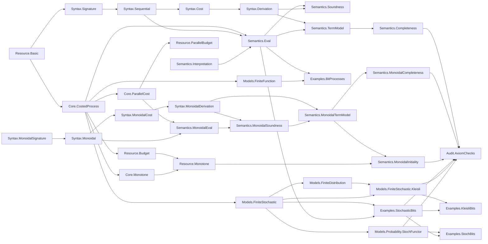

# Ript Formalization Blueprint

This document records only kernel-checked implementation status. Allowed status
values are `DEFINED`, `STATEMENT_FORMALIZED`, `PROVED`, `BLOCKED`, and
`OPEN_RESEARCH`.

## Dependency graph



Every node in this graph is an existing compiled module.

## Stage status

| Stage | Scope | Status |
| --- | --- | --- |
| 0 | Environment, project scaffold, documentation, CI, audit baseline | PROVED |
| 1 | Sequential resource-process vertical slice | PROVED |
| 2 | Tensor, symmetry, parallel resources, and the strict free universal lift | PROVED |
| 3 | Executable finite stochastic model | PROVED |
| 4 | Finite-distribution Kleisli representation | PROVED |
| 5 | Exact finite stochastic channels to Mathlib `Stoch` | PROVED |
| 6-11 | Decision, thermal, quantum, and higher layers | OPEN_RESEARCH |

## Stage-1 flagship theorem records

### `Ript.Resource.budgeted_id`

- Natural-language statement: every categorical identity is available at zero
  resource budget.
- Lean type:

  ```lean
  theorem budgeted_id (X : C) : WithinBudget (0 : R) (𝟙 X)
  ```

- Prerequisites: `HasProcessCost.cost_id`, `WithinBudget`.
- Status: `PROVED`.
- Classical choice: no.
- Computable: yes at the budgeted-data boundary; this theorem supplies proof data.
- Kernel assumptions: `[propext]`.
- Source: `Ript/Resource/Budget.lean`.

### `Ript.Resource.budgeted_comp`

- Natural-language statement: composing processes within budgets `r` and `s`
  yields a process within `r + s`.
- Lean type:

  ```lean
  theorem budgeted_comp {f : X ⟶ Y} {g : Y ⟶ Z}
      (hf : WithinBudget r f) (hg : WithinBudget s g) :
      WithinBudget (r + s) (f ≫ g)
  ```

- Prerequisites: process-cost subadditivity and monotonicity of resource addition.
- Status: `PROVED`.
- Classical choice: no.
- Computable: yes at the budgeted-data boundary; this theorem supplies proof data.
- Kernel assumptions: `[propext, Quot.sound]`.
- Source: `Ript/Resource/Budget.lean`.

### `Ript.Semantics.eval_cost_le`

- Natural-language statement: semantic evaluation never costs more than the
  recursively computed syntax cost.
- Lean type:

  ```lean
  theorem eval_cost_le (interpretation : Interpretation signature C)
      (expression : Expr signature X Y) :
      processCost (eval interpretation expression) ≤ expression.syntaxCost
  ```

- Prerequisites: generator cost bounds, identity cost, composition
  subadditivity, and ordered resource addition.
- Status: `PROVED`.
- Classical choice: no.
- Computable: `eval` and `syntaxCost` are executable; the inequality is proof data.
- Kernel assumptions: `[propext, Quot.sound]`.
- Source: `Ript/Semantics/Eval.lean`.

### `Ript.Semantics.soundness`

- Natural-language statement: every formal category-law derivation evaluates to
  an equality in every interpretation.
- Lean type:

  ```lean
  theorem soundness (interpretation : Interpretation signature C)
      (derivation : Derives f g) : eval interpretation f = eval interpretation g
  ```

- Prerequisites: `Derives`, recursive evaluation, and the ordinary category laws.
- Status: `PROVED`.
- Classical choice: no.
- Computable: proof by structural recursion on a derivation.
- Kernel assumptions: `[propext]`.
- Source: `Ript/Semantics/Soundness.lean`.

### `Ript.Semantics.complete_via_term_model`

- Natural-language statement: equality under the canonical term-model
  interpretation implies a formal derivation.
- Lean type:

  ```lean
  theorem complete_via_term_model
      (h : eval (TermModel.interpretation signature) f =
        eval (TermModel.interpretation signature) g) : Derives f g
  ```

- Prerequisites: derivation setoid, quotient category, and
  `TermModel.eval_interpretation`.
- Status: `PROVED`.
- Classical choice: no.
- Computable: no; deliberately confined to the quotient proof layer.
- Kernel assumptions: `[propext, Quot.sound]`.
- Source: `Ript/Semantics/Completeness.lean`.

### `Ript.Semantics.budget_complete_in_free_model`

- Natural-language statement: in the term model, evaluated cost is exactly the
  syntax cost, so the general semantic upper bound is tight.
- Lean type:

  ```lean
  theorem budget_complete_in_free_model (expression : Expr signature X Y) :
      processCost (eval (TermModel.interpretation signature) expression) =
        expression.syntaxCost
  ```

- Prerequisites: cost invariance under derivation and the canonical term-model interpretation.
- Status: `PROVED`.
- Classical choice: no.
- Computable: no; this is a quotient proof-layer result.
- Kernel assumptions: `[propext, Quot.sound]`.
- Source: `Ript/Semantics/Completeness.lean`.

## Stage-2 flagship theorem records

### `Ript.Resource.budgeted_tensor`

- Natural-language statement: tensoring processes within budgets `r` and `s`
  produces a process within the parallel budget `r + s`.
- Prerequisites: parallel process-cost subadditivity and monotonicity of
  resource addition.
- Status: `PROVED`.
- Classical choice: no.
- Computable: yes at the packaged-budget boundary.
- Kernel assumptions: `[propext, Quot.sound]`.
- Source: `Ript/Resource/ParallelBudget.lean`.

### `Ript.Semantics.monoidalEval_cost_le`

- Natural-language statement: interpreting tensor, composition, generators,
  and structural rewiring never exceeds the recursively computed syntax cost.
- Prerequisites: sequential and parallel cost bounds plus zero-cost
  associators, unitors, and braidings.
- Status: `PROVED`.
- Classical choice: no.
- Computable: evaluation and syntax cost are executable; the bound is proof data.
- Kernel assumptions: `[propext, Quot.sound]`.
- Source: `Ript/Semantics/MonoidalEval.lean`.

### `Ript.Semantics.monoidal_soundness`

- Natural-language statement: every explicit symmetric monoidal derivation is
  respected by every symmetric monoidal interpretation.
- Prerequisites: category, monoidal coherence, braiding naturality, symmetry,
  and the primitive forward and reverse hexagon laws.
- Status: `PROVED`.
- Classical choice: no.
- Computable: proof by structural recursion on the derivation.
- Kernel assumptions: `[propext, Quot.sound]`.
- Source: `Ript/Semantics/MonoidalSoundness.lean`.

### `Ript.Semantics.monoidal_complete_via_term_model`

- Natural-language statement: equality under the canonical symmetric
  monoidal term-model interpretation implies formal derivability.
- Prerequisites: the explicit derivation quotient, distinct wrapped object
  carrier, canonical object comparisons, and exact evaluation-by-quotation.
- Status: `PROVED`.
- Classical choice: no.
- Computable: no; deliberately confined to the quotient proof layer.
- Kernel assumptions: `[propext, Quot.sound]`.
- Source: `Ript/Semantics/MonoidalCompleteness.lean`.

### `Ript.Semantics.monoidal_budget_complete_in_free_model`

- Natural-language statement: monoidal evaluation in the free term model has
  exactly the computed syntax cost.
- Prerequisites: derivation-invariant syntax cost and exact costs for quotient
  composition, tensor, and canonical object comparisons.
- Status: `PROVED`.
- Classical choice: no.
- Computable: no; this is a quotient proof-layer result.
- Kernel assumptions: `[propext, Quot.sound]`.
- Source: `Ript/Semantics/MonoidalCompleteness.lean`.

### `Ript.Semantics.Free.lift_on_generator`

- Natural-language statement: the functor induced by an interpretation agrees
  with that interpretation on every primitive generator.
- Prerequisites: the quotient symmetric monoidal term model, semantic
  soundness, and recursive monoidal evaluation.
- Status: `PROVED`.
- Classical choice: no.
- Computable: the map is executable on raw representatives; quotient
  elimination confines this result to the proof layer.
- Kernel assumptions: `[propext, Quot.sound]`.
- Source: `Ript/Semantics/MonoidalInitiality.lean`.

### `Ript.Semantics.Free.lift_preserves_cost`

- Natural-language statement: the universal functor induced by any legal
  interpretation never increases the resource cost of a process.
- Prerequisites: generator cost bounds, sequential and parallel
  subadditivity, and zero-cost structural rewiring.
- Status: `PROVED`.
- Classical choice: no.
- Computable: the underlying evaluation is executable; the inequality is
  proof data over the quotient term model.
- Kernel assumptions: `[propext, Quot.sound]`.
- Source: `Ript/Semantics/MonoidalInitiality.lean`.

### `Ript.Semantics.Free.lift_unique`

- Natural-language statement: every strict resource-aware symmetric monoidal
  extension agreeing with a given interpretation on generators has exactly
  the same action as the universal lift on every quotient morphism.
- Prerequisites: strict preservation of identity, composition, tensor,
  associators, unitors, braiding, and generators.
- Status: `PROVED`.
- Classical choice: no.
- Computable: no; literal uniqueness is stated at the quotient proof layer.
- Kernel assumptions: `[propext, Quot.sound]`.
- Source: `Ript/Semantics/MonoidalInitiality.lean`.

## Stage-3 flagship theorem records

Stage 3 uses exact nonnegative rationals throughout. A stochastic object bundles
its `Fintype` enumeration and `DecidableEq` procedure as computational data;
the channel definitions contain neither `noncomputable` nor `classical`.

### `Ript.Models.FiniteStochastic.FinStoch.id_apply`

- Natural-language statement: the identity channel is the Dirac stochastic
  matrix, with probability one exactly when input and output agree.
- Lean type:

  ```lean
  theorem id_apply (X : Object) (x y : X) :
      (𝟙 X : X ⟶ X).prob x y = if x = y then 1 else 0
  ```

- Prerequisites: the explicit `DecidableEq` carried by `Object` and the
  category identity definition.
- Status: `PROVED`.
- Classical choice: yes in proof dependencies through Mathlib's generic
  finite-type infrastructure; no choice produces runtime channel data.
- Computable: yes; the matrix entry reduces to an equality test in `ℚ≥0`.
- Kernel assumptions: `[propext, Classical.choice, Quot.sound]`.
- Source: `Ript/Models/FiniteStochastic.lean`.

### `Ript.Models.FiniteStochastic.FinStoch.comp_apply`

- Natural-language statement: sequential channel composition is exactly the
  Chapman–Kolmogorov finite sum over the intermediate carrier.
- Lean type:

  ```lean
  theorem comp_apply (f : X ⟶ Y) (g : Y ⟶ Z) (x : X) (z : Z) :
      (f ≫ g).prob x z = ∑ y, f.prob x y * g.prob y z
  ```

- Prerequisites: explicit finite enumeration of `Y`, exact `ℚ≥0`
  multiplication and addition, and normalized stochastic rows.
- Status: `PROVED`.
- Classical choice: yes in proof dependencies through Mathlib's generic
  finite-sum infrastructure; runtime enumeration is explicit.
- Computable: yes; composition evaluates to a finite exact rational sum.
- Kernel assumptions: `[propext, Classical.choice, Quot.sound]`.
- Source: `Ript/Models/FiniteStochastic.lean`.

### `Ript.Models.FiniteStochastic.FinStoch.tensor_apply`

- Natural-language statement: independent parallel composition multiplies
  the two component probabilities entrywise.
- Lean type:

  ```lean
  theorem tensor_apply (f : FinStoch W X) (g : FinStoch Y Z)
      (input : W × Y) (output : X × Z) :
      (tensor f g).prob input output =
        f.prob input.1 output.1 * g.prob input.2 output.2
  ```

- Prerequisites: product finite types, product-sum factorization, and
  normalization of both channels.
- Status: `PROVED`.
- Classical choice: yes in proof dependencies through Mathlib's generic
  finite-sum infrastructure; product data and multiplication are executable.
- Computable: yes; tensor entries are exact products in `ℚ≥0`.
- Kernel assumptions: `[propext, Classical.choice, Quot.sound]`.
- Source: `Ript/Models/FiniteStochastic.lean`.

### `Ript.Models.FiniteStochastic.FinStoch.dirac_comp`

- Natural-language statement: the Dirac embedding preserves deterministic
  function composition exactly.
- Lean type:

  ```lean
  theorem dirac_comp (f : X → Y) (g : Y → Z) :
      dirac (fun x ↦ g (f x)) = comp (dirac f) (dirac g)
  ```

- Prerequisites: executable equality on the intermediate finite carrier,
  Chapman–Kolmogorov composition, and the single-support finite-sum identity.
- Status: `PROVED`.
- Classical choice: yes in proof dependencies through Mathlib's finite-sum
  theorem; the Dirac channel itself is definitionally executable.
- Computable: yes; both sides evaluate to exact zero-or-one matrices.
- Kernel assumptions: `[propext, Classical.choice, Quot.sound]`.
- Source: `Ript/Models/FiniteStochastic.lean`.

### `Ript.Models.FiniteStochastic.FinStoch.dirac_faithful`

- Natural-language statement: equality of Dirac channels implies equality of
  the deterministic functions that generated them.
- Lean type:

  ```lean
  theorem dirac_faithful {f g : X → Y} (h : dirac f = dirac g) : f = g
  ```

- Prerequisites: matrix extensionality, executable equality on `Y`, and
  `one_ne_zero` in `ℚ≥0`.
- Status: `PROVED`.
- Classical choice: yes in audited proof dependencies; no choice is used by
  the runtime Dirac definition.
- Computable: the Dirac mapping is executable; faithfulness is proof data.
- Kernel assumptions: `[propext, Classical.choice, Quot.sound]`.
- Source: `Ript/Models/FiniteStochastic.lean`.

### `Ript.Models.FiniteStochastic.FinStoch.comp_discard`

- Natural-language statement: every normalized finite stochastic channel is
  causal—following it by discard equals immediate discard.
- Lean type:

  ```lean
  theorem comp_discard (f : FinStoch X Y) :
      comp f (discard Y) = discard X
  ```

- Prerequisites: row normalization, the deterministic discard channel, and
  exact finite summation.
- Status: `PROVED`.
- Classical choice: yes in proof dependencies through Mathlib's finite-sum
  infrastructure; discard and composition remain executable.
- Computable: both channels are executable; equality is proof data.
- Kernel assumptions: `[propext, Classical.choice, Quot.sound]`.
- Source: `Ript/Models/FiniteStochastic.lean`.

## Stage-4 flagship theorem records

Stage 4 represents normalized stochastic-matrix rows as exact finite
distributions. Its Kleisli category is restricted to finite source and target
carriers because the type of all rational distributions on a finite carrier is
generally infinite and therefore is not closed in the finite-object category.

### `Ript.Models.FiniteDistribution.FinDist.pure_bind`

- Natural-language statement: substituting into a point distribution returns
  the distribution selected at that point.
- Lean type:

  ```lean
  theorem pure_bind (x : X) (f : X → FinDist Y) :
      bind (pure x) f = f x
  ```

- Prerequisite definitions: exact normalized `FinDist`, executable `pure`, and
  executable finite-sum `bind`.
- Prerequisite lemmas: `Fintype.sum_ite_eq` and finite-sum simplification over
  exact `ℚ≥0` values.
- Status: `PROVED`.
- Classical choice: yes in proof dependencies through Mathlib's finite-sum
  infrastructure; `pure` and `bind` use explicit runtime finite data.
- Computable: yes; both sides reduce to exact finite mass functions.
- Kernel assumptions: `[propext, Classical.choice, Quot.sound]`.
- Source: `Ript/Models/FiniteDistribution.lean`.

### `Ript.Models.FiniteDistribution.FinDist.bind_pure`

- Natural-language statement: substituting point distributions into an exact
  finite distribution leaves it unchanged.
- Lean type:

  ```lean
  theorem bind_pure (p : FinDist X) : bind p pure = p
  ```

- Prerequisite definitions: `FinDist`, `pure`, and `bind`.
- Prerequisite lemmas: finite-sum elimination for the single nonzero Dirac
  entry and `FinDist.ext`.
- Status: `PROVED`.
- Classical choice: yes in proof dependencies through Mathlib's finite-sum
  infrastructure; no choice produces a distribution value.
- Computable: yes; the equality relates executable exact mass functions.
- Kernel assumptions: `[propext, Classical.choice, Quot.sound]`.
- Source: `Ript/Models/FiniteDistribution.lean`.

### `Ript.Models.FiniteDistribution.FinDist.bind_assoc`

- Natural-language statement: nested exact finite-distribution substitution is
  associative.
- Lean type:

  ```lean
  theorem bind_assoc (p : FinDist W) (f : W → FinDist X)
      (g : X → FinDist Y) :
      bind (bind p f) g = bind p (fun w ↦ bind (f w) g)
  ```

- Prerequisite definitions: normalized `FinDist` and finite-sum `bind`.
- Prerequisite lemmas: distributivity of multiplication over finite sums,
  `Finset.sum_comm`, and associativity of multiplication in `ℚ≥0`.
- Status: `PROVED`.
- Classical choice: yes in proof dependencies through Mathlib's generic finite
  summation; all substituted distributions remain executable.
- Computable: yes; both sides execute as nested finite rational sums.
- Kernel assumptions: `[propext, Classical.choice, Quot.sound]`.
- Source: `Ript/Models/FiniteDistribution.lean`.

### `Ript.Models.FiniteStochastic.kleisliToChannel_channelToKleisli`

- Natural-language statement: converting a stochastic matrix to its family of
  row distributions and back recovers the original channel.
- Lean type:

  ```lean
  theorem kleisliToChannel_channelToKleisli (f : FinStoch X Y) :
      kleisliToChannel (channelToKleisli f) = f
  ```

- Prerequisite definitions: `channelToKleisli`, `kleisliToChannel`, `FinStoch`,
  and `FinDist`.
- Prerequisite lemmas: entrywise extensionality for `FinStoch`.
- Status: `PROVED`.
- Classical choice: yes in audited proof dependencies inherited from the
  finite structures; the conversion functions are definitionally executable.
- Computable: yes; every converted matrix entry is the original exact entry.
- Kernel assumptions: `[propext, Classical.choice, Quot.sound]`.
- Source: `Ript/Models/FiniteStochastic/Kleisli.lean`.

### `Ript.Models.FiniteStochastic.channelToKleisli_kleisliToChannel`

- Natural-language statement: converting a finite-carrier Kleisli morphism to
  a stochastic matrix and back recovers the original family of distributions.
- Lean type:

  ```lean
  theorem channelToKleisli_kleisliToChannel (f : X → FinDist Y) :
      channelToKleisli (kleisliToChannel f) = f
  ```

- Prerequisite definitions: both row/matrix conversions and finite-carrier
  Kleisli morphisms.
- Prerequisite lemmas: function extensionality and `FinDist.ext`.
- Status: `PROVED`.
- Classical choice: yes in audited proof dependencies; no choice is used to
  calculate the converted distributions.
- Computable: yes; conversion reduces entrywise.
- Kernel assumptions: `[propext, Classical.choice, Quot.sound]`.
- Source: `Ript/Models/FiniteStochastic/Kleisli.lean`.

### `Ript.Models.FiniteStochastic.kleisliEquivalence`

- Natural-language statement: exact finite stochastic matrices are
  categorically equivalent to finite-carrier Kleisli morphisms of exact finite
  distributions.
- Lean type:

  ```lean
  def kleisliEquivalence : Object ≌ Kleisli
  ```

- Prerequisite definitions: the finite-carrier Kleisli category,
  `toKleisli`, `fromKleisli`, `unitIso`, and `counitIso`.
- Prerequisite lemmas: the three `FinDist` laws, both conversion inverse
  theorems, and the ordinary category laws.
- Status: `PROVED`.
- Classical choice: yes in proof dependencies through finite sums and
  Mathlib's categorical equivalence infrastructure; the packaged functors map
  morphisms by executable conversions.
- Computable: the two functors and their morphism maps are executable; the
  natural isomorphisms and equivalence laws are proof data.
- Kernel assumptions: `[propext, Classical.choice, Quot.sound]`.
- Source: `Ript/Models/FiniteStochastic/Kleisli.lean`.

## Stage-5 flagship theorem records

Stage 5 is a one-way semantic bridge. The exact `ℚ≥0` matrix model remains the
executable source of truth; `Ript.Models.Probability.StochFunctor` equips each
finite carrier with the discrete measurable space and interprets each row as a
finite weighted sum of Dirac measures in Mathlib. Noncomputability is confined
to this semantic module.

### `Ript.Models.Probability.StochFunctor.rowMeasure_singleton`

- Natural-language statement: the measure assigned to a matrix row gives a
  singleton exactly the corresponding matrix entry, coerced to `ℝ≥0∞`.
- Prerequisites: finite Dirac sums and discrete measurability.
- Status: `PROVED`.
- Computable: semantic proof layer; the source probability remains executable.
- Kernel assumptions: `[propext, Classical.choice, Quot.sound]`.
- Source: `Ript/Models/Probability/StochFunctor.lean`.

### `Ript.Models.Probability.StochFunctor.toKernel_comp`

- Natural-language statement: interpreting exact Chapman–Kolmogorov
  composition equals Mathlib kernel composition.
- Prerequisites: `lintegral_rowMeasure`, `Kernel.comp_apply'`, and exact cast
  preservation for finite sums and products.
- Status: `PROVED`.
- Computable: no; this is the measure-theoretic semantic layer.
- Kernel assumptions: `[propext, Classical.choice, Quot.sound]`.
- Source: `Ript/Models/Probability/StochFunctor.lean`.

### `Ript.Models.Probability.StochFunctor.toStoch_map_dirac`

- Natural-language statement: the bridge sends a finite Dirac matrix to
  Mathlib's deterministic-kernel constructor.
- Prerequisites: discrete measurability and singleton measure extensionality.
- Status: `PROVED`.
- Computable: the source Dirac matrix is executable; its `Stoch` image is semantic.
- Kernel assumptions: `[propext, Classical.choice, Quot.sound]`.
- Source: `Ript/Models/Probability/StochFunctor.lean`.

### `Ript.Models.Probability.StochFunctor.toStoch_map_eq_iff`

- Natural-language statement: two interpreted `Stoch` morphisms are equal if
  and only if their exact source matrices are equal.
- Prerequisites: singleton recovery and injectivity of `ℚ≥0 → ℝ≥0∞`.
- Status: `PROVED`; equivalently, `toStoch` is faithful.
- Computable: equality reflection is proof data.
- Kernel assumptions: `[propext, Classical.choice, Quot.sound]`.
- Source: `Ript/Models/Probability/StochFunctor.lean`.

### `Ript.Models.Probability.StochFunctor.productMeasurableSpace_eq_top`

- Natural-language statement: the product σ-algebra on two finite discrete
  carriers contains every subset and therefore equals `⊤`.
- Prerequisites: finite countability and measurable singletons.
- Status: `PROVED`.
- Computable: proof-layer identification of measurable structures.
- Kernel assumptions: `[propext, Classical.choice, Quot.sound]`.
- Source: `Ript/Models/Probability/StochFunctor.lean`.

### `Ript.Models.Probability.StochFunctor.toStoch_map_tensor`

- Natural-language statement: interpreting independent finite tensor
  composition agrees with Mathlib parallel kernel composition, up to the
  canonical identity-kernel isomorphism between the product and explicit
  discrete measurable structures.
- Prerequisites: `Kernel.parallelComp_apply_prod`, product discreteness, and
  exact preservation of nonnegative-rational multiplication in `ℝ≥0∞`.
- Status: `PROVED`.
- Computable: no; the source tensor is executable, while this comparison lives
  in the semantic `Stoch` layer.
- Kernel assumptions: `[propext, Classical.choice, Quot.sound]`.
- Source: `Ript/Models/Probability/StochFunctor.lean`.

## Design decisions

1. The sequential core remains independently usable. Stage 2 adds a separate
   typed symmetric monoidal syntax rather than changing stage-1 expression and
   interpretation contracts.
2. Costs use an ordered additive commutative monoid interface. No stronger
   lattice or quantale structure is introduced without two concrete consumers.
3. The term model exposes exactly the derivation quotient needed for relative
   completeness; executable syntax remains unquotiented.
4. The nontrivial finite deterministic cost model is fixed to small Lean types
   in stage 1. Universe-polymorphic finite models can be added when a downstream
   model needs them, without changing the process interfaces.
5. The monoidal term model uses a one-field object wrapper instead of a
   reducible alias. This prevents Lean from confusing its quotient category
   instance with Mathlib's existing category on raw free-monoidal object trees.
6. Literal uniqueness is proved for strict resource-aware symmetric monoidal
   extensions, whose object action and structural maps are fixed. Uniqueness
   for arbitrary strong monoidal functors belongs at the monoidal-natural-
   isomorphism level and is not conflated with strict equality.
7. Finite stochastic channels use normalized `ℚ≥0` matrices rather than
   floating point. Objects carry executable enumeration and equality data, so
   channel application, Chapman–Kolmogorov composition, tensor, Dirac, copy,
   discard, and the typed example interpreter all reduce in the kernel.
8. Stage 3 provides an actual category, an independent-product bifunctor, and
   a faithful deterministic Dirac functor. It does not claim a measure-theoretic
   probability monad or generic convex interface; those require later stages.
9. `FinDist` is a normalized mass function over an explicitly finite carrier.
   Its `pure` and `bind` operations are executable and prove the monad laws,
   while the corresponding Kleisli category keeps only finite carriers as
   objects. This is the precise closure boundary for the representation.
10. The Stage-4 result is a category equivalence with explicit functors and
    natural isomorphisms. Tensor, copy, and discard can be transported along
    the equivalence, but are not marked as native Kleisli capabilities until
    their operations and laws receive a dedicated compiled interface.
11. The Stage-5 bridge reuses Mathlib's `Kernel`, `SFinKer`, and `Stoch`; Ript
    does not maintain a parallel measure theory. Exact finite rows are the
    executable source, while finite Dirac measures are their semantic image.
12. The target tensor uses Mathlib's product σ-algebra, whereas the object
    functor uses `⊤` on every finite carrier. Their equality is proved, and the
    morphism theorem is stated through an explicit deterministic identity
    isomorphism rather than relying on hidden definitional equality.
