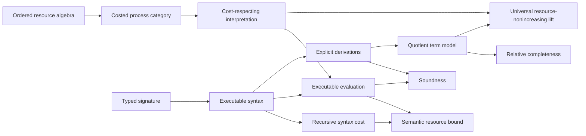

# Ript

**A kernel-checked Lean 4 foundation for resource-indexed process theories.**

[English](README.md) · [简体中文](docs/README.zh-CN.md) ·
[日本語](docs/README.ja.md) · [Esperanto](docs/README.eo.md)

[](https://github.com/miuchan/ript/actions/workflows/ci.yml)


Ript formalizes a small but rigorous core for **Resource-Indexed Information
Process Theory**: typed processes, compositional resource bounds, executable
interpretations, explicit equational derivations, and relative completeness via
canonical term models.

The project deliberately starts below the level of probability, causality,
thermodynamics, quantum theory, or higher categories. Those are research
directions, not current capabilities. Today, Ript provides a checked foundation
on which such layers can be added without silently changing the meaning of
process composition or resource accounting.

> [!IMPORTANT]
> Ript is early-stage research software. Stages 1 and 2 are implemented and
> checked by Lean's kernel; the public API is not yet stable, and no claim is
> made that the current core is a complete theory of physical information.

## Contents

- [Why Ript?](#why-ript)
- [The formal core](#the-formal-core)
- [What is proved](#what-is-proved)
- [Current scope and research status](#current-scope-and-research-status)
- [Architecture](#architecture)
- [Trust model](#trust-model)
- [Quick start](#quick-start)
- [A worked executable example](#a-worked-executable-example)
- [Using Ript as a Lean dependency](#using-ript-as-a-lean-dependency)
- [Repository guide](#repository-guide)
- [Quality gate](#quality-gate)
- [Design principles](#design-principles)
- [Roadmap](#roadmap)
- [Contributing](#contributing)
- [Frequently asked questions](#frequently-asked-questions)
- [Versioning, citation, and license](#versioning-citation-and-license)

## Why Ript?

Many process theories describe **which processes compose**. Resource-sensitive
theories must additionally describe **how much composition costs**, and they
must keep the two stories coherent:

- identity processes should be free;
- serial and parallel composition should have compositional bounds;
- syntax-level estimates should soundly bound the cost of every interpretation;
- equations used to rewrite processes should preserve both semantics and cost;
- executable models should remain usable without importing quotient machinery;
- completeness claims should identify the exact model relative to which they
  hold.

Ript packages these obligations as Lean interfaces and proves the central
relationships once. A downstream model supplies its objects, primitive
processes, interpretation, and cost laws; the generic soundness and resource
theorems then apply to it.

The name **Ript** abbreviates **Resource-Indexed Information Process Theory**.
“Indexed” is meant literally: expressions and morphisms carry typed interfaces,
while budgets live in an explicit ordered additive resource algebra.

## The formal core

### 1. Ordered additive resources

Resource values live in an additive commutative monoid with an order compatible
with addition. Ript intentionally asks for no lattice, subtraction, scalar
action, or quantale structure until a concrete model needs it.

For a costed category `C` and resource type `R`, the basic laws are

```math
\operatorname{cost}(\mathrm{id}_X)=0,
\qquad
\operatorname{cost}(f \mathbin{\gg} g)
\leq \operatorname{cost}(f)+\operatorname{cost}(g).
```

The optional monoidal capability adds

```math
\operatorname{cost}(f \otimes g)
\leq \operatorname{cost}(f)+\operatorname{cost}(g),
```

and the optional structural-cost capability declares associators, unitors, and
symmetry morphisms to be zero-cost rewiring.

### 2. Typed executable syntax

The sequential language contains primitive generators, identities, and serial
composition. Its indices make interface mismatches unrepresentable. The
monoidal language is separate and adds tensor, associators, unitors, inverse
structural maps, and symmetric braiding.

Both languages have a structurally recursive `syntaxCost`. For example,

```math
\operatorname{syntaxCost}(f \mathbin{\gg} g)
=\operatorname{syntaxCost}(f)+\operatorname{syntaxCost}(g).
```

Keeping syntax unquotiented makes construction, evaluation, inspection, and
finite examples directly executable.

### 3. Cost-respecting interpretations

An interpretation maps object symbols to semantic objects and generators to
semantic morphisms, together with a proof that each generator respects its
declared budget. Evaluation is ordinary structural recursion.

The central resource theorem is

```math
\operatorname{cost}(\operatorname{eval}(e))
\leq \operatorname{syntaxCost}(e).
```

Thus a proof that `syntaxCost e ≤ r` yields a checked semantic statement that
`eval e` is within budget `r`.

### 4. Explicit derivations, soundness, and relative completeness

Ript does not identify expressions by definitional equality. It defines an
explicit derivation system generated by category laws, and—at the monoidal
layer—by the symmetric monoidal coherence laws.

- **Soundness:** every formal derivation evaluates to equality in every
  compatible interpretation.
- **Relative completeness:** equality in the canonical term-model
  interpretation implies formal derivability.
- **Budget completeness in the free model:** term-model evaluation has exactly
  the recursively computed syntax cost.
- **Strict free universal property:** every legal interpretation induces a
  strong symmetric monoidal, resource-nonincreasing functor from the term
  model; among strict extensions agreeing on generators, its action is unique.

The word *relative* matters: the completeness theorem is about equality in the
canonical quotient term model, not an unqualified claim about every conceivable
semantic universe.

## What is proved

The following flagship results compile today. The short statements below are
informal summaries; the Lean declarations are authoritative.

| Lean declaration | Checked result |
| --- | --- |
| `Ript.Resource.budgeted_id` | Every identity is available at zero budget. |
| `Ript.Resource.budgeted_comp` | Budgets add under serial composition. |
| `Ript.Semantics.eval_cost_le` | Semantic evaluation is bounded by syntax cost. |
| `Ript.Semantics.budget_sound` | A syntactic budget proof yields a semantic budget proof. |
| `Ript.Semantics.soundness` | Sequential derivations are respected by every interpretation. |
| `Ript.Semantics.complete_via_term_model` | Term-model equality implies sequential derivability. |
| `Ript.Semantics.budget_complete_in_free_model` | Sequential term-model cost equals syntax cost. |
| `Ript.Resource.budgeted_tensor` | Budgets add under tensor composition. |
| `Ript.Semantics.monoidalEval_cost_le` | Monoidal evaluation is bounded by monoidal syntax cost. |
| `Ript.Semantics.monoidal_soundness` | Symmetric monoidal derivations are semantically sound. |
| `Ript.Semantics.monoidal_complete_via_term_model` | Monoidal term-model equality implies derivability. |
| `Ript.Semantics.monoidal_budget_complete_in_free_model` | Monoidal term-model cost equals syntax cost. |
| `Ript.Semantics.Free.lift_on_generator` | The universal lift agrees with the interpretation on generators. |
| `Ript.Semantics.Free.lift_preserves_cost` | The universal lift never increases process cost. |
| `Ript.Semantics.Free.lift_unique` | Every strict structure-preserving extension has the same action as the universal lift. |

Detailed theorem records—including prerequisites, computability, source files,
and kernel assumptions—live in [BLUEPRINT.md](BLUEPRINT.md). The generated
assumption inventory is recorded in [AXIOMS.md](AXIOMS.md).

## Current scope and research status

“PROVED” means that the implementation and named theorem obligations are
accepted by the pinned Lean kernel. It does not mean that a corresponding
scientific interpretation has been experimentally validated or published as a
finished physical theory.

| Stage | Scope | Status |
| --- | --- | --- |
| 0 | Reproducible project, documentation, CI, and audit baseline | **PROVED** |
| 1 | Sequential resource-process core | **PROVED** |
| 2 | Tensor, symmetry, parallel resources, and the strict free universal lift | **PROVED** |
| 3 | Executable finite stochastic model | **OPEN RESEARCH** |
| 4 | Finite-distribution Kleisli representation | **OPEN RESEARCH** |
| 5–11 | Further semantic and higher layers | **OPEN RESEARCH** |

Implemented model support is intentionally narrow:

| Model | Sequential | Tensor | Computability | Notes |
| --- | --- | --- | --- | --- |
| `FintypeCat` with zero cost | Yes | No | Executable | Deterministic finite functions |
| `FiniteFunction.Metered` | Yes | No | Executable | Functions carry explicit natural-number costs |
| Sequential term model | Yes | No | Proof layer | Quotient by explicit category derivations |
| Symmetric monoidal term model | Yes | Yes | Proof layer | Quotient by explicit monoidal derivations |

Copying, discarding, convexity, causality, thermal structure, stochastic
semantics, quantum channels, and univalent or higher-categorical structure are
**not implemented**. See [MODEL_MATRIX.md](MODEL_MATRIX.md) for the canonical
capability matrix and [CONJECTURES.md](CONJECTURES.md) for formally tracked open
statements. There are currently no registered conjectures.

## Architecture

Ript separates executable data from quotient-based proof semantics.



| Layer | Main modules | Responsibility |
| --- | --- | --- |
| Resource interfaces | `Ript.Resource.*` | Ordered budgets, budgeted morphisms, weakening |
| Process capabilities | `Ript.Core.*` | Sequential, tensor, and structural cost laws |
| Executable syntax | `Ript.Syntax.*` | Typed expressions, recursive cost, derivations |
| Semantics | `Ript.Semantics.*` | Interpretations, evaluation, soundness, completeness |
| Concrete models | `Ript.Models.*` | Finite zero-cost and explicitly metered functions |
| Executable examples | `Ript.Examples.*` | Computed behavior and budget checks |
| Audit surface | `Ript.Audit.*` | Declaration lint and kernel-assumption reporting |

The sequential core remains independently usable. The symmetric monoidal layer
extends it through separate interfaces instead of retrofitting tensor
assumptions into every sequential definition.

## Trust model

Ript is designed so that proof trust is inspectable rather than implicit.

- All library theorems are checked by Lean's kernel.
- `sorry`, `admit`, `sorryAx`, custom `axiom`/`constant` declarations, unsafe
  declarations, and `Lean.trustCompiler` are rejected by the quality gate.
- Every implementation module sets `autoImplicit false`.
- Compilation warnings are treated as errors.
- The project imports specific Mathlib modules rather than the umbrella
  `Mathlib` import.
- Flagship theorem assumptions are machine-checked against a documented
  allowlist.
- Unproved research claims belong in `CONJECTURES.md`, never in the theorem
  namespace disguised as completed results.

The current flagship audit reports only Lean's standard `propext` and
`Quot.sound` principles where required. It reports no `Classical.choice`, no
compiler-trust escape, and no placeholder-proof axiom. Quotient dependencies
are confined to the proof-semantic term models; executable syntax and finite
evaluation do not depend on them.

For exact per-theorem output, read [AXIOMS.md](AXIOMS.md) or run:

```bash
lake env lean Ript/Audit/AxiomChecks.lean
```

## Quick start

### Prerequisites

- Git;
- [`elan`](https://github.com/leanprover/elan), the Lean toolchain manager;
- a supported environment for Lean 4 (Linux, macOS, or Windows).

The repository pins both Lean and Mathlib. `elan` reads `lean-toolchain` and
installs Lean `v4.33.0` automatically when needed.

### Clone and build

```bash
git clone https://github.com/miuchan/ript.git
cd ript

# Recommended: download the matching precompiled Mathlib cache.
lake exe cache get

# Compile the complete library with warnings promoted to errors.
lake build
```

The first command involving Lake may download the pinned toolchain and package
dependencies. Subsequent builds reuse the local `.lake` cache.

### Run every project gate

```bash
./scripts/quality-gate.sh
```

A successful run ends with:

```text
All Ript quality gates passed.
```

## A worked executable example

`Ript/Examples/BitProcesses.lean` defines a one-bit signature with Boolean
negation as a primitive generator of cost `1`. It constructs two consecutive
negations and interprets them in both a zero-cost finite-function model and an
explicitly metered model.

The essential expression is:

```lean
def notNot : Expr signature .bit .bit :=
  .comp (.gen .not) (.gen .not)
```

Lean computes and proves both the syntactic and semantic cost:

```lean
example : notNot.syntaxCost = 2 := by decide

example :
    processCost (R := Nat) (eval meteredInterpretation notNot) = 2 := by
  decide
```

Run the checked example directly:

```bash
lake env lean Ript/Examples/BitProcesses.lean
```

Its three executable assertions print:

```text
true
true
true
```

CI compares this output exactly, so an unintended change in executable behavior
fails the quality gate.

## Using Ript as a Lean dependency

Ript exposes the root module `Ript`. During the pre-release phase, pin a known
commit instead of tracking a moving branch:

```lean
require ript from git
  "https://github.com/miuchan/ript.git" @ "<full-commit-sha>"
```

Then import the whole public surface or a narrow module:

```lean
import Ript
-- or, for a smaller dependency boundary:
import Ript.Semantics.Eval
```

The package is currently versioned `0.1.0`, but no stable API or tagged release
is promised yet. Pinning a commit is required for reproducible downstream work.

## Repository guide

| Path | Purpose |
| --- | --- |
| [`Ript/Core/`](Ript/Core/) | Abstract process-cost capabilities |
| [`Ript/Resource/`](Ript/Resource/) | Resource algebras and checked budgets |
| [`Ript/Syntax/`](Ript/Syntax/) | Sequential and symmetric monoidal languages |
| [`Ript/Semantics/`](Ript/Semantics/) | Evaluation, soundness, term models, completeness |
| [`Ript/Models/`](Ript/Models/) | Concrete finite deterministic models |
| [`Ript/Examples/`](Ript/Examples/) | Executable examples |
| [`Ript/Audit/`](Ript/Audit/) | Lint and assumption-audit entry points |
| [BLUEPRINT.md](BLUEPRINT.md) | Dependency graph, stages, theorem records, design decisions |
| [AXIOMS.md](AXIOMS.md) | Current kernel-assumption inventory |
| [MODEL_MATRIX.md](MODEL_MATRIX.md) | Implemented versus planned model capabilities |
| [CONJECTURES.md](CONJECTURES.md) | Formal register of unresolved research statements |
| [CONTRIBUTING.md](CONTRIBUTING.md) | Required development and proof policy |

## Quality gate

Local development and GitHub Actions use the same project-owned checks.

| Gate | Command | What it prevents |
| --- | --- | --- |
| Source hygiene | `scripts/check-source-quality.sh` | Placeholders, custom axioms, unsafe declarations, implicit identifiers, broad imports, trailing whitespace |
| Root coverage | `lake exe mk_all --check` | Lean files that are silently absent from the root library build |
| Kernel build | `lake build` | Type errors and all Lean warnings |
| Declaration lint | `lake env lean Ript/Audit/Lint.lean` | Mathlib declaration-linter regressions |
| Executable contract | `scripts/check-examples.sh` | Changes to the expected finite example results |
| Assumption allowlist | `scripts/check-axioms.sh` | New or undocumented dependencies of flagship theorems |

The `main` branch requires the stable GitHub check named `Lean quality gate`,
including for administrators. Required checks must be current with `main`;
force-pushes and branch deletion are disabled.

## Design principles

1. **Start with the smallest auditable core.** Add algebraic structure only
   when at least one real semantic model needs it.
2. **Make ill-typed processes unrepresentable.** Object indices encode process
   interfaces directly in expression types.
3. **Keep resource laws compositional.** Identity, serial composition, tensor,
   and structural rewiring have explicit, separately reusable contracts.
4. **Separate executable syntax from proof quotients.** Computation should not
   inherit noncomputability merely because completeness uses quotient models.
5. **State the scope of completeness.** All completeness claims name their
   canonical model and proof boundary.
6. **Treat assumptions as versioned API surface.** A theorem acquiring a new
   axiom is a gate failure, not a footnote discovered later.
7. **Distinguish implementation from aspiration.** Planned stochastic, causal,
   thermal, quantum, and higher layers remain visibly marked as open research.

## Roadmap

The roadmap is obligation-driven. A stage advances only when it has compiled
definitions, flagship proofs, executable evidence where appropriate, and an
updated assumption audit.

### Completed foundation

- [x] Ordered additive resource interface
- [x] Lax sequential process costs and checked budgets
- [x] Typed sequential syntax and executable evaluation
- [x] Explicit category-law derivations
- [x] Sequential soundness and term-model relative completeness
- [x] Parallel cost capability and additive tensor budgets
- [x] Typed symmetric monoidal syntax and structural rewiring
- [x] Monoidal soundness and term-model relative completeness
- [x] Strong symmetric monoidal, resource-nonincreasing free lift and strict uniqueness
- [x] Zero-cost and explicitly metered finite deterministic examples
- [x] Reproducible CI, declaration lint, and axiom allowlist

### Open research tracks

- [ ] Executable finite stochastic semantics
- [ ] Finite-distribution Kleisli representation and comparison results
- [ ] Explicit copy/discard capabilities where semantically justified
- [ ] Convex and causal structure
- [ ] Thermal/resource-theoretic models
- [ ] Quantum-channel models
- [ ] Carefully isolated univalent or higher-categorical layers

These checkboxes are not promises of a particular release order. Each addition
must preserve the existing sequential boundary or document a deliberate
breaking change.

## Contributing

Contributions are welcome when they preserve the project's explicit trust and
scope boundaries.

1. Create a branch from the current `main`.
2. Make the smallest coherent change.
3. Add proofs, executable evidence, and documentation together.
4. Run `./scripts/quality-gate.sh`.
5. Open a pull request and wait for `Lean quality gate` to pass.

Before proposing a new semantic layer, describe its required algebraic
capabilities, at least one concrete model, its computability boundary, and the
flagship theorem that would justify the abstraction. Read
[CONTRIBUTING.md](CONTRIBUTING.md) for the enforced policy.

Use [GitHub Issues](https://github.com/miuchan/ript/issues) for reproducible bugs,
proof gaps, documentation problems, and scoped design proposals. Do not include
credentials, secrets, or exploit details in a public issue; the project has not
yet declared a private security-reporting channel.

## Frequently asked questions

### Is Ript a complete theory of information, physics, or computation?

No. It is a formal compositional core for typed processes and additive resource
bounds. The broader scientific layers are intentionally unimplemented.

### Are costs exact?

Not in every semantic model. The generic laws are subadditive, so syntax cost is
a sound upper bound. Cost is proved exact in the canonical sequential and
monoidal term models.

### Does Ript already support probability or quantum channels?

No. Finite stochastic, Kleisli, thermal, causal, and quantum models are roadmap
items. The current executable models are deterministic finite functions.

### Does the monoidal layer imply copying or discarding?

No. Tensor and symmetry alone do not provide diagonal or terminal maps. Copy and
discard must be introduced as explicit capabilities with their own laws.

### Why maintain a separate sequential syntax?

It keeps the smallest useful theory independently executable and prevents every
consumer from inheriting monoidal assumptions. The monoidal syntax is an
extension with a deliberate boundary.

### Why use quotient term models if the syntax is executable?

Executable syntax is ideal for construction and evaluation; quotients express
equality modulo formal derivations. Confined term models provide the exact proof
object needed for relative completeness without contaminating executable code.

### Can I depend on `main`?

You can, but you should not do so for reproducible work. There is no stable API
release yet; pin a full commit SHA.

## Versioning, citation, and license

### Versioning

The Lake package currently declares version `0.1.0`. Until tagged releases and
an explicit stability policy exist, changes may be breaking even when the
package version has not changed.

### Citation

Ript has no archival paper or DOI yet. For research artifacts, cite the
repository URL together with the exact commit SHA used, and archive that commit
in your reproducibility materials. A formal citation file should be added only
when author and publication metadata are settled.

### License

No open-source license has been selected for this repository yet. Public source
availability does **not** by itself grant permission to copy, redistribute, or
create derivative works. Until a license file is added, standard copyright
restrictions apply. This section is intentionally explicit so downstream users
do not infer rights that have not been granted.

## Acknowledgements

Ript is built with [Lean 4](https://lean-lang.org/) and
[Mathlib](https://github.com/leanprover-community/mathlib4). Their category
theory, algebra, tooling, and proof-engineering ecosystems make this project
possible.
