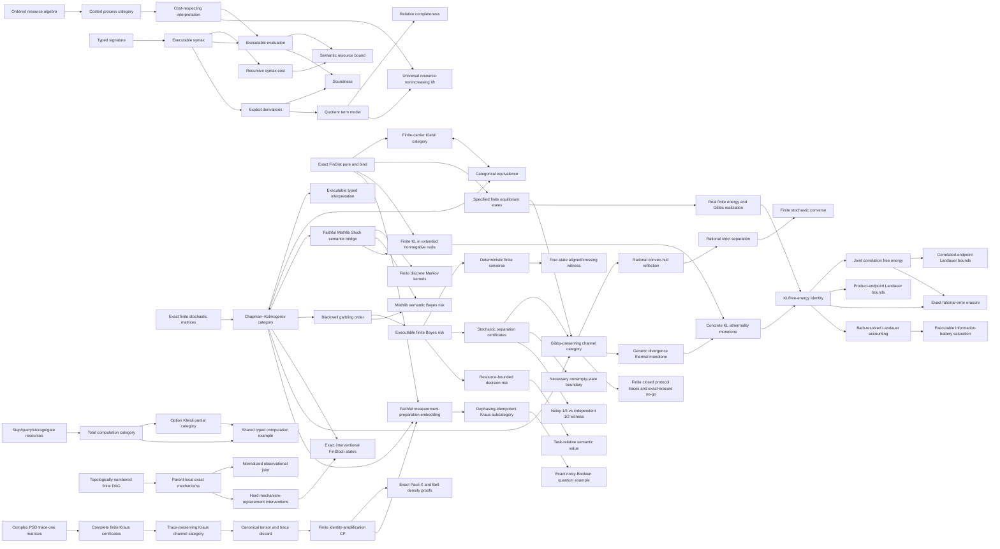

# Ript

**A kernel-checked Lean 4 foundation for resource-indexed process theories.**

[English](README.md) · [简体中文](docs/README.zh-CN.md) ·
[日本語](docs/README.ja.md) · [Esperanto](docs/README.eo.md)

[](https://github.com/miuchan/ript/actions/workflows/ci.yml)


Ript formalizes a small but rigorous core for **Resource-Indexed Information
Process Theory**: typed processes, compositional resource bounds, executable
interpretations, explicit equational derivations, and relative completeness via
canonical term models.

The project builds these layers in a strict order. It now includes an exact,
executable finite stochastic model, its finite-distribution Kleisli
representation, and a faithful semantic bridge into Mathlib's
measure-theoretic category `Stoch`. On top of that bridge, Ript now formalizes
Blackwell comparison, exact executable finite Bayes risk, resource-bounded
decision risk, and task-relative semantic value. It also includes total and
possibly failing computation categories with explicit step, query, storage,
and gate resources. It now also provides executable finite DAG causal models,
parent-local exact mechanisms, normalized observational joints, hard
interventions, and exact `FinStoch` semantics. General measurable-space causal
models remain open. The next compiled layer adds finite thermal systems with
specified equilibrium distributions, a category and tensor bifunctor of
Gibbs-preserving exact channels, free equilibrium preparations, and generic
divergence monotonicity. Finite closed protocols are executable ordered lists
of Gibbs-preserving endomorphisms with proved stepwise/composite semantics,
complete traces, sequential composition, and equilibrium preservation. A
two-flip Boolean cycle is explicit, and a generic theorem proves that no such
closed protocol can move equilibrium to a distinct target. A separate semantic layer now defines finite KL in
`ℝ≥0∞`, proves its exact zero/support-boundary behavior and full data-processing
inequality for every finite stochastic channel, and instantiates concrete KL
athermality monotonicity. A realization layer now equips nonempty finite
systems with real energies and positive inverse temperature, constructs
strictly positive normalized Gibbs probabilities, and certifies when an exact
rational equilibrium realizes them. It defines Shannon entropy, mean energy,
nonequilibrium and equilibrium Helmholtz free energies, proves
`D(p ‖ γ) = β (F(p) - F(γ))`, and derives free-energy-gap monotonicity for
Gibbs-preserving channels at common inverse temperature. Every full-support
exact equilibrium now has a canonical Gibbs realization at any chosen positive
inverse temperature. For an independently specified real spectrum, exact
rational Gibbs probabilities are now classified precisely: after choosing any
reference microstate, they exist if and only if every Boltzmann ratio to that
reference is a positive rational number. Explicit positive rational weights
generate exact executable equilibria, including `(2, 1) -> (2/3, 1/3)` and
`(1, 2, 3) -> (1/6, 1/3, 1/2)`; a spectrum with ratio `sqrt 2` is proved not to
have rational Gibbs probabilities. Independent common-temperature realizations compose, with
factorized weights and probabilities, multiplicative partition functions, and
additive energy, entropy, equilibrium/nonequilibrium free energy, and
free-energy gaps. A work-assisted layer now proves that a Gibbs-preserving
system+battery transition cannot raise system free energy by more than the
battery free-energy decrease; for an entropy-neutral battery this is a work
bound, and erasing a degenerate Boolean memory costs at least `log 2 / β`.
Arbitrary correlated system--battery endpoints are now supported as well:
joint free energy splits into the two marginal gaps plus nonnegative
correlation free energy, which is proved equal to mutual-information KL, and
the Landauer bound carries the exact correlation-change correction.
Exact finite approximate erasure is now covered too: for rational
`0 ≤ ε ≤ 1/2`, the executable target has error mass `ε`, entropy
`binEntropy ε`, and exact excess-free-energy cost
`(log 2 - binEntropy ε) / β`. The cost is nonnegative, decreases with the
allowed error, and appears in both product-endpoint and correlation-corrected
Landauer work bounds.
An explicit finite bath-assisted protocol is now compiled as well. A
deterministic permutation sends `((system, bath), battery)` to
`((battery, bath), system)`: starting from fair system and bath bits plus an
erased information battery, it erases the system exactly, returns the bath
exactly, and leaves the battery fair. The global channel preserves the uniform
Gibbs state, saturates the free-energy Landauer balance at `log 2 / β`, and
has a formally proved battery entropy change. It is therefore an information-
battery witness, not an entropy-neutral mechanical-work cycle.
An independent finite witness realizes the mechanical-work form itself. Its
nondegenerate two-level battery has equilibrium weights `2/3` and `1/3`,
discharges from a pure high-energy state to a pure low-energy state without
changing entropy, erases the fair bit exactly, and supplies exactly
`log 2 / β`. The executable joint channel preserves the product Gibbs state,
so the Landauer work inequality is attained with equality.
A matched exact recharge channel now closes this witness into an executable
two-step cycle. It randomizes erased memory back to equilibrium, raises the
pure battery from low to high by exactly `log 2 / β`, and produces the trace
`fair/high → erased/low → fair/high`. The signed memory and battery balances
cancel, so the construction proves recharge and state return without claiming
net work.
Ript now also has a separate finite-dimensional
quantum core over `ℂ`: positive-semidefinite trace-one density matrices,
operational maps certified by finite complete Kraus families, proved positivity
and trace preservation, identity and composition closure, canonical tensor
products, a basis-bra trace/discard channel with causal uniqueness, a channel
category, complete positivity under every finite identity amplification, a
normalized Bell-density example, and exact Pauli-X single- and two-qubit
proofs. The classical-to-quantum layer is now implemented as a faithful
measurement--preparation functor into the dephasing-idempotent subcategory of
Kraus channels. Its operators are `sqrt(P(y | x)) |y><x|`; identity,
composition, tensor, diagonal-state evolution, and recovery of every
stochastic entry are proved. A full-support reconstruction theorem now proves
the converse for deterministic finite experiments; the converse for arbitrary
stochastic experiments on a nonempty hidden-state carrier is also kernel
proved. Every exact garbling has a compiled rational-simplex representation by
deterministic post-processings. Rational convex-hull reflection, rational strict
separation, and the equivalence between separators and sound finite decision-
separation certificates are proved. A kernel-checked empty-state counterexample
shows the nonempty hypothesis is necessary. The higher-categorical
layer is now compiled: resource-indexed
symmetric monoidal process models, resource-nonincreasing strong braided
monoidal functors, and monoidal natural transformations form a bicategory with
vertical and horizontal composition, interchange, associators, unitors,
pentagon, and triangle coherence. Cost-exact equivalences preserve budgets and
the serial/parallel core laws under an explicit cost-reflection hypothesis.
The first non-groupoidal localization slice is now compiled too. Ript forms
the ordinary homotopy category of the model bicategory by quotienting model
morphisms by invertible monoidal 2-cells. The raw cost-reflecting arrows are
now separated from their explicit closure under invertible 2-cells; a theorem
identifies that saturated bicategorical mark exactly with the classes marked
in the homotopy category. Mathlib's Gabriel--Zisman construction then gives a
genuine `Functor.IsLocalization` instance and the standard functor-category
universal property. The canonical higher-to-ordinary map is formalized as a
pseudofunctor from Mathlib's `Pith`—the maximal locally groupoidal part of the
model bicategory—to the locally discrete localization, and every saturated
marked arrow is proved to map to an isomorphism. A zero-cost discrete marked
arrow is not invertible before localization, so the construction adds a real
formal inverse. Separately, finite deterministic discard is a concrete
noninvertible monoidal 2-cell whose endpoints remain distinct in the homotopy
category. Every pseudofunctor from the full model bicategory to a locally
discrete target is now proved to identify the images of those endpoints.
Ript also compiles the exact untruncated research target: a marked
bicategorical-localization predicate requiring adjoint-equivalence inversion,
biessential factorization of inverting pseudofunctors, and local equivalences
on strong transformations and modifications. Identity precomposition is now
constructed as an adjoint equivalence of pseudofunctors and as an equivalence
on every local category. Consequently, the identity pseudofunctor is a genuine
localization exactly when every marked arrow is already an adjoint
equivalence. The concrete zero-cost marked embedding is not such an
equivalence, so identity is ruled out as Ript's cost-exact localization. A
first genuinely inverse-adjoining slice is now compiled: the walking arrow is
not an equivalence in its locally discrete source, while Mathlib's free
groupoid supplies an explicit inverse, both inverse equations, an ordinary
localization universal property, and induced bicategorical mark inversion.
A parameterized refinement now takes its product with the single-object
bicategory of types and functions. The target is proved non-locally-discrete,
the map is faithful on all source 2-cells, and Boolean discard remains
noninvertible after the walking coordinate is localized. Every pseudofunctor
depending only on the retained coordinate now has an explicit factorization
through the target for every target bicategory, and precomposition is faithful
on every local category. Complementarily, every functor from the walking arrow
to an arbitrary groupoid induces a marking-inverting pseudofunctor of the
localized coordinate with an explicit free-groupoid factorization; its lift
provably sends the formal inverse to the inverse of the generator's image. The
full resource-process construction must still factor arbitrary mixed-coordinate
inverting pseudofunctors and prove local fullness and essential surjectivity for
its native model 2-cells; the existing bridge is therefore not yet a
bicategorical, Dwyer--Kan, simplicial, or Rezk localization.
Stage 11 adds a deliberately small, axiom-free, internally univalent process
universe. Deep codes for empty, unit, sum, tensor, and atomic interfaces carry
separate syntax for structural equivalence and internal identity. Their
semantic quotients form a genuine Mathlib groupoid, internal identity is
equivalent to internal structural equivalence, and a typed process language
with equivalence reindexing has a proved soundness theorem. This is a
1-truncated set-level model: it neither assumes external univalence nor turns
an arbitrary Lean equivalence into Lean equality.
Stage 12 now supplies its first rigorously bounded completion step. A
choice-free object quotient identifies codes exactly when internal identity is
merely inhabited and proves universal descent for invariant maps and internal
predicates. A separate noncomputable Mathlib skeleton retains every
automorphism and is categorically equivalent to the original groupoid. These
are 0/1-truncated foundations, not a claimed Rezk completion.
The presheaf route now has a compiled first layer as well: Yoneda embeds the
internal groupoid fully faithfully into type-valued presheaves, internal
identity and structural equivalence correspond exactly to natural
transformations and natural isomorphisms of representables, and the essential
image forms a groupoid equivalent to the source. This `YonedaEnvelope` remains
an ordinary 1-categorical envelope, not a Rezk completion. Its restricted
Yoneda functor and the skeletal-completion functor are now also proved to be
Mathlib localizations at all internal identity morphisms. Because the source
is already a groupoid, this exact universal property adds no formal inverses;
it is a one-categorical localization base, not the still-open localization of
the full resource-process bicategory.
The internal groupoid now also has a genuine simplicial nerve. Its simplices
are uniquely reconstructed from composable spines, so the nerve is proved
strict Segal, a quasicategory, and 2-coskeletal; vertices, edges, and
composition 2-simplices recover interfaces, internal identities, and path
composition exactly. Its homotopy category is isomorphic to the source
groupoid. A dimension-by-dimension formalization proves that the nerve of
every groupoid is a Kan complex, including explicit inverse-based outer-horn
fillers. The next Rezk-route foundation is also compiled: a genuine
classifying diagram retains categories of composable strings and natural
transformations in an outer simplicial direction, then takes their nerves
vertically. Every vertical level is a groupoid nerve and hence Kan; taking
vertical vertices naturally recovers the strict interface nerve, while
vertical edges are invertible natural transformations. Flipping the two
finite indexing categories naturally identifies every horizontal row with an
ordinary categorical nerve, so every actual outer spine/Segal comparison is
an equivalence in every bidegree. The actual Rezk completeness map is now
defined as the outer zero-degeneracy and proved to be the nerve of an
equivalence of categories. The outer diagram is now naturally presented by
simplex mapping spaces; its
boundary mapping cones are genuine limits and every matching map is a
fibration. These results are now bundled in the exact project-local
`SSet.GroupoidalCompleteSegal` interface: every horizontal row is also Kan,
and the actual completeness map carries a displayed nerve-of-category-
equivalence witness. The pinned Mathlib release has no simplicial-set weak-
equivalence or completed Quillen-model API, so a Mathlib-native standard
complete-Segal-space instance and construction of a pseudofunctor satisfying
the compiled localization universal-property predicate for the full
resource-process bicategory remain open.

> [!IMPORTANT]
> Ript is early-stage research software. The implemented Stage 1–12 foundations, including the
> finite Kraus core, model bicategory, and internally univalent deep universe, are implemented and
> checked by Lean's kernel; the public API is
> not yet stable, and no claim is
> made that the current core is a complete theory of physical information.

## Contents

- [Why Ript?](#why-ript)
- [The formal core](#the-formal-core)
- [What is proved](#what-is-proved)
- [Current scope and research status](#current-scope-and-research-status)
- [Architecture](#architecture)
- [Trust model](#trust-model)
- [Quick start](#quick-start)
- [A worked executable example](#a-worked-executable-example)
- [Using Ript as a Lean dependency](#using-ript-as-a-lean-dependency)
- [Repository guide](#repository-guide)
- [Quality gate](#quality-gate)
- [Design principles](#design-principles)
- [Roadmap](#roadmap)
- [Contributing](#contributing)
- [Frequently asked questions](#frequently-asked-questions)
- [Versioning, citation, and license](#versioning-citation-and-license)

## Why Ript?

Many process theories describe **which processes compose**. Resource-sensitive
theories must additionally describe **how much composition costs**, and they
must keep the two stories coherent:

- identity processes should be free;
- serial and parallel composition should have compositional bounds;
- syntax-level estimates should soundly bound the cost of every interpretation;
- equations used to rewrite processes should preserve both semantics and cost;
- executable models should remain usable without importing quotient machinery;
- completeness claims should identify the exact model relative to which they
  hold.

Ript packages these obligations as Lean interfaces and proves the central
relationships once. A downstream model supplies its objects, primitive
processes, interpretation, and cost laws; the generic soundness and resource
theorems then apply to it.

The name **Ript** abbreviates **Resource-Indexed Information Process Theory**.
“Indexed” is meant literally: expressions and morphisms carry typed interfaces,
while budgets live in an explicit ordered additive resource algebra.

## The formal core

### 1. Ordered additive resources

Resource values live in an additive commutative monoid with an order compatible
with addition. Ript intentionally asks for no lattice, subtraction, scalar
action, or quantale structure until a concrete model needs it.

For a costed category `C` and resource type `R`, the basic laws are

```math
c(\mathrm{id}_X)=0,
\qquad
c(f \mathbin{\gg} g)
\leq c(f)+c(g).
```

The optional monoidal capability adds

```math
c(f \otimes g)
\leq c(f)+c(g),
```

and the optional structural-cost capability declares associators, unitors, and
symmetry morphisms to be zero-cost rewiring.

The same resource information now has a second, proved representation. A cost
function generates nested budget layers by `cost(f) ≤ r`; identities, serial
composition, and—when available—tensor preserve those layers. Conversely, an
`AttainedHomFiltration` with an explicit least admissible budget for every
process reconstructs a lax additive cost. Both round trips are exact:
`costToFiltration_toCost` recovers the original cost, while
`filtrationToCost_toFiltration_of_attained` recovers every original layer.
Storing the attained infimum as data keeps this construction choice-free and
works for discrete resources such as `Nat` without imposing a complete lattice.

Copy and discard are optional rather than hidden in that core.
`DiscardingProcess` selects coherent discards without granting a copying
operation; `ClassicalCopyingProcess` reuses Mathlib's
`CopyDiscardCategory`. The zero-cost finite-function model is now genuinely
cartesian monoidal: tensor is the ordinary product type, `PUnit` is the unit,
the diagonal copies, and the unique map to `PUnit` discards. Every finite
function is proved to preserve both operations and is therefore causal. These
operations remain executable even though the generic categorical coherence
proofs inherit Mathlib's audited classical proof infrastructure.

### 2. Typed executable syntax

The sequential language contains primitive generators, identities, and serial
composition. Its indices make interface mismatches unrepresentable. The
monoidal language is separate and adds tensor, associators, unitors, inverse
structural maps, and symmetric braiding.

Both languages have a structurally recursive `syntaxCost`. For example,

```math
c_{\mathrm{syntax}}(f \mathbin{\gg} g)
=c_{\mathrm{syntax}}(f)+c_{\mathrm{syntax}}(g).
```

Keeping syntax unquotiented makes construction, evaluation, inspection, and
finite examples directly executable.

### 3. Cost-respecting interpretations

An interpretation maps object symbols to semantic objects and generators to
semantic morphisms, together with a proof that each generator respects its
declared budget. Evaluation is ordinary structural recursion.

The central resource theorem is

```math
c(\mathrm{eval}(e))
\leq c_{\mathrm{syntax}}(e).
```

Thus a proof that `syntaxCost e ≤ r` yields a checked semantic statement that
`eval e` is within budget `r`.

### 4. Explicit derivations, soundness, and relative completeness

Ript does not identify expressions by definitional equality. It defines an
explicit derivation system generated by category laws, and—at the monoidal
layer—by the symmetric monoidal coherence laws.

- **Soundness:** every formal derivation evaluates to equality in every
  compatible interpretation.
- **Relative completeness:** equality in the canonical term-model
  interpretation implies formal derivability.
- **Budget completeness in the free model:** term-model evaluation has exactly
  the recursively computed syntax cost.
- **Strict free universal property:** every legal interpretation induces a
  strong symmetric monoidal, resource-nonincreasing functor from the term
  model; among strict extensions agreeing on generators, its action is unique.

The word *relative* matters: the completeness theorem is about equality in the
canonical quotient term model, not an unqualified claim about every conceivable
semantic universe.

### 5. Exact finite stochastic channels

The first probabilistic model uses normalized matrices
`X → Y → ℚ≥0`. Composition is the exact Chapman–Kolmogorov sum, tensor
multiplies independent probabilities, and deterministic functions embed as
Dirac channels through a faithful functor. Objects bundle both enumeration and
decidable equality, so the generic typed evaluator can run fair-coin and noisy
Boolean examples in the kernel without floating-point approximation. Copy and
discard are explicit Dirac channels, and `comp_discard` proves the causal law
for every normalized finite channel.

### 6. Finite-distribution Kleisli representation

`FinDist X` packages an exact normalized mass function `X → ℚ≥0`. Its
executable `pure` and `bind` operations satisfy the left-unit, right-unit, and
associativity laws. Restricting Kleisli objects to the same executable finite
carriers as `FinStoch` gives morphisms `X → FinDist Y` and an actual category.

Explicit row/matrix conversions define functors in both directions between
this category and `FinStoch`. Both morphism conversions are proved inverse,
their object correspondence is definitional, and `kleisliEquivalence` packages
the natural isomorphisms as a categorical equivalence. The restriction is
intentional: the set of rational distributions over a finite carrier is
generally infinite, so it is not itself an object of the finite-carrier base
category required by Mathlib's unrestricted `CategoryTheory.Kleisli`.

### 7. A faithful bridge to Mathlib `Stoch`

`Ript.Models.Probability.StochFunctor` connects the exact executable matrices
to Mathlib's measure-theoretic probability library without replacing the
finite core. Each finite carrier receives the discrete measurable space, and a
matrix row `p : Y → ℚ≥0` becomes the probability measure

```math
\sum_{y \in Y} \uparrow p(y) \; \delta_y.
```

Normalization of the source row proves that this measure has total mass one,
so every `FinStoch` morphism induces a Markov kernel. The resulting `toStoch`
functor preserves identities and Chapman–Kolmogorov composition. It also:

- sends finite Dirac matrices to Mathlib's deterministic kernels;
- is faithful, because singleton masses recover every exact rational matrix
  entry after the injective cast into `ℝ≥0∞`;
- preserves independent tensor composition up to an explicit deterministic
  isomorphism between Mathlib's product measurable object and the same finite
  product equipped directly with the discrete top measurable space.

That last comparison is stated as a commuting diagram in `Stoch`, rather than
as a definitional equality or an undeclared monoidal-functor instance. This
makes the measurable-space identification visible in the theorem statement.
All noncomputability is confined to this semantic bridge; `FinStoch`,
`FinDist`, their compositions, and their examples remain executable exact
`ℚ≥0` data.

### 8. Blackwell comparison and task-relative decision value

An exact finite experiment is a channel `P : Θ ⟶ X` from hidden states to
observations. Ript says that `P` Blackwell-dominates `Q : Θ ⟶ Y` precisely when
there is a stochastic garbling `κ : X ⟶ Y` with

```math
P mathbin{\gg} \kappa = Q.
```

This is an operational simulation order, not an entropy comparison. It is
reflexive and transitive, is preserved by common preprocessing and independent
tensor products, and has a resource-certified variant whose post-processing
budgets compose additively.

Ript supplies two deliberately separated decision layers:

- The semantic layer sends exact finite data through `toStoch` and reuses
  Mathlib's `bayesRisk_le_bayesRisk_comp`. Therefore garbling cannot decrease
  optimal measure-theoretic Bayes risk.
- The executable layer defines `DecisionProblem` with a `FinDist` prior,
  finite actions, and exact `ℚ≥0` loss. `finiteBayesRisk` is a sum of genuine
  `Finset.min'` minima—not an unconditional infimum—and Ript proves that no
  randomized finite decision channel can beat it. This yields an independent
  exact-rational data-processing proof.

The deterministic finite fragment also has a complete converse. Fix any exact
full-support prior and the zero-one task of reconstructing a deterministic
target observation. A deterministic source Blackwell-dominates that target if
and only if its optimal reconstruction risk is no larger than the zero risk of
direct target observation. Equivalently, the target is constant on every fiber
of the source. This extracts an exact post-processing witness without assuming
the general stochastic Blackwell--Sherman--Stein theorem. An executable
four-state example distinguishes an aligned target of risk `0` from a crossing
target of exact risk `1/2`.

For arbitrary finite stochastic experiments on a **nonempty** hidden-state
carrier, Ript proves the exact `FiniteBlackwellShermanStein` theorem: universal
risk order over every finite action carrier, exact prior, and exact loss implies
an exact garbling. The nonempty hypothesis is necessary. A compiled
counterexample with no hidden states makes the decision order vacuous—there is
no normalized prior—while a unit observation still cannot be garbled into an
empty observation carrier.

The finite geometry is now explicit. `independentGarblingLaw` represents every
stochastic garbling exactly as an `ℚ≥0` distribution over deterministic
post-processings, and `deterministicMixtureDominates_iff` identifies dominance
with rational-simplex feasibility. `RationalGarblingSeparator` packages a
signed rational score placing `Q` strictly below every deterministic vertex.
Row-wise shifts plus the uniform exact prior turn any such score into a
nonnegative-rational `DecisionSeparationCertificate`; every decision
certificate conversely produces a rational separator. The geometric bridge is
now kernel checked: a rational point in a finite real convex hull reflects to
the rational convex hull; real Hahn--Banach separation gives a strict real
functional; and density of rational coefficient vectors preserves the finitely
many strict inequalities. This proves rational separation completeness and the
full converse. A genuinely stochastic Boolean certificate executes with risks
`1/4 < 1/2`. The proof is classical and proposition-level; it does not assume a
linear-programming duality axiom or claim an extracted optimizer.

For computational constraints, `DecisionResourceModel` assigns a natural-
number cost to each deterministic decision rule and supplies a zero-cost
fallback. `resourceBayesRisk` minimizes over the finitely enumerated feasible
rules. More budget cannot worsen risk. A `DecisionReduction` must explicitly
prove both that lifted rules lose no decision quality and that their cost grows
by at most a stated additive overhead; the zero-overhead specialization says
free post-processing cannot create resource-bounded value.

Finally,

```math
V(P;\text{task},\text{baseline})
= R(\text{baseline})-R(P)
```

defines semantic value relative to an explicit prior, action space, loss,
baseline experiment, and optional budget. The same channel can therefore have
positive value for one task and zero value for another. Ript proves garbling
monotonicity, invariance under information equivalence, zero value at the
baseline, task irrelevance for zero loss, and budget monotonicity. It does
**not** identify this task-relative quantity with Shannon information.

### 9. Total and partial computation with explicit resources

The first computation resource is `ComputationResource := Fin 4 → Nat`, with
named coordinates for formal steps, oracle queries, a storage bound, and
circuit gates. These are mathematical accounting units, not measured
wall-clock time. Addition and comparison are componentwise, and the executable
`ComputationResource.within` checker has a proof-level soundness theorem.

Two genuine process categories use this resource. `Computation.Total` has
total functions paired with a resource vector. `Computation.Partial` has
functions `X → Option Y`; serial composition is actual `Option` Kleisli
composition, so failure propagates. Both add resources exactly under serial
composition, expose an independent-product bifunctor, prove interchange, and
add parallel resources exactly. This is a bifunctor rather than a claimed
native `MonoidalCategory` instance; packaged associators and unitors remain
future work.

The functor `Partial.ofTotal` embeds every total computation as an
always-successful partial computation and preserves all resource coordinates.
A shared typed query/negation/guard program is interpreted in both models; the
generic `eval_cost_le` theorem and executable budget checks apply to both.

### 10. Finite DAG causal models and hard interventions

`FiniteDAG n` uses `Fin n` nodes and stores a topological certificate directly:
every declared parent has a smaller index than its child. The canonical order
is therefore executable and proved acyclic; constructing a joint distribution
does not rely on a classically chosen topological sort. Any finite DAG can use
this interface after choosing a topological numbering at its boundary.

A `FiniteCausalModel n Value` assigns an exact normalized `FinDist Value`
mechanism to each node. The mechanism receives values only for its declared
parents. Ript multiplies those local conditional masses in topological order,
proves every prefix normalized by induction, and obtains an executable joint
distribution satisfying the observational factorization formula.

An `Intervention` is a partial node assignment. `do(node = value)` replaces
the corresponding local mechanism with `FinDist.pure value`; it is not defined
by conditioning the observational joint. Repeating an intervention is
idempotent, and interventions with disjoint supports commute. Normalization and
factorization are preserved after replacement. Each local mechanism becomes a
`FinStoch` channel from parent assignments to node values, while observational
and interventional joints become exact stochastic states from `Object.unit`.

The executable two-node example has a fair Boolean cause and an effect that
copies it. Observational mismatches have mass zero. After `do(effect = true)`,
the cause remains fair and the previously impossible assignment
`(false, true)` has mass `1/2`. This distinguishes intervention from ordinary
conditioning with exact checked data. The first model intentionally uses a
common finite value type for every node; heterogeneous node carriers and
general do-calculus remain future extensions.

### 11. Finite thermal systems and Gibbs-preserving processes

`ThermalObject` packages an executable finite state space with one exact
normalized `EquilibriumState`. The equilibrium distribution is supplied
operationally: this first layer does not pretend that an energy spectrum,
inverse temperature, or exponential Gibbs formula has already been derived.
Exact distributions evolve through `FinStoch` channels using `FinDist.push`,
and independent systems use product distributions via `FinDist.tensor`.

A `GibbsPreserving X Y` process is a finite stochastic channel `T` satisfying
`T(γX) = γY`. Ript proves that identities are Gibbs-preserving, that these
processes are closed under composition, and that they form a category. Tensor
composition preserves product equilibria and satisfies identity and
interchange, yielding an explicit bifunctor. The distinguished equilibrium of
every object is also constructed as a free state from the thermal tensor unit.

`FiniteClosedProtocol X` adds an explicit finite operational protocol layer.
Its ordered list of Gibbs-preserving endomorphisms can be executed step by
step, emits the complete state trace, and composes to one Gibbs-preserving
process. Lean proves that stepwise execution equals pushforward through that
composite and that concatenating protocols equals serial process composition.
Therefore every finite closed protocol fixes equilibrium, and no distinct
target can be reached from equilibrium without modelling an external resource.
The Boolean example supplies the nonconstant exact cycle
`pure false -> pure true -> pure false`, proves its two-flip composite is the
identity, and proves that no finite closed protocol maps the fair equilibrium
to the erased pure state. This is a closed-system no-go, not a claim that
erasure is impossible when a bath or battery is explicitly included.

The divergence layer is assumption-transparent. `Divergence Value` contains a
state comparison together with its proved stochastic data-processing law. For
every such divergence, Ript proves

```text
D(Tp ‖ γY) ≤ D(p ‖ γX)
```

for every Gibbs-preserving `T`, and packages this result as a
`ThermalMonotone`.

Concrete finite KL is then built separately, without adding an assumption to
that generic theorem. `Ript.Models.Probability.FiniteKL` embeds each exact
rational `FinDist` as its discrete probability measure and specializes
Mathlib's measure-theoretic `InformationTheory.klDiv`. Its codomain is
`ℝ≥0∞`: a positive mass against a zero reference mass therefore gives `∞`, and
distinct point masses are proved to have infinite divergence. The semantic
embedding is injective. Under support containment, the formalization identifies
the Radon--Nikodym density pointwise as the exact rational mass ratio, derives
both the extended-real finite f-divergence sum and the classical real formula
`sum_x p(x) log (p(x) / q(x))`, and proves that `∞` occurs exactly at a support
violation. The uniform Boolean thermal example instantiates the real formula
for every state. Executable pushforward agrees exactly with composition
by the interpreted Markov kernel, and Mathlib's kernel-level theorem yields

```text
KL(Tp ‖ Tq) ≤ KL(p ‖ q)
```

for every exact finite stochastic channel `T`. This proved DPI packages
`finiteKLDivergence`, `klAthermality`, and `klThermalMonotone`; hence the generic
thermal result becomes a concrete theorem. Exact rational states and channels
remain executable, while logarithms, integration, and noncomputability stay in
the analytic semantic layer.

`FiniteGibbsData` adds real energy levels `E`, a positive inverse temperature
`β`, Boltzmann weights, and the finite partition function. Ript proves every
weight and the partition function positive, normalizes the resulting Gibbs
probability, and proves its logarithmic form. `GibbsThermalObject` is a
realization certificate connecting that analytic distribution to the existing
exact rational equilibrium; it does not claim that arbitrary exponential
weights are rational or executable.

Conversely, every exact finite equilibrium with full support has a canonical
realization at every chosen `β > 0`: Ript sets
`E(x) = -log γ(x) / β`, proves that the resulting Boltzmann weight is exactly
`γ(x)`, proves `Z = 1`, and packages the equality certificate. This is an
existence theorem for energy representations of full-support exact
distributions. Independently supplied real spectra are now classified by a
separate exact theorem: for any reference microstate, their normalized Gibbs
probabilities are rational if and only if every relative Boltzmann factor
`exp(-β(E(x) - E(reference)))` is a positive rational number. This statement is
gauge invariant. A constructor from explicit positive rational weights makes
the rational side executable; it produces exact `(2/3, 1/3)` and
`(1/6, 1/3, 1/2)` examples. Conversely, a two-level spectrum with relative
factor `sqrt 2` is proved to have no exact rational Gibbs distribution. Ript
does not claim a general decision procedure for equality between arbitrary
real exponential expressions.

For each realized system the free-energy layer defines mean energy `U(p)`,
Shannon entropy `S(p)`, nonequilibrium Helmholtz free energy
`F(p) = U(p) - S(p) / β`, and `F(γ) = -log Z / β`. Lean then proves

```text
D(p ‖ γ) = β (F(p) - F(γ)).
```

Because Gibbs equilibria have full support, the extended-real KL value is
finite here. Combining this identity with the proved KL data-processing law
shows that a Gibbs-preserving channel between realized systems at the same
inverse temperature cannot increase `F(p) - F(γ)`. At a common inverse
temperature, independent Gibbs systems also tensor exactly: weights and
probabilities factor, partition functions multiply, and `U`, `S`, `F`,
`F(γ)`, and `F - F(γ)` are additive on product states.

`WorkAssistedTransition` then makes a finite Landauer boundary explicit. It
records source, target, and battery endpoint states; common inverse
temperature; a Gibbs-preserving joint channel; and an exact equation saying
that the initial and final states are independent products. Ript proves

```text
system free-energy increase <= battery free-energy decrease.
```

If the battery's initial and final entropies are equal, its free-energy
decrease equals its mean-energy decrease, so the right-hand side is an
explicit supplied-work quantity. For the zero-energy Boolean memory at every
`β > 0`, exact erasure from the uniform equilibrium to `pure false` therefore
requires at least `log 2 / β` of battery mean-energy decrease. The theorem is
a necessary bound for every supplied transition certificate; it does not
claim that such a channel exists or saturates the bound.

`CorrelatedWorkAssistedTransition` removes the product-endpoint restriction.
For every exact joint state, Ript computes both marginals and proves

```text
joint free-energy gap
  = left marginal gap + right marginal gap + mutual information / β.
```

The mutual information is proved equal to finite KL divergence from the joint
state to the product of its marginals, so it and the correlation free energy
are nonnegative. Consequently an arbitrary correlated transition satisfies

```text
system free-energy increase + correlation free-energy increase
  <= battery free-energy decrease.
```

The entropy-neutral battery work form and the Boolean erasure specialization
are proved too. An executable perfectly correlated fair Boolean pair has
`I = log 2` and correlation free energy `log 2 / β`.

`Ript.Examples.ApproximateErasure` supplies the exact rational-error
refinement. For `0 ≤ ε ≤ 1/2`, the executable target assigns probability
`1 - ε` to the intended erased value and `ε` to the error. Lean proves

```text
S(target ε) = binEntropy ε
F(target ε) - F(equilibrium) = (log 2 - binEntropy ε) / β.
```

This cost is nonnegative and antitone in `ε`; its endpoints are the exact
`log 2 / β` cost at `ε = 0` and zero at `ε = 1/2`. Product-endpoint and
arbitrary-correlated-endpoint free-energy/work bounds use this exact quantity,
with the latter also charging the correlation-free-energy increase. The
theorems remain necessary bounds for supplied transition certificates and do
not assert existence or saturation by themselves.

`BathAssistedTransition` adds separate exact system, bath, and battery
endpoints around one global Gibbs-preserving process. Its generic accounting
theorem charges a system free-energy increase to the combined free-energy
decrease of bath and battery. Exact bath return removes the bath term; an
additional entropy-neutrality certificate is still required before battery
free-energy loss may be called mechanical work.

`Ript.Examples.ExplicitBathErasure` supplies a genuine finite existence and
saturation witness for an information battery. The deterministic permutation

```text
((system, bath), battery) -> ((battery, bath), system)
```

maps `(fair, fair, erased)` exactly to `(erased, fair, fair)`. The bath returns
unchanged, the global uniform Gibbs state is preserved, and both the system
free-energy increase and battery free-energy decrease equal `log 2 / β`.
Lean also proves that battery entropy changes from `0` to `log 2`, so this
protocol is deliberately not advertised as an entropy-neutral work-bearing
protocol.

`Ript.Examples.ExactWorkErasure` supplies the complementary mechanical-work
witness without a bath. Its biased Boolean Gibbs battery has a strict energy
gap `E(high) - E(low) = log 2 / β`. A fully executable rational channel maps

```text
(fair memory, pure high battery) -> (erased memory, pure low battery)
```

exactly while preserving the joint equilibrium. Both battery endpoints have
zero Shannon entropy, their mean-energy decrease is `log 2 / β`, and the
memory free-energy increase is the same quantity. Lean therefore proves exact
entropy neutrality, strict nondegeneracy, and equality in the mechanical
Landauer work bound. This is a one-shot discharge protocol; a closed battery
recharge cycle is supplied by `Ript.Examples.ExactWorkCycle`. Its reverse
Gibbs-preserving channel maps `(erased memory, pure low battery)` exactly to
`(fair memory, pure high battery)`, using the memory's `log 2 / β` free-energy
release to recharge the battery by the same amount. Erasure followed by
recharge returns the complete state with exact trace

```text
fair/high -> erased/low -> fair/high.
```

Both steps have entropy-neutral pure battery endpoints and individually attain
the signed Landauer work balance; their system and battery changes sum to zero.
The result is therefore a closed work-storage cycle, not a net-work source.
The exact rationality classification above applies to this battery and to
arbitrary finite real spectra; only algorithmic decision of arbitrary real
exponential equalities remains outside the executable layer.

### 12. Finite complex density matrices and Kraus channels

Quantum systems use their own finite basis object; they are not aliases for
classical finite stochastic objects and do not inherit classical copying. A
`DensityMatrix X` is a complex matrix `ρ : Matrix X X ℂ` with Mathlib's
operator-level `ρ.PosSemidef` proof and exact normalization `trace ρ = 1`.
This is quadratic-form positivity, not entrywise nonnegativity.

A `KrausRepresentation X Y map` supplies finitely many rectangular operators
`Kᵢ : Matrix Y X ℂ`, proves the exact operational equation

```text
map(ρ) = ∑ i, Kᵢ ρ Kᵢᴴ
```

and certifies `∑ i, Kᵢᴴ Kᵢ = I`. Ript derives positivity preservation from
closure of positive-semidefinite matrices under `KρKᴴ` and finite sums. It
derives trace preservation by cyclicity of trace and the completeness
equation. Therefore `KrausChannel.applyDensity` returns a genuine target
density matrix for every input density matrix.

`KrausChannel` stores the operational map directly and only the propositionally
truncated existence of a Kraus certificate. This matters because Kraus
representations are not unique: channel equality compares physical actions,
not arbitrary representation choices. A singleton identity family and all
pairwise products `LⱼKᵢ` prove identity and serial-composition closure; the
resulting channels form a category. The qubit example proves `XᴴX = I` for
Pauli-X and proves that it exchanges the two computational-basis density
matrices exactly.

The tensor construction is extensional in channel action: every Kraus action is
first promoted to its canonical complex-linear map, tensor maps are transported
through Mathlib's matrix/tensor-product linear equivalence, and pairwise
Kronecker Kraus operators certify the result on every matrix. Ript proves
componentwise state evolution, tensor identity, and interchange. Discard is the
trace channel built from basis bras; it is the unique channel into the
one-dimensional system, so every channel obeys the causal discard law.

Complete positivity is now explicit rather than implicit in the Kraus
representation. `IsCompletelyPositive f` quantifies over every finite auxiliary
system `A` and every positive-semidefinite joint matrix on `A × X`; it requires
the identity amplification `id_A ⊗ f` to remain positive. Ript proves that the
canonical amplification is exactly the linear action of `identity A ⊗ channel`,
so every finite Kraus channel satisfies the predicate on arbitrary joint
inputs—not merely on product matrices. This is the ordinary finite-matrix
formulation native to Ript; no unproved equivalence with Mathlib's separate
C\*-algebraic `CompletelyPositiveMap` API is claimed.

The qubit example also constructs the normalized Bell density matrix, proves
positive semidefiniteness and trace one, computes its `|00⟩`/`|11⟩` coherence
entry as `1/2`, and applies the general amplification theorem to Pauli-X on the
second qubit. This is evidence for the full joint-state theorem, not a finite
test standing in for it. A formal nonseparability theorem is not claimed. The
classical extension constructs the Kraus operator
`sqrt(P(y | x)) |y><x|` for every stochastic transition and proves the
completeness equation. It maps exact diagonal states to exact stochastic
pushforwards, preserves composition and tensor, and is faithful. Since a
stochastic identity maps to complete basis dephasing rather than the identity
on arbitrary quantum coherences, the functor honestly targets the
dephasing-idempotent (Karoubi-style) subcategory of Kraus channels. Its
categorical identity is dephasing; no incompatible functor into the full
ambient Kraus category is claimed.

### 13. An axiom-free internally univalent process universe

The Stage-11 layer is deeply embedded and intentionally one-way. `Code Atom`
is a small grammar of process interfaces. `EquivExpr A B` describes the
structural equivalences admitted by that grammar, while `PathExpr A B`
describes internal identity witnesses and has an explicit `ua` constructor.
Neither type is Lean equality. Both interpret to ordinary equivalences between
the small Lean types denoted by their endpoint codes.

For a chosen `UniverseModel`, Ript quotients equivalence and identity syntax by
equality of those interpretations. The resulting `InternalEquiv A B` and
`Identity A B` support reflexivity, inverse, composition, sum, and tensor. The
wrapped code objects form a Mathlib `Groupoid`, and the central theorem is

```lean
internalUnivalence (A B) : M.Identity A B ≃ M.InternalEquiv A B
```

Both round trips are proved. Equality in either quotient is also characterized
exactly by equality of its external interpretation. An `InternalFamily`
transports structure along internal equivalences, an `InternalPredicate` must
state its equivalence invariance explicitly, and the indiscernibility theorem
then proves that internally identical interfaces have the same observations.
For deterministic process spaces this transport is constructed concretely by
conjugating a function with the interpreted source and target equivalences.

The companion deep process language contains generators, identity, serial and
parallel composition, and endpoint reindexing. Its explicit derivation system
includes category laws, tensor interchange, congruence, and reindexing laws;
`ProcessDerives.soundness` proves every derivable equation valid in every
deterministic universe interpretation. The Boolean example makes the boundary
visible: `bit ⊗ unit` and `unit ⊗ bit` are provably unequal Lean syntax
trees, yet tensor symmetry gives an internal identity, transports negation,
acts as the expected swap, and is indistinguishable to invariant predicates.

This construction is an honest small, set-level, 1-truncated semantic model.
It does **not** provide an `(infinity,1)`-category, higher path coherence, a
presheaf or simplicial model, Rezk completion, external structure identity, or
a theorem `Equiv α β → α = β`. Those remain separate research
obligations rather than hidden assumptions.

### 14. Truncated completion and universal descent

Stage 12 begins with two constructions whose different trust and
computability boundaries are explicit. `ObjectCompletion` is the quotient of
raw interface codes by `Nonempty (M.Identity A B)`. It requires no chosen
representative: equality of completed objects is equivalent to mere internal
identity and, by `internalUnivalence`, to mere internal structural
equivalence. Sum and tensor descend to the quotient, where symmetry,
associativity, and unit laws become literal equalities.

This quotient has a compiled universal property:

```lean
objectCompletionUniversal (β) :
  (M.ObjectCompletion → β) ≃ M.InvariantMap β

internalPredicateCompletionEquiv :
  (M.ObjectCompletion → Prop) ≃ M.InternalPredicate
```

Thus executable data leaves the quotient only after its raw-code map supplies
an identity-invariance proof; no representative is selected. The Boolean
example descends exact code cardinality and evaluates
`bit + (bit tensor bit)` to `6`. It also proves that tensor-symmetric
presentations are equal after completion while remaining unequal raw Lean
syntax.

`SkeletalCompletion` is deliberately separate. It reuses Mathlib's skeleton
of the internal groupoid, is itself a skeletal groupoid, retains all
automorphisms, and is equivalent to the original groupoid. Restriction along
that equivalence yields

```lean
skeletalCompletionUniversal (E) :
  (M.SkeletalCompletion ⥤ E) ≌ (M.Object ⥤ E)
```

Mathlib chooses skeleton representatives, so this categorical layer is marked
`noncomputable` and its audited theorems include `Classical.choice`. The
choice-free object universal properties do not. Neither construction supplies
higher paths, complete Segal coherence, presheaf localization, external
univalence, or a Rezk completion of the resource-process bicategory.

### 15. Representable presheaves and the Yoneda envelope

The internal groupoid now has a genuine type-valued presheaf semantics:

```lean
PresheafUniverse M := M.Objectᵒᵖ ⥤ Type u

yonedaEmbeddingFullyFaithful :
  M.yonedaEmbedding.FullyFaithful
```

Evaluating the representable at `A` on an interface `B` returns precisely the
internal identity type `M.Identity B A`. Full faithfulness upgrades this
pointwise observation to exact equivalences:

```lean
representableTransformationEquiv (A B) :
  M.Identity A B ≃
    (M.representablePresheaf A ⟶ M.representablePresheaf B)

representableNaturalIsoEquiv (A B) :
  M.Identity A B ≃
    (M.representablePresheaf A ≅ M.representablePresheaf B)

representableEquivNaturalIsoEquiv (A B) :
  M.InternalEquiv A B ≃
    (M.representablePresheaf A ≅ M.representablePresheaf B)
```

Every natural transformation between these representables is invertible: the
Yoneda embedding is fully faithful and the source is already a groupoid.
Identity composition maps to natural-transformation composition, so this is a
structure-preserving correspondence rather than an object-counting analogy.

`YonedaEnvelope` is the full subcategory of presheaves isomorphic to a
representable. Yoneda factors through it, the restricted functor is an
equivalence, the envelope inherits a groupoid structure, and for every target
category `E`:

```lean
yonedaEnvelopeUniversal (E) :
  (M.YonedaEnvelope ⥤ E) ≌ (M.Object ⥤ E)

yonedaEnvelopeLocalizationUniversal (E) :
  (M.YonedaEnvelope ⥤ E) ≌
    M.InterfaceIdentities.FunctorsInverting E
```

The second equivalence is Mathlib's canonical localization universal
property. `InterfaceIdentities` is the top morphism property on `M.Object`,
and Ript proves it equals `MorphismProperty.isomorphisms M.Object`. Every
functor from this already-groupoidal source therefore inverts it. Both
`toSkeletalCompletion M` and `toYonedaEnvelope M` carry actual
`Functor.IsLocalization` instances, so the displayed forward functors are
precomposition with those concrete completion maps rather than unrelated
equivalences of categories.

The Boolean example sends tensor symmetry to a natural transformation,
evaluates it on the source identity to recover the original internal path,
and constructs the corresponding envelope isomorphism while retaining the
proof that the raw codes are unequal.

This layer has an explicit classical boundary. The pinned Mathlib declarations
`CategoryTheory.yoneda` and `Yoneda.fullyFaithful` themselves audit as
`[propext, Classical.choice, Quot.sound]`; essential-image equivalence also
chooses representing witnesses. No such value flows into executable syntax or
finite models. The envelope does not make isomorphic presheaves externally
equal and by itself supplies no complete Segal condition, higher localization,
or external univalence. The ordinary localization result above is deliberately
limited to inverting all morphisms of a source that is already a groupoid; it
does not establish presheaf, Rezk, or resource-process localization.

### 16. The Kan simplicial nerve

The internal groupoid now has an actual simplicial-set presentation:

```lean
InterfaceNerve M := CategoryTheory.nerve M.Object

interfaceNerveStrictSegal :
  SSet.StrictSegal M.InterfaceNerve

interfaceNerveSegalEquiv (n) :
  M.InterfaceNerve _⦋n⦌ ≃ M.InterfaceNerve.Path n

interfaceNerveKanComplex :
  SSet.KanComplex M.InterfaceNerve

interfaceNerveHornFiller (hornMap) :
  Δ[n + 1] ⟶ M.InterfaceNerve
```

Thus every `n`-simplex is reconstructed uniquely from its length-`n` spine of
composable edges. Mathlib's proved consequences give both a `Quasicategory`
instance and `SimplicialObject.IsCoskeletal M.InterfaceNerve 2`: higher
simplices contain no extra data beyond the 2-truncation.

The low-dimensional interpretation is exact rather than suggestive:

```lean
interfaceNerveEdgeEquiv (A B) :
  M.InterfaceNerve.Edge
      (M.interfaceNerveVertex A) (M.interfaceNerveVertex B) ≃
    M.Identity A B

interfaceNerveEquivEdgeEquiv (A B) :
  M.InterfaceNerve.Edge
      (M.interfaceNerveVertex A) (M.interfaceNerveVertex B) ≃
    M.InternalEquiv A B
```

Two composable internal identities produce an explicit 2-simplex. Its second
and zeroth faces are the input edges, while its middle face is their internal
composition. Every edge is reversible because the source is a groupoid; an
edge followed by its inverse bounds a 2-simplex whose composite face is the
degenerate reflexivity edge.

The nerve retains precisely the original 1-categorical homotopy information:

```lean
interfaceNerveHomotopyCategoryIso :
  SSet.hoFunctor.obj M.InterfaceNerve ≅ Cat.of M.Object
```

In the Boolean example, tensor symmetry is decoded both as the original
internal path and as its structural equivalence. The forward edge and its
inverse form a cancellation 2-simplex, strict Segal reconstruction returns
that simplex exactly, and the externally unequal tensor code trees remain
connected by an edge.

The complete horn-filling proof lives in
`Ript/ForMathlib/AlgebraicTopology/GroupoidNerve.lean`. One-dimensional horns
use degenerate identities; two-dimensional outer horns use inverses;
three-dimensional outer horns use cancellation by an isomorphism; inner horns
use the strict-Segal quasicategory theorem; and dimensions at least four are
reconstructed from horn spines and consecutive triangles. The Boolean example
exposes a zeroth outer horn whose omitted edge is the inverse tensor symmetry
and verifies that the chosen Kan filler restricts to that horn.

The trust boundary is explicit. The pinned Mathlib strict-Segal,
quasicategory, coskeletal, and nerve-adjunction declarations audit as
`[propext, Classical.choice, Quot.sound]`; this downstream semantic footprint
does not enter executable syntax. The new groupoid-nerve Kan theorem and its
chosen filler audit with the same exact footprint. The construction proves no
complete-Segal condition, presheaf localization, external univalence, or Rezk
completion.

## The Rezk classifying-diagram foundation

The strict nerve has one simplicial direction and therefore does not retain
the natural transformations between entire composable strings. The
classifying diagram adds that missing direction without changing any upstream
model:

```lean
interfaceClassifyingDiagramCat M : SimplicialObject Cat

InterfaceClassifyingDiagram M : SimplicialObject SSet
```

At outer degree `n`, the first object is the category
`ComposableArrows M.Object n`, whose objects are functors
`Fin (n + 1) ⥤ M.Object` and whose morphisms are natural transformations.
Outer faces and degeneracies act by precomposition. Applying
`CategoryTheory.nerveFunctor` levelwise produces the vertical simplicial
direction, so this is a genuine bisimplicial classifying diagram rather than
another alias for the ordinary nerve.

Every component of every natural transformation lies in the internal
interface groupoid. The transformation is therefore invertible, and every
vertical level is the nerve of a groupoid. Ript proves, uniformly in the outer
simplex `Δ`, that it is Kan, strict Segal, a quasicategory, and 2-coskeletal:

```lean
interfaceClassifyingDiagramLevelStrictSegal M Δ :
  SSet.StrictSegal ((InterfaceClassifyingDiagram M).obj Δ)

interfaceClassifyingDiagramLevelKan M Δ :
  SSet.KanComplex ((InterfaceClassifyingDiagram M).obj Δ)
```

The entire outer simplicial object now has a kernel-checked mapping-space
presentation, natural in every face and degeneracy. Its boundary mapping cone
is a genuine categorical limit, the matching map is exactly the universal
lift into that limit, and every matching map is a fibration:

```lean
interfaceClassifyingDiagramMappingSpaceNaturalIso M :
  InterfaceClassifyingDiagram M ≅
    SSet.simplexMappingDiagram M.InterfaceNerve

interfaceClassifyingDiagramBoundaryMatchingConeIsLimit M n :
  Limits.IsLimit (interfaceClassifyingDiagramBoundaryMatchingCone M n)

interfaceClassifyingDiagramBoundaryMatchingMap_eq_limitLift M n :
  (interfaceClassifyingDiagramBoundaryMatchingConeIsLimit M n).lift
      (interfaceClassifyingDiagramBoundaryRestrictionCone M n) =
    interfaceClassifyingDiagramBoundaryMatchingMap M n

interfaceClassifyingDiagramBoundaryMatchingMap_fibration M n :
  Fibration (interfaceClassifyingDiagramBoundaryMatchingMap M n)
```

The proof identifies `nerve (Fin (n + 1) ⥤ M.Object)` with
`Map(Δ[n], N(M.Object))`, including the necessary universe-lift isomorphism,
and proves compatibility with arbitrary simplex morphisms. Presheaf density
presents `∂Δ[n]` as a colimit of representables; the braided closed internal
Hom sends that colimit to a limit, proving that
`Map(∂Δ[n], N(M.Object))` has the required matching-object universal property.
Finally, the simplicial pushout-product theorem applied to
`∂Δ[n] ↪ Δ[n]` proves the matching map is a fibration. The bundled
`SSet.BoundaryReedyFibrant` structure records exactly these three facts and is
instantiated for the interface classifying diagram. The pinned Mathlib release
does not expose a Reedy model structure or functor-category matching-object
API, so Ript does not claim a Mathlib-native `Reedy` instance.

The comparison to the earlier construction is natural, not only degreewise:

```lean
interfaceClassifyingDiagramVerticalVerticesIso M :
  InterfaceClassifyingDiagramVerticalVertices M ≅ M.InterfaceNerve
```

Thus taking vertical 0-simplices commutes with every outer face and degeneracy
map. In outer degree `n`, vertical edges are exactly natural transformations
between ordinary `n`-simplices. Their components are internal identities,
their inverses are constructed explicitly, both cancellation laws are proved,
and reversing a vertical edge decodes exactly to the inverse natural
transformation.

The outer comparison is now also formalized uniformly. Evaluating the vertical
direction in degree `k` gives a horizontal simplicial set, and flipping
`Fin (n + 1)` with `Fin (k + 1)` identifies that row naturally with the nerve
of `ComposableArrows M.Object k`:

```lean
interfaceClassifyingDiagramHorizontalRowIso M k :
  InterfaceClassifyingDiagramHorizontalRow M k ≅
    CategoryTheory.nerve (ComposableArrows M.Object k)

interfaceClassifyingDiagramOuterSegalEquiv M k n :
  (InterfaceClassifyingDiagramHorizontalRow M k) _⦋n⦌ ≃
    (InterfaceClassifyingDiagramHorizontalRow M k).Path n

interfaceClassifyingDiagramCompletenessMap M :
  InterfaceClassifyingDiagramObjectSpace M ⟶
    InterfaceClassifyingDiagramEquivalenceSpace M

interfaceClassifyingDiagramCompletenessMap_eq_nerveMap M :
  interfaceClassifyingDiagramCompletenessMap M =
    CategoryTheory.nerveMap
      (interfaceClassifyingDiagramCompletenessEquivalence M).functor

interfaceClassifyingDiagramHorizontalRowKan M k :
  SSet.KanComplex (InterfaceClassifyingDiagramHorizontalRow M k)

interfaceClassifyingDiagramCompletenessNerveEquivalenceWitness M :
  SSet.NerveEquivalenceWitness
    (interfaceClassifyingDiagramCompletenessMap M)

interfaceClassifyingDiagramGroupoidalCompleteSegal M :
  SSet.GroupoidalCompleteSegal (InterfaceClassifyingDiagram M)
```

The forward map of the second equivalence is proved to be the actual spine
map. Thus the outer Segal condition holds strictly, degree by degree, rather
than only up to an unspecified weak equivalence.

This is the standard classifying-diagram construction on the internal
groupoid and a real step beyond the strict nerve. Every horizontal arrow is
invertible, so the equivalence subspace is the whole outer degree-one space.
The actual outer zero-degeneracy is definitionally the nerve of the forward
functor in an explicit equivalence
`ComposableArrows M.Object 0 ≌ ComposableArrows M.Object 1`. This proves the
Rezk completeness comparison at nerve-of-category-equivalence strength. The
natural matching-space presentation, matching-limit universal property, and
matching-map fibrations provide a complete project-local boundary
Reedy-fibrancy witness. Moreover, every horizontal row is the Kan nerve of a
groupoid. `SSet.GroupoidalCompleteSegal` packages those exact data with the
strict outer Segal structure and a `SSet.NerveEquivalenceWitness` for the
actual completeness map. This is a proved project-local groupoidal
complete-Segal interface, not an alias for a missing library theorem. The
pinned Mathlib source explicitly leaves the simplicial-set Quillen model
structure unfinished and provides no weak-equivalence class, so Ript does not
claim a Mathlib-native standard complete-Segal-space instance. A localization
universal property for the full resource-process bicategory is also not
claimed. The audited declarations use exactly
`[propext, Classical.choice, Quot.sound]`, inherited from quotient semantics
and generic category/nerve infrastructure; no project axiom or executable
choice-derived value is introduced.

## What is proved

The following flagship results compile today. The short statements below are
informal summaries; the Lean declarations are authoritative.

| Lean declaration | Checked result |
| --- | --- |
| `Ript.Resource.budgeted_id` | Every identity is available at zero budget. |
| `Ript.Resource.budgeted_comp` | Budgets add under serial composition. |
| `Ript.Core.CausalProcess.comp` | Causal processes are closed under serial composition. |
| `Ript.Models.FiniteFunction.tensor_apply` | Cartesian tensor applies finite functions componentwise. |
| `Ript.Models.FiniteFunction.copy_natural` | Every finite function commutes with diagonal copy. |
| `Ript.Models.FiniteFunction.discard_natural` | Every finite function commutes with discard. |
| `Ript.Models.FiniteFunction.copy_coassociative` | Diagonal copy satisfies the categorical coassociativity law. |
| `Ript.Models.FiniteFunction.copy_commutative` | Diagonal copy is invariant under swapping its outputs. |
| `Ript.Models.FiniteFunction.causal` | Every finite deterministic function is causal. |
| `Ript.Resource.costToFiltration_toCost` | Least-budget reconstruction returns the original process cost. |
| `Ript.Resource.filtrationToCost_toFiltration_of_attained` | Reconstructed cost inequalities recover every attained filtration layer. |
| `Ript.Resource.filtrationToCost_comp` | Reconstructed costs are subadditive under serial composition. |
| `Ript.Resource.filtrationToCost_tensor` | Tensor-compatible filtrations reconstruct parallel-subadditive costs. |
| `Ript.Semantics.eval_cost_le` | Semantic evaluation is bounded by syntax cost. |
| `Ript.Semantics.budget_sound` | A syntactic budget proof yields a semantic budget proof. |
| `Ript.Semantics.soundness` | Sequential derivations are respected by every interpretation. |
| `Ript.Semantics.complete_via_term_model` | Term-model equality implies sequential derivability. |
| `Ript.Semantics.budget_complete_in_free_model` | Sequential term-model cost equals syntax cost. |
| `Ript.Resource.budgeted_tensor` | Budgets add under tensor composition. |
| `Ript.Semantics.monoidalEval_cost_le` | Monoidal evaluation is bounded by monoidal syntax cost. |
| `Ript.Semantics.monoidal_soundness` | Symmetric monoidal derivations are semantically sound. |
| `Ript.Semantics.monoidal_complete_via_term_model` | Monoidal term-model equality implies derivability. |
| `Ript.Semantics.monoidal_budget_complete_in_free_model` | Monoidal term-model cost equals syntax cost. |
| `Ript.Semantics.Free.lift_on_generator` | The universal lift agrees with the interpretation on generators. |
| `Ript.Semantics.Free.lift_preserves_cost` | The universal lift never increases process cost. |
| `Ript.Semantics.Free.lift_unique` | Every strict structure-preserving extension has the same action as the universal lift. |
| `Ript.Models.FiniteStochastic.FinStoch.id_apply` | Identity channels are exact Dirac matrices. |
| `Ript.Models.FiniteStochastic.FinStoch.comp_apply` | Composition obeys the Chapman–Kolmogorov formula. |
| `Ript.Models.FiniteStochastic.FinStoch.tensor_apply` | Tensor multiplies independent exact probabilities. |
| `Ript.Models.FiniteStochastic.FinStoch.dirac_comp` | The Dirac embedding preserves deterministic composition. |
| `Ript.Models.FiniteStochastic.FinStoch.dirac_faithful` | Distinct deterministic functions have distinct Dirac channels. |
| `Ript.Models.FiniteStochastic.FinStoch.comp_discard` | Every normalized finite channel is causal under discard. |
| `Ript.Models.FiniteStochastic.FinStoch.mix_idem` | Mixing a channel with itself leaves it unchanged. |
| `Ript.Models.FiniteStochastic.FinStoch.mix_postcomp` | Postcomposition distributes over exact convex mixing. |
| `Ript.Models.FiniteStochastic.FinStoch.mix_precomp` | Precomposition distributes over exact convex mixing. |
| `Ript.Models.FiniteStochastic.FinStoch.mix_tensor_left` | Convex mixing distributes through the left factor of independent tensor. |
| `Ript.Examples.ConvexChannels.fairIdentityOrNot_apply` | A fair choice between Boolean identity and negation produces an exact fair output. |
| `Ript.Models.FiniteDistribution.FinDist.pure_bind` | Point distributions are left units for finite-distribution bind. |
| `Ript.Models.FiniteDistribution.FinDist.bind_pure` | Point distributions are right units for finite-distribution bind. |
| `Ript.Models.FiniteDistribution.FinDist.bind_assoc` | Exact finite-distribution bind is associative. |
| `Ript.Models.FiniteStochastic.kleisliToChannel_channelToKleisli` | Matrix-to-Kleisli conversion is inverted by the reverse conversion. |
| `Ript.Models.FiniteStochastic.channelToKleisli_kleisliToChannel` | Kleisli-to-matrix conversion is inverted by the reverse conversion. |
| `Ript.Models.FiniteStochastic.kleisliEquivalence` | `FinStoch` is equivalent to the finite-carrier Kleisli category of `FinDist`. |
| `Ript.Models.Probability.StochFunctor.rowMeasure_singleton` | Singleton mass of an interpreted row recovers the exact source matrix entry. |
| `Ript.Models.Probability.StochFunctor.toKernel_comp` | Exact Chapman–Kolmogorov composition becomes Mathlib kernel composition. |
| `Ript.Models.Probability.StochFunctor.toStoch_map_dirac` | Dirac matrices become deterministic `Stoch` kernels. |
| `Ript.Models.Probability.StochFunctor.toStoch_map_eq_iff` | The `Stoch` interpretation is faithful on exact finite channels. |
| `Ript.Models.Probability.StochFunctor.productMeasurableSpace_eq_top` | A product of finite discrete measurable spaces is again discrete. |
| `Ript.Models.Probability.StochFunctor.toStoch_map_tensor` | Independent tensor composition is preserved through the canonical comparison isomorphism. |
| `Ript.Core.Simulates.trans` | Post-processing simulation is transitive. |
| `Ript.Core.SimulatesWithin.trans` | Resource-certified simulations compose with additive budgets. |
| `Ript.Models.Decision.Blackwell.dominates_tensor` | Independent products preserve Blackwell dominance. |
| `Ript.Models.Decision.Blackwell.semanticBayesRisk_mono` | Blackwell dominance implies Mathlib's Bayes-risk order. |
| `Ript.Models.Decision.FiniteRisk.finiteBayesRisk_le_randomizedDecisionRisk` | No randomized finite rule beats the computed finite optimum. |
| `Ript.Models.Decision.FiniteRisk.finiteBayesRisk_mono` | Garbling cannot improve exact executable finite Bayes risk. |
| `Ript.Models.Decision.DeterministicBlackwell.deterministic_dominates_iff_reconstructionRisk_le` | Full-support target-reconstruction risk characterizes deterministic finite Blackwell dominance. |
| `Ript.Models.Decision.DeterministicBlackwell.deterministic_dominates_iff_fiber_refines` | Deterministic dominance is exactly target constancy on source fibers. |
| `Ript.Examples.DeterministicBlackwell.block_not_dominates_crossing` | Exact crossing risk `1/2` rules out every source-to-target garbling in the four-state example. |
| `Ript.Models.Decision.Separation.DecisionSeparationCertificate.not_dominates` | Any strict finite decision certificate rules out every stochastic garbling. |
| `Ript.Models.Decision.Separation.not_finiteDecisionOrder_iff_certificate` | Failure of universal finite risk order is equivalent to a concrete certificate. |
| `Ript.Models.Decision.Separation.finiteBlackwellShermanStein_iff_certificateComplete` | The full stochastic converse is exactly completeness of finite decision-separation certificates. |
| `Ript.Examples.EmptyParameterBoundary.converse_fails_without_nonempty` | Empty hidden states make risk order vacuous without guaranteeing a garbling, so the nonempty hypothesis is necessary. |
| `Ript.Models.Decision.GarblingPolytope.deterministicMixtureDominates_iff` | Blackwell dominance is exactly rational-simplex feasibility over deterministic post-processing vertices. |
| `Ript.ForMathlib.RationalConvexHull.mem_convexHull_of_ratCastVector_mem_convexHull` | Rational membership reflects from a finite real convex hull back to the rational convex hull. |
| `Ript.ForMathlib.RationalConvexHull.exists_rational_strictSeparator_of_not_mem_convexHull` | Every rational point outside a finite rational convex hull has an exact rational strict separator. |
| `Ript.Models.Decision.RationalSeparation.channelVector_mem_convexHull_iff` | Blackwell dominance is exactly convex-hull membership of the target channel vector among deterministic post-processings. |
| `Ript.Models.Decision.RationalSeparation.rationalSeparationComplete` | Every non-garbling finite experiment pair has an exact rational strict separator. |
| `Ript.Models.Decision.RationalSeparation.rationalGarblingSeparator_nonempty_iff_certificate` | On nonempty hidden states, a rational strict separator exists exactly when a finite decision certificate exists. |
| `Ript.Models.Decision.RationalSeparation.finiteBlackwellShermanStein_iff_rationalSeparationComplete` | The full stochastic converse is exactly rational strict-separation completeness. |
| `Ript.Models.Decision.RationalSeparation.blackwellShermanSteinConverse` | Universal finite decision order implies exact garbling for each pair with nonempty hidden states. |
| `Ript.Models.Decision.RationalSeparation.finiteBlackwellShermanStein` | The full universe-polymorphic finite stochastic Blackwell--Sherman--Stein converse is proved. |
| `Ript.Examples.StochasticSeparation.uninformative_not_dominates_noisy` | Exact risks `1/4 < 1/2` separate two genuinely stochastic Boolean experiments. |
| `Ript.Models.Decision.ResourceBounded.resourceBayesRisk_antitone` | More decision budget cannot worsen optimal risk. |
| `Ript.Models.Decision.ResourceBounded.resourceBayesRisk_le_of_reduction` | Certified reductions transport risk with explicit additive overhead. |
| `Ript.Models.Decision.SemanticValue.semanticValue_mono` | Garbling cannot increase task-relative semantic value. |
| `Ript.Models.Decision.SemanticValue.resourceSemanticValue_mono_reduction` | Resource value obeys certified reductions and their overhead. |
| `Ript.Models.Computation.ComputationResource.within_sound` | A true executable vector check proves the corresponding resource bound. |
| `Ript.Models.Computation.Total.tensor_comp` | Parallel total execution satisfies interchange. |
| `Ript.Models.Computation.Partial.tensor_comp` | Parallel `Option` execution satisfies Kleisli interchange. |
| `Ript.Models.Computation.Partial.ofTotal_resource` | The total-to-partial functor preserves every resource coordinate. |
| `Ript.Examples.SimpleComputation.total_interpreter_cost_sound` | Generic syntax-cost soundness applies to the total executor. |
| `Ript.Examples.SimpleComputation.partial_budget_checker_sound` | The partial checker certifies the exact syntax-derived budget. |
| `Ript.Models.Causal.FiniteDAG.acyclic` | The certified parent relation has no directed cycle. |
| `Ript.Models.Causal.FiniteCausalModel.prefixFactorMass_normalized` | Normalized local mechanisms generate a normalized topological prefix. |
| `Ript.Models.Causal.FiniteCausalModel.observational_factorization` | Joint mass is exactly the product of parent-local conditional masses. |
| `Ript.Models.Causal.FiniteCausalModel.intervene_same` | A hard intervention replaces its target mechanism by a Dirac distribution. |
| `Ript.Models.Causal.FiniteCausalModel.intervene_idempotent` | Repeating the same intervention changes nothing further. |
| `Ript.Models.Causal.FiniteCausalModel.intervene_comm_of_disjoint` | Interventions on disjoint supports commute. |
| `Ript.Models.Causal.FiniteCausalModel.intervention_preserves_normalization` | Every hard-intervened joint remains normalized. |
| `Ript.Models.Causal.FiniteCausalModel.interventional_factorization` | Interventional states factor into unchanged conditionals and Dirac target factors. |
| `Ript.Examples.SimpleCausalModel.intervention_replaces_child_mechanism` | The Boolean chain example distinguishes intervention from observation exactly. |
| `Ript.Models.FiniteDistribution.FinDist.push_comp` | Distribution evolution respects stochastic composition. |
| `Ript.Models.FiniteDistribution.FinDist.push_tensor` | Independent evolution commutes with product distributions. |
| `Ript.Models.Thermal.GibbsPreserving.tensor_id` | Tensor preserves thermal identity processes. |
| `Ript.Models.Thermal.GibbsPreserving.tensor_comp` | Thermal tensor satisfies interchange with composition. |
| `Ript.Models.Thermal.GibbsPreserving.equilibrium_is_free` | Every distinguished equilibrium is a free preparation. |
| `Ript.Models.Thermal.FiniteClosedProtocol.runSteps_eq_push_composeSteps` | Stepwise protocol execution equals evolution through its composite Gibbs-preserving channel. |
| `Ript.Models.Thermal.FiniteClosedProtocol.composeSteps_append` | Protocol-list concatenation agrees with serial channel composition. |
| `Ript.Models.Thermal.FiniteClosedProtocol.run_equilibrium` | Every finite closed Gibbs-preserving protocol fixes equilibrium. |
| `Ript.Models.Thermal.FiniteClosedProtocol.cannot_reach_from_equilibrium` | A closed protocol cannot reach a target distinct from equilibrium when started at equilibrium. |
| `Ript.Models.Thermal.Divergence.athermality_monotone` | Every divergence with DPI yields a Gibbs-preserving thermal monotone. |
| `Ript.Models.Probability.FiniteKL.distributionMeasure_push` | Executable distribution pushforward agrees with measure–kernel composition. |
| `Ript.Models.Probability.FiniteKL.distributionMeasure_absolutelyContinuous_iff` | Finite absolute continuity is exactly nonzero-support containment. |
| `Ript.Models.Probability.FiniteKL.finiteKL_eq_sum_of_absolutelyContinuous` | Finite KL is the explicit finite f-divergence sum under support containment. |
| `Ript.Models.Probability.FiniteKL.finiteKL_toReal_eq_sum_of_fullSupport` | Full-support references give the classical real `sum p log (p / q)` formula. |
| `Ript.Models.Probability.FiniteKL.finiteKL_eq_zero_iff` | Finite KL vanishes exactly for equal exact distributions. |
| `Ript.Models.Probability.FiniteKL.finiteKL_eq_top_iff_support_violation` | Infinite KL is equivalent to a positive mass against zero reference mass. |
| `Ript.Models.Probability.FiniteKL.finiteKL_dataProcessing` | Every exact finite stochastic channel satisfies KL data processing. |
| `Ript.Models.Thermal.klAthermality_monotone` | Concrete finite KL from equilibrium is Gibbs-preserving monotone. |
| `Ript.Models.Thermal.FiniteGibbsData.sum_probability` | Normalized finite Boltzmann weights sum to one. |
| `Ript.Models.Thermal.FiniteGibbsData.ofFullSupport_probability` | Every full-support exact equilibrium has a canonical Gibbs realization at any positive inverse temperature. |
| `Ript.Models.Thermal.FiniteGibbsData.tensor_partitionFunction` | Common-temperature product systems have multiplicative partition functions. |
| `Ript.Models.Thermal.FiniteGibbsData.hasRationalProbabilities_iff_hasRationalBoltzmannRatiosAt` | An independently specified finite real spectrum has exact rational Gibbs probabilities iff all Boltzmann ratios to a reference state are positive rationals. |
| `Ript.Models.Thermal.FiniteGibbsData.ofPositiveRationalWeights_probability` | Positive rational Boltzmann weights generate exactly their executable normalized rational equilibrium. |
| `Ript.Examples.RationalGibbsSpectra.irrationalTwoLevelSpectrum_not_hasRationalProbabilities` | A two-level spectrum with Boltzmann ratio `sqrt 2` has no exact rational Gibbs distribution. |
| `Ript.Models.Thermal.GibbsThermalObject.equilibrium_fullSupport` | Every exactly realized Gibbs equilibrium has full support. |
| `Ript.Models.Thermal.GibbsThermalObject.klAthermality_toReal_eq_inverseTemperature_mul_freeEnergyGap` | Finite KL athermality equals inverse temperature times excess Helmholtz free energy. |
| `Ript.Models.Thermal.GibbsThermalObject.freeEnergyGap_monotone` | Common-temperature Gibbs-preserving channels cannot increase excess free energy. |
| `Ript.Models.Thermal.GibbsThermalObject.freeEnergyGap_tensor` | Excess free energy is additive on independent states at common inverse temperature. |
| `Ript.Models.Thermal.GibbsThermalObject.mutualInformation_eq_finiteKL_toReal` | Joint mutual information equals finite KL divergence to the product of its exact marginals. |
| `Ript.Models.Thermal.GibbsThermalObject.mutualInformation_nonneg` | Exact finite mutual information is nonnegative. |
| `Ript.Models.Thermal.GibbsThermalObject.freeEnergyGap_eq_marginals_add_correlation` | Arbitrary joint excess free energy splits into marginal gaps plus correlation free energy. |
| `Ript.Models.Thermal.WorkAssistedTransition.landauer_freeEnergy_bound` | A free joint system+battery transition pays system free-energy increase from battery free-energy decrease. |
| `Ript.Models.Thermal.WorkAssistedTransition.landauer_work_bound` | With an entropy-neutral battery, the same bound is a battery mean-energy work bound. |
| `Ript.Models.Thermal.CorrelatedWorkAssistedTransition.landauer_freeEnergy_bound` | For arbitrary joint endpoints, battery free-energy loss pays system and correlation free-energy gains. |
| `Ript.Models.Thermal.CorrelatedWorkAssistedTransition.landauer_work_bound` | Entropy-neutral battery marginals turn the correlated balance into a mean-energy work bound. |
| `Ript.Models.Thermal.BathAssistedTransition.landauer_freeEnergy_bound` | Explicit system, bath, and battery accounting charges the system increase to bath plus battery free-energy decrease. |
| `Ript.Models.Thermal.BathAssistedTransition.landauer_work_bound_of_bath_returns` | Exact bath return and entropy-neutral battery endpoints yield a mean-energy work bound. |
| `Ript.Examples.ExplicitBathErasure.bathBatterySwap_erases` | The executable three-bit permutation exactly erases the system and returns the bath. |
| `Ript.Examples.ExplicitBathErasure.explicitBathErasure_saturates` | The information-battery witness saturates the free-energy balance at `log 2 / β`. |
| `Ript.Examples.ExplicitBathErasure.explicitBathErasure_batteryEntropy_changes` | The witness's battery entropy changes, excluding the mechanical-work interpretation. |
| `Ript.Models.Thermal.GibbsThermalObject.meanEnergy_pure` | A pure finite state has the energy of its supported microstate. |
| `Ript.Models.Thermal.GibbsThermalObject.entropy_pure` | Every pure finite state has zero Shannon entropy. |
| `Ript.Examples.ExactWorkErasure.exactWorkErasureChannel_erases` | The executable two-bit channel exactly erases the memory while discharging the battery. |
| `Ript.Examples.ExactWorkErasure.workBattery_low_lt_high` | The biased two-level battery is strictly nondegenerate at every positive inverse temperature. |
| `Ript.Examples.ExactWorkErasure.exactWorkErasure_batteryEntropy_neutral` | The pure high and pure low battery endpoints have exactly equal entropy. |
| `Ript.Examples.ExactWorkErasure.exactWorkErasure_saturates_landauer_work` | Supplied battery energy and memory free-energy increase both equal `log 2 / β`. |
| `Ript.Models.Thermal.FiniteClosedProtocol.trace_twoSteps` | Any certified pair of returning transitions has its exact three-state closed trace. |
| `Ript.Examples.ExactWorkCycle.exactWorkRechargeChannel_recharges` | The executable recharge channel maps erased/low exactly to fair/high. |
| `Ript.Examples.ExactWorkCycle.exactWorkRecharge_saturates_landauer_work` | Memory free-energy release exactly pays the battery energy increase. |
| `Ript.Examples.ExactWorkCycle.exactWorkCycle_trace` | The closed cycle follows `fair/high -> erased/low -> fair/high`. |
| `Ript.Examples.ExactWorkCycle.exactWorkCycle_returns` | Erasure followed by recharge returns the complete memory–battery state. |
| `Ript.Examples.ExactWorkCycle.exactWorkCycle_batteryEnergy_balanced` | Signed discharge and recharge battery-energy changes sum to zero. |
| `Ript.Examples.ExactWorkCycle.exactWorkCycle_systemFreeEnergy_balanced` | Signed memory free-energy changes sum to zero. |
| `Ript.Examples.SimpleThermalModel.thermalFlip_involutive` | Two equilibrium-preserving Boolean flips compose to thermal identity. |
| `Ript.Examples.SimpleThermalModel.thermalFlipCycle_erased_trace` | The explicit two-step cycle follows `pure false -> pure true -> pure false`. |
| `Ript.Examples.SimpleThermalModel.thermalFlipCycle_returns` | The two-flip closed cycle returns every exact Boolean state. |
| `Ript.Examples.SimpleThermalModel.no_finiteClosedProtocol_exact_erasure` | No finite closed Gibbs-preserving Boolean protocol exactly erases the fair equilibrium. |
| `Ript.Examples.SimpleThermalModel.klAthermality_toReal_eq_sum` | Boolean KL athermality is the explicit two-term logarithmic sum. |
| `Ript.Examples.SimpleThermalModel.thermalFlip_klAthermality_invariant` | Reversible thermal bit flip preserves KL athermality exactly. |
| `Ript.Examples.SimpleThermalModel.thermalBit_kl_freeEnergy_identity` | The zero-energy Boolean Gibbs model realizes the KL/free-energy identity at `β = 1`. |
| `Ript.Examples.SimpleThermalModel.thermalFlip_freeEnergyGap_invariant` | Reversible thermal bit flip preserves excess free energy exactly. |
| `Ript.Examples.SimpleThermalModel.thermalBitAt_erased_freeEnergyGap` | A pure erased degenerate bit has excess free energy `log 2 / β`. |
| `Ript.Examples.SimpleThermalModel.thermalBit_erasure_landauer_work_bound` | Every certified entropy-neutral-battery bit erasure supplies at least `log 2 / β` of work. |
| `Ript.Examples.SimpleThermalModel.correlatedBits_freeEnergyGap` | A perfectly correlated fair Boolean pair stores exactly `log 2 / β` of excess correlation free energy. |
| `Ript.Examples.SimpleThermalModel.thermalBit_correlated_erasure_landauer_work_bound` | Correlated Boolean erasure pays `log 2 / β` plus the correlation free-energy increase. |
| `Ript.Examples.SimpleThermalModel.approximateErasureCost_antitone` | Exact approximate-erasure cost cannot increase as rational error grows within `[0, 1/2]`. |
| `Ript.Examples.SimpleThermalModel.approximateErasedBit_freeEnergyGap` | Error `ε` leaves exact excess free energy `(log 2 - binEntropy ε) / β`. |
| `Ript.Examples.SimpleThermalModel.thermalBit_approximate_erasure_landauer_work_bound` | Product-endpoint approximate erasure requires the binary-entropy-deficit work cost. |
| `Ript.Examples.SimpleThermalModel.thermalBit_correlated_approximate_erasure_landauer_work_bound` | Correlated approximate erasure also pays any correlation-free-energy increase. |
| `Ript.Models.Quantum.KrausRepresentation.map_posSemidef` | Every finite Kraus sum preserves complex operator positivity. |
| `Ript.Models.Quantum.KrausRepresentation.map_trace` | Kraus completeness implies exact trace preservation. |
| `Ript.Models.Quantum.KrausChannel.map_posSemidef` | Every certified channel preserves positive semidefiniteness. |
| `Ript.Models.Quantum.KrausChannel.map_trace` | Every certified channel preserves trace on arbitrary matrices. |
| `Ript.Models.Quantum.KrausChannel.identity_applyDensity` | The singleton identity Kraus family fixes every density matrix. |
| `Ript.Models.Quantum.KrausChannel.comp_applyDensity` | Composite channel evolution equals successive density-matrix evolution. |
| `Ript.Models.Quantum.KrausChannel.tensor_applyDensity` | Tensor channels evolve tensor-product density matrices componentwise. |
| `Ript.Models.Quantum.KrausChannel.tensor_identity` | Tensoring identity channels is identity on the product system. |
| `Ript.Models.Quantum.KrausChannel.tensor_comp` | Quantum channel tensor satisfies interchange with serial composition. |
| `Ript.Models.Quantum.KrausChannel.eq_discard` | The trace channel is the unique Kraus channel into the unit system. |
| `Ript.Models.Quantum.KrausChannel.comp_discard` | Every finite Kraus channel satisfies the causal discard law. |
| `Ript.Models.Quantum.KrausChannel.toLinearMap_isCompletelyPositive` | Every finite Kraus channel preserves positivity under every finite identity amplification on arbitrary joint matrices. |
| `Ript.Models.Quantum.ClassicalEmbedding.transitionOperator_complete` | `sqrt(P(y | x)) |y><x|` satisfies the exact Kraus completeness equation. |
| `Ript.Models.Quantum.ClassicalEmbedding.measurementPreparation_diagonalDensity` | Quantum evolution of a diagonal classical state equals exact stochastic pushforward. |
| `Ript.Models.Quantum.ClassicalEmbedding.measurementPreparation_comp` | Measurement--preparation preserves stochastic composition. |
| `Ript.Models.Quantum.ClassicalEmbedding.measurementPreparation_tensor` | Measurement--preparation preserves tensor on the full joint matrix space. |
| `Ript.Models.Quantum.ClassicalEmbedding.measurementPreparation_faithful` | Equality of embedded channels recovers equality of all stochastic entries. |
| `Ript.Models.Quantum.ClassicalEmbedding.ClassicalQuantum.embedding_map_tensor` | The faithful dephasing-subcategory functor preserves channel tensor. |
| `Ript.Examples.QubitChannel.bitFlipOperator_complete` | Pauli-X satisfies the Kraus completeness equation `XᴴX = I`. |
| `Ript.Examples.QubitChannel.bitFlip_basisDensity` | Pauli-X exchanges the two computational-basis density matrices. |
| `Ript.Examples.QubitChannel.bitFlip_tensor_basisDensity` | Two independent Pauli-X channels flip both computational-basis states exactly. |
| `Ript.Examples.QubitChannel.bellDensity_trace_one` | The explicitly normalized Bell density matrix has trace one. |
| `Ript.Examples.QubitChannel.bellDensity_cross_term` | Its `|00⟩`/`|11⟩` coherence entry is exactly `1/2`. |
| `Ript.Examples.QubitChannel.bitFlip_amplification_bell_posSemidef` | Complete positivity preserves the Bell density's positivity under an amplified Pauli-X action. |
| `Ript.Higher.ModelTransformation.horizontalComp_interchange` | Horizontal and vertical composition of monoidal model 2-cells satisfy interchange. |
| `Ript.Higher.model_pentagon` | Model-functor associators satisfy the bicategorical pentagon law. |
| `Ript.Higher.model_triangle` | Model-functor associators and unitors satisfy the bicategorical triangle law. |
| `Ript.Higher.ModelHom.map_cost_eq` | A resource-nonincreasing model morphism with explicit cost reflection preserves every cost exactly. |
| `Ript.Higher.ModelHom.map_comp_cost_le` | Cost-exact model morphisms transport the serial core bound with the source costs. |
| `Ript.Higher.ModelHom.map_tensor_cost_le` | Cost-exact model morphisms transport the parallel core bound with the source costs. |
| `Ript.Higher.CostExactModelEquivalence.hom_map_cost_eq` | The forward morphism of a cost-exact bicategorical equivalence preserves process costs. |
| `CategoryTheory.Bicategory.HomotopyCategory.equivalenceOfIsIso` | A represented arrow is invertible in the homotopy category only if it is a bicategorical equivalence. |
| `CategoryTheory.Bicategory.MorphismProperty.toHomotopy_homMk_iff` | Descent marks a represented arrow exactly when the original bicategorical mark holds up to an invertible 2-cell. |
| `CategoryTheory.Pseudofunctor.precomposition` | Precomposition is a pseudofunctor between pseudofunctor bicategories, retaining strong transformations and modifications. |
| `CategoryTheory.Pseudofunctor.localPrecomposition` | On each local hom-category, precomposition maps strong transformations and their modifications functorially. |
| `CategoryTheory.Pseudofunctor.idCompEquivalence` | Identity precomposition is connected to every pseudofunctor by an explicit adjoint equivalence. |
| `CategoryTheory.Pseudofunctor.localPrecomposition_id_isEquivalence` | Identity precomposition is an equivalence on every local category of strong transformations and modifications. |
| `CategoryTheory.Bicategory.MorphismProperty.equivalences_isBicategoricalLocalization_id` | The identity pseudofunctor is a fully constructed bicategorical localization at all adjoint equivalences. |
| `CategoryTheory.LocallyDiscrete.equivalenceOfIsIso` | An ordinary categorical isomorphism induces an adjoint equivalence in the associated locally discrete bicategory. |
| `CategoryTheory.Bicategory.MorphismProperty.locallyDiscrete_isInvertedBy` | Ordinary inversion transports to bicategorical adjoint-equivalence inversion under the induced pseudofunctor. |
| `Ript.Higher.costExactMorphisms_homMk_iff` | The homotopy-category mark is exactly the invertible-2-cell saturation of cost reflection. |
| `Ript.Higher.IsCostExactBicategoricalLocalization.map_isEquivalence` | Any genuine higher cost-exact localization sends every saturated marked model morphism to an adjoint equivalence. |
| `Ript.Higher.costExactIdentity_isBicategoricalLocalization_iff` | Identity is Ript's cost-exact localization exactly when every saturated cost-exact model morphism is already an adjoint equivalence. |
| `Ript.Higher.costExactLocalizationFunctor_inverts` | The canonical Gabriel--Zisman functor formally inverts every model arrow with a cost-reflecting representative. |
| `Ript.Higher.costExactPithLocalization_map_isIso` | The canonical pseudofunctor from the pith maps every saturated cost-exact arrow to an ordinary isomorphism. |
| `Ript.Higher.costExactLocalizationFunctorEquivalence` | Functors out of the localization are equivalent to functors that invert all marked cost-exact arrows. |
| `Ript.Examples.HigherLocalization.unitToNatModelHom_not_isIso` | A concrete zero-cost discrete marked arrow is not already invertible before localization. |
| `Ript.Examples.HigherLocalization.unitToNatModelHom_not_isEquivalence` | The same marked model morphism is not a bicategorical adjoint equivalence. |
| `Ript.Examples.HigherLocalization.costExactIdentity_not_isBicategoricalLocalization` | The identity pseudofunctor is therefore not Ript's cost-exact bicategorical localization. |
| `Ript.Examples.WalkingLocalization.inclusionFunctor_isLocalization` | The walking arrow embeds into its free groupoid by an actual Mathlib ordinary localization. |
| `Ript.Examples.WalkingLocalization.inclusion_map_arrow_comp_inverse` | The generating arrow followed by its newly adjoined inverse is the identity. |
| `Ript.Examples.WalkingLocalization.inverse_comp_inclusion_map_arrow` | The newly adjoined inverse followed by the generating arrow is the identity. |
| `Ript.Examples.WalkingLocalization.arrow_not_isEquivalence` | The generating walking arrow was not a bicategorical equivalence before localization. |
| `Ript.Examples.WalkingLocalization.inclusion_genuinely_adds_inverse` | The walking localization turns that genuinely noninvertible arrow into an adjoint equivalence. |
| `Ript.Examples.TwoDimensionalWalkingLocalization.inclusion_inverts` | The product pseudofunctor inverts every marked first-coordinate arrow while retaining its second bicategorical coordinate. |
| `Ript.Examples.TwoDimensionalWalkingLocalization.inclusion_map₂_injective` | The parameterized walking localization is faithful on all source 2-cells. |
| `Ript.Examples.TwoDimensionalWalkingLocalization.inclusion_map₂_discardTwoCell_not_isIso` | Boolean discard remains a noninvertible 2-cell after the walking coordinate is localized. |
| `Ript.Examples.TwoDimensionalWalkingLocalization.target_not_isLocallyDiscrete` | The localization target is formally not locally discrete. |
| `Ript.Examples.TwoDimensionalWalkingLocalization.inclusion_adds_inverse_and_retains_noninvertible_twoCell` | One compiled construction simultaneously adds a missing 1-cell inverse and retains a noninvertible 2-cell. |
| `Ript.Examples.TwoDimensionalWalkingLocalization.localizedCoordinateSource_has_factorization` | Every groupoid-valued functor of the localized walking coordinate factors through the free-groupoid target. |
| `Ript.Examples.TwoDimensionalWalkingLocalization.localizedCoordinateLift_map_inverse` | The lifted functor sends the formally adjoined inverse to the inverse of the original generator image. |
| `Ript.Examples.TwoDimensionalWalkingLocalization.localizedCoordinate_inverts_factors_and_maps_inverse` | A whole localized-coordinate family simultaneously inverts the marking, factors, and interprets the new inverse correctly. |
| `Ript.Examples.TwoDimensionalWalkingLocalization.retainedSource_has_factorization` | Every pseudofunctor depending only on the retained coordinate factors through the localization target, for every target bicategory. |
| `Ript.Examples.TwoDimensionalWalkingLocalization.inclusion_localPrecomposition_faithful` | Precomposition is faithful on all local categories of strong transformations and modifications. |
| `Ript.Examples.TwoDimensionalWalkingLocalization.retainedCoordinate_inverts_factors_and_retains_discard` | A concrete marking-inverting pseudofunctor factors through the target while still detecting noninvertible Boolean discard. |
| `Ript.Examples.HigherNoninvertibleTwoCell.homotopy_classes_ne` | Finite deterministic discard is a noninvertible model 2-cell whose endpoints remain distinct after homotopy truncation. |
| `Ript.Examples.HigherNoninvertibleTwoCell.locallyDiscrete_map_identifies_discard` | Every full pseudofunctor to a locally discrete target identifies the images of discard's two endpoint model morphisms. |
| `Ript.Univalent.UniverseModel.internalUnivalence` | Internal identity is equivalent to internal structural equivalence in the quotient universe. |
| `Ript.Univalent.UniverseModel.identity_eq_iff_interpret_eq` | Two internal identities are equal exactly when their interpreted equivalences are equal. |
| `Ript.Univalent.UniverseModel.path_interpretation_sound` | Equality of raw paths in the quotient model implies equality of their external interpretations. |
| `Ript.Univalent.UniverseModel.InternalPredicate.identity_indistinguishable` | Every explicitly invariant internal predicate respects internal identity. |
| `Ript.Univalent.UniverseModel.functionProcessStructureIdentity` | Source and target identities transport deterministic process spaces by an explicit equivalence. |
| `Ript.Univalent.ProcessDerives.soundness` | Every derivable deep-process equation is valid in every deterministic interpretation. |
| `Ript.Examples.UnivalentProcessUniverse.bitTensorUnit_ne_unitTensorBit` | The example endpoints remain unequal as external code syntax. |
| `Ript.Examples.UnivalentProcessUniverse.swapIdentity_apply` | Their internal identity interprets as the expected tensor swap. |
| `Ript.Examples.UnivalentProcessUniverse.reindex_not_sound` | Successive reindexings of Boolean negation agree with composite reindexing. |
| `Ript.Univalent.UniverseModel.ObjectCompletion.ofCode_eq_iff_identity` | Completed-code equality is exactly mere internal identity. |
| `Ript.Univalent.UniverseModel.ObjectCompletion.tensor_assoc` | Tensor is literally associative on completed objects. |
| `Ript.Univalent.UniverseModel.objectCompletionUniversal` | Maps from object completion are exactly identity-invariant maps on raw codes. |
| `Ript.Univalent.UniverseModel.internalPredicateCompletionEquiv` | Predicates on completed objects are exactly internal invariant predicates. |
| `Ript.Univalent.UniverseModel.objectCompletionToSkeletal_bijective` | Choice-free completed objects and skeletal objects correspond bijectively. |
| `Ript.Univalent.UniverseModel.skeletalCompletionUniversal` | Functor categories out of the skeleton and original groupoid are equivalent. |
| `Ript.Examples.UnivalentCompletion.codeCardinality_equiv` | Every generated structural equivalence preserves exact interface cardinality. |
| `Ript.Examples.UnivalentCompletion.completionDoesNotReflectCodeEquality` | Completion equality coexists with inequality of the original syntax trees. |
| `Ript.Univalent.UniverseModel.yonedaEmbeddingFullyFaithful` | The internal groupoid embeds fully faithfully into type-valued presheaves. |
| `Ript.Univalent.UniverseModel.representableTransformationEquiv_trans` | Internal path composition maps to composition of representable natural transformations. |
| `Ript.Univalent.UniverseModel.representableNaturalIsoEquiv` | Internal identities are exactly natural isomorphisms between representables. |
| `Ript.Univalent.UniverseModel.representableEquivNaturalIsoEquiv` | Internal structural equivalences are exactly natural isomorphisms between representables. |
| `Ript.Univalent.UniverseModel.representableTransformation_isIso` | Every natural transformation between internal representables is invertible. |
| `Ript.Univalent.UniverseModel.yonedaEnvelopeFactorization` | The Yoneda embedding factors through its essential-image envelope. |
| `Ript.Univalent.UniverseModel.yonedaEnvelopeEquivalence` | The internal groupoid and its Yoneda envelope are categorically equivalent. |
| `Ript.Univalent.UniverseModel.yonedaEnvelopeUniversal` | Functor categories from the Yoneda envelope and original groupoid are equivalent. |
| `Ript.Univalent.UniverseModel.interfaceIdentities_eq_isomorphisms` | All internal identity morphisms are exactly the isomorphisms of the interface groupoid. |
| `Ript.Univalent.UniverseModel.interfaceIdentityLocalizationUniversal` | The identity interface functor satisfies Mathlib's localization universal property at all internal identities. |
| `Ript.Univalent.UniverseModel.skeletalCompletionLocalizationUniversal` | Precomposition with the skeletal-completion functor is an equivalence onto functors inverting every internal identity. |
| `Ript.Univalent.UniverseModel.yonedaEnvelopeLocalizationUniversal` | The restricted Yoneda functor satisfies the same exact one-categorical localization universal property. |
| `Ript.Examples.UnivalentPresheaf.swapTransformation_component` | Evaluating Boolean tensor symmetry at the source identity recovers the original path. |
| `Ript.Examples.UnivalentPresheaf.envelopeIsoDoesNotReflectCodeEquality` | Isomorphic Yoneda-envelope presentations retain unequal raw code syntax. |
| `Ript.Examples.UnivalentPresheaf.swap_preserves_cardinality` | Tensor symmetry preserves exact interface cardinality. |
| `Ript.Univalent.UniverseModel.interfaceNerveStrictSegal` | The internal groupoid nerve has explicit strict-Segal reconstruction data. |
| `Ript.Univalent.UniverseModel.interfaceNerveSegalEquiv` | Every simplex is equivalent to its composable spine of edges. |
| `CategoryTheory.Nerve.kanComplex` | The nerve of every groupoid satisfies the complete Kan horn-filling condition. |
| `Ript.Univalent.UniverseModel.interfaceNerveKanComplex` | The internal interface nerve is a Kan complex. |
| `Ript.Univalent.UniverseModel.interfaceNerveHornFiller_restricts` | Every chosen interface-nerve filler restricts to its supplied horn. |
| `Ript.Univalent.UniverseModel.interfaceNerveQuasicategory` | The strict categorical nerve is a quasicategory. |
| `Ript.Univalent.UniverseModel.interfaceNerveTwoCoskeletal` | The internal nerve is determined by its 2-truncation. |
| `Ript.Univalent.UniverseModel.interfaceNerveEquivEdgeEquiv` | Nerve edges between code vertices are exactly internal structural equivalences. |
| `Ript.Univalent.UniverseModel.interfaceNerveComposition_composite` | The middle face of a composition 2-simplex is internal path composition. |
| `Ript.Univalent.UniverseModel.interfaceNerveInverseComposition_composite` | An edge followed by its inverse has a reflexive composite face. |
| `Ript.Univalent.UniverseModel.interfaceNerveHomotopyCategoryIso` | The homotopy category of the nerve recovers the source groupoid. |
| `Ript.Examples.UnivalentSimplicial.swapEdge_decodes_equiv` | The Boolean symmetry edge decodes to the original tensor equivalence. |
| `Ript.Examples.UnivalentSimplicial.swapCancellationKanFiller_restricts` | The chosen filler for the Boolean outer horn restricts to the original horn. |
| `Ript.Examples.UnivalentSimplicial.swapCancellation_faces` | The Boolean cancellation 2-simplex has forward, inverse, and reflexive faces. |
| `Ript.Examples.UnivalentSimplicial.swapCancellation_segal_roundTrip` | Strict Segal reconstruction returns the Boolean 2-simplex exactly. |
| `Ript.Examples.UnivalentSimplicial.simplicialEdgeDoesNotReflectCodeEquality` | An edge connects tensor presentations whose raw code syntax remains unequal. |
| `Ript.Examples.UnivalentSimplicial.swapEdge_preserves_cardinality` | The simplicially connected presentations have equal exact cardinality. |
| `Ript.Univalent.UniverseModel.interfaceClassifyingDiagramHorizontalRowIso` | Every horizontal row of the classifying diagram is naturally isomorphic to an ordinary categorical nerve. |
| `Ript.Univalent.UniverseModel.interfaceClassifyingDiagramHorizontalStrictSegal` | Every horizontal row has explicit strict-Segal reconstruction data. |
| `Ript.Univalent.UniverseModel.interfaceClassifyingDiagramOuterSegalEquiv` | Every outer spine comparison is an equivalence in every vertical and horizontal degree. |
| `Ript.Univalent.UniverseModel.interfaceClassifyingDiagramOuterSegalEquiv_apply` | The forward outer Segal equivalence is exactly the spine map. |
| `Ript.Univalent.UniverseModel.interfaceClassifyingDiagramCompletenessEquivalence` | The actual outer zero-degeneracy functor is an equivalence of categories. |
| `Ript.Univalent.UniverseModel.interfaceClassifyingDiagramCompletenessMap_eq_nerveMap` | The Rezk completeness map is exactly the nerve of that equivalence's forward functor. |
| `Ript.Univalent.UniverseModel.interfaceClassifyingDiagramCompletenessNerveEquivalenceWitness` | The actual completeness map is presented, through explicit source and target isomorphisms, as the nerve of a category equivalence. |
| `Ript.Univalent.UniverseModel.interfaceClassifyingDiagramLevelStrictSegal` | Every vertical level of the classifying diagram has explicit strict-Segal reconstruction data. |
| `Ript.Univalent.UniverseModel.interfaceClassifyingDiagramLevelKan` | Every vertical level of the classifying diagram is a Kan complex. |
| `Ript.Univalent.UniverseModel.interfaceClassifyingDiagramHorizontalRowKan` | Every horizontal row is a Kan complex, so its strict-Segal category is groupoidal. |
| `Ript.Univalent.UniverseModel.interfaceClassifyingDiagramGroupoidalCompleteSegal` | Genuine boundary Reedy fibrancy, vertical and horizontal Kan structure, strict outer Segal data, and categorical completeness are bundled in one exact project-local witness. |
| `Ript.Univalent.UniverseModel.interfaceClassifyingDiagramMappingSpaceNaturalIso` | The entire outer diagram is naturally isomorphic to `n ↦ Map(Δ[n], N(M.Object))`, including every face and degeneracy. |
| `Ript.Univalent.UniverseModel.interfaceClassifyingDiagramBoundaryMatchingConeIsLimit` | `Map(∂Δ[n], N(M.Object))` is the genuine matching limit, proved from presheaf density. |
| `Ript.Univalent.UniverseModel.interfaceClassifyingDiagramBoundaryMatchingMap_eq_limitLift` | Boundary restriction is exactly the universal lift into the matching limit. |
| `Ript.Univalent.UniverseModel.interfaceClassifyingDiagramBoundaryMatchingMap_fibration` | Every genuine boundary matching map is a fibration. |
| `Ript.Univalent.UniverseModel.interfaceClassifyingDiagramVerticalVerticesIso` | Taking vertical vertices naturally recovers the ordinary interface nerve. |
| `Ript.Univalent.UniverseModel.interfaceClassifyingDiagramVerticalEdgeEquiv` | Vertical edges are exactly natural transformations between outer simplices. |
| `Ript.Univalent.UniverseModel.interfaceClassifyingDiagramVerticalTransformation_isIso` | Every such natural transformation is invertible. |
| `Ript.Univalent.UniverseModel.interfaceClassifyingDiagramVerticalTransformation_comp_inverse` | A vertical transformation followed by its inverse is the identity. |
| `Ript.Univalent.UniverseModel.interfaceClassifyingDiagramVerticalTransformation_inverse_comp` | The inverse followed by the vertical transformation is the identity. |
| `Ript.Univalent.UniverseModel.interfaceClassifyingDiagramVerticalEdgeComponent_isIso` | Every component of a vertical edge is an invertible internal identity. |
| `Ript.Univalent.UniverseModel.interfaceClassifyingDiagramVerticalEdgeEquiv_inverseEdge` | Reversing a vertical edge decodes exactly to the inverse natural transformation. |

Detailed theorem records—including prerequisites, computability, source files,
and kernel assumptions—live in [BLUEPRINT.md](BLUEPRINT.md). The generated
assumption inventory is recorded in [AXIOMS.md](AXIOMS.md).

## Current scope and research status

“PROVED” means that the implementation and named theorem obligations are
accepted by the pinned Lean kernel. It does not mean that a corresponding
scientific interpretation has been experimentally validated or published as a
finished physical theory.

| Stage | Scope | Status |
| --- | --- | --- |
| 0 | Reproducible project, documentation, CI, and audit baseline | **PROVED** |
| 1 | Sequential resource-process core | **PROVED** |
| 1, finite deterministic model | Cartesian tensor, coherent classical copy/discard, causality, and executable evidence | **PROVED** |
| 1, representation | Exact cost/attained-filtration round trips and serial/tensor closure | **PROVED** |
| 2 | Tensor, symmetry, parallel resources, and the strict free universal lift | **PROVED** |
| 3 | Executable finite stochastic model | **PROVED** |
| 4 | Finite-distribution Kleisli representation | **PROVED** |
| 5 | Faithful finite-channel bridge to Mathlib `Stoch` | **PROVED** |
| 6 | Blackwell order, finite decision risk, deterministic and full stochastic finite converses, necessary nonempty-state boundary, exact rational garbling simplex, rational convex-hull reflection and strict separation, decision certificates, resource bounds, and task-relative value | **PROVED** |
| 7, computation | Multidimensional total and `Option`-partial models | **PROVED** |
| 7, causal | Finite DAG mechanisms, normalized joints, interventions, and `FinStoch` states | **PROVED** |
| 8 | Finite equilibrium systems, closed-protocol exact-erasure no-go, Gibbs/KL/free-energy theory, correlation decomposition, exact/rational-error Landauer bounds, a bath-returning information-battery witness, entropy-neutral nondegenerate work-battery saturation, and an exact closed erasure–recharge cycle | **PROVED** |
| 9, finite quantum channels | Complex density matrices, TP Kraus channels, tensor/interchange, trace discard, causal uniqueness, and finite complete positivity | **PROVED** |
| 9, quantum extension | Faithful classical finite-stochastic measurement-preparation embedding into the dephasing-idempotent Kraus subcategory | **PROVED** |
| 10 | Resource-indexed model bicategory, monoidal 2-cells, coherence, and cost-exact equivalence transport | **PROVED** |
| 10, ordinary model localization | Invertible-2-cell-saturated cost-exact mark, exact descent to the homotopy 1-category, canonical pith pseudofunctor, Mathlib localization universal property, a noninvertible marked arrow, and a noninvertible model 2-cell | **PROVED** |
| 11 | Axiom-free deep interface/process syntax, quotient groupoid, internal univalence, soundness, and indiscernibility | **PROVED** |
| 12, truncated foundation | Choice-free object completion, skeletal groupoid completion, universal descent, and executable invariants | **PROVED** |
| 12, presheaf foundation | Fully faithful Yoneda semantics, representable identity/equivalence correspondence, and essential-image envelope | **PROVED** |
| 12, groupoidal localization foundation | Identity, skeletal-completion, and restricted-Yoneda localization models at all internal identities, with Mathlib functor-category universal properties | **PROVED** |
| 12, simplicial foundation | Categorical nerve, complete Kan horn filling, strict Segal reconstruction, quasicategory and 2-coskeletal structure, and homotopy-category recovery | **PROVED** |
| 12, classifying-diagram foundation | Rezk classifying diagram, vertical and horizontal groupoid/Kan structure, strict outer Segal equivalences, exact project-local groupoidal complete-Segal packaging, a natural simplex-mapping presentation, genuine boundary matching limits, and matching-map fibrations | **PROVED** |
| 12, higher-localization specification | Adjoint-equivalence mark inversion, pseudofunctor precomposition, identity and walking-arrow base constructions, and a non-locally-discrete parameterized construction with retained- and localized-coordinate lift families plus local faithfulness | **PROVED** |
| 12, higher-localization construction | A full resource-process pseudofunctor satisfying the compiled bicategorical-localization predicate, plus Mathlib-native simplicial weak-equivalence/standard complete-Segal comparison | **OPEN RESEARCH** |

Implemented model support is intentionally narrow:

| Model | Sequential | Tensor | Computability | Notes |
| --- | --- | --- | --- | --- |
| `FintypeCat` with zero cost | Yes | Yes | Executable | Cartesian products, coherent copy/discard, every function causal |
| `FiniteFunction.Metered` | Yes | No | Executable | Functions carry explicit natural-number costs |
| Sequential term model | Yes | No | Proof layer | Quotient by explicit category derivations |
| Symmetric monoidal term model | Yes | Yes | Proof layer | Quotient by explicit monoidal derivations |
| Exact finite stochastic channels | Yes | Yes | Executable | Normalized `ℚ≥0` matrices, Dirac, copy, discard |
| Finite-distribution Kleisli category | Yes | No | Executable | Exact `pure`/`bind`; categorically equivalent to `FinStoch` |
| Mathlib `Stoch` bridge, finite discrete image | Yes | Yes, up to canonical isomorphism | Semantic layer | Faithful Markov-kernel interpretation; source matrices stay executable |
| Exact finite decision layer | Via `FinStoch` | No native tensor | Executable | Forward risk order; deterministic and full finite stochastic converses; necessary nonempty-state boundary; exact rational garbling simplex; rational convex reflection and strict separation; rational-separator/certificate equivalence |
| Total computation | Yes | Product bifunctor | Executable | Formal step/query/storage/gate vectors; exact serial and parallel accounting |
| `Option` partial computation | Yes | Product bifunctor | Executable | Failure-propagating Kleisli composition; total embedding |
| Finite causal DAG | Topological generation | Via `FinStoch` states | Executable | Homogeneous finite carrier; parent-local exact mechanisms and hard interventions |
| Finite thermal systems | Gibbs-preserving category; finite closed and bath-assisted protocols | Product bifunctor | Exact states/channels/protocol traces/marginals, rational-weight normalization, and information/work-battery witnesses executable; real exponential equality and Gibbs/KL/free-energy/work semantics noncomputable | Exact rationality iff positive rational Boltzmann ratios, rational-weight spectra, an irrational `sqrt 2` counterexample, closed-protocol no-go, Gibbs/KL/free-energy theory, correlation decomposition, rational-error bounds, bath-resolved accounting, saturation witnesses, and balanced erasure–recharge cycling |
| Finite quantum Kraus channels | Kraus category | Yes | Matrix proof layer; basis labels executable | Complex PSD trace-one states, canonical channel tensor, trace discard, arbitrary finite identity-amplification CP, no copying |
| Classical quantum dephasing subcategory | Yes; dephasing identity | Yes | Exact stochastic source; matrix proof semantics | Faithful measurement--preparation image, exact diagonal-state evolution, composition and tensor preservation |
| Resource-indexed model bicategory | Strong braided model functors | Horizontal composition of monoidal 2-cells | Proof layer | Fixed resource type; identities, composition, interchange, associator/unitor, pentagon/triangle, cost-exact equivalences |
| Cost-exact model localization | Invertible-2-cell saturation of cost-reflecting model morphisms; then homotopy classes | Formal inversion of every saturated marked class | Noncomputable semantic proof layer | Exact mark-descent theorem and canonical pseudofunctor from `Pith`; genuine Mathlib Gabriel--Zisman universal property; a concrete noninvertible 2-cell proves why the construction is not a higher localization |
| Two-dimensional walking localization | Free-groupoid inversion in one coordinate | Product with the single-object bicategory of types | Noncomputable proof layer | Adds an explicit missing inverse, retains noninvertible Boolean discard, factors every retained-coordinate pseudofunctor and every groupoid-valued functor of the localized coordinate, maps the formal inverse correctly, and has locally faithful precomposition; arbitrary mixed-coordinate lifts, local fullness, and local essential surjectivity remain open |
| Internally univalent deep universe | Typed deep processes | Sum/tensor syntax and reindexing | Executable raw syntax; quotient proof layer | Small set semantics, groupoid identities, internal univalence and soundness; no external univalence or higher paths |
| Truncated object completion | Invariant maps/predicates from completed interfaces | Completed sum and tensor | Quotient eliminators compute from supplied invariants | Equality exactly captures mere internal identity/equivalence; no representative choice |
| Skeletal groupoid completion | Functors from a skeletal internal groupoid | Structure inherited through categorical equivalence | Noncomputable semantic layer | All automorphisms retained; Mathlib localization at every internal identity; not a Rezk completion |
| Internal presheaf universe | Natural transformations between type-valued presheaves | Representable action | Semantic proof layer | Yoneda fully faithful; identities/equivalences correspond to representable transformations/isomorphisms |
| Yoneda envelope | Functors from the essential image of representables | Structure inherited through categorical equivalence | Noncomputable essential-image semantics | Groupoid equivalent to the source and a localization at all its already-invertible arrows; not externally univalent or Rezk complete |
| Simplicial interface nerve | Simplicial faces and degeneracies; homotopy category | Strict Segal spine composition | Semantic proof layer | Kan, quasicategory, and 2-coskeletal; explicit inner and outer horn fillers; no complete-Segal or Rezk claim |
| Rezk classifying diagram | Outer simplicial categories of composable strings; vertical nerves | Natural transformations of strings; vertical and horizontal Kan structure; strict outer Segal equivalences; genuine boundary matching limits and fibrations | Semantic proof layer | Exact project-local `GroupoidalCompleteSegal` witness proved; Mathlib-native weak-equivalence/standard complete-Segal packaging and localization of the full resource-process bicategory remain open |

The finite stochastic model has explicit copy, discard, and a proved causal
discard law. Its finite discrete image has checked measure-theoretic semantics
in Mathlib `Stoch`, and its exact finite decision layer has compiled Blackwell,
Bayes-risk, resource, semantic-value, deterministic-converse, and certificate-
soundness theorems. The exact rational garbling-simplex representation,
rational convex-hull reflection, strict separation, separator/certificate
equivalence, and full finite stochastic Blackwell--Sherman--Stein converse are
compiled; the empty-state counterexample proves the theorem's nonempty boundary.
General measurable decision problems, heterogeneous or measurable causal models, complete do-calculus,
native monoidal packaging for computation, generic copy/discard and convex
interfaces, a general decision procedure for equality of arbitrary real
Boltzmann factors, and a complete-Segal/Rezk-complete univalent semantics are
**not implemented**.
The current internally univalent universe is a small deep embedding whose
identity and equivalence quotients are interpreted in sets. Its choice-free
object completion and noncomputable skeletal completion establish only the
explicitly audited 0/1-truncated foundation. The representable-presheaf
semantics and Yoneda essential-image envelope are also implemented, but remain
ordinary 1-categorical constructions without higher localization. Their
strict categorical nerve and its levelwise groupoidal Rezk classifying diagram
are implemented as genuine simplicial objects with
strict Segal, complete Kan horn filling, quasicategory, 2-coskeletal, and
homotopy-category recovery theorems. The classifying diagram additionally has
a natural vertical-vertex comparison, invertible vertical transformations,
actual outer Segal equivalences in every bidegree, a natural simplex-mapping
presentation, genuine boundary matching limits, and fibrant matching maps.
Its actual Rezk completeness comparison is proved as the nerve of a category
equivalence, and an exact project-local groupoidal complete-Segal witness
bundles both simplicial directions with genuine Reedy matching data. No
Mathlib-native weak-equivalence/standard complete-Segal instance or
localization of the full resource-process bicategory is claimed. At the
ordinary 1-categorical groupoid boundary, the skeletal and Yoneda-envelope
maps now do satisfy Mathlib's localization universal property at all internal
identities. The model
bicategory is implemented for a fixed resource type and uniform universes;
neither layer claims an `(infinity,1)`-category or identifies Lean type
equivalence with type equality. The sequential finite
Kraus channel core, including finite complete positivity, is implemented and
kernel checked.
See [MODEL_MATRIX.md](MODEL_MATRIX.md) for the canonical
capability matrix and [CONJECTURES.md](CONJECTURES.md) for formally tracked open
statements. The conjecture register is currently empty; it also records the
recently discharged finite stochastic Blackwell converse and its proof boundary.

## Architecture

Ript separates executable data from quotient-based proof semantics.



| Layer | Main modules | Responsibility |
| --- | --- | --- |
| Resource interfaces | `Ript.Resource.*` | Ordered budgets, budgeted morphisms, weakening |
| Process capabilities | `Ript.Core.*` | Sequential, tensor, structural cost laws, and post-processing simulation |
| Executable syntax | `Ript.Syntax.*` | Typed expressions, recursive cost, derivations |
| Semantics | `Ript.Semantics.*` | Interpretations, evaluation, soundness, completeness |
| Concrete models | `Ript.Models.*` | Deterministic functions, finite probability, decisions, total/partial computation, finite causal mechanisms, finite thermal systems, and finite complex Kraus channels |
| Executable examples | `Ript.Examples.*` | Computed behavior, budgets, rational probabilities, exact decision values, interventions, equilibrium-preserving processes, and quantum basis actions |
| Audit surface | `Ript.Audit.*` | Declaration lint and kernel-assumption reporting |

The sequential core remains independently usable. The symmetric monoidal layer
extends it through separate interfaces instead of retrofitting tensor
assumptions into every sequential definition.

## Trust model

Ript is designed so that proof trust is inspectable rather than implicit.

- All library theorems are checked by Lean's kernel.
- `sorry`, `admit`, `sorryAx`, custom `axiom`/`constant` declarations, unsafe
  declarations, and `Lean.trustCompiler` are rejected by the quality gate.
- Every implementation module sets `autoImplicit false`.
- Compilation warnings are treated as errors.
- The project imports specific Mathlib modules rather than the umbrella
  `Mathlib` import.
- Flagship theorem assumptions are machine-checked against a documented
  allowlist.
- Unproved research claims belong in `CONJECTURES.md`, never in the theorem
  namespace disguised as completed results.

The stage-1 and stage-2 flagship audit reports only Lean's standard `propext`
and `Quot.sound` principles where required. Finite-stochastic, Kleisli,
decision, and `Stoch` theorem proofs also report `Classical.choice` through
Mathlib's generic finite-sum, finite-function, measure, and category
infrastructure. Runtime data is supplied by explicit computational `Fintype`
and `DecidableEq` values: finite channels, finite risks, budgeted risks, and
semantic values are executable exact `ℚ≥0` data. Total functions, `Option`
failure, resource vectors, computation budget checks, finite causal joints,
and hard interventions are also executable.
Noncomputability appears only
in the measure-theoretic `Stoch`/semantic-Bayes-risk boundary. The audit reports
no compiler-trust escape or placeholder-proof axiom.

For exact per-theorem output, read [AXIOMS.md](AXIOMS.md) or run:

```bash
lake env lean Ript/Audit/AxiomChecks.lean
```

## Quick start

### Prerequisites

- Git;
- [`elan`](https://github.com/leanprover/elan), the Lean toolchain manager;
- a supported environment for Lean 4 (Linux, macOS, or Windows).

The repository pins both Lean and Mathlib. `elan` reads `lean-toolchain` and
installs Lean `v4.33.0` automatically when needed.

### Clone and build

```bash
git clone https://github.com/miuchan/ript.git
cd ript

# Recommended: download the matching precompiled Mathlib cache.
lake exe cache get

# Compile the complete library with warnings promoted to errors.
lake build
```

The first command involving Lake may download the pinned toolchain and package
dependencies. Subsequent builds reuse the local `.lake` cache.

### Run every project gate

```bash
./scripts/quality-gate.sh
```

A successful run ends with:

```text
All Ript quality gates passed.
```

## A worked executable example

`Ript/Examples/BitProcesses.lean` defines a one-bit signature with Boolean
negation as a primitive generator of cost `1`. It constructs two consecutive
negations and interprets them in both a zero-cost finite-function model and an
explicitly metered model.

The essential expression is:

```lean
def notNot : Expr signature .bit .bit :=
  .comp (.gen .not) (.gen .not)
```

Lean computes and proves both the syntactic and semantic cost:

```lean
example : notNot.syntaxCost = 2 := by decide

example :
    processCost (R := Nat) (eval meteredInterpretation notNot) = 2 := by
  decide
```

Run the checked example directly:

```bash
lake env lean Ript/Examples/BitProcesses.lean
```

Its three executable assertions print:

```text
true
true
true
```

CI compares this output exactly, so an unintended change in executable behavior
fails the quality gate.

`Ript/Examples/StochasticBits.lean` additionally executes a fair coin, a noisy
Boolean channel, independent tensor composition, copying, and the generic typed
interpreter. Its five checks use exact nonnegative rationals and all print
`true`.

`Ript/Examples/ConvexChannels.lean` exercises the independent
`ConvexProcess` capability. A weight records two nonnegative `ℚ≥0`
coefficients and a proof that they sum exactly to one; no floating-point value
or truncated `1-p` subtraction is involved. A half-weight choice between
Boolean identity and negation yields `1/2` for every input/output pair. Its four
checks print `true`, and the accompanying theorems prove compatibility with
composition and tensor rather than merely testing sample entries.

`Ript/Examples/KleisliBits.lean` executes point distributions, Kleisli bind,
both matrix conversions, and the functors contained in the categorical
equivalence. Its four exact checks also print `true`.

`Ript/Examples/StochBits.lean` then proves, inside Mathlib `Stoch`, that the
interpreted fair coin has the expected singleton mass, noisy negation preserves
the fair distribution, deterministic negation is a deterministic kernel, and
two fair coins satisfy the tensor comparison diagram. These are semantic proof
examples rather than additional runtime output.

`Ript/Examples/SimpleDecision.lean` closes the loop with a fair hidden bit and
zero-one guessing loss. Perfect observation has risk `0`; an independent
observation has risk `1/2`. A resource model charges `0` for constant rules and
`1` for observation-dependent rules, so the perfect experiment's budgeted risk
falls from `1/2` to `0` when the budget grows from `0` to `1`. Its task value is
exactly `1/2` for guessing and `0` for a zero-loss irrelevant task. Six exact
`#eval decide` contracts all print `true` and are checked by CI.

`Ript/Examples/DeterministicBlackwell.lean` exercises the proved deterministic
converse on four equiprobable hidden states. A target aligned with the source
partition has reconstruction risk `0` and an exact garbling witness; a crossing
target has risk `1/2` and cannot be any stochastic post-processing of the
source. Three ordinary `#eval decide` contracts check both risks and both fiber
predicates, and all print `true`.

`Ript/Examples/StochasticSeparation.lean` separates two genuinely stochastic
Boolean experiments. Direct use of a `3/4`-accurate noisy observation has exact
risk `1/4`, while every rule based on an independent fair observation has risk
`1/2`. The packaged certificate invokes the generic soundness theorem to rule
out every stochastic garbling. Three ordinary `#eval decide` contracts check
both exact risks and their strict order.

`Ript/Examples/SimpleComputation.lean` executes the same typed program in the
total and `Option`-partial categories. It computes the exact resource vector
`(steps, queries, storage, gates) = (3, 1, 0, 1)`, exercises success and failure,
and checks both model budgets. Seven `#eval decide` contracts print `true`.

`Ript/Examples/SimpleCausalModel.lean` executes a two-node Boolean chain. A fair
root causes a child that copies it, so observational mismatches have mass zero.
The hard intervention `do(effect = true)` replaces only the child mechanism:
the upstream root remains fair and `(false, true)` receives exact mass `1/2`.
Five `#eval decide` contracts check normalization, observational support,
forced-value exclusion, and upstream invariance.

`Ript/Examples/SimpleThermalModel.lean` equips a Boolean system with the exact
uniform equilibrium distribution. Deterministic bit flip preserves that
equilibrium and is involutive under Gibbs-preserving composition. The example
also defines an executable two-step closed protocol whose exact trajectory is
`pure false -> pure true -> pure false`, proves that it returns every state,
and proves that no finite closed protocol exactly erases the fair equilibrium.
It proves zero KL athermality at equilibrium and exact KL-athermality
invariance under the reversible flip. The same exact equilibrium is certified
as the Gibbs distribution of two zero-energy levels at `β = 1`; Lean computes
`Z = 2`, proves `F(γ) = -log 2`, specializes the KL/free-energy identity, and
proves free-energy-gap invariance under the reversible flip. It executes the free equilibrium
preparation and product equilibrium; eleven
`#eval decide` contracts check exact normalization, channel entries, evolved
mass, free-state preparation, product mass `1/4`, double-flip identity,
protocol length and the three-state trace, and the deterministic erased-bit
endpoint, plus a perfectly correlated fair pair and its exact fair marginals.
Lean also proves the pair's mutual information is
`log 2` and its correlation free energy is `log 2 / β`.

`Ript/Examples/ApproximateErasure.lean` executes the zero-, quarter-, and
half-error endpoints in one exact `#eval decide` contract. It proves that the
target entropy is Mathlib's binary entropy, the free-energy cost is
`(log 2 - binEntropy ε) / β`, and this cost decreases from `log 2 / β` to zero
as admitted rational error grows from zero to one half. Both product and
correlation-corrected Landauer work bounds are specialized to that target.

`Ript/Examples/QubitChannel.lean` defines a Boolean-basis qubit, its complex
Pauli-X matrix, and computational-basis pure density matrices. Lean proves
`XᴴX = I`, packages Pauli-X as a one-operator trace-preserving Kraus channel,
and proves `X |b⟩⟨b| Xᴴ = |¬b⟩⟨¬b|`. Two `#eval decide` contracts exercise the
discrete basis-label action. General complex-matrix equality remains in the
kernel proof layer because real-number equality is not computationally
decidable.

## Using Ript as a Lean dependency

Ript exposes the root module `Ript`. During the pre-release phase, pin a known
commit instead of tracking a moving branch:

```lean
require ript from git
  "https://github.com/miuchan/ript.git" @ "<full-commit-sha>"
```

Then import the whole public surface or a narrow module:

```lean
import Ript
-- or, for a smaller dependency boundary:
import Ript.Semantics.Eval
-- or, for the finite measure-theoretic bridge:
import Ript.Models.Probability.StochFunctor
-- or, for Blackwell order and task-relative decision value:
import Ript.Models.Decision.SemanticValue
-- or, for the deterministic finite Blackwell converse:
import Ript.Models.Decision.DeterministicBlackwell
-- or, for the exact garbling simplex and rational-separation reduction:
import Ript.Models.Decision.RationalSeparation
-- or, for resource-aware total and partial computation:
import Ript.Models.Computation.Partial
-- or, for finite DAGs, hard interventions, and exact stochastic states:
import Ript.Models.Causal.FinStoch
-- or, for finite KL data processing and concrete thermal monotonicity:
import Ript.Models.Thermal.KLDivergence
-- or, for Gibbs free energy and correlated Landauer bounds:
import Ript.Models.Thermal.CorrelatedWork
-- or, for the exact rationality classification of finite real Gibbs spectra:
import Ript.Models.Thermal.RationalGibbs
-- or, for executable finite closed protocols and their no-go theorem:
import Ript.Models.Thermal.Protocol
-- or, for executable rational-error Boolean erasure theorems:
import Ript.Examples.ApproximateErasure
-- or, for explicit bath accounting and the executable saturation witness:
import Ript.Examples.ExplicitBathErasure
-- or, for exact entropy-neutral mechanical-work saturation:
import Ript.Examples.ExactWorkErasure
-- or, for the executable closed erasure-recharge work cycle:
import Ript.Examples.ExactWorkCycle
-- or, for complex density matrices and trace-preserving Kraus channels:
import Ript.Models.Quantum.Kraus
-- or, for the axiom-free internally univalent process universe:
import Ript.Univalent.Process
-- or, for object and skeletal truncated completions:
import Ript.Univalent.Completion
-- or, for representable presheaves and the Yoneda envelope:
import Ript.Univalent.Presheaf
-- or, for the strict simplicial nerve and its Segal structure:
import Ript.Univalent.Simplicial
-- or, for the two-dimensional Rezk classifying-diagram foundation:
import Ript.Univalent.ClassifyingDiagram
```

The package is currently versioned `0.1.0`, but no stable API or tagged release
is promised yet. Pinning a commit is required for reproducible downstream work.

## Repository guide

| Path | Purpose |
| --- | --- |
| [`Ript/Core/`](Ript/Core/) | Abstract process-cost capabilities |
| [`Ript/Resource/`](Ript/Resource/) | Resource algebras and checked budgets |
| [`Ript/Syntax/`](Ript/Syntax/) | Sequential and symmetric monoidal languages |
| [`Ript/Semantics/`](Ript/Semantics/) | Evaluation, soundness, term models, completeness |
| [`Ript/Models/`](Ript/Models/) | Deterministic, probabilistic, decision, computation, finite causal, finite thermal, and finite quantum models |
| [`Ript/Higher/`](Ript/Higher/) | Resource-indexed model bicategory, coherence, homotopy category, and cost-exact localization |
| [`Ript/Univalent/`](Ript/Univalent/) | Deep interface/process syntax, quotient groupoid, internal univalence, truncated completions, representable-presheaf semantics, the strict simplicial nerve, and the Rezk classifying-diagram foundation |
| [`Ript/Examples/`](Ript/Examples/) | Executable examples |
| [`Ript/Audit/`](Ript/Audit/) | Lint and assumption-audit entry points |
| [BLUEPRINT.md](BLUEPRINT.md) | Dependency graph, stages, theorem records, design decisions |
| [AXIOMS.md](AXIOMS.md) | Current kernel-assumption inventory |
| [MODEL_MATRIX.md](MODEL_MATRIX.md) | Implemented versus planned model capabilities |
| [CONJECTURES.md](CONJECTURES.md) | Formal register of unproved propositions and recently discharged statements |
| [CONTRIBUTING.md](CONTRIBUTING.md) | Required development and proof policy |

## Quality gate

Local development and GitHub Actions use the same project-owned checks.

| Gate | Command | What it prevents |
| --- | --- | --- |
| Source hygiene | `scripts/check-source-quality.sh` | Placeholders, custom axioms, unsafe declarations, implicit identifiers, broad imports, trailing whitespace |
| Root coverage | `lake exe mk_all --check` | Lean files that are silently absent from the root library build |
| Kernel build | `lake build` | Type errors and all Lean warnings |
| Declaration lint | `lake env lean Ript/Audit/Lint.lean` | Mathlib declaration-linter regressions |
| Executable contract | `scripts/check-examples.sh` | Changes to the expected finite example results |
| Assumption allowlist | `scripts/check-axioms.sh` | New or undocumented dependencies of flagship theorems |

The `main` branch requires the stable GitHub check named `Lean quality gate`,
including for administrators. Required checks must be current with `main`;
force-pushes and branch deletion are disabled.

## Design principles

1. **Start with the smallest auditable core.** Add algebraic structure only
   when at least one real semantic model needs it.
2. **Make ill-typed processes unrepresentable.** Object indices encode process
   interfaces directly in expression types.
3. **Keep resource laws compositional.** Identity, serial composition, tensor,
   and structural rewiring have explicit, separately reusable contracts.
4. **Separate executable syntax from proof quotients.** Computation should not
   inherit noncomputability merely because completeness uses quotient models.
5. **State the scope of completeness.** All completeness claims name their
   canonical model and proof boundary.
6. **Treat assumptions as versioned API surface.** A theorem acquiring a new
   axiom is a gate failure, not a footnote discovered later.
7. **Distinguish implementation from aspiration.** The finite discrete `Stoch`
   image, exact finite decision layer, homogeneous finite DAG causal layer, and
   specified-equilibrium finite thermal layer, and tensor/discard/complete-
   positivity finite Kraus core are implemented; converse representation,
   general stochastic and causal, analytic thermodynamic, and higher univalent
   layers remain visibly marked as open research. The classical quantum
   embedding, model bicategory, small internally univalent universe, and its
   0/1-truncated completions and representable-presheaf envelope are
   implemented with their scope boundaries explicit. The strict categorical
   nerve is also implemented with a complete Kan proof, strict-Segal,
   quasicategory, and 2-coskeletal structure, without presenting it as
   complete-Segal or Rezk completeness.
8. **Make information task-relative when value is the claim.** A semantic-value
   statement names its prior, actions, loss, baseline, and resource budget; it
   is not silently promoted to a task-independent entropy claim.
9. **Charge computation explicitly.** A post-processing becomes a resource
   comparison only after a reduction supplies both its decision-quality bound
   and additive cost overhead.
10. **Do not confuse formal cost with elapsed time.** Computation resources are
    semantic annotations with proved composition laws, not performance claims.
11. **Do not confuse intervention with conditioning.** A hard intervention
    replaces a local mechanism before the joint is regenerated; observational
    conditioning is a distinct operation and is not used as a surrogate.
12. **Keep thermodynamic boundaries explicit.** A specified equilibrium is
    operational exact data, while real energies, exponentials, logarithms, and
    free energy live in a noncomputable analytic layer. `GibbsThermalObject`
    supplies an explicit equality certificate between them; the KL/free-energy
    theorem uses the proved Markov-kernel DPI and never assumes generic
    exponential weights are rational.
13. **Do not smuggle classical structure into quantum systems.** The quantum
    basis object is separate from `FinStoch`; Kraus form and completeness are
    explicit certificates. Tensor, discard, and finite identity-amplification
    complete positivity have their own compiled proofs; copying remains
    deliberately absent, and a classical embedding requires a separate proof.
14. **Keep internal identity internal.** The deep universe maps its identity
    witnesses to interpreted equivalences, never the other way into Lean type
    equality. Every observable predicate must carry an explicit equivalence-
    invariance proof, and higher coherence is not inferred from a set quotient.

## Roadmap

The roadmap is obligation-driven. A stage advances only when it has compiled
definitions, flagship proofs, executable evidence where appropriate, and an
updated assumption audit.

### Completed foundation

- [x] Ordered additive resource interface
- [x] Lax sequential process costs and checked budgets
- [x] Optional discard/causality interfaces and coherent classical copy-discard capability
- [x] Executable cartesian tensor, copy, and discard for zero-cost finite functions
- [x] Exact cost/attained-budget-filtration representation in both directions
- [x] Typed sequential syntax and executable evaluation
- [x] Explicit category-law derivations
- [x] Sequential soundness and term-model relative completeness
- [x] Parallel cost capability and additive tensor budgets
- [x] Typed symmetric monoidal syntax and structural rewiring
- [x] Monoidal soundness and term-model relative completeness
- [x] Strong symmetric monoidal, resource-nonincreasing free lift and strict uniqueness
- [x] Zero-cost and explicitly metered finite deterministic examples
- [x] Exact finite stochastic category, tensor bifunctor, Dirac embedding, copy, discard, and typed example
- [x] Exact finite distributions, Kleisli category, two comparison functors, and categorical equivalence
- [x] Faithful finite-channel functor into Mathlib `Stoch`, including deterministic and tensor comparison theorems
- [x] Blackwell garbling order, equivalence, tensor compatibility, and Mathlib Bayes-risk data processing
- [x] Executable exact finite Bayes risk, finite optimal decisions, and randomized-rule lower bound
- [x] Deterministic finite Blackwell converse, fiber characterization, and executable four-state positive/negative witness
- [x] Nonempty boundary for the exact stochastic Blackwell-converse proposition, empty-state counterexample, sound decision-separation certificates, and certificate-completeness reduction
- [x] Exact rational garbling simplex and two-way conversion between rational strict separators and decision certificates
- [x] Rational convex-hull reflection, rational strict-separation completeness, and the full finite stochastic Blackwell--Sherman--Stein converse
- [x] Genuinely stochastic Boolean separation witness with exact risks `1/4 < 1/2`
- [x] Resource-bounded decision risk, budget monotonicity, and additive-overhead reductions
- [x] Task-relative semantic value, equivalence, garbling, budget, baseline, and task-irrelevance laws
- [x] Executable perfect-versus-uninformative Boolean decision example
- [x] Four-coordinate computation resource and sound executable budget checker
- [x] Total and `Option`-partial categories with exact serial and parallel costs
- [x] Product bifunctors, interchange, resource-preserving total embedding, and typed example
- [x] Topologically certified finite DAGs and parent-local exact mechanisms
- [x] Normalized observational joints, hard interventions, intervention laws, and `FinStoch` states
- [x] Executable Boolean causal-chain example distinguishing `do` from observation
- [x] Exact finite equilibrium systems and stochastic state evolution
- [x] Gibbs-preserving category, tensor bifunctor, and free equilibrium states
- [x] Generic divergence-to-thermal-monotone theorem with explicit DPI premise
- [x] Concrete finite KL with exact zero, support, and infinite-boundary semantics
- [x] Full finite-stochastic KL data processing and concrete KL athermality monotonicity
- [x] Executable uniform thermal-bit example with equilibrium-preserving flip
- [x] Complex positive-semidefinite trace-one density matrices
- [x] Finite complete Kraus representations with proved positivity and trace preservation
- [x] Extensional Kraus channel identity, serial composition, category laws, and state evolution
- [x] Complete positivity under every finite identity amplification on arbitrary joint matrices
- [x] Normalized Bell density, exact coherence entry, and amplified Pauli-X positivity example
- [x] Exact Pauli-X completeness and computational-basis state transformation
- [x] Faithful finite-stochastic measurement--preparation embedding with composition and tensor preservation
- [x] Dephasing-idempotent classical quantum category and exact noisy-Boolean example
- [x] Resource-indexed model 0-cells and resource-nonincreasing strong braided monoidal 1-cells
- [x] Monoidal-natural-transformation 2-cells, vertical/horizontal composition, and interchange
- [x] Model associators, unitors, pentagon, triangle, and cost-exact equivalence transport
- [x] Invertible-2-cell-saturated cost mark, exact homotopy descent, canonical `Pith` pseudofunctor, and Gabriel--Zisman localization, including noninvertible marked-arrow and 2-cell witnesses
- [x] Full 2-dimensional localization predicate, identity and walking-arrow base constructions, a non-locally-discrete inverse-adjoining slice with retained- and localized-coordinate lift families and locally faithful precomposition, and identity-candidate obstructions
- [x] Deep interface codes with distinct equivalence and internal-identity syntax
- [x] Quotient groupoid, internal univalence, soundness/reflection, transport, and indiscernibility
- [x] Typed deep processes with reindexing, equational soundness, and an exact Boolean tensor-symmetry example
- [x] Reproducible CI, declaration lint, and axiom allowlist

### Open research tracks

- [ ] Generic copy/discard capability interfaces beyond the finite stochastic model
- [ ] Stochastic semantics over general measurable spaces beyond the finite discrete image
- [ ] Generic convex and causal capability interfaces
- [ ] Heterogeneous node carriers, general measurable causal models, conditioning, and do-calculus extensions
- [ ] Native monoidal packaging for the total and partial computation categories
- [x] Prove rational strict-separation completeness for every rational point outside the garbling simplex, completing the general stochastic finite Blackwell--Sherman--Stein converse
- [ ] General measurable-space decision problems beyond exact finite data
- [ ] Rich computational cost models and operationally validated reduction costs
- [x] Finite energies, positive inverse temperature, Gibbs realization, entropy, and Helmholtz free energy
- [x] Exact finite KL/free-energy identity and common-temperature free-energy-gap monotonicity
- [x] Canonical Gibbs realization of every full-support exact equilibrium and common-temperature tensor additivity
- [x] Product-endpoint work-assisted Landauer balance and Boolean `log 2 / β` erasure bound
- [x] Arbitrary correlated endpoints, mutual-information free-energy decomposition, and correlation-corrected Landauer bounds
- [x] Exact rational-error approximate erasure, binary-entropy cost, and product/correlated work bounds
- [x] Executable finite closed protocols, exact trace/composition semantics, a two-flip cycle, and closed exact-erasure no-go
- [x] Bath-resolved Landauer accounting and an executable exact-erasure saturation witness using a returned bath and information battery
- [x] Exact entropy-neutral erasure using a nondegenerate two-level work battery, with `log 2 / β` saturation
- [x] Exact closed work-battery recharge cycle with state return and zero signed net balance
- [x] Exact rational-Gibbs classification for independently specified finite real spectra, constructive rational-weight examples, and an irrational counterexample
- [ ] General decision procedure for equality of arbitrary real Boltzmann factors
- [x] Quantum tensor, discard/trace channel, identity/interchange, and causal discard law
- [x] Choice-free object completion, invariant descent, and skeletal groupoid completion
- [x] Fully faithful Yoneda semantics and the essential-image representable envelope
- [x] Mathlib localization universal properties for the identity, skeletal, and restricted-Yoneda functors at all internal identities
- [x] Strict simplicial nerve, complete Kan horn filling, exact Segal reconstruction, quasicategory, 2-coskeletality, and homotopy-category recovery
- [x] Rezk classifying diagram with levelwise groupoid/Kan structure, strict outer Segal equivalences, natural vertical-vertex comparison, and invertible vertical transformations
- [x] Actual Rezk completeness comparison as the nerve of a category equivalence
- [x] Natural simplex-mapping presentation, genuine boundary matching limits, and matching-map fibrations
- [x] Exact project-local groupoidal complete-Segal witness with horizontal Kan rows
- [ ] Construct a full resource-process pseudofunctor satisfying the compiled bicategorical-localization predicate and compare it with Mathlib-native simplicial weak-equivalence/standard complete-Segal semantics

These checkboxes are not promises of a particular release order. Each addition
must preserve the existing sequential boundary or document a deliberate
breaking change.

## Contributing

Contributions are welcome when they preserve the project's explicit trust and
scope boundaries.

1. Create a branch from the current `main`.
2. Make the smallest coherent change.
3. Add proofs, executable evidence, and documentation together.
4. Run `./scripts/quality-gate.sh`.
5. Open a pull request and wait for `Lean quality gate` to pass.

Before proposing a new semantic layer, describe its required algebraic
capabilities, at least one concrete model, its computability boundary, and the
flagship theorem that would justify the abstraction. Read
[CONTRIBUTING.md](CONTRIBUTING.md) for the enforced policy.

Use [GitHub Issues](https://github.com/miuchan/ript/issues) for reproducible bugs,
proof gaps, documentation problems, and scoped design proposals. Do not include
credentials, secrets, or exploit details in a public issue; the project has not
yet declared a private security-reporting channel.

## Frequently asked questions

### Is Ript a complete theory of information, physics, or computation?

No. It is a formal compositional core for typed processes and additive resource
bounds. The broader scientific layers are intentionally unimplemented.

### Are costs exact?

Not in every semantic model. The generic laws are subadditive, so syntax cost is
a sound upper bound. Cost is proved exact in the canonical sequential and
monoidal term models.

### Does Ript already support probability, decision theory, or quantum channels?

Ript supports exact executable finite stochastic channels over `ℚ≥0`, including
composition, tensor, Dirac channels, copy, and discard. It also proves their
equivalence with the finite-carrier Kleisli category of exact finite
distributions and gives a faithful functor from them into Mathlib's
measure-theoretic category `Stoch`, preserving deterministic channels and
tensor up to a canonical comparison isomorphism. Arbitrary measurable-space
stochastic models remain a roadmap item. Ript now also has a finite complex
quantum core: density matrices are positive semidefinite with trace one;
channels carry complete finite Kraus certificates; positivity, trace
preservation, identity, composition, category laws, canonical tensor and
interchange, density-state evolution, trace discard with causal uniqueness,
and Pauli-X one- and two-qubit examples are proved. Complete positivity under
every finite identity amplification and arbitrary joint positive matrix is
proved, together with a normalized Bell-density example. This predicate is
Ript's ordinary finite-matrix formulation; no analytic C\*-algebra bridge is
claimed. Exact finite stochastic channels also embed faithfully as
measurement--preparation channels in the dephasing-idempotent classical
subcategory; this formulation preserves identities, composition, and tensor
without confusing dephasing with the full quantum identity. Ript also
supports finite systems with a specified exact equilibrium distribution,
Gibbs-preserving channel composition and tensor, free equilibrium states, and
generic divergence monotonicity whenever a divergence supplies a proved DPI.
It also supplies concrete finite KL in `ℝ≥0∞`, full stochastic data processing,
and KL athermality monotonicity. Its analytic realization layer constructs
finite Gibbs probabilities from real energies and positive inverse temperature,
certifies exact rational equilibria when the probabilities agree, and proves
the KL/free-energy identity plus common-temperature free-energy-gap
monotonicity. It also canonically realizes every full-support exact equilibrium
and proves common-temperature tensor additivity. Its work-assisted layer proves
the product-endpoint Landauer free-energy balance, its entropy-neutral battery
work form, and the Boolean `log 2 / β` erasure bound. It also proves exact
marginalization, mutual-information KL/nonnegativity, arbitrary-joint
free-energy decomposition, and correlation-corrected Landauer bounds. It does
also cover exact rational-error approximate erasure with its sharp
binary-entropy-deficit cost and product/correlated work forms. It also provides
executable finite closed protocols, a nonconstant two-flip cycle, and a closed
exact-erasure no-go. It also includes bath-resolved free-energy/work bounds and
an executable three-bit exact-erasure protocol that returns the bath and
saturates the free-energy balance using an information battery. Because the
battery entropy changes, this is not an entropy-neutral work-bearing cycle;
the independent two-level work-battery example supplies that missing one-shot
mechanical witness, with pure entropy-neutral endpoints and exact `log 2 / β`
saturation. A matched recharge channel consumes the erased memory's free-energy
release, restores the pure high battery, and closes the exact balanced cycle.
For independently specified finite real spectra, Ript now proves that exact
rational Gibbs probabilities exist exactly when all Boltzmann ratios to one
reference state are positive rationals. Explicit rational weights produce
executable two- and three-level distributions, while a `sqrt 2` ratio gives a
proved strict counterexample. General decision of arbitrary real exponential
equalities remains outside the executable layer.
For finite exact data, Ript also supports Blackwell garbling, executable Bayes
risk, resource-bounded risk, and task-relative semantic value. It proves the
forward data-processing direction and the converse for deterministic finite
experiments through full-support target reconstruction and source-fiber
refinement. For arbitrary finite stochastic experiments, its exact converse is
proved with the necessary nonempty hidden-state hypothesis. Exact garblings are
rational mixtures of deterministic post-processings; rational convex-hull
reflection and strict-separation completeness are kernel checked; and rational
strict separators are equivalent to sound decision certificates. A noisy
Boolean certificate is executable. A general measurable decision theory
remains open.
It also supports topologically numbered finite DAGs with a common finite value
carrier, exact parent-local mechanisms, normalized observational joints, hard
interventions, and exact `FinStoch` states. Heterogeneous carriers, general
measurable causal models, conditioning APIs, and do-calculus completeness are
not yet implemented.

### Is semantic value the same thing as mutual information?

No. Ript's current `semanticValue` is a decision-theoretic risk improvement
relative to a specified baseline. Changing the prior, action space, loss, or
budget can change the value of the same experiment. No equality with Shannon
mutual information is claimed.

### Does Ript model real program runtime?

No. It models declared formal bounds for steps, queries, storage, and gates.
The total and partial executors prove exact accounting for their serial and
parallel operations, but no theorem identifies these units with elapsed time,
machine memory, or a particular hardware cost model.

### Does the monoidal layer imply copying or discarding?

No. Tensor and symmetry alone do not provide diagonal or terminal maps. The
finite stochastic model introduces copy and discard explicitly; other semantic
models must supply and justify their own operations and laws.

### Why maintain a separate sequential syntax?

It keeps the smallest useful theory independently executable and prevents every
consumer from inheriting monoidal assumptions. The monoidal syntax is an
extension with a deliberate boundary.

### Why use quotient term models if the syntax is executable?

Executable syntax is ideal for construction and evaluation; quotients express
equality modulo formal derivations. Confined term models provide the exact proof
object needed for relative completeness without contaminating executable code.

### Can I depend on `main`?

You can, but you should not do so for reproducible work. There is no stable API
release yet; pin a full commit SHA.

## Versioning, citation, and license

### Versioning

The Lake package currently declares version `0.1.0`. Until tagged releases and
an explicit stability policy exist, changes may be breaking even when the
package version has not changed.

### Citation

Ript has no archival paper or DOI yet. For research artifacts, cite the
repository URL together with the exact commit SHA used, and archive that commit
in your reproducibility materials. A formal citation file should be added only
when author and publication metadata are settled.

### License

No open-source license has been selected for this repository yet. Public source
availability does **not** by itself grant permission to copy, redistribute, or
create derivative works. Until a license file is added, standard copyright
restrictions apply. This section is intentionally explicit so downstream users
do not infer rights that have not been granted.

## Acknowledgements

Ript is built with [Lean 4](https://lean-lang.org/) and
[Mathlib](https://github.com/leanprover-community/mathlib4). Their category
theory, algebra, tooling, and proof-engineering ecosystems make this project
possible.
