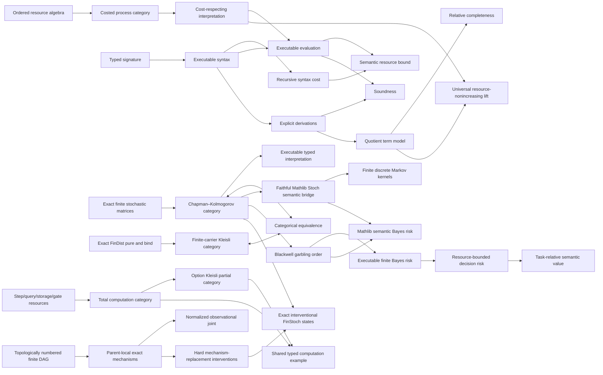

# Ript

**A kernel-checked Lean 4 foundation for resource-indexed process theories.**

[English](README.md) · [简体中文](docs/README.zh-CN.md) ·
[日本語](docs/README.ja.md) · [Esperanto](docs/README.eo.md)

[](https://github.com/miuchan/ript/actions/workflows/ci.yml)


Ript formalizes a small but rigorous core for **Resource-Indexed Information
Process Theory**: typed processes, compositional resource bounds, executable
interpretations, explicit equational derivations, and relative completeness via
canonical term models.

The project builds these layers in a strict order. It now includes an exact,
executable finite stochastic model, its finite-distribution Kleisli
representation, and a faithful semantic bridge into Mathlib's
measure-theoretic category `Stoch`. On top of that bridge, Ript now formalizes
Blackwell comparison, exact executable finite Bayes risk, resource-bounded
decision risk, and task-relative semantic value. It also includes total and
possibly failing computation categories with explicit step, query, storage,
and gate resources. It now also provides executable finite DAG causal models,
parent-local exact mechanisms, normalized observational joints, hard
interventions, and exact `FinStoch` semantics. General measurable-space causal
models, the converse Blackwell representation theorem, thermodynamics, quantum
theory, and higher categories remain research directions.

> [!IMPORTANT]
> Ript is early-stage research software. Stages 1–7 are implemented and
> checked by Lean's kernel; the public API is
> not yet stable, and no claim is
> made that the current core is a complete theory of physical information.

## Contents

- [Why Ript?](#why-ript)
- [The formal core](#the-formal-core)
- [What is proved](#what-is-proved)
- [Current scope and research status](#current-scope-and-research-status)
- [Architecture](#architecture)
- [Trust model](#trust-model)
- [Quick start](#quick-start)
- [A worked executable example](#a-worked-executable-example)
- [Using Ript as a Lean dependency](#using-ript-as-a-lean-dependency)
- [Repository guide](#repository-guide)
- [Quality gate](#quality-gate)
- [Design principles](#design-principles)
- [Roadmap](#roadmap)
- [Contributing](#contributing)
- [Frequently asked questions](#frequently-asked-questions)
- [Versioning, citation, and license](#versioning-citation-and-license)

## Why Ript?

Many process theories describe **which processes compose**. Resource-sensitive
theories must additionally describe **how much composition costs**, and they
must keep the two stories coherent:

- identity processes should be free;
- serial and parallel composition should have compositional bounds;
- syntax-level estimates should soundly bound the cost of every interpretation;
- equations used to rewrite processes should preserve both semantics and cost;
- executable models should remain usable without importing quotient machinery;
- completeness claims should identify the exact model relative to which they
  hold.

Ript packages these obligations as Lean interfaces and proves the central
relationships once. A downstream model supplies its objects, primitive
processes, interpretation, and cost laws; the generic soundness and resource
theorems then apply to it.

The name **Ript** abbreviates **Resource-Indexed Information Process Theory**.
“Indexed” is meant literally: expressions and morphisms carry typed interfaces,
while budgets live in an explicit ordered additive resource algebra.

## The formal core

### 1. Ordered additive resources

Resource values live in an additive commutative monoid with an order compatible
with addition. Ript intentionally asks for no lattice, subtraction, scalar
action, or quantale structure until a concrete model needs it.

For a costed category `C` and resource type `R`, the basic laws are

```math
\operatorname{cost}(\mathrm{id}_X)=0,
\qquad
\operatorname{cost}(f \mathbin{\gg} g)
\leq \operatorname{cost}(f)+\operatorname{cost}(g).
```

The optional monoidal capability adds

```math
\operatorname{cost}(f \otimes g)
\leq \operatorname{cost}(f)+\operatorname{cost}(g),
```

and the optional structural-cost capability declares associators, unitors, and
symmetry morphisms to be zero-cost rewiring.

### 2. Typed executable syntax

The sequential language contains primitive generators, identities, and serial
composition. Its indices make interface mismatches unrepresentable. The
monoidal language is separate and adds tensor, associators, unitors, inverse
structural maps, and symmetric braiding.

Both languages have a structurally recursive `syntaxCost`. For example,

```math
\operatorname{syntaxCost}(f \mathbin{\gg} g)
=\operatorname{syntaxCost}(f)+\operatorname{syntaxCost}(g).
```

Keeping syntax unquotiented makes construction, evaluation, inspection, and
finite examples directly executable.

### 3. Cost-respecting interpretations

An interpretation maps object symbols to semantic objects and generators to
semantic morphisms, together with a proof that each generator respects its
declared budget. Evaluation is ordinary structural recursion.

The central resource theorem is

```math
\operatorname{cost}(\operatorname{eval}(e))
\leq \operatorname{syntaxCost}(e).
```

Thus a proof that `syntaxCost e ≤ r` yields a checked semantic statement that
`eval e` is within budget `r`.

### 4. Explicit derivations, soundness, and relative completeness

Ript does not identify expressions by definitional equality. It defines an
explicit derivation system generated by category laws, and—at the monoidal
layer—by the symmetric monoidal coherence laws.

- **Soundness:** every formal derivation evaluates to equality in every
  compatible interpretation.
- **Relative completeness:** equality in the canonical term-model
  interpretation implies formal derivability.
- **Budget completeness in the free model:** term-model evaluation has exactly
  the recursively computed syntax cost.
- **Strict free universal property:** every legal interpretation induces a
  strong symmetric monoidal, resource-nonincreasing functor from the term
  model; among strict extensions agreeing on generators, its action is unique.

The word *relative* matters: the completeness theorem is about equality in the
canonical quotient term model, not an unqualified claim about every conceivable
semantic universe.

### 5. Exact finite stochastic channels

The first probabilistic model uses normalized matrices
`X → Y → ℚ≥0`. Composition is the exact Chapman–Kolmogorov sum, tensor
multiplies independent probabilities, and deterministic functions embed as
Dirac channels through a faithful functor. Objects bundle both enumeration and
decidable equality, so the generic typed evaluator can run fair-coin and noisy
Boolean examples in the kernel without floating-point approximation. Copy and
discard are explicit Dirac channels, and `comp_discard` proves the causal law
for every normalized finite channel.

### 6. Finite-distribution Kleisli representation

`FinDist X` packages an exact normalized mass function `X → ℚ≥0`. Its
executable `pure` and `bind` operations satisfy the left-unit, right-unit, and
associativity laws. Restricting Kleisli objects to the same executable finite
carriers as `FinStoch` gives morphisms `X → FinDist Y` and an actual category.

Explicit row/matrix conversions define functors in both directions between
this category and `FinStoch`. Both morphism conversions are proved inverse,
their object correspondence is definitional, and `kleisliEquivalence` packages
the natural isomorphisms as a categorical equivalence. The restriction is
intentional: the set of rational distributions over a finite carrier is
generally infinite, so it is not itself an object of the finite-carrier base
category required by Mathlib's unrestricted `CategoryTheory.Kleisli`.

### 7. A faithful bridge to Mathlib `Stoch`

`Ript.Models.Probability.StochFunctor` connects the exact executable matrices
to Mathlib's measure-theoretic probability library without replacing the
finite core. Each finite carrier receives the discrete measurable space, and a
matrix row `p : Y → ℚ≥0` becomes the probability measure

```math
\sum_{y \in Y} \uparrow p(y) \; \delta_y.
```

Normalization of the source row proves that this measure has total mass one,
so every `FinStoch` morphism induces a Markov kernel. The resulting `toStoch`
functor preserves identities and Chapman–Kolmogorov composition. It also:

- sends finite Dirac matrices to Mathlib's deterministic kernels;
- is faithful, because singleton masses recover every exact rational matrix
  entry after the injective cast into `ℝ≥0∞`;
- preserves independent tensor composition up to an explicit deterministic
  isomorphism between Mathlib's product measurable object and the same finite
  product equipped directly with the discrete top measurable space.

That last comparison is stated as a commuting diagram in `Stoch`, rather than
as a definitional equality or an undeclared monoidal-functor instance. This
makes the measurable-space identification visible in the theorem statement.
All noncomputability is confined to this semantic bridge; `FinStoch`,
`FinDist`, their compositions, and their examples remain executable exact
`ℚ≥0` data.

### 8. Blackwell comparison and task-relative decision value

An exact finite experiment is a channel `P : Θ ⟶ X` from hidden states to
observations. Ript says that `P` Blackwell-dominates `Q : Θ ⟶ Y` precisely when
there is a stochastic garbling `κ : X ⟶ Y` with

```math
P mathbin{\gg} \kappa = Q.
```

This is an operational simulation order, not an entropy comparison. It is
reflexive and transitive, is preserved by common preprocessing and independent
tensor products, and has a resource-certified variant whose post-processing
budgets compose additively.

Ript supplies two deliberately separated decision layers:

- The semantic layer sends exact finite data through `toStoch` and reuses
  Mathlib's `bayesRisk_le_bayesRisk_comp`. Therefore garbling cannot decrease
  optimal measure-theoretic Bayes risk.
- The executable layer defines `DecisionProblem` with a `FinDist` prior,
  finite actions, and exact `ℚ≥0` loss. `finiteBayesRisk` is a sum of genuine
  `Finset.min'` minima—not an unconditional infimum—and Ript proves that no
  randomized finite decision channel can beat it. This yields an independent
  exact-rational data-processing proof.

For computational constraints, `DecisionResourceModel` assigns a natural-
number cost to each deterministic decision rule and supplies a zero-cost
fallback. `resourceBayesRisk` minimizes over the finitely enumerated feasible
rules. More budget cannot worsen risk. A `DecisionReduction` must explicitly
prove both that lifted rules lose no decision quality and that their cost grows
by at most a stated additive overhead; the zero-overhead specialization says
free post-processing cannot create resource-bounded value.

Finally,

```math
\operatorname{value}(P;\text{task},\text{baseline})
= \operatorname{risk}(\text{baseline})-\operatorname{risk}(P)
```

defines semantic value relative to an explicit prior, action space, loss,
baseline experiment, and optional budget. The same channel can therefore have
positive value for one task and zero value for another. Ript proves garbling
monotonicity, invariance under information equivalence, zero value at the
baseline, task irrelevance for zero loss, and budget monotonicity. It does
**not** identify this task-relative quantity with Shannon information.

### 9. Total and partial computation with explicit resources

The first computation resource is `ComputationResource := Fin 4 → Nat`, with
named coordinates for formal steps, oracle queries, a storage bound, and
circuit gates. These are mathematical accounting units, not measured
wall-clock time. Addition and comparison are componentwise, and the executable
`ComputationResource.within` checker has a proof-level soundness theorem.

Two genuine process categories use this resource. `Computation.Total` has
total functions paired with a resource vector. `Computation.Partial` has
functions `X → Option Y`; serial composition is actual `Option` Kleisli
composition, so failure propagates. Both add resources exactly under serial
composition, expose an independent-product bifunctor, prove interchange, and
add parallel resources exactly. This is a bifunctor rather than a claimed
native `MonoidalCategory` instance; packaged associators and unitors remain
future work.

The functor `Partial.ofTotal` embeds every total computation as an
always-successful partial computation and preserves all resource coordinates.
A shared typed query/negation/guard program is interpreted in both models; the
generic `eval_cost_le` theorem and executable budget checks apply to both.

### 10. Finite DAG causal models and hard interventions

`FiniteDAG n` uses `Fin n` nodes and stores a topological certificate directly:
every declared parent has a smaller index than its child. The canonical order
is therefore executable and proved acyclic; constructing a joint distribution
does not rely on a classically chosen topological sort. Any finite DAG can use
this interface after choosing a topological numbering at its boundary.

A `FiniteCausalModel n Value` assigns an exact normalized `FinDist Value`
mechanism to each node. The mechanism receives values only for its declared
parents. Ript multiplies those local conditional masses in topological order,
proves every prefix normalized by induction, and obtains an executable joint
distribution satisfying the observational factorization formula.

An `Intervention` is a partial node assignment. `do(node = value)` replaces
the corresponding local mechanism with `FinDist.pure value`; it is not defined
by conditioning the observational joint. Repeating an intervention is
idempotent, and interventions with disjoint supports commute. Normalization and
factorization are preserved after replacement. Each local mechanism becomes a
`FinStoch` channel from parent assignments to node values, while observational
and interventional joints become exact stochastic states from `Object.unit`.

The executable two-node example has a fair Boolean cause and an effect that
copies it. Observational mismatches have mass zero. After `do(effect = true)`,
the cause remains fair and the previously impossible assignment
`(false, true)` has mass `1/2`. This distinguishes intervention from ordinary
conditioning with exact checked data. The first model intentionally uses a
common finite value type for every node; heterogeneous node carriers and
general do-calculus remain future extensions.

## What is proved

The following flagship results compile today. The short statements below are
informal summaries; the Lean declarations are authoritative.

| Lean declaration | Checked result |
| --- | --- |
| `Ript.Resource.budgeted_id` | Every identity is available at zero budget. |
| `Ript.Resource.budgeted_comp` | Budgets add under serial composition. |
| `Ript.Semantics.eval_cost_le` | Semantic evaluation is bounded by syntax cost. |
| `Ript.Semantics.budget_sound` | A syntactic budget proof yields a semantic budget proof. |
| `Ript.Semantics.soundness` | Sequential derivations are respected by every interpretation. |
| `Ript.Semantics.complete_via_term_model` | Term-model equality implies sequential derivability. |
| `Ript.Semantics.budget_complete_in_free_model` | Sequential term-model cost equals syntax cost. |
| `Ript.Resource.budgeted_tensor` | Budgets add under tensor composition. |
| `Ript.Semantics.monoidalEval_cost_le` | Monoidal evaluation is bounded by monoidal syntax cost. |
| `Ript.Semantics.monoidal_soundness` | Symmetric monoidal derivations are semantically sound. |
| `Ript.Semantics.monoidal_complete_via_term_model` | Monoidal term-model equality implies derivability. |
| `Ript.Semantics.monoidal_budget_complete_in_free_model` | Monoidal term-model cost equals syntax cost. |
| `Ript.Semantics.Free.lift_on_generator` | The universal lift agrees with the interpretation on generators. |
| `Ript.Semantics.Free.lift_preserves_cost` | The universal lift never increases process cost. |
| `Ript.Semantics.Free.lift_unique` | Every strict structure-preserving extension has the same action as the universal lift. |
| `Ript.Models.FiniteStochastic.FinStoch.id_apply` | Identity channels are exact Dirac matrices. |
| `Ript.Models.FiniteStochastic.FinStoch.comp_apply` | Composition obeys the Chapman–Kolmogorov formula. |
| `Ript.Models.FiniteStochastic.FinStoch.tensor_apply` | Tensor multiplies independent exact probabilities. |
| `Ript.Models.FiniteStochastic.FinStoch.dirac_comp` | The Dirac embedding preserves deterministic composition. |
| `Ript.Models.FiniteStochastic.FinStoch.dirac_faithful` | Distinct deterministic functions have distinct Dirac channels. |
| `Ript.Models.FiniteStochastic.FinStoch.comp_discard` | Every normalized finite channel is causal under discard. |
| `Ript.Models.FiniteDistribution.FinDist.pure_bind` | Point distributions are left units for finite-distribution bind. |
| `Ript.Models.FiniteDistribution.FinDist.bind_pure` | Point distributions are right units for finite-distribution bind. |
| `Ript.Models.FiniteDistribution.FinDist.bind_assoc` | Exact finite-distribution bind is associative. |
| `Ript.Models.FiniteStochastic.kleisliToChannel_channelToKleisli` | Matrix-to-Kleisli conversion is inverted by the reverse conversion. |
| `Ript.Models.FiniteStochastic.channelToKleisli_kleisliToChannel` | Kleisli-to-matrix conversion is inverted by the reverse conversion. |
| `Ript.Models.FiniteStochastic.kleisliEquivalence` | `FinStoch` is equivalent to the finite-carrier Kleisli category of `FinDist`. |
| `Ript.Models.Probability.StochFunctor.rowMeasure_singleton` | Singleton mass of an interpreted row recovers the exact source matrix entry. |
| `Ript.Models.Probability.StochFunctor.toKernel_comp` | Exact Chapman–Kolmogorov composition becomes Mathlib kernel composition. |
| `Ript.Models.Probability.StochFunctor.toStoch_map_dirac` | Dirac matrices become deterministic `Stoch` kernels. |
| `Ript.Models.Probability.StochFunctor.toStoch_map_eq_iff` | The `Stoch` interpretation is faithful on exact finite channels. |
| `Ript.Models.Probability.StochFunctor.productMeasurableSpace_eq_top` | A product of finite discrete measurable spaces is again discrete. |
| `Ript.Models.Probability.StochFunctor.toStoch_map_tensor` | Independent tensor composition is preserved through the canonical comparison isomorphism. |
| `Ript.Core.Simulates.trans` | Post-processing simulation is transitive. |
| `Ript.Core.SimulatesWithin.trans` | Resource-certified simulations compose with additive budgets. |
| `Ript.Models.Decision.Blackwell.dominates_tensor` | Independent products preserve Blackwell dominance. |
| `Ript.Models.Decision.Blackwell.semanticBayesRisk_mono` | Blackwell dominance implies Mathlib's Bayes-risk order. |
| `Ript.Models.Decision.FiniteRisk.finiteBayesRisk_le_randomizedDecisionRisk` | No randomized finite rule beats the computed finite optimum. |
| `Ript.Models.Decision.FiniteRisk.finiteBayesRisk_mono` | Garbling cannot improve exact executable finite Bayes risk. |
| `Ript.Models.Decision.ResourceBounded.resourceBayesRisk_antitone` | More decision budget cannot worsen optimal risk. |
| `Ript.Models.Decision.ResourceBounded.resourceBayesRisk_le_of_reduction` | Certified reductions transport risk with explicit additive overhead. |
| `Ript.Models.Decision.SemanticValue.semanticValue_mono` | Garbling cannot increase task-relative semantic value. |
| `Ript.Models.Decision.SemanticValue.resourceSemanticValue_mono_reduction` | Resource value obeys certified reductions and their overhead. |
| `Ript.Models.Computation.ComputationResource.within_sound` | A true executable vector check proves the corresponding resource bound. |
| `Ript.Models.Computation.Total.tensor_comp` | Parallel total execution satisfies interchange. |
| `Ript.Models.Computation.Partial.tensor_comp` | Parallel `Option` execution satisfies Kleisli interchange. |
| `Ript.Models.Computation.Partial.ofTotal_resource` | The total-to-partial functor preserves every resource coordinate. |
| `Ript.Examples.SimpleComputation.total_interpreter_cost_sound` | Generic syntax-cost soundness applies to the total executor. |
| `Ript.Examples.SimpleComputation.partial_budget_checker_sound` | The partial checker certifies the exact syntax-derived budget. |
| `Ript.Models.Causal.FiniteDAG.acyclic` | The certified parent relation has no directed cycle. |
| `Ript.Models.Causal.FiniteCausalModel.prefixFactorMass_normalized` | Normalized local mechanisms generate a normalized topological prefix. |
| `Ript.Models.Causal.FiniteCausalModel.observational_factorization` | Joint mass is exactly the product of parent-local conditional masses. |
| `Ript.Models.Causal.FiniteCausalModel.intervene_same` | A hard intervention replaces its target mechanism by a Dirac distribution. |
| `Ript.Models.Causal.FiniteCausalModel.intervene_idempotent` | Repeating the same intervention changes nothing further. |
| `Ript.Models.Causal.FiniteCausalModel.intervene_comm_of_disjoint` | Interventions on disjoint supports commute. |
| `Ript.Models.Causal.FiniteCausalModel.intervention_preserves_normalization` | Every hard-intervened joint remains normalized. |
| `Ript.Models.Causal.FiniteCausalModel.interventional_factorization` | Interventional states factor into unchanged conditionals and Dirac target factors. |
| `Ript.Examples.SimpleCausalModel.intervention_replaces_child_mechanism` | The Boolean chain example distinguishes intervention from observation exactly. |

Detailed theorem records—including prerequisites, computability, source files,
and kernel assumptions—live in [BLUEPRINT.md](BLUEPRINT.md). The generated
assumption inventory is recorded in [AXIOMS.md](AXIOMS.md).

## Current scope and research status

“PROVED” means that the implementation and named theorem obligations are
accepted by the pinned Lean kernel. It does not mean that a corresponding
scientific interpretation has been experimentally validated or published as a
finished physical theory.

| Stage | Scope | Status |
| --- | --- | --- |
| 0 | Reproducible project, documentation, CI, and audit baseline | **PROVED** |
| 1 | Sequential resource-process core | **PROVED** |
| 2 | Tensor, symmetry, parallel resources, and the strict free universal lift | **PROVED** |
| 3 | Executable finite stochastic model | **PROVED** |
| 4 | Finite-distribution Kleisli representation | **PROVED** |
| 5 | Faithful finite-channel bridge to Mathlib `Stoch` | **PROVED** |
| 6 | Blackwell order, finite decision risk, resource bounds, and task-relative value | **PROVED** |
| 7, computation | Multidimensional total and `Option`-partial models | **PROVED** |
| 7, causal | Finite DAG mechanisms, normalized joints, interventions, and `FinStoch` states | **PROVED** |
| 8–11 | Thermal, quantum, bicategorical, and univalent layers | **OPEN RESEARCH** |

Implemented model support is intentionally narrow:

| Model | Sequential | Tensor | Computability | Notes |
| --- | --- | --- | --- | --- |
| `FintypeCat` with zero cost | Yes | No | Executable | Deterministic finite functions |
| `FiniteFunction.Metered` | Yes | No | Executable | Functions carry explicit natural-number costs |
| Sequential term model | Yes | No | Proof layer | Quotient by explicit category derivations |
| Symmetric monoidal term model | Yes | Yes | Proof layer | Quotient by explicit monoidal derivations |
| Exact finite stochastic channels | Yes | Yes | Executable | Normalized `ℚ≥0` matrices, Dirac, copy, discard |
| Finite-distribution Kleisli category | Yes | No | Executable | Exact `pure`/`bind`; categorically equivalent to `FinStoch` |
| Mathlib `Stoch` bridge, finite discrete image | Yes | Yes, up to canonical isomorphism | Semantic layer | Faithful Markov-kernel interpretation; source matrices stay executable |
| Exact finite decision layer | Via `FinStoch` | No native tensor | Executable | Blackwell order respects `FinStoch` products; finite minima, resource budgets, task-relative value |
| Total computation | Yes | Product bifunctor | Executable | Formal step/query/storage/gate vectors; exact serial and parallel accounting |
| `Option` partial computation | Yes | Product bifunctor | Executable | Failure-propagating Kleisli composition; total embedding |
| Finite causal DAG | Topological generation | Via `FinStoch` states | Executable | Homogeneous finite carrier; parent-local exact mechanisms and hard interventions |

The finite stochastic model has explicit copy, discard, and a proved causal
discard law. Its finite discrete image has checked measure-theoretic semantics
in Mathlib `Stoch`, and its exact finite decision layer has compiled Blackwell,
Bayes-risk, resource, and semantic-value theorems. The converse finite
Blackwell--Sherman--Stein representation theorem, general measurable decision
problems, heterogeneous or measurable causal models, complete do-calculus,
native monoidal packaging for computation, generic copy/discard and convex
interfaces, thermal structure, quantum
channels, and univalent or higher-categorical structure are **not implemented**.
See [MODEL_MATRIX.md](MODEL_MATRIX.md) for the canonical
capability matrix and [CONJECTURES.md](CONJECTURES.md) for formally tracked open
statements. There are currently no registered conjectures.

## Architecture

Ript separates executable data from quotient-based proof semantics.



| Layer | Main modules | Responsibility |
| --- | --- | --- |
| Resource interfaces | `Ript.Resource.*` | Ordered budgets, budgeted morphisms, weakening |
| Process capabilities | `Ript.Core.*` | Sequential, tensor, structural cost laws, and post-processing simulation |
| Executable syntax | `Ript.Syntax.*` | Typed expressions, recursive cost, derivations |
| Semantics | `Ript.Semantics.*` | Interpretations, evaluation, soundness, completeness |
| Concrete models | `Ript.Models.*` | Deterministic functions, finite probability, decisions, total/partial computation, and finite causal mechanisms |
| Executable examples | `Ript.Examples.*` | Computed behavior, budgets, rational probabilities, exact decision values, and interventions |
| Audit surface | `Ript.Audit.*` | Declaration lint and kernel-assumption reporting |

The sequential core remains independently usable. The symmetric monoidal layer
extends it through separate interfaces instead of retrofitting tensor
assumptions into every sequential definition.

## Trust model

Ript is designed so that proof trust is inspectable rather than implicit.

- All library theorems are checked by Lean's kernel.
- `sorry`, `admit`, `sorryAx`, custom `axiom`/`constant` declarations, unsafe
  declarations, and `Lean.trustCompiler` are rejected by the quality gate.
- Every implementation module sets `autoImplicit false`.
- Compilation warnings are treated as errors.
- The project imports specific Mathlib modules rather than the umbrella
  `Mathlib` import.
- Flagship theorem assumptions are machine-checked against a documented
  allowlist.
- Unproved research claims belong in `CONJECTURES.md`, never in the theorem
  namespace disguised as completed results.

The stage-1 and stage-2 flagship audit reports only Lean's standard `propext`
and `Quot.sound` principles where required. Finite-stochastic, Kleisli,
decision, and `Stoch` theorem proofs also report `Classical.choice` through
Mathlib's generic finite-sum, finite-function, measure, and category
infrastructure. Runtime data is supplied by explicit computational `Fintype`
and `DecidableEq` values: finite channels, finite risks, budgeted risks, and
semantic values are executable exact `ℚ≥0` data. Total functions, `Option`
failure, resource vectors, computation budget checks, finite causal joints,
and hard interventions are also executable.
Noncomputability appears only
in the measure-theoretic `Stoch`/semantic-Bayes-risk boundary. The audit reports
no compiler-trust escape or placeholder-proof axiom.

For exact per-theorem output, read [AXIOMS.md](AXIOMS.md) or run:

```bash
lake env lean Ript/Audit/AxiomChecks.lean
```

## Quick start

### Prerequisites

- Git;
- [`elan`](https://github.com/leanprover/elan), the Lean toolchain manager;
- a supported environment for Lean 4 (Linux, macOS, or Windows).

The repository pins both Lean and Mathlib. `elan` reads `lean-toolchain` and
installs Lean `v4.33.0` automatically when needed.

### Clone and build

```bash
git clone https://github.com/miuchan/ript.git
cd ript

# Recommended: download the matching precompiled Mathlib cache.
lake exe cache get

# Compile the complete library with warnings promoted to errors.
lake build
```

The first command involving Lake may download the pinned toolchain and package
dependencies. Subsequent builds reuse the local `.lake` cache.

### Run every project gate

```bash
./scripts/quality-gate.sh
```

A successful run ends with:

```text
All Ript quality gates passed.
```

## A worked executable example

`Ript/Examples/BitProcesses.lean` defines a one-bit signature with Boolean
negation as a primitive generator of cost `1`. It constructs two consecutive
negations and interprets them in both a zero-cost finite-function model and an
explicitly metered model.

The essential expression is:

```lean
def notNot : Expr signature .bit .bit :=
  .comp (.gen .not) (.gen .not)
```

Lean computes and proves both the syntactic and semantic cost:

```lean
example : notNot.syntaxCost = 2 := by decide

example :
    processCost (R := Nat) (eval meteredInterpretation notNot) = 2 := by
  decide
```

Run the checked example directly:

```bash
lake env lean Ript/Examples/BitProcesses.lean
```

Its three executable assertions print:

```text
true
true
true
```

CI compares this output exactly, so an unintended change in executable behavior
fails the quality gate.

`Ript/Examples/StochasticBits.lean` additionally executes a fair coin, a noisy
Boolean channel, independent tensor composition, copying, and the generic typed
interpreter. Its five checks use exact nonnegative rationals and all print
`true`.

`Ript/Examples/KleisliBits.lean` executes point distributions, Kleisli bind,
both matrix conversions, and the functors contained in the categorical
equivalence. Its four exact checks also print `true`.

`Ript/Examples/StochBits.lean` then proves, inside Mathlib `Stoch`, that the
interpreted fair coin has the expected singleton mass, noisy negation preserves
the fair distribution, deterministic negation is a deterministic kernel, and
two fair coins satisfy the tensor comparison diagram. These are semantic proof
examples rather than additional runtime output.

`Ript/Examples/SimpleDecision.lean` closes the loop with a fair hidden bit and
zero-one guessing loss. Perfect observation has risk `0`; an independent
observation has risk `1/2`. A resource model charges `0` for constant rules and
`1` for observation-dependent rules, so the perfect experiment's budgeted risk
falls from `1/2` to `0` when the budget grows from `0` to `1`. Its task value is
exactly `1/2` for guessing and `0` for a zero-loss irrelevant task. Six exact
`#eval decide` contracts all print `true` and are checked by CI.

`Ript/Examples/SimpleComputation.lean` executes the same typed program in the
total and `Option`-partial categories. It computes the exact resource vector
`(steps, queries, storage, gates) = (3, 1, 0, 1)`, exercises success and failure,
and checks both model budgets. Seven `#eval decide` contracts print `true`.

`Ript/Examples/SimpleCausalModel.lean` executes a two-node Boolean chain. A fair
root causes a child that copies it, so observational mismatches have mass zero.
The hard intervention `do(effect = true)` replaces only the child mechanism:
the upstream root remains fair and `(false, true)` receives exact mass `1/2`.
Five `#eval decide` contracts check normalization, observational support,
forced-value exclusion, and upstream invariance.

## Using Ript as a Lean dependency

Ript exposes the root module `Ript`. During the pre-release phase, pin a known
commit instead of tracking a moving branch:

```lean
require ript from git
  "https://github.com/miuchan/ript.git" @ "<full-commit-sha>"
```

Then import the whole public surface or a narrow module:

```lean
import Ript
-- or, for a smaller dependency boundary:
import Ript.Semantics.Eval
-- or, for the finite measure-theoretic bridge:
import Ript.Models.Probability.StochFunctor
-- or, for Blackwell order and task-relative decision value:
import Ript.Models.Decision.SemanticValue
-- or, for resource-aware total and partial computation:
import Ript.Models.Computation.Partial
-- or, for finite DAGs, hard interventions, and exact stochastic states:
import Ript.Models.Causal.FinStoch
```

The package is currently versioned `0.1.0`, but no stable API or tagged release
is promised yet. Pinning a commit is required for reproducible downstream work.

## Repository guide

| Path | Purpose |
| --- | --- |
| [`Ript/Core/`](Ript/Core/) | Abstract process-cost capabilities |
| [`Ript/Resource/`](Ript/Resource/) | Resource algebras and checked budgets |
| [`Ript/Syntax/`](Ript/Syntax/) | Sequential and symmetric monoidal languages |
| [`Ript/Semantics/`](Ript/Semantics/) | Evaluation, soundness, term models, completeness |
| [`Ript/Models/`](Ript/Models/) | Deterministic, probabilistic, decision, computation, and finite causal models |
| [`Ript/Examples/`](Ript/Examples/) | Executable examples |
| [`Ript/Audit/`](Ript/Audit/) | Lint and assumption-audit entry points |
| [BLUEPRINT.md](BLUEPRINT.md) | Dependency graph, stages, theorem records, design decisions |
| [AXIOMS.md](AXIOMS.md) | Current kernel-assumption inventory |
| [MODEL_MATRIX.md](MODEL_MATRIX.md) | Implemented versus planned model capabilities |
| [CONJECTURES.md](CONJECTURES.md) | Formal register of unresolved research statements |
| [CONTRIBUTING.md](CONTRIBUTING.md) | Required development and proof policy |

## Quality gate

Local development and GitHub Actions use the same project-owned checks.

| Gate | Command | What it prevents |
| --- | --- | --- |
| Source hygiene | `scripts/check-source-quality.sh` | Placeholders, custom axioms, unsafe declarations, implicit identifiers, broad imports, trailing whitespace |
| Root coverage | `lake exe mk_all --check` | Lean files that are silently absent from the root library build |
| Kernel build | `lake build` | Type errors and all Lean warnings |
| Declaration lint | `lake env lean Ript/Audit/Lint.lean` | Mathlib declaration-linter regressions |
| Executable contract | `scripts/check-examples.sh` | Changes to the expected finite example results |
| Assumption allowlist | `scripts/check-axioms.sh` | New or undocumented dependencies of flagship theorems |

The `main` branch requires the stable GitHub check named `Lean quality gate`,
including for administrators. Required checks must be current with `main`;
force-pushes and branch deletion are disabled.

## Design principles

1. **Start with the smallest auditable core.** Add algebraic structure only
   when at least one real semantic model needs it.
2. **Make ill-typed processes unrepresentable.** Object indices encode process
   interfaces directly in expression types.
3. **Keep resource laws compositional.** Identity, serial composition, tensor,
   and structural rewiring have explicit, separately reusable contracts.
4. **Separate executable syntax from proof quotients.** Computation should not
   inherit noncomputability merely because completeness uses quotient models.
5. **State the scope of completeness.** All completeness claims name their
   canonical model and proof boundary.
6. **Treat assumptions as versioned API surface.** A theorem acquiring a new
   axiom is a gate failure, not a footnote discovered later.
7. **Distinguish implementation from aspiration.** The finite discrete `Stoch`
   image, exact finite decision layer, and homogeneous finite DAG causal layer
   are implemented; converse representation, general stochastic and causal,
   thermal, quantum, and higher layers remain visibly marked as open research.
8. **Make information task-relative when value is the claim.** A semantic-value
   statement names its prior, actions, loss, baseline, and resource budget; it
   is not silently promoted to a task-independent entropy claim.
9. **Charge computation explicitly.** A post-processing becomes a resource
   comparison only after a reduction supplies both its decision-quality bound
   and additive cost overhead.
10. **Do not confuse formal cost with elapsed time.** Computation resources are
    semantic annotations with proved composition laws, not performance claims.
11. **Do not confuse intervention with conditioning.** A hard intervention
    replaces a local mechanism before the joint is regenerated; observational
    conditioning is a distinct operation and is not used as a surrogate.

## Roadmap

The roadmap is obligation-driven. A stage advances only when it has compiled
definitions, flagship proofs, executable evidence where appropriate, and an
updated assumption audit.

### Completed foundation

- [x] Ordered additive resource interface
- [x] Lax sequential process costs and checked budgets
- [x] Typed sequential syntax and executable evaluation
- [x] Explicit category-law derivations
- [x] Sequential soundness and term-model relative completeness
- [x] Parallel cost capability and additive tensor budgets
- [x] Typed symmetric monoidal syntax and structural rewiring
- [x] Monoidal soundness and term-model relative completeness
- [x] Strong symmetric monoidal, resource-nonincreasing free lift and strict uniqueness
- [x] Zero-cost and explicitly metered finite deterministic examples
- [x] Exact finite stochastic category, tensor bifunctor, Dirac embedding, copy, discard, and typed example
- [x] Exact finite distributions, Kleisli category, two comparison functors, and categorical equivalence
- [x] Faithful finite-channel functor into Mathlib `Stoch`, including deterministic and tensor comparison theorems
- [x] Blackwell garbling order, equivalence, tensor compatibility, and Mathlib Bayes-risk data processing
- [x] Executable exact finite Bayes risk, finite optimal decisions, and randomized-rule lower bound
- [x] Resource-bounded decision risk, budget monotonicity, and additive-overhead reductions
- [x] Task-relative semantic value, equivalence, garbling, budget, baseline, and task-irrelevance laws
- [x] Executable perfect-versus-uninformative Boolean decision example
- [x] Four-coordinate computation resource and sound executable budget checker
- [x] Total and `Option`-partial categories with exact serial and parallel costs
- [x] Product bifunctors, interchange, resource-preserving total embedding, and typed example
- [x] Topologically certified finite DAGs and parent-local exact mechanisms
- [x] Normalized observational joints, hard interventions, intervention laws, and `FinStoch` states
- [x] Executable Boolean causal-chain example distinguishing `do` from observation
- [x] Reproducible CI, declaration lint, and axiom allowlist

### Open research tracks

- [ ] Generic copy/discard capability interfaces beyond the finite stochastic model
- [ ] Stochastic semantics over general measurable spaces beyond the finite discrete image
- [ ] Generic convex and causal capability interfaces
- [ ] Heterogeneous node carriers, general measurable causal models, conditioning, and do-calculus extensions
- [ ] Native monoidal packaging for the total and partial computation categories
- [ ] Converse finite Blackwell--Sherman--Stein representation theorem
- [ ] General measurable-space decision problems beyond exact finite data
- [ ] Rich computational cost models and operationally validated reduction costs
- [ ] Thermal/resource-theoretic models
- [ ] Quantum-channel models
- [ ] Carefully isolated univalent or higher-categorical layers

These checkboxes are not promises of a particular release order. Each addition
must preserve the existing sequential boundary or document a deliberate
breaking change.

## Contributing

Contributions are welcome when they preserve the project's explicit trust and
scope boundaries.

1. Create a branch from the current `main`.
2. Make the smallest coherent change.
3. Add proofs, executable evidence, and documentation together.
4. Run `./scripts/quality-gate.sh`.
5. Open a pull request and wait for `Lean quality gate` to pass.

Before proposing a new semantic layer, describe its required algebraic
capabilities, at least one concrete model, its computability boundary, and the
flagship theorem that would justify the abstraction. Read
[CONTRIBUTING.md](CONTRIBUTING.md) for the enforced policy.

Use [GitHub Issues](https://github.com/miuchan/ript/issues) for reproducible bugs,
proof gaps, documentation problems, and scoped design proposals. Do not include
credentials, secrets, or exploit details in a public issue; the project has not
yet declared a private security-reporting channel.

## Frequently asked questions

### Is Ript a complete theory of information, physics, or computation?

No. It is a formal compositional core for typed processes and additive resource
bounds. The broader scientific layers are intentionally unimplemented.

### Are costs exact?

Not in every semantic model. The generic laws are subadditive, so syntax cost is
a sound upper bound. Cost is proved exact in the canonical sequential and
monoidal term models.

### Does Ript already support probability, decision theory, or quantum channels?

Ript supports exact executable finite stochastic channels over `ℚ≥0`, including
composition, tensor, Dirac channels, copy, and discard. It also proves their
equivalence with the finite-carrier Kleisli category of exact finite
distributions and gives a faithful functor from them into Mathlib's
measure-theoretic category `Stoch`, preserving deterministic channels and
tensor up to a canonical comparison isomorphism. Arbitrary measurable-space
stochastic models, thermal models, and quantum channels remain roadmap items.
For finite exact data, Ript also supports Blackwell garbling, executable Bayes
risk, resource-bounded risk, and task-relative semantic value. It proves the
forward data-processing direction. It does not yet prove the converse finite
Blackwell representation theorem or a general measurable decision theory.
It also supports topologically numbered finite DAGs with a common finite value
carrier, exact parent-local mechanisms, normalized observational joints, hard
interventions, and exact `FinStoch` states. Heterogeneous carriers, general
measurable causal models, conditioning APIs, and do-calculus completeness are
not yet implemented.

### Is semantic value the same thing as mutual information?

No. Ript's current `semanticValue` is a decision-theoretic risk improvement
relative to a specified baseline. Changing the prior, action space, loss, or
budget can change the value of the same experiment. No equality with Shannon
mutual information is claimed.

### Does Ript model real program runtime?

No. It models declared formal bounds for steps, queries, storage, and gates.
The total and partial executors prove exact accounting for their serial and
parallel operations, but no theorem identifies these units with elapsed time,
machine memory, or a particular hardware cost model.

### Does the monoidal layer imply copying or discarding?

No. Tensor and symmetry alone do not provide diagonal or terminal maps. The
finite stochastic model introduces copy and discard explicitly; other semantic
models must supply and justify their own operations and laws.

### Why maintain a separate sequential syntax?

It keeps the smallest useful theory independently executable and prevents every
consumer from inheriting monoidal assumptions. The monoidal syntax is an
extension with a deliberate boundary.

### Why use quotient term models if the syntax is executable?

Executable syntax is ideal for construction and evaluation; quotients express
equality modulo formal derivations. Confined term models provide the exact proof
object needed for relative completeness without contaminating executable code.

### Can I depend on `main`?

You can, but you should not do so for reproducible work. There is no stable API
release yet; pin a full commit SHA.

## Versioning, citation, and license

### Versioning

The Lake package currently declares version `0.1.0`. Until tagged releases and
an explicit stability policy exist, changes may be breaking even when the
package version has not changed.

### Citation

Ript has no archival paper or DOI yet. For research artifacts, cite the
repository URL together with the exact commit SHA used, and archive that commit
in your reproducibility materials. A formal citation file should be added only
when author and publication metadata are settled.

### License

No open-source license has been selected for this repository yet. Public source
availability does **not** by itself grant permission to copy, redistribute, or
create derivative works. Until a license file is added, standard copyright
restrictions apply. This section is intentionally explicit so downstream users
do not infer rights that have not been granted.

## Acknowledgements

Ript is built with [Lean 4](https://lean-lang.org/) and
[Mathlib](https://github.com/leanprover-community/mathlib4). Their category
theory, algebra, tooling, and proof-engineering ecosystems make this project
possible.
