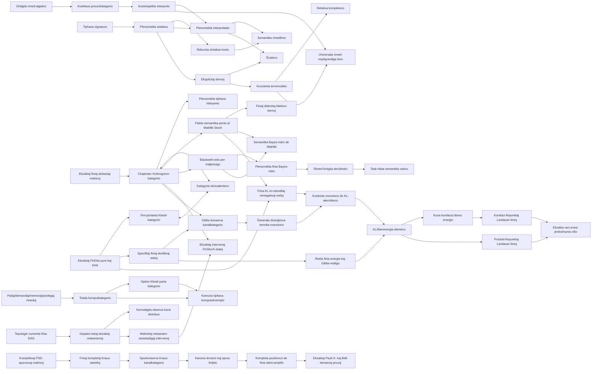

# Ript

**Kernel-kontrolita fundamento en Lean 4 por rimed-indeksitaj procezteorioj.**

[English](../README.md) · [简体中文](README.zh-CN.md) ·
[日本語](README.ja.md) · [Esperanto](README.eo.md)

[](https://github.com/miuchan/ript/actions/workflows/ci.yml)


Ript formaligas malgrandan sed rigoran kernon por **Resource-Indexed Information
Process Theory**, esperante **Teorio de Rimed-Indeksitaj Informaj Procezoj**:
tiphavajn procezojn, kunmeteblajn rimedlimojn, plenumeblajn interpretojn,
eksplicitajn egalecderivojn, kaj relativan kompletecon per kanonaj termmodeloj.

La projekto konstruas siajn tavolojn laŭ rigora sinsekvo. Ĝi nun inkluzivas
ekzaktan, plenumeblan finian stokastan modelon, ĝian Kleisli-prezenton per
finiaj distribuoj, kaj fidelan semantikan ponton al la mezurteoria kategorio
`Stoch` de Mathlib. Sur tiu ponto Ript nun formaligas Blackwell-komparon,
ekzaktan plenumeblan finian Bayes-riskon, rimed-limigitan decidriskon kaj
task-rilatan semantikan valoron. Ĝi ankaŭ enhavas kategoriojn de totalaj kaj
eble malsukcesaj komputoj kun eksplicitaj paŝaj, demandaj, memoraj kaj pordegaj
rimedoj. Ĝi nun ankaŭ enhavas plenumeblajn finiajn DAG-kaŭzajn modelojn,
ekzaktajn mekanismojn kiuj legas nur gepatrojn, normaligitajn observajn kunajn
distribuojn, malmolajn intervenojn kaj ekzaktan `FinStoch`-semantikon. Ĝeneralaj
mezureblaj kaŭzaj modeloj restas malfermaj. La sekva kompilita tavolo aldonas
finiajn termikajn sistemojn kun specifitaj ekvilibraj distribuoj, kategorion kaj
tensora bifunktoron de Gibbs-konservaj ekzaktaj kanaloj, liberajn ekvilibrajn
preparojn kaj ĝeneralan diverĝencan monotonecon. Aparta semantika tavolo nun
difinas konkretan finian KL en `ℝ≥0∞`, pruvas ĝian nulvaloron kaj subtenliman
konduton, la plenan datumtraktan neegalaĵon por ĉiu finia stokasta kanalo, kaj
konkretan monotonecon de KL-atermikeco. La inversa Blackwell-teoremo kaj
eksplicitaj banaj/ciklaj protokoloj restas esplorvojoj.
Nova realiga tavolo aldonas reelajn
energiojn kaj pozitivan inversan temperaturon al ne-vakaj finiaj sistemoj,
konstruas strikt-pozitivajn normaligitajn Gibbs-probablojn kaj atestas kiam
ekzakta racia ekvilibro realigas ilin. Ĝi difinas Shannon-entropion, averaĝan
energion kaj neekvilibran/ekvilibran Helmholtz-liberan energion, pruvas
`D(p ‖ γ) = β (F(p) - F(γ))`, kaj derivas monotonecon de la liberenergia diferenco
por Gibbs-konservaj kanaloj je komuna inversa temperaturo. Ĝi ankaŭ kanone
realigas ĉiun plen-subtenan ekzaktan ekvilibron je ĉiu pozitiva inversa
temperaturo kaj pruvas faktoradon, multiplikan particifunkcion kaj adiciecon de
energio, entropio kaj libera energio por sendependaj samtemperaturaj sistemoj.
Eksplicita sistem-bateria tavolo ankaŭ pruvas ke Gibbs-konserva kuna procezo
pagas ĉiun sisteman liberenergian kreskon per bateria liberenergia malkresko.
Se la bateria entropio ne ŝanĝiĝas, tio estas laborlimo; ekzakta viŝo de
nulenergia Bulea memoro bezonas almenaŭ `log 2 / β`. Arbitraj ekzaktaj
korelaciitaj finpunktoj nun ankaŭ estas kovritaj: kuna libera energio
malkomponiĝas en du marĝenajn liberajn energiojn kaj reciprokan informon
`I / β`, kaj korelaci-korektita Landauer-limo enkalkulas ambaŭ ŝanĝojn.
Ekzakta finia proksimuma viŝo ankaŭ estas kovrita: por racia
`0 ≤ ε ≤ 1/2`, la plenumebla celo havas erarmason `ε`, entropion
`binEntropy ε`, kaj ekzaktan tro-liberenergian koston
`(log 2 - binEntropy ε) / β`. La kosto estas nenegativa, monotone
nepligrandiĝas kun la permesita eraro, kaj aperas en ambaŭ produkt-finpunktaj
kaj korelaci-korektitaj Landauer-laborlimoj.
Ript nun ankaŭ havas apartan fini-dimensian kompleksan kvantuman kernon:
pozitivajn duondifinajn densmatricojn kun spuro unu, operaciajn mapojn
atestitajn per finiaj kompletaj Kraus-familioj, pruvitan konservon de pozitiveco
kaj spuro, fermitecon sub idento kaj sinsekva kunmeto, kanalkategorion kaj
kanonan kanaltensoron, interchange, baz-bra-an spuro/forĵeto-kanalon kun kaŭza
unikeco, kompletan pozitivecon por ĉiu finia helpa sistemo, normaligitan
Bell-densmatricon, kaj ekzaktajn unu- kaj du-kvubitajn Pauli-X-pruvojn. La
klasika-al-kvantuma tavolo nun estas realigita: ĝi uzas
`sqrt(P(y | x)) |y><x|` kiel Kraus-operatorojn kaj konstruas fidelan
mezur-preparan funktoron al la malfaziga idempotenta subkategorio, kun pruvitaj
idento, kunmeto, tensoro, diagonala statevoluo kaj probabloreakiro. La
pli-altkategoria tavolo nun ankaŭ estas realigita kaj kompilita: por fiksa
rimedtipo, rimed-indeksitaj simetriaj monoidaj procezmodeloj, rimed-nepligrandigaj
fortaj plektitaj monoidaj funktoroj kaj monoidaj naturaj transformoj formas
dukategorion. Vertikala kaj horizontala kunmetoj, interchange, asociantoj,
maldekstraj kaj dekstraj unuigiloj, la kvinangula leĝo kaj la triangula leĝo
estas pruvitaj. Kost-ekzaktaj modelekvivalentoj konservas procezkostojn kaj la
kernajn sinsekvajn kaj paralelajn limojn sub eksplicita kost-reflekta hipotezo.
Etapo 11 aldonas intence malgrandan, senaksioman, interne univalentan procez-
universon. Profundaj kodoj por malpleno, unuo, sumo, tensoro kaj atomaj
interfacoj portas apartajn sintaksojn por struktura ekvivalento kaj interna
idento. Iliaj semantikaj kvocientoj formas veran Mathlib-grupoidon; interna
idento ekvivalentas al interna struktura ekvivalento; kaj tiphava procezlingvo
kun reindeksado laŭ ekvivalentoj havas pruvitan ĝustecon. Ĝi estas aro-nivela,
1-tranĉita modelo: ĝi nek supozas eksteran univalentecon nek transformas
arbitran Lean-tipekvivalenton en tipegalon.
Etapo 12 nun liveras sian unuan strikte limigitan kompletigan paŝon. Senelekta
objektokvociento identigas kodojn precize kiam interna idento estas nure
loĝata, kun universala malsuprenigo por invariantaj mapoj kaj internaj
predikatoj. Aparta nekomputebla Mathlib-skeleto konservas ĉiujn aŭtomorfiojn
kaj estas kategorie ekvivalenta al la origina grupoido. Tiuj estas
0/1-tranĉitaj fundamentoj, ne pretendita Rezk-kompletigo.
La antaŭfaska vojo nun ankaŭ havas kompilitan unuan tavolon: Yoneda enigas la
internan grupoidon plene fidele en tip-valorajn antaŭfaskojn; interna idento kaj
struktura ekvivalento respondas precize al naturaj transformoj kaj naturaj
izomorfioj de reprezenteblaj antaŭfaskoj; kaj la esenca bildo formas grupoidon
kategorie ekvivalentan al la fonto. Tiu `YonedaEnvelope` restas ordinara
1-kategoria envolvaĵo, ne Rezk-kompletigo.
La interna grupoido nun ankaŭ havas veran simplician nervon. Ĉiu simplaĵo estas
unike rekonstruebla el sia kunmetebla spino, do la nervo estas pruvite strikta
Segal, kvazaŭkategorio kaj 2-koskeleta; verticoj, eĝoj kaj kunmetaj
2-simplaĵoj precize reakiras interfacojn, internajn identojn kaj vojkunmeton.
Ĝia homotopikategorio estas izomorfa al la fonta grupoido. Tio restas la
strikta kategoria nervo de 1-grupoido. Dimensio-post-dimensia formaligo nun
pruvas kompletan Kan-kornplenigon, inkluzive invers-bazitajn plenigilojn de
eksteraj kornoj; neniu aserto pri kompleta Segal-strukturo, lokalizo aŭ
Rezk-kompletigo estas farata.
Ript disponigas kontrolitan fundamenton, sur kiu oni povas aldoni
tiujn tavolojn sen silente ŝanĝi procezkunmeton aŭ rimedkalkuladon.

> [!IMPORTANT]
> Ript estas frufaza esplorprogramaro. La realigitaj fundamentoj de etapoj 1–12 estas
> kontrolitaj de la kerno de Lean; la publika API ankoraŭ ne estas stabila, kaj
> la nuna kerno ne pretendas esti kompleta fizika teorio de informado.

## Enhavo

- [Kial Ript?](#kial-ript)
- [La formala kerno](#la-formala-kerno)
- [Kio estas pruvita](#kio-estas-pruvita)
- [Nuna amplekso kaj esplora stato](#nuna-amplekso-kaj-esplora-stato)
- [Arkitekturo](#arkitekturo)
- [Fidmodelo](#fidmodelo)
- [Rapida komenco](#rapida-komenco)
- [Plenumebla ekzemplo](#plenumebla-ekzemplo)
- [Uzi Ript kiel Lean-dependaĵon](#uzi-ript-kiel-lean-dependaĵon)
- [Gvidilo tra la deponejo](#gvidilo-tra-la-deponejo)
- [Kvalita kontrolpordo](#kvalita-kontrolpordo)
- [Projektaj principoj](#projektaj-principoj)
- [Vojmapo](#vojmapo)
- [Kontribuado](#kontribuado)
- [Oftaj demandoj](#oftaj-demandoj)
- [Versioj, citado kaj permesilo](#versioj-citado-kaj-permesilo)

## Kial Ript?

Multaj procezteorioj priskribas **kiuj procezoj estas kunmeteblaj**.
Rimed-konscia teorio devas krome priskribi **kiom kostas la kunmeto**, kaj ĝi
devas teni la du rakontojn koheraj:

- identaj procezoj estu senkostaj;
- sinsekva kaj paralela kunmetoj havu kunmeteblajn suprajn limojn;
- sintaksnivela takso fidinde limigu la semantikan koston en ĉiu interpreto;
- ekvacioj uzataj por reverki procezojn konservu kaj semantikon kaj koston;
- plenumeblaj modeloj restu uzeblaj sen importi kvocientan pruvmaŝinaron;
- ĉiu kompleteca aserto nomu la precizan modelon, rilate al kiu ĝi validas.

Ript prezentas tiujn devojn kiel Lean-interfacojn kaj pruvas iliajn centrajn
rilatojn unufoje. Malsupra modelo liveras siajn objektojn, primitivajn procezojn,
interpreton kaj kostleĝojn; tiam la ĝeneralaj teoremoj pri ĝusteco kaj rimedoj
aplikiĝas al ĝi.

La nomo **Ript** mallongigas **Resource-Indexed Information Process Theory**.
“Indeksita” estas laŭvorta: esprimoj kaj morfioj portas tiphavajn en- kaj
el-interfacojn, dum buĝetoj loĝas en eksplicita ordigita adicia rimed-algebro.

## La formala kerno

### 1. Ordigitaj adiciaj rimedoj

Rimedvaloroj loĝas en adicia komuta monoido kun ordo kongrua kun adicio. Ript
intence ne postulas latison, subtrahon, skalaran agon aŭ kvantalon ĝis konkreta
modelo vere bezonos tian pli fortan strukturon.

Por kosthava kategorio `C` kaj rimedtipo `R`, la bazaj leĝoj estas

```math
c(\mathrm{id}_X)=0,
\qquad
c(f \mathbin{\gg} g)
\leq c(f)+c(g).
```

La nedeviga monoida kapablo aldonas

```math
c(f \otimes g)
\leq c(f)+c(g),
```

kaj la nedeviga struktura-kosta kapablo deklaras asocigilojn, unuigilojn kaj
simetriajn plektaĵojn senkostaj strukturaj rekonektoj.

La sama rimedinformo nun havas duan, pruvite ekvivalentan prezenton. Kostfunkcio
generas nestitajn buĝettavolojn per `cost(f) ≤ r`; identoj, sinsekva kunmeto kaj,
kiam disponebla, tensoro konservas tiujn tavolojn. Inverse,
`AttainedHomFiltration`, kiu eksplicite donas atingitan plej malgrandan permesitan
buĝeton por ĉiu procezo, rekonstruas subadician koston. Ambaŭ rondiroj estas
ekzaktaj: `costToFiltration_toCost` reakiras la originan koston, kaj
`filtrationToCost_toFiltration_of_attained` reakiras ĉiun originan tavolon.
Konservi la atingitan infimumon kiel datumon evitas elekton kaj funkcias por
diskretaj rimedoj kiel `Nat` sen postuli kompletan latison.

Kopiado kaj forĵetado estas nedevigaj kapabloj, ne kaŝitaj en la komuna kerno.
`DiscardingProcess` elektas koherajn forĵetojn sen doni kopiadon;
`ClassicalCopyingProcess` reuzas la `CopyDiscardCategory` de Mathlib. La
nulkosta fini-funkcia modelo nun estas vera kartezia monoida kategorio: ordinara
produktotipo estas tensoro, `PUnit` estas la unuo, la diagonala funkcio kopias,
kaj la unika mapo al `PUnit` forĵetas. Ĉiu finia funkcio pruvite konservas ambaŭ
operaciojn kaj do estas kaŭza. La operacioj restas plenumeblaj, kvankam la
ĝeneralaj kategoriaj koherpruvoj heredas la reviziitan klasikan pruvinfrastrukturon
de Mathlib.

### 2. Tiphava plenumebla sintakso

La sinsekva lingvo enhavas primitivajn generilojn, identojn kaj sinsekvan
kunmeton. Ĝiaj indeksoj faras interfacajn miskongruojn nereprezenteblaj. La
monoida lingvo estas aparta kaj aldonas tensoron, asocigilojn, unuigilojn,
inversajn strukturajn mapojn kaj simetrian plektaĵon.

Ambaŭ lingvoj havas strukture rekursian `syntaxCost`. Ekzemple,

```math
c_{\mathrm{syntax}}(f \mathbin{\gg} g)
=c_{\mathrm{syntax}}(f)+c_{\mathrm{syntax}}(g).
```

Ĉar la sintakso restas nekvocientigita, konstruado, interpretado, inspektado kaj
finiaj ekzemploj restas rekte plenumeblaj.

### 3. Kostrespektaj interpretoj

Interpreto sendas objektsimbolojn al semantikaj objektoj kaj generilojn al
semantikaj morfioj, kune kun pruvo ke ĉiu generilo respektas sian deklaritan
buĝeton. Interpretado estas ordinara struktura rekursio.

La centra rimedteoremo estas

```math
c(\mathrm{eval}(e))
\leq c_{\mathrm{syntax}}(e).
```

Do pruvo de `syntaxCost e ≤ r` liveras kontrolitan semantikan aserton, ke
`eval e` restas en la buĝeto `r`.

### 4. Eksplicitaj derivoj, ĝusteco kaj relativa kompleteco

Ript ne identigas esprimojn nur per difina egaleco. Ĝi difinas eksplicitan
derivsistemon generitan de la kategoriaj leĝoj kaj—en la monoida tavolo—de la
koherleĝoj de simetriaj monoidaj kategorioj.

- **Ĝusteco (soundness):** ĉiu formala derivo interpretiĝas kiel egaleco en ĉiu
  kongrua interpreto.
- **Relativa kompleteco (relative completeness):** egaleco en la kanona
  termmodela interpreto implicas formalan deriveblon.
- **Buĝeta kompleteco en la libera modelo:** interpretado en la termmodelo havas
  precize la rekursie kalkulitan sintaksan koston.
- **Strikta libera universala eco:** ĉiu valida interpreto induktas fortan
  simetrian monoidan, rimed-nepligrandigan funktoron el la termmodelo; inter
  striktaj etendaĵoj samaj je generiloj, ĝia ago estas unika.

La vorto *relativa* gravas: la teoremo temas pri egaleco en la kanona kvocienta
termmodelo, ne pri senkondiĉa aserto super ĉiu imagebla semantika universo.

### 5. Ekzaktaj finiaj stokastaj kanaloj

La finia stokasta modelo prezentas kanalon kiel normaligitan matricon
`X → Y → ℚ≥0`. Identoj estas Dirac-matricoj, kunmeto estas finia
Chapman–Kolmogorov-sumo, kaj tensoro estas la produkta distribuo. Ĉiu objekto
eksplicite portas plenumeblajn enumeradon kaj decideblan egalecon, do kanaloj,
la Dirac-enigo, kopiado, forĵetado kaj interpretado kalkuliĝas sen uzi
nekomputeblan elekton por produkti rultempajn datumojn.

Determinismaj finiaj funkcioj eniĝas kiel fidela Dirac-funktoro, kiu konservas
kunmeton kaj tensoron. Kopiado estas la diagonala mapo, forĵetado celas la unikan
unuan valoron, kaj ĉiu finia stokasta kanalo plenumas la kaŭzan leĝon
`f ≫ discard = discard`.

### 6. Kleisli-prezento per finiaj distribuoj

`FinDist X` enhavas ekzaktan normaligitan masfunkcion `X → ℚ≥0`. Ĝiaj
plenumeblaj operacioj `pure` kaj `bind` plenumas la maldekstran kaj dekstran
unuecleĝojn kaj asociecon. Limigante la Kleisli-objektojn al la samaj
plenumeblaj finiaj portantoj kiel `FinStoch`, la morfioj estas
`X → FinDist Y` kaj formas veran kategorion.

Eksplicitaj vic-/matric-konvertoj donas funktorojn ambaŭdirekte. La morfiaj
konvertoj estas reciproke inversaj, la objekta kongruo estas difina, kaj
`kleisliEquivalence` pakas la naturajn izomorfiojn kiel kategorian ekvivalentecon.
La limigo estas necesa: ĉiuj racionalaj distribuoj sur finia portanto ĝenerale
formas senfinan aron, do ili ne restas en la finia baza kategorio postulata de
la nelimigita `CategoryTheory.Kleisli` de Mathlib.

### 7. Fidela ponto al Mathlib `Stoch`

`Ript.Models.Probability.StochFunctor` konektas la ekzaktajn matricojn al la
mezurteoria probablobiblioteko de Mathlib sen anstataŭigi la finian plenumeblan
kernon. Ĉiu finia portanto ricevas la diskretan mezureblan strukturon, kaj
matrica vico `p : Y → ℚ≥0` interpretiĝas kiel la probablomezuro

```math
\sum_{y \in Y} \uparrow p(y) \; \delta_y.
```

La normaligo de la fonta vico pruvas, ke tiu mezuro havas tutan mason unu; tial
ĉiu morfio de `FinStoch` induktas Markov-kernon. La rezulta funktoro `toStoch`
konservas identojn kaj Chapman–Kolmogorov-kunmeton. Ĝi ankaŭ:

- sendas finiajn Dirac-matricojn al la determinismaj kernoj de Mathlib;
- estas fidela, ĉar maso de unuopaĵo reakiras ĉiun ekzaktan racionalan matrican
  elementon post la injekta enigo en `ℝ≥0∞`;
- konservas sendependan tensoran kunmeton tra eksplicita determinisma izomorfio
  inter la produkta mezurebla objekto de Mathlib kaj la sama finia produto kun
  la rekte donita diskreta supra mezurebla strukturo.

La lasta eco estas esprimita kiel komuta diagramo en `Stoch`, ne kiel difina
egaleco aŭ nedeklarita monoida-funktora instanco. Tiel la identigo de la
mezureblaj strukturoj restas videbla ĉe la teorema limo. Ĉiu nekomputebleco estas
izolita en ĉi tiu semantika ponto; `FinStoch`, `FinDist`, iliaj kunmetoj kaj
rultempaj ekzemploj restas plenumeblaj ekzaktaj datumoj en `ℚ≥0`.

### 8. Blackwell-komparo kaj task-rilata decidvaloro

Ekzakta finia eksperimento estas kanalo `P : Θ ⟶ X` de kaŝitaj statoj al
observoj. Ript diras, ke `P` Blackwell-superas `Q : Θ ⟶ Y` ĝuste kiam ekzistas
stokasta malprecigilo `κ : X ⟶ Y` kun

```math
P mathbin{\gg} \kappa = Q.
```

Tio estas operacia simulado-ordo, ne entropia komparo. Ĝi estas refleksiva kaj
transitiva, konserviĝas sub komuna antaŭtraktado kaj sendependaj tensoraj
produktoj, kaj havas rimed-atestitan version kies posttraktaj buĝetoj adiciiĝas.

Ript intence apartigas du decidteoriajn tavolojn:

- La semantika tavolo sendas ekzaktajn finiajn datumojn tra `toStoch` kaj
  reuzas `bayesRisk_le_bayesRisk_comp` de Mathlib. Tial malprecigo ne povas
  malpliigi la optimuman mezurteorian Bayes-riskon.
- La plenumebla tavolo difinas `DecisionProblem` per `FinDist`-antaŭdistribuo,
  finiaj agoj kaj ekzaktaj `ℚ≥0`-perdoj. `finiteBayesRisk` estas sumo de veraj
  finiaj minimumoj `Finset.min'`, ne senkondiĉa infimumo. Ript pruvas, ke neniu
  hazardigita finia decida kanalo povas superi ĝin, donante sendependan
  ekzakt-racionalan pruvon de datumtraktado.

Por komputaj limigoj, `DecisionResourceModel` atribuas natur-nombran koston al
ĉiu determinisma decidregulo kaj liveras senkostan rezervan regulon.
`resourceBayesRisk` minimumigas super la finie listigitaj realigeblaj reguloj;
pli granda buĝeto ne povas plimalbonigi riskon. `DecisionReduction` devas
eksplicite pruvi kaj nepligrandiĝon de decida perdo kaj adician supran limon por
la kosto. La nul-kroma specialigo diras, ke senkosta posttraktado ne povas krei
rimed-limigitan valoron.

Fine,

```math
V(P;\text{tasko},\text{bazlinio})
= R(\text{bazlinio})-R(P)
```

difinas semantikan valoron rilate al eksplicitaj antaŭdistribuo, agospaco,
perdfunkcio, bazlinia eksperimento kaj nedeviga buĝeto. La sama kanalo do povas
havi pozitivan valoron por unu tasko kaj nul valoron por alia. Ript pruvas
monotonecon sub malprecigo, invariadon sub informa ekvivalenteco, nulon ĉe la
bazlinio, taskan sensignifecon por nula perdo kaj buĝetan monotonecon. Ĝi
**ne** identigas ĉi tiun task-rilatan kvanton kun Shannon-informo.

### 9. Totalaj kaj partaj komputoj kun eksplicitaj rimedoj

La unua komputrimedo estas `ComputationResource := Fin 4 → Nat`, kun koordinatoj
por formalaj paŝoj, oracle-demandoj, memorlimo kaj cirkvitaj pordegoj. Tiuj estas
matematikaj kalkulunuoj, ne murhorloĝa tempo. Adicio kaj komparo estas
komponantaj, kaj la plenumebla kontrolilo `ComputationResource.within` havas
pruvnivelan ĝustecon.

En `Computation.Total`, morfioj estas totalaj funkcioj kun rimedvektoro. En
`Computation.Partial`, ili estas `X → Option Y`; sinsekvo estas vera `Option`-
Kleisli-kunmeto, do malsukceso propagas. Ambaŭ kategorioj ekzakte adicias
sinsekvajn rimedojn, donas produktan bifunktoron, pruvas interchange, kaj ekzakte
adicias paralelajn rimedojn. Ni ne antaŭtempe nomas tion denaska
`MonoidalCategory`-instanco.

La funktoro `Partial.ofTotal` enigas totalajn komputojn kiel ĉiam sukcesajn
partajn komputojn kaj konservas ĉiujn rimedkoordinatojn. Komuna tiphava
demando/nego/gardilo-programo ruliĝas en ambaŭ modeloj kun `eval_cost_le` kaj
plenumeblaj buĝetkontroloj.

### 10. Finiaj DAG-kaŭzaj modeloj kaj malmolaj intervenoj

`FiniteDAG n` uzas nodojn `Fin n` kaj rekte konservas topologian atestilon:
ĉiu deklarita gepatro havas pli malgrandan indekson ol sia infano. La kanona
ordo do estas plenumebla kaj pruvite sencikla; konstruado de kuna distribuo ne
bezonas klasike elektitan topologian ordigon. Ĉiu finia DAG povas uzi la
interfacon post elekto de topologia numerado ĉe sia limo.

`FiniteCausalModel n Value` atribuas ekzaktan normaligitan mekanismon
`FinDist Value` al ĉiu nodo. Mekanismo ricevas nur valorojn de siaj deklaritaj
gepatroj. Ript multiplikas la lokajn kondiĉajn masojn laŭ topologia ordo,
indukte pruvas normaligon de ĉiu prefikso, kaj ricevas plenumeblan kunan
distribuon kiu plenumas la observan faktorigon.

`Intervention` estas parta asigno de nodoj. `do(node = value)` anstataŭigas la
lokan mekanismon per `FinDist.pure value`; ĝi ne estas difinita kiel kondiĉigo
de la observa kuna distribuo. Ripeto de interveno estas idempotenta, kaj
intervenoj kun disaj subtenoj komutas. Normaligo kaj faktorigo restas validaj
post anstataŭigo. Ĉiu loka mekanismo fariĝas `FinStoch`-kanalo de gepatraj
asignoj al noda valoro, kaj observaj kaj intervenaj kunaj distribuoj fariĝas
ekzaktaj stokastaj statoj el `Object.unit`.

La plenumebla dunoda ekzemplo havas justan Bulean kaŭzon kaj efikon kiu kopias
ĝin. Observe, malkongruaj asignoj havas mason nul. Post `do(effect = true)`, la
kaŭzo restas justa kaj la antaŭe neebla asigno `(false, true)` havas ekzaktan
mason `1/2`. Tio distingas intervenon disde ordinara kondiĉigo per kontrolitaj
datumoj. La unua modelo intence uzas komunan finian valortipon por ĉiuj nodoj;
heterogenaj nodaj portantoj kaj ĝenerala do-kalkulo restas estontaj etendaĵoj.

### 11. Finiaj termikaj sistemoj kaj Gibbs-konservaj procezoj

`ThermalObject` kunigas plenumeblan finian statspacon kun unu ekzakta
normaligita `EquilibriumState`. La ekvilibra distribuo estas operacia datumo:
ĉi tiu unua tavolo ne pretendas jam derivi ĝin el energispektro, inversa
temperaturo aŭ eksponenta Gibbs-formulo. `FinDist.push` evoluigas distribuon per
`FinStoch`-kanalo, kaj `FinDist.tensor` konstruas la produktan distribuon de
sendependaj sistemoj.

`GibbsPreserving X Y` estas finia stokasta kanalo kiu plenumas
`T(γX) = γY`. Ript pruvas identojn, fermitecon sub kunmeto kaj kategorian
strukturon. Tensoro konservas produktajn ekvilibrojn kaj plenumas identan leĝon
kaj interchange, do ĝi formas eksplicitan bifunktoron. La specifita ekvilibro
de ĉiu objekto ankaŭ estas libera preparo el la termika tensora unuo.

La diverĝenca tavolo eksplicite montras sian premison. `Divergence Value`
enhavas statkomparon kune kun pruvita stokasta datumtrakta neegalaĵo. Por ĉiu
tia diverĝenco kaj Gibbs-konserva `T`, Ript pruvas
`D(Tp ‖ γY) ≤ D(p ‖ γX)` kaj pakas ĝin kiel `ThermalMonotone`. Tio ne estas
senpruva aserto pri KL.

Konkreta finia KL estas konstruita aparte, sen aldoni premison al la ĝenerala
teoremo. `Ript.Models.Probability.FiniteKL` enigas ĉiun ekzaktan racian
`FinDist` kiel ĝian diskretan probablomezuron kaj specialigas la mezurteorian
`InformationTheory.klDiv` de Mathlib. La celaro estas `ℝ≥0∞`: pozitiva maso kie
la referenca maso estas nul do donas ekzakte `∞`, kaj malsamaj punktamasoj havas
pruvite senfinan diverĝencon. La semantika enigo estas injekcia. Sub subtena
inkludo, la formaligo identigas la Radon--Nikodym-denson punkte kiel la ekzaktan
racion de masoj, derivas kaj la etend-reelan finian f-diverĝencan sumon kaj la
klasikan reelan formulon `sum_x p(x) log (p(x) / q(x))`, kaj pruvas ke KL estas
`∞` ekzakte kiam ekzistas subtena malobservo. La unuforma Bulea termika ekzemplo
instancigas la reelan formulon por ĉiu stato. Plenumebla antaŭenigo ekzakte
egalas mezurkunmeton kun la interpretita Markov-kerno, kaj la
kernnivela teoremo de Mathlib donas por ĉiu ekzakta finia stokasta kanalo `T`

```text
KL(Tp ‖ Tq) ≤ KL(p ‖ q)
```

Tiu pruvita DPI konstruas `finiteKLDivergence`, `klAthermality` kaj
`klThermalMonotone`, tiel konkretigante la ĝeneralan termikan teoremon. La
ekzaktaj raciaj statoj kaj kanaloj restas plenumeblaj; logaritmoj, integraloj kaj
nekomputebleco restas nur en la analiza semantika tavolo.

`FiniteGibbsData` aldonas reelajn energinivelojn `E`, pozitivan inversan
temperaturon `β`, Boltzmann-pezojn kaj la finian particifunkcion. Ript pruvas ke
ĉiu pezo kaj la particifunkcio estas pozitivaj, normaligas la rezultan
Gibbs-probablon kaj pruvas ĝian logaritman formulon. `GibbsThermalObject` estas
realiga atestilo inter tiu analiza distribuo kaj la ekzistanta ekzakta racia
ekvilibro; ĝi ne supozas ke arbitraj eksponentaj pezoj estas raciaj aŭ
plenumeblaj.

Inverse, ĉiu ekzakta finia ekvilibro kun plena subteno havas kanonan Gibbs-
realigon je ĉiu elektita `β > 0`. Ript metas
`E(x) = -log γ(x) / β`, pruvas ke la Boltzmann-pezo estas ekzakte `γ(x)` kaj
ke `Z = 1`, kaj pakas la realigan atestilon. Tio estas ekzistoteoremo pri
energireprezento de plen-subtenaj ekzaktaj distribuoj, ne decidproceduro por
racieco de Gibbs-pezoj de aparte donita reela energispektro.

Por ĉiu realigita sistemo la liberenergia tavolo difinas averaĝan energion
`U(p)`, Shannon-entropion `S(p)`, `F(p) = U(p) - S(p) / β`, kaj
`F(γ) = -log Z / β`. Lean tiam pruvas

```text
D(p ‖ γ) = β (F(p) - F(γ)).
```

Gibbs-ekvilibroj havas plenan subtenon, do la KL-valoro ĉi tie estas finia.
Kun la pruvita DPI sekvas ke Gibbs-konserva kanalo inter sistemoj je la sama
inversa temperaturo ne povas pligrandigi `F(p) - F(γ)`. Sendependaj Gibbs-
sistemoj je komuna inversa temperaturo ankaŭ tenzoriĝas ekzakte: pezoj kaj
probabloj faktoriĝas, particifunkcioj multiplikiĝas, kaj `U`, `S`, `F`,
`F(γ)` kaj la liberenergia diferenco estas adiciaj sur produktaj statoj.

`WorkAssistedTransition` eksplicite registras ekzaktajn finajn statojn de
sistemo, celo kaj baterio, komunan inversan temperaturon, Gibbs-konservan kunan
kanalon, kaj ekzaktan evoluegalecon de komenca produkta stato al fina produkta
stato. Ript pruvas ke la kresko de sistema troa libera energio ne superas la
malkreskon de bateria troa libera energio. Nur kun la aldona hipotezo ke la
komenca kaj fina bateriaj entropioj egalas, ĉi-lasta egalas la malkreskon de
averaĝa bateria energio kaj estas interpretebla kiel liverita laboro. Je ĉiu
`β > 0`, viŝi nulenergian Bulean memoron de la unuforma ekvilibro al
`pure false` tial bezonas almenaŭ `log 2 / β`. Tio estas necesa limo por ĉiu
atestita transiro; ĝi ne asertas ekziston aŭ saturon.

`CorrelatedWorkAssistedTransition` forigas la postulon pri produktaj
finpunktoj. Por ĉiu ekzakta kuna stato Ript plenume kalkulas ambaŭ marĝenojn
kaj pruvas

```text
kuna liberenergia diferenco
  = maldekstra marĝena diferenco + dekstra marĝena diferenco
    + reciproka informo / β.
```

La reciproka informo egalas la finian KL de la kuna stato rilate al la
produkto de ĝiaj marĝenoj; do ĝi kaj la korelacia libera energio estas
nenegativaj. Ĉiu korelaciita transiro sekve plenumas

```text
sistema liberenergia kresko + korelacia liberenergia kresko
  <= bateria liberenergia malkresko.
```

La laborformo por entropie neŭtralaj bateriaj marĝenoj kaj la Bulea
viŝspecialigo ankaŭ estas pruvitaj. Plenumebla perfekte korelaciita justa
Bulea paro havas `I = log 2` kaj korelacian liberan energion `log 2 / β`.

`Ript.Examples.ApproximateErasure` precizigas la celon per ekzakta racia
erarkvanto `0 ≤ ε ≤ 1/2`: `false` ricevas mason `1 - ε`, kaj la erara valoro
`true` ricevas mason `ε`. Ĝi pruvas

```text
S(celo ε) = binEntropy ε
F(celo ε) - F(ekvilibro) = (log 2 - binEntropy ε) / β.
```

La kosto estas nenegativa kaj monotone nepligrandiĝas kun la permesita eraro;
je nula eraro ĝi estas `log 2 / β`, kaj je eraro `1/2` ĝi estas nulo. La
produkt-finpunkta kaj korelaci-korektita laborlimoj estas pruvitaj. Ili estas
nur necesaj limoj por liveritaj transiratestiloj kaj ne asertas protokolan
ekziston aŭ saturiĝon. Eksplicitaj banaj/ciklaj protokoloj kaj klasifiko de
raciaj Gibbs-pezoj por aparte donitaj reelaj energispektroj restas malfermaj.

### 12. Finiaj kompleksaj densmatricoj kaj Kraus-kanaloj

Kvantumaj sistemoj uzas propran finian bazobjekton; ili ne estas alinomo de la
klasikaj finiaj stokastaj objektoj kaj ne aŭtomate heredas klasikan kopiadon.
`DensityMatrix X` estas kompleksa matrico `ρ : Matrix X X ℂ` kun la operacia
pozitiva-duondifina pruvo `ρ.PosSemidef` de Mathlib kaj ekzakta normaligo
`trace ρ = 1`. Tio estas kvadratforma pozitiveco, ne elementa nenegativeco.

`KrausRepresentation X Y map` liveras finie multajn rektangulajn operatorojn
`Kᵢ : Matrix Y X ℂ`, pruvas

```text
map(ρ) = ∑ i, Kᵢ ρ Kᵢᴴ
```

kaj atestas `∑ i, Kᵢᴴ Kᵢ = I`. Ript derivas konservon de pozitiveco el
fermiteco de pozitivaj duondifinaj matricoj sub `KρKᴴ` kaj finiaj sumoj. Ĝi
derivas spurokonservon per cikleco de la spuro kaj la kompleteca ekvacio. Tial
`KrausChannel.applyDensity` konstruas veran celan densmatricon el ĉiu fonta
densmatrico.

`KrausChannel` konservas la operacian mapon rekte kaj nur propozicie trunkas la
ekziston de Kraus-atestilo. Ĉar Kraus-prezentoj ne estas unikaj, kanala egaleco
komparas agojn, ne arbitrajn prezent-elektojn. Unuelementa identfamilio kaj ĉiuj
produktoj `LⱼKᵢ` pruvas fermitecon sub idento kaj sinsekva kunmeto, kaj donas
kategorion. La kvubita ekzemplo pruvas `XᴴX = I` por Pauli-X kaj ke ĝi ekzakte
interŝanĝas la du komputbazajn densmatricojn.

La tensoro dependas nur de la operacia kanala ago: Kraus-ago estas levita al
kanona kompleksa lineara mapo, transportita tra la matrica/tensorprodukta
lineara ekvivalento de Mathlib, kaj paroformaj Kronecker-Kraus-operatoroj
atestas la rezulton sur ĉiu matrico. Komponenta statevoluo, tensora idento kaj
interchange estas pruvitaj. Forĵeto estas la spurkanalo konstruita el bazaj
bra-oj; ĝi estas la unika kanalo al la unudimensia sistemo, do ĉiu kanalo
plenumas la kaŭzan forĵetleĝon.

Kompleta pozitiveco nun estas eksplicita teoremo, ne nur intuicio kaŝita en la
Kraus-prezento. `IsCompletelyPositive f` kvantigas super ĉiu finia helpa
sistemo `A` kaj ĉiu pozitiva duondifina kuna matrico sur `A × X`; ĝi postulas,
ke la ident-amplifo `id_A ⊗ f` restu pozitiva. Ript pruvas, ke la kanona amplifo
estas ekzakte la kompleks-lineara ago de `identity A ⊗ channel`. Tial ĉiu finia
Kraus-kanalo plenumas la predikaton por arbitraj kunaj enigoj, ne nur por
produktaj matricoj. Tio estas la ordinara fini-matrica formulo denaska al la
nuna tavolo; neniu nepruvita ekvivalento kun la aparta C\*-algebra
`CompletelyPositiveMap`-API de Mathlib estas asertata.

La kvubita ekzemplo ankaŭ konstruas la normaligitan Bell-densmatricon, pruvas
pozitivan duondifinitecon kaj spuron unu, kaj kalkulas ĝian eksterdiagonalan
`|00⟩`/`|11⟩`-koheran elementon kiel `1/2`. Poste la ĝenerala amplifa teoremo
pruvas, ke Pauli-X sur nur la dua kvubito konservas pozitivecon. La ekzemplo
ilustras la ĝeneralan kun-statan teoremon; ĝi ne anstataŭas ĝin per finia testo.
Formala teoremo pri nedisigebleco ankoraŭ ne estas asertata. La klasika
etapo-9-a etendaĵo nun estas realigita per `sqrt(P(y | x)) |y><x|`-operatoroj.
Ĝi fidele konservas kunmeton kaj tensoron. Ĉar la klasika idento fariĝas baza
malfazigo, ne la plena kvantuma idento, la celo estas precize la malfaziga
idempotenta subkategorio.

### 13. Senaksioma interne univalenta procezuniverso

La tavolo de etapo 11 estas profunde enigita kaj intence unudirekta.
`Code Atom` estas malgranda gramatiko de procezinterfacoj. `EquivExpr A B`
priskribas la strukturajn ekvivalentojn eksplicite permesitajn de tiu gramatiko,
dum `PathExpr A B` priskribas atestantojn de interna idento kaj havas eksplicitan
konstruilon `ua`. Neniu el ili estas Lean-egaleco; ambaŭ interpretiĝas nur kiel
ordinaraj ekvivalentoj inter la malgrandaj Lean-tipoj indikitaj de la finaj kodoj.

Por elektita `UniverseModel`, Ript kvocientigas la ekvivalentan kaj identan
sintaksojn laŭ egaleco de iliaj eksteraj interpretoj. La rezultaj
`InternalEquiv A B` kaj `Identity A B` subtenas refleksecon, inverson, kunmeton,
sumon kaj tensoron. La envolvitaj kodobjektoj formas Mathlib-`Groupoid`, kaj la
centra teoremo estas:

```lean
internalUnivalence (A B) : M.Identity A B ≃ M.InternalEquiv A B
```

Ambaŭ rondiraj leĝoj estas pruvitaj. Egaleco en ĉiu kvociento estas precize
karakterizita per egaleco de ĝia ekstera interpreto. `InternalFamily` transportas
strukturon laŭ internaj ekvivalentoj; `InternalPredicate` devas eksplicite doni
sian ekvivalent-invariantecon; kaj la nedistingebla teoremo tiam pruvas, ke
interne identaj interfacoj havas la samajn observojn. Por determinismaj
procezspacoj, tiu struktura-identa transporto estas konkrete konstruita per
konjugado de funkcio per la interpretitaj fonta kaj cela ekvivalentoj.

La akompana profunda procezlingvo enhavas generilojn, identecon, sinsekvan kaj
paralelan kunmetojn kaj reindeksadon de finpunktoj. Ĝia eksplicita derivsistemo
inkluzivas kategoriajn leĝojn, tensoran interchange, kongruecon kaj reindeksajn
leĝojn; `ProcessDerives.soundness` pruvas ĉiun deriveblan ekvacion valida en ĉiu
determinisma universinterpreto. La Bulea ekzemplo videbligas la limon:
`bit ⊗ unit` kaj `unit ⊗ bit` estas pruveble malsamaj Lean-sintaksarboj,
sed tensora simetrio donas internan identecon, transportas Bulean neon, agas kiel
la atendata interŝanĝo kaj ne estas distingebla de invarianta predikato.

Tio estas honesta malgranda, aro-nivela, 1-tranĉita semantika modelo. Ĝi **ne**
donas `(infinity,1)`-kategorion, pli-altan vojkoheron, antaŭfaskan aŭ simplician
modelon, Rezk-kompletigon, eksteran strukturidentecon, nek teoremon
`Equiv α β → α = β`. Tiuj restas apartaj esploraj devoj, ne kaŝitaj supozoj.

### 14. Tranĉita kompletigo kaj universala malsuprenigo

Etapo 12 komenciĝas per du konstruoj kun eksplicite malsamaj fidaj kaj
komputeblaj limoj. `ObjectCompletion` estas la kvociento de krudaj interfackodoj
laŭ `Nonempty (M.Identity A B)`, sen elekto de reprezentanto. Egaleco de
kompletigitaj objektoj ekvivalentas al nura loĝateco de interna idento kaj, per
`internalUnivalence`, al nura loĝateco de interna struktura ekvivalento. Sumo
kaj tensoro malsupreniras al la kvociento, kie simetrio, asocieco kaj unuigaj
leĝoj fariĝas laŭvortaj Lean-egalaĵoj.

La objektokvociento havas kompilitan universalan econ:

```lean
objectCompletionUniversal (β) :
  (M.ObjectCompletion → β) ≃ M.InvariantMap β

internalPredicateCompletionEquiv :
  (M.ObjectCompletion → Prop) ≃ M.InternalPredicate
```

Do plenumebla datumo povas eliri el la kvociento nur post kiam ĝia krudkoda
mapo liveras pruvon de intern-identa invarianteco; neniu reprezentanto estas
elektata. La Bulea ekzemplo malsuprenigas ekzaktan kodan kardinalon kaj taksas
`bit + (bit tensor bit)` al `6`. Ĝi ankaŭ pruvas, ke tensor-simetriaj prezentoj
egalas post kompletigo dum la originaj Lean-sintaksarboj restas malegalaj.

`SkeletalCompletion` estas intence aparta. Ĝi reuzas la Mathlib-skeleton de la
interna grupoido, estas skeleta grupoido, konservas ĉiujn aŭtomorfiojn kaj
ekvivalentas al la origina grupoido. Limigo laŭ tiu ekvivalento donas:

```lean
skeletalCompletionUniversal (E) :
  (M.SkeletalCompletion ⥤ E) ≌ (M.Object ⥤ E)
```

Mathlib elektas skeletajn reprezentantojn, do tiu kategoria tavolo estas
eksplicite `noncomputable` kaj ĝiaj reviziitaj teoremoj enhavas
`Classical.choice`. La senelektaj objektaj universalaj ecoj ne enhavas ĝin.
Neniu konstruo liveras pli-altajn vojojn, kompletan Segal-koheron, antaŭfaskan
lokalizon, eksteran univalentecon aŭ Rezk-kompletigon de la rimed-proceza
dukategorio.

### 15. Reprezenteblaj antaŭfaskoj kaj la Yoneda-envolvaĵo

La interna grupoido nun havas veran tip-valoran antaŭfaskan semantikon:

```lean
PresheafUniverse M := M.Objectᵒᵖ ⥤ Type u

yonedaEmbeddingFullyFaithful :
  M.yonedaEmbedding.FullyFaithful
```

Taksi la reprezenteblan antaŭfaskon ĉe `A` sur interfaco `B` donas precize la
internan identotipon `M.Identity B A`. Plena fideleco levas tiun punktan
observon al ekzaktaj ekvivalentoj:

```lean
representableTransformationEquiv (A B) :
  M.Identity A B ≃
    (M.representablePresheaf A ⟶ M.representablePresheaf B)

representableNaturalIsoEquiv (A B) :
  M.Identity A B ≃
    (M.representablePresheaf A ≅ M.representablePresheaf B)

representableEquivNaturalIsoEquiv (A B) :
  M.InternalEquiv A B ≃
    (M.representablePresheaf A ≅ M.representablePresheaf B)
```

Ĉiu natura transformo inter tiuj reprezenteblaj antaŭfaskoj estas inversigebla:
la Yoneda-enigo estas plene fidela kaj la fonto jam estas grupoido. Kunmeto de
internaj identoj bildiĝas al kunmeto de naturaj transformoj, do temas pri
struktur-konserva korespondo, ne nura analogio inter objektaroj.

`YonedaEnvelope` estas la plena subkategorio de antaŭfaskoj izomorfaj al
reprezentebla antaŭfasko. Yoneda faktoriĝas tra ĝi, la limigita funktoro estas
ekvivalento, la envolvaĵo heredas grupoidan strukturon, kaj por ĉiu cela
kategorio `E`:

```lean
yonedaEnvelopeUniversal (E) :
  (M.YonedaEnvelope ⥤ E) ≌ (M.Object ⥤ E)
```

La Bulea ekzemplo sendas tensoran simetrion al natura transformo, taksas ĝin ĉe
la fonta idento por reakiri la originan internan vojon, kaj konstruas la
respondan envolvaĵan izomorfion dum la krudaj kodoj restas pruveble malegalaj.

Tiu tavolo havas eksplicitan klasikan limon. La fiksitaj Mathlib-deklaroj
`CategoryTheory.yoneda` kaj `Yoneda.fullyFaithful` mem reviziiĝas kiel
`[propext, Classical.choice, Quot.sound]`; la esenc-bilda ekvivalento ankaŭ
elektas reprezentajn atestantojn. Neniu tia valoro fluas en plenumeblan
sintakson aŭ finiajn modelojn. La envolvaĵo ne egaligas ekstere izomorfajn
antaŭfaskojn kaj per si mem ne liveras kompletan Segal-kondiĉon, pli-altan
lokalizon aŭ eksteran univalentecon.

### 16. La Kan-a simplicia nervo

La interna grupoido nun havas efektivan prezenton kiel simplicia aro:

```lean
InterfaceNerve M := CategoryTheory.nerve M.Object

interfaceNerveStrictSegal :
  SSet.StrictSegal M.InterfaceNerve

interfaceNerveSegalEquiv (n) :
  M.InterfaceNerve _⦋n⦌ ≃ M.InterfaceNerve.Path n

interfaceNerveKanComplex :
  SSet.KanComplex M.InterfaceNerve

interfaceNerveHornFiller (hornMap) :
  Δ[n + 1] ⟶ M.InterfaceNerve
```

Do ĉiu `n`-simplaĵo estas unike rekonstruita el sia longo-`n` spino de
kunmeteblaj eĝoj. La pruvitaj sekvoj en Mathlib donas kaj `Quasicategory`-an
instancon kaj `SimplicialObject.IsCoskeletal M.InterfaceNerve 2`: pli altaj
simplaĵoj enhavas neniun plian datumon preter la 2-tranĉo.

La malaltdimensia interpreto estas ekzakta, ne nur sugesta:

```lean
interfaceNerveEdgeEquiv (A B) :
  M.InterfaceNerve.Edge
      (M.interfaceNerveVertex A) (M.interfaceNerveVertex B) ≃
    M.Identity A B

interfaceNerveEquivEdgeEquiv (A B) :
  M.InterfaceNerve.Edge
      (M.interfaceNerveVertex A) (M.interfaceNerveVertex B) ≃
    M.InternalEquiv A B
```

Du kunmeteblaj internaj identoj produktas eksplicitan 2-simplaĵon. Ĝiaj dua
kaj nula facoj estas la enigaj eĝoj, dum ĝia meza faco estas ilia interna
kunmeto. Ĉiu eĝo estas inversigebla ĉar la fonto estas grupoido; eĝo sekvata
de sia inverso randigas 2-simplaĵon kies kunmetita faco estas la degenerita
refleksiva eĝo.

La nervo konservas precize la originan 1-kategorian homotopian informon:

```lean
interfaceNerveHomotopyCategoryIso :
  SSet.hoFunctor.obj M.InterfaceNerve ≅ Cat.of M.Object
```

En la Bulea ekzemplo, tensora simetrio malkodiĝas kaj kiel la origina interna
vojo kaj kiel ĝia struktura ekvivalento. La antaŭa eĝo kaj ĝia inverso formas
nuligan 2-simplaĵon, strikta Segal-rekonstruo redonas tiun simplaĵon ekzakte,
kaj la ekstere malegalaj tensoraj kodarboj restas ligitaj per eĝo.

La kompleta pruvo pri kornplenigo troviĝas en
`Ript/ForMathlib/AlgebraicTopology/GroupoidNerve.lean`. Unudimensiaj kornoj
uzas degeneritajn identajn eĝojn; dudimensiaj eksteraj kornoj uzas inversojn;
tridimensiaj eksteraj kornoj uzas nuligon per izomorfio; internaj kornoj uzas
la strikt-Segal-an kvazaŭkategorian teoremon; kaj dimensioj almenaŭ kvar estas
rekonstruitaj el kornaj spinoj kaj sinsekvaj trianguloj. La Bulea ekzemplo
montras nulan eksteran kornon, kies mankanta eĝo estas la inversa tensora
simetrio, kaj kontrolas ke la elektita Kan-plenigilo restriktiĝas al tiu korno.

La fidlimo estas eksplicita. La fiksitaj Mathlib-deklaroj pri strikta Segal,
kvazaŭkategorio, koskeleteco kaj nerva adjunkcio reviziiĝas kiel
`[propext, Classical.choice, Quot.sound]`; tiu posta semantika spuro ne eniras
plenumeblan sintakson. La nova teoremo pri la Kan-a nervo de grupoido kaj ĝia
elektita plenigilo havas la saman ekzaktan aksioman spuron. Ĝi ne pruvas
kompletan Segal-kondiĉon, antaŭfaskan lokalizon, eksteran univalentecon aŭ
Rezk-kompletigon.

## Kio estas pruvita

La jenaj ĉefaj rezultoj kompiliĝas hodiaŭ. La mallongaj esperantaj frazoj estas
neformalaj resumoj; la Lean-deklaroj estas aŭtoritataj.

| Lean-deklaro | Kontrolita rezulto |
| --- | --- |
| `Ript.Resource.budgeted_id` | Ĉiu idento haveblas kun nula buĝeto. |
| `Ript.Resource.budgeted_comp` | Buĝetoj adiciiĝas sub sinsekva kunmeto. |
| `Ript.Core.CausalProcess.comp` | Kaŭzaj procezoj estas fermitaj sub sinsekva kunmeto. |
| `Ript.Models.FiniteFunction.tensor_apply` | Kartezia tensoro aplikas finiajn funkciojn komponente. |
| `Ript.Models.FiniteFunction.copy_natural` | Ĉiu finia funkcio komutas kun diagonala kopiado. |
| `Ript.Models.FiniteFunction.discard_natural` | Ĉiu finia funkcio konservas forĵetadon. |
| `Ript.Models.FiniteFunction.copy_coassociative` | Diagonala kopiado plenumas la kategorian kunasociecan leĝon. |
| `Ript.Models.FiniteFunction.copy_commutative` | Diagonala kopiado estas invarianta sub interŝanĝo de siaj eliroj. |
| `Ript.Models.FiniteFunction.causal` | Ĉiu finia determinisma funkcio estas kaŭza. |
| `Ript.Resource.costToFiltration_toCost` | Rekonstruo per la minimuma buĝeto redonas la originan procezkoston. |
| `Ript.Resource.filtrationToCost_toFiltration_of_attained` | Rekonstruitaj kostmalegalecoj reakiras ĉiun atingitan filtran tavolon. |
| `Ript.Resource.filtrationToCost_comp` | Rekonstruitaj kostoj estas subadiciaj sub sinsekva kunmeto. |
| `Ript.Resource.filtrationToCost_tensor` | Tensor-kongruaj filtradoj rekonstruas paralele subadiciajn kostojn. |
| `Ript.Semantics.eval_cost_le` | Semantika interpretado estas limigita de la sintaksa kosto. |
| `Ript.Semantics.budget_sound` | Sintaksa buĝetpruvo donas semantikan buĝetpruvon. |
| `Ript.Semantics.soundness` | Ĉiu interpreto respektas sinsekvajn derivojn. |
| `Ript.Semantics.complete_via_term_model` | Egaleco en la termmodelo implicas sinsekvan deriveblon. |
| `Ript.Semantics.budget_complete_in_free_model` | La sinsekva termmodela kosto egalas la sintaksan koston. |
| `Ript.Resource.budgeted_tensor` | Buĝetoj adiciiĝas sub tensora kunmeto. |
| `Ript.Semantics.monoidalEval_cost_le` | Monoida interpretado estas limigita de la monoida sintaksa kosto. |
| `Ript.Semantics.monoidal_soundness` | Simetriaj monoidaj derivoj estas semantike ĝustaj. |
| `Ript.Semantics.monoidal_complete_via_term_model` | Monoida termmodela egaleco implicas deriveblon. |
| `Ript.Semantics.monoidal_budget_complete_in_free_model` | La monoida termmodela kosto egalas la sintaksan koston. |
| `Ript.Semantics.Free.lift_on_generator` | La universala levo kongruas kun la interpreto je generiloj. |
| `Ript.Semantics.Free.lift_preserves_cost` | La universala levo neniam pligrandigas procezan koston. |
| `Ript.Semantics.Free.lift_unique` | Ĉiu strikte struktur-konserva etendaĵo havas la saman agon kiel la universala levo. |
| `Ript.Models.FiniteStochastic.FinStoch.id_apply` | La stokasta idento estas la punkta Dirac-matrico. |
| `Ript.Models.FiniteStochastic.FinStoch.comp_apply` | Kunmeto estas la finia Chapman–Kolmogorov-sumo. |
| `Ript.Models.FiniteStochastic.FinStoch.tensor_apply` | La tensora kanalo multiplikas komponantajn probablojn. |
| `Ript.Models.FiniteStochastic.FinStoch.dirac_comp` | La Dirac-enigo konservas determinisman funkci-kunmeton. |
| `Ript.Models.FiniteStochastic.FinStoch.dirac_faithful` | La Dirac-enigo estas fidela je finiaj funkcioj. |
| `Ript.Models.FiniteStochastic.FinStoch.comp_discard` | Ĉiu finia stokasta kanalo konservas forĵetadon. |
| `Ript.Models.FiniteStochastic.FinStoch.mix_idem` | Konveksa mikso de kanalo kun si mem restas la sama kanalo. |
| `Ript.Models.FiniteStochastic.FinStoch.mix_postcomp` | Postkunmeto distribuiĝas super ĝusta konveksa miksado. |
| `Ript.Models.FiniteStochastic.FinStoch.mix_precomp` | Antaŭkunmeto distribuiĝas super ĝusta konveksa miksado. |
| `Ript.Models.FiniteStochastic.FinStoch.mix_tensor_left` | Konveksa miksado distribuiĝas tra la maldekstra faktoro de sendependa tensoro. |
| `Ript.Examples.ConvexChannels.fairIdentityOrNot_apply` | Justa elekto inter la Bulea idento kaj neo donas ĝuste justan eligon. |
| `Ript.Models.FiniteDistribution.FinDist.pure_bind` | Punktaj distribuoj estas maldekstraj unuoj por `bind`. |
| `Ript.Models.FiniteDistribution.FinDist.bind_pure` | Punktaj distribuoj estas dekstraj unuoj por `bind`. |
| `Ript.Models.FiniteDistribution.FinDist.bind_assoc` | Ekzakta fini-distribua `bind` estas asocieca. |
| `Ript.Models.FiniteStochastic.kleisliToChannel_channelToKleisli` | La inversa konverto reakiras ĉiun matricon. |
| `Ript.Models.FiniteStochastic.channelToKleisli_kleisliToChannel` | La inversa konverto reakiras ĉiun Kleisli-morfion. |
| `Ript.Models.FiniteStochastic.kleisliEquivalence` | `FinStoch` ekvivalentas al la fini-portanta Kleisli-kategorio de `FinDist`. |
| `Ript.Models.Probability.StochFunctor.rowMeasure_singleton` | La unuopaĵa maso de interpretita vico reakiras la ekzaktan fontan matric-elementon. |
| `Ript.Models.Probability.StochFunctor.toKernel_comp` | Ekzakta Chapman–Kolmogorov-kunmeto fariĝas kunmeto de Mathlib-kernoj. |
| `Ript.Models.Probability.StochFunctor.toStoch_map_dirac` | Dirac-matricoj fariĝas determinismaj `Stoch`-kernoj. |
| `Ript.Models.Probability.StochFunctor.toStoch_map_eq_iff` | La `Stoch`-interpreto ne perdas informon pri ekzaktaj finiaj kanaloj. |
| `Ript.Models.Probability.StochFunctor.productMeasurableSpace_eq_top` | Produto de finiaj diskretaj mezureblaj spacoj estas denove diskreta. |
| `Ript.Models.Probability.StochFunctor.toStoch_map_tensor` | Sendependa tensora kunmeto konserviĝas tra la kanona kompara izomorfio. |
| `Ript.Core.Simulates.trans` | Posttrakta simulado estas transitiva. |
| `Ript.Core.SimulatesWithin.trans` | Rimed-atestitaj simuladoj kunmetiĝas kun adiciaj buĝetoj. |
| `Ript.Models.Decision.Blackwell.dominates_tensor` | Sendependaj produktoj konservas Blackwell-superadon. |
| `Ript.Models.Decision.Blackwell.semanticBayesRisk_mono` | Blackwell-superado implicas la Bayes-riskan ordon de Mathlib. |
| `Ript.Models.Decision.FiniteRisk.finiteBayesRisk_le_randomizedDecisionRisk` | Neniu hazardigita finia regulo superas la kalkulitan finian optimumon. |
| `Ript.Models.Decision.FiniteRisk.finiteBayesRisk_mono` | Malprecigo ne plibonigas ekzaktan plenumeblan finian Bayes-riskon. |
| `Ript.Models.Decision.ResourceBounded.resourceBayesRisk_antitone` | Pli da decidbuĝeto ne povas plimalbonigi optimuman riskon. |
| `Ript.Models.Decision.ResourceBounded.resourceBayesRisk_le_of_reduction` | Atestita redukto transportas riskon kun eksplicita adicia kroma kosto. |
| `Ript.Models.Decision.SemanticValue.semanticValue_mono` | Malprecigo ne povas pligrandigi task-rilatan semantikan valoron. |
| `Ript.Models.Decision.SemanticValue.resourceSemanticValue_mono_reduction` | Rimeda valoro respektas atestitajn reduktojn kaj ilian kroman koston. |
| `Ript.Models.Computation.ComputationResource.within_sound` | Sukcesa plenumebla vektorkontrolo pruvas la rimedlimon. |
| `Ript.Models.Computation.Total.tensor_comp` | Paralela totala plenumo respektas interchange. |
| `Ript.Models.Computation.Partial.tensor_comp` | Paralela `Option`-plenumo respektas Kleisli-interchange. |
| `Ript.Models.Computation.Partial.ofTotal_resource` | La total-al-parta funktoro konservas ĉiujn rimedojn. |
| `Ript.Examples.SimpleComputation.total_interpreter_cost_sound` | Ĝenerala sintakskosta ĝusteco validas por la totala plenumilo. |
| `Ript.Examples.SimpleComputation.partial_budget_checker_sound` | La parta kontrolilo atestas la ekzaktan sintaksan buĝeton. |
| `Ript.Models.Causal.FiniteDAG.acyclic` | La atestita gepatra rilato ne havas direktitan ciklon. |
| `Ript.Models.Causal.FiniteCausalModel.prefixFactorMass_normalized` | Normaligitaj lokaj mekanismoj generas normaligitan topologian prefikson. |
| `Ript.Models.Causal.FiniteCausalModel.observational_factorization` | Kuna maso ekzakte egalas la produton de gepatro-lokaj kondiĉaj masoj. |
| `Ript.Models.Causal.FiniteCausalModel.intervene_same` | Malmola interveno anstataŭigas la celan mekanismon per Dirac-distribuo. |
| `Ript.Models.Causal.FiniteCausalModel.intervene_idempotent` | Ripeti la saman intervenon ne plu ŝanĝas la modelon. |
| `Ript.Models.Causal.FiniteCausalModel.intervene_comm_of_disjoint` | Intervenoj kun disaj subtenoj komutas. |
| `Ript.Models.Causal.FiniteCausalModel.intervention_preserves_normalization` | Ĉiu malmole intervenita kuna distribuo restas normaligita. |
| `Ript.Models.Causal.FiniteCausalModel.interventional_factorization` | Intervena stato faktoriĝas en neŝanĝitajn kondiĉojn kaj celajn Dirac-faktorojn. |
| `Ript.Examples.SimpleCausalModel.intervention_replaces_child_mechanism` | La Bulea ĉena ekzemplo ekzakte distingas intervenon disde observado. |
| `Ript.Models.FiniteDistribution.FinDist.push_comp` | Distribua evoluo respektas stokastan kunmeton. |
| `Ript.Models.FiniteDistribution.FinDist.push_tensor` | Sendependa evoluo komutas kun produktaj distribuoj. |
| `Ript.Models.Thermal.GibbsPreserving.tensor_id` | Tensoro konservas termikajn identajn procezojn. |
| `Ript.Models.Thermal.GibbsPreserving.tensor_comp` | Termika tensoro plenumas interchange kun kunmeto. |
| `Ript.Models.Thermal.GibbsPreserving.equilibrium_is_free` | Ĉiu specifita ekvilibro estas libera preparo. |
| `Ript.Models.Thermal.Divergence.athermality_monotone` | Ĉiu diverĝenco kun DPI donas Gibbs-konservan termikan monotonon. |
| `Ript.Models.Probability.FiniteKL.distributionMeasure_push` | Plenumebla distribua antaŭenigo egalas mezur–kernan kunmeton. |
| `Ript.Models.Probability.FiniteKL.distributionMeasure_absolutelyContinuous_iff` | Finia absoluta kontinueco ekzakte egalas inkludon de nenula subteno. |
| `Ript.Models.Probability.FiniteKL.finiteKL_eq_sum_of_absolutelyContinuous` | Sub subtena inkludo, finia KL estas la eksplicita finia f-diverĝenca sumo. |
| `Ript.Models.Probability.FiniteKL.finiteKL_toReal_eq_sum_of_fullSupport` | Plensubtenaj referencoj donas la klasikan reelan formulon `sum p log (p / q)`. |
| `Ript.Models.Probability.FiniteKL.finiteKL_eq_zero_iff` | Finia KL estas nul ekzakte por egalaj ekzaktaj distribuoj. |
| `Ript.Models.Probability.FiniteKL.finiteKL_eq_top_iff_support_violation` | Senfina KL estas ekvivalenta al pozitiva maso kontraŭ nula referenca maso. |
| `Ript.Models.Probability.FiniteKL.finiteKL_dataProcessing` | Ĉiu ekzakta finia stokasta kanalo plenumas KL-datumtraktadon. |
| `Ript.Models.Thermal.klAthermality_monotone` | Konkreta finia KL de ekvilibro estas Gibbs-konserva monotono. |
| `Ript.Models.Thermal.FiniteGibbsData.sum_probability` | La normaligitaj finiaj Boltzmann-pezoj sumiĝas al unu. |
| `Ript.Models.Thermal.FiniteGibbsData.ofFullSupport_probability` | Ĉiu plen-subtena ekzakta ekvilibro havas kanonan Gibbs-realigon je ĉiu pozitiva inversa temperaturo. |
| `Ript.Models.Thermal.FiniteGibbsData.tensor_partitionFunction` | Samtemperaturaj produktaj sistemoj havas multiplikajn particifunkciojn. |
| `Ript.Models.Thermal.GibbsThermalObject.equilibrium_fullSupport` | Ĉiu ekzakte realigita Gibbs-ekvilibro havas plenan subtenon. |
| `Ript.Models.Thermal.GibbsThermalObject.klAthermality_toReal_eq_inverseTemperature_mul_freeEnergyGap` | Finia KL-atermikeco egalas inversan temperaturon oble la troan Helmholtz-liberan energion. |
| `Ript.Models.Thermal.GibbsThermalObject.freeEnergyGap_monotone` | Samtemperaturaj Gibbs-konservaj kanaloj ne pligrandigas troan liberan energion. |
| `Ript.Models.Thermal.GibbsThermalObject.freeEnergyGap_tensor` | Troa libera energio estas adicia sur sendependaj samtemperaturaj produktaj statoj. |
| `Ript.Models.Thermal.GibbsThermalObject.mutualInformation_eq_finiteKL_toReal` | Reciproka informo de ĉiu ekzakta kuna stato egalas finian KL al la produkto de ĝiaj marĝenoj. |
| `Ript.Models.Thermal.GibbsThermalObject.mutualInformation_nonneg` | Ekzakta finia reciproka informo estas nenegativa. |
| `Ript.Models.Thermal.GibbsThermalObject.freeEnergyGap_eq_marginals_add_correlation` | Arbitra kuna troa libera energio malkomponiĝas en marĝenajn diferencojn kaj korelacian liberan energion. |
| `Ript.Models.Thermal.WorkAssistedTransition.landauer_freeEnergy_bound` | Libera kuna sistem-bateria procezo pagas sisteman liberenergian kreskon per bateria liberenergia malkresko. |
| `Ript.Models.Thermal.WorkAssistedTransition.landauer_work_bound` | Kun entropie neŭtrala baterio, la sama rezulto estas averaĝenergia laborlimo. |
| `Ript.Models.Thermal.CorrelatedWorkAssistedTransition.landauer_freeEnergy_bound` | Por arbitraj kunaj finpunktoj, bateria liberenergia perdo pagas sistemajn kaj korelaciajn gajnojn. |
| `Ript.Models.Thermal.CorrelatedWorkAssistedTransition.landauer_work_bound` | Entropie neŭtralaj bateriaj marĝenoj turnas la korelaciitan bilancon en averaĝenergian laborlimon. |
| `Ript.Examples.SimpleThermalModel.thermalFlip_involutive` | Du ekvilibro-konservaj Buleaj renversoj kunmetiĝas al termika idento. |
| `Ript.Examples.SimpleThermalModel.klAthermality_toReal_eq_sum` | Bulea KL-atermikeco estas eksplicita duterma logaritma sumo. |
| `Ript.Examples.SimpleThermalModel.thermalFlip_klAthermality_invariant` | Inversigebla termika bitrenverso ekzakte konservas KL-atermikecon. |
| `Ript.Examples.SimpleThermalModel.thermalBit_kl_freeEnergy_identity` | La nulenergia Bulea Gibbs-modelo realigas la KL/liberenergia identecon je `β = 1`. |
| `Ript.Examples.SimpleThermalModel.thermalFlip_freeEnergyGap_invariant` | Inversigebla termika bitrenverso ekzakte konservas troan liberan energion. |
| `Ript.Examples.SimpleThermalModel.thermalBitAt_erased_freeEnergyGap` | Pura viŝita nulenergia bito havas troan liberan energion `log 2 / β`. |
| `Ript.Examples.SimpleThermalModel.thermalBit_erasure_landauer_work_bound` | Ĉiu atestita bitviŝo kun entropie neŭtrala baterio liveras almenaŭ `log 2 / β` da laboro. |
| `Ript.Examples.SimpleThermalModel.correlatedBits_freeEnergyGap` | Perfekte korelaciita justa Bulea paro stokas ekzakte `log 2 / β` da korelacia libera energio. |
| `Ript.Examples.SimpleThermalModel.thermalBit_correlated_erasure_landauer_work_bound` | Korelaciita Bulea viŝo pagas `log 2 / β` plus la kreskon de korelacia libera energio. |
| `Ript.Examples.SimpleThermalModel.approximateErasureCost_antitone` | La ekzakta proksimum-viŝa kosto monotone nepligrandiĝas sur la racia erarintervalo `[0, 1/2]`. |
| `Ript.Examples.SimpleThermalModel.approximateErasedBit_freeEnergyGap` | Eraro `ε` lasas ekzaktan troan liberan energion `(log 2 - binEntropy ε) / β`. |
| `Ript.Examples.SimpleThermalModel.thermalBit_approximate_erasure_landauer_work_bound` | Produkt-finpunkta proksimuma viŝo bezonas la laboron de la duumentropia deficito. |
| `Ript.Examples.SimpleThermalModel.thermalBit_correlated_approximate_erasure_landauer_work_bound` | Korelaciita proksimuma viŝo ankaŭ pagas ĉiun kreskon de korelacia libera energio. |
| `Ript.Models.Quantum.KrausRepresentation.map_posSemidef` | Ĉiu finia Kraus-sumo konservas kompleksan operatoran pozitivecon. |
| `Ript.Models.Quantum.KrausRepresentation.map_trace` | Kraus-kompleteco implicas ekzaktan spurokonservon. |
| `Ript.Models.Quantum.KrausChannel.map_posSemidef` | Ĉiu atestita kanalo konservas pozitivan duondifinitecon. |
| `Ript.Models.Quantum.KrausChannel.map_trace` | Ĉiu atestita kanalo konservas spuron por arbitraj matricoj. |
| `Ript.Models.Quantum.KrausChannel.identity_applyDensity` | La unuelementa identa Kraus-familio fiksas ĉiun densmatricon. |
| `Ript.Models.Quantum.KrausChannel.comp_applyDensity` | Kunmetita kanalevoluo egalas sinsekvan densmatrican evoluon. |
| `Ript.Models.Quantum.KrausChannel.tensor_applyDensity` | Tensoraj kanaloj evoluigas tensorproduktajn statojn komponente. |
| `Ript.Models.Quantum.KrausChannel.tensor_identity` | La tensoro de du identaj kanaloj estas la idento de la produkta sistemo. |
| `Ript.Models.Quantum.KrausChannel.tensor_comp` | Kvantuma kanaltensoro plenumas interchange kun sinsekva kunmeto. |
| `Ript.Models.Quantum.KrausChannel.eq_discard` | La spurkanalo estas la unika Kraus-kanalo al la unusistemo. |
| `Ript.Models.Quantum.KrausChannel.comp_discard` | Ĉiu finia Kraus-kanalo plenumas la kaŭzan forĵetleĝon. |
| `Ript.Models.Quantum.KrausChannel.toLinearMap_isCompletelyPositive` | Ĉiu finia Kraus-kanalo konservas pozitivecon sub ĉiu finia ident-amplifo sur arbitraj kunaj matricoj. |
| `Ript.Models.Quantum.ClassicalEmbedding.transitionOperator_complete` | `sqrt(P(y | x)) |y><x|` plenumas la ekzaktan Kraus-kompletecan ekvacion. |
| `Ript.Models.Quantum.ClassicalEmbedding.measurementPreparation_diagonalDensity` | Kvantuma evoluo de diagonala klasika stato ekzakte egalas stokastan puŝon de finia distribuo. |
| `Ript.Models.Quantum.ClassicalEmbedding.measurementPreparation_comp` | Mezur-preparo konservas stokastan kunmeton. |
| `Ript.Models.Quantum.ClassicalEmbedding.measurementPreparation_tensor` | Mezur-preparo konservas tensoron sur la tuta kuna matrica spaco. |
| `Ript.Models.Quantum.ClassicalEmbedding.measurementPreparation_faithful` | Egaleco de enigitaj kanaloj reakiras ĉiujn stokastajn matricelementojn. |
| `Ript.Models.Quantum.ClassicalEmbedding.ClassicalQuantum.embedding_map_tensor` | La fidela malfaziga-subkategoria funktoro konservas kanaltensoron. |
| `Ript.Examples.QubitChannel.bitFlipOperator_complete` | Pauli-X plenumas la Kraus-kompletecon `XᴴX = I`. |
| `Ript.Examples.QubitChannel.bitFlip_basisDensity` | Pauli-X interŝanĝas la du komputbazajn densmatricojn. |
| `Ript.Examples.QubitChannel.bitFlip_tensor_basisDensity` | Du sendependaj Pauli-X-kanaloj ekzakte renversas ambaŭ komputbazajn statojn. |
| `Ript.Examples.QubitChannel.bellDensity_trace_one` | La eksplicite normaligita Bell-densmatrico havas spuron unu. |
| `Ript.Examples.QubitChannel.bellDensity_cross_term` | Ĝia `|00⟩`/`|11⟩`-kohera elemento estas ekzakte `1/2`. |
| `Ript.Examples.QubitChannel.bitFlip_amplification_bell_posSemidef` | Kompleta pozitiveco konservas la pozitivecon de la Bell-denseco sub amplifita Pauli-X. |
| `Ript.Higher.ModelTransformation.horizontalComp_interchange` | Horizontala kaj vertikala kunmetoj de monoidaj modelaj 2-ĉeloj plenumas interchange. |
| `Ript.Higher.model_pentagon` | Asociantoj de modelfunktoroj plenumas la dukategorian kvinangulan leĝon. |
| `Ript.Higher.model_triangle` | Asociantoj kaj unuigiloj de modelfunktoroj plenumas la dukategorian triangulan leĝon. |
| `Ript.Higher.ModelHom.map_cost_eq` | Rimed-nepligrandiga modelmorfismo kun eksplicita kostreflekto ekzakte konservas ĉiun koston. |
| `Ript.Higher.ModelHom.map_comp_cost_le` | Kost-ekzakta modelmorfismo transportas la sinsekvan kernan limon per la fontaj kostoj. |
| `Ript.Higher.ModelHom.map_tensor_cost_le` | Kost-ekzakta modelmorfismo transportas la paralelan kernan limon per la fontaj kostoj. |
| `Ript.Higher.CostExactModelEquivalence.hom_map_cost_eq` | La antaŭa morfismo de kost-ekzakta dukategoria ekvivalento konservas procezkostojn. |
| `Ript.Univalent.UniverseModel.internalUnivalence` | Interna idento ekvivalentas al interna struktura ekvivalento en la kvocienta universo. |
| `Ript.Univalent.UniverseModel.identity_eq_iff_interpret_eq` | Du internaj identoj egalas precize kiam iliaj interpretitaj ekvivalentoj egalas. |
| `Ript.Univalent.UniverseModel.path_interpretation_sound` | Egaleco de krudaj vojoj en la kvocienta modelo implicas egalecon de iliaj eksteraj interpretoj. |
| `Ript.Univalent.UniverseModel.InternalPredicate.identity_indistinguishable` | Ĉiu eksplicite invarianta interna predikato respektas internan identecon. |
| `Ript.Univalent.UniverseModel.functionProcessStructureIdentity` | Fontaj kaj celaj identoj transportas determinismajn procezspacojn per eksplicita ekvivalento. |
| `Ript.Univalent.ProcessDerives.soundness` | Ĉiu derivebla profunda procezekvacio validas en ĉiu determinisma interpreto. |
| `Ript.Examples.UnivalentProcessUniverse.bitTensorUnit_ne_unitTensorBit` | La du ekzemplaj finpunktoj restas malegalaj kiel ekstera koda sintakso. |
| `Ript.Examples.UnivalentProcessUniverse.swapIdentity_apply` | Ilia interna idento interpretiĝas kiel la atendata tensora interŝanĝo. |
| `Ript.Examples.UnivalentProcessUniverse.reindex_not_sound` | Sinsekvaj reindeksadoj de Bulea neo semantike egalas kunmetitan reindeksadon. |
| `Ript.Univalent.UniverseModel.ObjectCompletion.ofCode_eq_iff_identity` | Egaleco de kompletigitaj kodoj estas precize nura loĝateco de interna idento. |
| `Ript.Univalent.UniverseModel.ObjectCompletion.tensor_assoc` | Tensoro estas laŭvorte asocieca sur kompletigitaj objektoj. |
| `Ript.Univalent.UniverseModel.objectCompletionUniversal` | Mapoj el objektokompletigo estas precize intern-ident-invariantaj mapoj sur krudaj kodoj. |
| `Ript.Univalent.UniverseModel.internalPredicateCompletionEquiv` | Predikatoj sur kompletigitaj objektoj estas precize internaj invariantaj predikatoj. |
| `Ript.Univalent.UniverseModel.objectCompletionToSkeletal_bijective` | Senelektaj kompletigitaj objektoj kaj skeletaj objektoj bijekcie respondas. |
| `Ript.Univalent.UniverseModel.skeletalCompletionUniversal` | Funktorkategorioj el la skeleto kaj la origina grupoido estas ekvivalentaj. |
| `Ript.Examples.UnivalentCompletion.codeCardinality_equiv` | Ĉiu generita struktura ekvivalento konservas ekzaktan interfacan kardinalon. |
| `Ript.Examples.UnivalentCompletion.completionDoesNotReflectCodeEquality` | Kompletiga egaleco kunekzistas kun malegaleco de la originaj sintaksarboj. |
| `Ript.Univalent.UniverseModel.yonedaEmbeddingFullyFaithful` | La interna grupoido eniras plene fidele en tip-valorajn antaŭfaskojn. |
| `Ript.Univalent.UniverseModel.representableTransformationEquiv_trans` | Kunmeto de internaj vojoj bildiĝas al kunmeto de reprezenteblaj naturaj transformoj. |
| `Ript.Univalent.UniverseModel.representableNaturalIsoEquiv` | Internaj identoj estas precize naturaj izomorfioj inter reprezenteblaj antaŭfaskoj. |
| `Ript.Univalent.UniverseModel.representableEquivNaturalIsoEquiv` | Internaj strukturaj ekvivalentoj estas precize naturaj izomorfioj inter reprezenteblaj antaŭfaskoj. |
| `Ript.Univalent.UniverseModel.representableTransformation_isIso` | Ĉiu natura transformo inter internaj reprezenteblaj antaŭfaskoj estas inversigebla. |
| `Ript.Univalent.UniverseModel.yonedaEnvelopeFactorization` | La Yoneda-enigo faktoriĝas tra sia esenc-bilda envolvaĵo. |
| `Ript.Univalent.UniverseModel.yonedaEnvelopeEquivalence` | La interna grupoido kaj ĝia Yoneda-envolvaĵo estas kategorie ekvivalentaj. |
| `Ript.Univalent.UniverseModel.yonedaEnvelopeUniversal` | Funktorkategorioj el la Yoneda-envolvaĵo kaj la origina grupoido estas ekvivalentaj. |
| `Ript.Examples.UnivalentPresheaf.swapTransformation_component` | Taksi la Bulean tensoran simetrion ĉe la fonta idento reakiras la originan vojon. |
| `Ript.Examples.UnivalentPresheaf.envelopeIsoDoesNotReflectCodeEquality` | Izomorfaj Yoneda-envolvaĵaj prezentoj konservas malegalan krudan kodsintakson. |
| `Ript.Examples.UnivalentPresheaf.swap_preserves_cardinality` | Tensora simetrio konservas la ekzaktan interfacan kardinalon. |
| `Ript.Univalent.UniverseModel.interfaceNerveStrictSegal` | La interna grupoidnervo havas eksplicitajn datumojn por strikta Segal-rekonstruo. |
| `Ript.Univalent.UniverseModel.interfaceNerveSegalEquiv` | Ĉiu simplaĵo ekvivalentas al sia kunmetebla spino de eĝoj. |
| `CategoryTheory.Nerve.kanComplex` | La nervo de ĉiu grupoido plenumas la kompletan Kan-kornplenigan kondiĉon. |
| `Ript.Univalent.UniverseModel.interfaceNerveKanComplex` | La interna interfaca nervo estas Kan-komplekso. |
| `Ript.Univalent.UniverseModel.interfaceNerveHornFiller_restricts` | Ĉiu elektita plenigilo restriktiĝas al sia donita korno. |
| `Ript.Univalent.UniverseModel.interfaceNerveQuasicategory` | La strikta kategoria nervo estas kvazaŭkategorio. |
| `Ript.Univalent.UniverseModel.interfaceNerveTwoCoskeletal` | La interna nervo estas determinita de sia 2-tranĉo. |
| `Ript.Univalent.UniverseModel.interfaceNerveEquivEdgeEquiv` | Nervaj eĝoj inter kodverticoj estas precize internaj strukturaj ekvivalentoj. |
| `Ript.Univalent.UniverseModel.interfaceNerveComposition_composite` | La meza faco de kunmeta 2-simplaĵo estas interna vojkunmeto. |
| `Ript.Univalent.UniverseModel.interfaceNerveInverseComposition_composite` | Eĝo sekvata de sia inverso havas refleksivan kunmetitan facon. |
| `Ript.Univalent.UniverseModel.interfaceNerveHomotopyCategoryIso` | La homotopikategorio de la nervo reakiras la fontan grupoidon. |
| `Ript.Examples.UnivalentSimplicial.swapEdge_decodes_equiv` | La Bulea simetria eĝo malkodiĝas al la origina tensora ekvivalento. |
| `Ript.Examples.UnivalentSimplicial.swapCancellationKanFiller_restricts` | La elektita plenigilo de la Bulea ekstera korno restriktiĝas al la origina korno. |
| `Ript.Examples.UnivalentSimplicial.swapCancellation_faces` | La Bulea nuliga 2-simplaĵo havas antaŭan, inversan kaj refleksivan facojn. |
| `Ript.Examples.UnivalentSimplicial.swapCancellation_segal_roundTrip` | Strikta Segal-rekonstruo redonas la Bulean 2-simplaĵon ekzakte. |
| `Ript.Examples.UnivalentSimplicial.simplicialEdgeDoesNotReflectCodeEquality` | Eĝo ligas tensorajn prezentojn kies kruda kodsintakso restas malegala. |
| `Ript.Examples.UnivalentSimplicial.swapEdge_preserves_cardinality` | La simplicie ligitaj prezentoj havas egalan ekzaktan kardinalon. |

[BLUEPRINT.md](../BLUEPRINT.md) enhavas detalajn teoremregistrojn kun
antaŭkondiĉoj, komputebleco, fontdosieroj kaj kernaj dependoj.
[AXIOMS.md](../AXIOMS.md) registras la maŝine kontrolatan inventaron de
aksiomoj.

## Nuna amplekso kaj esplora stato

“PROVED” signifas, ke la realigo kaj la nomitaj teoremaj devoj estas akceptitaj
de la fiksita Lean-kerno. Ĝi ne signifas, ke rilata scienca interpreto estas
eksperimente validigita aŭ publikigita kiel finita fizika teorio.

| Etapo | Amplekso | Stato |
| --- | --- | --- |
| 0 | Reproduktebla projekto, dokumentaro, CI kaj revizia bazlinio | **PROVED** |
| 1 | Sinsekva rimed-proceza kerno | **PROVED** |
| 1, finia determinisma modelo | Kartezia tensoro, koheraj klasikaj kopiado/forĵetado, kaŭzeco kaj plenumebla evidento | **PROVED** |
| 1, prezento | Ekzaktaj rondiroj inter kostoj kaj atingitaj buĝetfiltradoj, kun sinsekva/tensora fermo | **PROVED** |
| 2 | Tensoro, simetrio, paralelaj rimedoj kaj la strikta libera universala levo | **PROVED** |
| 3 | Plenumebla finia stokasta modelo | **PROVED** |
| 4 | Kleisli-prezento de finiaj distribuoj | **PROVED** |
| 5 | Fidela finia-kanala ponto al Mathlib `Stoch` | **PROVED** |
| 6 | Blackwell-ordo, finia decidrisko, rimedbuĝetoj kaj task-rilata valoro | **PROVED** |
| 7, komputado | Plurdimensiaj totalaj kaj `Option`-partaj modeloj | **PROVED** |
| 7, kaŭzeco | Finiaj DAG-mekanismoj, normaligitaj kunaj distribuoj, intervenoj kaj `FinStoch`-statoj | **PROVED** |
| 8 | Finiaj ekvilibraj sistemoj, Gibbs-realigoj, KL/liberenergia identeco, arbitra-kuna korelacia malkompono kaj ekzaktaj/raci-eraraj produktaj kaj korelaci-korektitaj Buleaj Landauer-limoj | **PROVED** |
| 9, finiaj kvantumaj kanaloj | Kompleksaj densmatricoj, TP Kraus-kanaloj, tensoro/interchange, spura forĵeto, kaŭza unikeco kaj finia kompleta pozitiveco | **PROVED** |
| 9, kvantuma etendaĵo | Fidela mezur-prepara enigo en la malfazigan idempotentan Kraus-subkategorion | **PROVED** |
| 10 | Rimed-indeksita modeldukategorio, monoidaj 2-ĉeloj, kohero kaj transporto per kost-ekzakta ekvivalento | **PROVED** |
| 11 | Senaksiomaj profundaj interfaca/proceza sintaksoj, kvocienta grupoido, interna univalenteco, ĝusteco kaj nedistingeblo | **PROVED** |
| 12, tranĉita fundamento | Senelekta objektokompletigo, skeleta grupoidokompletigo, universala malsuprenigo kaj plenumeblaj invariantoj | **PROVED** |
| 12, antaŭfaska fundamento | Plene fidela Yoneda-semantiko, reprezentebla idento/ekvivalento-korespondo kaj esenc-bilda envolvaĵo | **PROVED** |
| 12, simplicia fundamento | Kategoria nervo, kompleta Kan-kornplenigo, strikta Segal-rekonstruo, kvazaŭkategoria kaj 2-koskeleta strukturo, kaj reakiro de la homotopikategorio | **PROVED** |
| 12, pli-alta etendaĵo | Kompleta Segal/Rezk-kompletigo kaj pli-alta lokalizo preter la strikta kategoria nervo | **OPEN RESEARCH** |

La realigita modelsubteno estas intence mallarĝa:

| Modelo | Sinsekva | Tensora | Komputebleco | Notoj |
| --- | --- | --- | --- | --- |
| `FintypeCat` kun nula kosto | Jes | Jes | Plenumebla | Karteziaj produtoj, koheraj kopiado/forĵetado, ĉiuj funkcioj kaŭzaj |
| `FiniteFunction.Metered` | Jes | Ne | Plenumebla | Funkcioj portas eksplicitajn natur-nombrajn kostojn |
| Sinsekva termmodelo | Jes | Ne | Pruva tavolo | Kvociento laŭ eksplicitaj kategoriaj derivoj |
| Simetria monoida termmodelo | Jes | Jes | Pruva tavolo | Kvociento laŭ eksplicitaj monoidaj derivoj |
| Ekzaktaj finiaj stokastaj kanaloj | Jes | Jes | Plenumebla | Normaligitaj `ℚ≥0`-matricoj, Dirac, kopiado, forĵetado |
| Fini-distribua Kleisli-kategorio | Jes | Ne | Plenumebla | Ekzaktaj `pure`/`bind`; kategorie ekvivalenta al `FinStoch` |
| Finia diskreta bildo de la Mathlib-`Stoch`-ponto | Jes | Jes, ĝis kanona izomorfio | Semantika tavolo | Fidela Markov-kerna interpreto; la fontaj matricoj restas plenumeblaj |
| Ekzakta finia decidtavolo | Per `FinStoch` | Neniu propra tensoro | Plenumebla | La Blackwell-ordo respektas `FinStoch`-produktojn; finiaj minimumoj, buĝetoj kaj task-rilata valoro |
| Totala komputado | Jes | Produkta bifunktoro | Plenumebla | Paŝo/demando/memoro/pordego; ekzakta sinsekva kaj paralela kalkulado |
| `Option`-parta komputado | Jes | Produkta bifunktoro | Plenumebla | Malsukces-propaganta Kleisli-kunmeto; totala enigo |
| Finia kaŭza DAG | Topologia generado | Per `FinStoch`-statoj | Plenumebla | Homogena finia portanto; gepatro-lokaj ekzaktaj mekanismoj kaj malmolaj intervenoj |
| Finiaj termikaj sistemoj | Gibbs-konserva kategorio | Produkta bifunktoro | Ekzaktaj statoj/kanaloj plenumeblaj; Gibbs/KL/liberenergia/labora semantiko nekomputebla | Atestita Gibbs-realigo, konkreta finia KL, plenumeblaj marĝenoj, arbitra-kuna korelacia malkompono kaj ekzaktaj raci-eraraj produktaj/korelaci-korektitaj Landauer-limoj |
| Finiaj kvantumaj Kraus-kanaloj | Kraus-kategorio | Jes | Matrica pruva tavolo; bazetikedoj plenumeblaj | Kompleksaj PSD-spurunuaj statoj, kanona tensoro, spura forĵeto kaj CP por ĉiu finia ident-amplifo; sen kopiado |
| Klasika-kvantuma malfaziga subkategorio | Jes; malfaziga idento | Jes | Ekzakta stokasta fonto; matrica pruva semantiko | Fidela mezur-prepara bildo, ekzakta diagonala statevoluo, konservo de kunmeto kaj tensoro |
| Rimed-indeksita modeldukategorio | Fortaj plektitaj monoidaj modelfunktoroj | Horizontala kunmeto de monoidaj 2-ĉeloj | Pruva tavolo | Fiksa rimedtipo; identoj, kunmeto, interchange, asociantoj/unuigiloj, kvinangulo/triangulo, kost-ekzaktaj ekvivalentoj |
| Interne univalenta profunda universo | Tiphavaj profundaj procezoj | Suma/tensora sintakso kaj reindeksado | Kruda sintakso plenumebla; kvocienta pruva tavolo | Malgranda aro-semantiko, grupoidaj identoj, interna univalenteco kaj ĝusteco; sen ekstera univalenteco aŭ pli-altaj vojoj |
| Tranĉita objektokompletigo | Invariantaj mapoj/predikatoj sur kompletigitaj interfacoj | Kompletigitaj sumo kaj tensoro | Kvocientaj eliminiloj komputas el liveritaj invariantoj | Egaleco precize kaptas nuran internan identecon/ekvivalenton; sen reprezentelekto |
| Skeleta grupoidokompletigo | Funktoroj el skeleta interna grupoido | Strukturo heredita per kategoria ekvivalento | Nekomputebla semantika tavolo | Ĉiuj aŭtomorfioj konservitaj; elektitaj reprezentantoj; ne Rezk-kompletigo |
| Interna antaŭfaska universo | Naturaj transformoj inter tip-valoraj antaŭfaskoj | Reprezentebla agado | Semantika pruva tavolo | Yoneda plene fidela; identoj/ekvivalentoj respondas al reprezenteblaj transformoj/izomorfioj |
| Yoneda-envolvaĵo | Funktoroj el la esenca bildo de reprezenteblaj antaŭfaskoj | Strukturo heredita per kategoria ekvivalento | Nekomputebla esenc-bilda semantiko | Grupoido ekvivalenta al la fonto; nek ekstere univalenta nek Rezk-kompleta |
| Simplicia interfaca nervo | Simpliciaj facoj kaj degeneroj; homotopikategorio | Strikta Segal-kunmeto de spinoj | Semantika pruva tavolo | Kan-a, kvazaŭkategoria kaj 2-koskeleta; eksplicitaj internaj kaj eksteraj kornplenigiloj; sen kompleta-Segal- aŭ Rezk-aserto |

Kopiado, forĵetado kaj kaŭzeco estas realigitaj en la finia stokasta modelo,
kaj ĝia finia diskreta bildo havas kontrolitan mezurteorian semantikon en
Mathlib `Stoch`. La ekzakta finia decidtavolo ankaŭ havas kompilitajn teoremojn
pri Blackwell, Bayes-risko, rimedoj kaj semantika valoro; la homogena finia
DAG-tavolo ankaŭ havas pruvitan observan kaj intervenan semantikon. La inversa
finia Blackwell--Sherman--Stein-prezenta teoremo, ĝeneralaj mezureblaj
decidproblemoj, heterogenaj aŭ mezureblaj kaŭzaj modeloj, kompleta do-kalkulo,
ĝeneralaj interfacoj por kopiado, forĵetado kaj konvekseco,
raci-peza klasifiko por aparte donitaj reelaj energispektroj, eksplicitaj banaj aŭ ciklaj protokoloj kaj pli-altdimensia aŭ
Rezk-kompleta univalenta semantiko estas **ne realigitaj**. La nuna interne
univalenta universo estas malgranda profunda enigo, kies identaj kaj ekvivalentaj
kvocientoj interpretiĝas en aroj. Ĝiaj senelekta objektokompletigo kaj
nekomputebla skeletokompletigo establas nur la eksplicite reviziitan
0/1-tranĉitan fundamenton. La reprezentebla antaŭfaska semantiko kaj la
Yoneda-esenc-bilda envolvaĵo ankaŭ estas realigitaj, sed restas ordinaraj
1-kategoriaj konstruoj sen pli-alta lokalizo. Ilia strikta kategoria nervo estas
realigita kiel vera simplicia aro kun teoremoj pri strikta Segal,
kompleta Kan-kornplenigo, kvazaŭkategorio, 2-koskeleteco kaj reakiro de la
homotopikategorio, sed neniu rezulto pri kompleta Segal, Rezk-kompletigo aŭ
lokalizo estas asertata. La modeldukategorio estas realigita por fiksa
rimedtipo kaj unuformaj universoj; neniu tavolo pretendas `(∞,1)`-kategorion
nek derivon de tipegaleco el Lean-tipekvivalento. La finia
Kraus-kanala kerno kun tensoro, forĵeto kaj finia kompleta pozitiveco estas
realigita kaj kernel-kontrolita. Vidu
[MODEL_MATRIX.md](../MODEL_MATRIX.md) por la aŭtoritata kapablomatrico kaj
[CONJECTURES.md](../CONJECTURES.md) por formale registritaj malfermitaj asertoj.
Nuntempe neniu konjekto estas registrita.

## Arkitekturo

Ript apartigas plenumeblajn datumojn disde kvocient-bazita pruva semantiko.



| Tavolo | Ĉefaj moduloj | Respondeco |
| --- | --- | --- |
| Rimedinterfacoj | `Ript.Resource.*` | Ordigitaj buĝetoj, buĝetitaj morfioj, malfortigo |
| Procezkapabloj | `Ript.Core.*` | Sinsekvaj, tensoraj kaj strukturaj kostleĝoj kaj posttrakta simulado |
| Plenumebla sintakso | `Ript.Syntax.*` | Tiphavaj esprimoj, rekursia kosto, derivoj |
| Semantiko | `Ript.Semantics.*` | Interpretoj, interpretado, ĝusteco, kompleteco |
| Konkretaj modeloj | `Ript.Models.*` | Finiaj funkcioj, probablo, Blackwell-decidoj, komputado, finia kaŭzeco, finiaj termikaj sistemoj kaj finiaj kompleksaj Kraus-kanaloj |
| Plenumeblaj ekzemploj | `Ript.Examples.*` | Kalkulitaj kondutoj, buĝetoj, racionalaj probabloj, decidvaloroj, intervenoj, ekvilibro-konservaj procezoj kaj kvantumbazaj agoj |
| Revizia surfaco | `Ript.Audit.*` | Deklar-lintado kaj raportado de kernaj aksiomoj |

La sinsekva kerno restas memstare uzebla. La simetria monoida tavolo etendas ĝin
per apartaj interfacoj, anstataŭ postuli tensoran strukturon en ĉiu sinsekva
difino.

## Fidmodelo

Ript estas projektita tiel, ke pruva fido estas inspektebla, ne implicita.

- Ĉiuj bibliotekaj teoremoj estas kontrolitaj de la Lean-kerno.
- La kvalita kontrolpordo malpermesas `sorry`, `admit`, `sorryAx`, proprajn
  deklarojn `axiom`/`constant`, nesekurajn deklarojn kaj `Lean.trustCompiler`.
- Ĉiu realiga modulo uzas `autoImplicit false`.
- Ĉiuj kompilaj avertoj estas traktataj kiel eraroj.
- La projekto importas specifajn Mathlib-modulojn, ne la tutan `Mathlib`-ombrelon.
- La aksiomoj de la ĉefaj teoremoj estas maŝine komparataj kun dokumentita
  permeslisto.
- Nepruvitaj esploraj asertoj apartenas al `CONJECTURES.md`, neniam al la
  teorema nomspaco alivestitaj kiel finitaj rezultoj.

La revizio de la ĉefaj teoremoj de Etapoj 1 kaj 2 raportas nur la normajn
Lean-principojn `propext` kaj `Quot.sound` kie necesas. La pruvoj pri finiaj
stokastaj, Kleisli-prezentaj, decidaj kaj `Stoch`-teoremoj ankaŭ raportas
`Classical.choice` tra la ĝenerala infrastrukturo de Mathlib por finiaj sumoj,
finiaj funkciospacoj, mezuroj kaj kategorioj. Rultempaj datumoj uzas eksplicitajn
enumeradon kaj decideblan egalecon: finiaj kanaloj, riskoj, buĝetitaj riskoj kaj
semantikaj valoroj estas plenumeblaj ekzaktaj `ℚ≥0`-datumoj. Nekomputebleco
aperas nur ĉe la mezurteoria `Stoch`/semantika-Bayes-riska limo. Totalaj funkcioj,
`Option`-malsukceso, rimedvektoroj, komputaj buĝetkontroloj, finiaj kaŭzaj kunaj
distribuoj kaj malmolaj intervenoj estas plenumeblaj.
`AXIOMS.md` fiksas
la efektivan rezulton por ĉiu teoremo per ekzakta komparo.

Por la preciza rezulto de ĉiu teoremo, rulu:

```bash
lake env lean Ript/Audit/AxiomChecks.lean
```

## Rapida komenco

### Antaŭkondiĉoj

- Git;
- [`elan`](https://github.com/leanprover/elan), la administrilo de Lean-ilĉenoj;
- medio subtenata de Lean 4: Linux, macOS aŭ Windows.

La deponejo fiksas kaj Lean kaj Mathlib. `elan` legas `lean-toolchain` kaj
aŭtomate instalas Lean `v4.33.0` kiam necese.

### Kloni kaj konstrui

```bash
git clone https://github.com/miuchan/ript.git
cd ript

# Rekomendite: elŝutu la kongruan antaŭkompilitan Mathlib-kaŝmemoron.
lake exe cache get

# Kompilu la tutan bibliotekon, traktante avertojn kiel erarojn.
lake build
```

La unua Lake-komando eble elŝutos la fiksitajn ilĉenon kaj pakaĵdependojn.
Postaj konstruoj reuzos la lokan `.lake`-kaŝmemoron.

### Ruli ĉiujn projektajn kontrolojn

```bash
./scripts/quality-gate.sh
```

Sukcesa rulo finiĝas per:

```text
All Ript quality gates passed.
```

## Plenumebla ekzemplo

`Ript/Examples/BitProcesses.lean` difinas unu-bitan signaturon kun Bulea nego kiel
primitiva generilo de kosto `1`. Ĝi konstruas du sinsekvajn negojn kaj interpretas
ilin kaj en senkosta finifunkcia modelo kaj en eksplicite mezurita modelo.

La esenca esprimo estas:

```lean
def notNot : Expr signature .bit .bit :=
  .comp (.gen .not) (.gen .not)
```

Lean kalkulas kaj pruvas la sintaksan kaj semantikan kostojn:

```lean
example : notNot.syntaxCost = 2 := by decide

example :
    processCost (R := Nat) (eval meteredInterpretation notNot) = 2 := by
  decide
```

Rulu la kontrolitan ekzemplon rekte:

```bash
lake env lean Ript/Examples/BitProcesses.lean
```

La tri plenumeblaj kontroloj de tiu ekzemplo eligas:

```text
true
true
true
```

CI komparas tiun eligon ekzakte, do neintencita ŝanĝo de plenumebla konduto
malsukcesigas la kvalitan kontrolpordon.

`Ript/Examples/StochasticBits.lean` plenumas justan moneron, bruan neon,
tensoraĵon, kopiadon kaj la ĝeneralan tiphavan interpretilon per ekzaktaj finiaj
stokastaj kanaloj. Kvin pliaj kontroloj ĉiuj eligas `true`; interalie ili
konfirmas ekzakte la probablon `1/4` por paro da justaj bitoj.

`Ript/Examples/ConvexChannels.lean` plenumas la sendependan kapablon
`ConvexProcess`. Pezo eksplicite konservas du nenegativajn `ℚ≥0`-koeficientojn
kaj pruvon, ke ilia sumo estas ekzakte unu; nek glitkoma valoro nek eventuale
stumpigita subtraho `1-p` estas uzata. Duonpeza elekto inter la Bulea idento kaj
neo donas `1/2` por ĉiu eniga/eliga paro. Ĝiaj kvar kontroloj eligas `true`, kaj
la akompanaj teoremoj pruvas kongruecon kun kunmeto kaj tensoro anstataŭ nur
testi specimenajn elementojn.

`Ript/Examples/KleisliBits.lean` plenumas punktajn distribuojn, Kleisli-`bind`,
ambaŭ matricajn konvertojn kaj la funktorojn de la kategoria ekvivalenteco.
Ĝiaj kvar ekzaktaj kontroloj ankaŭ eligas `true`.

`Ript/Examples/StochBits.lean` poste pruvas ene de Mathlib `Stoch`, ke la
interpretita justa monero havas la atendatan unuopaĵan mason, brua nego konservas
la justan distribuon, determinisma nego estas determinisma kerno, kaj du justaj
moneroj plenumas la tensoran kompar-diagramon. Tiuj estas semantikaj pruvekzemploj,
ne pliaj rultempaj eligoj.

`Ript/Examples/SimpleDecision.lean` kunligas la tavolojn per justa kaŝita bito
kaj nulo-unu perdo por divenado. Perfekta observo havas riskon `0`; observo
sendependa de la stato havas riskon `1/2`. Rimedmodelo kostigas konstantajn
regulojn je `0` kaj observ-dependajn je `1`, do kiam la buĝeto kreskas de `0` al
`1`, la buĝetita risko de la perfekta eksperimento falas de `1/2` al `0`. Ĝia
taskvaloro estas ekzakte `1/2` por divenado kaj `0` por sensignifa nul-perda
tasko. Ses ekzaktaj kontraktoj `#eval decide` ĉiuj eligas `true` kaj estas
kontrolataj de CI.

`Ript/Examples/SimpleComputation.lean` rulas la saman tiphavan programon en la
totala kaj `Option`-parta kategorioj, kalkulas la ekzaktan rimedvektoron
`(paŝoj, demandoj, memoro, pordegoj) = (3, 1, 0, 1)`, ekzercas sukceson kaj
malsukceson, kaj kontrolas ambaŭ buĝetojn. Sep `#eval decide` eligas `true`.

`Ript/Examples/SimpleCausalModel.lean` rulas dunodan Bulean ĉenon. Justa radiko
kaŭzas infanon kiu kopias ĝin, do observaj malkongruoj havas mason nul. La
malmola interveno `do(effect = true)` anstataŭigas nur la infanan mekanismon:
la supra radiko restas justa kaj `(false, true)` ricevas ekzaktan mason `1/2`.
Kvin `#eval decide`-kontraktoj kontrolas normaligon, observan subtenon,
ekskludon de kontraŭaj valoroj kaj supran invariadon.

`Ript/Examples/SimpleThermalModel.lean` specifas ekzaktan unuforman ekvilibran
distribuon por Bulea sistemo. Determinisma bitrenverso konservas la ekvilibron
kaj estas involucio sub Gibbs-konserva kunmeto. La ekzemplo ankaŭ plenumas la
liberan ekvilibran preparon kaj produktan ekvilibron, kaj pruvas ke la ekvilibra
KL-atermikeco estas nul kaj ke la inversigebla renverso konservas ĝin ekzakte.
La sama ekvilibro estas atestita kiel la Gibbs-distribuo de du nulenergiaj
niveloj je `β = 1`; Lean pruvas `Z = 2`, `F(γ) = -log 2`, la specialigitan
KL/liberenergian identecon kaj invariadon de la liberenergia diferenco. Ĝi
ankaŭ konstruas perfekte korelaciitan justan paron subtenatan nur sur egalaj
bitoj kaj pruvas justajn marĝenojn, reciprokan informon `log 2` kaj korelacian
liberan energion `log 2 / β`. Naŭ `#eval decide`-kontraktoj kontrolas
normaligon, kanal-elementojn, evoluitan mason, liberan preparon, produktan
mason `1/4`, la identecon de du renversoj, la determinisman forviŝitan
bitfinstaton, korelaciitajn kunajn masojn kaj marĝenajn masojn.

`Ript/Examples/ApproximateErasure.lean` konstruas ekzaktajn Buleajn celojn je
nula, kvarona kaj duona eraro, kaj pruvas ilian duumentropian liberenergian
identecon, kostan monotonecon kaj produkt-finpunktajn/korelaci-korektitajn
Landauer-laborlimojn. Unu kontrakto `#eval decide` ekzakte kontrolas la ses
probablomasojn de tiuj tri limaj celoj.

`Ript/Examples/QubitChannel.lean` difinas Bule-bazan kvubiton, ĝian kompleksan
Pauli-X-matricon kaj komputbazajn purajn densmatricojn. Lean pruvas `XᴴX = I`,
pakas Pauli-X kiel unuoperatoran spurkonservan Kraus-kanalon kaj pruvas
`X |b⟩⟨b| Xᴴ = |¬b⟩⟨¬b|`. Du kontraktoj `#eval decide` plenumas la diskretan
bazetikedan agon. Egaleco de arbitraj kompleksaj matricoj restas en la kerna
pruva tavolo, ĉar egaleco de reelaj nombroj ne estas kompute decidebla.

## Uzi Ript kiel Lean-dependaĵon

Ript eksportas la radikan modulon `Ript`. Dum la antaŭeldona fazo, fiksu konatan
enmeton anstataŭ sekvi moviĝantan branĉon:

```lean
require ript from git
  "https://github.com/miuchan/ript.git" @ "<full-commit-sha>"
```

Poste importu la tutan publikan surfacon aŭ pli mallarĝan modulon:

```lean
import Ript
-- aŭ, por pli malgranda dependolimo:
import Ript.Semantics.Eval
-- aŭ, por la finia mezurteoria ponto:
import Ript.Models.Probability.StochFunctor
-- aŭ, por la Blackwell-ordo kaj task-rilata decidvaloro:
import Ript.Models.Decision.SemanticValue
-- aŭ, por rimed-konscia totala kaj parta komputado:
import Ript.Models.Computation.Partial
-- aŭ, por finiaj DAG-oj, malmolaj intervenoj kaj ekzaktaj stokastaj statoj:
import Ript.Models.Causal.FinStoch
-- aŭ, por finia KL-datumtraktado kaj konkreta termika monotoneco:
import Ript.Models.Thermal.KLDivergence
-- aŭ, por Gibbs-libera energio kaj korelaci-korektitaj Landauer-limoj:
import Ript.Models.Thermal.CorrelatedWork
-- aŭ, por ekzakta raci-erara proksimuma viŝo kaj ĝiaj Landauer-limoj:
import Ript.Examples.ApproximateErasure
-- aŭ, por kompleksaj densmatricoj kaj spurkonservaj Kraus-kanaloj:
import Ript.Models.Quantum.Kraus
-- aŭ, por la senaksioma interne univalenta procezuniverso:
import Ript.Univalent.Process
-- aŭ, por objektaj kaj skeletaj tranĉitaj kompletigoj:
import Ript.Univalent.Completion
-- aŭ, por reprezenteblaj antaŭfaskoj kaj la Yoneda-envolvaĵo:
import Ript.Univalent.Presheaf
-- aŭ, por la strikta simplicia nervo kaj ĝia Segal-strukturo:
import Ript.Univalent.Simplicial
```

La Lake-pakaĵo nun havas version `0.1.0`, sed stabila API aŭ markita eldono
ankoraŭ ne estas promesita. Fiksi kompletan SHA estas necese por reproduktebla
malsupra laboro.

## Gvidilo tra la deponejo

| Vojo | Celo |
| --- | --- |
| [`Ript/Core/`](../Ript/Core/) | Abstraktaj kapabloj pri procezkosto |
| [`Ript/Resource/`](../Ript/Resource/) | Rimed-algebroj kaj kontrolitaj buĝetoj |
| [`Ript/Syntax/`](../Ript/Syntax/) | Sinsekvaj kaj simetriaj monoidaj lingvoj |
| [`Ript/Semantics/`](../Ript/Semantics/) | Interpretado, ĝusteco, termmodeloj, kompleteco |
| [`Ript/Models/`](../Ript/Models/) | Determinismaj, probablaj, decidaj, komputaj, finiaj kaŭzaj, termikaj kaj kvantumaj modeloj |
| [`Ript/Higher/`](../Ript/Higher/) | Rimed-indeksita modeldukategorio kaj kohero |
| [`Ript/Univalent/`](../Ript/Univalent/) | Profundaj interfaca/proceza sintaksoj, kvocienta grupoido, interna univalenteco, transporto, tranĉitaj kompletigoj, reprezentebla antaŭfaska semantiko kaj la strikta simplicia nervo |
| [`Ript/Examples/`](../Ript/Examples/) | Plenumeblaj ekzemploj |
| [`Ript/Audit/`](../Ript/Audit/) | Enirejoj por lintado kaj aksiomrevizio |
| [BLUEPRINT.md](../BLUEPRINT.md) | Dependografeo, etapoj, teoremregistroj, projektaj decidoj |
| [AXIOMS.md](../AXIOMS.md) | Nuna inventaro de kernaj aksiomoj |
| [MODEL_MATRIX.md](../MODEL_MATRIX.md) | Realigitaj kaj planataj modelkapabloj |
| [CONJECTURES.md](../CONJECTURES.md) | Formala registro de nesolvitaj esploraj asertoj |
| [CONTRIBUTING.md](../CONTRIBUTING.md) | Deviga evoluiga kaj pruva politiko |

## Kvalita kontrolpordo

Loka evoluigo kaj GitHub Actions uzas la samajn projekt-posedatajn kontrolojn.

| Kontrolo | Komando | Kion ĝi malebligas |
| --- | --- | --- |
| Fonta higieno | `scripts/check-source-quality.sh` | Lokokupaj pruvoj, propraj aksiomoj, nesekuraj deklaroj, implicitaj identigiloj, tro larĝaj importoj, vostaj spacoj |
| Radika kovrado | `lake exe mk_all --check` | Lean-dosieroj silente forestantaj el la radika biblioteka konstruo |
| Kerna konstruo | `lake build` | Tiperaroj kaj ĉiuj Lean-avertoj |
| Deklar-lintado | `lake env lean Ript/Audit/Lint.lean` | Regresoj de la deklarlintiloj de Mathlib |
| Plenumebla kontrakto | `scripts/check-examples.sh` | Ŝanĝoj de la atendataj finiaj ekzemplorezultoj |
| Aksioma permeslisto | `scripts/check-axioms.sh` | Novaj aŭ nedokumentitaj dependoj de ĉefaj teoremoj |

La branĉo `main` postulas la stabilan GitHub-kontrolon `Lean quality gate`, ankaŭ
por administrantoj. La postulataj kontroloj devas esti ĝisdataj kun `main`;
perfortaj puŝoj kaj forigo de la branĉo estas malŝaltitaj.

## Projektaj principoj

1. **Komenci per la plej malgranda reviziebla kerno.** Aldonu algebran strukturon
   nur kiam almenaŭ unu vera semantika modelo bezonas ĝin.
2. **Fari mistipajn procezojn nereprezenteblaj.** Objektindeksoj kodas la
   procezinterfacojn rekte en la esprimtipoj.
3. **Teni rimedleĝojn kunmeteblaj.** Identoj, sinsekvo, tensoro kaj struktura
   rekonekto havas apartajn, reuzeblajn kontraktojn.
4. **Apartigi plenumeblan sintakson disde pruvaj kvocientoj.** Komputado ne iĝu
   nekomputebla nur ĉar kompleteco uzas kvocientajn modelojn.
5. **Deklari la amplekson de kompleteco.** Ĉiu kompleteca aserto nomas sian
   kanonan modelon kaj pruvan limon.
6. **Trakti aksiomojn kiel versionitan API-surfacon.** Nova aksiomo en teoremo
   estas tuj kontroleraro, ne posta piednoto.
7. **Distingi realigon disde aspiro.** La finia diskreta `Stoch`-bildo, la
   ekzakta finia decidtavolo, la homogena finia DAG-kaŭza tavolo, la
   specif-ekvilibra finia termika tavolo kaj la finia Kraus-kerno kun tensoro,
   forĵeto kaj kompleta pozitiveco estas realigitaj; inversa prezento,
   ĝeneralaj stokastaj kaj kaŭzaj modeloj, analiza termodinamiko kaj pli-alta
   univalenta tavolo restas malfermaj. La fidela klasika-kvantuma enigo, la
   modeldukategorio, la malgranda interne univalenta universo kaj ĝiaj
   0/1-tranĉitaj kompletigoj estas realigitaj kun eksplicitaj ampleksolimoj.
   La reprezentebla antaŭfaska envolvaĵo same estas realigita kun sia ordinara
   1-kategoria limo klare deklarita. La strikta kategoria nervo ankaŭ estas
   realigita kun kompleta Kan-pruvo kaj pruvitaj strikta-Segal,
   kvazaŭkategoria kaj 2-koskeleta strukturoj, sen prezenti ilin kiel
   kompleta-Segal- aŭ Rezk-kompletecon.
8. **Konservi task-rilatecon kiam oni asertas valoron.** Semantik-valora aserto
   nomas sian antaŭdistribuon, agojn, perdon, bazlinion kaj rimedbuĝeton; ĝi ne
   silente fariĝas task-sendependa entropia aserto.
9. **Eksplicite kostigi komputadon.** Posttraktado fariĝas rimedkomparo nur kiam
   redukto liveras kaj decidkvalitan limon kaj adician kostan supran limon.
10. **Ne konfuzi formalan koston kun pasinta tempo.** Komputrimedoj estas
    semantikaj markoj kun pruvitaj kunmetleĝoj, ne rendimentaj asertoj.
11. **Ne konfuzi intervenon kun kondiĉigo.** Malmola interveno anstataŭigas
    lokan mekanismon antaŭ regeneri la kunan distribuon; observa kondiĉigo estas
    aparta operacio kaj ne estas uzata kiel surogato.
12. **Teni la termodinamikajn limojn eksplicitaj.** Specifita ekvilibro estas
    ekzakta plenumebla operacia datumo; reelaj energioj, eksponentoj, logaritmoj
    kaj libera energio loĝas en nekomputebla analiza tavolo.
    `GibbsThermalObject` eksplicite atestas egalecon inter la du tavoloj. La
    KL/liberenergia teoremo uzas la pruvitan Markov-kernan DPI kaj neniam
    supozas ke ĝeneralaj eksponentaj pezoj estas raciaj.
13. **Ne kaŝe enporti klasikan strukturon en kvantumajn sistemojn.** La
    kvantuma bazobjekto estas aparta de `FinStoch`; Kraus-formo kaj kompleteco
    estas eksplicitaj atestiloj. Tensoro, forĵeto kaj kompleta pozitiveco de
    finia ident-amplifo havas proprajn pruvojn; kopiado intence forestas kaj la
    klasika enigo ankoraŭ bezonas apartan pruvon.
14. **Teni internan identecon interna.** La profunda universo mapas siajn
    intern-identajn atestantojn al interpretitaj ekvivalentoj, neniam inverse al
    Lean-tipegaleco. Ĉiu observebla predikato devas porti eksplicitan pruvon de
    ekvivalent-invarianteco, kaj pli-alta kohero ne estas konkludata el aro-kvociento.

## Vojmapo

La vojmapo estas pelata de pruvedevoj. Etapo progresas nur kiam ĝi havas
kompilitajn difinojn, ĉefajn pruvojn, plenumeblan evidenton kie konvene, kaj
ĝisdatigitan aksiomrevizion.

### Finita fundamento

- [x] Ordigita adicia rimedinterfaco
- [x] Subadiciaj sinsekvaj procezkostoj kaj kontrolitaj buĝetoj
- [x] Nedevigaj forĵeta/kaŭza interfacoj kaj kohera klasika kopi-forĵeta kapablo
- [x] Plenumeblaj kartezia tensoro, kopiado kaj forĵetado por nulkostaj finiaj funkcioj
- [x] Ekzakta dudirekta prezento de kostoj kaj atingitaj buĝetfiltradoj
- [x] Tiphava sinsekva sintakso kaj plenumebla interpretado
- [x] Eksplicitaj derivoj de kategoriaj leĝoj
- [x] Sinsekva ĝusteco kaj termmodela relativa kompleteco
- [x] Paralela kostkapablo kaj adiciaj tensorbuĝetoj
- [x] Tiphava simetria monoida sintakso kaj struktura rekonekto
- [x] Monoida ĝusteco kaj termmodela relativa kompleteco
- [x] Senkostaj kaj eksplicite mezuritaj finiaj determinismaj ekzemploj
- [x] Ekzaktaj plenumeblaj finiaj stokastaj kanaloj, Dirac, tensoro, kopiado kaj forĵetado
- [x] Ekzaktaj finiaj distribuoj, Kleisli-kategorio, du komparfunktoroj kaj kategoria ekvivalenteco
- [x] Fidela funktoro de finiaj kanaloj al Mathlib `Stoch`, kun determinismaj kaj tensor-komparaj teoremoj
- [x] Blackwell-ordo per malprecigo, ekvivalenteco, tensora kongruo kaj Mathlib-a Bayes-riska datumtraktado
- [x] Plenumebla ekzakta finia Bayes-risko, finiaj optimumaj decidoj kaj malsupra limo por hazardigitaj reguloj
- [x] Rimed-limigita decidrisko, buĝeta monotoneco kaj reduktoj kun adicia kroma kosto
- [x] Task-rilata semantika valoro: ekvivalenteco, malprecigo, buĝeto, bazlinio kaj taska sensignifeco
- [x] Plenumebla Bulea decidekzemplo komparanta perfektan kaj neinformatan observon
- [x] Kvar-koordinata komputrimedo kaj ĝusta plenumebla buĝetkontrolilo
- [x] Totalaj kaj `Option`-partaj kategorioj kun ekzaktaj sinsekvaj kaj paralelaj kostoj
- [x] Produktaj bifunktoroj, interchange, rimed-konserva totala enigo kaj tiphava ekzemplo
- [x] Topologie atestitaj finiaj DAG-oj kaj gepatro-lokaj ekzaktaj mekanismoj
- [x] Normaligitaj observaj kunaj distribuoj, malmolaj intervenoj, intervenaj leĝoj kaj `FinStoch`-statoj
- [x] Plenumebla Bulea kaŭza ĉeno kiu ekzakte distingas `do` disde observado
- [x] Ekzaktaj finiaj ekvilibraj sistemoj kaj stokasta statevoluo
- [x] Gibbs-konserva kategorio, tensora bifunktoro kaj liberaj ekvilibraj statoj
- [x] Ĝenerala diverĝenco-al-termika-monotono kun eksplicita DPI-premiso
- [x] Konkreta finia KL kun ekzaktaj nul-, subten- kaj senfin-limaj semantikoj
- [x] Plena finia-stokasta KL-datumtraktado kaj konkreta KL-atermikeca monotoneco
- [x] Plenumebla unuforma termika bito kun ekvilibro-konserva renverso
- [x] Kompleksaj pozitivaj duondifinaj densmatricoj kun spuro unu
- [x] Finiaj kompletaj Kraus-prezentoj kun pruvita pozitiveco kaj spurokonservo
- [x] Ekstensionalaj Kraus-kanalaj idento, sinsekva kunmeto, kategoriaj leĝoj kaj statevoluo
- [x] Kvantuma tensoro, spura forĵeto, idento/interchange kaj kaŭza forĵetleĝo
- [x] Kompleta pozitiveco por ĉiu finia ident-amplifo sur arbitraj kunaj matricoj
- [x] Normaligita Bell-densmatrico, ekzakta kohera elemento kaj amplifita Pauli-X-pozitiveco
- [x] Ekzaktaj Pauli-X-kompleteco kaj komputbaza stattransformo
- [x] Reproduktebla CI, deklar-lintado kaj aksioma permeslisto

### Malfermitaj esplorvojoj

- [ ] Semantike pravigitaj kopi- kaj forĵet-kapabloj ekster la finia stokasta modelo
- [ ] Ĝenerala stokasta semantiko sur mezureblaj spacoj preter la finia diskreta bildo
- [ ] Ĝeneralaj konveksaj kaj kaŭzaj kapablo-interfacoj
- [ ] Heterogenaj nodaj portantoj, ĝeneralaj mezureblaj kaŭzaj modeloj, kondiĉigo kaj do-kalkulaj etendaĵoj
- [ ] Denaska monoida pakado por la totala kaj parta komputkategorioj
- [ ] Inversa finia Blackwell--Sherman--Stein-prezenta teoremo
- [ ] Ĝeneralaj mezureblaj decidproblemoj preter ekzaktaj finiaj datumoj
- [ ] Pli riĉaj komputkostaj modeloj kaj operacie validigitaj reduktokostoj
- [x] Finiaj energioj, pozitiva inversa temperaturo, Gibbs-realigo, entropio kaj Helmholtz-libera energio
- [x] Ekzakta finia KL/liberenergia identeco kaj samtemperatura monotoneco de liberenergia diferenco
- [x] Kanona Gibbs-realigo de ĉiu plen-subtena ekzakta ekvilibro kaj samtemperatura tenzora adicieco
- [x] Produkt-finpunkta labor-helpata Landauer-kalkulo kaj Bulea `log 2 / β` viŝlimo
- [x] Arbitraj korelaciitaj finpunktoj, reciprokinforma liberenergia malkompono kaj korelaci-korektitaj Landauer-limoj
- [x] Ekzakta raci-erara proksimuma viŝo, duumentropia kosto kaj produktaj/korelaci-korektitaj Landauer-limoj
- [ ] Eksplicitaj banaj/ciklaj protokoloj kaj klasifiko de raciaj Gibbs-pezoj por aparte donitaj reelaj energispektroj
- [x] Fidela enigo de finiaj klasikaj stokastaj kanaloj en la malfazigan idempotentan kvantuman subkategorion
- [x] Rimed-indeksitaj modelaj 0-ĉeloj kaj rimed-nepligrandigaj fortaj plektitaj monoidaj 1-ĉeloj
- [x] Monoidaj naturaj transformaj 2-ĉeloj, vertikala/horizontala kunmeto kaj interchange
- [x] Modelaj asociantoj, unuigiloj, kvinangulo, triangulo kaj transporto per kost-ekzakta ekvivalento
- [x] Profundaj interfackodoj kun apartaj sintaksoj de struktura ekvivalento kaj interna idento
- [x] Kvocienta grupoido, interna univalenteco, ĝusteco/reflekto, transporto kaj nedistingeblo
- [x] Tiphavaj profundaj procezoj kun reindeksado, ekvacia ĝusteco kaj ekzakta Bulea tensor-simetria ekzemplo
- [x] Senelekta objektokompletigo, invarianta malsuprenigo kaj skeleta grupoidokompletigo
- [x] Plene fidela Yoneda-semantiko kaj la esenc-bilda reprezentebla envolvaĵo
- [x] Strikta simplicia nervo, kompleta Kan-kornplenigo, ekzakta Segal-rekonstruo, kvazaŭkategorio, 2-koskeleteco kaj reakiro de la homotopikategorio
- [ ] Kompleta-Segal/Rezk-lokalizo kun eksplicita pli-alta kohero

Tiuj markobutonoj ne promesas difinitan eldonordon. Ĉiu aldono devas konservi la
ekzistantan sinsekvan limon aŭ dokumenti intencan malkongruan ŝanĝon.

## Kontribuado

Kontribuoj estas bonvenaj kiam ili konservas la eksplicitajn fid- kaj
ampleksolimojn de la projekto.

1. Kreu branĉon el la nuna `main`.
2. Faru la plej malgrandan koheran ŝanĝon.
3. Aldonu kune pruvojn, plenumeblan evidenton kaj dokumentaron.
4. Rulu `./scripts/quality-gate.sh`.
5. Malfermu tirpeton kaj atendu sukceson de `Lean quality gate`.

Antaŭ proponi novan semantikan tavolon, priskribu ĝiajn bezonatajn algebrajn
kapablojn, almenaŭ unu konkretan modelon, ĝian komputeblecan limon, kaj la ĉefan
teoremon kiu pravigus la abstrakton. Legu [CONTRIBUTING.md](../CONTRIBUTING.md)
por la deviga politiko.

Uzu [GitHub Issues](https://github.com/miuchan/ript/issues) por reprodukteblaj
cimoj, pruvomankoj, dokumentproblemoj kaj bone limigitaj projektproponoj. Ne
enmetu akreditaĵojn, sekretojn aŭ ekspluatdetalojn en publikan raporton; la
projekto ankoraŭ ne deklaris privatan kanalon por sekurecaj raportoj.

## Oftaj demandoj

### Ĉu Ript estas kompleta teorio de informado, fiziko aŭ komputado?

Ne. Ĝi estas formala kunmetebla kerno por tiphavaj procezoj kaj adiciaj
rimedlimoj. La pli vastaj sciencaj tavoloj estas intence ne realigitaj.

### Ĉu la kostoj estas ekzaktaj?

Ne en ĉiu semantika modelo. La ĝeneralaj leĝoj estas subadiciaj, do la sintaksa
kosto estas fidinda supra limo. La kosto estas pruvita ekzakta en la kanonaj
sinsekva kaj monoida termmodeloj.

### Ĉu Ript jam subtenas probablon, decidteorion aŭ kvantumajn kanalojn?

Ekzaktaj finiaj stokastaj kanaloj jam estas subtenataj. Probabloj estas valoroj
en `ℚ≥0`, ĉiuj sumoj estas finiaj kaj plenumeblaj, kaj la ekvivalenteco kun la
fini-portanta Kleisli-kategorio de ekzaktaj distribuoj estas pruvita. Fidela
funktoro ankaŭ sendas ilin al la mezurteoria kategorio `Stoch` de Mathlib kaj
konservas determinismajn kanalojn kaj tensoron ĝis kanona kompara izomorfio.
Stokastaj modeloj sur arbitraj mezureblaj spacoj restas vojmapaj eroj. Ript
nun ankaŭ havas finian kompleksan kvantuman kernon: densmatricoj estas pozitivaj
duondifinaj kun spuro unu; kanaloj portas finiajn kompletajn Kraus-atestilojn;
pozitiveco, spurokonservo, idento, kunmeto, kategoriaj leĝoj, kanona tensoro kaj
interchange, denseca statevoluo, spura forĵeto kun kaŭza unikeco, kaj unu- kaj
du-kvubitaj Pauli-X-ekzemploj estas pruvitaj. Kompleta pozitiveco por ĉiu finia
helpa sistemo kaj arbitra pozitiva duondifina kuna matrico estas pruvita, kune
kun normaligita Bell-densmatrica ekzemplo. Tio estas ordinara fini-matrica
formulo; neniu analiza C\*-algebra ponto estas asertata. Ekzaktaj finiaj
stokastaj kanaloj ankaŭ fidele eniras la malfazigan idempotentan subkategorion
kiel mezur-preparaj kanaloj; tiel malfazigo ne estas konfuzita kun la plena
kvantuma idento.
Ript nun ankaŭ subtenas finiajn sistemojn kun specifita ekzakta
ekvilibro, Gibbs-konservan kunmeton kaj tensoron, liberajn ekvilibrajn statojn
kaj ĝeneralan termikan monotonecon kiam diverĝenco liveras pruvitan DPI. Ĝi
ankaŭ liveras konkretan finian KL en `ℝ≥0∞`, plenan stokastan datumtraktadon kaj
monotonecon de KL-atermikeco. Ĝia analiza realiga tavolo konstruas finiajn
Gibbs-probablojn el reelaj energioj kaj pozitiva inversa temperaturo, atestas
ekzaktajn raciajn ekvilibrojn kiam la probabloj egalas, kaj pruvas la
KL/liberenergian identecon kaj samtemperaturan monotonecon de la liberenergia
diferenco. Ĝi ankaŭ kanone realigas ĉiun plen-subtenan ekzaktan ekvilibron kaj
pruvas samtemperaturan tensoran adiciecon. La labor-helpata tavolo ankaŭ pruvas
la produkt-finpunktan Landauer-liberenergian kalkulon, ĝian entropie neŭtralan
baterian laborformon kaj la Bulean `log 2 / β` viŝlimon. Ĝi ankaŭ pruvas
nenegativecon de reciproka informo/KL, kunan liberenergian malkomponon,
korelaci-korektitan laborlimon kaj la perfekte korelaciitan Bulean ekzemplon
por arbitraj ekzaktaj korelaciitaj finpunktoj. Ĝi ankaŭ pruvas la duumentropian
koston, monotonecon kaj produkt-finpunktajn/korelaci-korektitajn laborlimojn
por ekzakta raci-erara proksimuma viŝo. Ĝi ankoraŭ ne kovras eksplicitajn
banajn/ciklajn protokolojn aŭ raci-pezan klasifikon por aparte donitaj reelaj
energispektroj.
Por ekzaktaj finiaj datumoj, Ript ankaŭ subtenas
Blackwell-malprecigon, plenumeblan Bayes-riskon, rimed-limigitan riskon kaj
task-rilatan semantikan valoron, kaj pruvas la antaŭenan datumtraktan direkton.
La inversa finia Blackwell-prezenta teoremo kaj ĝenerala mezurebla decidteorio
ankoraŭ ne estas pruvitaj.
Ript ankaŭ subtenas topologie numeritajn finiajn DAG-ojn kun komuna finia
valortipo, gepatro-lokajn ekzaktajn mekanismojn, normaligitajn observajn kunajn
distribuojn, malmolajn intervenojn kaj ekzaktajn `FinStoch`-statojn.
Heterogenaj portantoj, ĝeneralaj mezureblaj kaŭzaj modeloj, kondiĉiga API kaj
kompleteco de do-kalkulo ankoraŭ ne estas realigitaj.

### Ĉu semantika valoro estas la sama kiel reciproka informo?

Ne. La nuna `semanticValue` estas pliboniĝo de decida risko rilate al specifita
bazlinio. Ŝanĝo de la antaŭdistribuo, agospaco, perdo aŭ buĝeto povas ŝanĝi la
valoron de la sama eksperimento. Neniu egaleco kun Shannon-a reciproka informo
estas asertita.

### Ĉu Ript modeligas veran programan rultempon?

Ne. Ĝi modeligas deklaritajn formalajn limojn por paŝoj, demandoj, memoro kaj
pordegoj. Ekzakta kalkulado por sinsekvaj kaj paralelaj operacioj estas pruvita,
sed neniu teoremo identigas tiujn unuojn kun murhorloĝa tempo, maŝina memoro aŭ
aparta aparataro.

### Ĉu la monoida tavolo implicas kopiadon aŭ forĵetadon?

Ne ĝenerale. Tensoro kaj simetrio solaj ne donas diagonalajn aŭ terminalajn
morfiojn. La finia stokasta modelo eksplicite realigas kopiadon kaj forĵetadon
kiel konkretajn operaciojn kun propraj leĝoj.

### Kial konservi apartan sinsekvan sintakson?

Tio tenas la plej malgrandan utilan teorion memstare plenumebla kaj ne trudas
monoidajn supozojn al ĉiu uzanto. La monoida sintakso estas etendaĵo kun klara
limo.

### Kial uzi kvocientajn termmodelojn se la sintakso estas plenumebla?

Plenumebla sintakso taŭgas por konstruado kaj interpretado; kvocientoj esprimas
egalecon modulo formalaj derivoj. Izolitaj termmodeloj donas la precizan
pruvobjekton bezonatan por relativa kompleteco sen polui la plenumeblan kodon.

### Ĉu mi povas dependi rekte de `main`?

Teknike jes, sed ne por reproduktebla laboro. Ankoraŭ ne ekzistas stabila API;
fiksu kompletan enmetan SHA.

## Versioj, citado kaj permesilo

### Versioj

La Lake-pakaĵo nun deklaras version `0.1.0`. Ĝis ekzistos markitaj eldonoj kaj
eksplicita stabilecpolitiko, ŝanĝoj povas esti malkongruaj eĉ se la pakaĵversio
ne ŝanĝiĝas.

### Citado

Ript ankoraŭ ne havas arkivan artikolon aŭ DOI. En esploraj artefaktoj, citu la
deponejan URL kune kun la kompleta SHA efektive uzita, kaj arkivu tiun enmeton en
via reproduktebla materialo. Formala citdosiero estu aldonita nur kiam la aŭtora
kaj publikiga metadatumoj estos deciditaj.

### Permesilo

Neniu malfermfonta permesilo ankoraŭ estas elektita por ĉi tiu deponejo. Publika
videbleco de la fonto **ne** per si mem donas rajton kopii, redistribui aŭ krei
derivaĵojn. Ĝis aldono de permesila dosiero, validas la ordinaraj aŭtorrajtaj
limigoj. Ĉi tiu klarigo estas intenca por ke malsupraj uzantoj ne supozu rajtojn
kiuj ne estis donitaj.

## Dankoj

Ript estas konstruita per [Lean 4](https://lean-lang.org/) kaj
[Mathlib](https://github.com/leanprover-community/mathlib4). Iliaj ekosistemoj
pri kategoriteorio, algebro, iloj kaj pruvinĝenierado ebligas ĉi tiun projekton.
