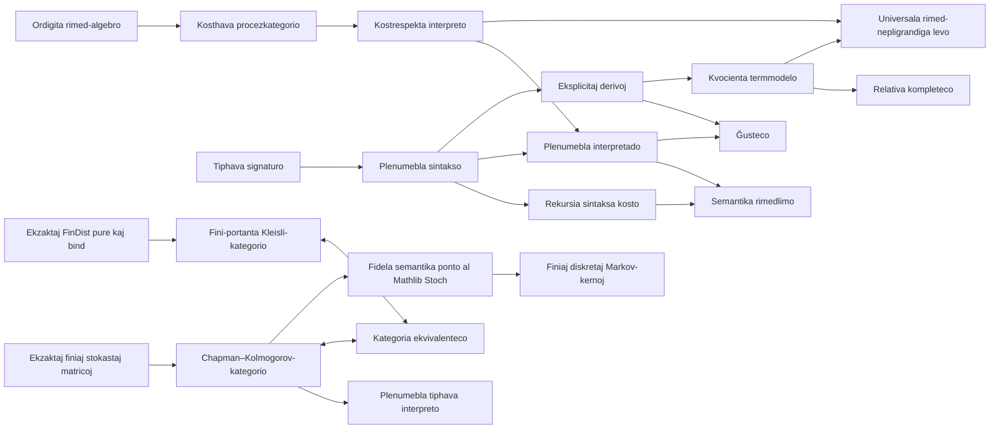

# Ript

**Kernel-kontrolita fundamento en Lean 4 por rimed-indeksitaj procezteorioj.**

[English](../README.md) · [简体中文](README.zh-CN.md) ·
[日本語](README.ja.md) · [Esperanto](README.eo.md)

[](https://github.com/miuchan/ript/actions/workflows/ci.yml)


Ript formaligas malgrandan sed rigoran kernon por **Resource-Indexed Information
Process Theory**, esperante **Teorio de Rimed-Indeksitaj Informaj Procezoj**:
tiphavajn procezojn, kunmeteblajn rimedlimojn, plenumeblajn interpretojn,
eksplicitajn egalecderivojn, kaj relativan kompletecon per kanonaj termmodeloj.

La projekto konstruas siajn tavolojn laŭ rigora sinsekvo. Ĝi nun inkluzivas
ekzaktan, plenumeblan finian stokastan modelon, ĝian Kleisli-prezenton per
finiaj distribuoj, kaj fidelan semantikan ponton al la mezurteoria kategorio
`Stoch` de Mathlib. Ĝeneralaj modeloj sur mezureblaj spacoj, decidteorio,
termodinamiko, kvantuma teorio kaj pli altaj kategorioj restas esplorvojoj.
Ript disponigas kontrolitan fundamenton, sur kiu oni povas aldoni
tiujn tavolojn sen silente ŝanĝi procezkunmeton aŭ rimedkalkuladon.

> [!IMPORTANT]
> Ript estas frufaza esplorprogramaro. Etapoj 1–5 estas realigitaj kaj
> kontrolitaj de la kerno de Lean; la publika API ankoraŭ ne estas stabila, kaj
> la nuna kerno ne pretendas esti kompleta fizika teorio de informado.

## Enhavo

- [Kial Ript?](#kial-ript)
- [La formala kerno](#la-formala-kerno)
- [Kio estas pruvita](#kio-estas-pruvita)
- [Nuna amplekso kaj esplora stato](#nuna-amplekso-kaj-esplora-stato)
- [Arkitekturo](#arkitekturo)
- [Fidmodelo](#fidmodelo)
- [Rapida komenco](#rapida-komenco)
- [Plenumebla ekzemplo](#plenumebla-ekzemplo)
- [Uzi Ript kiel Lean-dependaĵon](#uzi-ript-kiel-lean-dependaĵon)
- [Gvidilo tra la deponejo](#gvidilo-tra-la-deponejo)
- [Kvalita kontrolpordo](#kvalita-kontrolpordo)
- [Projektaj principoj](#projektaj-principoj)
- [Vojmapo](#vojmapo)
- [Kontribuado](#kontribuado)
- [Oftaj demandoj](#oftaj-demandoj)
- [Versioj, citado kaj permesilo](#versioj-citado-kaj-permesilo)

## Kial Ript?

Multaj procezteorioj priskribas **kiuj procezoj estas kunmeteblaj**.
Rimed-konscia teorio devas krome priskribi **kiom kostas la kunmeto**, kaj ĝi
devas teni la du rakontojn koheraj:

- identaj procezoj estu senkostaj;
- sinsekva kaj paralela kunmetoj havu kunmeteblajn suprajn limojn;
- sintaksnivela takso fidinde limigu la semantikan koston en ĉiu interpreto;
- ekvacioj uzataj por reverki procezojn konservu kaj semantikon kaj koston;
- plenumeblaj modeloj restu uzeblaj sen importi kvocientan pruvmaŝinaron;
- ĉiu kompleteca aserto nomu la precizan modelon, rilate al kiu ĝi validas.

Ript prezentas tiujn devojn kiel Lean-interfacojn kaj pruvas iliajn centrajn
rilatojn unufoje. Malsupra modelo liveras siajn objektojn, primitivajn procezojn,
interpreton kaj kostleĝojn; tiam la ĝeneralaj teoremoj pri ĝusteco kaj rimedoj
aplikiĝas al ĝi.

La nomo **Ript** mallongigas **Resource-Indexed Information Process Theory**.
“Indeksita” estas laŭvorta: esprimoj kaj morfioj portas tiphavajn en- kaj
el-interfacojn, dum buĝetoj loĝas en eksplicita ordigita adicia rimed-algebro.

## La formala kerno

### 1. Ordigitaj adiciaj rimedoj

Rimedvaloroj loĝas en adicia komuta monoido kun ordo kongrua kun adicio. Ript
intence ne postulas latison, subtrahon, skalaran agon aŭ kvantalon ĝis konkreta
modelo vere bezonos tian pli fortan strukturon.

Por kosthava kategorio `C` kaj rimedtipo `R`, la bazaj leĝoj estas

```math
\operatorname{cost}(\mathrm{id}_X)=0,
\qquad
\operatorname{cost}(f \mathbin{\gg} g)
\leq \operatorname{cost}(f)+\operatorname{cost}(g).
```

La nedeviga monoida kapablo aldonas

```math
\operatorname{cost}(f \otimes g)
\leq \operatorname{cost}(f)+\operatorname{cost}(g),
```

kaj la nedeviga struktura-kosta kapablo deklaras asocigilojn, unuigilojn kaj
simetriajn plektaĵojn senkostaj strukturaj rekonektoj.

### 2. Tiphava plenumebla sintakso

La sinsekva lingvo enhavas primitivajn generilojn, identojn kaj sinsekvan
kunmeton. Ĝiaj indeksoj faras interfacajn miskongruojn nereprezenteblaj. La
monoida lingvo estas aparta kaj aldonas tensoron, asocigilojn, unuigilojn,
inversajn strukturajn mapojn kaj simetrian plektaĵon.

Ambaŭ lingvoj havas strukture rekursian `syntaxCost`. Ekzemple,

```math
\operatorname{syntaxCost}(f \mathbin{\gg} g)
=\operatorname{syntaxCost}(f)+\operatorname{syntaxCost}(g).
```

Ĉar la sintakso restas nekvocientigita, konstruado, interpretado, inspektado kaj
finiaj ekzemploj restas rekte plenumeblaj.

### 3. Kostrespektaj interpretoj

Interpreto sendas objektsimbolojn al semantikaj objektoj kaj generilojn al
semantikaj morfioj, kune kun pruvo ke ĉiu generilo respektas sian deklaritan
buĝeton. Interpretado estas ordinara struktura rekursio.

La centra rimedteoremo estas

```math
\operatorname{cost}(\operatorname{eval}(e))
\leq \operatorname{syntaxCost}(e).
```

Do pruvo de `syntaxCost e ≤ r` liveras kontrolitan semantikan aserton, ke
`eval e` restas en la buĝeto `r`.

### 4. Eksplicitaj derivoj, ĝusteco kaj relativa kompleteco

Ript ne identigas esprimojn nur per difina egaleco. Ĝi difinas eksplicitan
derivsistemon generitan de la kategoriaj leĝoj kaj—en la monoida tavolo—de la
koherleĝoj de simetriaj monoidaj kategorioj.

- **Ĝusteco (soundness):** ĉiu formala derivo interpretiĝas kiel egaleco en ĉiu
  kongrua interpreto.
- **Relativa kompleteco (relative completeness):** egaleco en la kanona
  termmodela interpreto implicas formalan deriveblon.
- **Buĝeta kompleteco en la libera modelo:** interpretado en la termmodelo havas
  precize la rekursie kalkulitan sintaksan koston.
- **Strikta libera universala eco:** ĉiu valida interpreto induktas fortan
  simetrian monoidan, rimed-nepligrandigan funktoron el la termmodelo; inter
  striktaj etendaĵoj samaj je generiloj, ĝia ago estas unika.

La vorto *relativa* gravas: la teoremo temas pri egaleco en la kanona kvocienta
termmodelo, ne pri senkondiĉa aserto super ĉiu imagebla semantika universo.

### 5. Ekzaktaj finiaj stokastaj kanaloj

La finia stokasta modelo prezentas kanalon kiel normaligitan matricon
`X → Y → ℚ≥0`. Identoj estas Dirac-matricoj, kunmeto estas finia
Chapman–Kolmogorov-sumo, kaj tensoro estas la produkta distribuo. Ĉiu objekto
eksplicite portas plenumeblajn enumeradon kaj decideblan egalecon, do kanaloj,
la Dirac-enigo, kopiado, forĵetado kaj interpretado kalkuliĝas sen uzi
nekomputeblan elekton por produkti rultempajn datumojn.

Determinismaj finiaj funkcioj eniĝas kiel fidela Dirac-funktoro, kiu konservas
kunmeton kaj tensoron. Kopiado estas la diagonala mapo, forĵetado celas la unikan
unuan valoron, kaj ĉiu finia stokasta kanalo plenumas la kaŭzan leĝon
`f ≫ discard = discard`.

### 6. Kleisli-prezento per finiaj distribuoj

`FinDist X` enhavas ekzaktan normaligitan masfunkcion `X → ℚ≥0`. Ĝiaj
plenumeblaj operacioj `pure` kaj `bind` plenumas la maldekstran kaj dekstran
unuecleĝojn kaj asociecon. Limigante la Kleisli-objektojn al la samaj
plenumeblaj finiaj portantoj kiel `FinStoch`, la morfioj estas
`X → FinDist Y` kaj formas veran kategorion.

Eksplicitaj vic-/matric-konvertoj donas funktorojn ambaŭdirekte. La morfiaj
konvertoj estas reciproke inversaj, la objekta kongruo estas difina, kaj
`kleisliEquivalence` pakas la naturajn izomorfiojn kiel kategorian ekvivalentecon.
La limigo estas necesa: ĉiuj racionalaj distribuoj sur finia portanto ĝenerale
formas senfinan aron, do ili ne restas en la finia baza kategorio postulata de
la nelimigita `CategoryTheory.Kleisli` de Mathlib.

### 7. Fidela ponto al Mathlib `Stoch`

`Ript.Models.Probability.StochFunctor` konektas la ekzaktajn matricojn al la
mezurteoria probablobiblioteko de Mathlib sen anstataŭigi la finian plenumeblan
kernon. Ĉiu finia portanto ricevas la diskretan mezureblan strukturon, kaj
matrica vico `p : Y → ℚ≥0` interpretiĝas kiel la probablomezuro

```math
\sum_{y \in Y} \uparrow p(y) \; \delta_y.
```

La normaligo de la fonta vico pruvas, ke tiu mezuro havas tutan mason unu; tial
ĉiu morfio de `FinStoch` induktas Markov-kernon. La rezulta funktoro `toStoch`
konservas identojn kaj Chapman–Kolmogorov-kunmeton. Ĝi ankaŭ:

- sendas finiajn Dirac-matricojn al la determinismaj kernoj de Mathlib;
- estas fidela, ĉar maso de unuopaĵo reakiras ĉiun ekzaktan racionalan matrican
  elementon post la injekta enigo en `ℝ≥0∞`;
- konservas sendependan tensoran kunmeton tra eksplicita determinisma izomorfio
  inter la produkta mezurebla objekto de Mathlib kaj la sama finia produto kun
  la rekte donita diskreta supra mezurebla strukturo.

La lasta eco estas esprimita kiel komuta diagramo en `Stoch`, ne kiel difina
egaleco aŭ nedeklarita monoida-funktora instanco. Tiel la identigo de la
mezureblaj strukturoj restas videbla ĉe la teorema limo. Ĉiu nekomputebleco estas
izolita en ĉi tiu semantika ponto; `FinStoch`, `FinDist`, iliaj kunmetoj kaj
rultempaj ekzemploj restas plenumeblaj ekzaktaj datumoj en `ℚ≥0`.

## Kio estas pruvita

La jenaj ĉefaj rezultoj kompiliĝas hodiaŭ. La mallongaj esperantaj frazoj estas
neformalaj resumoj; la Lean-deklaroj estas aŭtoritataj.

| Lean-deklaro | Kontrolita rezulto |
| --- | --- |
| `Ript.Resource.budgeted_id` | Ĉiu idento haveblas kun nula buĝeto. |
| `Ript.Resource.budgeted_comp` | Buĝetoj adiciiĝas sub sinsekva kunmeto. |
| `Ript.Semantics.eval_cost_le` | Semantika interpretado estas limigita de la sintaksa kosto. |
| `Ript.Semantics.budget_sound` | Sintaksa buĝetpruvo donas semantikan buĝetpruvon. |
| `Ript.Semantics.soundness` | Ĉiu interpreto respektas sinsekvajn derivojn. |
| `Ript.Semantics.complete_via_term_model` | Egaleco en la termmodelo implicas sinsekvan deriveblon. |
| `Ript.Semantics.budget_complete_in_free_model` | La sinsekva termmodela kosto egalas la sintaksan koston. |
| `Ript.Resource.budgeted_tensor` | Buĝetoj adiciiĝas sub tensora kunmeto. |
| `Ript.Semantics.monoidalEval_cost_le` | Monoida interpretado estas limigita de la monoida sintaksa kosto. |
| `Ript.Semantics.monoidal_soundness` | Simetriaj monoidaj derivoj estas semantike ĝustaj. |
| `Ript.Semantics.monoidal_complete_via_term_model` | Monoida termmodela egaleco implicas deriveblon. |
| `Ript.Semantics.monoidal_budget_complete_in_free_model` | La monoida termmodela kosto egalas la sintaksan koston. |
| `Ript.Semantics.Free.lift_on_generator` | La universala levo kongruas kun la interpreto je generiloj. |
| `Ript.Semantics.Free.lift_preserves_cost` | La universala levo neniam pligrandigas procezan koston. |
| `Ript.Semantics.Free.lift_unique` | Ĉiu strikte struktur-konserva etendaĵo havas la saman agon kiel la universala levo. |
| `Ript.Models.FiniteStochastic.FinStoch.id_apply` | La stokasta idento estas la punkta Dirac-matrico. |
| `Ript.Models.FiniteStochastic.FinStoch.comp_apply` | Kunmeto estas la finia Chapman–Kolmogorov-sumo. |
| `Ript.Models.FiniteStochastic.FinStoch.tensor_apply` | La tensora kanalo multiplikas komponantajn probablojn. |
| `Ript.Models.FiniteStochastic.FinStoch.dirac_comp` | La Dirac-enigo konservas determinisman funkci-kunmeton. |
| `Ript.Models.FiniteStochastic.FinStoch.dirac_faithful` | La Dirac-enigo estas fidela je finiaj funkcioj. |
| `Ript.Models.FiniteStochastic.FinStoch.comp_discard` | Ĉiu finia stokasta kanalo konservas forĵetadon. |
| `Ript.Models.FiniteDistribution.FinDist.pure_bind` | Punktaj distribuoj estas maldekstraj unuoj por `bind`. |
| `Ript.Models.FiniteDistribution.FinDist.bind_pure` | Punktaj distribuoj estas dekstraj unuoj por `bind`. |
| `Ript.Models.FiniteDistribution.FinDist.bind_assoc` | Ekzakta fini-distribua `bind` estas asocieca. |
| `Ript.Models.FiniteStochastic.kleisliToChannel_channelToKleisli` | La inversa konverto reakiras ĉiun matricon. |
| `Ript.Models.FiniteStochastic.channelToKleisli_kleisliToChannel` | La inversa konverto reakiras ĉiun Kleisli-morfion. |
| `Ript.Models.FiniteStochastic.kleisliEquivalence` | `FinStoch` ekvivalentas al la fini-portanta Kleisli-kategorio de `FinDist`. |
| `Ript.Models.Probability.StochFunctor.rowMeasure_singleton` | La unuopaĵa maso de interpretita vico reakiras la ekzaktan fontan matric-elementon. |
| `Ript.Models.Probability.StochFunctor.toKernel_comp` | Ekzakta Chapman–Kolmogorov-kunmeto fariĝas kunmeto de Mathlib-kernoj. |
| `Ript.Models.Probability.StochFunctor.toStoch_map_dirac` | Dirac-matricoj fariĝas determinismaj `Stoch`-kernoj. |
| `Ript.Models.Probability.StochFunctor.toStoch_map_eq_iff` | La `Stoch`-interpreto ne perdas informon pri ekzaktaj finiaj kanaloj. |
| `Ript.Models.Probability.StochFunctor.productMeasurableSpace_eq_top` | Produto de finiaj diskretaj mezureblaj spacoj estas denove diskreta. |
| `Ript.Models.Probability.StochFunctor.toStoch_map_tensor` | Sendependa tensora kunmeto konserviĝas tra la kanona kompara izomorfio. |

[BLUEPRINT.md](../BLUEPRINT.md) enhavas detalajn teoremregistrojn kun
antaŭkondiĉoj, komputebleco, fontdosieroj kaj kernaj dependoj.
[AXIOMS.md](../AXIOMS.md) registras la maŝine kontrolatan inventaron de
aksiomoj.

## Nuna amplekso kaj esplora stato

“PROVED” signifas, ke la realigo kaj la nomitaj teoremaj devoj estas akceptitaj
de la fiksita Lean-kerno. Ĝi ne signifas, ke rilata scienca interpreto estas
eksperimente validigita aŭ publikigita kiel finita fizika teorio.

| Etapo | Amplekso | Stato |
| --- | --- | --- |
| 0 | Reproduktebla projekto, dokumentaro, CI kaj revizia bazlinio | **PROVED** |
| 1 | Sinsekva rimed-proceza kerno | **PROVED** |
| 2 | Tensoro, simetrio, paralelaj rimedoj kaj la strikta libera universala levo | **PROVED** |
| 3 | Plenumebla finia stokasta modelo | **PROVED** |
| 4 | Kleisli-prezento de finiaj distribuoj | **PROVED** |
| 5 | Fidela finia-kanala ponto al Mathlib `Stoch` | **PROVED** |
| 6–11 | Pliaj semantikaj modeloj kaj pli altaj tavoloj | **OPEN RESEARCH** |

La realigita modelsubteno estas intence mallarĝa:

| Modelo | Sinsekva | Tensora | Komputebleco | Notoj |
| --- | --- | --- | --- | --- |
| `FintypeCat` kun nula kosto | Jes | Ne | Plenumebla | Determinismaj finiaj funkcioj |
| `FiniteFunction.Metered` | Jes | Ne | Plenumebla | Funkcioj portas eksplicitajn natur-nombrajn kostojn |
| Sinsekva termmodelo | Jes | Ne | Pruva tavolo | Kvociento laŭ eksplicitaj kategoriaj derivoj |
| Simetria monoida termmodelo | Jes | Jes | Pruva tavolo | Kvociento laŭ eksplicitaj monoidaj derivoj |
| Ekzaktaj finiaj stokastaj kanaloj | Jes | Jes | Plenumebla | Normaligitaj `ℚ≥0`-matricoj, Dirac, kopiado, forĵetado |
| Fini-distribua Kleisli-kategorio | Jes | Ne | Plenumebla | Ekzaktaj `pure`/`bind`; kategorie ekvivalenta al `FinStoch` |
| Finia diskreta bildo de la Mathlib-`Stoch`-ponto | Jes | Jes, ĝis kanona izomorfio | Semantika tavolo | Fidela Markov-kerna interpreto; la fontaj matricoj restas plenumeblaj |

Kopiado, forĵetado kaj kaŭzeco estas realigitaj en la finia stokasta modelo,
kaj ĝia finia diskreta bildo nun havas kontrolitan mezurteorian semantikon en
Mathlib `Stoch`. Ĝeneralaj stokastaj modeloj sur arbitraj mezureblaj spacoj,
ĝeneralaj interfacoj por kopiado, forĵetado kaj konvekseco, termika strukturo,
kvantumaj kanaloj, univalenteco kaj pli altkategoria strukturo estas
**ne realigitaj**. Vidu
[MODEL_MATRIX.md](../MODEL_MATRIX.md) por la aŭtoritata kapablomatrico kaj
[CONJECTURES.md](../CONJECTURES.md) por formale registritaj malfermitaj asertoj.
Nuntempe neniu konjekto estas registrita.

## Arkitekturo

Ript apartigas plenumeblajn datumojn disde kvocient-bazita pruva semantiko.



| Tavolo | Ĉefaj moduloj | Respondeco |
| --- | --- | --- |
| Rimedinterfacoj | `Ript.Resource.*` | Ordigitaj buĝetoj, buĝetitaj morfioj, malfortigo |
| Procezkapabloj | `Ript.Core.*` | Sinsekvaj, tensoraj kaj strukturaj kostleĝoj |
| Plenumebla sintakso | `Ript.Syntax.*` | Tiphavaj esprimoj, rekursia kosto, derivoj |
| Semantiko | `Ript.Semantics.*` | Interpretoj, interpretado, ĝusteco, kompleteco |
| Konkretaj modeloj | `Ript.Models.*` | Finiaj funkcioj, finiaj distribuoj kaj ekzaktaj stokastaj kanaloj |
| Plenumeblaj ekzemploj | `Ript.Examples.*` | Kalkulitaj kondutoj kaj buĝetkontroloj |
| Revizia surfaco | `Ript.Audit.*` | Deklar-lintado kaj raportado de kernaj aksiomoj |

La sinsekva kerno restas memstare uzebla. La simetria monoida tavolo etendas ĝin
per apartaj interfacoj, anstataŭ postuli tensoran strukturon en ĉiu sinsekva
difino.

## Fidmodelo

Ript estas projektita tiel, ke pruva fido estas inspektebla, ne implicita.

- Ĉiuj bibliotekaj teoremoj estas kontrolitaj de la Lean-kerno.
- La kvalita kontrolpordo malpermesas `sorry`, `admit`, `sorryAx`, proprajn
  deklarojn `axiom`/`constant`, nesekurajn deklarojn kaj `Lean.trustCompiler`.
- Ĉiu realiga modulo uzas `autoImplicit false`.
- Ĉiuj kompilaj avertoj estas traktataj kiel eraroj.
- La projekto importas specifajn Mathlib-modulojn, ne la tutan `Mathlib`-ombrelon.
- La aksiomoj de la ĉefaj teoremoj estas maŝine komparataj kun dokumentita
  permeslisto.
- Nepruvitaj esploraj asertoj apartenas al `CONJECTURES.md`, neniam al la
  teorema nomspaco alivestitaj kiel finitaj rezultoj.

La revizio de la ĉefaj teoremoj de Etapoj 1 kaj 2 raportas nur la normajn
Lean-principojn `propext` kaj `Quot.sound` kie necesas. La pruvoj pri finiaj
stokastaj, Kleisli-prezentaj kaj `Stoch`-pontaj teoremoj ankaŭ raportas
`Classical.choice` tra la ĝenerala infrastrukturo de Mathlib por finiaj sumoj,
mezuroj kaj kategorioj. Tio ne produktas rultempajn datumojn: stokastaj objektoj
eksplicite portas enumeradon kaj decideblan egalecon, neniu fini-modela difino
estas `noncomputable`, kaj CI plenumas ekzaktajn kalkulojn en `ℚ≥0`.
Nekomputebleco aperas nur en la mezurteoria semantika modulo. `AXIOMS.md` fiksas
la efektivan rezulton por ĉiu teoremo per ekzakta komparo.

Por la preciza rezulto de ĉiu teoremo, rulu:

```bash
lake env lean Ript/Audit/AxiomChecks.lean
```

## Rapida komenco

### Antaŭkondiĉoj

- Git;
- [`elan`](https://github.com/leanprover/elan), la administrilo de Lean-ilĉenoj;
- medio subtenata de Lean 4: Linux, macOS aŭ Windows.

La deponejo fiksas kaj Lean kaj Mathlib. `elan` legas `lean-toolchain` kaj
aŭtomate instalas Lean `v4.33.0` kiam necese.

### Kloni kaj konstrui

```bash
git clone https://github.com/miuchan/ript.git
cd ript

# Rekomendite: elŝutu la kongruan antaŭkompilitan Mathlib-kaŝmemoron.
lake exe cache get

# Kompilu la tutan bibliotekon, traktante avertojn kiel erarojn.
lake build
```

La unua Lake-komando eble elŝutos la fiksitajn ilĉenon kaj pakaĵdependojn.
Postaj konstruoj reuzos la lokan `.lake`-kaŝmemoron.

### Ruli ĉiujn projektajn kontrolojn

```bash
./scripts/quality-gate.sh
```

Sukcesa rulo finiĝas per:

```text
All Ript quality gates passed.
```

## Plenumebla ekzemplo

`Ript/Examples/BitProcesses.lean` difinas unu-bitan signaturon kun Bulea nego kiel
primitiva generilo de kosto `1`. Ĝi konstruas du sinsekvajn negojn kaj interpretas
ilin kaj en senkosta finifunkcia modelo kaj en eksplicite mezurita modelo.

La esenca esprimo estas:

```lean
def notNot : Expr signature .bit .bit :=
  .comp (.gen .not) (.gen .not)
```

Lean kalkulas kaj pruvas la sintaksan kaj semantikan kostojn:

```lean
example : notNot.syntaxCost = 2 := by decide

example :
    processCost (R := Nat) (eval meteredInterpretation notNot) = 2 := by
  decide
```

Rulu la kontrolitan ekzemplon rekte:

```bash
lake env lean Ript/Examples/BitProcesses.lean
```

La tri plenumeblaj kontroloj de tiu ekzemplo eligas:

```text
true
true
true
```

CI komparas tiun eligon ekzakte, do neintencita ŝanĝo de plenumebla konduto
malsukcesigas la kvalitan kontrolpordon.

`Ript/Examples/StochasticBits.lean` plenumas justan moneron, bruan neon,
tensoraĵon, kopiadon kaj la ĝeneralan tiphavan interpretilon per ekzaktaj finiaj
stokastaj kanaloj. Kvin pliaj kontroloj ĉiuj eligas `true`; interalie ili
konfirmas ekzakte la probablon `1/4` por paro da justaj bitoj.

`Ript/Examples/KleisliBits.lean` plenumas punktajn distribuojn, Kleisli-`bind`,
ambaŭ matricajn konvertojn kaj la funktorojn de la kategoria ekvivalenteco.
Ĝiaj kvar ekzaktaj kontroloj ankaŭ eligas `true`.

`Ript/Examples/StochBits.lean` poste pruvas ene de Mathlib `Stoch`, ke la
interpretita justa monero havas la atendatan unuopaĵan mason, brua nego konservas
la justan distribuon, determinisma nego estas determinisma kerno, kaj du justaj
moneroj plenumas la tensoran kompar-diagramon. Tiuj estas semantikaj pruvekzemploj,
ne pliaj rultempaj eligoj.

## Uzi Ript kiel Lean-dependaĵon

Ript eksportas la radikan modulon `Ript`. Dum la antaŭeldona fazo, fiksu konatan
enmeton anstataŭ sekvi moviĝantan branĉon:

```lean
require ript from git
  "https://github.com/miuchan/ript.git" @ "<full-commit-sha>"
```

Poste importu la tutan publikan surfacon aŭ pli mallarĝan modulon:

```lean
import Ript
-- aŭ, por pli malgranda dependolimo:
import Ript.Semantics.Eval
-- aŭ, por la finia mezurteoria ponto:
import Ript.Models.Probability.StochFunctor
```

La Lake-pakaĵo nun havas version `0.1.0`, sed stabila API aŭ markita eldono
ankoraŭ ne estas promesita. Fiksi kompletan SHA estas necese por reproduktebla
malsupra laboro.

## Gvidilo tra la deponejo

| Vojo | Celo |
| --- | --- |
| [`Ript/Core/`](../Ript/Core/) | Abstraktaj kapabloj pri procezkosto |
| [`Ript/Resource/`](../Ript/Resource/) | Rimed-algebroj kaj kontrolitaj buĝetoj |
| [`Ript/Syntax/`](../Ript/Syntax/) | Sinsekvaj kaj simetriaj monoidaj lingvoj |
| [`Ript/Semantics/`](../Ript/Semantics/) | Interpretado, ĝusteco, termmodeloj, kompleteco |
| [`Ript/Models/`](../Ript/Models/) | Determinismaj modeloj, ekzakta finia probablo kaj la Mathlib-`Stoch`-ponto |
| [`Ript/Examples/`](../Ript/Examples/) | Plenumeblaj ekzemploj |
| [`Ript/Audit/`](../Ript/Audit/) | Enirejoj por lintado kaj aksiomrevizio |
| [BLUEPRINT.md](../BLUEPRINT.md) | Dependografeo, etapoj, teoremregistroj, projektaj decidoj |
| [AXIOMS.md](../AXIOMS.md) | Nuna inventaro de kernaj aksiomoj |
| [MODEL_MATRIX.md](../MODEL_MATRIX.md) | Realigitaj kaj planataj modelkapabloj |
| [CONJECTURES.md](../CONJECTURES.md) | Formala registro de nesolvitaj esploraj asertoj |
| [CONTRIBUTING.md](../CONTRIBUTING.md) | Deviga evoluiga kaj pruva politiko |

## Kvalita kontrolpordo

Loka evoluigo kaj GitHub Actions uzas la samajn projekt-posedatajn kontrolojn.

| Kontrolo | Komando | Kion ĝi malebligas |
| --- | --- | --- |
| Fonta higieno | `scripts/check-source-quality.sh` | Lokokupaj pruvoj, propraj aksiomoj, nesekuraj deklaroj, implicitaj identigiloj, tro larĝaj importoj, vostaj spacoj |
| Radika kovrado | `lake exe mk_all --check` | Lean-dosieroj silente forestantaj el la radika biblioteka konstruo |
| Kerna konstruo | `lake build` | Tiperaroj kaj ĉiuj Lean-avertoj |
| Deklar-lintado | `lake env lean Ript/Audit/Lint.lean` | Regresoj de la deklarlintiloj de Mathlib |
| Plenumebla kontrakto | `scripts/check-examples.sh` | Ŝanĝoj de la atendataj finiaj ekzemplorezultoj |
| Aksioma permeslisto | `scripts/check-axioms.sh` | Novaj aŭ nedokumentitaj dependoj de ĉefaj teoremoj |

La branĉo `main` postulas la stabilan GitHub-kontrolon `Lean quality gate`, ankaŭ
por administrantoj. La postulataj kontroloj devas esti ĝisdataj kun `main`;
perfortaj puŝoj kaj forigo de la branĉo estas malŝaltitaj.

## Projektaj principoj

1. **Komenci per la plej malgranda reviziebla kerno.** Aldonu algebran strukturon
   nur kiam almenaŭ unu vera semantika modelo bezonas ĝin.
2. **Fari mistipajn procezojn nereprezenteblaj.** Objektindeksoj kodas la
   procezinterfacojn rekte en la esprimtipoj.
3. **Teni rimedleĝojn kunmeteblaj.** Identoj, sinsekvo, tensoro kaj struktura
   rekonekto havas apartajn, reuzeblajn kontraktojn.
4. **Apartigi plenumeblan sintakson disde pruvaj kvocientoj.** Komputado ne iĝu
   nekomputebla nur ĉar kompleteco uzas kvocientajn modelojn.
5. **Deklari la amplekson de kompleteco.** Ĉiu kompleteca aserto nomas sian
   kanonan modelon kaj pruvan limon.
6. **Trakti aksiomojn kiel versionitan API-surfacon.** Nova aksiomo en teoremo
   estas tuj kontroleraro, ne posta piednoto.
7. **Distingi realigon disde aspiro.** La finia diskreta `Stoch`-bildo estas
   realigita; ĝeneralaj stokastaj, kaŭzaj, termikaj, kvantumaj kaj pli altaj
   tavoloj restas klare markitaj kiel malfermita esploro.

## Vojmapo

La vojmapo estas pelata de pruvedevoj. Etapo progresas nur kiam ĝi havas
kompilitajn difinojn, ĉefajn pruvojn, plenumeblan evidenton kie konvene, kaj
ĝisdatigitan aksiomrevizion.

### Finita fundamento

- [x] Ordigita adicia rimedinterfaco
- [x] Subadiciaj sinsekvaj procezkostoj kaj kontrolitaj buĝetoj
- [x] Tiphava sinsekva sintakso kaj plenumebla interpretado
- [x] Eksplicitaj derivoj de kategoriaj leĝoj
- [x] Sinsekva ĝusteco kaj termmodela relativa kompleteco
- [x] Paralela kostkapablo kaj adiciaj tensorbuĝetoj
- [x] Tiphava simetria monoida sintakso kaj struktura rekonekto
- [x] Monoida ĝusteco kaj termmodela relativa kompleteco
- [x] Senkostaj kaj eksplicite mezuritaj finiaj determinismaj ekzemploj
- [x] Ekzaktaj plenumeblaj finiaj stokastaj kanaloj, Dirac, tensoro, kopiado kaj forĵetado
- [x] Ekzaktaj finiaj distribuoj, Kleisli-kategorio, du komparfunktoroj kaj kategoria ekvivalenteco
- [x] Fidela funktoro de finiaj kanaloj al Mathlib `Stoch`, kun determinismaj kaj tensor-komparaj teoremoj
- [x] Reproduktebla CI, deklar-lintado kaj aksioma permeslisto

### Malfermitaj esplorvojoj

- [ ] Semantike pravigitaj kopi- kaj forĵet-kapabloj ekster la finia stokasta modelo
- [ ] Ĝenerala stokasta semantiko sur mezureblaj spacoj preter la finia diskreta bildo
- [ ] Konveksa kaj kaŭza strukturo
- [ ] Termikaj kaj rimedteoriaj modeloj
- [ ] Kvantum-kanalaj modeloj
- [ ] Zorge izolitaj univalentaj aŭ pli altkategoriaj tavoloj

Tiuj markobutonoj ne promesas difinitan eldonordon. Ĉiu aldono devas konservi la
ekzistantan sinsekvan limon aŭ dokumenti intencan malkongruan ŝanĝon.

## Kontribuado

Kontribuoj estas bonvenaj kiam ili konservas la eksplicitajn fid- kaj
ampleksolimojn de la projekto.

1. Kreu branĉon el la nuna `main`.
2. Faru la plej malgrandan koheran ŝanĝon.
3. Aldonu kune pruvojn, plenumeblan evidenton kaj dokumentaron.
4. Rulu `./scripts/quality-gate.sh`.
5. Malfermu tirpeton kaj atendu sukceson de `Lean quality gate`.

Antaŭ proponi novan semantikan tavolon, priskribu ĝiajn bezonatajn algebrajn
kapablojn, almenaŭ unu konkretan modelon, ĝian komputeblecan limon, kaj la ĉefan
teoremon kiu pravigus la abstrakton. Legu [CONTRIBUTING.md](../CONTRIBUTING.md)
por la deviga politiko.

Uzu [GitHub Issues](https://github.com/miuchan/ript/issues) por reprodukteblaj
cimoj, pruvomankoj, dokumentproblemoj kaj bone limigitaj projektproponoj. Ne
enmetu akreditaĵojn, sekretojn aŭ ekspluatdetalojn en publikan raporton; la
projekto ankoraŭ ne deklaris privatan kanalon por sekurecaj raportoj.

## Oftaj demandoj

### Ĉu Ript estas kompleta teorio de informado, fiziko aŭ komputado?

Ne. Ĝi estas formala kunmetebla kerno por tiphavaj procezoj kaj adiciaj
rimedlimoj. La pli vastaj sciencaj tavoloj estas intence ne realigitaj.

### Ĉu la kostoj estas ekzaktaj?

Ne en ĉiu semantika modelo. La ĝeneralaj leĝoj estas subadiciaj, do la sintaksa
kosto estas fidinda supra limo. La kosto estas pruvita ekzakta en la kanonaj
sinsekva kaj monoida termmodeloj.

### Ĉu Ript jam subtenas probablon aŭ kvantumajn kanalojn?

Ekzaktaj finiaj stokastaj kanaloj jam estas subtenataj. Probabloj estas valoroj
en `ℚ≥0`, ĉiuj sumoj estas finiaj kaj plenumeblaj, kaj la ekvivalenteco kun la
fini-portanta Kleisli-kategorio de ekzaktaj distribuoj estas pruvita. Fidela
funktoro ankaŭ sendas ilin al la mezurteoria kategorio `Stoch` de Mathlib kaj
konservas determinismajn kanalojn kaj tensoron ĝis kanona kompara izomorfio.
Stokastaj modeloj sur arbitraj mezureblaj spacoj, termikaj modeloj kaj kvantumaj
kanaloj restas vojmapaj eroj.

### Ĉu la monoida tavolo implicas kopiadon aŭ forĵetadon?

Ne ĝenerale. Tensoro kaj simetrio solaj ne donas diagonalajn aŭ terminalajn
morfiojn. La finia stokasta modelo eksplicite realigas kopiadon kaj forĵetadon
kiel konkretajn operaciojn kun propraj leĝoj.

### Kial konservi apartan sinsekvan sintakson?

Tio tenas la plej malgrandan utilan teorion memstare plenumebla kaj ne trudas
monoidajn supozojn al ĉiu uzanto. La monoida sintakso estas etendaĵo kun klara
limo.

### Kial uzi kvocientajn termmodelojn se la sintakso estas plenumebla?

Plenumebla sintakso taŭgas por konstruado kaj interpretado; kvocientoj esprimas
egalecon modulo formalaj derivoj. Izolitaj termmodeloj donas la precizan
pruvobjekton bezonatan por relativa kompleteco sen polui la plenumeblan kodon.

### Ĉu mi povas dependi rekte de `main`?

Teknike jes, sed ne por reproduktebla laboro. Ankoraŭ ne ekzistas stabila API;
fiksu kompletan enmetan SHA.

## Versioj, citado kaj permesilo

### Versioj

La Lake-pakaĵo nun deklaras version `0.1.0`. Ĝis ekzistos markitaj eldonoj kaj
eksplicita stabilecpolitiko, ŝanĝoj povas esti malkongruaj eĉ se la pakaĵversio
ne ŝanĝiĝas.

### Citado

Ript ankoraŭ ne havas arkivan artikolon aŭ DOI. En esploraj artefaktoj, citu la
deponejan URL kune kun la kompleta SHA efektive uzita, kaj arkivu tiun enmeton en
via reproduktebla materialo. Formala citdosiero estu aldonita nur kiam la aŭtora
kaj publikiga metadatumoj estos deciditaj.

### Permesilo

Neniu malfermfonta permesilo ankoraŭ estas elektita por ĉi tiu deponejo. Publika
videbleco de la fonto **ne** per si mem donas rajton kopii, redistribui aŭ krei
derivaĵojn. Ĝis aldono de permesila dosiero, validas la ordinaraj aŭtorrajtaj
limigoj. Ĉi tiu klarigo estas intenca por ke malsupraj uzantoj ne supozu rajtojn
kiuj ne estis donitaj.

## Dankoj

Ript estas konstruita per [Lean 4](https://lean-lang.org/) kaj
[Mathlib](https://github.com/leanprover-community/mathlib4). Iliaj ekosistemoj
pri kategoriteorio, algebro, iloj kaj pruvinĝenierado ebligas ĉi tiun projekton.
