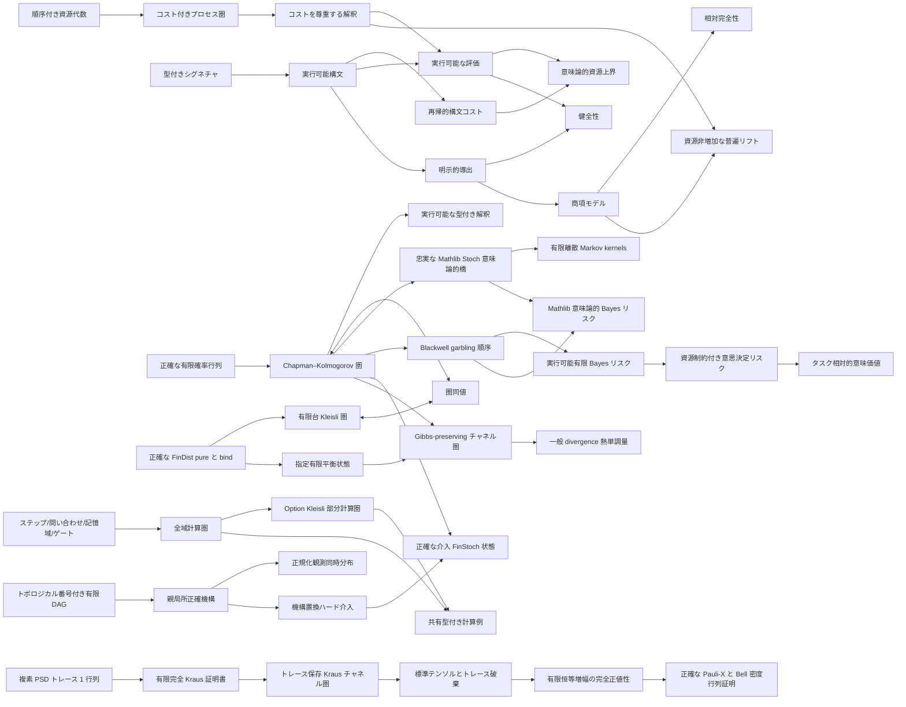

# Ript

**資源添字付きプロセス理論のための、Lean 4 カーネル検証済み基盤。**

[English](../README.md) · [简体中文](README.zh-CN.md) ·
[日本語](README.ja.md) · [Esperanto](README.eo.md)

[](https://github.com/miuchan/ript/actions/workflows/ci.yml)


Ript は **Resource-Indexed Information Process Theory（資源添字付き情報プロセス理論）**
のための、小さく厳密な核を形式化します。型付きプロセス、合成可能な資源上界、実行可能な
解釈、明示的な等式導出、そして標準項モデルによる相対完全性がその中心です。

本プロジェクトは各層を厳密な順序で構築します。現在は、正確で実行可能な有限確率モデル、
その有限分布 Kleisli 表現、そして Mathlib の測度論的圏 `Stoch` への忠実な意味論的橋渡しを
含みます。その上に、Blackwell 比較、正確で実行可能な有限 Bayes リスク、資源制約付き
意思決定リスク、タスク相対的な意味価値も形式化しました。また、明示的なステップ・問い合わせ・
記憶域・ゲート資源を持つ全域計算と失敗可能計算の圏に加え、実行可能な有限 DAG 因果モデル、
親だけを読む正確な機構、正規化観測同時分布、ハード介入、正確な `FinStoch` 意味論も含みます。
次の層として、指定平衡分布を持つ有限熱系、Gibbs-preserving な正確チャネルの圏とテンソル
bifunctor、自由平衡状態の準備、一般 divergence の単調性も実装しました。一般の可測因果モデル、
Blackwell 逆表現定理、有限 KL のデータ処理、エネルギーから導く Gibbs 状態は研究課題です。
さらに Ript には、古典確率モデルと分離された有限次元複数量子コアがあります。正半定値かつ
トレース 1 の密度行列、有限完全 Kraus 族で認証された作用、正値性とトレース保存、恒等・直列
合成閉包、標準チャネルテンソル、interchange、基底 bra によるトレース/破棄チャネルと因果的一意性、
チャネル圏、任意の有限補助系に対する完全正値性、正規化 Bell 密度行列、正確な Pauli-X
一量子ビット・二量子ビット証明を実装しました。古典から量子への層も実装済みです：
`sqrt(P(y | x)) |y><x|` を Kraus 演算子として、脱位相化冪等部分圏への忠実な測定—準備
関手を構成し、恒等・合成・テンソル・対角状態発展・確率の復元を証明しました。
資源型を固定した高次圏層も実装・コンパイル済みです。資源添字付き対称モノイダル過程モデル、
資源非増加な強 braided monoidal 関手、モノイダル自然変換が双圏をなし、垂直・水平合成、
interchange、結合子、左右単位子、五角形・三角形 coherence を証明しました。明示的なコスト反映を
備えたコスト完全なモデル同値は、各過程のコストと直列・並列の中心的資源境界を保存します。
Stage 11 では、意図的に小さく保った公理不要の内部ユニバレントなプロセス universe を追加しました。
empty・unit・sum・tensor・原子的インターフェースの深い code は、構造同値の構文と内部同一性の
構文を別々に持ちます。その意味論的商は実際の Mathlib groupoid をなし、内部同一性と内部構造同値は
同値であり、同値による再添字付けを持つ深いプロセス言語には健全性定理があります。これは集合レベルの
1-truncated モデルであり、外部 univalence を仮定せず、任意の Lean 型同値を型等式へ変換しません。
Stage 12 は、厳密に範囲を限定した最初の completion を実装しました。選択不要の対象商は、内部同一性が
単に存在するときに限り code を同一視し、不変写像と内部述語の普遍的降下を与えます。別の非計算的な
Mathlib skeleton は全自己同型を保持し、元の groupoid と圏同値です。これは 0/1-truncated な基礎であり、
Rezk completion の主張ではありません。
presheaf への道筋にも、コンパイル済みの第一層が加わりました。Yoneda 埋め込みは内部 groupoid を
型値 presheaf へ充満忠実に埋め込み、内部同一性と構造同値は、可表 presheaf 間の自然変換と自然同型に
それぞれ正確に対応します。可表対象の本質像は元の groupoid と圏同値な groupoid を形成します。
この `YonedaEnvelope` は通常の 1-圏論的包絡であり、Rezk completion ではありません。
Ript は、プロセス合成や資源会計の意味を暗黙に変えることなく、将来の層を追加するための
検証済み土台を提供します。

> [!IMPORTANT]
> Ript は初期段階の研究ソフトウェアです。Stage 1 から Stage 12 の実装済み基礎層は Lean の
> カーネルにより検証されていますが、公開 API はまだ安定しておらず、現在の核を完全な
> 物理的情報理論だと主張するものではありません。

## 目次

- [Ript が必要な理由](#ript-が必要な理由)
- [形式化された核](#形式化された核)
- [証明済みの内容](#証明済みの内容)
- [現在の範囲と研究状況](#現在の範囲と研究状況)
- [アーキテクチャ](#アーキテクチャ)
- [信頼モデル](#信頼モデル)
- [クイックスタート](#クイックスタート)
- [実行可能な例](#実行可能な例)
- [Lean 依存パッケージとして使う](#lean-依存パッケージとして使う)
- [リポジトリ案内](#リポジトリ案内)
- [品質ゲート](#品質ゲート)
- [設計原則](#設計原則)
- [ロードマップ](#ロードマップ)
- [コントリビューション](#コントリビューション)
- [よくある質問](#よくある質問)
- [バージョン引用ライセンス](#バージョン引用ライセンス)

## Ript が必要な理由

多くのプロセス理論は、**どのプロセスを合成できるか**を記述します。資源を考慮する理論は
さらに、**合成にどれだけのコストがかかるか**を記述し、両者の整合性を保たなければなりません。

- 恒等プロセスは無償であるべきです。
- 直列合成と並列合成には、合成可能な資源上界が必要です。
- 構文レベルの見積もりは、あらゆる解釈における意味論的コストを健全に上から抑えるべきです。
- プロセスを書き換える方程式は、意味とコストの両方を保存すべきです。
- 実行可能モデルは、商型の証明機構を取り込まずに利用できるべきです。
- 完全性の主張は、どのモデルに対して相対的に成立するかを明示すべきです。

Ript はこれらの要件を Lean のインターフェースとしてまとめ、中心的な関係を一度だけ証明します。
下流モデルは、対象・原始プロセス・解釈・コスト則を与えることで、一般的な健全性定理と
資源定理を再利用できます。

**Ript** は **Resource-Indexed Information Process Theory** の略です。「添字付き」は
文字どおりの意味であり、式と射は型付けされた入出力インターフェースを持ち、予算は明示的な
順序付き加法資源代数の中に置かれます。

## 形式化された核

### 1. 順序付き加法資源

資源値は、加法と両立する順序を備えた加法可換モノイドに属します。具体的モデルが必要とする
までは、束、減法、スカラー作用、quantale といった強い構造を要求しません。

資源型 `R` 上でコストを持つ圏 `C` の基本則は次のとおりです。

```math
\operatorname{cost}(\mathrm{id}_X)=0,
\qquad
\operatorname{cost}(f \mathbin{\gg} g)
\leq \operatorname{cost}(f)+\operatorname{cost}(g).
```

オプションのモノイダル能力は、さらに次を加えます。

```math
\operatorname{cost}(f \otimes g)
\leq \operatorname{cost}(f)+\operatorname{cost}(g).
```

別のオプション能力により、結合子・単位子・対称ブレイディングをコスト 0 の構造的配線変更と
して宣言できます。

### 2. 型付きで実行可能な構文

直列言語は、原始生成子、恒等式、直列合成からなります。型の添字により、インターフェースが
一致しない合成は表現できません。モノイダル言語は独立に保たれ、テンソル、結合子、単位子、
それらの逆、および対称ブレイディングを追加します。

どちらの言語にも構造再帰で計算される `syntaxCost` があります。たとえば、

```math
\operatorname{syntaxCost}(f \mathbin{\gg} g)
=\operatorname{syntaxCost}(f)+\operatorname{syntaxCost}(g).
```

構文をあらかじめ商にしないことで、構築・評価・検査・有限例を直接実行できます。

### 3. コストを尊重する解釈

解釈は、対象記号を意味論的対象へ、生成子を意味論的射へ写します。同時に、各生成子が宣言
された予算を守る証明も保持します。評価は通常の構造再帰です。

中心的な資源定理は次です。

```math
\operatorname{cost}(\operatorname{eval}(e))
\leq \operatorname{syntaxCost}(e).
```

したがって `syntaxCost e ≤ r` を証明すると、`eval e` が予算 `r` の範囲内にあるという
検証済みの意味論的命題が得られます。

### 4. 明示的導出、健全性、相対完全性

Ript は式を定義上の等しさだけで同一視しません。圏の法則から生成される明示的な導出体系を
定義し、モノイダル層では対称モノイダル整合性の法則も加えます。

- **健全性（soundness）：**すべての形式導出は、互換なすべての解釈で等しい射へ評価されます。
- **相対完全性（relative completeness）：**標準項モデルの解釈における等しさから形式的導出
  可能性が従います。
- **自由モデルにおける予算完全性：**項モデルでの評価コストは、再帰的に計算した構文コストと
  正確に一致します。
- **厳密な自由普遍性：**すべての適法な解釈は、項モデルから強対称モノイダルかつ資源非増加な
  関手を誘導します。生成子上で一致する厳密な拡張の中で、その作用は一意です。

「相対」という語は重要です。この完全性定理は標準商項モデルにおける等しさについて述べる
もので、考え得るすべての意味論的宇宙について無条件に主張するものではありません。

### 5. 正確な有限確率チャネル

有限確率モデルは、チャネルを正規化された行列 `X → Y → ℚ≥0` として表します。恒等射は
Dirac 行列、合成は Chapman–Kolmogorov の有限和、テンソルは積分布です。対象は計算可能な
列挙と決定可能等式を明示的に保持するため、チャネル、Dirac 埋め込み、コピー、破棄、評価は
非計算的な選択を使わず実行できます。

決定論的有限関数は忠実な Dirac 関手として埋め込まれ、合成とテンソルを保存します。対角写像に
よるコピーと唯一の単位値への破棄も明示的に実装され、すべての有限確率チャネルが破棄を保存する
因果律 `f ≫ discard = discard` を満たします。

### 6. 有限分布 Kleisli 表現

`FinDist X` は正規化された正確な質量関数 `X → ℚ≥0` を保持します。実行可能な `pure` と
`bind` は左単位律、右単位律、結合律を満たすことが証明されています。Kleisli 対象を
`FinStoch` と同じ実行可能な有限台に制限すると、射は `X → FinDist Y` となり、実際に圏を
構成します。

明示的な行列変換は両方向の関手を与えます。射の変換は互いに逆で、対象対応は定義上の等しさであり、
`kleisliEquivalence` は自然同型を圏同値としてまとめます。この制限は必要です。有限台上の有理確率
分布全体は一般に無限集合なので、Mathlib の無制限 `CategoryTheory.Kleisli` が要求する有限台の
基礎圏には閉じません。

### 7. Mathlib `Stoch` への忠実な橋渡し

`Ript.Models.Probability.StochFunctor` は、有限の実行可能な核を置き換えることなく、正確な
行列を Mathlib の測度論的確率ライブラリへ接続します。各有限台には離散可測空間を与え、
行列の一行 `p : Y → ℚ≥0` を次の確率測度として解釈します。

```math
\sum_{y \in Y} \uparrow p(y) \; \delta_y.
```

元の行の正規化からこの測度の全質量が 1 だと分かるため、各 `FinStoch` 射は Markov kernel を
定めます。得られる `toStoch` 関手は恒等射と Chapman–Kolmogorov 合成を保存し、さらに：

- 有限 Dirac 行列を Mathlib の決定論的 kernel へ写します。
- 単点集合の質量から `ℝ≥0∞` への単射的な埋め込みを通じて全ての正確な行列要素を復元できる
  ため、忠実です。
- Mathlib の積可測対象と、同じ有限積に離散最大可測構造を直接与えた対象との明示的な決定論的
  同型を介して、独立なテンソル合成を保存します。

最後の性質は、定義上の等しさや未宣言のモノイダル関手インスタンスではなく、`Stoch` 内の
可換図式として述べられます。これにより可測構造の同一視が定理の境界に明示されます。
非計算性はこの意味論的橋渡しだけに局所化され、`FinStoch`、`FinDist`、その合成と実行例は
正確な `ℚ≥0` データとして引き続き実行可能です。

### 8. Blackwell 比較とタスク相対的な意思決定価値

正確な有限実験は、隠れ状態から観測へのチャネル `P : Θ ⟶ X` です。Ript では、確率的
garbling `κ : X ⟶ Y` が存在して

```math
P mathbin{\gg} \kappa = Q
```

となるとき、かつそのときに限り `P` が `Q : Θ ⟶ Y` を Blackwell 支配すると定義します。
これはエントロピー比較ではなく操作的シミュレーション順序です。反射的・推移的で、共通の
前処理と独立テンソル積で保存されます。資源認証版は後処理予算も記録し、合成時に加算します。

Ript は二つの意思決定層を意図的に分離します。

- 意味論層は正確な有限データを `toStoch` で写し、Mathlib の
  `bayesRisk_le_bayesRisk_comp` を再利用します。したがって garbling は測度論的な最適
  Bayes リスクを減少させません。
- 実行可能層の `DecisionProblem` は `FinDist` 事前分布、有限行動、正確な `ℚ≥0` 損失を
  持ちます。`finiteBayesRisk` は無条件の下限ではなく、実際の `Finset.min'` 有限最小値の
  和です。ランダム化された有限意思決定チャネルもこの値を下回れないため、正確な有理数だけで
  独立したデータ処理証明が得られます。

計算制約には `DecisionResourceModel` を使います。各決定論的ルールへ自然数コストを割り当て、
コスト 0 のフォールバックを備えます。`resourceBayesRisk` は有限に列挙された実行可能ルール上で
最小化され、予算を増やしてもリスクは悪化しません。`DecisionReduction` は、持ち上げたルールの
意思決定品質が低下しないことと、コスト増加が明示した加法的 overhead 以下であることの両方を
証明します。overhead が 0 の場合、自由な後処理は資源制約付き価値を作れません。

最後に、

```math
\operatorname{value}(P;\text{タスク},\text{基準})
= \operatorname{risk}(\text{基準})-\operatorname{risk}(P)
```

として、意味価値を明示的な事前分布、行動空間、損失、基準実験、任意の予算に相対化します。
同じチャネルが、あるタスクでは正の価値を持ち、別のタスクでは 0 になり得ます。garbling
単調性、情報同値での不変性、基準自身でのゼロ、ゼロ損失タスクでの無関連性、予算単調性を
証明済みです。このタスク相対量を Shannon 情報と同一視してはいません。

### 9. 明示的資源を持つ全域計算と部分計算

最初の計算資源は `ComputationResource := Fin 4 → Nat` で、形式的ステップ数、oracle
問い合わせ、記憶域上界、回路ゲート数を表します。これは壁時計時間ではありません。加算と比較は
成分ごとで、実行可能な `ComputationResource.within` 検査には証明レベルの健全性があります。

`Computation.Total` の射は資源ベクトル付き全域関数です。`Computation.Partial` の射は
`X → Option Y` で、直列合成は本物の `Option` Kleisli 合成なので失敗が伝播します。両圏は
直列資源を正確に加算し、独立積 bifunctor、interchange、正確な並列資源加算を備えます。
現時点では native `MonoidalCategory` ではなく、証明済み bifunctor として公開します。

`Partial.ofTotal` は全域計算を必ず成功する部分計算へ埋め込み、全資源成分を保存します。同じ
型付き query/negation/guard プログラムを両モデルで実行し、`eval_cost_le` と予算検査を再利用します。

### 10. 有限 DAG 因果モデルとハード介入

`FiniteDAG n` は `Fin n` をノードとし、各親の番号が子より小さいというトポロジカル証明を
直接保持します。したがって標準番号順は実行可能で無閉路と証明済みであり、同時分布の構築に
古典的に選んだトポロジカルソートは不要です。任意の有限 DAG は境界でトポロジカル番号を与えれば
このインターフェースを利用できます。

`FiniteCausalModel n Value` は各ノードに正規化された正確な `FinDist Value` 機構を割り当てます。
機構が受け取るのは宣言された親の値だけです。Ript は局所条件質量をトポロジカル順に積算し、
各接頭辞の正規化を帰納的に証明して、観測因子分解式を満たす実行可能な同時分布を得ます。

`Intervention` はノードへの部分代入です。`do(node = value)` は対象の局所機構を
`FinDist.pure value` に置換し、観測同時分布の条件付けとしては定義しません。同じ介入は冪等で、
台が互いに素な介入は可換です。置換後も正規化と因子分解が保たれます。各局所機構は親代入から
ノード値への `FinStoch` チャネルに、観測・介入同時分布は `Object.unit` からの正確な確率状態に
解釈されます。

実行可能な二ノード例では、公平な Boolean 原因を結果がコピーします。観測時の不一致は質量ゼロです。
`do(effect = true)` の後も原因は公平で、観測では不可能だった `(false, true)` が正確な質量
`1/2` を持ちます。これは介入と通常の条件付けの違いを検証済みデータで示します。初版は意図的に
全ノードで共通の有限値型を使い、異種ノード値域と一般 do-calculus は将来の拡張です。

### 11. 有限熱系と Gibbs-preserving プロセス

`ThermalObject` は実行可能な有限状態空間と、正確に正規化された一つの `EquilibriumState` を
まとめます。この平衡分布は操作的データであり、初期層ではエネルギースペクトル、逆温度、指数型
Gibbs 公式から導出済みだとは主張しません。`FinDist.push` は分布を `FinStoch` チャネルで発展させ、
`FinDist.tensor` は独立系の積分布を作ります。

`GibbsPreserving X Y` は `T(γX) = γY` を満たす有限確率チャネルです。恒等、合成閉包、圏構造を
証明し、テンソルが積平衡を保存して恒等律と interchange を満たすことから明示的 bifunctor を構成
しました。各対象の指定平衡分布は熱テンソル単位からの自由状態としても構成されます。

divergence 層は仮定を隠しません。`Divergence Value` は状態比較と証明済み確率的データ処理則を
同時に持ちます。任意のそのような divergence と Gibbs-preserving `T` に対して
`D(Tp ‖ γY) ≤ D(p ‖ γX)` を証明し、`ThermalMonotone` としてパッケージ化します。これは KL の
DPI を未証明のまま仮定するものではありません。具体的有限 KL とその DPI、エネルギー、温度、
Gibbs 公式、自由エネルギー、Landauer 型不等式は独立した研究義務です。

### 12. 有限複素密度行列と Kraus チャネル

量子系は独自の有限基底対象を使います。古典有限確率対象の別名ではなく、古典的コピーを自動的に
継承しません。`DensityMatrix X` は複素行列 `ρ : Matrix X X ℂ` に Mathlib の作用素レベルの
正半定値証明 `ρ.PosSemidef` と正確な正規化 `trace ρ = 1` を持たせたものです。これは二次形式の
正値性であり、成分ごとの非負性ではありません。

`KrausRepresentation X Y map` は有限個の矩形作用素 `Kᵢ : Matrix Y X ℂ` を与え、

```text
map(ρ) = ∑ i, Kᵢ ρ Kᵢᴴ
```

と `∑ i, Kᵢᴴ Kᵢ = I` を証明します。Ript は `KρKᴴ` と有限和に対する正半定値性の閉包から
正値性保存を、トレースの巡回性と完全性方程式からトレース保存を導きます。したがって
`KrausChannel.applyDensity` は任意の入力密度行列から真正な出力密度行列を構成します。

`KrausChannel` は作用そのものを格納し、Kraus 証明書の存在だけを命題的に切り詰めます。Kraus
表現は一意でないため、チャネル等式は任意の表現選択ではなく実際の作用を比較します。単元恒等族と
全積 `LⱼKᵢ` により恒等・直列合成閉包を証明し、圏を構成します。量子ビット例では Pauli-X の
`XᴴX = I` と、二つの計算基底密度行列を交換することを正確に証明します。

テンソルはチャネルの作用だけから外延的に定義されます。Kraus 作用を標準複素線形写像へ持ち上げ、
Mathlib の行列—テンソル積線形同値で移送し、対ごとの Kronecker Kraus 作用素が全行列上の証明書を
与えます。状態の成分別発展、テンソル恒等則、interchange は証明済みです。基底 bra から作る破棄は
作用としてトレースであり、一次元系への唯一のチャネルなので、全チャネルが因果的破棄則を満たします。

完全正値性は Kraus 表現の背後にある直観ではなく、明示的な定理になりました。
`IsCompletelyPositive f` はすべての有限補助系 `A` と `A × X` 上のすべての正半定値同時行列に
量化し、恒等増幅 `id_A ⊗ f` が正値性を保つことを要求します。Ript は標準増幅が
`identity A ⊗ channel` の複素線形作用と正確に一致することを証明するため、すべての有限 Kraus
チャネルが積行列だけでなく任意の同時入力についてこの述語を満たします。これは現行層に固有の
通常の有限行列表現であり、Mathlib の別個の C\*-代数的 `CompletelyPositiveMap` API との未証明の
同値は主張しません。

量子ビット例は正規化 Bell 密度行列も構成し、正半定値性、トレース 1、`|00⟩`/`|11⟩` 間の
非対角コヒーレンス成分 `1/2` を証明します。さらに一般増幅定理を用いて、第二量子ビットだけに
Pauli-X を作用させても正値性が保たれることを示します。これは一般的な同時状態定理の具体例であり、
有限テストを証明の代用にしたものではありません。非分離性の形式定理はまだ主張しません。
Stage 9 の古典拡張は実装済みです。有限古典確率チャネルを
`sqrt(P(y | x)) |y><x|` による測定—準備チャネルへ写し、合成とテンソルを忠実に保存します。
古典恒等は全量子恒等ではなく基底脱位相化へ写るため、対象圏は脱位相化冪等部分圏です。

### 13. 公理不要の内部ユニバレントなプロセス universe

Stage 11 は深い埋め込みであり、境界は意図的に一方向です。`Code Atom` はプロセス・
インターフェースの小さな文法です。`EquivExpr A B` はその文法が明示的に許す構造同値を表し、
`PathExpr A B` は明示的な `ua` 構成子を持つ内部同一性 witness を表します。どちらも Lean の
等式ではなく、端点 code が表す小さな Lean 型の間の通常の同値へ解釈されるだけです。

`UniverseModel` を選ぶと、Ript は同値構文と同一性構文を、それぞれの外部解釈の等しさで商に
します。得られる `InternalEquiv A B` と `Identity A B` は反射・逆・合成・sum・tensor を持ち、
ラップされた code オブジェクトは Mathlib `Groupoid` をなします。中心定理は次です。

```lean
internalUnivalence (A B) : M.Identity A B ≃ M.InternalEquiv A B
```

両方向の往復則は証明済みです。各商における等しさも、その外部解釈の等しさによって正確に特徴づけ
られます。`InternalFamily` は内部同値に沿って構造を移送し、`InternalPredicate` は同値不変性を
明示的に提示しなければなりません。その上で indiscernibility 定理は、内部的に同一なインターフェース
が良形式の内部述語で区別できないことを示します。決定論的プロセス空間では、始域・終域の解釈同値で
関数を共役することにより、この構造同一性の移送を具体的に構成します。

付随する深いプロセス言語は、生成子、恒等、直列・並列合成、端点の再添字付けを含みます。明示的導出
系は圏則、tensor interchange、congruence、再添字付け則を含み、`ProcessDerives.soundness` は導出
可能なすべての等式がすべての決定論的 universe 解釈で成り立つことを証明します。Boolean 例は境界を
明確にします。`bit ⊗ unit` と `unit ⊗ bit` は Lean の code 構文として不等であると証明できますが、
tensor 対称性は内部同一性を与え、Boolean 否定を移送し、期待どおり swap として作用し、同値不変述語
から区別できません。

これは小さな集合意味論による誠実な 1-truncated 実装です。`(infinity,1)`-圏、高次 path coherence、
presheaf/simplicial モデル、Rezk completion、外部の structure identity、あるいは
`Equiv α β → α = β` を提供しません。これらは隠れた仮定ではなく、独立した研究義務です。

### 14. Truncated completion と普遍的降下

Stage 12 は、信頼境界と計算可能性の異なる二つの構成から始まります。`ObjectCompletion` は
`Nonempty (M.Identity A B)` による生インターフェース code の商で、代表元を選びません。completion
後の対象が等しいことは内部同一性の単なる存在と同値であり、`internalUnivalence` により内部構造同値の
単なる存在とも同値です。sum と tensor は商へ降下し、対称・結合・単位則が文字どおり Lean 等式になります。

この対象商にはコンパイル済みの普遍性があります。

```lean
objectCompletionUniversal (β) :
  (M.ObjectCompletion → β) ≃ M.InvariantMap β

internalPredicateCompletionEquiv :
  (M.ObjectCompletion → Prop) ≃ M.InternalPredicate
```

したがって実行可能データを商から取り出すには、生 code 上の写像が内部同一性不変である証明を先に与える
必要があり、代表元は選択されません。Boolean 例は正確な code 濃度を降下させ、
`bit + (bit tensor bit)` を `6` と評価します。また、tensor 対称な表示は completion 後に等しくても、
元の Lean 構文は不等のままであることを証明します。

`SkeletalCompletion` は意図的に別層です。内部 groupoid の Mathlib skeleton を再利用し、それ自身が
skeletal groupoid で、全自己同型を保持し、元の groupoid と同値です。その同値に沿う制限から次を得ます。

```lean
skeletalCompletionUniversal (E) :
  (M.SkeletalCompletion ⥤ E) ≌ (M.Object ⥤ E)
```

Mathlib は skeleton の代表を選ぶため、この圏論層は `noncomputable` と明記され、監査結果に
`Classical.choice` を含みます。選択不要の対象商の普遍性には含まれません。どちらも高次 path、complete
Segal coherence、presheaf localization、外部 univalence、資源プロセス双圏の Rezk completion を与えません。

### 15. 可表 presheaf と Yoneda 包絡

内部 groupoid は、真正な型値 presheaf 意味論を持つようになりました。

```lean
PresheafUniverse M := M.Objectᵒᵖ ⥤ Type u

yonedaEmbeddingFullyFaithful :
  M.yonedaEmbedding.FullyFaithful
```

`A` の可表 presheaf をインターフェース `B` で評価すると、内部同一性型 `M.Identity B A` が正確に
得られます。充満忠実性は、この点ごとの観察を次の厳密な同値へ持ち上げます。

```lean
representableTransformationEquiv (A B) :
  M.Identity A B ≃
    (M.representablePresheaf A ⟶ M.representablePresheaf B)

representableNaturalIsoEquiv (A B) :
  M.Identity A B ≃
    (M.representablePresheaf A ≅ M.representablePresheaf B)

representableEquivNaturalIsoEquiv (A B) :
  M.InternalEquiv A B ≃
    (M.representablePresheaf A ≅ M.representablePresheaf B)
```

これらの可表対象間の自然変換はすべて可逆です。Yoneda 埋め込みが充満忠実で、始域がすでに
groupoid だからです。内部同一性の合成は自然変換の合成へ写るため、これは単なる対象数の類似ではなく、
構造を保存する対応です。

`YonedaEnvelope` は、可表 presheaf と同型な presheaf の充満部分圏です。Yoneda はこの部分圏を経由して
分解し、制限された関手は圏同値となり、包絡は groupoid 構造を継承します。任意の対象圏 `E` について、

```lean
yonedaEnvelopeUniversal (E) :
  (M.YonedaEnvelope ⥤ E) ≌ (M.Object ⥤ E)
```

が成り立ちます。Boolean 例は tensor 対称性を自然変換へ写し、それを始域の恒等射で評価して元の内部
path を復元します。また、元の code が不等なままで、対応する包絡対象が同型であることも構成します。

この層の古典的境界は明示されています。固定された Mathlib の `CategoryTheory.yoneda` と
`Yoneda.fullyFaithful` 自体が `[propext, Classical.choice, Quot.sound]` と監査され、本質像の圏同値も
可表対象の witness を選択します。その値が実行可能構文や有限モデルへ流入することはありません。
この包絡は同型な presheaf を外部 Lean 等式にせず、simplicial object、complete Segal 条件、高次
coherence、localization 定理、外部 univalence のいずれも与えません。

## 証明済みの内容

次の主要結果は現在すべてコンパイルされます。日本語の説明は非形式的な要約であり、Lean の
宣言そのものが正式な仕様です。

| Lean 宣言 | 検証済みの結果 |
| --- | --- |
| `Ript.Resource.budgeted_id` | すべての恒等射は予算 0 で利用できます。 |
| `Ript.Resource.budgeted_comp` | 直列合成では予算が加算されます。 |
| `Ript.Semantics.eval_cost_le` | 意味論的評価のコストは構文コスト以下です。 |
| `Ript.Semantics.budget_sound` | 構文予算の証明から意味論的予算の証明が得られます。 |
| `Ript.Semantics.soundness` | すべての解釈が直列導出を尊重します。 |
| `Ript.Semantics.complete_via_term_model` | 項モデルでの等しさから直列導出可能性が従います。 |
| `Ript.Semantics.budget_complete_in_free_model` | 直列項モデルのコストは構文コストに一致します。 |
| `Ript.Resource.budgeted_tensor` | テンソル合成では予算が加算されます。 |
| `Ript.Semantics.monoidalEval_cost_le` | モノイダル評価のコストはモノイダル構文コスト以下です。 |
| `Ript.Semantics.monoidal_soundness` | 対称モノイダル導出は意味論的に健全です。 |
| `Ript.Semantics.monoidal_complete_via_term_model` | モノイダル項モデルでの等しさから導出可能性が従います。 |
| `Ript.Semantics.monoidal_budget_complete_in_free_model` | モノイダル項モデルのコストは構文コストに一致します。 |
| `Ript.Semantics.Free.lift_on_generator` | 普遍リフトは生成子上で与えられた解釈と一致します。 |
| `Ript.Semantics.Free.lift_preserves_cost` | 普遍リフトはプロセスのコストを増加させません。 |
| `Ript.Semantics.Free.lift_unique` | 構造を厳密に保存するすべての拡張は普遍リフトと同じ作用を持ちます。 |
| `Ript.Models.FiniteStochastic.FinStoch.id_apply` | 確率的恒等射は点ごとの Dirac 行列です。 |
| `Ript.Models.FiniteStochastic.FinStoch.comp_apply` | 合成は Chapman–Kolmogorov の有限和です。 |
| `Ript.Models.FiniteStochastic.FinStoch.tensor_apply` | テンソルチャネルは成分確率の積です。 |
| `Ript.Models.FiniteStochastic.FinStoch.dirac_comp` | Dirac 埋め込みは決定論的関数合成を保存します。 |
| `Ript.Models.FiniteStochastic.FinStoch.dirac_faithful` | Dirac 埋め込みは有限関数に対して忠実です。 |
| `Ript.Models.FiniteStochastic.FinStoch.comp_discard` | すべての有限確率チャネルは破棄を保存します。 |
| `Ript.Models.FiniteDistribution.FinDist.pure_bind` | 点分布は有限分布 bind の左単位です。 |
| `Ript.Models.FiniteDistribution.FinDist.bind_pure` | 点分布は有限分布 bind の右単位です。 |
| `Ript.Models.FiniteDistribution.FinDist.bind_assoc` | 正確な有限分布 bind は結合的です。 |
| `Ript.Models.FiniteStochastic.kleisliToChannel_channelToKleisli` | 行列から Kleisli への変換は逆変換で元に戻ります。 |
| `Ript.Models.FiniteStochastic.channelToKleisli_kleisliToChannel` | Kleisli から行列への変換は逆変換で元に戻ります。 |
| `Ript.Models.FiniteStochastic.kleisliEquivalence` | `FinStoch` は `FinDist` の有限台 Kleisli 圏と同値です。 |
| `Ript.Models.Probability.StochFunctor.rowMeasure_singleton` | 解釈された行測度の単点質量は元の正確な行列要素を復元します。 |
| `Ript.Models.Probability.StochFunctor.toKernel_comp` | 正確な Chapman–Kolmogorov 合成は Mathlib の kernel 合成になります。 |
| `Ript.Models.Probability.StochFunctor.toStoch_map_dirac` | Dirac 行列は決定論的な `Stoch` kernel になります。 |
| `Ript.Models.Probability.StochFunctor.toStoch_map_eq_iff` | `Stoch` 解釈は正確な有限チャネルの情報を失いません。 |
| `Ript.Models.Probability.StochFunctor.productMeasurableSpace_eq_top` | 有限離散可測空間の積も離散です。 |
| `Ript.Models.Probability.StochFunctor.toStoch_map_tensor` | 独立なテンソル合成は標準比較同型を介して保存されます。 |
| `Ript.Core.Simulates.trans` | 後処理シミュレーションは推移的です。 |
| `Ript.Core.SimulatesWithin.trans` | 資源認証付きシミュレーションは加法予算で合成されます。 |
| `Ript.Models.Decision.Blackwell.dominates_tensor` | 独立積は Blackwell 支配を保存します。 |
| `Ript.Models.Decision.Blackwell.semanticBayesRisk_mono` | Blackwell 支配から Mathlib の Bayes リスク順序が従います。 |
| `Ript.Models.Decision.FiniteRisk.finiteBayesRisk_le_randomizedDecisionRisk` | ランダム化有限ルールは計算済み有限最適値を下回りません。 |
| `Ript.Models.Decision.FiniteRisk.finiteBayesRisk_mono` | Garbling は正確で実行可能な有限 Bayes リスクを改善しません。 |
| `Ript.Models.Decision.ResourceBounded.resourceBayesRisk_antitone` | 意思決定予算を増やしても最適リスクは悪化しません。 |
| `Ript.Models.Decision.ResourceBounded.resourceBayesRisk_le_of_reduction` | 認証付き reduction は明示的な加法 overhead とともにリスクを移送します。 |
| `Ript.Models.Decision.SemanticValue.semanticValue_mono` | Garbling はタスク相対的意味価値を増やしません。 |
| `Ript.Models.Decision.SemanticValue.resourceSemanticValue_mono_reduction` | 資源価値は認証付き reduction と overhead に従います。 |
| `Ript.Models.Computation.ComputationResource.within_sound` | 実行可能ベクトル検査の成功から資源上界が従います。 |
| `Ript.Models.Computation.Total.tensor_comp` | 全域計算の並列実行は interchange を満たします。 |
| `Ript.Models.Computation.Partial.tensor_comp` | `Option` 並列実行は Kleisli interchange を満たします。 |
| `Ript.Models.Computation.Partial.ofTotal_resource` | 全域から部分への関手は全資源成分を保存します。 |
| `Ript.Examples.SimpleComputation.total_interpreter_cost_sound` | 一般の構文コスト健全性が全域実行器に適用されます。 |
| `Ript.Examples.SimpleComputation.partial_budget_checker_sound` | 部分計算検査器が正確な構文予算を認証します。 |
| `Ript.Models.Causal.FiniteDAG.acyclic` | 認証済み親関係には有向閉路がありません。 |
| `Ript.Models.Causal.FiniteCausalModel.prefixFactorMass_normalized` | 正規化局所機構は正規化されたトポロジカル接頭辞を生成します。 |
| `Ript.Models.Causal.FiniteCausalModel.observational_factorization` | 同時質量は親局所条件質量の積に正確に一致します。 |
| `Ript.Models.Causal.FiniteCausalModel.intervene_same` | ハード介入は対象機構を Dirac 分布で置換します。 |
| `Ript.Models.Causal.FiniteCausalModel.intervene_idempotent` | 同じ介入を繰り返しても追加の変化はありません。 |
| `Ript.Models.Causal.FiniteCausalModel.intervene_comm_of_disjoint` | 台が互いに素な介入は可換です。 |
| `Ript.Models.Causal.FiniteCausalModel.intervention_preserves_normalization` | ハード介入後の同時分布も正規化されています。 |
| `Ript.Models.Causal.FiniteCausalModel.interventional_factorization` | 介入状態は未変更条件機構と対象 Dirac 因子に分解します。 |
| `Ript.Examples.SimpleCausalModel.intervention_replaces_child_mechanism` | Boolean 鎖の例が介入と観測を正確に区別します。 |
| `Ript.Models.FiniteDistribution.FinDist.push_comp` | 分布の発展は確率チャネル合成を保存します。 |
| `Ript.Models.FiniteDistribution.FinDist.push_tensor` | 独立な発展は積分布と可換です。 |
| `Ript.Models.Thermal.GibbsPreserving.tensor_id` | テンソルは熱的恒等プロセスを保存します。 |
| `Ript.Models.Thermal.GibbsPreserving.tensor_comp` | 熱的テンソルは合成との interchange を満たします。 |
| `Ript.Models.Thermal.GibbsPreserving.equilibrium_is_free` | 各指定平衡状態は自由に準備できます。 |
| `Ript.Models.Thermal.Divergence.athermality_monotone` | DPI を持つ divergence は Gibbs-preserving 熱単調量を与えます。 |
| `Ript.Examples.SimpleThermalModel.thermalFlip_involutive` | 平衡を保つ Boolean 反転を二回合成すると熱的恒等になります。 |
| `Ript.Models.Quantum.KrausRepresentation.map_posSemidef` | 有限 Kraus 和は複素作用素の正値性を保存します。 |
| `Ript.Models.Quantum.KrausRepresentation.map_trace` | Kraus 完全性から正確なトレース保存が従います。 |
| `Ript.Models.Quantum.KrausChannel.map_posSemidef` | 認証済みチャネルは正半定値性を保存します。 |
| `Ript.Models.Quantum.KrausChannel.map_trace` | 認証済みチャネルは任意の行列のトレースを保存します。 |
| `Ript.Models.Quantum.KrausChannel.identity_applyDensity` | 単元恒等 Kraus 族は全密度行列を固定します。 |
| `Ript.Models.Quantum.KrausChannel.comp_applyDensity` | 合成チャネルの発展は逐次的な密度行列発展と一致します。 |
| `Ript.Models.Quantum.KrausChannel.tensor_applyDensity` | テンソルチャネルはテンソル積状態を成分別に発展させます。 |
| `Ript.Models.Quantum.KrausChannel.tensor_identity` | 二つの恒等チャネルのテンソルは積系の恒等です。 |
| `Ript.Models.Quantum.KrausChannel.tensor_comp` | 量子チャネルテンソルは直列合成との interchange を満たします。 |
| `Ript.Models.Quantum.KrausChannel.eq_discard` | トレースチャネルは単位系への唯一の Kraus チャネルです。 |
| `Ript.Models.Quantum.KrausChannel.comp_discard` | 全有限 Kraus チャネルが因果的破棄則を満たします。 |
| `Ript.Models.Quantum.KrausChannel.toLinearMap_isCompletelyPositive` | 全有限 Kraus チャネルは任意の有限恒等増幅の下で任意の同時行列の正値性を保ちます。 |
| `Ript.Models.Quantum.ClassicalEmbedding.transitionOperator_complete` | `sqrt(P(y | x)) |y><x|` は厳密な Kraus 完全性方程式を満たします。 |
| `Ript.Models.Quantum.ClassicalEmbedding.measurementPreparation_diagonalDensity` | 対角古典状態の量子発展は有限分布の確率的押し出しと厳密に一致します。 |
| `Ript.Models.Quantum.ClassicalEmbedding.measurementPreparation_comp` | 測定—準備は確率チャネル合成を保存します。 |
| `Ript.Models.Quantum.ClassicalEmbedding.measurementPreparation_tensor` | 測定—準備は同時行列空間全体でテンソルを保存します。 |
| `Ript.Models.Quantum.ClassicalEmbedding.measurementPreparation_faithful` | 埋め込みチャネルの等しさから全確率行列要素を復元できます。 |
| `Ript.Models.Quantum.ClassicalEmbedding.ClassicalQuantum.embedding_map_tensor` | 忠実な脱位相化部分圏関手はチャネルテンソルを保存します。 |
| `Ript.Examples.QubitChannel.bitFlipOperator_complete` | Pauli-X は Kraus 完全性 `XᴴX = I` を満たします。 |
| `Ript.Examples.QubitChannel.bitFlip_basisDensity` | Pauli-X は二つの計算基底密度行列を交換します。 |
| `Ript.Examples.QubitChannel.bitFlip_tensor_basisDensity` | 独立な二つの Pauli-X は両方の計算基底状態を正確に反転します。 |
| `Ript.Examples.QubitChannel.bellDensity_trace_one` | 明示的に正規化した Bell 密度行列のトレースは 1 です。 |
| `Ript.Examples.QubitChannel.bellDensity_cross_term` | その `|00⟩`/`|11⟩` コヒーレンス成分は正確に `1/2` です。 |
| `Ript.Examples.QubitChannel.bitFlip_amplification_bell_posSemidef` | 完全正値性により、増幅 Pauli-X 後も Bell 密度の正値性が保たれます。 |
| `Ript.Higher.ModelTransformation.horizontalComp_interchange` | モデルのモノイダル 2-射は水平・垂直合成について interchange を満たします。 |
| `Ript.Higher.model_pentagon` | モデル関手の結合子は双圏の五角形則を満たします。 |
| `Ript.Higher.model_triangle` | モデル関手の結合子と単位子は双圏の三角形則を満たします。 |
| `Ript.Higher.ModelHom.map_cost_eq` | 資源非増加でコストを明示的に反映するモデル射は、すべての過程コストを厳密に保存します。 |
| `Ript.Higher.ModelHom.map_comp_cost_le` | コスト完全なモデル射は、元モデルのコストによる直列コア境界を移送します。 |
| `Ript.Higher.ModelHom.map_tensor_cost_le` | コスト完全なモデル射は、元モデルのコストによる並列コア境界を移送します。 |
| `Ript.Higher.CostExactModelEquivalence.hom_map_cost_eq` | コスト完全な双圏同値の順方向射は過程コストを保存します。 |
| `Ript.Univalent.UniverseModel.internalUnivalence` | 商 universe の内部同一性は内部構造同値と同値です。 |
| `Ript.Univalent.UniverseModel.identity_eq_iff_interpret_eq` | 二つの内部同一性が等しいことは、その解釈同値が等しいことと同値です。 |
| `Ript.Univalent.UniverseModel.path_interpretation_sound` | 生の path が商モデルで等しければ、その外部解釈も等しくなります。 |
| `Ript.Univalent.UniverseModel.InternalPredicate.identity_indistinguishable` | 明示的に同値不変な内部述語は内部同一性を尊重します。 |
| `Ript.Univalent.UniverseModel.functionProcessStructureIdentity` | 始域・終域の同一性は明示的同値によって決定論的プロセス空間を移送します。 |
| `Ript.Univalent.ProcessDerives.soundness` | 導出可能な深いプロセス等式はすべての決定論的解釈で成立します。 |
| `Ript.Examples.UnivalentProcessUniverse.bitTensorUnit_ne_unitTensorBit` | 例の二つの端点 code は外部構文として不等のままです。 |
| `Ript.Examples.UnivalentProcessUniverse.swapIdentity_apply` | その内部同一性は期待される tensor swap として解釈されます。 |
| `Ript.Examples.UnivalentProcessUniverse.reindex_not_sound` | Boolean 否定の連続再添字付けは合成再添字付けと意味論的に一致します。 |
| `Ript.Univalent.UniverseModel.ObjectCompletion.ofCode_eq_iff_identity` | completion 後の code 等式は内部同一性の単なる存在と同値です。 |
| `Ript.Univalent.UniverseModel.ObjectCompletion.tensor_assoc` | completion 対象上の tensor は文字どおり結合的です。 |
| `Ript.Univalent.UniverseModel.objectCompletionUniversal` | 対象 completion からの写像は、生 code 上の内部同一性不変写像とちょうど一致します。 |
| `Ript.Univalent.UniverseModel.internalPredicateCompletionEquiv` | completion 対象上の述語は内部不変述語とちょうど一致します。 |
| `Ript.Univalent.UniverseModel.objectCompletionToSkeletal_bijective` | 選択不要の completion 対象と skeleton 対象は全単射で対応します。 |
| `Ript.Univalent.UniverseModel.skeletalCompletionUniversal` | skeleton と元の groupoid から出る関手圏は同値です。 |
| `Ript.Examples.UnivalentCompletion.codeCardinality_equiv` | 生成された全構造同値が正確なインターフェース濃度を保存します。 |
| `Ript.Examples.UnivalentCompletion.completionDoesNotReflectCodeEquality` | completion 等式と元構文木の不等式が同時に成立します。 |
| `Ript.Univalent.UniverseModel.yonedaEmbeddingFullyFaithful` | 内部 groupoid は型値 presheaf へ充満忠実に埋め込まれます。 |
| `Ript.Univalent.UniverseModel.representableTransformationEquiv_trans` | 内部 path の合成は可表自然変換の合成へ写ります。 |
| `Ript.Univalent.UniverseModel.representableNaturalIsoEquiv` | 内部同一性は可表対象間の自然同型と正確に一致します。 |
| `Ript.Univalent.UniverseModel.representableEquivNaturalIsoEquiv` | 内部構造同値は可表対象間の自然同型と正確に一致します。 |
| `Ript.Univalent.UniverseModel.representableTransformation_isIso` | 内部可表対象間の自然変換はすべて可逆です。 |
| `Ript.Univalent.UniverseModel.yonedaEnvelopeFactorization` | Yoneda 埋め込みは本質像の包絡を経由して分解します。 |
| `Ript.Univalent.UniverseModel.yonedaEnvelopeEquivalence` | 内部 groupoid と Yoneda 包絡は圏同値です。 |
| `Ript.Univalent.UniverseModel.yonedaEnvelopeUniversal` | Yoneda 包絡と元の groupoid から出る関手圏は同値です。 |
| `Ript.Examples.UnivalentPresheaf.swapTransformation_component` | Boolean tensor 対称性を始域の恒等射で評価すると元の path を復元します。 |
| `Ript.Examples.UnivalentPresheaf.envelopeIsoDoesNotReflectCodeEquality` | Yoneda 包絡で同型な表示でも、元の code 構文は不等のままです。 |
| `Ript.Examples.UnivalentPresheaf.swap_preserves_cardinality` | tensor 対称性はインターフェースの正確な濃度を保存します。 |

[BLUEPRINT.md](../BLUEPRINT.md) には、各定理の前提・計算可能性・ソースファイル・カーネル
仮定が記録されています。[AXIOMS.md](../AXIOMS.md) は機械的に照合される仮定一覧です。

## 現在の範囲と研究状況

「PROVED」は、実装と指定された定理の要件が、固定された Lean カーネルに受理されたことを
意味します。対応する科学的解釈が実験的に検証されたことや、完成した物理理論として出版
されたことを意味しません。

| Stage | 範囲 | 状態 |
| --- | --- | --- |
| 0 | 再現可能なプロジェクト、文書、CI、監査基準 | **PROVED** |
| 1 | 直列資源プロセスの核 | **PROVED** |
| 2 | テンソル、対称性、並列資源、厳密な自由普遍リフト | **PROVED** |
| 3 | 実行可能な有限確率モデル | **PROVED** |
| 4 | 有限分布の Kleisli 表現 | **PROVED** |
| 5 | Mathlib `Stoch` への忠実な有限チャネル橋 | **PROVED** |
| 6 | Blackwell 順序、有限意思決定リスク、資源予算、タスク相対価値 | **PROVED** |
| 7、計算 | 多次元全域モデルと `Option` 部分モデル | **PROVED** |
| 7、因果 | 有限 DAG 機構、正規化同時分布、介入、`FinStoch` 状態 | **PROVED** |
| 8 | 有限平衡系、Gibbs-preserving プロセス、一般 divergence 単調性 | **PROVED** |
| 9、有限量子チャネル | 複素密度行列、TP Kraus チャネル、テンソル/interchange、トレース破棄、因果的一意性、有限完全正値性 | **PROVED** |
| 9、量子拡張 | 脱位相化冪等 Kraus 部分圏への忠実な有限古典測定—準備埋め込み | **PROVED** |
| 10 | 資源添字付きモデル双圏、モノイダル 2-射、coherence、コスト完全同値による移送 | **PROVED** |
| 11 | 公理不要の深いインターフェース/プロセス構文、商 groupoid、内部 univalence、健全性、indiscernibility | **PROVED** |
| 12、truncated 基礎 | 選択不要の対象 completion、skeletal groupoid completion、普遍的降下、実行可能不変量 | **PROVED** |
| 12、presheaf 基礎 | 充満忠実な Yoneda 意味論、可表対象での同一性/同値対応、本質像包絡 | **PROVED** |
| 12、高次拡張 | Rezk completion または高次元のユニバレント意味論拡張 | **OPEN RESEARCH** |

実装済みのモデル能力は意図的に限定されています。

| モデル | 直列 | テンソル | 計算可能性 | 備考 |
| --- | --- | --- | --- | --- |
| コスト 0 の `FintypeCat` | 可 | 不可 | 実行可能 | 決定論的有限関数 |
| `FiniteFunction.Metered` | 可 | 不可 | 実行可能 | 関数が自然数コストを明示的に保持 |
| 直列項モデル | 可 | 不可 | 証明層 | 明示的圏導出による商 |
| 対称モノイダル項モデル | 可 | 可 | 証明層 | 明示的モノイダル導出による商 |
| 正確な有限確率チャネル | 可 | 可 | 実行可能 | 正規化された `ℚ≥0` 行列、Dirac、コピー、破棄 |
| 有限分布 Kleisli 圏 | 可 | 不可 | 実行可能 | 正確な `pure`/`bind`、`FinStoch` と圏同値 |
| Mathlib `Stoch` 橋の有限離散像 | 可 | 可（標準同型を介して） | 意味論層 | 忠実な Markov-kernel 解釈；元の行列は実行可能 |
| 正確な有限意思決定層 | `FinStoch` を介して可 | ネイティブ tensor なし | 実行可能 | Blackwell 順序は `FinStoch` 積を保存；有限最小値、資源予算、タスク相対価値 |
| 全域計算 | 可 | 積 bifunctor | 実行可能 | ステップ/問い合わせ/記憶域/ゲート；正確な直列・並列会計 |
| `Option` 部分計算 | 可 | 積 bifunctor | 実行可能 | 失敗伝播 Kleisli 合成；全域計算の埋め込み |
| 有限因果 DAG | トポロジカル生成 | `FinStoch` 状態を介して | 実行可能 | 同種有限台；親局所正確機構とハード介入 |
| 有限熱系 | Gibbs-preserving 圏 | 積 bifunctor | 実行可能 | 指定された正確な平衡；自由平衡状態と一般 DPI リフト |
| 有限量子 Kraus チャネル | Kraus 圏 | 可 | 行列証明層；基底ラベルは実行可能 | 複素 PSD トレース 1 状態、標準テンソル、トレース破棄、任意の有限恒等増幅に対する CP；コピーなし |
| 古典量子脱位相化部分圏 | 可；脱位相化恒等 | 可 | 正確な確率源；行列証明意味論 | 忠実な測定—準備像、厳密な対角状態発展、合成・テンソル保存 |
| 資源添字付きモデル双圏 | 強 braided monoidal モデル関手 | モノイダル 2-射の水平合成 | 証明層 | 固定資源型；恒等、合成、interchange、結合子/単位子、五角形/三角形、コスト完全同値 |
| 内部ユニバレントな深い universe | 型付き深いプロセス | sum/tensor 構文と再添字付け | 生構文は実行可能；商証明層 | 小さな集合意味論、groupoid 同一性、内部 univalence と健全性；外部 univalence・高次 path なし |
| Truncated 対象 completion | completion インターフェース上の不変写像/述語 | completion 後の sum と tensor | 明示的不変量から商消去が計算 | 等式は内部同一性/同値の単なる存在を正確に表す；代表選択なし |
| Skeletal groupoid completion | skeletal 内部 groupoid からの関手 | 圏同値を通して構造を継承 | 非計算的意味論層 | 全自己同型を保持；代表選択あり；Rezk completion ではない |
| 内部 presheaf universe | 型値 presheaf 間の自然変換 | 可表対象の作用 | 意味論的証明層 | Yoneda は充満忠実；同一性/同値は可表自然変換/自然同型に対応 |
| Yoneda 包絡 | 可表対象の本質像から出る関手 | 圏同値を通して構造を継承 | 非計算的な本質像意味論 | 元の groupoid と圏同値；外部 univalence も Rezk 完備性もない |

有限確率モデルにはコピー、破棄、因果性が実装され、その有限離散像には Mathlib `Stoch` による
検証済みの測度論的意味論があります。正確な有限意思決定層にも、コンパイル済みの Blackwell、
Bayes リスク、資源、意味価値定理があり、同種有限 DAG 層にも証明済みの観測・介入意味論があります。
有限 Blackwell--Sherman--Stein 逆表現定理、一般可測意思決定問題、異種または可測な因果モデル、
完全な do-calculus、一般的なコピー・破棄および凸構造、具体的有限 KL のデータ処理、
エネルギー由来 Gibbs 状態、高次元または Rezk-complete なユニバレント意味論は**未実装**です。
現在の内部ユニバレント universe は、同一性と同値の商を集合で解釈する小さな深い埋め込みです。
選択不要の対象 completion と非計算的 skeleton completion は、明示的に監査された 0/1-truncated 基礎だけを
確立します。可表 presheaf 意味論と Yoneda 本質像包絡も実装済みですが、高次 localization を持たない
通常の 1-圏論的構成にとどまります。モデル双圏は固定資源型と統一 universe の範囲で実装され、
これらの層は `(∞,1)`-圏や
Lean の型同値から型等式への同一視は主張しません。
テンソル、破棄、有限完全正値性を備えた Kraus
チャネルコアは実装済みでカーネル検証されています。正式な能力表は
[MODEL_MATRIX.md](../MODEL_MATRIX.md)、形式的に追跡する未解決命題は
[CONJECTURES.md](../CONJECTURES.md) を参照してください。現在、登録された予想はありません。

## アーキテクチャ

Ript は、実行可能データと商に基づく証明意味論を明確に分離します。



| 層 | 主なモジュール | 責務 |
| --- | --- | --- |
| 資源インターフェース | `Ript.Resource.*` | 順序付き予算、予算付き射、予算の弱化 |
| プロセス能力 | `Ript.Core.*` | 直列・テンソル・構造コスト則と後処理シミュレーション |
| 実行可能構文 | `Ript.Syntax.*` | 型付き式、再帰的コスト、導出 |
| 意味論 | `Ript.Semantics.*` | 解釈、評価、健全性、完全性 |
| 具体モデル | `Ript.Models.*` | 有限関数、有限確率、Blackwell 意思決定、計算、有限因果、有限熱系、有限複素 Kraus チャネル |
| 実行可能例 | `Ript.Examples.*` | 計算結果、予算、有理確率、正確な意思決定価値、介入、平衡保存過程、量子基底作用 |
| 監査面 | `Ript.Audit.*` | 宣言 lint とカーネル仮定の報告 |

直列の核は単独で利用できます。対称モノイダル層は別のインターフェースとして拡張され、すべての
直列定義にテンソル仮定を後付けしません。

## 信頼モデル

Ript は、証明への信頼を暗黙の慣習ではなく検査可能な対象として扱います。

- すべてのライブラリ定理は Lean のカーネルで検証されます。
- 品質ゲートは `sorry`、`admit`、`sorryAx`、独自の `axiom`/`constant`、unsafe 宣言、
  `Lean.trustCompiler` を拒否します。
- すべての実装モジュールが `autoImplicit false` を設定します。
- コンパイル警告はすべてエラーとして扱われます。
- 一括 `Mathlib` ではなく、必要な Mathlib モジュールだけをインポートします。
- 主要定理の仮定は、文書化された許可リストと機械的に照合されます。
- 未証明の研究上の主張は `CONJECTURES.md` に置き、完成済み定理として名前空間に入れません。

Stage 1 と Stage 2 の主要定理の監査では、必要な箇所に Lean 標準の `propext` と
`Quot.sound` のみが現れます。有限確率、Kleisli、意思決定、`Stoch` の定理では、Mathlib の
一般的な有限和・有限関数空間・測度・圏論基盤を通して `Classical.choice` も報告されます。
実行時データは列挙と決定可能等式を明示的に保持し、有限チャネル、有限リスク、予算付きリスク、
意味価値は正確な `ℚ≥0` データとして実行可能です。非計算性は測度論的 `Stoch`／意味論的
Bayes リスク境界だけに現れます。全域関数、`Option` 失敗、資源ベクトル、計算予算検査、
有限因果同時分布、ハード介入も実行可能です。
`AXIOMS.md` は各定理の実際の監査出力を完全一致で固定します。

定理ごとの正確な出力は、次で確認できます。

```bash
lake env lean Ript/Audit/AxiomChecks.lean
```

## クイックスタート

### 必要なもの

- Git
- Lean ツールチェーン管理ツール [`elan`](https://github.com/leanprover/elan)
- Lean 4 を実行できる Linux、macOS、または Windows 環境

リポジトリは Lean と Mathlib の両方を固定しています。`elan` は `lean-toolchain` を読み、必要に
応じて Lean `v4.33.0` を自動的にインストールします。

### クローンとビルド

```bash
git clone https://github.com/miuchan/ript.git
cd ript

# 推奨：対応する Mathlib のプリコンパイル済みキャッシュを取得します。
lake exe cache get

# すべての警告をエラーとして、ライブラリ全体をコンパイルします。
lake build
```

Lake を初めて実行したときは、固定されたツールチェーンとパッケージ依存をダウンロードする場合が
あります。以後のビルドではローカルの `.lake` キャッシュを再利用します。

### すべての品質ゲートを実行

```bash
./scripts/quality-gate.sh
```

成功時の最終行は次です。

```text
All Ript quality gates passed.
```

## 実行可能な例

`Ript/Examples/BitProcesses.lean` は、Boolean 否定をコスト `1` の原始生成子とする 1 ビットの
シグネチャを定義します。否定を 2 回続けた式を作り、コスト 0 の有限関数モデルと、明示的な
計量モデルの両方で解釈します。

中心となる式は次です。

```lean
def notNot : Expr signature .bit .bit :=
  .comp (.gen .not) (.gen .not)
```

Lean は構文コストと意味論的コストの両方を計算して証明します。

```lean
example : notNot.syntaxCost = 2 := by decide

example :
    processCost (R := Nat) (eval meteredInterpretation notNot) = 2 := by
  decide
```

検証済みの例を直接実行します。

```bash
lake env lean Ript/Examples/BitProcesses.lean
```

この例の 3 つの実行可能な検査は次を出力します。

```text
true
true
true
```

CI はこの出力を完全一致で比較するため、意図しない実行動作の変更は品質ゲートを失敗させます。

`Ript/Examples/StochasticBits.lean` は、公平なコイン、ノイズ付き否定、テンソル積、コピー、一般の
型付き評価を、正確な有限確率チャネルで実行します。追加の 5 つの検査はすべて `true` を出力し、
たとえば公平なビット対の確率が正確に `1/4` であることを確認します。

`Ript/Examples/KleisliBits.lean` は点分布、Kleisli bind、双方向の行列変換、圏同値に含まれる
関手を実行します。4 つの正確な検査もすべて `true` を出力します。

`Ript/Examples/StochBits.lean` はさらに Mathlib `Stoch` 内で、解釈された公平なコインの単点
質量、ノイズ付き否定による公平分布の保存、決定論的否定が決定論的 kernel になること、二つの
公平なコインがテンソル比較図式を満たすことを証明します。これらは意味論的証明例であり、追加の
実行時出力はありません。

`Ript/Examples/SimpleDecision.lean` は、公平な隠れビットと 0--1 推測損失で全体を結びます。
完全観測のリスクは `0`、状態と独立な観測のリスクは `1/2` です。資源モデルは定数ルールを
コスト `0`、観測依存ルールをコスト `1` とするため、予算を `0` から `1` に増やすと完全実験の
予算付きリスクは `1/2` から `0` へ下がります。推測タスクでの価値は正確に `1/2`、ゼロ損失の
無関係タスクでは `0` です。6 個の正確な `#eval decide` 契約はすべて `true` を出力し、CI が
検査します。

`Ript/Examples/SimpleComputation.lean` は同じ型付きプログラムを全域圏と `Option` 部分圏で
実行し、正確な資源ベクトル `(ステップ, 問い合わせ, 記憶域, ゲート) = (3, 1, 0, 1)`、成功・
失敗、両モデルの予算を検査します。7 個の `#eval decide` はすべて `true` です。

`Ript/Examples/SimpleCausalModel.lean` は二ノード Boolean 鎖を実行します。公平な根がそれを
コピーする子を因果的に生成するため、観測不一致の質量はゼロです。ハード介入
`do(effect = true)` は子機構だけを置換し、上流の根を公平に保ったまま `(false, true)` に
正確な質量 `1/2` を与えます。5 個の `#eval decide` が正規化、観測台、強制値排除、上流不変性を
検査します。

`Ript/Examples/SimpleThermalModel.lean` は Boolean 系に正確な一様平衡分布を指定します。
決定論的ビット反転は平衡を保存し、Gibbs-preserving 合成の下で対合です。自由平衡状態の準備と
積平衡も実行し、6 個の `#eval decide` が正規化、チャネル要素、発展後の質量、自由状態準備、
積質量 `1/4`、二重反転恒等を検査します。

`Ript/Examples/QubitChannel.lean` は Boolean 基底量子ビット、複素 Pauli-X 行列、計算基底純粋
密度行列を定義します。Lean は `XᴴX = I` を証明し、Pauli-X を単一作用素のトレース保存 Kraus
チャネルとして構成し、`X |b⟩⟨b| Xᴴ = |¬b⟩⟨¬b|` を証明します。二つの `#eval decide` 契約は
離散基底ラベル作用を実行します。実数等式は決定可能でないため、一般の複素行列等式はカーネル
証明層に留めます。

## Lean 依存パッケージとして使う

Ript はルートモジュール `Ript` を公開します。プレリリース期間中は、変化するブランチではなく、
既知のコミットを固定してください。

```lean
require ript from git
  "https://github.com/miuchan/ript.git" @ "<full-commit-sha>"
```

公開面全体、または必要な狭いモジュールだけをインポートできます。

```lean
import Ript
-- または、依存境界を小さくする場合：
import Ript.Semantics.Eval
-- または、有限の測度論的橋だけを使う場合：
import Ript.Models.Probability.StochFunctor
-- または Blackwell 順序とタスク相対的意思決定価値を使う場合：
import Ript.Models.Decision.SemanticValue
-- または資源付き全域・部分計算：
import Ript.Models.Computation.Partial
-- または有限 DAG、ハード介入、正確な確率状態：
import Ript.Models.Causal.FinStoch
-- または有限 Gibbs-preserving 過程と一般熱単調量：
import Ript.Models.Thermal.Monotone
-- または複素密度行列とトレース保存 Kraus チャネル：
import Ript.Models.Quantum.Kraus
-- または公理不要の内部ユニバレントなプロセス universe：
import Ript.Univalent.Process
-- または対象と skeleton の truncated completion：
import Ript.Univalent.Completion
-- または可表 presheaf と Yoneda 包絡：
import Ript.Univalent.Presheaf
```

現在の Lake パッケージバージョンは `0.1.0` ですが、安定 API やタグ付きリリースはまだ保証
されません。再現可能な下流開発では完全なコミット SHA を固定してください。

## リポジトリ案内

| パス | 目的 |
| --- | --- |
| [`Ript/Core/`](../Ript/Core/) | 抽象的なプロセスコスト能力 |
| [`Ript/Resource/`](../Ript/Resource/) | 資源代数と検証済み予算 |
| [`Ript/Syntax/`](../Ript/Syntax/) | 直列言語と対称モノイダル言語 |
| [`Ript/Semantics/`](../Ript/Semantics/) | 評価、健全性、項モデル、完全性 |
| [`Ript/Models/`](../Ript/Models/) | 決定論・確率・意思決定・計算・有限因果・有限熱・有限量子モデル |
| [`Ript/Higher/`](../Ript/Higher/) | 資源添字付きモデル双圏と coherence |
| [`Ript/Univalent/`](../Ript/Univalent/) | 深いインターフェース/プロセス構文、商 groupoid、内部 univalence、移送、truncated completion、可表 presheaf 意味論 |
| [`Ript/Examples/`](../Ript/Examples/) | 実行可能な例 |
| [`Ript/Audit/`](../Ript/Audit/) | Lint と仮定監査の入口 |
| [BLUEPRINT.md](../BLUEPRINT.md) | 依存グラフ、Stage、定理記録、設計判断 |
| [AXIOMS.md](../AXIOMS.md) | 現在のカーネル仮定一覧 |
| [MODEL_MATRIX.md](../MODEL_MATRIX.md) | 実装済み・計画中のモデル能力 |
| [CONJECTURES.md](../CONJECTURES.md) | 未解決研究命題の正式な記録 |
| [CONTRIBUTING.md](../CONTRIBUTING.md) | 必須の開発・証明ポリシー |

## 品質ゲート

ローカル開発と GitHub Actions は、同じプロジェクト所有の検査を実行します。

| ゲート | コマンド | 防止する問題 |
| --- | --- | --- |
| ソース衛生 | `scripts/check-source-quality.sh` | 穴埋め証明、独自公理、unsafe 宣言、暗黙識別子、一括インポート、行末空白 |
| ルート網羅性 | `lake exe mk_all --check` | ルートライブラリのビルドから Lean ファイルが漏れること |
| カーネルビルド | `lake build` | 型エラーとすべての Lean 警告 |
| 宣言 lint | `lake env lean Ript/Audit/Lint.lean` | Mathlib の宣言 linter の回帰 |
| 実行契約 | `scripts/check-examples.sh` | 有限例の期待結果の変更 |
| 仮定許可リスト | `scripts/check-axioms.sh` | 主要定理に新規または未記録の依存が入ること |

`main` ブランチは、管理者を含めて `Lean quality gate` という安定した GitHub チェックを必須と
します。必須チェックは最新の `main` に追随する必要があり、force-push とブランチ削除は無効です。

## 設計原則

1. **監査可能な最小の核から始める。** 実際の意味論モデルが必要とするまで代数構造を増やしません。
2. **型の合わないプロセスを表現不能にする。** 対象の添字が式の型に入出力を直接符号化します。
3. **資源則を合成可能に保つ。** 恒等、直列、テンソル、構造的配線変更を個別に再利用できます。
4. **実行可能構文と証明用の商を分離する。** 完全性の商モデルを理由に計算コードを非計算的にしません。
5. **完全性の範囲を明記する。** すべての完全性主張が標準モデルと証明境界を指定します。
6. **仮定をバージョン付き API として扱う。** 新しい公理は後日の注釈ではなく即時のゲート失敗です。
7. **実装と構想を区別する。** 有限離散 `Stoch` 像、正確な有限意思決定層、同種有限 DAG
   因果層、指定平衡を持つ有限熱層、テンソル・破棄・完全正値性を持つ有限 Kraus コアは
   実装済みです。逆表現、一般確率・因果、解析的熱力学、高次ユニバレント層とは明確に分けます。
   古典量子埋め込み、モデル双圏、小さな内部ユニバレント universe とその 0/1-truncated completion は、
   それぞれの適用範囲を明示して実装済みです。0/1-truncated completion と可表 presheaf 包絡も、
   通常の 1-圏論的限界を明示して実装されています。
8. **価値を主張するときはタスク相対性を保つ。** 意味価値には事前分布、行動、損失、基準、
   資源予算を明記し、タスク非依存のエントロピー主張へ暗黙に拡張しません。
9. **計算コストを明示的に課す。** 後処理を資源比較に使うには、reduction が意思決定品質の境界と
   加法的コスト overhead の両方を与えなければなりません。
10. **形式コストを経過時間と混同しない。** 計算資源は合成則を証明した意味論的注釈であり、
    性能測定の主張ではありません。
11. **介入を条件付けと混同しない。** ハード介入は局所機構を置換してから同時分布を再生成します。
    観測条件付けは別の操作であり、代替実装には使いません。
12. **熱力学的解析を暗黙に持ち込まない。** 指定平衡は操作的データであり、一般 divergence 定理は
    明示的な DPI 証明を要求します。エネルギー由来 Gibbs 公式、KL データ処理、自由エネルギーは
    名前付きの未解決義務です。
13. **古典構造を量子系へ暗黙に持ち込まない。** 量子基底対象は `FinStoch` と分離し、Kraus 形式と
    完全性を明示的に認証します。テンソル、破棄、有限恒等増幅の完全正値性は個別に証明済みです。
    コピーは意図的に存在せず、古典埋め込みには別の証明が必要です。
14. **内部同一性を内部に保つ。** 深い universe は内部同一性 witness を解釈された同値へ写すだけで、
    Lean の型等式を逆向きに生成しません。観測可能な述語は明示的な同値不変性証明を持たなければならず、
    集合商から高次 coherence を推論しません。

## ロードマップ

ロードマップは証明義務を基準に進みます。コンパイル済み定義、主要証明、必要に応じた実行可能な
証拠、更新済みの仮定監査が揃って初めて Stage が進みます。

### 完了した基盤

- [x] 順序付き加法資源インターフェース
- [x] 劣加法的な直列プロセスコストと検証済み予算
- [x] 型付き直列構文と実行可能な評価
- [x] 明示的な圏の法則の導出
- [x] 直列健全性と項モデル相対完全性
- [x] 並列コスト能力と加法的テンソル予算
- [x] 型付き対称モノイダル構文と構造的配線変更
- [x] モノイダル健全性と項モデル相対完全性
- [x] コスト 0 および明示的計量付きの有限決定論例
- [x] 正確で実行可能な有限確率チャネル、Dirac 埋め込み、テンソル、コピー、破棄
- [x] 正確な有限分布、Kleisli 圏、双方向の比較関手、圏同値
- [x] Mathlib `Stoch` への忠実な有限チャネル関手、決定論的およびテンソル比較定理
- [x] Blackwell garbling 順序、同値、テンソル互換性、Mathlib Bayes リスクのデータ処理
- [x] 実行可能な正確有限 Bayes リスク、有限最適決定、ランダム化ルールの下界
- [x] 資源制約付き意思決定リスク、予算単調性、加法 overhead 付き reduction
- [x] タスク相対的意味価値の同値・garbling・予算・基準・タスク無関連性の法則
- [x] 完全観測と無情報観測を比較する実行可能 Boolean 意思決定例
- [x] 4 成分計算資源と健全な実行可能予算検査
- [x] 正確な直列・並列コストを持つ全域圏と `Option` 部分圏
- [x] 積 bifunctor、interchange、資源保存全域埋め込み、型付き例
- [x] トポロジカル証明付き有限 DAG と親局所正確機構
- [x] 正規化観測同時分布、ハード介入、介入法則、`FinStoch` 状態
- [x] `do` と観測を正確に区別する実行可能 Boolean 因果鎖
- [x] 正確な有限平衡系と確率状態の発展
- [x] Gibbs-preserving 圏、テンソル bifunctor、自由平衡状態
- [x] 明示的 DPI 前提を持つ一般 divergence-to-thermal-monotone 定理
- [x] 平衡保存反転を持つ実行可能な一様熱ビット例
- [x] 複素正半定値・トレース 1 密度行列
- [x] 有限完全 Kraus 表現と正値性・トレース保存の証明
- [x] 外延的 Kraus チャネルの恒等、直列合成、圏則、状態発展
- [x] 任意の同時行列上での、すべての有限恒等増幅に対する完全正値性
- [x] 正規化 Bell 密度行列、正確なコヒーレンス成分、増幅 Pauli-X 正値性例
- [x] 正確な Pauli-X 完全性と計算基底状態変換
- [x] 再現可能な CI、宣言 lint、仮定許可リスト

### 未解決の研究トラック

- [ ] 有限確率モデル以外への、意味論的に正当化されたコピー・破棄能力の拡張
- [ ] 有限離散像を越える一般可測空間上の確率意味論
- [ ] 一般的な凸・因果能力インターフェース
- [ ] 異種ノード値域、一般可測因果モデル、条件付け、do-calculus 拡張
- [ ] 全域・部分計算圏の native モノイダル構造
- [ ] 有限 Blackwell--Sherman--Stein 逆表現定理
- [ ] 正確な有限データを越える一般可測空間の意思決定問題
- [ ] より豊かな計算コストモデルと操作的に検証された reduction コスト
- [ ] 具体的有限 KL divergence と証明済みデータ処理不等式
- [ ] エネルギー、逆温度、Gibbs 構成、自由エネルギー、Landauer 境界
- [x] 量子テンソル、破棄/トレースチャネル、恒等/interchange、因果的破棄則
- [x] 有限古典確率チャネルの脱位相化冪等量子部分圏への忠実な埋め込み
- [x] 資源添字付きモデル 0-射と資源非増加な強 braided monoidal 1-射
- [x] モノイダル自然変換 2-射、垂直・水平合成、interchange
- [x] モデル結合子、単位子、五角形、三角形、コスト完全同値による移送
- [x] 構造同値構文と内部同一性構文を分離した深いインターフェース code
- [x] 商 groupoid、内部 univalence、健全性/reflection、構造移送、indiscernibility
- [x] 再添字付けを持つ深いプロセス、等式健全性、正確な Boolean tensor 対称性例
- [x] 選択不要の対象 completion、不変量の降下、skeletal groupoid completion
- [x] 充満忠実な Yoneda 意味論と可表対象の本質像包絡
- [ ] Rezk completion、または明示的高次 coherence を持つ presheaf/simplicial ユニバレントモデル

チェックボックスは特定のリリース順を約束しません。追加は既存の直列境界を維持するか、意図的な
破壊的変更を明記する必要があります。

## コントリビューション

プロジェクトの明示的な信頼境界と適用範囲を守るコントリビューションを歓迎します。

1. 最新の `main` からブランチを作成します。
2. 最小で一貫した変更を行います。
3. 証明、適切な実行証拠、文書を同時に追加します。
4. `./scripts/quality-gate.sh` を実行します。
5. Pull Request を開き、`Lean quality gate` の成功を待ちます。

新しい意味論層を提案する前に、必要な代数的能力、少なくとも 1 つの具体モデル、計算可能性の境界、
その抽象化を正当化する主要定理を説明してください。強制ポリシーは
[CONTRIBUTING.md](../CONTRIBUTING.md) にあります。

再現可能なバグ、証明の欠落、文書の問題、範囲を限定した設計提案には
[GitHub Issues](https://github.com/miuchan/ript/issues) を使用してください。公開 Issue に認証情報、
秘密、悪用手順を含めないでください。本プロジェクトには、まだ非公開のセキュリティ報告経路が
定められていません。

## よくある質問

### Ript は情報・物理・計算の完全な理論ですか？

いいえ。型付きプロセスと加法的資源上界のための形式的な合成可能な核です。広い科学的な層は
意図的に未実装です。

### コストは常に正確ですか？

いいえ。一般的なコスト則は劣加法的なので、構文コストは健全な上界です。標準の直列項モデルと
モノイダル項モデルでは、コストが構文コストと正確に一致することを証明しています。

### 確率、意思決定理論、量子チャネルはすでにサポートされていますか？

正確な有限確率チャネルはサポートされています。確率は `ℚ≥0` で表され、有限和として実行され、
正確な有限分布の有限台 Kleisli 圏との同値も証明済みです。さらに Mathlib の測度論的圏
`Stoch` への忠実な関手があり、決定論的チャネルとテンソルを標準比較同型を介して保存します。
任意の可測空間上の確率モデルはロードマップ項目です。Ript には有限複数量子コアもあります。
密度行列は正半定値かつトレース 1、チャネルは有限完全 Kraus 証明書を持ち、正値性・トレース保存、
恒等、合成、圏則、標準テンソルと interchange、密度状態発展、因果的一意性を持つトレース破棄、
Pauli-X 一量子ビット・二量子ビット例を証明済みです。さらに、すべての有限補助系と任意の
正半定値同時行列に対する完全正値性、および正規化 Bell 密度行列例も証明済みです。これは通常の
有限行列表現であり、解析的 C\*-代数 API との橋は主張しません。有限古典確率チャネルは
測定—準備関手により脱位相化冪等部分圏へ忠実に埋め込まれます。この対象境界により、脱位相化を
全量子恒等と取り違えません。
Ript は指定された正確な
平衡分布を持つ有限系、Gibbs-preserving 合成とテンソル、自由平衡状態、および divergence が
証明済み DPI を持つ場合の一般熱単調性もサポートします。ただしエネルギーからの平衡導出、有限
KL、自由エネルギー定理はまだありません。正確な有限
データについては、Blackwell garbling、実行可能 Bayes リスク、資源制約付きリスク、タスク
相対的意味価値も扱い、正方向のデータ処理を証明しています。逆向きの有限 Blackwell 表現定理と
一般可測意思決定理論はまだ証明していません。
また、共通有限値域を持つトポロジカル番号付き DAG、親局所正確機構、正規化観測同時分布、
ハード介入、正確な `FinStoch` 状態をサポートします。異種値域、一般可測因果モデル、条件付け API、
do-calculus の完全性は未実装です。

### 意味価値は相互情報量と同じですか？

いいえ。現在の `semanticValue` は、指定した基準に対する意思決定リスクの改善です。事前分布、
行動空間、損失、予算を変えると、同じ実験の価値も変わり得ます。Shannon 相互情報量との等式は
主張していません。

### Ript は実際のプログラム実行時間をモデル化しますか？

いいえ。ステップ、問い合わせ、記憶域、ゲートの宣言された形式上界をモデル化します。直列・
並列演算の正確な会計は証明済みですが、壁時計時間、実機メモリ、特定ハードウェアとの同一視は
主張していません。

### モノイダル層があればコピーや破棄も可能ですか？

一般には、いいえ。テンソルと対称性だけから対角射や終対象への射は得られません。有限確率モデルは
コピーと破棄を固有の法則を持つ具体的な操作として明示的に実装しています。

### なぜ直列構文を独立に保つのですか？

最小の有用な理論を単独で実行可能にし、すべての利用者にモノイダル仮定を課さないためです。
モノイダル構文は明確な境界を持つ拡張です。

### 構文が実行可能なのに、なぜ商項モデルを使うのですか？

実行可能構文は構築と評価に適し、商は形式導出を法とした等しさを表現します。隔離された項モデルは、
実行コードを汚染せずに相対完全性に必要な正確な証明対象を与えます。

### `main` に直接依存できますか？

技術的には可能ですが、再現可能な開発には推奨しません。安定 API リリースはまだないため、完全な
コミット SHA を固定してください。

## バージョン、引用、ライセンス

### バージョン

Lake パッケージは現在 `0.1.0` を宣言しています。タグ付きリリースと明示的な安定性方針ができる
までは、パッケージ版が変わらなくても破壊的変更があり得ます。

### 引用

Ript にはまだアーカイブ論文や DOI がありません。研究成果で利用する場合は、リポジトリ URL と
実際に使った完全なコミット SHA を併記し、再現性資料にそのコミットを保存してください。著者情報と
出版情報が確定してから正式な引用ファイルを追加します。

### ライセンス

本リポジトリには、まだオープンソースライセンスが選択されていません。ソースが公開されていること
だけでは、複製・再配布・派生物作成の許可は与えられません。ライセンスファイルが追加されるまでは
通常の著作権制限が適用されます。下流利用者が未付与の権利を推測しないよう、ここで明記しています。

## 謝辞

Ript は [Lean 4](https://lean-lang.org/) と
[Mathlib](https://github.com/leanprover-community/mathlib4) を用いて構築されています。圏論、代数、
ツール、証明工学に関する両コミュニティの成果が、このプロジェクトを可能にしています。
