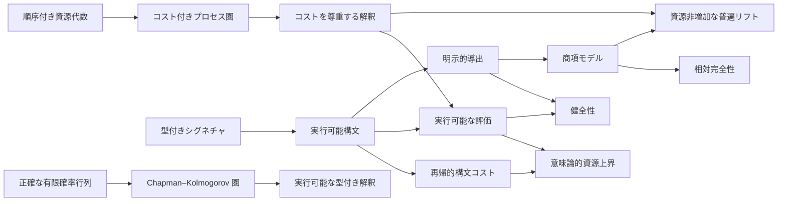

# Ript

**資源添字付きプロセス理論のための、Lean 4 カーネル検証済み基盤。**

[English](../README.md) · [简体中文](README.zh-CN.md) ·
[日本語](README.ja.md) · [Esperanto](README.eo.md)

[](https://github.com/miuchan/ript/actions/workflows/ci.yml)


Ript は **Resource-Indexed Information Process Theory（資源添字付き情報プロセス理論）**
のための、小さく厳密な核を形式化します。型付きプロセス、合成可能な資源上界、実行可能な
解釈、明示的な等式導出、そして標準項モデルによる相対完全性がその中心です。

本プロジェクトは各層を厳密な順序で構築します。現在は、正確で実行可能な有限確率モデルまでを
含みます。測度論的確率、意思決定理論、熱力学、量子理論、高次圏は引き続き研究課題です。
Ript は、プロセス合成や資源会計の意味を暗黙に変えることなく、将来の層を追加するための
検証済み土台を提供します。

> [!IMPORTANT]
> Ript は初期段階の研究ソフトウェアです。Stage 1 から Stage 3 は実装済みで Lean の
> カーネルにより検証されていますが、公開 API はまだ安定しておらず、現在の核を完全な
> 物理的情報理論だと主張するものではありません。

## 目次

- [Ript が必要な理由](#ript-が必要な理由)
- [形式化された核](#形式化された核)
- [証明済みの内容](#証明済みの内容)
- [現在の範囲と研究状況](#現在の範囲と研究状況)
- [アーキテクチャ](#アーキテクチャ)
- [信頼モデル](#信頼モデル)
- [クイックスタート](#クイックスタート)
- [実行可能な例](#実行可能な例)
- [Lean 依存パッケージとして使う](#lean-依存パッケージとして使う)
- [リポジトリ案内](#リポジトリ案内)
- [品質ゲート](#品質ゲート)
- [設計原則](#設計原則)
- [ロードマップ](#ロードマップ)
- [コントリビューション](#コントリビューション)
- [よくある質問](#よくある質問)
- [バージョン引用ライセンス](#バージョン引用ライセンス)

## Ript が必要な理由

多くのプロセス理論は、**どのプロセスを合成できるか**を記述します。資源を考慮する理論は
さらに、**合成にどれだけのコストがかかるか**を記述し、両者の整合性を保たなければなりません。

- 恒等プロセスは無償であるべきです。
- 直列合成と並列合成には、合成可能な資源上界が必要です。
- 構文レベルの見積もりは、あらゆる解釈における意味論的コストを健全に上から抑えるべきです。
- プロセスを書き換える方程式は、意味とコストの両方を保存すべきです。
- 実行可能モデルは、商型の証明機構を取り込まずに利用できるべきです。
- 完全性の主張は、どのモデルに対して相対的に成立するかを明示すべきです。

Ript はこれらの要件を Lean のインターフェースとしてまとめ、中心的な関係を一度だけ証明します。
下流モデルは、対象・原始プロセス・解釈・コスト則を与えることで、一般的な健全性定理と
資源定理を再利用できます。

**Ript** は **Resource-Indexed Information Process Theory** の略です。「添字付き」は
文字どおりの意味であり、式と射は型付けされた入出力インターフェースを持ち、予算は明示的な
順序付き加法資源代数の中に置かれます。

## 形式化された核

### 1. 順序付き加法資源

資源値は、加法と両立する順序を備えた加法可換モノイドに属します。具体的モデルが必要とする
までは、束、減法、スカラー作用、quantale といった強い構造を要求しません。

資源型 `R` 上でコストを持つ圏 `C` の基本則は次のとおりです。

```math
\operatorname{cost}(\mathrm{id}_X)=0,
\qquad
\operatorname{cost}(f \mathbin{\gg} g)
\leq \operatorname{cost}(f)+\operatorname{cost}(g).
```

オプションのモノイダル能力は、さらに次を加えます。

```math
\operatorname{cost}(f \otimes g)
\leq \operatorname{cost}(f)+\operatorname{cost}(g).
```

別のオプション能力により、結合子・単位子・対称ブレイディングをコスト 0 の構造的配線変更と
して宣言できます。

### 2. 型付きで実行可能な構文

直列言語は、原始生成子、恒等式、直列合成からなります。型の添字により、インターフェースが
一致しない合成は表現できません。モノイダル言語は独立に保たれ、テンソル、結合子、単位子、
それらの逆、および対称ブレイディングを追加します。

どちらの言語にも構造再帰で計算される `syntaxCost` があります。たとえば、

```math
\operatorname{syntaxCost}(f \mathbin{\gg} g)
=\operatorname{syntaxCost}(f)+\operatorname{syntaxCost}(g).
```

構文をあらかじめ商にしないことで、構築・評価・検査・有限例を直接実行できます。

### 3. コストを尊重する解釈

解釈は、対象記号を意味論的対象へ、生成子を意味論的射へ写します。同時に、各生成子が宣言
された予算を守る証明も保持します。評価は通常の構造再帰です。

中心的な資源定理は次です。

```math
\operatorname{cost}(\operatorname{eval}(e))
\leq \operatorname{syntaxCost}(e).
```

したがって `syntaxCost e ≤ r` を証明すると、`eval e` が予算 `r` の範囲内にあるという
検証済みの意味論的命題が得られます。

### 4. 明示的導出、健全性、相対完全性

Ript は式を定義上の等しさだけで同一視しません。圏の法則から生成される明示的な導出体系を
定義し、モノイダル層では対称モノイダル整合性の法則も加えます。

- **健全性（soundness）：**すべての形式導出は、互換なすべての解釈で等しい射へ評価されます。
- **相対完全性（relative completeness）：**標準項モデルの解釈における等しさから形式的導出
  可能性が従います。
- **自由モデルにおける予算完全性：**項モデルでの評価コストは、再帰的に計算した構文コストと
  正確に一致します。
- **厳密な自由普遍性：**すべての適法な解釈は、項モデルから強対称モノイダルかつ資源非増加な
  関手を誘導します。生成子上で一致する厳密な拡張の中で、その作用は一意です。

「相対」という語は重要です。この完全性定理は標準商項モデルにおける等しさについて述べる
もので、考え得るすべての意味論的宇宙について無条件に主張するものではありません。

### 5. 正確な有限確率チャネル

有限確率モデルは、チャネルを正規化された行列 `X → Y → ℚ≥0` として表します。恒等射は
Dirac 行列、合成は Chapman–Kolmogorov の有限和、テンソルは積分布です。対象は計算可能な
列挙と決定可能等式を明示的に保持するため、チャネル、Dirac 埋め込み、コピー、破棄、評価は
非計算的な選択を使わず実行できます。

決定論的有限関数は忠実な Dirac 関手として埋め込まれ、合成とテンソルを保存します。対角写像に
よるコピーと唯一の単位値への破棄も明示的に実装され、すべての有限確率チャネルが破棄を保存する
因果律 `f ≫ discard = discard` を満たします。

## 証明済みの内容

次の主要結果は現在すべてコンパイルされます。日本語の説明は非形式的な要約であり、Lean の
宣言そのものが正式な仕様です。

| Lean 宣言 | 検証済みの結果 |
| --- | --- |
| `Ript.Resource.budgeted_id` | すべての恒等射は予算 0 で利用できます。 |
| `Ript.Resource.budgeted_comp` | 直列合成では予算が加算されます。 |
| `Ript.Semantics.eval_cost_le` | 意味論的評価のコストは構文コスト以下です。 |
| `Ript.Semantics.budget_sound` | 構文予算の証明から意味論的予算の証明が得られます。 |
| `Ript.Semantics.soundness` | すべての解釈が直列導出を尊重します。 |
| `Ript.Semantics.complete_via_term_model` | 項モデルでの等しさから直列導出可能性が従います。 |
| `Ript.Semantics.budget_complete_in_free_model` | 直列項モデルのコストは構文コストに一致します。 |
| `Ript.Resource.budgeted_tensor` | テンソル合成では予算が加算されます。 |
| `Ript.Semantics.monoidalEval_cost_le` | モノイダル評価のコストはモノイダル構文コスト以下です。 |
| `Ript.Semantics.monoidal_soundness` | 対称モノイダル導出は意味論的に健全です。 |
| `Ript.Semantics.monoidal_complete_via_term_model` | モノイダル項モデルでの等しさから導出可能性が従います。 |
| `Ript.Semantics.monoidal_budget_complete_in_free_model` | モノイダル項モデルのコストは構文コストに一致します。 |
| `Ript.Semantics.Free.lift_on_generator` | 普遍リフトは生成子上で与えられた解釈と一致します。 |
| `Ript.Semantics.Free.lift_preserves_cost` | 普遍リフトはプロセスのコストを増加させません。 |
| `Ript.Semantics.Free.lift_unique` | 構造を厳密に保存するすべての拡張は普遍リフトと同じ作用を持ちます。 |
| `Ript.Models.FiniteStochastic.FinStoch.id_apply` | 確率的恒等射は点ごとの Dirac 行列です。 |
| `Ript.Models.FiniteStochastic.FinStoch.comp_apply` | 合成は Chapman–Kolmogorov の有限和です。 |
| `Ript.Models.FiniteStochastic.FinStoch.tensor_apply` | テンソルチャネルは成分確率の積です。 |
| `Ript.Models.FiniteStochastic.FinStoch.dirac_comp` | Dirac 埋め込みは決定論的関数合成を保存します。 |
| `Ript.Models.FiniteStochastic.FinStoch.dirac_faithful` | Dirac 埋め込みは有限関数に対して忠実です。 |
| `Ript.Models.FiniteStochastic.FinStoch.comp_discard` | すべての有限確率チャネルは破棄を保存します。 |

[BLUEPRINT.md](../BLUEPRINT.md) には、各定理の前提・計算可能性・ソースファイル・カーネル
仮定が記録されています。[AXIOMS.md](../AXIOMS.md) は機械的に照合される仮定一覧です。

## 現在の範囲と研究状況

「PROVED」は、実装と指定された定理の要件が、固定された Lean カーネルに受理されたことを
意味します。対応する科学的解釈が実験的に検証されたことや、完成した物理理論として出版
されたことを意味しません。

| Stage | 範囲 | 状態 |
| --- | --- | --- |
| 0 | 再現可能なプロジェクト、文書、CI、監査基準 | **PROVED** |
| 1 | 直列資源プロセスの核 | **PROVED** |
| 2 | テンソル、対称性、並列資源、厳密な自由普遍リフト | **PROVED** |
| 3 | 実行可能な有限確率モデル | **PROVED** |
| 4 | 有限分布の Kleisli 表現 | **OPEN RESEARCH** |
| 5–11 | 追加の意味論モデルと高次層 | **OPEN RESEARCH** |

実装済みのモデル能力は意図的に限定されています。

| モデル | 直列 | テンソル | 計算可能性 | 備考 |
| --- | --- | --- | --- | --- |
| コスト 0 の `FintypeCat` | 可 | 不可 | 実行可能 | 決定論的有限関数 |
| `FiniteFunction.Metered` | 可 | 不可 | 実行可能 | 関数が自然数コストを明示的に保持 |
| 直列項モデル | 可 | 不可 | 証明層 | 明示的圏導出による商 |
| 対称モノイダル項モデル | 可 | 可 | 証明層 | 明示的モノイダル導出による商 |
| 正確な有限確率チャネル | 可 | 可 | 実行可能 | 正規化された `ℚ≥0` 行列、Dirac、コピー、破棄 |

有限確率モデルにはコピー、破棄、因果性が実装されています。一般の凸構造、測度論的確率、
熱的構造、量子チャネル、ユニバレント構造、高次圏構造は**未実装**です。正式な能力表は
[MODEL_MATRIX.md](../MODEL_MATRIX.md)、形式的に追跡する未解決命題は
[CONJECTURES.md](../CONJECTURES.md) を参照してください。現在、登録された予想はありません。

## アーキテクチャ

Ript は、実行可能データと商に基づく証明意味論を明確に分離します。



| 層 | 主なモジュール | 責務 |
| --- | --- | --- |
| 資源インターフェース | `Ript.Resource.*` | 順序付き予算、予算付き射、予算の弱化 |
| プロセス能力 | `Ript.Core.*` | 直列・テンソル・構造コスト則 |
| 実行可能構文 | `Ript.Syntax.*` | 型付き式、再帰的コスト、導出 |
| 意味論 | `Ript.Semantics.*` | 解釈、評価、健全性、完全性 |
| 具体モデル | `Ript.Models.*` | 有限関数、明示的計量関数、正確な有限確率チャネル |
| 実行可能例 | `Ript.Examples.*` | 計算結果と予算検査 |
| 監査面 | `Ript.Audit.*` | 宣言 lint とカーネル仮定の報告 |

直列の核は単独で利用できます。対称モノイダル層は別のインターフェースとして拡張され、すべての
直列定義にテンソル仮定を後付けしません。

## 信頼モデル

Ript は、証明への信頼を暗黙の慣習ではなく検査可能な対象として扱います。

- すべてのライブラリ定理は Lean のカーネルで検証されます。
- 品質ゲートは `sorry`、`admit`、`sorryAx`、独自の `axiom`/`constant`、unsafe 宣言、
  `Lean.trustCompiler` を拒否します。
- すべての実装モジュールが `autoImplicit false` を設定します。
- コンパイル警告はすべてエラーとして扱われます。
- 一括 `Mathlib` ではなく、必要な Mathlib モジュールだけをインポートします。
- 主要定理の仮定は、文書化された許可リストと機械的に照合されます。
- 未証明の研究上の主張は `CONJECTURES.md` に置き、完成済み定理として名前空間に入れません。

Stage 1 と Stage 2 の主要定理の監査では、必要な箇所に Lean 標準の `propext` と
`Quot.sound` のみが現れます。有限確率定理の証明では、Mathlib の一般的な `Fintype` と有限和の
証明基盤を通して `Classical.choice` も報告されます。これは実行時データの生成には使われません。
確率対象は列挙と決定可能等式を明示的に保持し、定義に `noncomputable` や `classical` はなく、CI は
正確な `ℚ≥0` の計算を実行します。`AXIOMS.md` は各定理の実際の監査出力を完全一致で固定します。

定理ごとの正確な出力は、次で確認できます。

```bash
lake env lean Ript/Audit/AxiomChecks.lean
```

## クイックスタート

### 必要なもの

- Git
- Lean ツールチェーン管理ツール [`elan`](https://github.com/leanprover/elan)
- Lean 4 を実行できる Linux、macOS、または Windows 環境

リポジトリは Lean と Mathlib の両方を固定しています。`elan` は `lean-toolchain` を読み、必要に
応じて Lean `v4.33.0` を自動的にインストールします。

### クローンとビルド

```bash
git clone https://github.com/miuchan/ript.git
cd ript

# 推奨：対応する Mathlib のプリコンパイル済みキャッシュを取得します。
lake exe cache get

# すべての警告をエラーとして、ライブラリ全体をコンパイルします。
lake build
```

Lake を初めて実行したときは、固定されたツールチェーンとパッケージ依存をダウンロードする場合が
あります。以後のビルドではローカルの `.lake` キャッシュを再利用します。

### すべての品質ゲートを実行

```bash
./scripts/quality-gate.sh
```

成功時の最終行は次です。

```text
All Ript quality gates passed.
```

## 実行可能な例

`Ript/Examples/BitProcesses.lean` は、Boolean 否定をコスト `1` の原始生成子とする 1 ビットの
シグネチャを定義します。否定を 2 回続けた式を作り、コスト 0 の有限関数モデルと、明示的な
計量モデルの両方で解釈します。

中心となる式は次です。

```lean
def notNot : Expr signature .bit .bit :=
  .comp (.gen .not) (.gen .not)
```

Lean は構文コストと意味論的コストの両方を計算して証明します。

```lean
example : notNot.syntaxCost = 2 := by decide

example :
    processCost (R := Nat) (eval meteredInterpretation notNot) = 2 := by
  decide
```

検証済みの例を直接実行します。

```bash
lake env lean Ript/Examples/BitProcesses.lean
```

この例の 3 つの実行可能な検査は次を出力します。

```text
true
true
true
```

CI はこの出力を完全一致で比較するため、意図しない実行動作の変更は品質ゲートを失敗させます。

`Ript/Examples/StochasticBits.lean` は、公平なコイン、ノイズ付き否定、テンソル積、コピー、一般の
型付き評価を、正確な有限確率チャネルで実行します。追加の 5 つの検査はすべて `true` を出力し、
たとえば公平なビット対の確率が正確に `1/4` であることを確認します。

## Lean 依存パッケージとして使う

Ript はルートモジュール `Ript` を公開します。プレリリース期間中は、変化するブランチではなく、
既知のコミットを固定してください。

```lean
require ript from git
  "https://github.com/miuchan/ript.git" @ "<full-commit-sha>"
```

公開面全体、または必要な狭いモジュールだけをインポートできます。

```lean
import Ript
-- または、依存境界を小さくする場合：
import Ript.Semantics.Eval
```

現在の Lake パッケージバージョンは `0.1.0` ですが、安定 API やタグ付きリリースはまだ保証
されません。再現可能な下流開発では完全なコミット SHA を固定してください。

## リポジトリ案内

| パス | 目的 |
| --- | --- |
| [`Ript/Core/`](../Ript/Core/) | 抽象的なプロセスコスト能力 |
| [`Ript/Resource/`](../Ript/Resource/) | 資源代数と検証済み予算 |
| [`Ript/Syntax/`](../Ript/Syntax/) | 直列言語と対称モノイダル言語 |
| [`Ript/Semantics/`](../Ript/Semantics/) | 評価、健全性、項モデル、完全性 |
| [`Ript/Models/`](../Ript/Models/) | 有限決定論モデルと正確な有限確率チャネル |
| [`Ript/Examples/`](../Ript/Examples/) | 実行可能な例 |
| [`Ript/Audit/`](../Ript/Audit/) | Lint と仮定監査の入口 |
| [BLUEPRINT.md](../BLUEPRINT.md) | 依存グラフ、Stage、定理記録、設計判断 |
| [AXIOMS.md](../AXIOMS.md) | 現在のカーネル仮定一覧 |
| [MODEL_MATRIX.md](../MODEL_MATRIX.md) | 実装済み・計画中のモデル能力 |
| [CONJECTURES.md](../CONJECTURES.md) | 未解決研究命題の正式な記録 |
| [CONTRIBUTING.md](../CONTRIBUTING.md) | 必須の開発・証明ポリシー |

## 品質ゲート

ローカル開発と GitHub Actions は、同じプロジェクト所有の検査を実行します。

| ゲート | コマンド | 防止する問題 |
| --- | --- | --- |
| ソース衛生 | `scripts/check-source-quality.sh` | 穴埋め証明、独自公理、unsafe 宣言、暗黙識別子、一括インポート、行末空白 |
| ルート網羅性 | `lake exe mk_all --check` | ルートライブラリのビルドから Lean ファイルが漏れること |
| カーネルビルド | `lake build` | 型エラーとすべての Lean 警告 |
| 宣言 lint | `lake env lean Ript/Audit/Lint.lean` | Mathlib の宣言 linter の回帰 |
| 実行契約 | `scripts/check-examples.sh` | 有限例の期待結果の変更 |
| 仮定許可リスト | `scripts/check-axioms.sh` | 主要定理に新規または未記録の依存が入ること |

`main` ブランチは、管理者を含めて `Lean quality gate` という安定した GitHub チェックを必須と
します。必須チェックは最新の `main` に追随する必要があり、force-push とブランチ削除は無効です。

## 設計原則

1. **監査可能な最小の核から始める。** 実際の意味論モデルが必要とするまで代数構造を増やしません。
2. **型の合わないプロセスを表現不能にする。** 対象の添字が式の型に入出力を直接符号化します。
3. **資源則を合成可能に保つ。** 恒等、直列、テンソル、構造的配線変更を個別に再利用できます。
4. **実行可能構文と証明用の商を分離する。** 完全性の商モデルを理由に計算コードを非計算的にしません。
5. **完全性の範囲を明記する。** すべての完全性主張が標準モデルと証明境界を指定します。
6. **仮定をバージョン付き API として扱う。** 新しい公理は後日の注釈ではなく即時のゲート失敗です。
7. **実装と構想を区別する。** 有限確率モデルと、一般確率・熱・量子・高次の未解決層を明確に分けます。

## ロードマップ

ロードマップは証明義務を基準に進みます。コンパイル済み定義、主要証明、必要に応じた実行可能な
証拠、更新済みの仮定監査が揃って初めて Stage が進みます。

### 完了した基盤

- [x] 順序付き加法資源インターフェース
- [x] 劣加法的な直列プロセスコストと検証済み予算
- [x] 型付き直列構文と実行可能な評価
- [x] 明示的な圏の法則の導出
- [x] 直列健全性と項モデル相対完全性
- [x] 並列コスト能力と加法的テンソル予算
- [x] 型付き対称モノイダル構文と構造的配線変更
- [x] モノイダル健全性と項モデル相対完全性
- [x] コスト 0 および明示的計量付きの有限決定論例
- [x] 正確で実行可能な有限確率チャネル、Dirac 埋め込み、テンソル、コピー、破棄
- [x] 再現可能な CI、宣言 lint、仮定許可リスト

### 未解決の研究トラック

- [ ] 有限分布の Kleisli 表現と比較定理
- [ ] 有限確率モデル以外への、意味論的に正当化されたコピー・破棄能力の拡張
- [ ] 凸構造と因果構造
- [ ] 熱力学的・資源理論的モデル
- [ ] 量子チャネルモデル
- [ ] 厳密に分離されたユニバレント層または高次圏層

チェックボックスは特定のリリース順を約束しません。追加は既存の直列境界を維持するか、意図的な
破壊的変更を明記する必要があります。

## コントリビューション

プロジェクトの明示的な信頼境界と適用範囲を守るコントリビューションを歓迎します。

1. 最新の `main` からブランチを作成します。
2. 最小で一貫した変更を行います。
3. 証明、適切な実行証拠、文書を同時に追加します。
4. `./scripts/quality-gate.sh` を実行します。
5. Pull Request を開き、`Lean quality gate` の成功を待ちます。

新しい意味論層を提案する前に、必要な代数的能力、少なくとも 1 つの具体モデル、計算可能性の境界、
その抽象化を正当化する主要定理を説明してください。強制ポリシーは
[CONTRIBUTING.md](../CONTRIBUTING.md) にあります。

再現可能なバグ、証明の欠落、文書の問題、範囲を限定した設計提案には
[GitHub Issues](https://github.com/miuchan/ript/issues) を使用してください。公開 Issue に認証情報、
秘密、悪用手順を含めないでください。本プロジェクトには、まだ非公開のセキュリティ報告経路が
定められていません。

## よくある質問

### Ript は情報・物理・計算の完全な理論ですか？

いいえ。型付きプロセスと加法的資源上界のための形式的な合成可能な核です。広い科学的な層は
意図的に未実装です。

### コストは常に正確ですか？

いいえ。一般的なコスト則は劣加法的なので、構文コストは健全な上界です。標準の直列項モデルと
モノイダル項モデルでは、コストが構文コストと正確に一致することを証明しています。

### 確率や量子チャネルはすでにサポートされていますか？

正確な有限確率チャネルはサポートされています。確率は `ℚ≥0` で表され、有限和として実行されます。
有限分布の Kleisli 表現、測度論的確率、熱モデル、量子チャネルはロードマップ項目です。

### モノイダル層があればコピーや破棄も可能ですか？

一般には、いいえ。テンソルと対称性だけから対角射や終対象への射は得られません。有限確率モデルは
コピーと破棄を固有の法則を持つ具体的な操作として明示的に実装しています。

### なぜ直列構文を独立に保つのですか？

最小の有用な理論を単独で実行可能にし、すべての利用者にモノイダル仮定を課さないためです。
モノイダル構文は明確な境界を持つ拡張です。

### 構文が実行可能なのに、なぜ商項モデルを使うのですか？

実行可能構文は構築と評価に適し、商は形式導出を法とした等しさを表現します。隔離された項モデルは、
実行コードを汚染せずに相対完全性に必要な正確な証明対象を与えます。

### `main` に直接依存できますか？

技術的には可能ですが、再現可能な開発には推奨しません。安定 API リリースはまだないため、完全な
コミット SHA を固定してください。

## バージョン、引用、ライセンス

### バージョン

Lake パッケージは現在 `0.1.0` を宣言しています。タグ付きリリースと明示的な安定性方針ができる
までは、パッケージ版が変わらなくても破壊的変更があり得ます。

### 引用

Ript にはまだアーカイブ論文や DOI がありません。研究成果で利用する場合は、リポジトリ URL と
実際に使った完全なコミット SHA を併記し、再現性資料にそのコミットを保存してください。著者情報と
出版情報が確定してから正式な引用ファイルを追加します。

### ライセンス

本リポジトリには、まだオープンソースライセンスが選択されていません。ソースが公開されていること
だけでは、複製・再配布・派生物作成の許可は与えられません。ライセンスファイルが追加されるまでは
通常の著作権制限が適用されます。下流利用者が未付与の権利を推測しないよう、ここで明記しています。

## 謝辞

Ript は [Lean 4](https://lean-lang.org/) と
[Mathlib](https://github.com/leanprover-community/mathlib4) を用いて構築されています。圏論、代数、
ツール、証明工学に関する両コミュニティの成果が、このプロジェクトを可能にしています。
