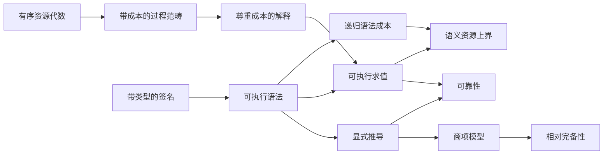

# Ript

**面向资源索引过程理论、由 Lean 4 内核检验的形式化基础。**

[English](../README.md) · [简体中文](README.zh-CN.md) ·
[日本語](README.ja.md) · [Esperanto](README.eo.md)

[](https://github.com/miuchan/ript/actions/workflows/ci.yml)


Ript 形式化了 **Resource-Indexed Information Process Theory（资源索引信息过程理论）**
的一组小而严谨的核心结构：带类型的过程、可组合的资源上界、可执行的解释、显式的等式
推导，以及通过规范项模型建立的相对完备性。

本项目刻意从概率、因果、热力学、量子理论和高阶范畴之下的基础层开始。它们目前是研究
方向，而不是已经具备的能力。Ript 当前提供的是一块经过检验的地基，使未来可以在不暗中
改变过程复合或资源核算含义的前提下逐层扩展。

> [!IMPORTANT]
> Ript 是早期研究软件。Stage 1 和 Stage 2 已实现并通过 Lean 内核检验；公共 API 尚未
> 稳定，当前核心也不宣称已经构成完整的物理信息理论。

## 目录

- [为什么需要 Ript？](#为什么需要-ript)
- [形式化核心](#形式化核心)
- [已经证明的结果](#已经证明的结果)
- [当前范围与研究状态](#当前范围与研究状态)
- [架构](#架构)
- [信任模型](#信任模型)
- [快速开始](#快速开始)
- [一个可执行的完整示例](#一个可执行的完整示例)
- [将 Ript 作为 Lean 依赖](#将-ript-作为-lean-依赖)
- [仓库导览](#仓库导览)
- [代码质量门禁](#代码质量门禁)
- [设计原则](#设计原则)
- [路线图](#路线图)
- [参与贡献](#参与贡献)
- [常见问题](#常见问题)
- [版本、引用与许可证](#版本引用与许可证)

## 为什么需要 Ript？

很多过程理论只描述**哪些过程能够复合**。资源敏感的理论还必须描述**复合需要多少成本**，
并保证这两套叙述彼此一致：

- 恒等过程应当免费；
- 串行与并行复合应具有可组合的资源上界；
- 语法层的成本估计应可靠地约束每一种解释下的语义成本；
- 用于改写过程的等式必须同时保持语义和成本；
- 可执行模型不应为了使用完备性证明而被迫依赖商类型机制；
- 每一项完备性结论都应明确它相对于哪个模型成立。

Ript 把这些义务编码为 Lean 接口，并一次性证明它们之间的核心关系。下游模型只需提供
对象、原始过程、解释以及成本律，通用的可靠性定理和资源定理即可复用。

名称 **Ript** 是 **Resource-Indexed Information Process Theory** 的缩写。“索引”并非
修辞：表达式和态射都携带有类型的输入输出接口，而预算存在于显式的有序加法资源代数中。

## 形式化核心

### 1. 有序加法资源

资源值处于一个带序的加法交换幺半群中，并要求加法与序相容。Ript 刻意不预设格、减法、
标量作用或 Quantale；只有真实语义模型需要时，才应引入更强结构。

对于资源类型 `R` 上带成本的范畴 `C`，基本定律是：

```math
\operatorname{cost}(\mathrm{id}_X)=0,
\qquad
\operatorname{cost}(f \mathbin{\gg} g)
\leq \operatorname{cost}(f)+\operatorname{cost}(g).
```

可选的幺半群能力进一步加入：

```math
\operatorname{cost}(f \otimes g)
\leq \operatorname{cost}(f)+\operatorname{cost}(g),
```

另一个可选能力则声明结合子、幺元子与对称编织都是零成本的结构性重新布线。

### 2. 带类型、可执行的语法

串行语言包含原始生成元、恒等过程和串行复合。它的类型索引使接口不匹配的复合无法表示。
幺半群语言保持独立，并加入张量、结合子、幺元子、它们的逆以及对称编织。

两种语言都有按结构递归计算的 `syntaxCost`。例如：

```math
\operatorname{syntaxCost}(f \mathbin{\gg} g)
=\operatorname{syntaxCost}(f)+\operatorname{syntaxCost}(g).
```

语法不会预先取商，因此构造、求值、检查和有限示例都可以直接执行。

### 3. 尊重成本的解释

解释把对象符号映射到语义对象，把生成元映射到语义态射，同时携带每个生成元遵守声明
预算的证明。求值只是普通的结构递归。

核心资源定理是：

```math
\operatorname{cost}(\operatorname{eval}(e))
\leq \operatorname{syntaxCost}(e).
```

因此，只要证明 `syntaxCost e ≤ r`，就能得到经过检验的语义结论：`eval e` 位于预算 `r`
之内。

### 4. 显式推导、可靠性与相对完备性

Ript 不通过定义相等直接识别表达式。它定义了一个由范畴律生成的显式推导系统；在幺半群
层，还加入对称幺半群相干律。

- **可靠性（soundness）：**每个形式推导在每个兼容解释下都求值为相等态射。
- **相对完备性（relative completeness）：**规范项模型解释中的相等蕴含形式可推导性。
- **自由模型中的预算完备性：**项模型求值的成本恰好等于递归计算的语法成本。

“相对”二字非常重要：完备性定理针对规范商项模型中的相等，而不是对所有可能语义宇宙
作不加限定的宣称。

## 已经证明的结果

下列旗舰结果当前均可编译。表中的中文是非形式化摘要，Lean 声明本身才是权威定义。

| Lean 声明 | 已检验的结论 |
| --- | --- |
| `Ript.Resource.budgeted_id` | 每个恒等态射都可在零预算下使用。 |
| `Ript.Resource.budgeted_comp` | 串行复合时预算相加。 |
| `Ript.Semantics.eval_cost_le` | 语义求值成本不超过语法成本。 |
| `Ript.Semantics.budget_sound` | 语法预算证明可转化为语义预算证明。 |
| `Ript.Semantics.soundness` | 每个解释都尊重串行推导。 |
| `Ript.Semantics.complete_via_term_model` | 项模型中的相等蕴含串行可推导性。 |
| `Ript.Semantics.budget_complete_in_free_model` | 串行项模型成本等于语法成本。 |
| `Ript.Resource.budgeted_tensor` | 张量复合时预算相加。 |
| `Ript.Semantics.monoidalEval_cost_le` | 幺半群求值成本不超过幺半群语法成本。 |
| `Ript.Semantics.monoidal_soundness` | 对称幺半群推导在语义上可靠。 |
| `Ript.Semantics.monoidal_complete_via_term_model` | 幺半群项模型中的相等蕴含可推导性。 |
| `Ript.Semantics.monoidal_budget_complete_in_free_model` | 幺半群项模型成本等于语法成本。 |

[BLUEPRINT.md](../BLUEPRINT.md) 记录了每个定理的前置条件、可计算性、源文件和内核假设；
[AXIOMS.md](../AXIOMS.md) 则保存机器生成并核对过的假设清单。

## 当前范围与研究状态

“PROVED”表示实现和指定的定理义务已经被固定版本的 Lean 内核接受。它不表示相应的科学
解释已经通过实验验证，也不表示完整的物理理论已经发表。

| 阶段 | 范围 | 状态 |
| --- | --- | --- |
| 0 | 可复现工程、文档、CI 与审计基线 | **PROVED** |
| 1 | 串行资源过程核心 | **PROVED** |
| 2 | 张量、对称性、结构重布线与并行资源 | **PROVED** |
| 3 | 可执行的有限随机模型 | **OPEN RESEARCH** |
| 4 | 有限分布的 Kleisli 表示 | **OPEN RESEARCH** |
| 5–11 | 后续语义模型与高阶层 | **OPEN RESEARCH** |

已经实现的模型能力刻意保持狭窄：

| 模型 | 串行 | 张量 | 可计算性 | 说明 |
| --- | --- | --- | --- | --- |
| 零成本 `FintypeCat` | 是 | 否 | 可执行 | 确定性有限函数 |
| `FiniteFunction.Metered` | 是 | 否 | 可执行 | 函数携带显式自然数成本 |
| 串行项模型 | 是 | 否 | 证明层 | 按显式范畴推导取商 |
| 对称幺半群项模型 | 是 | 是 | 证明层 | 按显式幺半群推导取商 |

复制、丢弃、凸结构、因果性、热结构、随机语义、量子信道，以及单价或高阶范畴结构都
**尚未实现**。权威能力矩阵见 [MODEL_MATRIX.md](../MODEL_MATRIX.md)，经过形式化登记的开放
命题见 [CONJECTURES.md](../CONJECTURES.md)。目前没有已登记的猜想。

## 架构

Ript 明确分离可执行数据与基于商类型的证明语义。



| 层 | 主要模块 | 职责 |
| --- | --- | --- |
| 资源接口 | `Ript.Resource.*` | 有序预算、预算态射与预算放宽 |
| 过程能力 | `Ript.Core.*` | 串行、张量和结构成本律 |
| 可执行语法 | `Ript.Syntax.*` | 带类型表达式、递归成本与推导 |
| 语义 | `Ript.Semantics.*` | 解释、求值、可靠性与完备性 |
| 具体模型 | `Ript.Models.*` | 有限零成本函数与显式计量函数 |
| 可执行示例 | `Ript.Examples.*` | 计算行为和预算检查 |
| 审计界面 | `Ript.Audit.*` | 声明 lint 与内核假设报告 |

串行核心可以独立使用。对称幺半群层通过独立接口扩展它，而不会把张量假设强行塞入每个
串行定义。

## 信任模型

Ript 的目标是让证明信任可以检查，而不是隐含在工程习惯里。

- 所有库定理都由 Lean 内核检验。
- 质量门禁拒绝 `sorry`、`admit`、`sorryAx`、自定义 `axiom`/`constant`、不安全声明和
  `Lean.trustCompiler`。
- 每个实现模块都设置 `autoImplicit false`。
- 所有编译警告均被提升为错误。
- 工程导入具体的 Mathlib 模块，而不是宽泛的 `Mathlib` 总入口。
- 旗舰定理的假设会由机器与文档化白名单逐项比较。
- 未证明的研究主张只能进入 `CONJECTURES.md`，不能伪装成已完成定理进入命名空间。

当前旗舰审计只在必要处报告 Lean 的标准原则 `propext` 与 `Quot.sound`；没有
`Classical.choice`、编译器信任逃逸或占位证明公理。商类型依赖被限制在证明语义的项模型
中；可执行语法与有限求值不依赖它们。

查看逐定理输出：

```bash
lake env lean Ript/Audit/AxiomChecks.lean
```

## 快速开始

### 前置条件

- Git；
- Lean 工具链管理器 [`elan`](https://github.com/leanprover/elan)；
- Lean 4 支持的 Linux、macOS 或 Windows 环境。

仓库同时固定 Lean 和 Mathlib 版本。`elan` 会读取 `lean-toolchain`，并在需要时自动安装
Lean `v4.33.0`。

### 克隆与构建

```bash
git clone https://github.com/miuchan/ript.git
cd ript

# 推荐：下载匹配版本的 Mathlib 预编译缓存。
lake exe cache get

# 编译完整库；任何 Lean 警告都会导致失败。
lake build
```

第一次执行 Lake 命令时可能会下载固定的工具链和包依赖；后续构建会复用本地 `.lake`
缓存。

### 运行全部工程门禁

```bash
./scripts/quality-gate.sh
```

成功运行以此结束：

```text
All Ript quality gates passed.
```

## 一个可执行的完整示例

`Ript/Examples/BitProcesses.lean` 定义了一个单比特签名，把布尔取反作为成本为 `1` 的原始
生成元。示例连续执行两次取反，并分别把它解释到零成本有限函数模型和显式计量模型中。

核心表达式是：

```lean
def notNot : Expr signature .bit .bit :=
  .comp (.gen .not) (.gen .not)
```

Lean 同时计算并证明语法成本和语义成本：

```lean
example : notNot.syntaxCost = 2 := by decide

example :
    processCost (R := Nat) (eval meteredInterpretation notNot) = 2 := by
  decide
```

直接运行示例：

```bash
lake env lean Ript/Examples/BitProcesses.lean
```

三个可执行断言输出：

```text
true
true
true
```

CI 会精确比较这段输出，因此任何非预期的可执行行为变化都会使质量门禁失败。

## 将 Ript 作为 Lean 依赖

Ript 暴露根模块 `Ript`。在预发布阶段，请固定到一个已知提交，不要跟踪持续移动的分支：

```lean
require ript from git
  "https://github.com/miuchan/ript.git" @ "<full-commit-sha>"
```

随后可以导入全部公共界面，也可以只导入一个窄模块：

```lean
import Ript
-- 或者使用更窄的依赖边界：
import Ript.Semantics.Eval
```

Lake 包当前版本为 `0.1.0`，但尚未承诺稳定 API 或带标签版本。可复现的下游工程必须固定
完整提交 SHA。

## 仓库导览

| 路径 | 用途 |
| --- | --- |
| [`Ript/Core/`](../Ript/Core/) | 抽象过程成本能力 |
| [`Ript/Resource/`](../Ript/Resource/) | 资源代数与经过检验的预算 |
| [`Ript/Syntax/`](../Ript/Syntax/) | 串行和对称幺半群语言 |
| [`Ript/Semantics/`](../Ript/Semantics/) | 求值、可靠性、项模型与完备性 |
| [`Ript/Models/`](../Ript/Models/) | 具体的有限确定性模型 |
| [`Ript/Examples/`](../Ript/Examples/) | 可执行示例 |
| [`Ript/Audit/`](../Ript/Audit/) | Lint 与假设审计入口 |
| [BLUEPRINT.md](../BLUEPRINT.md) | 依赖图、阶段、定理记录和设计决定 |
| [AXIOMS.md](../AXIOMS.md) | 当前内核假设清单 |
| [MODEL_MATRIX.md](../MODEL_MATRIX.md) | 已实现和计划中的模型能力 |
| [CONJECTURES.md](../CONJECTURES.md) | 未解决研究命题的正式登记册 |
| [CONTRIBUTING.md](../CONTRIBUTING.md) | 强制执行的开发与证明政策 |

## 代码质量门禁

本地开发与 GitHub Actions 使用相同的项目自有检查。

| 门禁 | 命令 | 防止的问题 |
| --- | --- | --- |
| 源码卫生 | `scripts/check-source-quality.sh` | 占位证明、自定义公理、不安全声明、隐式标识符、宽泛导入和行尾空格 |
| 根模块覆盖 | `lake exe mk_all --check` | Lean 文件未被根库构建纳入 |
| 内核构建 | `lake build` | 类型错误以及所有 Lean 警告 |
| 声明 lint | `lake env lean Ript/Audit/Lint.lean` | Mathlib 声明级 lint 回归 |
| 可执行契约 | `scripts/check-examples.sh` | 有限示例的预期结果发生变化 |
| 假设白名单 | `scripts/check-axioms.sh` | 旗舰定理出现新增或未记录的依赖 |

`main` 分支强制要求稳定检查 `Lean quality gate`，管理员也不能绕过。合并前检查结果必须
基于最新 `main`；强制推送和分支删除均已禁用。

## 设计原则

1. **从最小且可审计的核心开始。**只有真实语义模型需要时才增加代数结构。
2. **让病态类型过程无法表示。**对象索引直接在表达式类型中编码过程接口。
3. **保持资源定律可组合。**恒等、串行、张量和结构重布线拥有显式且可独立复用的契约。
4. **分离可执行语法与证明商。**完备性使用商模型，不应让计算代码无端继承不可计算性。
5. **明确完备性的范围。**每项完备性结论都点名规范模型和证明边界。
6. **把假设当作有版本的 API。**定理出现新公理应立即使门禁失败，而不是事后脚注。
7. **区分实现与愿景。**随机、因果、热力学、量子和高阶层必须清楚标记为开放研究。

## 路线图

路线图以证明义务为驱动。只有具备已编译定义、旗舰证明、适当的可执行证据和更新后的
假设审计，一个阶段才算推进。

### 已完成的基础

- [x] 有序加法资源接口
- [x] 松弛串行过程成本与检验过的预算
- [x] 带类型的串行语法与可执行求值
- [x] 显式范畴律推导
- [x] 串行可靠性与项模型相对完备性
- [x] 并行成本能力与加法张量预算
- [x] 带类型的对称幺半群语法与结构重布线
- [x] 幺半群可靠性与项模型相对完备性
- [x] 零成本和显式计量的有限确定性示例
- [x] 可复现 CI、声明 lint 与公理白名单

### 开放研究方向

- [ ] 可执行有限随机语义
- [ ] 有限分布 Kleisli 表示与比较结果
- [ ] 在语义确有依据时加入显式复制/丢弃能力
- [ ] 凸结构与因果结构
- [ ] 热力学与资源理论模型
- [ ] 量子信道模型
- [ ] 严格隔离的单价或高阶范畴层

这些复选框不承诺固定的发布顺序。任何扩展都必须保持现有串行边界，或清楚记录有意的
破坏性变更。

## 参与贡献

只要遵守项目明确的信任与范围边界，我们欢迎贡献。

1. 从最新 `main` 创建分支。
2. 完成最小而完整的一组改动。
3. 同时添加证明、适当的可执行证据与文档。
4. 运行 `./scripts/quality-gate.sh`。
5. 创建 Pull Request，并等待 `Lean quality gate` 通过。

在提出新的语义层之前，请说明它需要哪些代数能力、至少一个具体模型、可计算性边界，以及
足以证明这项抽象合理的旗舰定理。强制政策见 [CONTRIBUTING.md](../CONTRIBUTING.md)。

可复现缺陷、证明缺口、文档问题和范围明确的设计提案请提交到
[GitHub Issues](https://github.com/miuchan/ript/issues)。请勿在公开 Issue 中包含凭据、秘密或
漏洞利用细节；本项目目前尚未声明私密安全报告渠道。

## 常见问题

### Ript 是完整的信息、物理或计算理论吗？

不是。它是面向带类型过程和加法资源上界的形式化可组合核心，更广泛的科学层仍未实现。

### 成本总是精确的吗？

不是。通用成本律是次可加的，因此语法成本通常是可靠上界。规范串行和幺半群项模型中的
成本已被证明与语法成本精确相等。

### Ript 已经支持概率或量子信道了吗？

没有。有限随机、Kleisli、热力学、因果和量子模型都属于路线图。当前可执行模型只有确定性
有限函数。

### 幺半群层是否自动带来复制或丢弃？

不会。仅有张量和对称性并不会产生对角态射或终对象态射。复制和丢弃必须作为显式能力
引入，并拥有各自的定律。

### 为什么保留独立的串行语法？

这样可以让最小可用理论保持独立、可执行，并避免所有使用者都被迫接受幺半群假设。幺半群
语法是边界清晰的扩展。

### 语法既然可执行，为什么还要使用商项模型？

可执行语法适合构造和求值；商类型则表达“模形式推导相等”。受到隔离的项模型提供相对
完备性所需的精确证明对象，而不会污染可执行代码。

### 可以直接依赖 `main` 吗？

技术上可以，但可复现工程不应这样做。项目尚无稳定 API 版本，请固定完整提交 SHA。

## 版本、引用与许可证

### 版本

Lake 包当前声明为 `0.1.0`。在带标签版本和明确稳定性政策出现之前，即使包版本未变化，
改动也可能具有破坏性。

### 引用

Ript 目前没有归档论文或 DOI。用于研究产物时，请同时引用仓库 URL 和实际使用的完整提交
SHA，并在可复现材料中归档该提交。只有作者与出版元数据确定后才应添加正式引用文件。

### 许可证

本仓库尚未选择开源许可证。源码公开可见**并不**自动授予复制、再分发或创作衍生作品的
权利。在加入许可证文件之前，适用默认版权限制。这里刻意明确说明，是为了防止下游使用者
推断出尚未授予的权利。

## 致谢

Ript 基于 [Lean 4](https://lean-lang.org/) 与
[Mathlib](https://github.com/leanprover-community/mathlib4) 构建。它们在范畴论、代数、工具和
证明工程方面的生态使本项目成为可能。
