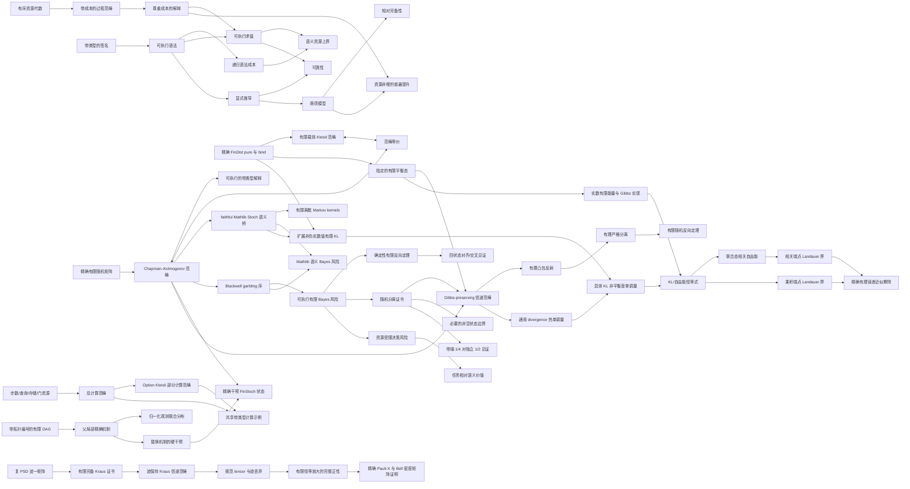

# Ript

**面向资源索引过程理论、由 Lean 4 内核检验的形式化基础。**

[English](../README.md) · [简体中文](README.zh-CN.md) ·
[日本語](README.ja.md) · [Esperanto](README.eo.md)

[](https://github.com/miuchan/ript/actions/workflows/ci.yml)


Ript 形式化了 **Resource-Indexed Information Process Theory（资源索引信息过程理论）**
的一组小而严谨的核心结构：带类型的过程、可组合的资源上界、可执行的解释、显式的等式
推导，以及通过规范项模型建立的相对完备性。

本项目严格按层推进。目前已经包含精确、可执行的有限随机模型、其有限分布 Kleisli 表示，
以及到 Mathlib 测度论范畴 `Stoch` 的 faithful 语义桥。在此基础上，Ript 还已形式化
Blackwell 比较、精确可执行的有限 Bayes 风险、资源受限决策风险与任务相对语义价值。
项目还包含带显式步数、查询、存储与门数量资源的总函数和可失败计算范畴，并已实现可执行
有限 DAG 因果模型、只读取父节点的精确机制、归一化观测联合分布、硬干预及其精确
`FinStoch` 语义。下一层还加入了带指定平衡分布的有限热系统、Gibbs-preserving 精确信道
范畴及 tensor bifunctor、自由平衡态制备，以及通用 divergence 单调性。独立的语义层现已在
此外，可执行有限闭合协议由 Gibbs-preserving 自同态的有序列表组成，逐步执行、完整轨迹、
列表串接与复合信道之间的对应都已证明。Boolean 两步翻转给出非恒定精确循环，通用定理则证明
任何此类闭合协议都不能把平衡态送到不同目标。
`ℝ≥0∞` 中定义具体有限 KL，证明零值、支撑边界与对任意有限随机信道的完整数据处理不等式，
并由此得到具体 KL 非平衡度单调性。新的实现层为非空有限系统加入实数能量与正逆温度，构造
严格正且归一化的 Gibbs 概率，并认证精确有理平衡态何时实现该分布；同时定义 Shannon 熵、
平均能量、非平衡与平衡 Helmholtz 自由能，证明 `D(p ‖ γ) = β (F(p) - F(γ))`，并推出同逆温度
Gibbs-preserving 信道下的自由能差单调性。每个满支撑精确平衡态现已在任意正逆温度下获得规范
Gibbs 实现。对另行给定的有限实能谱，精确有理 Gibbs 概率也已有充要分类：选定任一参考微观态后，
它存在当且仅当所有相对 Boltzmann 因子都是正有理数。正有理权重 `(2, 1)` 与 `(1, 2, 3)` 分别生成
可执行的 `(2/3, 1/3)` 与 `(1/6, 1/3, 1/2)`，而比值为 `sqrt 2` 的两能级谱被严格证明不可能有
精确有理 Gibbs 分布。同温独立系统的权重与概率分解、配分函数乘法性以及能量、熵和自由能可加性也已证明。
显式系统—电池层还证明 Gibbs-preserving 联合过程必须用电池自由能下降支付系统自由能上升；
电池熵不变时这成为供功界，零能 Boolean 存储器的精确擦除至少需要 `log 2 / β`。任意精确
相关端点也已覆盖：联合自由能分解为两个边缘自由能与互信息 `I / β`，而相关修正后的
Landauer 界会同时核算系统自由能和相关自由能的变化。精确有限近似擦除也已覆盖：对于
有理数 `0 ≤ ε ≤ 1/2`，可执行目标的错误质量为 `ε`，熵为 `binEntropy ε`，精确超额
自由能成本为 `(log 2 - binEntropy ε) / β`；该成本非负并随允许误差单调不增，且已进入
乘积端点与相关修正的 Landauer 供功界。确定性有限实验的 Blackwell 反向表示已经由满支撑
重构定理证明；非空隐藏状态上的一般随机反向定理也已通过 Lean 内核检验。每个精确 garbling
都有确定性后处理的有理 simplex 表示；有理凸包反射、有理严格分离完备性，以及分离子与可靠
有限决策分离证书的等价均已证明。内核检验的空状态反例说明非空假设不可省略；一般可测因果
模型仍是研究方向。
一个显式的有限热浴
辅助协议现已通过编译：三比特置换
`((系统, 热浴), 电池) -> ((电池, 热浴), 系统)` 精确擦除系统、原样返回热浴，
并以信息电池支付 `log 2 / β`。证明同时显示电池熵发生变化，因此它不是机械功循环。另一个
无需热浴的有限见证实现了机械功形式：非简并两能级电池从纯高能态放电到纯低能态，熵保持为
零，精确擦除公平比特并提供 `log 2 / β`，从而达到 Landauer 供功界等号。匹配的精确充电
信道把已擦除存储器随机化回平衡态，以释放的 `log 2 / β` 自由能
把纯低能电池充回纯高能态。擦除与充电组成可执行闭合轨迹
`公平/高能 → 已擦除/低能 → 公平/高能`，系统与电池的有符号变化都严格抵消，因此不存在净产功宣称。
Ript 现在还
拥有一个与经典随机模型分离的有限维复数量子核心：正半定、迹为一的密度矩阵；由有限完备
Kraus 族认证的操作映射；经过证明的正性与迹保持；恒等与串行复合封闭；信道范畴；以及精确的
Pauli-X 量子比特证明。现在还包括规范信道 tensor、interchange、基 bra 构造的迹/丢弃信道、
丢弃的唯一性与因果律、任意有限辅助系统上的完整正性，以及规范化 Bell 密度矩阵示例。
经典到量子的层现已实现：它以 `sqrt(P(y | x)) |y><x|` 构造 Kraus 算子，并给出到
退相干幂等子范畴的忠实测量—制备函子；恒等、复合、tensor、对角态演化与概率恢复均已证明。
高阶范畴层现已实现并通过编译：固定资源类型后，资源索引的对称幺半群过程模型、资源非增的
强编织幺半群函子和幺半群自然变换构成一个双范畴。纵向与横向复合、interchange、结合子、
左右单位子、五边形与三角 coherence 均已证明。带显式成本反射的成本精确模型等价还会保持
每个过程的成本，并传递串行与并行的核心资源界。
第一条非群胚 localization 纵切面也已编译：Ript 先按可逆幺半群 2-胞对模型态射取商，得到
模型双范畴的普通同伦 1-范畴。原始的成本反射箭头与其在可逆 2-胞下的显式饱和现已分开；一个
定理精确证明该双范畴标记等价于同伦范畴中的标记类。随后应用 Mathlib 的 Gabriel--Zisman
构造，得到真正的 `Functor.IsLocalization` 实例和函子范畴普遍性质。规范的高阶到普通桥接被
形式化为从 Mathlib `Pith`（模型双范畴的最大局部群胚部分）到局部离散 localization 的伪函子，
并证明每条饱和标记箭头都映为同构。零成本离散标记箭头在 localization 前不可逆，所以这里确实
加入了形式逆。另一个有限确定性例子给出具体的不可逆幺半群 2-胞，而且其两个端点在同伦范畴中
仍然不同；现在还证明了从完整模型双范畴到任意局部离散目标的伪函子都必须识别这两个端点的像。
Ript 同时编译了未截断研究目标的精确定义：双范畴 localization 谓词要求把标记 1-胞映为伴随
等价、让每个反转标记的伪函子本质分解，并在强变换与 modification 的局部范畴上给出等价。
现在已经显式构造出恒等预复合的伪函子伴随等价，并证明它在每个局部范畴上都是等价。因此，恒等
伪函子恰在所有标记箭头本来就是伴随等价时构成真正的 localization。具体的零成本标记嵌入并非
伴随等价，因而恒等伪函子不可能是 Ript 的成本精确 localization。第一个真正加入逆元的纵切片也已
编译：walking arrow 在局部离散源中不是等价，而 Mathlib 自由群胚加入显式逆元，证明左右逆等式、
普通 localization 普遍性质和诱导的双范畴标记反转。参数化改进进一步与“类型和函数”的单对象
双范畴取积：目标被证明不是局部离散的，映射在全部源 2-胞上忠实，Boolean discard 在 walking
坐标局部化后仍不可逆。对任意目标双范畴，每个只依赖保留坐标的伪函子现在都有通过目标的显式
分解。预复合在每个强变换与 modification 的局部范畴上现已构成等价。源 modification 分量可以跨越
自由加入的逆元提升；源强变换则确定目标对象分量和每个目标 1-态射上的规范自然性同构。mate 恒等式
处理两个生成元消去次序，结合子运输和沿因子同构的不变性进一步覆盖两种带任意保留坐标的跨端点消去。
walking 补全的 thin 性把其余所有目标复合归约到这些已证明情形。所得数据已正式组装为目标强变换，
并由可逆 modification 证明其限制恢复原始源强变换；配合已有的充满忠实性，这同时证明局部本质满射
和局部等价。walking 自由群胚本身
现在也有规范形定理：每条带符号路径都等于其端点唯一决定的
态射，因此该补全是 thin 的，并与 `Fin 2` 上的 codiscrete 群胚显式范畴等价。作为互补，对任意群胚 `G`，
每个 walking-arrow 函子 `K : Arrow ⥤ G` 都诱导一个只依赖局部化坐标的标记反转伪函子；它通过
自由群胚目标显式分解，而且其提升把形式加入的逆元映为生成箭头像的实际逆元。这两类分量现在还能组合：
任意群胚值局部化分量 `K` 与任意保留坐标伪函子 `H` 组成的可分离混合伪函子 `K × H` 都通过目标
分解；其提升正确解释形式逆元，而保留分量取恒等时仍检测不可逆 Boolean discard。现在还证明了
源伪函子的标记反转与分解都在伴随等价下保持，因此结论覆盖可分离族的整个 replete 闭包，包括
定义上不是逐分量积的实现。在该闭包之外，每个任意的反转标记源伪函子现在都确定一个已编译的
目标 `PrelaxFunctor` 作用，覆盖全部对象、1-态射和 2-胞；规范正向箭头复用源作用，真正逆向的箭头使用所选逆等价。
现已编译所有对象的恒等比较、八种端点规范形复合比较，以及覆盖每对可复合目标箭头的统一比较。该全箭头比较定义性约化到端点形式，并已证明八条分支约化等式。完整的正向—正向复合器现在还已证明对任一保留坐标变量自然，包括所有等式运输阶段。另有四条端点 hom-functor 约化定理和一个统一的端点 2-胞构造器，显式给出后续 coherence 证明所需的正向或逆向作用。剩余工作是证明伪函子 coherence，再构造源分解的伴随等价。正是这个尚缺的全局双本质分解字段，使现有桥接仍不是完整的双范畴、
Dwyer--Kan、simplicial 或 Rezk localization。Stage 11 现已加入一个刻意保持小型、无公理
的内部单值过程 universe：empty、unit、sum、tensor 与原子接口的深嵌入 code 分别携带结构
等价语法和内部恒等语法；语义商构成真正的 Mathlib 群胚；内部恒等与内部结构等价互相等价；
带等价重索引的深嵌入过程语言具有 soundness 定理。它是集合层、1-截断模型，不假设外部
univalence，也不会把任意 Lean 类型等价变成 Lean 类型相等。
Stage 12 现已完成第一步严格限界的补全：无选择的对象商精确按内部恒等是否非空来识别 code，
并给出不变量映射与内部谓词的普遍下降；另一个独立的、不可计算的 Mathlib 骨架保留全部
自同构，并与原群胚范畴等价。这些只是 0/1-截断基础，并不是对 Rezk completion 的宣称。
presheaf 路线也已有第一层经过编译的基础：Yoneda 把内部群胚 fully faithfully 嵌入类型值
presheaf；内部恒等与结构等价精确对应 representable 之间的自然变换和自然同构；其本质像
形成与源群胚等价的 `YonedaEnvelope`。它仍是普通 1-范畴 envelope，不是 Rezk completion。
限制后的 Yoneda 函子和骨架补全函子现已进一步证明为 Mathlib 意义下对所有内部恒等态射的
localization。由于源已经是群胚，这个精确普遍性质不会添加新的逆；它只是 1-范畴 localization
基例，不是仍开放的完整资源过程双范畴 localization。
内部群胚现在还拥有真正的 simplicial nerve。每个单形都能从可复合 spine 唯一重建，因此该
nerve 已证明为 strict Segal、quasicategory 和 2-coskeletal；顶点、边与复合 2-单形分别精确
恢复接口、内部恒等与 path 复合，其同伦范畴同构于源群胚。这仍只是 1-群胚的严格范畴 nerve：
现已逐维证明完整 Kan horn filling，包括基于逆元的外 horn filler；但仍没有宣称 complete
Segal、localization 或 Rezk completion。Rezk 路线的下一层基础也已经编译：真正的
classifying diagram 在外层 simplicial 方向保留可复合箭头串及其自然变换，再逐层取 nerve。
每个纵向层级都是群胚 nerve，因而是 Kan；取纵向顶点会自然恢复严格 interface nerve，纵向边
则精确对应可逆自然变换。交换两个有限索引范畴后，每条横向行都自然同构于普通范畴的 nerve，
因此每个双次数上的实际外层 spine/Segal 比较都是等价。实际 Rezk 完备性映射现已定义为外层
零退化，并证明为一个明确范畴等价的 nerve。整个外层对象还自然表示为单形映射空间；边界
matching 锥已证明为真实极限，所有 matching map 都是 fibration。Mathlib 原生 Reedy
模型结构尚不存在；项目现已用精确的 `SSet.GroupoidalCompleteSegal` 结构封装这些结果，
并进一步证明每条横向行都是 Kan，实际完备性映射带有明确的范畴等价 nerve 见证。固定版本
Mathlib 尚无 simplicial set 弱等价或完整 Quillen 模型 API，因此 Mathlib 原生的标准
complete-Segal-space 实例，以及构造满足已编译 localization 普遍性质谓词的完整资源过程
伪函子，仍然开放。

> [!IMPORTANT]
> Ript 是早期研究软件。Stage 1–12 已实现的基础层均通过 Lean 内核检验；公共 API 尚未
> 稳定，当前核心也不宣称已经构成完整的物理信息理论。

## 目录

- [为什么需要 Ript？](#为什么需要-ript)
- [形式化核心](#形式化核心)
- [已经证明的结果](#已经证明的结果)
- [当前范围与研究状态](#当前范围与研究状态)
- [架构](#架构)
- [信任模型](#信任模型)
- [快速开始](#快速开始)
- [一个可执行的完整示例](#一个可执行的完整示例)
- [将 Ript 作为 Lean 依赖](#将-ript-作为-lean-依赖)
- [仓库导览](#仓库导览)
- [代码质量门禁](#代码质量门禁)
- [设计原则](#设计原则)
- [路线图](#路线图)
- [参与贡献](#参与贡献)
- [常见问题](#常见问题)
- [版本、引用与许可证](#版本引用与许可证)

## 为什么需要 Ript？

很多过程理论只描述**哪些过程能够复合**。资源敏感的理论还必须描述**复合需要多少成本**，
并保证这两套叙述彼此一致：

- 恒等过程应当免费；
- 串行与并行复合应具有可组合的资源上界；
- 语法层的成本估计应可靠地约束每一种解释下的语义成本；
- 用于改写过程的等式必须同时保持语义和成本；
- 可执行模型不应为了使用完备性证明而被迫依赖商类型机制；
- 每一项完备性结论都应明确它相对于哪个模型成立。

Ript 把这些义务编码为 Lean 接口，并一次性证明它们之间的核心关系。下游模型只需提供
对象、原始过程、解释以及成本律，通用的可靠性定理和资源定理即可复用。

名称 **Ript** 是 **Resource-Indexed Information Process Theory** 的缩写。“索引”并非
修辞：表达式和态射都携带有类型的输入输出接口，而预算存在于显式的有序加法资源代数中。

## 形式化核心

### 1. 有序加法资源

资源值处于一个带序的加法交换幺半群中，并要求加法与序相容。Ript 刻意不预设格、减法、
标量作用或 Quantale；只有真实语义模型需要时，才应引入更强结构。

对于资源类型 `R` 上带成本的范畴 `C`，基本定律是：

```math
c(\mathrm{id}_X)=0,
\qquad
c(f \mathbin{\gg} g)
\leq c(f)+c(g).
```

可选的幺半群能力进一步加入：

```math
c(f \otimes g)
\leq c(f)+c(g),
```

另一个可选能力则声明结合子、幺元子与对称编织都是零成本的结构性重新布线。

同一份资源信息现在还有第二种已经证明等价的表示。成本函数按 `cost(f) ≤ r` 生成嵌套预算层；
恒等、串行复合以及可用时的张量都会保持这些层。反过来，若 `AttainedHomFiltration` 为每个
过程显式给出一个可达到的最小许可预算，就能重建松弛加法成本。两个往返都精确成立：
`costToFiltration_toCost` 恢复原成本，
`filtrationToCost_toFiltration_of_attained` 恢复原过滤的每一层。把可达到的下确界作为数据
保存，使构造无需选择公理，也能直接用于 `Nat` 等离散资源，而不强迫资源序成为完备格。

复制与丢弃是可选能力，不会暗中进入这个公共核心。`DiscardingProcess` 只选择相容的丢弃映射，
并不授予复制；`ClassicalCopyingProcess` 直接复用 Mathlib 的 `CopyDiscardCategory`。零成本有限函数
模型现在是真正的笛卡尔幺半群范畴：普通乘积类型是张量，`PUnit` 是单位，对角函数执行复制，
到 `PUnit` 的唯一映射执行丢弃。每个有限函数都已证明保持这两项操作，因而都是 causal。
这些操作本身保持可执行；通用范畴 coherence 证明则继承 Mathlib 已审计的经典证明基础设施。

### 2. 带类型、可执行的语法

串行语言包含原始生成元、恒等过程和串行复合。它的类型索引使接口不匹配的复合无法表示。
幺半群语言保持独立，并加入张量、结合子、幺元子、它们的逆以及对称编织。

两种语言都有按结构递归计算的 `syntaxCost`。例如：

```math
c_{\mathrm{syntax}}(f \mathbin{\gg} g)
=c_{\mathrm{syntax}}(f)+c_{\mathrm{syntax}}(g).
```

语法不会预先取商，因此构造、求值、检查和有限示例都可以直接执行。

### 3. 尊重成本的解释

解释把对象符号映射到语义对象，把生成元映射到语义态射，同时携带每个生成元遵守声明
预算的证明。求值只是普通的结构递归。

核心资源定理是：

```math
c(\mathrm{eval}(e))
\leq c_{\mathrm{syntax}}(e).
```

因此，只要证明 `syntaxCost e ≤ r`，就能得到经过检验的语义结论：`eval e` 位于预算 `r`
之内。

### 4. 显式推导、可靠性与相对完备性

Ript 不通过定义相等直接识别表达式。它定义了一个由范畴律生成的显式推导系统；在幺半群
层，还加入对称幺半群相干律。

- **可靠性（soundness）：**每个形式推导在每个兼容解释下都求值为相等态射。
- **相对完备性（relative completeness）：**规范项模型解释中的相等蕴含形式可推导性。
- **自由模型中的预算完备性：**项模型求值的成本恰好等于递归计算的语法成本。
- **严格自由普遍性质：**每个合法解释都会诱导一个从项模型出发、保持强对称幺半群结构且
  资源非增的函子；在生成元上一致的严格扩张中，它的作用是唯一的。

“相对”二字非常重要：完备性定理针对规范商项模型中的相等，而不是对所有可能语义宇宙
作不加限定的宣称。

### 5. 精确有限随机信道

第一个概率模型使用归一化矩阵 `X → Y → ℚ≥0`。复合是精确的 Chapman–Kolmogorov 求和，
tensor 将独立概率相乘，确定性函数通过 faithful Dirac 函子嵌入。对象显式携带枚举和可判等
数据，因此通用带类型求值器可以直接运行公平硬币和带噪布尔信道，不使用浮点近似。复制与
丢弃是显式 Dirac 信道，`comp_discard` 为每个归一化有限信道证明因果丢弃律。

### 6. 有限分布 Kleisli 表示

`FinDist X` 封装精确的归一化质量函数 `X → ℚ≥0`。可执行的 `pure` 与 `bind` 已证明满足
左单位律、右单位律和结合律。把 Kleisli 对象限制为与 `FinStoch` 相同的可执行有限载体后，
态射就是 `X → FinDist Y`，并确实构成一个范畴。

显式的行/矩阵转换给出两个方向的函子。两个态射转换都被证明互逆，对象对应是定义性的，
`kleisliEquivalence` 将相应自然同构封装为范畴等价。这里的限制是必要的：有限载体上的所有
有理概率分布通常仍构成无限集合，因此不会闭合在 Mathlib 无限制 `CategoryTheory.Kleisli`
所要求的有限载体基范畴中。

### 7. 到 Mathlib `Stoch` 的 faithful 桥

`Ript.Models.Probability.StochFunctor` 在不替换有限可执行核心的前提下，把精确矩阵接入
Mathlib 的测度论概率库。每个有限载体都使用离散可测空间；矩阵的一行
`p : Y → ℚ≥0` 被解释为概率测度

```math
\sum_{y \in Y} \uparrow p(y) \; \delta_y.
```

源行的归一化证明该测度总质量为一，因此每个 `FinStoch` 态射都诱导一个 Markov kernel。
由此得到的 `toStoch` 函子保持恒等态射和 Chapman–Kolmogorov 复合，并且：

- 把有限 Dirac 矩阵映射为 Mathlib 的确定性 kernel；
- 是 faithful 的，因为 singleton 质量在注入 `ℝ≥0∞` 后仍可恢复每个精确有理矩阵条目；
- 在一个显式确定性同构之下保持独立 tensor。这个同构比较 Mathlib 的积可测对象与同一
  有限积载体上直接给出的离散顶可测空间。

最后一项以 `Stoch` 中的交换图陈述，而不是伪装成定义相等或尚未声明的幺半群函子实例，
因此可测空间之间的识别明确出现在定理边界上。所有不可计算性都被限制在这层语义桥中；
`FinStoch`、`FinDist`、它们的复合与运行示例仍是可执行的精确 `ℚ≥0` 数据。

### 8. Blackwell 比较与任务相对决策价值

精确有限实验是从隐藏状态到观察的信道 `P : Θ ⟶ X`。Ript 定义 `P` Blackwell 支配
`Q : Θ ⟶ Y`，当且仅当存在随机 garbling `κ : X ⟶ Y` 使

```math
P mathbin{\gg} \kappa = Q.
```

这是操作性的模拟序，而不是熵的比较。它具有自反性和传递性，在共同预处理与独立 tensor
下保持；其资源认证版本还记录后处理预算，并在复合时将预算相加。

Ript 有意分离两层决策理论：

- 语义层通过 `toStoch` 解释精确有限数据，并直接复用 Mathlib 的
  `bayesRisk_le_bayesRisk_comp`，从而证明 garbling 不会降低测度论最优 Bayes 风险。
- 可执行层用 `FinDist` 先验、有限行动和精确 `ℚ≥0` 损失定义 `DecisionProblem`。
  `finiteBayesRisk` 是一组真正 `Finset.min'` 有限最小值的和，不是无条件下确界；Ript
  还证明任何随机化有限决策信道都不能优于这个值，由此得到独立的精确有理数数据处理证明。

确定性有限片段还有完整的反向定理。固定任意精确满支撑先验，并取“重构确定性目标观察”的
零一损失任务，则确定性源 Blackwell 支配目标，当且仅当源的最优重构风险不大于直接观察目标
时的零风险；等价地，目标在源的每条纤维上都为常量。这个结论直接抽取精确后处理见证，而不
假设一般随机 Blackwell--Sherman--Stein 定理。可执行四状态例子中，对齐目标的风险为 `0`，
交叉目标的精确风险为 `1/2`。

对于隐藏状态载体**非空**的任意有限随机实验，项目现已证明
`FiniteBlackwellShermanStein`：在每个有限行动载体、精确先验和精确损失上的普遍风险序会推出
精确 garbling。非空条件是必要的。已编译的反例中隐藏状态为空，因此不存在
归一化先验、决策序变成真空命题；但单位观测仍不可能经随机信道变成空观测。

有限几何结构现在已经显式化。`independentGarblingLaw` 把任意随机 garbling 精确表示成确定性
后处理上的 `ℚ≥0` 分布，`deterministicMixtureDominates_iff` 因而把支配等同于有理 simplex
可行性。`RationalGarblingSeparator` 是把 `Q` 严格置于所有确定性顶点之下的带符号有理评分。
逐隐藏状态行平移并使用精确均匀先验，可把它变成非负有理
`DecisionSeparationCertificate`；反过来，每个决策证书都给出有理分离子。几何桥接也已经内核
检验：有限实凸包中的有理点可反射回有理凸包；实 Hahn--Banach 分离给出严格实线性泛函；有理
系数向量的稠密性则保持有限多个严格不等式。因此有理严格分离完备性与完整随机反向定理都已
证明。一个真正随机的 Boolean 例子执行了 `1/4 < 1/2` 的证书。这个证明是经典、命题层的存在性
证明；它既不假设线性规划对偶公理，也不声称提取了优化器。

计算约束由 `DecisionResourceModel` 表示：它给每个确定性决策规则赋予自然数成本，并提供
零成本后备规则。`resourceBayesRisk` 在有限枚举的可行规则中取最小值；增加预算不会使风险
变差。`DecisionReduction` 必须显式证明提升后的规则不损失决策质量，并且成本至多增加指定
的加法 overhead。零 overhead 的特例正是“免费后处理不能创造资源受限价值”。

最后，

```math
V(P;\text{任务},\text{基线})
= R(\text{基线})-R(P)
```

把语义价值定义为相对于明确先验、行动空间、损失、基线实验与可选预算的风险改善。因此，
同一个信道可对一个任务有正价值、对另一个任务为零。Ript 已证明 garbling 单调性、信息
等价不变性、相对自身基线为零、零损失任务的无关性，以及预算单调性；它**不**把这个任务
相对量等同于 Shannon 信息。

### 9. 带显式资源的总计算与部分计算

第一版计算资源是 `ComputationResource := Fin 4 → Nat`，四个命名坐标分别表示形式步数、
oracle 查询、存储上界与电路门数量。这些是数学记账单位，不是实际墙钟时间。加法与比较逐坐标
进行，可执行的 `ComputationResource.within` 检查器具有 proof-level 可靠性定理。

`Computation.Total` 的态射是带资源向量的总函数；`Computation.Partial` 的态射是
`X → Option Y`，串行复合是真正的 `Option` Kleisli 复合，因此失败会传播。两者都精确相加
串行资源，提供独立积 bifunctor，证明 interchange，并精确相加并行资源。目前只宣称已证明的
bifunctor，而不提前宣称原生 `MonoidalCategory` 实例。

函子 `Partial.ofTotal` 把总计算嵌入为必定成功的部分计算，并逐坐标保持资源。一个共享的带类型
查询/否定/guard 程序在两个模型中执行，通用 `eval_cost_le` 与可执行预算检查都适用。

### 10. 有限 DAG 因果模型与硬干预

`FiniteDAG n` 使用 `Fin n` 作为节点，并直接保存拓扑证书：每个父节点的编号严格小于子节点。
因此规范编号顺序既可执行又已证明无环；构造联合分布不需要在内部用经典选择寻找拓扑排序。
任意有限 DAG 都可以在边界处选定拓扑编号后进入该接口。

`FiniteCausalModel n Value` 为每个节点提供精确、归一化的 `FinDist Value` 局部机制，且机制
只接收已声明父节点的值。Ript 按拓扑顺序相乘这些局部条件质量，通过前缀归纳证明总质量为一，
并得到满足观测因子分解公式的可执行联合分布。

`Intervention` 是节点的部分赋值。`do(node = value)` 会把目标节点的局部机制替换为
`FinDist.pure value`，而不是对观测联合分布做条件化。重复同一干预具有幂等性，不相交支持上的
干预彼此交换；替换后仍保持归一化与因子分解。每个局部机制被解释为从父赋值到节点值的
`FinStoch` 信道，观测和干预联合分布则成为从 `Object.unit` 出发的精确随机状态。

可执行的两节点例子包含一个公平 Boolean 原因和复制它的结果。观测时不一致赋值的质量为零；
执行 `do(effect = true)` 后，原因仍然公平，而原本不可能的 `(false, true)` 获得精确质量
`1/2`。这用经过检验的精确数据区分了干预与普通条件化。第一版有意要求所有节点共享同一个
有限值类型；异构节点值域和一般 do-calculus 仍是后续扩展。

### 11. 有限热系统与 Gibbs-preserving 过程

`ThermalObject` 把可执行有限状态空间与一个精确归一化 `EquilibriumState` 组合起来。这里的
平衡分布是操作性数据：第一层并不假装已经从能谱、逆温度或指数 Gibbs 公式推导出它。
`FinDist.push` 让精确分布经过 `FinStoch` 信道演化，`FinDist.tensor` 则构造独立系统的积分布。

`GibbsPreserving X Y` 过程是满足 `T(γX) = γY` 的有限随机信道。Ript 已证明恒等过程
Gibbs-preserving、此类过程对复合封闭并构成范畴；tensor 保持积平衡态并满足恒等律与
interchange，从而得到显式 bifunctor。每个对象的指定平衡态也被构造为从热 tensor 单位出发的
自由态制备。

`FiniteClosedProtocol X` 增加显式有限操作协议层：它按顺序执行 Gibbs-preserving 自同态，
返回包含两端点的完整状态轨迹，并把全部步骤复合为单一 Gibbs-preserving 过程。Lean 已证明
逐步执行等于沿复合信道的 pushforward，协议列表串接等于过程串行复合。因此每个有限闭合协议
都固定平衡态，从平衡态出发无法到达任何不同目标。Boolean 示例给出
`pure false -> pure true -> pure false` 的非恒定精确循环，并证明任何有限闭合协议都不能把
公平平衡态精确擦除成纯态。这是闭合系统边界，不是否定显式热浴或电池存在时的擦除。

divergence 层明确暴露假设。`Divergence Value` 同时携带状态比较函数与已经证明的随机数据处理
律。对任意这样的 divergence，Ript 证明每个 Gibbs-preserving `T` 都满足
`D(Tp ‖ γY) ≤ D(p ‖ γX)`，并把它封装为 `ThermalMonotone`。这不是对 KL 数据处理的
未经证明宣称。

具体有限 KL 在独立模块中实现，不向上述通用定理添加假设。
`Ript.Models.Probability.FiniteKL` 把每个精确有理 `FinDist` 嵌入其离散概率测度，并专门化
Mathlib 的测度论 `InformationTheory.klDiv`。值域采用 `ℝ≥0∞`，所以第一分布在参考质量为零
之处具有正质量时，结果严格等于 `∞`；不同点质量的 divergence 也已证明为无限。语义嵌入是
单射。在支撑包含条件下，形式化把 Radon--Nikodym 密度逐点识别为精确有理质量之比，同时推出
扩展实数值的有限 f-divergence 求和公式和经典实数公式
`sum_x p(x) log (p(x) / q(x))`，并证明 KL 等于 `∞` 当且仅当存在支撑违例。均匀 Boolean
热模型对任意状态实例化了这个实数公式。可执行 pushforward 精确等于解释后 Markov kernel
的测度复合，并由 Mathlib 的
kernel 级定理得到对每个精确有限随机信道 `T` 的

```text
KL(Tp ‖ Tq) ≤ KL(p ‖ q)
```

这条已证明 DPI 构造出 `finiteKLDivergence`、`klAthermality` 与
`klThermalMonotone`，从而把通用结果实例化为具体热单调性定理。精确有理状态与信道继续保持
可执行；对数、积分和不可计算性仅位于分析语义层。

`FiniteGibbsData` 加入实数能级 `E`、正逆温度 `β`、Boltzmann 权重与有限配分函数。Ript 已证明
每个权重与配分函数严格为正、Gibbs 概率归一化，并给出其对数公式。`GibbsThermalObject` 是
分析分布与已有精确有理平衡态之间的实现证书；它不会假定任意指数权重都是有理数或可执行数据。

反过来，每个具有满支撑的精确有限平衡态在任意给定的 `β > 0` 下都有规范 Gibbs 实现：Ript 取
`E(x) = -log γ(x) / β`，证明 Boltzmann 权重精确等于 `γ(x)`、`Z = 1`，并封装实现证书。
这是满支撑精确分布的能量表示存在性定理。另一个精确定理已经分类任意另行给定的有限实能谱：
选定参考微观态后，归一化 Gibbs 概率为有理数，当且仅当每个
`exp(-β(E(x) - E(reference)))` 都是正有理数；该条件不依赖能量零点。显式正有理权重构造使正向
实例可执行，并给出两能级与三能级精确分布；相对因子为 `sqrt 2` 的两能级谱则给出严格反例。
项目没有声称能够一般性地判定任意实指数表达式是否相等。

对每个已实现系统，自由能层定义平均能量 `U(p)`、Shannon 熵 `S(p)`、
`F(p) = U(p) - S(p) / β` 与 `F(γ) = -log Z / β`，并由 Lean 证明

```text
D(p ‖ γ) = β (F(p) - F(γ)).
```

Gibbs 平衡态具有满支撑，因此此处扩展实数 KL 必为有限值。结合已证明的 KL 数据处理律可得：
同一逆温度下，Gibbs-preserving 信道不会增加 `F(p) - F(γ)`。同温独立 Gibbs 系统还能精确
张量复合：权重与概率分解，配分函数相乘，`U`、`S`、`F`、`F(γ)` 与自由能差在乘积态上
可加。

`WorkAssistedTransition` 显式记录系统、目标与电池的精确端点态、共同逆温度、Gibbs-preserving
联合信道，以及从初始乘积态到最终乘积态的精确演化等式。Ript 证明系统的超额自由能增量不超过
电池的超额自由能下降。只有额外假设电池初末熵相等时，后者才等于电池平均能量下降并可解释为
供给功。对每个 `β > 0`，从均匀平衡态擦除零能 Boolean 存储器到 `pure false` 因而至少需要
`log 2 / β` 的电池平均能量下降。这是所有满足证书条件的过程必须遵守的下界，本身不自动给出存在或等号见证。

`CorrelatedWorkAssistedTransition` 去除了乘积端点限制。对于任意精确联合态，Ript 可执行地
计算左右边缘，并证明

```text
联合自由能差 = 左边缘自由能差 + 右边缘自由能差 + 互信息 / β。
```

互信息还被证明等于联合态相对于两个边缘乘积的有限 KL，因此互信息和相关自由能均非负。
任意相关端点转移于是满足

```text
系统自由能上升 + 相关自由能上升 <= 电池自由能下降。
```

熵中性电池的供功形式与 Boolean 擦除特例也已证明。一个可执行的完全相关公平 Boolean 对满足
`I = log 2`，相关自由能为 `log 2 / β`。

`Ript.Examples.ApproximateErasure` 把目标细化为精确有理错误率
`0 ≤ ε ≤ 1/2`：`false` 的质量为 `1 - ε`，错误值 `true` 的质量为 `ε`，并证明

```text
S(目标 ε) = binEntropy ε
F(目标 ε) - F(平衡态) = (log 2 - binEntropy ε) / β。
```

成本非负，随允许误差单调不增；零误差恢复 `log 2 / β`，误差 `1/2` 时成本为零。乘积端点与
相关修正的供功界均已证明。它们只是在给定转移证书下的必要界，不宣称协议存在或达到等号。

`BathAssistedTransition` 现在把系统、热浴和电池的精确端点分开记账。通用定理证明：系统自由能上升不超过热浴与电池自由能下降之和；热浴精确返回时只剩电池项，但只有电池熵不变才能称为机械功。

`Ript.Examples.ExplicitBathErasure` 给出真正的有限存在与等号见证。确定性置换
`((系统, 热浴), 电池) -> ((电池, 热浴), 系统)` 把 `(均匀, 均匀, 已擦除)` 精确映到 `(已擦除, 均匀, 均匀)`。全局均匀 Gibbs 态保持不变，热浴原样返回，系统自由能上升和电池自由能下降均为 `log 2 / β`。Lean 还证明电池熵从 `0` 变为 `log 2`：这是信息电池协议，不是熵中性机械功协议。

`Ript.Examples.ExactWorkErasure` 给出互补的机械功见证，无需热浴。Boolean 工作电池的 Gibbs 权重为 `2/3` 与 `1/3`，因此在任意正逆温度下都有严格能隙 `E(高)-E(低)=log 2 / β`。一个完全可执行的精确有理信道把 `(公平存储器, 纯高能电池)` 映到 `(已擦除存储器, 纯低能电池)`，同时保持联合平衡态。两个电池端点的 Shannon 熵都严格为零，平均能量下降和存储器自由能上升都严格等于 `log 2 / β`。因此 Lean 已证明非简并性、熵中性和机械 Landauer 等号。

`Ript.Examples.ExactWorkCycle` 给出匹配的反向充电步骤。其 Gibbs-preserving 信道把 `(已擦除存储器, 纯低能电池)` 精确映到 `(公平存储器, 纯高能电池)`；存储器随机化释放的 `log 2 / β` 自由能恰好支付同量电池充能。两步协议的精确轨迹是 `公平/高能 → 已擦除/低能 → 公平/高能`，两个步骤分别达到有符号 Landauer 等号，系统自由能变化与电池能量变化在整个循环上都严格求和为零。它是闭合储功循环而不是净产功源。上述精确有理性分类适用于该电池及任意有限实能谱；只有任意实指数等式的一般算法判定仍不属于可执行层。

### 12. 有限复密度矩阵与 Kraus 信道

量子系统使用独立的有限基对象；它不是经典有限随机对象的别名，也不会自动继承经典复制。
`DensityMatrix X` 是复矩阵 `ρ : Matrix X X ℂ`，同时携带 Mathlib 的算子正半定证明
`ρ.PosSemidef` 与精确归一化 `trace ρ = 1`。这里是二次型意义上的正性，不是矩阵条目逐项非负。

`KrausRepresentation X Y map` 给出有限个矩形算子 `Kᵢ : Matrix Y X ℂ`，证明精确公式

```text
map(ρ) = ∑ i, Kᵢ ρ Kᵢᴴ
```

并认证 `∑ i, Kᵢᴴ Kᵢ = I`。Ript 用 `KρKᴴ` 对正半定性的封闭与有限求和证明正性保持，再用
迹的循环性和完备方程证明迹保持。因此 `KrausChannel.applyDensity` 会把每个源密度矩阵构造成
真正的目标密度矩阵。

`KrausChannel` 直接存储操作映射，只把 Kraus 证书的存在性作命题截断。Kraus 表示并不唯一，
所以信道相等性比较实际作用，而不是任意表示选择。单元素恒等族与全部乘积 `LⱼKᵢ` 分别证明
恒等和串行复合封闭，最终形成范畴。量子比特示例证明 Pauli-X 满足 `XᴴX = I`，并精确交换两个
计算基密度矩阵。

tensor 的定义只依赖信道的操作作用：Kraus 作用先提升为规范复线性映射，再经由 Mathlib 的
矩阵—张量积线性等价运输；成对 Kronecker Kraus 算子证明该映射在任意矩阵上都具有合法证书。
Ript 已证明 tensor 态逐分量演化、单位律和 interchange。丢弃由有限基 bra 构成，操作上就是迹；
它是到一维系统的唯一信道，因此每个信道都满足因果丢弃律。

完整正性现在是显式定理，而不只是 Kraus 形式背后的直觉。`IsCompletelyPositive f` 对每个有限
辅助系统 `A` 和 `A × X` 上每个正半定联合矩阵量化，要求恒等放大 `id_A ⊗ f` 仍保持正性。
Ript 证明规范放大正好是 `identity A ⊗ channel` 的复线性作用，因此每个有限 Kraus 信道在
任意联合输入上都满足该谓词，而不只是在乘积矩阵上成立。这是当前量子层原生的普通有限矩阵
表述；项目没有声称它已经与 Mathlib 独立的 C\*-代数 `CompletelyPositiveMap` API 建立等价桥。

量子比特示例还构造了规范化 Bell 密度矩阵，证明正半定、迹为一，并把 `|00⟩`/`|11⟩` 的
非对角相干项精确算为 `1/2`；随后用一般放大定理证明只在第二个量子比特上施加 Pauli-X 后仍
保持正性。这个例子用于展示一般联合态定理，而不是拿有限测试代替证明；目前也没有声称已经
形式化证明非可分性。Stage 9 的经典扩展现已完成：有限随机信道通过
`sqrt(P(y | x)) |y><x|` 映射为测量—制备信道，并忠实保持复合与 tensor。经典恒等映射为
基底退相干，而不是所有量子态上的恒等，因此目标被精确定义为退相干幂等子范畴。

### 13. 无公理的内部单值过程 universe

Stage 11 采用深嵌入，并有意保持单向边界。`Code Atom` 是过程接口的小型文法；
`EquivExpr A B` 描述该文法明确允许的结构等价，`PathExpr A B` 描述内部恒等 witness，并有
显式 `ua` 构造子。二者都不是 Lean 相等；它们只被解释为端点 code 所表示的小型 Lean 类型
之间的普通等价。

给定 `UniverseModel` 后，Ript 按这些外部解释是否相等，分别对等价语法和恒等语法取商。
所得 `InternalEquiv A B` 与 `Identity A B` 支持自反、逆、复合、sum 和 tensor；包装后的
code 对象构成 Mathlib `Groupoid`。核心结论为：

```lean
internalUnivalence (A B) : M.Identity A B ≃ M.InternalEquiv A B
```

两个方向的往返定律均已证明；两个商中的相等也都被精确刻画为其外部解释相等。
`InternalFamily` 沿内部等价搬运结构，`InternalPredicate` 必须显式提供等价不变性，随后
indiscernibility 定理证明内部恒等的接口无法被任何良构内部谓词区分。对于确定性过程空间，
结构恒等搬运由源、目标等价对函数进行共轭而具体构造出来。

配套的深嵌入过程语言包含生成元、恒等、串行复合、并行复合和端点重索引。显式推导系统覆盖
范畴律、tensor interchange、congruence 与重索引律；`ProcessDerives.soundness` 证明每条
可推导等式在每个确定性 universe 解释中都成立。Boolean 示例清楚展示边界：
`bit ⊗ unit` 与 `unit ⊗ bit` 是可证明不相等的 Lean 语法树，但 tensor 对称性产生内部
恒等、搬运 Boolean 否定过程、按预期交换端点，并且无法被等价不变谓词区分。

这是一项诚实的小型集合语义、1-截断实现。它**不是** `(infinity,1)`-范畴，不提供高阶路径
coherence、presheaf/simplicial 模型、Rezk completion、外部结构恒等，也没有
`Equiv α β → α = β` 定理；这些仍是独立、明确的研究义务，而不是隐藏假设。

### 14. 截断补全与普遍下降

Stage 12 首先实现两个信任边界与可计算边界不同的构造。`ObjectCompletion` 按
`Nonempty (M.Identity A B)` 对原始接口 code 取商，不需要选择代表元。补全对象的相等当且
仅当存在内部恒等；再由 `internalUnivalence`，也当且仅当存在内部结构等价。sum 与 tensor
下降到商上，其交换、结合与单位律成为字面 Lean 相等。

该对象商具有经过编译的普遍性质：

```lean
objectCompletionUniversal (β) :
  (M.ObjectCompletion → β) ≃ M.InvariantMap β

internalPredicateCompletionEquiv :
  (M.ObjectCompletion → Prop) ≃ M.InternalPredicate
```

因此，可执行数据只能在原始 code 上先提供内部恒等不变性证明后才离开商；实现不会选择代表元。
Boolean 示例把精确 code 基数下降到补全上，并把 `bit + (bit tensor bit)` 求值为 `6`；同时
证明 tensor 对称的表示在补全后相等，而原始 Lean 语法仍不相等。

`SkeletalCompletion` 刻意与之分离。它复用 Mathlib 的内部群胚骨架，本身是 skeletal 群胚，
保留全部自同构，并与原群胚等价。沿该等价限制函子可得：

```lean
skeletalCompletionUniversal (E) :
  (M.SkeletalCompletion ⥤ E) ≌ (M.Object ⥤ E)
```

Mathlib 会选择骨架代表元，因此该范畴层明确标为 `noncomputable`，相应公理审计包含
`Classical.choice`；无选择的对象商普遍性质不包含它。两者都没有给出高阶路径、complete
Segal coherence、presheaf localization、外部 univalence 或资源过程双范畴的 Rezk completion。

### 15. Representable presheaf 与 Yoneda envelope

内部群胚现已拥有真正的类型值 presheaf 语义：

```lean
PresheafUniverse M := M.Objectᵒᵖ ⥤ Type u

yonedaEmbeddingFullyFaithful :
  M.yonedaEmbedding.FullyFaithful
```

在接口 `B` 上求 representable `A` 的值，精确得到内部恒等类型 `M.Identity B A`。Fully
faithful 把这一逐点事实提升为完整等价：

```lean
representableTransformationEquiv (A B) :
  M.Identity A B ≃
    (M.representablePresheaf A ⟶ M.representablePresheaf B)

representableNaturalIsoEquiv (A B) :
  M.Identity A B ≃
    (M.representablePresheaf A ≅ M.representablePresheaf B)

representableEquivNaturalIsoEquiv (A B) :
  M.InternalEquiv A B ≃
    (M.representablePresheaf A ≅ M.representablePresheaf B)
```

这些 representable 之间的每个自然变换都可逆，因为 Yoneda fully faithful，而源本身是群胚。
内部身份复合被证明映射为自然变换复合，因此这不是仅比较对象数量的类比。

`YonedaEnvelope` 是所有与 representable 同构的 presheaf 构成的 full subcategory。Yoneda
通过它分解，限制后的函子是范畴等价，envelope 继承群胚结构；对任意目标范畴 `E`：

```lean
yonedaEnvelopeUniversal (E) :
  (M.YonedaEnvelope ⥤ E) ≌ (M.Object ⥤ E)

yonedaEnvelopeLocalizationUniversal (E) :
  (M.YonedaEnvelope ⥤ E) ≌
    M.InterfaceIdentities.FunctorsInverting E
```

第二个等价是 Mathlib 的规范 localization 普遍性质。`InterfaceIdentities` 是 `M.Object` 上的
top 态射性质，并已证明精确等于其 isomorphisms。`toSkeletalCompletion M` 与
`toYonedaEnvelope M` 都具有实际的 `Functor.IsLocalization` 实例，因此这里的正向函子就是
沿具体补全映射预复合，而不是无关的范畴等价。

Boolean 示例把 tensor 对称性送入自然变换，在源恒等截面上求值后恢复原内部 path，并构造相应
envelope 同构，同时保留原始 code 不相等的证明。

该层具有明确的经典边界。固定版本 Mathlib 的 `CategoryTheory.yoneda` 和
`Yoneda.fullyFaithful` 自身公理审计就是 `[propext, Classical.choice, Quot.sound]`，本质像
等价还会选择表示 witness。这些值不会流入可执行语法或有限模型。该 envelope 不会令同构
presheaf 在外部相等，它本身也没有提供 complete Segal 条件、高阶 localization 或外部
univalence。上述普通 localization 只反转一个已经是群胚的源的全部态射，并不构成
presheaf、Rezk 或完整资源过程 localization。

### 16. Kan simplicial nerve

内部群胚现已具有实际的 simplicial-set 表示：

```lean
InterfaceNerve M := CategoryTheory.nerve M.Object

interfaceNerveStrictSegal :
  SSet.StrictSegal M.InterfaceNerve

interfaceNerveSegalEquiv (n) :
  M.InterfaceNerve _⦋n⦌ ≃ M.InterfaceNerve.Path n

interfaceNerveKanComplex :
  SSet.KanComplex M.InterfaceNerve

interfaceNerveHornFiller (hornMap) :
  Δ[n + 1] ⟶ M.InterfaceNerve
```

因此，每个 `n`-单形都由长度为 `n` 的可复合边 spine 唯一重建。Mathlib 中已经证明的推论
同时给出 `Quasicategory` 实例和 `SimplicialObject.IsCoskeletal M.InterfaceNerve 2`：高于
二维的单形不携带超出 2-truncation 的额外数据。

低维解释是精确等价，而不只是类比：

```lean
interfaceNerveEdgeEquiv (A B) :
  M.InterfaceNerve.Edge
      (M.interfaceNerveVertex A) (M.interfaceNerveVertex B) ≃
    M.Identity A B

interfaceNerveEquivEdgeEquiv (A B) :
  M.InterfaceNerve.Edge
      (M.interfaceNerveVertex A) (M.interfaceNerveVertex B) ≃
    M.InternalEquiv A B
```

两个可复合的内部恒等产生一个显式 2-单形：第二面与第零面是两个输入边，中间面是它们的
内部复合。源是群胚，因此每条边都有逆；一条边接其逆所形成的 2-单形，其复合面正是退化的
reflexivity 边。

该 nerve 精确保留原始 1-范畴同伦信息：

```lean
interfaceNerveHomotopyCategoryIso :
  SSet.hoFunctor.obj M.InterfaceNerve ≅ Cat.of M.Object
```

在 Boolean 示例中，tensor 对称边既能解码为原内部 path，也能解码为原结构等价。正向边与
逆边组成 cancellation 2-单形，strict Segal 重建精确返回该单形，而两个外部不相等的 tensor
code 树仍由一条边连接。

完整 horn-filling 证明位于
`Ript/ForMathlib/AlgebraicTopology/GroupoidNerve.lean`：一维 horn 使用退化恒等边；二维外
horn 使用逆态射；三维外 horn 使用同构消去律；内 horn 使用 strict-Segal quasicategory
定理；四维及以上则从 horn 的 spine 与连续三角形重建。Boolean 示例还给出了一个缺失逆向
tensor 对称边的第零外 horn，并验证所选 Kan filler 限制回原 horn。

信任边界是显式的。固定 Mathlib 的 strict-Segal、quasicategory、coskeletal 与 nerve-adjunction
声明均审计为 `[propext, Classical.choice, Quot.sound]`；该下游语义依赖不会进入可执行语法。
新增的群胚 nerve Kan 定理与所选 filler 具有完全相同的公理足迹。这里仍没有证明
complete-Segal 条件、presheaf localization、外部 univalence 或 Rezk completion。

### 17. Rezk classifying diagram 基础

严格 nerve 只有一个 simplicial 方向，会丢失整条可复合箭头串之间的自然变换。新的构造保留
第二个方向：

```lean
interfaceClassifyingDiagramCat M : SimplicialObject Cat
InterfaceClassifyingDiagram M : SimplicialObject SSet
```

外层次数 `n` 的范畴是 `ComposableArrows M.Object n`：对象为函子
`Fin (n + 1) ⥤ M.Object`，态射为自然变换；外层面与退化映射通过预复合作用。随后逐层应用
`CategoryTheory.nerveFunctor`，得到真正的双单纯 classifying diagram，而不是普通 nerve 的别名。

由于所有自然变换分量都位于内部接口群胚中，每个自然变换都可逆。因此每个纵向层级都已证明
为 Kan、strict Segal、quasicategory 与 2-coskeletal。整个外层 simplicial 对象现在具有
对所有面与退化映射自然的映射空间表示。其边界 matching 锥是范畴意义下的真实极限，matching
map 恰好是该极限的普遍 lift，并且每个 matching map 都是 fibration：

```lean
interfaceClassifyingDiagramMappingSpaceNaturalIso M :
  InterfaceClassifyingDiagram M ≅
    SSet.simplexMappingDiagram M.InterfaceNerve

interfaceClassifyingDiagramBoundaryMatchingConeIsLimit M n :
  Limits.IsLimit (interfaceClassifyingDiagramBoundaryMatchingCone M n)

interfaceClassifyingDiagramBoundaryMatchingMap_eq_limitLift M n :
  (interfaceClassifyingDiagramBoundaryMatchingConeIsLimit M n).lift
      (interfaceClassifyingDiagramBoundaryRestrictionCone M n) =
    interfaceClassifyingDiagramBoundaryMatchingMap M n

interfaceClassifyingDiagramBoundaryMatchingMap_fibration M n :
  Fibration (interfaceClassifyingDiagramBoundaryMatchingMap M n)
```

证明把 `nerve (Fin (n + 1) ⥤ M.Object)` 识别为
`Map(Δ[n], N(M.Object))`，显式处理有限序数所需的 universe lift，并证明它对任意单形态射自然。
Presheaf 密度定理把 `∂Δ[n]` 写成 representable 的余极限；编织闭内部 Hom 将该余极限送到
极限，从而证明 `Map(∂Δ[n], N(M.Object))` 的 matching-object 普遍性质。最后把 simplicial
pushout-product 定理应用到 `∂Δ[n] ↪ Δ[n]`，得到 fibration。`SSet.BoundaryReedyFibrant`
把这三项精确事实封装在一起，并已为 interface classifying diagram 构造实例。固定版本的
Mathlib 尚未提供 Reedy 模型结构或函子范畴 matching-object API，因此这里不冒充 Mathlib
原生 `Reedy` 实例。

与普通 nerve 的比较定理是整个 simplicial set 的自然同构，而非互不相关的逐维双射：

```lean
interfaceClassifyingDiagramVerticalVerticesIso M :
  InterfaceClassifyingDiagramVerticalVertices M ≅ M.InterfaceNerve
```

纵向边精确对应普通 `n`-单形之间的自然变换；其每个分量均为可逆内部恒等。代码还显式构造
逆变换和逆边，证明两个消去律，并证明逆边解码后恰好是逆自然变换。

外层比较也已对所有次数统一形式化。固定纵向次数 `k` 后，交换 `Fin (n + 1)` 与
`Fin (k + 1)` 会把整条横向 simplicial set 自然识别为
`ComposableArrows M.Object k` 的普通 nerve：

```lean
interfaceClassifyingDiagramHorizontalRowIso M k :
  InterfaceClassifyingDiagramHorizontalRow M k ≅
    CategoryTheory.nerve (ComposableArrows M.Object k)

interfaceClassifyingDiagramOuterSegalEquiv M k n :
  (InterfaceClassifyingDiagramHorizontalRow M k) _⦋n⦌ ≃
    (InterfaceClassifyingDiagramHorizontalRow M k).Path n

interfaceClassifyingDiagramCompletenessMap M :
  InterfaceClassifyingDiagramObjectSpace M ⟶
    InterfaceClassifyingDiagramEquivalenceSpace M

interfaceClassifyingDiagramCompletenessMap_eq_nerveMap M :
  interfaceClassifyingDiagramCompletenessMap M =
    CategoryTheory.nerveMap
      (interfaceClassifyingDiagramCompletenessEquivalence M).functor

interfaceClassifyingDiagramHorizontalRowKan M k :
  SSet.KanComplex (InterfaceClassifyingDiagramHorizontalRow M k)

interfaceClassifyingDiagramCompletenessNerveEquivalenceWitness M :
  SSet.NerveEquivalenceWitness
    (interfaceClassifyingDiagramCompletenessMap M)

interfaceClassifyingDiagramGroupoidalCompleteSegal M :
  SSet.GroupoidalCompleteSegal (InterfaceClassifyingDiagram M)
```

第二个等价的正向映射已证明就是实际的 spine 映射；因此外层 Segal 条件是逐双次数严格成立的，
而不是任意选取的底层类型等价。

这是内部群胚上的标准 Rezk classifying-diagram 构造，也是超出严格 nerve 的真实进展。所有
横向箭头都可逆，所以等价子空间就是整个外层一次空间。实际外层零退化在定义上是明确范畴等价
`ComposableArrows M.Object 0 ≌ ComposableArrows M.Object 1` 的正向函子之 nerve；这以
nerve-of-category-equivalence 强度证明了 Rezk 完备性比较。每条横向行还是群胚的 Kan nerve；
`SSet.GroupoidalCompleteSegal` 把这点、严格外层 Segal 数据、真实边界 Reedy-fibrancy 与实际
完备性映射的 `SSet.NerveEquivalenceWitness` 精确封装在一起。它是已证明的项目内群胚型
complete-Segal 接口，而不是对缺失上游定理的别名。固定版本 Mathlib 没有 simplicial set
弱等价类，因此这里不声称 Mathlib 原生标准 complete-Segal-space 实例。这里也仍未声称给出完整
资源过程双范畴的 localization。相关声明的精确公理足迹为
`[propext, Classical.choice, Quot.sound]`；没有新增项目公理，也没有把选择产生的数据送入可执行层。

## 已经证明的结果

下列旗舰结果当前均可编译。表中的中文是非形式化摘要，Lean 声明本身才是权威定义。

| Lean 声明 | 已检验的结论 |
| --- | --- |
| `Ript.Resource.budgeted_id` | 每个恒等态射都可在零预算下使用。 |
| `Ript.Resource.budgeted_comp` | 串行复合时预算相加。 |
| `Ript.Core.CausalProcess.comp` | 因果过程对串行复合封闭。 |
| `Ript.Models.FiniteFunction.tensor_apply` | 笛卡尔张量逐分量应用有限函数。 |
| `Ript.Models.FiniteFunction.copy_natural` | 每个有限函数都与对角复制交换。 |
| `Ript.Models.FiniteFunction.discard_natural` | 每个有限函数都保持丢弃。 |
| `Ript.Models.FiniteFunction.copy_coassociative` | 对角复制满足范畴余结合律。 |
| `Ript.Models.FiniteFunction.copy_commutative` | 对角复制在交换两个输出后不变。 |
| `Ript.Models.FiniteFunction.causal` | 每个有限确定性函数都是因果过程。 |
| `Ript.Resource.costToFiltration_toCost` | 最小预算重建精确返回原过程成本。 |
| `Ript.Resource.filtrationToCost_toFiltration_of_attained` | 重建成本的不等式精确恢复可达到过滤的每一层。 |
| `Ript.Resource.filtrationToCost_comp` | 从过滤重建的成本对串行复合次可加。 |
| `Ript.Resource.filtrationToCost_tensor` | 张量相容过滤重建出对并行复合次可加的成本。 |
| `Ript.Semantics.eval_cost_le` | 语义求值成本不超过语法成本。 |
| `Ript.Semantics.budget_sound` | 语法预算证明可转化为语义预算证明。 |
| `Ript.Semantics.soundness` | 每个解释都尊重串行推导。 |
| `Ript.Semantics.complete_via_term_model` | 项模型中的相等蕴含串行可推导性。 |
| `Ript.Semantics.budget_complete_in_free_model` | 串行项模型成本等于语法成本。 |
| `Ript.Resource.budgeted_tensor` | 张量复合时预算相加。 |
| `Ript.Semantics.monoidalEval_cost_le` | 幺半群求值成本不超过幺半群语法成本。 |
| `Ript.Semantics.monoidal_soundness` | 对称幺半群推导在语义上可靠。 |
| `Ript.Semantics.monoidal_complete_via_term_model` | 幺半群项模型中的相等蕴含可推导性。 |
| `Ript.Semantics.monoidal_budget_complete_in_free_model` | 幺半群项模型成本等于语法成本。 |
| `Ript.Semantics.Free.lift_on_generator` | 普遍提升在生成元上与给定解释一致。 |
| `Ript.Semantics.Free.lift_preserves_cost` | 普遍提升不会增加过程成本。 |
| `Ript.Semantics.Free.lift_unique` | 每个严格保持结构的扩张都与普遍提升具有相同作用。 |
| `Ript.Models.FiniteStochastic.FinStoch.id_apply` | 恒等信道是精确的 Dirac 矩阵。 |
| `Ript.Models.FiniteStochastic.FinStoch.comp_apply` | 复合满足 Chapman–Kolmogorov 公式。 |
| `Ript.Models.FiniteStochastic.FinStoch.tensor_apply` | tensor 将独立的精确概率相乘。 |
| `Ript.Models.FiniteStochastic.FinStoch.dirac_comp` | Dirac 嵌入保持确定性复合。 |
| `Ript.Models.FiniteStochastic.FinStoch.dirac_faithful` | 不同确定性函数产生不同 Dirac 信道。 |
| `Ript.Models.FiniteStochastic.FinStoch.comp_discard` | 每个归一化有限信道都满足因果丢弃律。 |
| `Ript.Models.FiniteStochastic.FinStoch.mix_idem` | 一个信道与自身的凸混合仍等于该信道。 |
| `Ript.Models.FiniteStochastic.FinStoch.mix_postcomp` | 后复合对精确凸混合满足分配律。 |
| `Ript.Models.FiniteStochastic.FinStoch.mix_precomp` | 前复合对精确凸混合满足分配律。 |
| `Ript.Models.FiniteStochastic.FinStoch.mix_tensor_left` | 凸混合对独立 tensor 的左因子满足分配律。 |
| `Ript.Examples.ConvexChannels.fairIdentityOrNot_apply` | 在 Boolean 恒等与否定间公平选择会产生精确公平输出。 |
| `Ript.Models.FiniteDistribution.FinDist.pure_bind` | 点分布是有限分布 bind 的左单位元。 |
| `Ript.Models.FiniteDistribution.FinDist.bind_pure` | 点分布是有限分布 bind 的右单位元。 |
| `Ript.Models.FiniteDistribution.FinDist.bind_assoc` | 精确有限分布 bind 满足结合律。 |
| `Ript.Models.FiniteStochastic.kleisliToChannel_channelToKleisli` | 矩阵到 Kleisli 的转换被反向转换逆转。 |
| `Ript.Models.FiniteStochastic.channelToKleisli_kleisliToChannel` | Kleisli 到矩阵的转换被反向转换逆转。 |
| `Ript.Models.FiniteStochastic.kleisliEquivalence` | `FinStoch` 等价于 `FinDist` 的有限载体 Kleisli 范畴。 |
| `Ript.Models.Probability.StochFunctor.rowMeasure_singleton` | 解释后行测度的 singleton 质量恢复源矩阵的精确条目。 |
| `Ript.Models.Probability.StochFunctor.toKernel_comp` | 精确 Chapman–Kolmogorov 复合成为 Mathlib kernel 复合。 |
| `Ript.Models.Probability.StochFunctor.toStoch_map_dirac` | Dirac 矩阵成为确定性 `Stoch` kernel。 |
| `Ript.Models.Probability.StochFunctor.toStoch_map_eq_iff` | `Stoch` 解释不会丢失精确有限信道信息。 |
| `Ript.Models.Probability.StochFunctor.productMeasurableSpace_eq_top` | 两个有限离散可测空间的积仍是离散空间。 |
| `Ript.Models.Probability.StochFunctor.toStoch_map_tensor` | 独立 tensor 复合在规范比较同构下得到保持。 |
| `Ript.Core.Simulates.trans` | 后处理模拟具有传递性。 |
| `Ript.Core.SimulatesWithin.trans` | 带资源认证的模拟按加法预算复合。 |
| `Ript.Models.Decision.Blackwell.dominates_tensor` | 独立积保持 Blackwell 支配。 |
| `Ript.Models.Decision.Blackwell.semanticBayesRisk_mono` | Blackwell 支配蕴含 Mathlib Bayes 风险序。 |
| `Ript.Models.Decision.FiniteRisk.finiteBayesRisk_le_randomizedDecisionRisk` | 随机化有限规则不能优于计算出的有限最优值。 |
| `Ript.Models.Decision.FiniteRisk.finiteBayesRisk_mono` | Garbling 不能改善精确可执行的有限 Bayes 风险。 |
| `Ript.Models.Decision.DeterministicBlackwell.deterministic_dominates_iff_reconstructionRisk_le` | 满支撑目标重构风险刻画确定性有限 Blackwell 支配。 |
| `Ript.Models.Decision.DeterministicBlackwell.deterministic_dominates_iff_fiber_refines` | 确定性支配等价于目标在源纤维上保持常量。 |
| `Ript.Examples.DeterministicBlackwell.block_not_dominates_crossing` | 四状态例子的精确交叉风险 `1/2` 排除了所有后处理见证。 |
| `Ript.Models.Decision.Separation.DecisionSeparationCertificate.not_dominates` | 任意严格有限决策证书都排除所有随机 garbling。 |
| `Ript.Models.Decision.Separation.not_finiteDecisionOrder_iff_certificate` | 普遍有限风险序失败等价于一个具体证书。 |
| `Ript.Models.Decision.Separation.finiteBlackwellShermanStein_iff_certificateComplete` | 完整随机反向定理精确等价于有限决策分离证书完备性。 |
| `Ript.Examples.EmptyParameterBoundary.converse_fails_without_nonempty` | 空隐藏状态使风险序真空成立，却不保证 garbling，证明全局命题必须要求非空。 |
| `Ript.Models.Decision.GarblingPolytope.deterministicMixtureDominates_iff` | Blackwell 支配精确等价于确定性后处理顶点的有理 simplex 可行性。 |
| `Ript.ForMathlib.RationalConvexHull.mem_convexHull_of_ratCastVector_mem_convexHull` | 有限实凸包中的有理成员关系可反射回有理凸包。 |
| `Ript.ForMathlib.RationalConvexHull.exists_rational_strictSeparator_of_not_mem_convexHull` | 有限有理凸包外的每个有理点都有精确有理严格分离子。 |
| `Ript.Models.Decision.RationalSeparation.channelVector_mem_convexHull_iff` | Blackwell 支配精确等价于目标信道向量属于确定性后处理的凸包。 |
| `Ript.Models.Decision.RationalSeparation.rationalSeparationComplete` | 每一对不存在 garbling 的有限实验都有精确有理严格分离子。 |
| `Ript.Models.Decision.RationalSeparation.rationalGarblingSeparator_nonempty_iff_certificate` | 非空隐藏状态上，有理严格分离子存在当且仅当有限决策分离证书存在。 |
| `Ript.Models.Decision.RationalSeparation.finiteBlackwellShermanStein_iff_rationalSeparationComplete` | 完整随机反向定理精确等价于有理严格分离完备性。 |
| `Ript.Models.Decision.RationalSeparation.blackwellShermanSteinConverse` | 非空隐藏状态上，任意给定实验对的普遍有限决策序推出精确 garbling。 |
| `Ript.Models.Decision.RationalSeparation.finiteBlackwellShermanStein` | 宇宙多态的完整有限随机 Blackwell--Sherman--Stein 反向定理已证明。 |
| `Ript.Examples.StochasticSeparation.uninformative_not_dominates_noisy` | 精确风险 `1/4 < 1/2` 分离两个真正随机的 Boolean 实验。 |
| `Ript.Models.Decision.ResourceBounded.resourceBayesRisk_antitone` | 更多决策预算不会使最优风险变差。 |
| `Ript.Models.Decision.ResourceBounded.resourceBayesRisk_le_of_reduction` | 认证 reduction 按显式加法 overhead 传递风险。 |
| `Ript.Models.Decision.SemanticValue.semanticValue_mono` | Garbling 不能增加任务相对语义价值。 |
| `Ript.Models.Decision.SemanticValue.resourceSemanticValue_mono_reduction` | 资源价值服从认证 reduction 及其 overhead。 |
| `Ript.Models.Computation.ComputationResource.within_sound` | 可执行向量检查成功会产生资源上界证明。 |
| `Ript.Models.Computation.Total.tensor_comp` | 总计算的并行执行满足 interchange。 |
| `Ript.Models.Computation.Partial.tensor_comp` | `Option` 并行执行满足 Kleisli interchange。 |
| `Ript.Models.Computation.Partial.ofTotal_resource` | 总计算到部分计算的函子保持全部资源坐标。 |
| `Ript.Examples.SimpleComputation.total_interpreter_cost_sound` | 通用语法成本可靠性适用于总执行器。 |
| `Ript.Examples.SimpleComputation.partial_budget_checker_sound` | 部分计算检查器认证精确语法预算。 |
| `Ript.Models.Causal.FiniteDAG.acyclic` | 经认证的父关系不存在有向环。 |
| `Ript.Models.Causal.FiniteCausalModel.prefixFactorMass_normalized` | 归一化局部机制生成归一化拓扑前缀。 |
| `Ript.Models.Causal.FiniteCausalModel.observational_factorization` | 联合质量精确等于父局部条件质量的乘积。 |
| `Ript.Models.Causal.FiniteCausalModel.intervene_same` | 硬干预把目标机制替换为 Dirac 分布。 |
| `Ript.Models.Causal.FiniteCausalModel.intervene_idempotent` | 重复同一干预不会产生进一步变化。 |
| `Ript.Models.Causal.FiniteCausalModel.intervene_comm_of_disjoint` | 支持不相交的干预彼此交换。 |
| `Ript.Models.Causal.FiniteCausalModel.intervention_preserves_normalization` | 每个硬干预联合分布仍然归一化。 |
| `Ript.Models.Causal.FiniteCausalModel.interventional_factorization` | 干预状态分解为未变条件机制与目标 Dirac 因子。 |
| `Ript.Examples.SimpleCausalModel.intervention_replaces_child_mechanism` | Boolean 链例子精确区分干预与观测。 |
| `Ript.Models.FiniteDistribution.FinDist.push_comp` | 分布演化保持随机信道复合。 |
| `Ript.Models.FiniteDistribution.FinDist.push_tensor` | 独立演化与积分布交换。 |
| `Ript.Models.Thermal.GibbsPreserving.tensor_id` | tensor 保持热恒等过程。 |
| `Ript.Models.Thermal.GibbsPreserving.tensor_comp` | 热 tensor 与复合满足 interchange。 |
| `Ript.Models.Thermal.GibbsPreserving.equilibrium_is_free` | 每个指定平衡态都是自由制备。 |
| `Ript.Models.Thermal.FiniteClosedProtocol.runSteps_eq_push_composeSteps` | 协议逐步执行等于沿其复合 Gibbs-preserving 信道演化。 |
| `Ript.Models.Thermal.FiniteClosedProtocol.composeSteps_append` | 协议列表串接与信道串行复合一致。 |
| `Ript.Models.Thermal.FiniteClosedProtocol.run_equilibrium` | 每个有限闭合 Gibbs-preserving 协议都固定平衡态。 |
| `Ript.Models.Thermal.FiniteClosedProtocol.cannot_reach_from_equilibrium` | 闭合协议从平衡态出发不能到达不同目标。 |
| `Ript.Models.Thermal.Divergence.athermality_monotone` | 每个带 DPI 的 divergence 都给出 Gibbs-preserving 热单调量。 |
| `Ript.Models.Probability.FiniteKL.distributionMeasure_push` | 可执行分布 pushforward 与测度—kernel 复合一致。 |
| `Ript.Models.Probability.FiniteKL.distributionMeasure_absolutelyContinuous_iff` | 有限绝对连续性精确等价于非零支撑包含。 |
| `Ript.Models.Probability.FiniteKL.finiteKL_eq_sum_of_absolutelyContinuous` | 支撑包含时，有限 KL 精确等于显式有限 f-divergence 和。 |
| `Ript.Models.Probability.FiniteKL.finiteKL_toReal_eq_sum_of_fullSupport` | 满支撑参考分布给出经典实数 `sum p log (p / q)` 公式。 |
| `Ript.Models.Probability.FiniteKL.finiteKL_eq_zero_iff` | 有限 KL 为零精确等价于两个精确分布相等。 |
| `Ript.Models.Probability.FiniteKL.finiteKL_eq_top_iff_support_violation` | KL 为无限精确等价于正质量面对零参考质量。 |
| `Ript.Models.Probability.FiniteKL.finiteKL_dataProcessing` | 每个精确有限随机信道都满足 KL 数据处理不等式。 |
| `Ript.Models.Thermal.klAthermality_monotone` | 相对平衡态的具体有限 KL 是 Gibbs-preserving 单调量。 |
| `Ript.Models.Thermal.FiniteGibbsData.sum_probability` | 归一化有限 Boltzmann 权重之和等于一。 |
| `Ript.Models.Thermal.FiniteGibbsData.ofFullSupport_probability` | 每个满支撑精确平衡态在任意正逆温度下都有规范 Gibbs 实现。 |
| `Ript.Models.Thermal.FiniteGibbsData.tensor_partitionFunction` | 同温乘积系统的配分函数相乘。 |
| `Ript.Models.Thermal.FiniteGibbsData.hasRationalProbabilities_iff_hasRationalBoltzmannRatiosAt` | 另行给定的有限实能谱具有精确有理 Gibbs 概率，当且仅当相对参考态的所有 Boltzmann 比值都是正有理数。 |
| `Ript.Models.Thermal.FiniteGibbsData.ofPositiveRationalWeights_probability` | 正有理 Boltzmann 权重精确生成其可执行的归一化有理平衡态。 |
| `Ript.Examples.RationalGibbsSpectra.irrationalTwoLevelSpectrum_not_hasRationalProbabilities` | Boltzmann 比值为 `sqrt 2` 的两能级谱不存在精确有理 Gibbs 分布。 |
| `Ript.Models.Thermal.GibbsThermalObject.equilibrium_fullSupport` | 每个精确实现的 Gibbs 平衡态都具有满支撑。 |
| `Ript.Models.Thermal.GibbsThermalObject.klAthermality_toReal_eq_inverseTemperature_mul_freeEnergyGap` | 有限 KL 非平衡度等于逆温度乘 Helmholtz 超额自由能。 |
| `Ript.Models.Thermal.GibbsThermalObject.freeEnergyGap_monotone` | 同温 Gibbs-preserving 信道不会增加超额自由能。 |
| `Ript.Models.Thermal.GibbsThermalObject.freeEnergyGap_tensor` | 同温独立乘积态的超额自由能可加。 |
| `Ript.Models.Thermal.GibbsThermalObject.mutualInformation_eq_finiteKL_toReal` | 任意精确联合态的互信息等于它相对边缘乘积的有限 KL。 |
| `Ript.Models.Thermal.GibbsThermalObject.mutualInformation_nonneg` | 精确有限互信息非负。 |
| `Ript.Models.Thermal.GibbsThermalObject.freeEnergyGap_eq_marginals_add_correlation` | 任意联合超额自由能分解为边缘差与相关自由能。 |
| `Ript.Models.Thermal.WorkAssistedTransition.landauer_freeEnergy_bound` | 自由的系统—电池联合过程用电池自由能下降支付系统自由能上升。 |
| `Ript.Models.Thermal.WorkAssistedTransition.landauer_work_bound` | 电池熵不变时，同一结论成为电池平均能量供功界。 |
| `Ript.Models.Thermal.CorrelatedWorkAssistedTransition.landauer_freeEnergy_bound` | 任意联合端点下，电池自由能下降同时支付系统与相关自由能上升。 |
| `Ript.Models.Thermal.CorrelatedWorkAssistedTransition.landauer_work_bound` | 边缘电池熵不变时，相关核算成为平均能量供功界。 |
| `Ript.Models.Thermal.GibbsThermalObject.meanEnergy_pure` | 纯有限态的平均能量等于其支撑微观态的能量。 |
| `Ript.Models.Thermal.GibbsThermalObject.entropy_pure` | 每个纯有限态的 Shannon 熵均为零。 |
| `Ript.Examples.ExactWorkErasure.exactWorkErasureChannel_erases` | 可执行二比特信道在工作电池放电时精确擦除存储器。 |
| `Ript.Examples.ExactWorkErasure.workBattery_low_lt_high` | 有偏两能级电池在每个正逆温度下都严格非简并。 |
| `Ript.Examples.ExactWorkErasure.exactWorkErasure_batteryEntropy_neutral` | 纯高能与纯低能电池端点具有严格相同的熵。 |
| `Ript.Examples.ExactWorkErasure.exactWorkErasure_saturates_landauer_work` | 电池供能与存储器自由能增量均严格等于 `log 2 / β`。 |
| `Ript.Models.Thermal.FiniteClosedProtocol.trace_twoSteps` | 每对已认证的往返转移都具有精确三态闭合轨迹。 |
| `Ript.Examples.ExactWorkCycle.exactWorkRechargeChannel_recharges` | 可执行充电信道把已擦除/低能精确映到公平/高能。 |
| `Ript.Examples.ExactWorkCycle.exactWorkRecharge_saturates_landauer_work` | 存储器自由能释放恰好支付电池能量上升。 |
| `Ript.Examples.ExactWorkCycle.exactWorkCycle_trace` | 闭合循环遵循 `公平/高能 → 已擦除/低能 → 公平/高能`。 |
| `Ript.Examples.ExactWorkCycle.exactWorkCycle_returns` | 擦除后充电精确返回完整存储器—电池状态。 |
| `Ript.Examples.ExactWorkCycle.exactWorkCycle_batteryEnergy_balanced` | 放电与充电的有符号电池能量变化严格求和为零。 |
| `Ript.Examples.ExactWorkCycle.exactWorkCycle_systemFreeEnergy_balanced` | 存储器的有符号自由能变化严格求和为零。 |
| `Ript.Examples.SimpleThermalModel.thermalFlip_involutive` | 两次保持平衡的 Boolean 翻转复合为热恒等过程。 |
| `Ript.Examples.SimpleThermalModel.thermalFlipCycle_erased_trace` | 显式两步循环遵循 `pure false -> pure true -> pure false`。 |
| `Ript.Examples.SimpleThermalModel.thermalFlipCycle_returns` | 两步翻转闭合循环返回每个精确 Boolean 状态。 |
| `Ript.Examples.SimpleThermalModel.no_finiteClosedProtocol_exact_erasure` | 任何有限闭合 Gibbs-preserving Boolean 协议都不能精确擦除公平平衡态。 |
| `Ript.Examples.SimpleThermalModel.klAthermality_toReal_eq_sum` | Boolean KL 非平衡度等于显式两项对数和。 |
| `Ript.Examples.SimpleThermalModel.thermalFlip_klAthermality_invariant` | 可逆热比特翻转精确保持 KL 非平衡度。 |
| `Ript.Examples.SimpleThermalModel.thermalBit_kl_freeEnergy_identity` | 零能 Boolean Gibbs 模型在 `β = 1` 时实例化 KL/自由能恒等式。 |
| `Ript.Examples.SimpleThermalModel.thermalFlip_freeEnergyGap_invariant` | 可逆热比特翻转精确保持超额自由能。 |
| `Ript.Examples.SimpleThermalModel.thermalBitAt_erased_freeEnergyGap` | 纯擦除零能比特的超额自由能为 `log 2 / β`。 |
| `Ript.Examples.SimpleThermalModel.thermalBit_erasure_landauer_work_bound` | 每个具有熵中性电池证书的比特擦除至少供给 `log 2 / β` 的功。 |
| `Ript.Examples.SimpleThermalModel.correlatedBits_freeEnergyGap` | 完全相关公平 Boolean 对恰好储存 `log 2 / β` 的相关自由能。 |
| `Ript.Examples.SimpleThermalModel.thermalBit_correlated_erasure_landauer_work_bound` | 相关 Boolean 擦除支付 `log 2 / β` 加相关自由能增量。 |
| `Ript.Examples.SimpleThermalModel.approximateErasureCost_antitone` | 精确近似擦除成本在有理误差区间 `[0, 1/2]` 上单调不增。 |
| `Ript.Examples.SimpleThermalModel.approximateErasedBit_freeEnergyGap` | 错误率 `ε` 的目标具有精确超额自由能 `(log 2 - binEntropy ε) / β`。 |
| `Ript.Examples.SimpleThermalModel.thermalBit_approximate_erasure_landauer_work_bound` | 乘积端点近似擦除至少需要二元熵亏损对应的功。 |
| `Ript.Examples.SimpleThermalModel.thermalBit_correlated_approximate_erasure_landauer_work_bound` | 相关近似擦除还必须支付相关自由能增量。 |
| `Ript.Models.Quantum.KrausRepresentation.map_posSemidef` | 每个有限 Kraus 和都保持复算子正性。 |
| `Ript.Models.Quantum.KrausRepresentation.map_trace` | Kraus 完备性蕴含精确迹保持。 |
| `Ript.Models.Quantum.KrausChannel.map_posSemidef` | 每个已认证信道都保持正半定性。 |
| `Ript.Models.Quantum.KrausChannel.map_trace` | 每个已认证信道都在任意矩阵上保持迹。 |
| `Ript.Models.Quantum.KrausChannel.identity_applyDensity` | 单元素恒等 Kraus 族固定每个密度矩阵。 |
| `Ript.Models.Quantum.KrausChannel.comp_applyDensity` | 复合信道演化等于依次演化密度矩阵。 |
| `Ript.Models.Quantum.KrausChannel.tensor_applyDensity` | tensor 信道逐分量演化 tensor 密度矩阵。 |
| `Ript.Models.Quantum.KrausChannel.tensor_identity` | 两个恒等信道的 tensor 是积系统上的恒等信道。 |
| `Ript.Models.Quantum.KrausChannel.tensor_comp` | 量子信道 tensor 与串行复合满足 interchange。 |
| `Ript.Models.Quantum.KrausChannel.eq_discard` | 迹信道是到单位系统的唯一 Kraus 信道。 |
| `Ript.Models.Quantum.KrausChannel.comp_discard` | 每个有限 Kraus 信道都满足因果丢弃律。 |
| `Ript.Models.Quantum.KrausChannel.toLinearMap_isCompletelyPositive` | 每个有限 Kraus 信道在任意有限恒等放大下都保持任意联合矩阵的正性。 |
| `Ript.Models.Quantum.ClassicalEmbedding.transitionOperator_complete` | `sqrt(P(y | x)) |y><x|` 满足精确 Kraus 完备方程。 |
| `Ript.Models.Quantum.ClassicalEmbedding.measurementPreparation_diagonalDensity` | 对角经典态的量子演化精确等于有限分布随机推前。 |
| `Ript.Models.Quantum.ClassicalEmbedding.measurementPreparation_comp` | 测量—制备保持随机信道复合。 |
| `Ript.Models.Quantum.ClassicalEmbedding.measurementPreparation_tensor` | 测量—制备在完整联合矩阵空间上保持 tensor。 |
| `Ript.Models.Quantum.ClassicalEmbedding.measurementPreparation_faithful` | 嵌入信道相等可以恢复全部随机矩阵元素。 |
| `Ript.Models.Quantum.ClassicalEmbedding.ClassicalQuantum.embedding_map_tensor` | 忠实的退相干子范畴函子保持信道 tensor。 |
| `Ript.Examples.QubitChannel.bitFlipOperator_complete` | Pauli-X 满足 Kraus 完备方程 `XᴴX = I`。 |
| `Ript.Examples.QubitChannel.bitFlip_basisDensity` | Pauli-X 交换两个计算基密度矩阵。 |
| `Ript.Examples.QubitChannel.bitFlip_tensor_basisDensity` | 两个独立 Pauli-X 信道精确翻转两个计算基态。 |
| `Ript.Examples.QubitChannel.bellDensity_trace_one` | 显式规范化的 Bell 密度矩阵迹为一。 |
| `Ript.Examples.QubitChannel.bellDensity_cross_term` | 其 `|00⟩`/`|11⟩` 相干项精确等于 `1/2`。 |
| `Ript.Examples.QubitChannel.bitFlip_amplification_bell_posSemidef` | 完整正性保证放大的 Pauli-X 作用保持 Bell 密度矩阵的正性。 |
| `Ript.Higher.ModelTransformation.horizontalComp_interchange` | 模型的幺半群 2-胞在横向与纵向复合下满足 interchange。 |
| `Ript.Higher.model_pentagon` | 模型函子结合子满足双范畴五边形律。 |
| `Ript.Higher.model_triangle` | 模型函子结合子与单位子满足双范畴三角律。 |
| `Ript.Higher.ModelHom.map_cost_eq` | 资源非增且显式反射成本的模型态射精确保持每个过程的成本。 |
| `Ript.Higher.ModelHom.map_comp_cost_le` | 成本精确模型态射用源模型成本传递串行核心资源界。 |
| `Ript.Higher.ModelHom.map_tensor_cost_le` | 成本精确模型态射用源模型成本传递并行核心资源界。 |
| `Ript.Higher.CostExactModelEquivalence.hom_map_cost_eq` | 成本精确双范畴等价的正向态射保持过程成本。 |
| `CategoryTheory.Bicategory.HomotopyCategory.equivalenceOfIsIso` | 代表态射在同伦范畴中可逆时，它必为双范畴等价。 |
| `CategoryTheory.Bicategory.MorphismProperty.toHomotopy_homMk_iff` | 下降后代表态射被标记，当且仅当原双范畴标记在某个可逆 2-胞代表上成立。 |
| `CategoryTheory.Pseudofunctor.precomposition` | 预复合构成伪函子，并保留强伪自然变换与 modification。 |
| `CategoryTheory.Pseudofunctor.localPrecomposition` | 预复合在每个局部 Hom 上函子化强变换及其 modification。 |
| `CategoryTheory.Pseudofunctor.idCompEquivalence` | 恒等预复合通过显式伴随等价与任意伪函子相连。 |
| `CategoryTheory.Pseudofunctor.localPrecomposition_id_isEquivalence` | 恒等预复合在强变换与 modification 的每个局部范畴上都是等价。 |
| `CategoryTheory.Bicategory.MorphismProperty.equivalences_isBicategoricalLocalization_id` | 恒等伪函子给出在全部伴随等价处的完整双范畴 localization 构造。 |
| `CategoryTheory.LocallyDiscrete.equivalenceOfIsIso` | 普通范畴同构在对应局部离散双范畴中诱导伴随等价。 |
| `CategoryTheory.Bicategory.MorphismProperty.locallyDiscrete_isInvertedBy` | 普通反转经诱导伪函子传递为双范畴伴随等价反转。 |
| `CategoryTheory.Bicategory.MorphismProperty.IsInvertedBy.of_equivalence` | 用伴随等价伪函子替换源伪函子时，标记反转保持不变。 |
| `CategoryTheory.Pseudofunctor.FactorsThrough.trans` | 通过某伪函子的分解可沿源伪函子伴随等价传递。 |
| `CategoryTheory.Bicategory.mateEquiv_sliding` | 左伴随平方之间的交换方块经 mate 变为对应右伴随平方的交换方块。 |
| `CategoryTheory.Bicategory.mateEquiv_counit` | mate 后接目标 counit 等于原方块后接源 counit，且显式包含双范畴 coherence。 |
| `CategoryTheory.Bicategory.mateEquiv_unit` | 源 unit 后接 mate 与目标 unit 的逆，得到规范单位子比较。 |
| `CategoryTheory.Pseudofunctor.StrongTrans.inverseNaturalityIso_comp_hom_counit` | mate 导出的逆约束后接正向约束，沿 counit 运输后得到规范恒等约束。 |
| `CategoryTheory.Pseudofunctor.StrongTrans.hom_comp_inverseNaturalityIso_unit` | 正向约束后接 mate 导出的逆约束，沿逆 unit 运输后得到规范恒等约束。 |
| `CategoryTheory.Pseudofunctor.map_mateEquiv` | 伪函子保持双范畴 mate，包括全部合成器与单位子 coherence。 |
| `CategoryTheory.Pseudofunctor.StrongTrans.inverseNaturalityIso_sliding` | 正向复合 coherence 可沿伴随等价滑移为 mate 导出的逆向约束。 |
| `CategoryTheory.Pseudofunctor.StrongTrans.naturalityIsoOfIso_injective` | 沿固定可逆目标 2-胞搬运时，候选强自然性约束的映射是单射。 |
| `Ript.Higher.costExactMorphisms_homMk_iff` | 同伦范畴中的标记精确等于成本反射在可逆 2-胞下的饱和。 |
| `Ript.Higher.IsCostExactBicategoricalLocalization.map_isEquivalence` | 任意真正的高阶成本精确 localization 都把每条饱和标记模型态射映为伴随等价。 |
| `Ript.Higher.costExactIdentity_isBicategoricalLocalization_iff` | 恒等伪函子是 Ript 成本精确 localization，当且仅当每条饱和成本精确模型态射本来就是伴随等价。 |
| `Ript.Higher.costExactLocalizationFunctor_inverts` | 规范 Gabriel--Zisman 函子形式反转所有具有成本反射代表元的模型态射。 |
| `Ript.Higher.costExactPithLocalization_map_isIso` | 从 `Pith` 出发的规范伪函子把每条饱和成本精确箭头映为普通同构。 |
| `Ript.Higher.costExactLocalizationFunctorEquivalence` | 从 localization 出发的函子等价于反转全部标记态射的函子。 |
| `Ript.Examples.HigherLocalization.unitToNatModelHom_not_isIso` | 一个具体零成本离散标记态射在 localization 前并非同构。 |
| `Ript.Examples.HigherLocalization.unitToNatModelHom_not_isEquivalence` | 同一个标记模型态射并非双范畴伴随等价。 |
| `Ript.Examples.HigherLocalization.costExactIdentity_not_isBicategoricalLocalization` | 因此恒等伪函子不是 Ript 的成本精确双范畴 localization。 |
| `Ript.Examples.WalkingLocalization.inclusionFunctor_isLocalization` | walking arrow 到其自由群胚的嵌入是真正的 Mathlib 普通 localization。 |
| `Ript.Examples.WalkingLocalization.inclusion_map_arrow_comp_inverse` | 生成箭头后接新加入的逆元等于恒等。 |
| `Ript.Examples.WalkingLocalization.inverse_comp_inclusion_map_arrow` | 新加入的逆元后接生成箭头等于恒等。 |
| `Ript.Examples.WalkingLocalization.arrow_not_isEquivalence` | walking 生成箭头在 localization 前不是双范畴等价。 |
| `Ript.Examples.WalkingLocalization.inclusion_genuinely_adds_inverse` | walking localization 把这条真正不可逆的箭头变为伴随等价。 |
| `Ript.Examples.TwoDimensionalWalkingLocalization.inclusion_inverts` | 积伪函子反转第一坐标中的标记箭头，同时保留第二个双范畴坐标。 |
| `Ript.Examples.TwoDimensionalWalkingLocalization.inclusion_map₂_injective` | 参数化 walking localization 在全部源 2-胞上忠实。 |
| `Ript.Examples.TwoDimensionalWalkingLocalization.inclusion_map₂_discardTwoCell_not_isIso` | walking 坐标局部化后，Boolean discard 仍是不可逆 2-胞。 |
| `Ript.Examples.TwoDimensionalWalkingLocalization.target_not_isLocallyDiscrete` | localization 目标被形式证明不是局部离散双范畴。 |
| `Ript.Examples.TwoDimensionalWalkingLocalization.inclusion_adds_inverse_and_retains_noninvertible_twoCell` | 同一已编译构造同时加入缺失的 1-胞逆元并保留不可逆 2-胞。 |
| `Ript.Examples.TwoDimensionalWalkingLocalization.retainedSource_has_factorization` | 对任意目标双范畴，每个只依赖保留坐标的伪函子都通过 localization 目标分解。 |
| `Ript.Examples.TwoDimensionalWalkingLocalization.localizedCoordinateSource_has_factorization` | 每个取值于群胚、只依赖被局部化 walking 坐标的函子都通过自由群胚目标分解。 |
| `Ript.Examples.TwoDimensionalWalkingLocalization.localizedCoordinateLift_map_inverse` | 提升后的函子把形式加入的逆元映为原生成箭头像的实际逆元。 |
| `Ript.Examples.TwoDimensionalWalkingLocalization.localizedCoordinate_inverts_factors_and_maps_inverse` | 整个局部化坐标族同时反转标记、完成分解并正确解释新逆元。 |
| `Ript.Examples.TwoDimensionalWalkingLocalization.separableMixedSource_has_factorization` | 对任意群胚值 `K` 与保留坐标 `H`，可分离混合伪函子 `K × H` 都通过目标分解。 |
| `Ript.Examples.TwoDimensionalWalkingLocalization.repleteSeparableMixedSource_inverts_and_factors` | 每个与可分离混合源伴随等价的伪函子都会自动反转标记并通过目标分解。 |
| `Ript.Examples.TwoDimensionalWalkingLocalization.separableMixedLift_map_inverse_fst` | 混合提升把第一坐标中的形式逆元映为生成箭头像的实际逆元。 |
| `Ript.Examples.TwoDimensionalWalkingLocalization.separableMixedIdentity_map₂_discardTwoCell_not_isIso` | 保留分量取恒等时，混合提升仍检测不可逆 Boolean discard。 |
| `Ript.Examples.TwoDimensionalWalkingLocalization.separableMixedIdentity_inverts_factors_maps_inverse_and_retains_discard` | 一个定理同时封装标记反转、混合坐标分解、正确逆元解释与不可逆 2-胞保留。 |
| `Ript.Examples.TwoDimensionalWalkingLocalization.generalLiftSourceEquivalence_hom` | 对每条源 walking 箭头，所选像等价的正向 1-态射恰为原伪函子的像。 |
| `Ript.Examples.TwoDimensionalWalkingLocalization.generalLiftHomFunctor_zero_zero` | 在端点对 `0 → 0` 上，任意 hom-functor 约化为正向恒等作用。 |
| `Ript.Examples.TwoDimensionalWalkingLocalization.generalLiftHomFunctor_zero_one` | 在端点对 `0 → 1` 上，任意 hom-functor 约化为正向生成元作用。 |
| `Ript.Examples.TwoDimensionalWalkingLocalization.generalLiftHomFunctor_one_zero` | 在端点对 `1 → 0` 上，任意 hom-functor 约化为所选逆生成元作用。 |
| `Ript.Examples.TwoDimensionalWalkingLocalization.generalLiftHomFunctor_one_one` | 在端点对 `1 → 1` 上，任意 hom-functor 约化为正向恒等作用。 |
| `Ript.Examples.TwoDimensionalWalkingLocalization.generalLiftPrelaxFunctor` | 每个任意的标记反转源伪函子，在尚未补入伪函子 coherence 前，已经给出目标对象、1-态射和 2-胞上的函子性作用。 |
| `Ript.Examples.TwoDimensionalWalkingLocalization.generalLiftPrelaxFunctor_map_forward` | 任意 prelax 作用在规范正向箭头上复用源伪函子的作用。 |
| `Ript.Examples.TwoDimensionalWalkingLocalization.generalLiftPrelaxFunctor_map_inverse` | 在真正的逆向箭头上，任意 prelax 作用先使用所选逆元，再接保留坐标的像。 |
| `Ript.Examples.TwoDimensionalWalkingLocalization.generalLiftPrelaxFunctor_map₂_forward` | 正向保留坐标 2-胞的作用与源作用异质相等。 |
| `Ript.Examples.TwoDimensionalWalkingLocalization.generalLiftPrelaxFunctor_map₂_inverse` | 逆向保留坐标 2-胞的作用是由所选逆元左 whisker 后的源作用。 |
| `Ript.Examples.TwoDimensionalWalkingLocalization.canonicalEndpointTwoCell` | 一个端点规范构造器统一表示四种 walking 方向上的保留坐标 2-胞。 |
| `Ript.Examples.TwoDimensionalWalkingLocalization.generalLiftMapId` | 任意提升在每个目标对象上都有恒等比较。 |
| `Ript.Examples.TwoDimensionalWalkingLocalization.generalLiftMapCompForward` | 一个比较覆盖两因子均为规范正向箭头的四种端点形状。 |
| `Ript.Examples.TwoDimensionalWalkingLocalization.generalLiftForwardMapCompTarget_naturality_right` | 目标侧正向复合比较保持右因子上的每个保留坐标 2-胞。 |
| `Ript.Examples.TwoDimensionalWalkingLocalization.generalLiftForwardMapCompTarget_naturality_left` | 目标侧正向复合比较保持左因子上的每个保留坐标 2-胞。 |
| `Ript.Examples.TwoDimensionalWalkingLocalization.generalLiftForwardMapCompSource_naturality_right` | 源伪函子的复合器满足对应的右自然性方块。 |
| `Ript.Examples.TwoDimensionalWalkingLocalization.generalLiftForwardMapCompSource_naturality_left` | 源伪函子的复合器满足对应的左自然性方块。 |
| `Ript.Examples.TwoDimensionalWalkingLocalization.generalLiftMapCompForward_naturality_right` | 完整正向复合器（包括每一层等式运输）对右因子上的保留坐标 2-胞自然。 |
| `Ript.Examples.TwoDimensionalWalkingLocalization.generalLiftMapCompForward_naturality_left` | 完整正向复合器（包括每一层等式运输）对左因子上的保留坐标 2-胞自然。 |
| `Ript.Examples.TwoDimensionalWalkingLocalization.generalLiftMapCompInverseRetained` | 规范逆箭头后接保留数据具有所需复合比较。 |
| `Ript.Examples.TwoDimensionalWalkingLocalization.generalLiftMapCompRetainedInverse` | 保留数据后接规范逆箭头的比较由正向滑动的逆 mate 构造。 |
| `Ript.Examples.TwoDimensionalWalkingLocalization.generalLiftMapCompInverseForward` | 规范逆箭头后接匹配正向箭头的比较通过所选等价的余单位消去。 |
| `Ript.Examples.TwoDimensionalWalkingLocalization.generalLiftMapCompForwardInverse` | 规范正向箭头后接匹配逆箭头的比较通过所选等价的单位消去。 |
| `Ript.Examples.TwoDimensionalWalkingLocalization.generalLiftMapComp` | 端点规范化为每一对可复合目标箭头提供复合比较。 |
| `Ript.Examples.TwoDimensionalWalkingLocalization.generalLiftMapComp_endpoint` | 全箭头比较定义性约化为显式的八分支端点比较。 |
| `Ript.Examples.TwoDimensionalWalkingLocalization.inclusion_localPrecomposition_faithful` | 预复合在全部强变换与 modification 的局部范畴上忠实。 |
| `Ript.Examples.TwoDimensionalWalkingLocalization.completion_hom_eq_canonical` | walking 补全中的每个态射都等于由其两个端点决定的规范态射。 |
| `Ript.Examples.TwoDimensionalWalkingLocalization.completionCodiscreteEquivalence` | walking-arrow 补全与 `Fin 2` 上的 codiscrete 群胚范畴等价。 |
| `Ript.Examples.TwoDimensionalWalkingLocalization.inclusion_localPrecomposition_full` | 预复合后的每个 modification 都能跨越自由加入的逆元延拓。 |
| `Ript.Examples.TwoDimensionalWalkingLocalization.inclusionLocalPrecompositionFullyFaithful` | 预复合在强变换与 modification 的每个局部范畴上充满忠实。 |
| `Ript.Examples.TwoDimensionalWalkingLocalization.liftedStrongTrans` | 每个源强变换都延拓为满足全部恒等、自然性与复合律的真正目标强变换。 |
| `Ript.Examples.TwoDimensionalWalkingLocalization.liftedStrongTransRestrictionIso` | 提升后的目标强变换限制回源后，通过可逆 modification 恢复原始强变换。 |
| `Ript.Examples.TwoDimensionalWalkingLocalization.inclusion_localPrecomposition_essSurj` | 预复合在每个局部范畴的对象上本质满射。 |
| `Ript.Examples.TwoDimensionalWalkingLocalization.inclusion_localPrecomposition_isEquivalence` | 预复合在强变换与 modification 的每个局部范畴上构成等价。 |
| `Ript.Examples.TwoDimensionalWalkingLocalization.liftedStrongTransForwardNaturality_eq_source` | 带任意保留坐标的正向约束在定义上就是原源强自然性约束。 |
| `Ript.Examples.TwoDimensionalWalkingLocalization.liftedStrongTransForwardNaturality_naturality` | 正向提升约束对每个保留坐标 2-胞都满足自然性。 |
| `Ript.Examples.TwoDimensionalWalkingLocalization.liftedStrongTransGeneratorInverseNaturality_hom` | 预期目标强变换在逆生成箭头处的约束，是其正向约束的显式可逆双范畴 mate。 |
| `Ript.Examples.TwoDimensionalWalkingLocalization.liftedStrongTransInverseNaturality_naturality` | 自由添加的逆向箭头约束对每个保留坐标 2-胞都满足自然性。 |
| `Ript.Examples.TwoDimensionalWalkingLocalization.liftedStrongTransEndpointNaturality_inverse_of_not_le` | 真正逆向的端点规范约束恰好等于逆 mate 约束。 |
| `Ript.Examples.TwoDimensionalWalkingLocalization.liftedStrongTransEndpointNaturality_inclusion` | 在 inclusion 像中的每个箭头上，端点规范化恢复原始源约束。 |
| `Ript.Examples.TwoDimensionalWalkingLocalization.liftedStrongTransEndpointNaturality_naturality` | 端点规范化为每个目标箭头给出满足 2-胞自然性的约束，并同时覆盖正向与逆向分支。 |
| `Ript.Examples.TwoDimensionalWalkingLocalization.liftedStrongTransEndpointNaturality_iso` | 端点规范约束可沿任意目标 2-同构作规范搬运。 |
| `Ript.Examples.TwoDimensionalWalkingLocalization.liftedStrongTransEndpointNaturality_inverseComposite` | 逆生成元 mate 与任意保留约束的显式复合，恰好是原始复合上的端点规范约束。 |
| `Ript.Examples.TwoDimensionalWalkingLocalization.liftedStrongTransEndpointNaturality_comp_inclusion` | 端点规范约束对 inclusion 像中的任意一对箭头满足复合 coherence。 |
| `Ript.Examples.TwoDimensionalWalkingLocalization.liftedStrongTransEndpointNaturality_id_eq` | 严格恒等箭头处的端点规范约束等于规范强变换恒等约束。 |
| `Ript.Examples.TwoDimensionalWalkingLocalization.liftedStrongTransForwardIdentityNaturality_transport` | 沿 inclusion 单位比较搬运规范正向恒等处的源自然性，会得到目标恒等约束。 |
| `Ript.Examples.TwoDimensionalWalkingLocalization.liftedStrongTransNaturality` | 端点规范形配合规范恒等分支，为每个目标 1-态射选择候选强自然性同构。 |
| `Ript.Examples.TwoDimensionalWalkingLocalization.liftedStrongTransNaturality_id` | 公共全箭头候选满足完整的强变换恒等 coherence。 |
| `Ript.Examples.TwoDimensionalWalkingLocalization.liftedStrongTransNaturality_forward` | 每个规范正向箭头上的公共约束就是原始源约束。 |
| `Ript.Examples.TwoDimensionalWalkingLocalization.liftedStrongTransNaturality_generatorInverse` | 在严格反向箭头上，公共约束恰好是逆生成元 mate。 |
| `Ript.Examples.TwoDimensionalWalkingLocalization.liftedStrongTransGeneratorCancellation_counit` | 逆生成元后接正向生成元的自然性沿 counit 运输到规范恒等约束。 |
| `Ript.Examples.TwoDimensionalWalkingLocalization.liftedStrongTransGeneratorCancellation_unit` | 正向生成元后接逆生成元的自然性沿逆 unit 运输到规范恒等约束。 |
| `Ript.Examples.TwoDimensionalWalkingLocalization.liftedStrongTransNaturality_compIso_inverseGenerator_generator` | 运输的单射性把复合的公共消去候选与原始复合上的公共约束识别起来。 |
| `Ript.Examples.TwoDimensionalWalkingLocalization.liftedStrongTransNaturality_comp_inverseGenerator_generator` | 严格逆生成元后接其正向生成元时，公共复合 coherence 律成立。 |
| `Ript.Examples.TwoDimensionalWalkingLocalization.liftedStrongTransNaturality_compIso_generator_inverseGenerator` | 逆 unit 运输的单射性把相反次序的公共消去候选与原始复合上的公共约束识别起来。 |
| `Ript.Examples.TwoDimensionalWalkingLocalization.liftedStrongTransNaturality_comp_generator_inverseGenerator` | 严格正向生成元后接其逆元时，公共复合 coherence 律成立。 |
| `Ript.Examples.TwoDimensionalWalkingLocalization.liftedStrongTransNaturality_iso` | 公共全箭头约束可沿任意目标 2-同构搬运。 |
| `Ript.Examples.TwoDimensionalWalkingLocalization.liftedStrongTransNaturality_inverseComposite` | 逆生成元/保留坐标原始复合上的公共约束等于其显式构造器级复合。 |
| `Ript.Examples.TwoDimensionalWalkingLocalization.liftedStrongTransNaturality_naturality` | 公共全箭头约束对每个目标 2-胞都满足自然性，包括严格恒等分支。 |
| `Ript.Examples.TwoDimensionalWalkingLocalization.liftedStrongTransNaturality_comp_inclusion` | 公共约束对 inclusion 像中的任意一对箭头满足复合 coherence。 |
| `Ript.Examples.TwoDimensionalWalkingLocalization.liftedStrongTransNaturality_comp_forward` | 带任意保留坐标的规范正向—正向复合 coherence 已成立。 |
| `Ript.Examples.TwoDimensionalWalkingLocalization.liftedStrongTransNaturality_generatorRetained_transport` | 正向生成元后接保留约束的复合运输到合并正向箭头的公共约束。 |
| `Ript.Examples.TwoDimensionalWalkingLocalization.liftedStrongTransNaturality_retainedGenerator_transport` | 保留约束后接正向生成元的复合运输到同一公共正向约束。 |
| `Ript.Examples.TwoDimensionalWalkingLocalization.liftedStrongTransNaturality_comp_inverseGenerator_retained` | 逆生成元 mate 后接任意保留坐标约束满足构造器级复合 coherence。 |
| `Ript.Examples.TwoDimensionalWalkingLocalization.liftedStrongTransNaturality_comp_inverseGenerator_retained_public` | 逆生成元/保留坐标复合律对两个公共因子约束成立。 |
| `Ript.Examples.TwoDimensionalWalkingLocalization.liftedStrongTransNaturality_inverseGeneratorRetained_transport` | 公共逆生成元/保留复合运输到规范逆箭头的公共约束。 |
| `Ript.Examples.TwoDimensionalWalkingLocalization.liftedStrongTransRetainedInverse_sliding` | 保留后接逆生成元的候选约束经规范 mate 比较滑移到逆生成元后接保留的候选约束。 |
| `Ript.Examples.TwoDimensionalWalkingLocalization.LiftedStrongTransRetainedInverseCompositionCoherence` | 保留后接逆生成元的精确公共复合命题；已由下一定理 inhabit。 |
| `Ript.Examples.TwoDimensionalWalkingLocalization.liftedStrongTransNaturality_comp_retainedInverse` | 对每条 walking 箭头证明保留后接逆生成元的公共复合命题。 |
| `Ript.Examples.TwoDimensionalWalkingLocalization.retainedCoordinate_inverts_factors_and_retains_discard` | 一个具体的标记反转伪函子在仍检测不可逆 Boolean discard 的同时通过目标分解。 |
| `Ript.Examples.HigherNoninvertibleTwoCell.homotopy_classes_ne` | 有限确定性 discard 是不可逆模型 2-胞，其两个端点经同伦截断后仍不相同。 |
| `Ript.Examples.HigherNoninvertibleTwoCell.locallyDiscrete_map_identifies_discard` | 从完整模型双范畴到局部离散目标的每个伪函子都识别 discard 两个端点的像。 |
| `Ript.Univalent.UniverseModel.internalUnivalence` | 商 universe 中的内部恒等等价于内部结构等价。 |
| `Ript.Univalent.UniverseModel.identity_eq_iff_interpret_eq` | 两个内部恒等相等，当且仅当其解释出的等价相等。 |
| `Ript.Univalent.UniverseModel.path_interpretation_sound` | 原始 path 在商模型中相等会推出其外部解释相等。 |
| `Ript.Univalent.UniverseModel.InternalPredicate.identity_indistinguishable` | 每个显式满足等价不变性的内部谓词都尊重内部恒等。 |
| `Ript.Univalent.UniverseModel.functionProcessStructureIdentity` | 源、目标内部恒等通过显式等价搬运确定性过程空间。 |
| `Ript.Univalent.ProcessDerives.soundness` | 每条可推导的深嵌入过程等式都在全部确定性解释中成立。 |
| `Ript.Examples.UnivalentProcessUniverse.bitTensorUnit_ne_unitTensorBit` | 示例的两个端点仍是外部不相等的 code 语法。 |
| `Ript.Examples.UnivalentProcessUniverse.swapIdentity_apply` | 它们的内部恒等解释为预期的 tensor 交换。 |
| `Ript.Examples.UnivalentProcessUniverse.reindex_not_sound` | Boolean 否定的连续重索引与复合重索引语义一致。 |
| `Ript.Univalent.UniverseModel.ObjectCompletion.ofCode_eq_iff_identity` | 补全 code 相等当且仅当内部恒等非空。 |
| `Ript.Univalent.UniverseModel.ObjectCompletion.tensor_assoc` | tensor 在补全对象上字面满足结合律。 |
| `Ript.Univalent.UniverseModel.objectCompletionUniversal` | 补全对象上的映射恰好是原始 code 上的内部恒等不变量。 |
| `Ript.Univalent.UniverseModel.internalPredicateCompletionEquiv` | 补全对象上的谓词恰好是内部不变谓词。 |
| `Ript.Univalent.UniverseModel.objectCompletionToSkeletal_bijective` | 无选择的补全对象与骨架对象之间存在双射。 |
| `Ript.Univalent.UniverseModel.skeletalCompletionUniversal` | 从骨架群胚与原群胚出发的函子范畴互相等价。 |
| `Ript.Examples.UnivalentCompletion.codeCardinality_equiv` | 每个生成的结构等价都保持精确接口基数。 |
| `Ript.Examples.UnivalentCompletion.completionDoesNotReflectCodeEquality` | 补全相等与原始语法树不相等可以同时成立。 |
| `Ript.Univalent.UniverseModel.yonedaEmbeddingFullyFaithful` | 内部群胚 fully faithfully 嵌入类型值 presheaf。 |
| `Ript.Univalent.UniverseModel.representableTransformationEquiv_trans` | 内部 path 复合映射为 representable 自然变换复合。 |
| `Ript.Univalent.UniverseModel.representableNaturalIsoEquiv` | 内部恒等精确对应 representable 之间的自然同构。 |
| `Ript.Univalent.UniverseModel.representableEquivNaturalIsoEquiv` | 内部结构等价精确对应 representable 之间的自然同构。 |
| `Ript.Univalent.UniverseModel.representableTransformation_isIso` | 内部 representable 之间的每个自然变换都可逆。 |
| `Ript.Univalent.UniverseModel.yonedaEnvelopeFactorization` | Yoneda 嵌入通过其本质像 envelope 分解。 |
| `Ript.Univalent.UniverseModel.yonedaEnvelopeEquivalence` | 内部群胚与 Yoneda envelope 范畴等价。 |
| `Ript.Univalent.UniverseModel.yonedaEnvelopeUniversal` | 从 Yoneda envelope 与原群胚出发的函子范畴等价。 |
| `Ript.Univalent.UniverseModel.interfaceIdentities_eq_isomorphisms` | 所有内部恒等态射精确等于接口群胚的同构态射。 |
| `Ript.Univalent.UniverseModel.interfaceIdentityLocalizationUniversal` | 接口恒等函子满足对全部内部恒等的 Mathlib localization 普遍性质。 |
| `Ript.Univalent.UniverseModel.skeletalCompletionLocalizationUniversal` | 沿骨架补全预复合等价于反转全部内部恒等的函子范畴。 |
| `Ript.Univalent.UniverseModel.yonedaEnvelopeLocalizationUniversal` | 限制后的 Yoneda 函子满足相同的精确 1-范畴 localization 普遍性质。 |
| `Ript.Examples.UnivalentPresheaf.swapTransformation_component` | Boolean tensor 对称性在源恒等截面上恢复原 path。 |
| `Ript.Examples.UnivalentPresheaf.envelopeIsoDoesNotReflectCodeEquality` | Yoneda-envelope 表示同构，但原始 code 仍不相等。 |
| `Ript.Examples.UnivalentPresheaf.swap_preserves_cardinality` | tensor 对称性保持精确接口基数。 |
| `Ript.Univalent.UniverseModel.interfaceNerveStrictSegal` | 内部群胚 nerve 具有显式 strict-Segal 重建数据。 |
| `Ript.Univalent.UniverseModel.interfaceNerveSegalEquiv` | 每个单形都与其可复合边 spine 精确等价。 |
| `CategoryTheory.Nerve.kanComplex` | 每个群胚的 nerve 都满足完整 Kan horn-filling 条件。 |
| `Ript.Univalent.UniverseModel.interfaceNerveKanComplex` | 内部接口 nerve 是 Kan complex。 |
| `Ript.Univalent.UniverseModel.interfaceNerveHornFiller_restricts` | 每个所选接口 nerve filler 都限制回给定 horn。 |
| `Ript.Univalent.UniverseModel.interfaceNerveQuasicategory` | 严格范畴 nerve 是 quasicategory。 |
| `Ript.Univalent.UniverseModel.interfaceNerveTwoCoskeletal` | 内部 nerve 完全由其 2-truncation 决定。 |
| `Ript.Univalent.UniverseModel.interfaceNerveEquivEdgeEquiv` | code 顶点间的 nerve 边精确对应内部结构等价。 |
| `Ript.Univalent.UniverseModel.interfaceNerveComposition_composite` | 复合 2-单形的中间面是内部 path 复合。 |
| `Ript.Univalent.UniverseModel.interfaceNerveInverseComposition_composite` | 边接其逆后的复合面是 reflexivity。 |
| `Ript.Univalent.UniverseModel.interfaceNerveHomotopyCategoryIso` | nerve 的同伦范畴恢复源群胚。 |
| `Ript.Examples.UnivalentSimplicial.swapEdge_decodes_equiv` | Boolean 对称边解码为原 tensor 结构等价。 |
| `Ript.Examples.UnivalentSimplicial.swapCancellationKanFiller_restricts` | Boolean 外 horn 的所选 filler 限制回原 horn。 |
| `Ript.Examples.UnivalentSimplicial.swapCancellation_faces` | Boolean cancellation 2-单形具有正向、逆向与 reflexive 三个面。 |
| `Ript.Examples.UnivalentSimplicial.swapCancellation_segal_roundTrip` | Strict Segal 重建精确返回 Boolean 2-单形。 |
| `Ript.Examples.UnivalentSimplicial.simplicialEdgeDoesNotReflectCodeEquality` | 一条边连接原始 code 语法仍不相等的 tensor 表示。 |
| `Ript.Examples.UnivalentSimplicial.swapEdge_preserves_cardinality` | simplicial 连通的两个表示具有相同精确基数。 |
| `Ript.Univalent.UniverseModel.interfaceClassifyingDiagramHorizontalRowIso` | 每条横向行都自然同构于普通范畴 nerve。 |
| `Ript.Univalent.UniverseModel.interfaceClassifyingDiagramHorizontalStrictSegal` | 每条横向行都有显式 strict-Segal 重建数据。 |
| `Ript.Univalent.UniverseModel.interfaceClassifyingDiagramOuterSegalEquiv` | 每个横、纵次数上的外层 spine 比较都是等价。 |
| `Ript.Univalent.UniverseModel.interfaceClassifyingDiagramOuterSegalEquiv_apply` | 外层 Segal 等价的正向映射精确等于 spine 映射。 |
| `Ript.Univalent.UniverseModel.interfaceClassifyingDiagramCompletenessEquivalence` | 实际外层零退化函子构成范畴等价。 |
| `Ript.Univalent.UniverseModel.interfaceClassifyingDiagramCompletenessMap_eq_nerveMap` | Rezk 完备性映射精确等于该等价正向函子的 nerve。 |
| `Ript.Univalent.UniverseModel.interfaceClassifyingDiagramCompletenessNerveEquivalenceWitness` | 实际完备性映射通过显式源、目标同构表示为范畴等价的 nerve。 |
| `Ript.Univalent.UniverseModel.interfaceClassifyingDiagramLevelStrictSegal` | Classifying diagram 的每个纵向层级都有显式 strict-Segal 重建数据。 |
| `Ript.Univalent.UniverseModel.interfaceClassifyingDiagramLevelKan` | Classifying diagram 的每个纵向层级都是 Kan complex。 |
| `Ript.Univalent.UniverseModel.interfaceClassifyingDiagramHorizontalRowKan` | 每条横向行都是 Kan complex，因此相应 strict-Segal 范畴是群胚型的。 |
| `Ript.Univalent.UniverseModel.interfaceClassifyingDiagramGroupoidalCompleteSegal` | 真实边界 Reedy-fibrancy、纵横 Kan 结构、严格外层 Segal 数据与范畴化完备性被封装为一个精确项目内见证。 |
| `Ript.Univalent.UniverseModel.interfaceClassifyingDiagramMappingSpaceNaturalIso` | 整个外层图自然同构于 `n ↦ Map(Δ[n], N(M.Object))`，包括所有面与退化映射。 |
| `Ript.Univalent.UniverseModel.interfaceClassifyingDiagramBoundaryMatchingConeIsLimit` | 由 presheaf 密度定理证明 `Map(∂Δ[n], N(M.Object))` 是真实 matching limit。 |
| `Ript.Univalent.UniverseModel.interfaceClassifyingDiagramBoundaryMatchingMap_eq_limitLift` | 边界限制恰好是进入 matching limit 的普遍 lift。 |
| `Ript.Univalent.UniverseModel.interfaceClassifyingDiagramBoundaryMatchingMap_fibration` | 每个真实边界 matching map 都是 fibration。 |
| `Ript.Univalent.UniverseModel.interfaceClassifyingDiagramVerticalVerticesIso` | 取纵向顶点会自然恢复普通 interface nerve。 |
| `Ript.Univalent.UniverseModel.interfaceClassifyingDiagramVerticalEdgeEquiv` | 纵向边精确对应外层单形之间的自然变换。 |
| `Ript.Univalent.UniverseModel.interfaceClassifyingDiagramVerticalTransformation_isIso` | 每个纵向自然变换都可逆。 |
| `Ript.Univalent.UniverseModel.interfaceClassifyingDiagramVerticalTransformation_comp_inverse` | 纵向自然变换后接其逆等于恒等。 |
| `Ript.Univalent.UniverseModel.interfaceClassifyingDiagramVerticalTransformation_inverse_comp` | 逆变换后接原纵向自然变换等于恒等。 |
| `Ript.Univalent.UniverseModel.interfaceClassifyingDiagramVerticalEdgeComponent_isIso` | 纵向边的每个分量都是可逆内部恒等。 |
| `Ript.Univalent.UniverseModel.interfaceClassifyingDiagramVerticalEdgeEquiv_inverseEdge` | 逆转纵向边后会精确解码为逆自然变换。 |

[BLUEPRINT.md](../BLUEPRINT.md) 记录了每个定理的前置条件、可计算性、源文件和内核假设；
[AXIOMS.md](../AXIOMS.md) 则保存机器生成并核对过的假设清单。

## 当前范围与研究状态

“PROVED”表示实现和指定的定理义务已经被固定版本的 Lean 内核接受。它不表示相应的科学
解释已经通过实验验证，也不表示完整的物理理论已经发表。

| 阶段 | 范围 | 状态 |
| --- | --- | --- |
| 0 | 可复现工程、文档、CI 与审计基线 | **PROVED** |
| 1 | 串行资源过程核心 | **PROVED** |
| 1，有限确定性模型 | 笛卡尔张量、相容的经典复制/丢弃、因果性与可执行证据 | **PROVED** |
| 1，表示 | 成本与可达到预算过滤的双向精确表示，以及串行/张量闭包 | **PROVED** |
| 2 | 张量、对称性、并行资源与严格自由普遍提升 | **PROVED** |
| 3 | 可执行的有限随机模型 | **PROVED** |
| 4 | 有限分布的 Kleisli 表示 | **PROVED** |
| 5 | 到 Mathlib `Stoch` 的 faithful 有限信道桥 | **PROVED** |
| 6 | Blackwell 序、有限决策风险、确定性与完整随机有限反向定理、必要的非空状态边界、精确有理 garbling simplex、有理凸包反射与严格分离、决策证书、资源预算与任务相对价值 | **PROVED** |
| 7，计算 | 多维总计算与 `Option` 部分计算模型 | **PROVED** |
| 7，因果 | 有限 DAG 机制、归一化联合分布、干预与 `FinStoch` 状态 | **PROVED** |
| 8 | 有限平衡系统、有限实能谱的精确有理 Gibbs 分类、闭合协议擦除不可能性、Gibbs/KL/自由能理论、相关分解、精确/有理误差 Landauer 界、信息电池见证、熵中性非简并工作电池等号与精确闭合擦除—充电循环 | **PROVED** |
| 9，有限量子信道 | 复密度矩阵、TP Kraus 信道、tensor/interchange、迹丢弃、因果唯一性与有限完整正性 | **PROVED** |
| 9，量子扩展 | 到退相干幂等 Kraus 子范畴的忠实有限随机测量—制备嵌入 | **PROVED** |
| 10 | 资源索引模型双范畴、幺半群 2-胞、coherence 与成本精确等价传递 | **PROVED** |
| 10，普通模型 localization | 可逆 2-胞饱和的成本精确标记、到同伦 1-范畴的精确下降、规范 `Pith` 伪函子、Mathlib localization 普遍性质、不可逆标记态射与不可逆模型 2-胞 | **PROVED** |
| 11 | 无公理的深嵌入接口/过程语法、商群胚、内部单值性、soundness 与 indiscernibility | **PROVED** |
| 12，截断基础 | 无选择的对象补全、骨架群胚补全、普遍下降与可执行不变量 | **PROVED** |
| 12，presheaf 基础 | Fully faithful Yoneda 语义、representable 身份/等价对应与本质像 envelope | **PROVED** |
| 12，群胚 localization 基础 | 恒等、骨架补全与限制 Yoneda 函子对全部内部恒等的 Mathlib localization 模型及函子范畴普遍性质 | **PROVED** |
| 12，simplicial 基础 | 范畴 nerve、完整 Kan horn filling、strict Segal 重建、quasicategory、2-coskeletal 结构与同伦范畴恢复 | **PROVED** |
| 12，classifying-diagram 基础 | Rezk classifying diagram、纵横群胚/Kan 结构、严格外层 Segal 等价、精确项目内群胚型 complete-Segal 封装、自然单形映射表示、真实边界 matching limit 与 matching-map fibration | **PROVED** |
| 12，高阶 localization 规格 | 到伴随等价的标记反转、伪函子预复合、恒等与 walking-arrow 基例、walking 补全的端点规范形/thin/codiscrete 分类，以及具有保留坐标、局部化坐标、可分离混合坐标和伴随等价 replete 闭包分解、局部预复合等价及任意反转标记目标 `PrelaxFunctor` 作用的非局部离散参数化构造 | **PROVED** |
| 12，高阶 localization 构造 | 满足已编译双范畴 localization 谓词的完整资源过程伪函子，以及 Mathlib 原生 simplicial 弱等价/标准 complete-Segal 比较 | **OPEN RESEARCH** |

已经实现的模型能力刻意保持狭窄：

| 模型 | 串行 | 张量 | 可计算性 | 说明 |
| --- | --- | --- | --- | --- |
| 零成本 `FintypeCat` | 是 | 是 | 可执行 | 笛卡尔乘积、相容复制/丢弃，所有函数均为因果过程 |
| `FiniteFunction.Metered` | 是 | 否 | 可执行 | 函数携带显式自然数成本 |
| 串行项模型 | 是 | 否 | 证明层 | 按显式范畴推导取商 |
| 对称幺半群项模型 | 是 | 是 | 证明层 | 按显式幺半群推导取商 |
| 精确有限随机信道 | 是 | 是 | 可执行 | 归一化 `ℚ≥0` 矩阵、Dirac、复制与丢弃 |
| 有限分布 Kleisli 范畴 | 是 | 否 | 可执行 | 精确 `pure`/`bind`，与 `FinStoch` 范畴等价 |
| Mathlib `Stoch` 桥的有限离散像 | 是 | 是，在规范同构意义下 | 语义层 | faithful Markov-kernel 解释；源矩阵保持可执行 |
| 精确有限决策层 | 通过 `FinStoch` | 无原生 tensor | 可执行 | 正向风险序；确定性与完整随机有限反向定理；必要的非空状态边界；精确有理 garbling simplex；有理凸包反射与严格分离；有理分离子/决策证书等价 |
| 总计算 | 是 | 积 bifunctor | 可执行 | 形式步数/查询/存储/门向量；精确串并行记账 |
| `Option` 部分计算 | 是 | 积 bifunctor | 可执行 | 失败传播的 Kleisli 复合；总计算嵌入 |
| 有限因果 DAG | 拓扑生成 | 通过 `FinStoch` 状态 | 可执行 | 同质有限载体；父局部精确机制与硬干预 |
| 有限热系统 | Gibbs-preserving 范畴；有限闭合与热浴辅助协议 | 积 bifunctor | 精确状态/信道/协议轨迹/边缘、正有理权重归一化及信息/工作电池见证可执行；实指数等式与 Gibbs/KL/自由能/功语义不可计算 | 精确有理性充要分类、正有理权重能谱、`sqrt 2` 无理反例、闭合协议不可能性、Gibbs/KL/自由能理论、相关分解、有理误差界、热浴分项记账与等号见证 |
| 有限量子 Kraus 信道 | Kraus 范畴 | 是 | 矩阵证明层；基标签可执行 | 复 PSD 迹一态、规范信道 tensor、迹丢弃、任意有限恒等放大的 CP；无复制 |
| 经典量子退相干子范畴 | 是；退相干恒等 | 是 | 精确随机源；矩阵证明语义 | 忠实测量—制备像、精确对角态演化、复合与 tensor 保持 |
| 资源索引模型双范畴 | 强编织模型函子 | 幺半群 2-胞的横向复合 | 证明层 | 固定资源类型；恒等、复合、interchange、结合子/单位子、五边形/三角与成本精确等价 |
| 成本精确模型 localization | 成本反射模型态射的可逆 2-胞饱和，再取同伦类 | 形式反转每个饱和标记类 | 不可计算语义证明层 | 精确标记下降定理与从 `Pith` 出发的规范伪函子；真正的 Mathlib Gabriel--Zisman 普遍性质；具体不可逆 2-胞证明它不是高阶 localization |
| 二维 walking localization | 在一个坐标中作自由群胚反转 | 与类型单对象双范畴取积 | 不可计算证明层 | 加入显式缺失逆元，证明端点规范形、thin 性与同 `Fin 2` 上 codiscrete 群胚的等价，保留不可逆 Boolean discard，分解每个保留坐标伪函子、每个取值于群胚的局部化坐标函子、每个可分离混合族 `K × H` 及其完整伴随等价闭包，正确解释形式逆元，把每个源强变换正式组装为目标强变换，提升 modification，并证明预复合在每个局部范畴上构成等价；每个任意的反转标记源伪函子还具有已编译的目标 `PrelaxFunctor` 作用、全对象恒等比较，以及约化到八种端点规范形的全箭头复合比较；伪函子 coherence 及最终不可分离分解仍开放 |
| 内部单值深嵌入 universe | 带类型的深嵌入过程 | sum/tensor 语法与重索引 | 原始语法可执行；商证明层 | 小型集合语义、群胚恒等、内部单值性与 soundness；无外部 univalence 或高阶路径 |
| 截断对象补全 | 补全接口上的不变量映射/谓词 | 补全后的 sum 与 tensor | 商消去器从显式不变量计算 | 相等精确刻画内部恒等/等价非空；不选择代表元 |
| 骨架群胚补全 | 从 skeletal 内部群胚出发的函子 | 通过范畴等价继承结构 | 不可计算语义层 | 保留全部自同构；对所有内部恒等的 Mathlib localization；不是 Rezk completion |
| 内部 presheaf universe | 类型值 presheaf 之间的自然变换 | Representable 作用 | 语义证明层 | Yoneda fully faithful；恒等/等价对应 representable 变换/同构 |
| Yoneda envelope | 从 representable 本质像出发的函子 | 通过范畴等价继承结构 | 不可计算本质像语义 | 与源群胚等价，并局部化其全部已可逆态射；无外部 univalence；不是 Rezk completion |
| Simplicial 接口 nerve | Simplicial 面与退化映射；同伦范畴 | Strict Segal spine 复合 | 语义证明层 | Kan、quasicategory 且 2-coskeletal；具有显式内外 horn filler；没有 complete-Segal 或 Rezk 宣称 |
| Rezk classifying diagram | 可复合箭头串的外层 simplicial 范畴与逐层 nerve | 箭头串之间的自然变换；纵横 Kan；严格外层 Segal 等价；真实边界 matching limit 与 fibration | 语义证明层 | 精确项目内 `GroupoidalCompleteSegal` 见证已证明；Mathlib 原生弱等价/标准 complete-Segal 封装与完整资源过程双范畴的 localization 仍开放 |

有限随机模型已经具有显式复制、丢弃和经过证明的因果丢弃律；它的有限离散像具有经过检验
的 Mathlib `Stoch` 测度论语义，精确有限决策层也已有通过编译的 Blackwell、Bayes 风险、
资源、语义价值、确定性反向定理与证书可靠性；精确有理 garbling simplex、有理凸包反射、严格
分离、有理分离子/决策证书等价、完整随机 Blackwell--Sherman--Stein 反向定理及其空状态边界
也已通过编译；同质有限 DAG 层也已具有经过证明的观测与干预语义。一般可测决策问题、异构或
可测因果模型、完整
do-calculus、通用复制/丢弃与凸结构接口、任意实 Boltzmann 因子等式的一般判定程序，以及
complete-Segal/Rezk-complete 的单值语义仍**尚未实现**。当前内部单值 universe 是一个小型深嵌入，
其恒等与等价商解释在集合中；无选择的对象补全和不可计算的骨架补全只建立了经过明确审计的
0/1-截断基础。Representable-presheaf 语义与 Yoneda 本质像 envelope 也已实现，但仍是没有
高阶 localization 的普通 1-范畴构造。它们的严格范畴 nerve 与逐层群胚化的 Rezk classifying
diagram 已作为真正的 simplicial 对象实现，并具有完整 Kan horn filling、strict Segal、
quasicategory、2-coskeletal 与同伦范畴恢复定理。Classifying diagram 还具有自然的纵向顶点比较、
可逆纵向变换、所有双次数上的外层 Segal 等价、自然单形映射表示、真实边界 matching limit
以及 fibrant matching map；实际 Rezk 完备性比较也已证明为范畴等价的 nerve，但尚无 Mathlib
原生弱等价/标准 complete-Segal 实例或完整资源过程双范畴 localization。普通 1-范畴群胚边界
已经证明骨架与 Yoneda-envelope 映射满足 Mathlib localization 普遍性质。项目内精确的群胚型
`GroupoidalCompleteSegal` 见证已经证明。模型双范畴已针对固定资源类型和统一 universe 实现；这些层都不
宣称已实现 `(∞,1)`-范畴，也不从 Lean 类型等价推出类型相等。带 tensor、丢弃和有限完整正性的
Kraus 信道核心已经实现并通过内核检验。权威能力矩阵见
[MODEL_MATRIX.md](../MODEL_MATRIX.md)，经过形式化登记的开放命题见
[CONJECTURES.md](../CONJECTURES.md)。当前没有活跃的未证明命题；登记册同时记录了最近完成的
有限随机 Blackwell--Sherman--Stein 反向定理及其证明边界。

## 架构

Ript 明确分离可执行数据与基于商类型的证明语义。



| 层 | 主要模块 | 职责 |
| --- | --- | --- |
| 资源接口 | `Ript.Resource.*` | 有序预算、预算态射与预算放宽 |
| 过程能力 | `Ript.Core.*` | 串行、张量、结构成本律与后处理模拟 |
| 可执行语法 | `Ript.Syntax.*` | 带类型表达式、递归成本与推导 |
| 语义 | `Ript.Semantics.*` | 解释、求值、可靠性与完备性 |
| 具体模型 | `Ript.Models.*` | 有限函数、有限概率、Blackwell 决策、计算、有限因果、有限热系统与有限复 Kraus 信道 |
| 可执行示例 | `Ript.Examples.*` | 计算行为、预算、有理概率、精确决策价值、干预、保持平衡过程与量子基作用 |
| 审计界面 | `Ript.Audit.*` | 声明 lint 与内核假设报告 |

串行核心可以独立使用。对称幺半群层通过独立接口扩展它，而不会把张量假设强行塞入每个
串行定义。

## 信任模型

Ript 的目标是让证明信任可以检查，而不是隐含在工程习惯里。

- 所有库定理都由 Lean 内核检验。
- 质量门禁拒绝 `sorry`、`admit`、`sorryAx`、自定义 `axiom`/`constant`、不安全声明和
  `Lean.trustCompiler`。
- 每个实现模块都设置 `autoImplicit false`。
- 所有编译警告均被提升为错误。
- 工程导入具体的 Mathlib 模块，而不是宽泛的 `Mathlib` 总入口。
- 旗舰定理的假设会由机器与文档化白名单逐项比较。
- 未证明的研究主张只能进入 `CONJECTURES.md`，不能伪装成已完成定理进入命名空间。

Stage 1 和 Stage 2 的旗舰审计只在必要处报告 Lean 的标准原则 `propext` 与
`Quot.sound`。有限随机、Kleisli、决策与 `Stoch` 定理的证明还会通过 Mathlib 通用有限和、
有限函数空间、测度及范畴基础设施报告 `Classical.choice`。运行时数据由显式、可计算的
`Fintype` 和 `DecidableEq` 提供；有限信道、有限风险、预算风险与语义价值都是可执行的精确
`ℚ≥0` 数据。总函数、`Option` 失败、资源向量、计算预算检查、有限因果联合分布与硬干预同样
可执行。不可计算性只出现在
测度论 `Stoch`/语义 Bayes 风险边界。审计不含编译器信任
逃逸或占位证明公理。

查看逐定理输出：

```bash
lake env lean Ript/Audit/AxiomChecks.lean
```

## 快速开始

### 前置条件

- Git；
- Lean 工具链管理器 [`elan`](https://github.com/leanprover/elan)；
- Lean 4 支持的 Linux、macOS 或 Windows 环境。

仓库同时固定 Lean 和 Mathlib 版本。`elan` 会读取 `lean-toolchain`，并在需要时自动安装
Lean `v4.33.0`。

### 克隆与构建

```bash
git clone https://github.com/miuchan/ript.git
cd ript

# 推荐：下载匹配版本的 Mathlib 预编译缓存。
lake exe cache get

# 编译完整库；任何 Lean 警告都会导致失败。
lake build
```

第一次执行 Lake 命令时可能会下载固定的工具链和包依赖；后续构建会复用本地 `.lake`
缓存。

### 运行全部工程门禁

```bash
./scripts/quality-gate.sh
```

成功运行以此结束：

```text
All Ript quality gates passed.
```

## 一个可执行的完整示例

`Ript/Examples/BitProcesses.lean` 定义了一个单比特签名，把布尔取反作为成本为 `1` 的原始
生成元。示例连续执行两次取反，并分别把它解释到零成本有限函数模型和显式计量模型中。

核心表达式是：

```lean
def notNot : Expr signature .bit .bit :=
  .comp (.gen .not) (.gen .not)
```

Lean 同时计算并证明语法成本和语义成本：

```lean
example : notNot.syntaxCost = 2 := by decide

example :
    processCost (R := Nat) (eval meteredInterpretation notNot) = 2 := by
  decide
```

直接运行示例：

```bash
lake env lean Ript/Examples/BitProcesses.lean
```

三个可执行断言输出：

```text
true
true
true
```

CI 会精确比较这段输出，因此任何非预期的可执行行为变化都会使质量门禁失败。

`Ript/Examples/StochasticBits.lean` 另外执行公平硬币、带噪否定、独立 tensor、复制和通用带类型
解释器，五个精确检查全部输出 `true`。`Ript/Examples/KleisliBits.lean` 继续执行点分布、Kleisli
bind、双向矩阵转换和范畴等价中的函子，四个检查也全部输出 `true`。

`Ript/Examples/ConvexChannels.lean` 执行独立的 `ConvexProcess` 能力。权重显式保存两个非负
`ℚ≥0` 系数及其和精确等于一的证明，不使用浮点数，也不依赖可能截断的 `1-p` 减法。在 Boolean
恒等与否定之间各取一半权重，会让每个输入/输出对的概率都精确等于 `1/2`。四个可执行检查均
输出 `true`，并且配套定理证明了它与复合及 tensor 的兼容性，而不只是检验若干样例。

`Ript/Examples/StochBits.lean` 进一步在 Mathlib `Stoch` 内证明：解释后的公平硬币具有预期
singleton 质量；带噪否定保持公平分布；确定性否定确实成为确定性 kernel；两枚独立公平
硬币满足 tensor 比较交换图。这些是语义证明示例，不会增加额外的运行时输出。

`Ript/Examples/SimpleDecision.lean` 用公平隐藏比特与零一猜测损失闭合整条链路。完美观察的
风险是 `0`，独立观察的风险是 `1/2`。资源模型对常量规则收费 `0`，对依赖观察的规则收费
`1`，因此预算从 `0` 增加到 `1` 时，完美实验的预算风险由 `1/2` 降到 `0`。它对猜测任务的
价值恰为 `1/2`，对零损失无关任务则为 `0`。六个精确 `#eval decide` 契约全部输出 `true`，
并由 CI 检查。

`Ript/Examples/DeterministicBlackwell.lean` 在四个等概率隐藏状态上执行已证明的确定性反向
定理。与源划分对齐的目标具有重构风险 `0` 和精确 garbling 见证；交叉目标的风险为 `1/2`，
不可能是源的任何随机后处理。三个普通 `#eval decide` 契约检查两项风险和两组纤维谓词，均
输出 `true`。

`Ript/Examples/StochasticSeparation.lean` 分离两个真正随机的 Boolean 实验。直接使用准确率
`3/4` 的带噪观察时精确风险为 `1/4`，而基于独立公平观察的任何规则风险均为 `1/2`。封装后的
证书调用通用可靠性定理，排除所有随机 garbling。三个普通 `#eval decide` 契约检查两项精确风险
及其严格次序。

`Ript/Examples/SimpleComputation.lean` 在总计算与 `Option` 部分计算范畴中执行同一个带类型
程序，得到精确资源向量 `(步数, 查询, 存储, 门) = (3, 1, 0, 1)`，覆盖成功与失败，并检查两个
模型的预算。七个 `#eval decide` 契约全部输出 `true`。

`Ript/Examples/SimpleCausalModel.lean` 执行一个两节点 Boolean 链。公平根节点导致一个复制
它的子节点，因此观测不一致的质量为零。硬干预 `do(effect = true)` 只替换子机制：上游根节点
仍然公平，`(false, true)` 获得精确质量 `1/2`。五个 `#eval decide` 契约检查归一化、观测支持、
强制值排除和上游不变性。

`Ript/Examples/SimpleThermalModel.lean` 为 Boolean 系统指定精确均匀平衡分布。确定性比特翻转
保持该平衡态，并在 Gibbs-preserving 复合下是对合。示例还定义了轨迹为
`pure false -> pure true -> pure false` 的可执行两步闭合协议，证明它返回每个状态，并证明
任何有限闭合协议都不能精确擦除公平平衡态。它也证明平衡态的 KL 非平衡度为零、
可逆翻转精确保持 KL 非平衡度。该精确平衡态还被认证为 `β = 1`、两个零能级的 Gibbs 分布；
Lean 证明 `Z = 2`、`F(γ) = -log 2`、KL/自由能恒等式的特例，以及可逆翻转保持自由能差。
示例并执行自由平衡态制备与积平衡态，还构造一个仅在两个相等比特上有质量的完全相关公平对，
证明其两个边缘均公平、互信息为 `log 2`、相关自由能为 `log 2 / β`。十一个 `#eval decide`
契约检查精确归一化、信道条目、演化质量、自由态制备、积质量 `1/4`、双翻转恒等过程、
协议长度、三态轨迹、确定性的擦除比特终态、相关联合质量与边缘质量。

`Ript/Examples/ApproximateErasure.lean` 构造零误差、四分之一误差与二分之一误差的精确
Boolean 目标，证明其二元熵自由能恒等式、成本单调性以及乘积端点和相关修正的 Landauer
供功界。一个 `#eval decide` 契约精确检查这三个边界目标的六个概率质量。

`Ript/Examples/QubitChannel.lean` 定义 Boolean 基量子比特、复 Pauli-X 矩阵与计算基纯密度矩阵。
Lean 证明 `XᴴX = I`，把 Pauli-X 封装成单算子迹保持 Kraus 信道，并证明
`X |b⟩⟨b| Xᴴ = |¬b⟩⟨¬b|`。两个 `#eval decide` 契约执行离散基标签作用；任意复矩阵相等性
留在内核证明层，因为实数相等性不可计算判定。

## 将 Ript 作为 Lean 依赖

Ript 暴露根模块 `Ript`。在预发布阶段，请固定到一个已知提交，不要跟踪持续移动的分支：

```lean
require ript from git
  "https://github.com/miuchan/ript.git" @ "<full-commit-sha>"
```

随后可以导入全部公共界面，也可以只导入一个窄模块：

```lean
import Ript
-- 或者使用更窄的依赖边界：
import Ript.Semantics.Eval
-- 或者只导入有限测度论语义桥：
import Ript.Models.Probability.StochFunctor
-- 或者导入 Blackwell 序与任务相对决策价值：
import Ript.Models.Decision.SemanticValue
-- 或者导入确定性有限 Blackwell 反向定理：
import Ript.Models.Decision.DeterministicBlackwell
-- 或者导入精确 garbling simplex 与有理分离归约：
import Ript.Models.Decision.RationalSeparation
-- 或者导入资源感知的总计算与部分计算：
import Ript.Models.Computation.Partial
-- 或者导入有限 DAG、硬干预与精确随机状态：
import Ript.Models.Causal.FinStoch
-- 或者导入有限 KL 数据处理与具体热单调性：
import Ript.Models.Thermal.KLDivergence
-- 或者导入 Gibbs 自由能与相关修正的工作辅助 Landauer 界：
import Ript.Models.Thermal.CorrelatedWork
-- 或者导入有限实能谱的精确有理 Gibbs 分类：
import Ript.Models.Thermal.RationalGibbs
-- 或者导入精确有理误差近似擦除及其 Landauer 界：
import Ript.Examples.ApproximateErasure
-- 或者导入熵中性机械功精确等号见证：
import Ript.Examples.ExactWorkErasure
-- 或者导入可执行闭合擦除—充电工作循环：
import Ript.Examples.ExactWorkCycle
-- 或者导入复密度矩阵与迹保持 Kraus 信道：
import Ript.Models.Quantum.Kraus
-- 或者导入无公理的内部单值过程 universe：
import Ript.Univalent.Process
-- 或者导入对象与骨架截断补全：
import Ript.Univalent.Completion
-- 或者导入 representable presheaf 与 Yoneda envelope：
import Ript.Univalent.Presheaf
-- 或者导入严格 simplicial nerve 与 Segal 结构：
import Ript.Univalent.Simplicial
-- 或者导入二维 Rezk classifying-diagram 基础：
import Ript.Univalent.ClassifyingDiagram
```

Lake 包当前版本为 `0.1.0`，但尚未承诺稳定 API 或带标签版本。可复现的下游工程必须固定
完整提交 SHA。

## 仓库导览

| 路径 | 用途 |
| --- | --- |
| [`Ript/Core/`](../Ript/Core/) | 抽象过程成本能力 |
| [`Ript/Resource/`](../Ript/Resource/) | 资源代数与经过检验的预算 |
| [`Ript/Syntax/`](../Ript/Syntax/) | 串行和对称幺半群语言 |
| [`Ript/Semantics/`](../Ript/Semantics/) | 求值、可靠性、项模型与完备性 |
| [`Ript/Models/`](../Ript/Models/) | 确定性、概率、决策、计算、有限因果、有限热与有限量子模型 |
| [`Ript/Higher/`](../Ript/Higher/) | 资源索引模型双范畴、coherence、同伦范畴与成本精确 localization |
| [`Ript/Univalent/`](../Ript/Univalent/) | 深嵌入接口/过程语法、商群胚、内部单值性、截断补全、representable-presheaf 语义、严格 simplicial nerve 与 Rezk classifying-diagram 基础 |
| [`Ript/Examples/`](../Ript/Examples/) | 可执行示例 |
| [`Ript/Audit/`](../Ript/Audit/) | Lint 与假设审计入口 |
| [BLUEPRINT.md](../BLUEPRINT.md) | 依赖图、阶段、定理记录和设计决定 |
| [AXIOMS.md](../AXIOMS.md) | 当前内核假设清单 |
| [MODEL_MATRIX.md](../MODEL_MATRIX.md) | 已实现和计划中的模型能力 |
| [CONJECTURES.md](../CONJECTURES.md) | 未证明命题与近期已解决命题的正式登记册 |
| [CONTRIBUTING.md](../CONTRIBUTING.md) | 强制执行的开发与证明政策 |

## 代码质量门禁

本地开发与 GitHub Actions 使用相同的项目自有检查。

| 门禁 | 命令 | 防止的问题 |
| --- | --- | --- |
| 源码卫生 | `scripts/check-source-quality.sh` | 占位证明、自定义公理、不安全声明、隐式标识符、宽泛导入和行尾空格 |
| 根模块覆盖 | `lake exe mk_all --check` | Lean 文件未被根库构建纳入 |
| 内核构建 | `lake build` | 类型错误以及所有 Lean 警告 |
| 声明 lint | `lake env lean Ript/Audit/Lint.lean` | Mathlib 声明级 lint 回归 |
| 可执行契约 | `scripts/check-examples.sh` | 有限示例的预期结果发生变化 |
| 假设白名单 | `scripts/check-axioms.sh` | 旗舰定理出现新增或未记录的依赖 |

`main` 分支强制要求稳定检查 `Lean quality gate`，管理员也不能绕过。合并前检查结果必须
基于最新 `main`；强制推送和分支删除均已禁用。

## 设计原则

1. **从最小且可审计的核心开始。**只有真实语义模型需要时才增加代数结构。
2. **让病态类型过程无法表示。**对象索引直接在表达式类型中编码过程接口。
3. **保持资源定律可组合。**恒等、串行、张量和结构重布线拥有显式且可独立复用的契约。
4. **分离可执行语法与证明商。**完备性使用商模型，不应让计算代码无端继承不可计算性。
5. **明确完备性的范围。**每项完备性结论都点名规范模型和证明边界。
6. **把假设当作有版本的 API。**定理出现新公理应立即使门禁失败，而不是事后脚注。
7. **区分实现与愿景。**有限离散 `Stoch` 像、精确有限决策层、同质有限 DAG 因果层和指定
   平衡态的有限热层，以及带 tensor、丢弃和完整正性的有限 Kraus 核心已经实现；反向表示、
   一般随机与因果、解析热力学和高阶单值层仍必须清楚标记为开放研究。经典量子嵌入、模型
   双范畴、小型内部单值 universe、0/1-截断补全及 representable-presheaf envelope 已实现，
   并保留各自明确的适用边界。严格范畴 nerve 也已有完整 Kan、strict-Segal、quasicategory 与
   2-coskeletal 证明，但不会被描述成 complete-Segal 或 Rezk 完备性。
8. **声称价值时必须保持任务相对。**语义价值结论要明确先验、行动、损失、基线与资源预算，
   不能悄然升级为任务无关的熵主张。
9. **显式计入计算成本。**只有 reduction 同时给出决策质量界与加法成本 overhead，后处理
   才能成为资源比较。
10. **不把形式成本混同于运行时间。**计算资源是具有已证明复合律的语义标注，不是性能宣称。
11. **不把干预混同于条件化。**硬干预先替换局部机制再重新生成联合分布；观测条件化是不同操作，
    不能作为替代实现。
12. **显式保持热力学边界。**指定平衡态是精确、可执行的操作数据；实数能量、指数、对数与
    自由能位于不可计算分析层。`GibbsThermalObject` 显式认证两层的概率相等；KL/自由能定理
    使用已证明的 Markov-kernel DPI，绝不假定一般指数权重是有理数。
13. **不把经典结构偷渡进量子系统。**量子基对象与 `FinStoch` 分离；Kraus 形式和完备性是显式
    证书。tensor、丢弃与有限恒等放大的完整正性已有独立证明；复制仍刻意缺席，经典嵌入仍需
    单独证明。
14. **让内部恒等始终留在内部。**深嵌入 universe 只把内部恒等 witness 映射为解释出的等价，
    绝不反向生成 Lean 类型相等。每个可观察谓词都必须携带显式等价不变性证明，也不会从集合
    商自动推断高阶 coherence。

## 路线图

路线图以证明义务为驱动。只有具备已编译定义、旗舰证明、适当的可执行证据和更新后的
假设审计，一个阶段才算推进。

### 已完成的基础

- [x] 有序加法资源接口
- [x] 松弛串行过程成本与检验过的预算
- [x] 可选丢弃/因果接口与相容的经典复制—丢弃能力
- [x] 零成本有限函数的可执行笛卡尔张量、复制与丢弃
- [x] 成本与可达到预算过滤的双向精确表示
- [x] 带类型的串行语法与可执行求值
- [x] 显式范畴律推导
- [x] 串行可靠性与项模型相对完备性
- [x] 并行成本能力与加法张量预算
- [x] 带类型的对称幺半群语法与结构重布线
- [x] 幺半群可靠性与项模型相对完备性
- [x] 精确有限随机范畴、tensor bifunctor、Dirac 嵌入、复制、丢弃和带类型示例
- [x] 精确有限分布、Kleisli 范畴、双向比较函子与范畴等价
- [x] 到 Mathlib `Stoch` 的 faithful 有限信道函子，以及确定性与 tensor 比较定理
- [x] Blackwell garbling 序、等价、tensor 相容性与 Mathlib Bayes 风险数据处理
- [x] 可执行精确有限 Bayes 风险、有限最优决策与随机规则下界
- [x] 确定性有限 Blackwell 反向定理、纤维刻画与可执行四状态正反见证
- [x] 随机 Blackwell 反向定理的非空边界、空状态反例、可靠决策分离证书及其证书完备性归约
- [x] 精确有理 garbling simplex 以及有理严格分离子与决策证书的双向转换
- [x] 有理凸包反射、有理严格分离完备性与完整有限随机 Blackwell--Sherman--Stein 反向定理
- [x] 精确风险 `1/4 < 1/2` 的真正随机 Boolean 分离见证
- [x] 资源受限决策风险、预算单调性与带加法 overhead 的 reduction
- [x] 任务相对语义价值的等价、garbling、预算、基线与任务无关性定律
- [x] 完美观察对比无信息观察的可执行布尔决策示例
- [x] 四坐标计算资源与可靠的可执行预算检查器
- [x] 具有精确串并行成本的总计算和 `Option` 部分计算范畴
- [x] 积 bifunctor、interchange、保持资源的总计算嵌入与带类型示例
- [x] 带拓扑证书的有限 DAG 与父局部精确机制
- [x] 归一化观测联合分布、硬干预、干预定律与 `FinStoch` 状态
- [x] 精确区分 `do` 与观测的可执行 Boolean 因果链示例
- [x] 精确有限平衡系统与随机状态演化
- [x] Gibbs-preserving 范畴、tensor bifunctor 与自由平衡态
- [x] 带显式 DPI 前提的通用 divergence-to-thermal-monotone 定理
- [x] 具有精确零值、支撑与无限边界语义的具体有限 KL
- [x] 完整有限随机 KL 数据处理与具体 KL 非平衡度单调性
- [x] 具有保持平衡翻转的可执行均匀热比特示例
- [x] 复正半定、迹一密度矩阵
- [x] 有限完备 Kraus 表示，以及正性和迹保持证明
- [x] 外延 Kraus 信道的恒等、串行复合、范畴律与态演化
- [x] 量子 tensor、丢弃/迹信道、单位/interchange 与因果丢弃律
- [x] 任意联合矩阵上、任意有限恒等放大下的完整正性
- [x] 规范化 Bell 密度矩阵、精确相干项与放大 Pauli-X 正性示例
- [x] 精确 Pauli-X 完备性与计算基态变换
- [x] 零成本和显式计量的有限确定性示例
- [x] 可复现 CI、声明 lint 与公理白名单

### 开放研究方向

- [ ] 将复制/丢弃能力接口推广到有限随机模型以外
- [ ] 超出有限离散像的一般可测空间随机语义
- [ ] 通用凸结构与因果能力接口
- [ ] 异构节点值域、一般可测因果模型、条件化与 do-calculus 扩展
- [ ] 总计算和部分计算范畴的原生幺半群封装
- [x] 证明有理 garbling simplex 外每个有理点的有理严格分离完备性，从而完成一般随机有限 Blackwell--Sherman--Stein 反向定理
- [ ] 超出精确有限数据的一般可测空间决策问题
- [ ] 更丰富的计算成本模型与经过操作验证的 reduction 成本
- [x] 有限能量、正逆温度、Gibbs 实现、熵与 Helmholtz 自由能
- [x] 精确有限 KL/自由能恒等式与同温自由能差单调性
- [x] 每个满支撑精确平衡态的规范 Gibbs 实现与同温张量可加性
- [x] 乘积端点工作辅助 Landauer 核算与 Boolean `log 2 / β` 擦除界
- [x] 任意相关端点、互信息自由能分解与相关修正 Landauer 界
- [x] 精确有理误差近似擦除、二元熵成本及乘积/相关修正 Landauer 界
- [x] 可执行有限闭合协议、精确轨迹/复合语义、两步翻转循环与闭合精确擦除不可能性
- [x] 热浴分项 Landauer 记账，以及热浴精确返回、信息电池支付的可执行等号见证
- [x] 非简并两能级工作电池的熵中性精确擦除与 `log 2 / β` 等号见证
- [x] 精确闭合工作电池充电循环、完整状态返回与零有符号净变化
- [x] 另行给定有限实能谱的精确有理 Gibbs 分类、构造性正有理权重例子与无理反例
- [ ] 任意实 Boltzmann 因子等式的一般判定程序
- [x] 有限经典随机信道到退相干幂等量子子范畴的忠实嵌入
- [x] 资源索引模型 0-胞与资源非增的强编织幺半群 1-胞
- [x] 幺半群自然变换 2-胞、纵向/横向复合与 interchange
- [x] 模型结合子、单位子、五边形、三角与成本精确等价传递
- [x] 可逆 2-胞饱和的成本标记、精确同伦下降、规范 `Pith` 伪函子与 Gabriel--Zisman localization，含不可逆标记态射及 2-胞见证
- [x] 完整二维 localization 谓词、恒等与 walking-arrow 基础构造、walking 补全的端点规范形/thin/codiscrete 分类、具有保留坐标、局部化坐标、可分离混合坐标和伴随等价 replete 闭包分解及局部预复合等价的非局部离散逆元加入切片，以及带全对象恒等比较与全箭头复合比较的任意反转标记源 `PrelaxFunctor` 作用；伪函子 coherence 及最终不可分离分解仍开放
- [x] 分离结构等价语法与内部恒等语法的深嵌入接口 code
- [x] 商群胚、内部单值性、soundness/reflection、结构搬运与 indiscernibility
- [x] 带重索引的深嵌入过程、等式 soundness 与精确 Boolean tensor 对称示例
- [x] 无选择对象补全、不变量下降与骨架群胚补全
- [x] Fully faithful Yoneda 语义与 representable 本质像 envelope
- [x] 恒等、骨架与限制 Yoneda 函子对全部内部恒等的 Mathlib localization 普遍性质
- [x] 严格 simplicial nerve、完整 Kan horn filling、精确 Segal 重建、quasicategory、2-coskeletality 与同伦范畴恢复
- [x] Rezk classifying diagram、逐层群胚/Kan 结构、严格外层 Segal 等价、自然纵向顶点比较与可逆纵向变换
- [x] 实际 Rezk 完备性比较是范畴等价的 nerve
- [x] 自然单形映射表示、真实边界 matching limit 与 matching-map fibration
- [x] 带横向 Kan 行的精确项目内群胚型 complete-Segal 见证
- [ ] 构造满足已编译双范畴 localization 谓词的完整资源过程伪函子，并建立 Mathlib 原生 simplicial 弱等价/标准 complete-Segal 比较

这些复选框不承诺固定的发布顺序。任何扩展都必须保持现有串行边界，或清楚记录有意的
破坏性变更。

## 参与贡献

只要遵守项目明确的信任与范围边界，我们欢迎贡献。

1. 从最新 `main` 创建分支。
2. 完成最小而完整的一组改动。
3. 同时添加证明、适当的可执行证据与文档。
4. 运行 `./scripts/quality-gate.sh`。
5. 创建 Pull Request，并等待 `Lean quality gate` 通过。

在提出新的语义层之前，请说明它需要哪些代数能力、至少一个具体模型、可计算性边界，以及
足以证明这项抽象合理的旗舰定理。强制政策见 [CONTRIBUTING.md](../CONTRIBUTING.md)。

可复现缺陷、证明缺口、文档问题和范围明确的设计提案请提交到
[GitHub Issues](https://github.com/miuchan/ript/issues)。请勿在公开 Issue 中包含凭据、秘密或
漏洞利用细节；本项目目前尚未声明私密安全报告渠道。

## 常见问题

### Ript 是完整的信息、物理或计算理论吗？

不是。它是面向带类型过程和加法资源上界的形式化可组合核心，更广泛的科学层仍未实现。

### 成本总是精确的吗？

不是。通用成本律是次可加的，因此语法成本通常是可靠上界。规范串行和幺半群项模型中的
成本已被证明与语法成本精确相等。

### Ript 已经支持概率、决策论或量子信道了吗？

Ript 已支持基于 `ℚ≥0` 的精确可执行有限随机信道，包括复合、tensor、Dirac、复制与丢弃，
并证明它们与精确有限分布的有限载体 Kleisli 范畴等价。项目还给出了到 Mathlib 测度论
范畴 `Stoch` 的 faithful 函子，在规范比较同构下保持确定性信道与 tensor。任意可测空间上的
随机模型仍属于路线图。Ript 现在也有有限复数量子核心：密度矩阵正半定且迹为一，信道携带
有限完备 Kraus 证书；正性保持、迹保持、恒等、复合、范畴律、规范 tensor 与 interchange、
密度态演化、具有因果唯一性的迹丢弃，以及 Pauli-X 单/双量子比特例子都已证明。项目还证明了
对每个有限辅助系统、任意正半定联合矩阵的完整正性，并给出规范化 Bell 密度矩阵示例。这是
普通有限矩阵表述，不声称已经连接到分析性的 C\*-代数 API。有限经典随机信道已通过
测量—制备函子忠实嵌入退相干幂等子范畴；这一目标边界避免把退相干误作全量子恒等。
Ript 也支持带指定精确平衡分布的有限系统、
Gibbs-preserving 信道复合与 tensor、自由平衡态，以及 divergence 提供已证明 DPI 时的通用
热单调性；现在还提供 `ℝ≥0∞` 值的具体有限 KL、完整随机数据处理和 KL 非平衡度单调性；
分析实现层还从实数能量与正逆温度构造有限 Gibbs 概率，在概率吻合时认证精确有理平衡态，
并证明 KL/自由能恒等式与同温自由能差单调性；它还规范地实现每个满支撑精确平衡态并证明同温
张量可加性。工作辅助层已证明乘积端点 Landauer 自由能核算、熵中性电池供功形式和 Boolean
`log 2 / β` 擦除界；任意相关端点的互信息/KL 非负性、联合自由能分解、相关修正供功界以及
完全相关 Boolean 对也已证明。精确有理误差近似擦除的二元熵成本、单调性以及乘积端点和相关
修正供功界也已证明。可执行有限闭合协议、非恒定两步翻转循环及闭合精确擦除不可能性也已证明。
热浴分项自由能/供功界与一个精确返回热浴、以信息电池支付并达到等号的可执行三比特协议也已证明。由于该电池熵变化，它不是机械功协议；独立的两能级工作电池例子以纯态熵中性端点补上了这个一次性见证，并精确达到 `log 2 / β`。匹配的充电信道消耗已擦除存储器释放的自由能，恢复纯高能电池并闭合零净变化的精确循环。对另行给定的有限实能谱，精确有理 Gibbs 概率现已被分类为“相对参考态的所有 Boltzmann 比值均为正有理数”；正有理权重给出可执行两/三能级分布，`sqrt 2` 比值给出严格反例。任意实指数等式的一般算法判定仍不提供。
对于精确有限数据，Ript 还支持 Blackwell
garbling、可执行 Bayes 风险、资源受限风险和任务相对语义价值，并证明正向数据处理方向；
通过满支撑目标重构与源纤维细化，还证明了确定性有限实验的反向定理。对于一般随机有限实验，
带必要非空隐藏状态假设的精确反向定理也已证明。精确 garbling 已表示为确定性后处理的有理
混合；有理凸包反射与严格分离完备性已经内核检验，有理分离子也已证明等价于可靠决策证书；
带噪 Boolean 证书可直接执行。一般可测决策论仍未完成。
项目也支持具有共同有限值域的拓扑编号 DAG、父局部精确机制、归一化观测联合分布、硬干预与
精确 `FinStoch` 状态。异构值域、一般可测因果模型、条件化 API 和 do-calculus 完备性尚未实现。

### 语义价值等同于互信息吗？

不等同。当前 `semanticValue` 是相对于指定基线的决策风险改善。改变先验、行动空间、损失或
预算，都可能改变同一个实验的价值。项目没有声称它与 Shannon 互信息相等。

### Ript 会建模真实程序运行时间吗？

不会。当前建模的是步数、查询、存储和门数量的声明式形式上界。总执行器与部分执行器已证明
串并行操作的精确记账，但没有定理把这些单位等同于墙钟时间、机器内存或具体硬件成本。

### 幺半群层是否自动带来复制或丢弃？

不会。仅有张量和对称性并不会产生对角态射或终对象态射。有限随机模型显式引入了复制和
丢弃；其他语义模型必须分别给出并证明自己的操作与定律。

### 为什么保留独立的串行语法？

这样可以让最小可用理论保持独立、可执行，并避免所有使用者都被迫接受幺半群假设。幺半群
语法是边界清晰的扩展。

### 语法既然可执行，为什么还要使用商项模型？

可执行语法适合构造和求值；商类型则表达“模形式推导相等”。受到隔离的项模型提供相对
完备性所需的精确证明对象，而不会污染可执行代码。

### 可以直接依赖 `main` 吗？

技术上可以，但可复现工程不应这样做。项目尚无稳定 API 版本，请固定完整提交 SHA。

## 版本、引用与许可证

### 版本

Lake 包当前声明为 `0.1.0`。在带标签版本和明确稳定性政策出现之前，即使包版本未变化，
改动也可能具有破坏性。

### 引用

Ript 目前没有归档论文或 DOI。用于研究产物时，请同时引用仓库 URL 和实际使用的完整提交
SHA，并在可复现材料中归档该提交。只有作者与出版元数据确定后才应添加正式引用文件。

### 许可证

本仓库尚未选择开源许可证。源码公开可见**并不**自动授予复制、再分发或创作衍生作品的
权利。在加入许可证文件之前，适用默认版权限制。这里刻意明确说明，是为了防止下游使用者
推断出尚未授予的权利。

## 致谢

Ript 基于 [Lean 4](https://lean-lang.org/) 与
[Mathlib](https://github.com/leanprover-community/mathlib4) 构建。它们在范畴论、代数、工具和
证明工程方面的生态使本项目成为可能。
