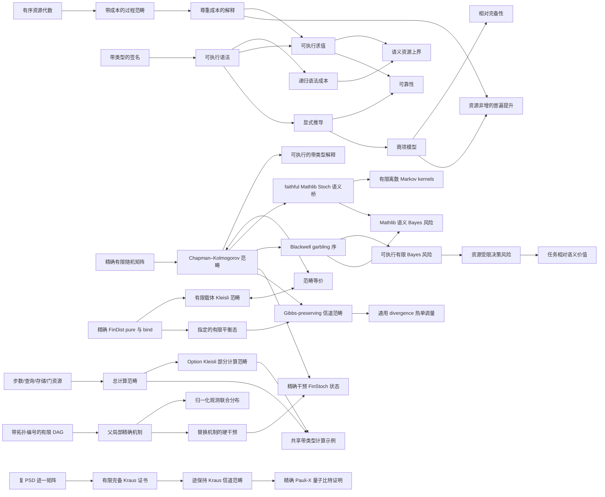

# Ript

**面向资源索引过程理论、由 Lean 4 内核检验的形式化基础。**

[English](../README.md) · [简体中文](README.zh-CN.md) ·
[日本語](README.ja.md) · [Esperanto](README.eo.md)

[](https://github.com/miuchan/ript/actions/workflows/ci.yml)


Ript 形式化了 **Resource-Indexed Information Process Theory（资源索引信息过程理论）**
的一组小而严谨的核心结构：带类型的过程、可组合的资源上界、可执行的解释、显式的等式
推导，以及通过规范项模型建立的相对完备性。

本项目严格按层推进。目前已经包含精确、可执行的有限随机模型、其有限分布 Kleisli 表示，
以及到 Mathlib 测度论范畴 `Stoch` 的 faithful 语义桥。在此基础上，Ript 还已形式化
Blackwell 比较、精确可执行的有限 Bayes 风险、资源受限决策风险与任务相对语义价值。
项目还包含带显式步数、查询、存储与门数量资源的总函数和可失败计算范畴，并已实现可执行
有限 DAG 因果模型、只读取父节点的精确机制、归一化观测联合分布、硬干预及其精确
`FinStoch` 语义。下一层还加入了带指定平衡分布的有限热系统、Gibbs-preserving 精确信道
范畴及 tensor bifunctor、自由平衡态制备，以及通用 divergence 单调性。一般可测因果模型、
Blackwell 反向表示定理、有限 KL 数据处理、由能量导出的 Gibbs 态仍是研究方向。Ript 现在还
拥有一个与经典随机模型分离的有限维复数量子核心：正半定、迹为一的密度矩阵；由有限完备
Kraus 族认证的操作映射；经过证明的正性与迹保持；恒等与串行复合封闭；信道范畴；以及精确的
Pauli-X 量子比特证明。量子 tensor/丢弃、经典随机嵌入与高阶范畴仍是开放研究。

> [!IMPORTANT]
> Ript 是早期研究软件。Stage 1–8 与 Stage 9 的有限 Kraus 核心已实现并通过 Lean 内核检验；公共 API 尚未
> 稳定，当前核心也不宣称已经构成完整的物理信息理论。

## 目录

- [为什么需要 Ript？](#为什么需要-ript)
- [形式化核心](#形式化核心)
- [已经证明的结果](#已经证明的结果)
- [当前范围与研究状态](#当前范围与研究状态)
- [架构](#架构)
- [信任模型](#信任模型)
- [快速开始](#快速开始)
- [一个可执行的完整示例](#一个可执行的完整示例)
- [将 Ript 作为 Lean 依赖](#将-ript-作为-lean-依赖)
- [仓库导览](#仓库导览)
- [代码质量门禁](#代码质量门禁)
- [设计原则](#设计原则)
- [路线图](#路线图)
- [参与贡献](#参与贡献)
- [常见问题](#常见问题)
- [版本、引用与许可证](#版本引用与许可证)

## 为什么需要 Ript？

很多过程理论只描述**哪些过程能够复合**。资源敏感的理论还必须描述**复合需要多少成本**，
并保证这两套叙述彼此一致：

- 恒等过程应当免费；
- 串行与并行复合应具有可组合的资源上界；
- 语法层的成本估计应可靠地约束每一种解释下的语义成本；
- 用于改写过程的等式必须同时保持语义和成本；
- 可执行模型不应为了使用完备性证明而被迫依赖商类型机制；
- 每一项完备性结论都应明确它相对于哪个模型成立。

Ript 把这些义务编码为 Lean 接口，并一次性证明它们之间的核心关系。下游模型只需提供
对象、原始过程、解释以及成本律，通用的可靠性定理和资源定理即可复用。

名称 **Ript** 是 **Resource-Indexed Information Process Theory** 的缩写。“索引”并非
修辞：表达式和态射都携带有类型的输入输出接口，而预算存在于显式的有序加法资源代数中。

## 形式化核心

### 1. 有序加法资源

资源值处于一个带序的加法交换幺半群中，并要求加法与序相容。Ript 刻意不预设格、减法、
标量作用或 Quantale；只有真实语义模型需要时，才应引入更强结构。

对于资源类型 `R` 上带成本的范畴 `C`，基本定律是：

```math
\operatorname{cost}(\mathrm{id}_X)=0,
\qquad
\operatorname{cost}(f \mathbin{\gg} g)
\leq \operatorname{cost}(f)+\operatorname{cost}(g).
```

可选的幺半群能力进一步加入：

```math
\operatorname{cost}(f \otimes g)
\leq \operatorname{cost}(f)+\operatorname{cost}(g),
```

另一个可选能力则声明结合子、幺元子与对称编织都是零成本的结构性重新布线。

### 2. 带类型、可执行的语法

串行语言包含原始生成元、恒等过程和串行复合。它的类型索引使接口不匹配的复合无法表示。
幺半群语言保持独立，并加入张量、结合子、幺元子、它们的逆以及对称编织。

两种语言都有按结构递归计算的 `syntaxCost`。例如：

```math
\operatorname{syntaxCost}(f \mathbin{\gg} g)
=\operatorname{syntaxCost}(f)+\operatorname{syntaxCost}(g).
```

语法不会预先取商，因此构造、求值、检查和有限示例都可以直接执行。

### 3. 尊重成本的解释

解释把对象符号映射到语义对象，把生成元映射到语义态射，同时携带每个生成元遵守声明
预算的证明。求值只是普通的结构递归。

核心资源定理是：

```math
\operatorname{cost}(\operatorname{eval}(e))
\leq \operatorname{syntaxCost}(e).
```

因此，只要证明 `syntaxCost e ≤ r`，就能得到经过检验的语义结论：`eval e` 位于预算 `r`
之内。

### 4. 显式推导、可靠性与相对完备性

Ript 不通过定义相等直接识别表达式。它定义了一个由范畴律生成的显式推导系统；在幺半群
层，还加入对称幺半群相干律。

- **可靠性（soundness）：**每个形式推导在每个兼容解释下都求值为相等态射。
- **相对完备性（relative completeness）：**规范项模型解释中的相等蕴含形式可推导性。
- **自由模型中的预算完备性：**项模型求值的成本恰好等于递归计算的语法成本。
- **严格自由普遍性质：**每个合法解释都会诱导一个从项模型出发、保持强对称幺半群结构且
  资源非增的函子；在生成元上一致的严格扩张中，它的作用是唯一的。

“相对”二字非常重要：完备性定理针对规范商项模型中的相等，而不是对所有可能语义宇宙
作不加限定的宣称。

### 5. 精确有限随机信道

第一个概率模型使用归一化矩阵 `X → Y → ℚ≥0`。复合是精确的 Chapman–Kolmogorov 求和，
tensor 将独立概率相乘，确定性函数通过 faithful Dirac 函子嵌入。对象显式携带枚举和可判等
数据，因此通用带类型求值器可以直接运行公平硬币和带噪布尔信道，不使用浮点近似。复制与
丢弃是显式 Dirac 信道，`comp_discard` 为每个归一化有限信道证明因果丢弃律。

### 6. 有限分布 Kleisli 表示

`FinDist X` 封装精确的归一化质量函数 `X → ℚ≥0`。可执行的 `pure` 与 `bind` 已证明满足
左单位律、右单位律和结合律。把 Kleisli 对象限制为与 `FinStoch` 相同的可执行有限载体后，
态射就是 `X → FinDist Y`，并确实构成一个范畴。

显式的行/矩阵转换给出两个方向的函子。两个态射转换都被证明互逆，对象对应是定义性的，
`kleisliEquivalence` 将相应自然同构封装为范畴等价。这里的限制是必要的：有限载体上的所有
有理概率分布通常仍构成无限集合，因此不会闭合在 Mathlib 无限制 `CategoryTheory.Kleisli`
所要求的有限载体基范畴中。

### 7. 到 Mathlib `Stoch` 的 faithful 桥

`Ript.Models.Probability.StochFunctor` 在不替换有限可执行核心的前提下，把精确矩阵接入
Mathlib 的测度论概率库。每个有限载体都使用离散可测空间；矩阵的一行
`p : Y → ℚ≥0` 被解释为概率测度

```math
\sum_{y \in Y} \uparrow p(y) \; \delta_y.
```

源行的归一化证明该测度总质量为一，因此每个 `FinStoch` 态射都诱导一个 Markov kernel。
由此得到的 `toStoch` 函子保持恒等态射和 Chapman–Kolmogorov 复合，并且：

- 把有限 Dirac 矩阵映射为 Mathlib 的确定性 kernel；
- 是 faithful 的，因为 singleton 质量在注入 `ℝ≥0∞` 后仍可恢复每个精确有理矩阵条目；
- 在一个显式确定性同构之下保持独立 tensor。这个同构比较 Mathlib 的积可测对象与同一
  有限积载体上直接给出的离散顶可测空间。

最后一项以 `Stoch` 中的交换图陈述，而不是伪装成定义相等或尚未声明的幺半群函子实例，
因此可测空间之间的识别明确出现在定理边界上。所有不可计算性都被限制在这层语义桥中；
`FinStoch`、`FinDist`、它们的复合与运行示例仍是可执行的精确 `ℚ≥0` 数据。

### 8. Blackwell 比较与任务相对决策价值

精确有限实验是从隐藏状态到观察的信道 `P : Θ ⟶ X`。Ript 定义 `P` Blackwell 支配
`Q : Θ ⟶ Y`，当且仅当存在随机 garbling `κ : X ⟶ Y` 使

```math
P mathbin{\gg} \kappa = Q.
```

这是操作性的模拟序，而不是熵的比较。它具有自反性和传递性，在共同预处理与独立 tensor
下保持；其资源认证版本还记录后处理预算，并在复合时将预算相加。

Ript 有意分离两层决策理论：

- 语义层通过 `toStoch` 解释精确有限数据，并直接复用 Mathlib 的
  `bayesRisk_le_bayesRisk_comp`，从而证明 garbling 不会降低测度论最优 Bayes 风险。
- 可执行层用 `FinDist` 先验、有限行动和精确 `ℚ≥0` 损失定义 `DecisionProblem`。
  `finiteBayesRisk` 是一组真正 `Finset.min'` 有限最小值的和，不是无条件下确界；Ript
  还证明任何随机化有限决策信道都不能优于这个值，由此得到独立的精确有理数数据处理证明。

计算约束由 `DecisionResourceModel` 表示：它给每个确定性决策规则赋予自然数成本，并提供
零成本后备规则。`resourceBayesRisk` 在有限枚举的可行规则中取最小值；增加预算不会使风险
变差。`DecisionReduction` 必须显式证明提升后的规则不损失决策质量，并且成本至多增加指定
的加法 overhead。零 overhead 的特例正是“免费后处理不能创造资源受限价值”。

最后，

```math
\operatorname{value}(P;\text{任务},\text{基线})
= \operatorname{risk}(\text{基线})-\operatorname{risk}(P)
```

把语义价值定义为相对于明确先验、行动空间、损失、基线实验与可选预算的风险改善。因此，
同一个信道可对一个任务有正价值、对另一个任务为零。Ript 已证明 garbling 单调性、信息
等价不变性、相对自身基线为零、零损失任务的无关性，以及预算单调性；它**不**把这个任务
相对量等同于 Shannon 信息。

### 9. 带显式资源的总计算与部分计算

第一版计算资源是 `ComputationResource := Fin 4 → Nat`，四个命名坐标分别表示形式步数、
oracle 查询、存储上界与电路门数量。这些是数学记账单位，不是实际墙钟时间。加法与比较逐坐标
进行，可执行的 `ComputationResource.within` 检查器具有 proof-level 可靠性定理。

`Computation.Total` 的态射是带资源向量的总函数；`Computation.Partial` 的态射是
`X → Option Y`，串行复合是真正的 `Option` Kleisli 复合，因此失败会传播。两者都精确相加
串行资源，提供独立积 bifunctor，证明 interchange，并精确相加并行资源。目前只宣称已证明的
bifunctor，而不提前宣称原生 `MonoidalCategory` 实例。

函子 `Partial.ofTotal` 把总计算嵌入为必定成功的部分计算，并逐坐标保持资源。一个共享的带类型
查询/否定/guard 程序在两个模型中执行，通用 `eval_cost_le` 与可执行预算检查都适用。

### 10. 有限 DAG 因果模型与硬干预

`FiniteDAG n` 使用 `Fin n` 作为节点，并直接保存拓扑证书：每个父节点的编号严格小于子节点。
因此规范编号顺序既可执行又已证明无环；构造联合分布不需要在内部用经典选择寻找拓扑排序。
任意有限 DAG 都可以在边界处选定拓扑编号后进入该接口。

`FiniteCausalModel n Value` 为每个节点提供精确、归一化的 `FinDist Value` 局部机制，且机制
只接收已声明父节点的值。Ript 按拓扑顺序相乘这些局部条件质量，通过前缀归纳证明总质量为一，
并得到满足观测因子分解公式的可执行联合分布。

`Intervention` 是节点的部分赋值。`do(node = value)` 会把目标节点的局部机制替换为
`FinDist.pure value`，而不是对观测联合分布做条件化。重复同一干预具有幂等性，不相交支持上的
干预彼此交换；替换后仍保持归一化与因子分解。每个局部机制被解释为从父赋值到节点值的
`FinStoch` 信道，观测和干预联合分布则成为从 `Object.unit` 出发的精确随机状态。

可执行的两节点例子包含一个公平 Boolean 原因和复制它的结果。观测时不一致赋值的质量为零；
执行 `do(effect = true)` 后，原因仍然公平，而原本不可能的 `(false, true)` 获得精确质量
`1/2`。这用经过检验的精确数据区分了干预与普通条件化。第一版有意要求所有节点共享同一个
有限值类型；异构节点值域和一般 do-calculus 仍是后续扩展。

### 11. 有限热系统与 Gibbs-preserving 过程

`ThermalObject` 把可执行有限状态空间与一个精确归一化 `EquilibriumState` 组合起来。这里的
平衡分布是操作性数据：第一层并不假装已经从能谱、逆温度或指数 Gibbs 公式推导出它。
`FinDist.push` 让精确分布经过 `FinStoch` 信道演化，`FinDist.tensor` 则构造独立系统的积分布。

`GibbsPreserving X Y` 过程是满足 `T(γX) = γY` 的有限随机信道。Ript 已证明恒等过程
Gibbs-preserving、此类过程对复合封闭并构成范畴；tensor 保持积平衡态并满足恒等律与
interchange，从而得到显式 bifunctor。每个对象的指定平衡态也被构造为从热 tensor 单位出发的
自由态制备。

divergence 层明确暴露假设。`Divergence Value` 同时携带状态比较函数与已经证明的随机数据处理
律。对任意这样的 divergence，Ript 证明每个 Gibbs-preserving `T` 都满足
`D(Tp ‖ γY) ≤ D(p ‖ γX)`，并把它封装为 `ThermalMonotone`。这不是对 KL 数据处理的
未经证明宣称。具体有限 KL 及其 DPI、能量函数、温度、Gibbs 公式、自由能和 Landauer 型不等式
仍是独立研究义务。

### 12. 有限复密度矩阵与 Kraus 信道

量子系统使用独立的有限基对象；它不是经典有限随机对象的别名，也不会自动继承经典复制。
`DensityMatrix X` 是复矩阵 `ρ : Matrix X X ℂ`，同时携带 Mathlib 的算子正半定证明
`ρ.PosSemidef` 与精确归一化 `trace ρ = 1`。这里是二次型意义上的正性，不是矩阵条目逐项非负。

`KrausRepresentation X Y map` 给出有限个矩形算子 `Kᵢ : Matrix Y X ℂ`，证明精确公式

```text
map(ρ) = ∑ i, Kᵢ ρ Kᵢᴴ
```

并认证 `∑ i, Kᵢᴴ Kᵢ = I`。Ript 用 `KρKᴴ` 对正半定性的封闭与有限求和证明正性保持，再用
迹的循环性和完备方程证明迹保持。因此 `KrausChannel.applyDensity` 会把每个源密度矩阵构造成
真正的目标密度矩阵。

`KrausChannel` 直接存储操作映射，只把 Kraus 证书的存在性作命题截断。Kraus 表示并不唯一，
所以信道相等性比较实际作用，而不是任意表示选择。单元素恒等族与全部乘积 `LⱼKᵢ` 分别证明
恒等和串行复合封闭，最终形成范畴。量子比特示例证明 Pauli-X 满足 `XᴴX = I`，并精确交换两个
计算基密度矩阵。

当前切片尚未提供量子 tensor、作为信道的丢弃/迹、显式完全正性放大定理或经典随机信道嵌入。
这些是明确列出的 Stage 9 扩展义务，而不是串行核心的隐含性质。

## 已经证明的结果

下列旗舰结果当前均可编译。表中的中文是非形式化摘要，Lean 声明本身才是权威定义。

| Lean 声明 | 已检验的结论 |
| --- | --- |
| `Ript.Resource.budgeted_id` | 每个恒等态射都可在零预算下使用。 |
| `Ript.Resource.budgeted_comp` | 串行复合时预算相加。 |
| `Ript.Semantics.eval_cost_le` | 语义求值成本不超过语法成本。 |
| `Ript.Semantics.budget_sound` | 语法预算证明可转化为语义预算证明。 |
| `Ript.Semantics.soundness` | 每个解释都尊重串行推导。 |
| `Ript.Semantics.complete_via_term_model` | 项模型中的相等蕴含串行可推导性。 |
| `Ript.Semantics.budget_complete_in_free_model` | 串行项模型成本等于语法成本。 |
| `Ript.Resource.budgeted_tensor` | 张量复合时预算相加。 |
| `Ript.Semantics.monoidalEval_cost_le` | 幺半群求值成本不超过幺半群语法成本。 |
| `Ript.Semantics.monoidal_soundness` | 对称幺半群推导在语义上可靠。 |
| `Ript.Semantics.monoidal_complete_via_term_model` | 幺半群项模型中的相等蕴含可推导性。 |
| `Ript.Semantics.monoidal_budget_complete_in_free_model` | 幺半群项模型成本等于语法成本。 |
| `Ript.Semantics.Free.lift_on_generator` | 普遍提升在生成元上与给定解释一致。 |
| `Ript.Semantics.Free.lift_preserves_cost` | 普遍提升不会增加过程成本。 |
| `Ript.Semantics.Free.lift_unique` | 每个严格保持结构的扩张都与普遍提升具有相同作用。 |
| `Ript.Models.FiniteStochastic.FinStoch.id_apply` | 恒等信道是精确的 Dirac 矩阵。 |
| `Ript.Models.FiniteStochastic.FinStoch.comp_apply` | 复合满足 Chapman–Kolmogorov 公式。 |
| `Ript.Models.FiniteStochastic.FinStoch.tensor_apply` | tensor 将独立的精确概率相乘。 |
| `Ript.Models.FiniteStochastic.FinStoch.dirac_comp` | Dirac 嵌入保持确定性复合。 |
| `Ript.Models.FiniteStochastic.FinStoch.dirac_faithful` | 不同确定性函数产生不同 Dirac 信道。 |
| `Ript.Models.FiniteStochastic.FinStoch.comp_discard` | 每个归一化有限信道都满足因果丢弃律。 |
| `Ript.Models.FiniteDistribution.FinDist.pure_bind` | 点分布是有限分布 bind 的左单位元。 |
| `Ript.Models.FiniteDistribution.FinDist.bind_pure` | 点分布是有限分布 bind 的右单位元。 |
| `Ript.Models.FiniteDistribution.FinDist.bind_assoc` | 精确有限分布 bind 满足结合律。 |
| `Ript.Models.FiniteStochastic.kleisliToChannel_channelToKleisli` | 矩阵到 Kleisli 的转换被反向转换逆转。 |
| `Ript.Models.FiniteStochastic.channelToKleisli_kleisliToChannel` | Kleisli 到矩阵的转换被反向转换逆转。 |
| `Ript.Models.FiniteStochastic.kleisliEquivalence` | `FinStoch` 等价于 `FinDist` 的有限载体 Kleisli 范畴。 |
| `Ript.Models.Probability.StochFunctor.rowMeasure_singleton` | 解释后行测度的 singleton 质量恢复源矩阵的精确条目。 |
| `Ript.Models.Probability.StochFunctor.toKernel_comp` | 精确 Chapman–Kolmogorov 复合成为 Mathlib kernel 复合。 |
| `Ript.Models.Probability.StochFunctor.toStoch_map_dirac` | Dirac 矩阵成为确定性 `Stoch` kernel。 |
| `Ript.Models.Probability.StochFunctor.toStoch_map_eq_iff` | `Stoch` 解释不会丢失精确有限信道信息。 |
| `Ript.Models.Probability.StochFunctor.productMeasurableSpace_eq_top` | 两个有限离散可测空间的积仍是离散空间。 |
| `Ript.Models.Probability.StochFunctor.toStoch_map_tensor` | 独立 tensor 复合在规范比较同构下得到保持。 |
| `Ript.Core.Simulates.trans` | 后处理模拟具有传递性。 |
| `Ript.Core.SimulatesWithin.trans` | 带资源认证的模拟按加法预算复合。 |
| `Ript.Models.Decision.Blackwell.dominates_tensor` | 独立积保持 Blackwell 支配。 |
| `Ript.Models.Decision.Blackwell.semanticBayesRisk_mono` | Blackwell 支配蕴含 Mathlib Bayes 风险序。 |
| `Ript.Models.Decision.FiniteRisk.finiteBayesRisk_le_randomizedDecisionRisk` | 随机化有限规则不能优于计算出的有限最优值。 |
| `Ript.Models.Decision.FiniteRisk.finiteBayesRisk_mono` | Garbling 不能改善精确可执行的有限 Bayes 风险。 |
| `Ript.Models.Decision.ResourceBounded.resourceBayesRisk_antitone` | 更多决策预算不会使最优风险变差。 |
| `Ript.Models.Decision.ResourceBounded.resourceBayesRisk_le_of_reduction` | 认证 reduction 按显式加法 overhead 传递风险。 |
| `Ript.Models.Decision.SemanticValue.semanticValue_mono` | Garbling 不能增加任务相对语义价值。 |
| `Ript.Models.Decision.SemanticValue.resourceSemanticValue_mono_reduction` | 资源价值服从认证 reduction 及其 overhead。 |
| `Ript.Models.Computation.ComputationResource.within_sound` | 可执行向量检查成功会产生资源上界证明。 |
| `Ript.Models.Computation.Total.tensor_comp` | 总计算的并行执行满足 interchange。 |
| `Ript.Models.Computation.Partial.tensor_comp` | `Option` 并行执行满足 Kleisli interchange。 |
| `Ript.Models.Computation.Partial.ofTotal_resource` | 总计算到部分计算的函子保持全部资源坐标。 |
| `Ript.Examples.SimpleComputation.total_interpreter_cost_sound` | 通用语法成本可靠性适用于总执行器。 |
| `Ript.Examples.SimpleComputation.partial_budget_checker_sound` | 部分计算检查器认证精确语法预算。 |
| `Ript.Models.Causal.FiniteDAG.acyclic` | 经认证的父关系不存在有向环。 |
| `Ript.Models.Causal.FiniteCausalModel.prefixFactorMass_normalized` | 归一化局部机制生成归一化拓扑前缀。 |
| `Ript.Models.Causal.FiniteCausalModel.observational_factorization` | 联合质量精确等于父局部条件质量的乘积。 |
| `Ript.Models.Causal.FiniteCausalModel.intervene_same` | 硬干预把目标机制替换为 Dirac 分布。 |
| `Ript.Models.Causal.FiniteCausalModel.intervene_idempotent` | 重复同一干预不会产生进一步变化。 |
| `Ript.Models.Causal.FiniteCausalModel.intervene_comm_of_disjoint` | 支持不相交的干预彼此交换。 |
| `Ript.Models.Causal.FiniteCausalModel.intervention_preserves_normalization` | 每个硬干预联合分布仍然归一化。 |
| `Ript.Models.Causal.FiniteCausalModel.interventional_factorization` | 干预状态分解为未变条件机制与目标 Dirac 因子。 |
| `Ript.Examples.SimpleCausalModel.intervention_replaces_child_mechanism` | Boolean 链例子精确区分干预与观测。 |
| `Ript.Models.FiniteDistribution.FinDist.push_comp` | 分布演化保持随机信道复合。 |
| `Ript.Models.FiniteDistribution.FinDist.push_tensor` | 独立演化与积分布交换。 |
| `Ript.Models.Thermal.GibbsPreserving.tensor_id` | tensor 保持热恒等过程。 |
| `Ript.Models.Thermal.GibbsPreserving.tensor_comp` | 热 tensor 与复合满足 interchange。 |
| `Ript.Models.Thermal.GibbsPreserving.equilibrium_is_free` | 每个指定平衡态都是自由制备。 |
| `Ript.Models.Thermal.Divergence.athermality_monotone` | 每个带 DPI 的 divergence 都给出 Gibbs-preserving 热单调量。 |
| `Ript.Examples.SimpleThermalModel.thermalFlip_involutive` | 两次保持平衡的 Boolean 翻转复合为热恒等过程。 |
| `Ript.Models.Quantum.KrausRepresentation.map_posSemidef` | 每个有限 Kraus 和都保持复算子正性。 |
| `Ript.Models.Quantum.KrausRepresentation.map_trace` | Kraus 完备性蕴含精确迹保持。 |
| `Ript.Models.Quantum.KrausChannel.map_posSemidef` | 每个已认证信道都保持正半定性。 |
| `Ript.Models.Quantum.KrausChannel.map_trace` | 每个已认证信道都在任意矩阵上保持迹。 |
| `Ript.Models.Quantum.KrausChannel.identity_applyDensity` | 单元素恒等 Kraus 族固定每个密度矩阵。 |
| `Ript.Models.Quantum.KrausChannel.comp_applyDensity` | 复合信道演化等于依次演化密度矩阵。 |
| `Ript.Examples.QubitChannel.bitFlipOperator_complete` | Pauli-X 满足 Kraus 完备方程 `XᴴX = I`。 |
| `Ript.Examples.QubitChannel.bitFlip_basisDensity` | Pauli-X 交换两个计算基密度矩阵。 |

[BLUEPRINT.md](../BLUEPRINT.md) 记录了每个定理的前置条件、可计算性、源文件和内核假设；
[AXIOMS.md](../AXIOMS.md) 则保存机器生成并核对过的假设清单。

## 当前范围与研究状态

“PROVED”表示实现和指定的定理义务已经被固定版本的 Lean 内核接受。它不表示相应的科学
解释已经通过实验验证，也不表示完整的物理理论已经发表。

| 阶段 | 范围 | 状态 |
| --- | --- | --- |
| 0 | 可复现工程、文档、CI 与审计基线 | **PROVED** |
| 1 | 串行资源过程核心 | **PROVED** |
| 2 | 张量、对称性、并行资源与严格自由普遍提升 | **PROVED** |
| 3 | 可执行的有限随机模型 | **PROVED** |
| 4 | 有限分布的 Kleisli 表示 | **PROVED** |
| 5 | 到 Mathlib `Stoch` 的 faithful 有限信道桥 | **PROVED** |
| 6 | Blackwell 序、有限决策风险、资源预算与任务相对价值 | **PROVED** |
| 7，计算 | 多维总计算与 `Option` 部分计算模型 | **PROVED** |
| 7，因果 | 有限 DAG 机制、归一化联合分布、干预与 `FinStoch` 状态 | **PROVED** |
| 8 | 有限平衡系统、Gibbs-preserving 过程与通用 divergence 单调性 | **PROVED** |
| 9，有限 Kraus 核心 | 复密度矩阵、TP Kraus 信道、态保持与串行范畴 | **PROVED** |
| 9，量子扩展 | tensor/丢弃、CP 放大定理与经典随机嵌入 | **OPEN RESEARCH** |
| 10–11 | 双范畴与单值层 | **OPEN RESEARCH** |

已经实现的模型能力刻意保持狭窄：

| 模型 | 串行 | 张量 | 可计算性 | 说明 |
| --- | --- | --- | --- | --- |
| 零成本 `FintypeCat` | 是 | 否 | 可执行 | 确定性有限函数 |
| `FiniteFunction.Metered` | 是 | 否 | 可执行 | 函数携带显式自然数成本 |
| 串行项模型 | 是 | 否 | 证明层 | 按显式范畴推导取商 |
| 对称幺半群项模型 | 是 | 是 | 证明层 | 按显式幺半群推导取商 |
| 精确有限随机信道 | 是 | 是 | 可执行 | 归一化 `ℚ≥0` 矩阵、Dirac、复制与丢弃 |
| 有限分布 Kleisli 范畴 | 是 | 否 | 可执行 | 精确 `pure`/`bind`，与 `FinStoch` 范畴等价 |
| Mathlib `Stoch` 桥的有限离散像 | 是 | 是，在规范同构意义下 | 语义层 | faithful Markov-kernel 解释；源矩阵保持可执行 |
| 精确有限决策层 | 通过 `FinStoch` | 无原生 tensor | 可执行 | Blackwell 序保持 `FinStoch` 积；有限最小值、资源预算与任务相对价值 |
| 总计算 | 是 | 积 bifunctor | 可执行 | 形式步数/查询/存储/门向量；精确串并行记账 |
| `Option` 部分计算 | 是 | 积 bifunctor | 可执行 | 失败传播的 Kleisli 复合；总计算嵌入 |
| 有限因果 DAG | 拓扑生成 | 通过 `FinStoch` 状态 | 可执行 | 同质有限载体；父局部精确机制与硬干预 |
| 有限热系统 | Gibbs-preserving 范畴 | 积 bifunctor | 可执行 | 指定精确平衡态；自由平衡态与通用 DPI 提升 |
| 有限量子 Kraus 核心 | Kraus 范畴 | 否 | 矩阵证明层；基标签可执行 | 复 PSD 迹一态与有限完备 Kraus 证书；尚无量子 tensor/丢弃 |

有限随机模型已经具有显式复制、丢弃和经过证明的因果丢弃律；它的有限离散像具有经过检验
的 Mathlib `Stoch` 测度论语义，精确有限决策层也已有通过编译的 Blackwell、Bayes 风险、
资源与语义价值定理；同质有限 DAG 层也已具有经过证明的观测与干预语义。有限
Blackwell--Sherman--Stein 反向表示定理、一般可测决策问题、异构或可测因果模型、完整
do-calculus、通用复制/丢弃与凸结构接口、具体有限 KL 数据处理、由能量导出的 Gibbs 态、
量子 tensor/丢弃与经典嵌入，以及单值或高阶范畴结构都**尚未实现**。串行有限 Kraus 信道
核心本身已经实现并通过内核检验。权威能力矩阵见
[MODEL_MATRIX.md](../MODEL_MATRIX.md)，经过形式化登记的开放
命题见 [CONJECTURES.md](../CONJECTURES.md)。目前没有已登记的猜想。

## 架构

Ript 明确分离可执行数据与基于商类型的证明语义。



| 层 | 主要模块 | 职责 |
| --- | --- | --- |
| 资源接口 | `Ript.Resource.*` | 有序预算、预算态射与预算放宽 |
| 过程能力 | `Ript.Core.*` | 串行、张量、结构成本律与后处理模拟 |
| 可执行语法 | `Ript.Syntax.*` | 带类型表达式、递归成本与推导 |
| 语义 | `Ript.Semantics.*` | 解释、求值、可靠性与完备性 |
| 具体模型 | `Ript.Models.*` | 有限函数、有限概率、Blackwell 决策、计算、有限因果、有限热系统与有限复 Kraus 信道 |
| 可执行示例 | `Ript.Examples.*` | 计算行为、预算、有理概率、精确决策价值、干预、保持平衡过程与量子基作用 |
| 审计界面 | `Ript.Audit.*` | 声明 lint 与内核假设报告 |

串行核心可以独立使用。对称幺半群层通过独立接口扩展它，而不会把张量假设强行塞入每个
串行定义。

## 信任模型

Ript 的目标是让证明信任可以检查，而不是隐含在工程习惯里。

- 所有库定理都由 Lean 内核检验。
- 质量门禁拒绝 `sorry`、`admit`、`sorryAx`、自定义 `axiom`/`constant`、不安全声明和
  `Lean.trustCompiler`。
- 每个实现模块都设置 `autoImplicit false`。
- 所有编译警告均被提升为错误。
- 工程导入具体的 Mathlib 模块，而不是宽泛的 `Mathlib` 总入口。
- 旗舰定理的假设会由机器与文档化白名单逐项比较。
- 未证明的研究主张只能进入 `CONJECTURES.md`，不能伪装成已完成定理进入命名空间。

Stage 1 和 Stage 2 的旗舰审计只在必要处报告 Lean 的标准原则 `propext` 与
`Quot.sound`。有限随机、Kleisli、决策与 `Stoch` 定理的证明还会通过 Mathlib 通用有限和、
有限函数空间、测度及范畴基础设施报告 `Classical.choice`。运行时数据由显式、可计算的
`Fintype` 和 `DecidableEq` 提供；有限信道、有限风险、预算风险与语义价值都是可执行的精确
`ℚ≥0` 数据。总函数、`Option` 失败、资源向量、计算预算检查、有限因果联合分布与硬干预同样
可执行。不可计算性只出现在
测度论 `Stoch`/语义 Bayes 风险边界。审计不含编译器信任
逃逸或占位证明公理。

查看逐定理输出：

```bash
lake env lean Ript/Audit/AxiomChecks.lean
```

## 快速开始

### 前置条件

- Git；
- Lean 工具链管理器 [`elan`](https://github.com/leanprover/elan)；
- Lean 4 支持的 Linux、macOS 或 Windows 环境。

仓库同时固定 Lean 和 Mathlib 版本。`elan` 会读取 `lean-toolchain`，并在需要时自动安装
Lean `v4.33.0`。

### 克隆与构建

```bash
git clone https://github.com/miuchan/ript.git
cd ript

# 推荐：下载匹配版本的 Mathlib 预编译缓存。
lake exe cache get

# 编译完整库；任何 Lean 警告都会导致失败。
lake build
```

第一次执行 Lake 命令时可能会下载固定的工具链和包依赖；后续构建会复用本地 `.lake`
缓存。

### 运行全部工程门禁

```bash
./scripts/quality-gate.sh
```

成功运行以此结束：

```text
All Ript quality gates passed.
```

## 一个可执行的完整示例

`Ript/Examples/BitProcesses.lean` 定义了一个单比特签名，把布尔取反作为成本为 `1` 的原始
生成元。示例连续执行两次取反，并分别把它解释到零成本有限函数模型和显式计量模型中。

核心表达式是：

```lean
def notNot : Expr signature .bit .bit :=
  .comp (.gen .not) (.gen .not)
```

Lean 同时计算并证明语法成本和语义成本：

```lean
example : notNot.syntaxCost = 2 := by decide

example :
    processCost (R := Nat) (eval meteredInterpretation notNot) = 2 := by
  decide
```

直接运行示例：

```bash
lake env lean Ript/Examples/BitProcesses.lean
```

三个可执行断言输出：

```text
true
true
true
```

CI 会精确比较这段输出，因此任何非预期的可执行行为变化都会使质量门禁失败。

`Ript/Examples/StochasticBits.lean` 另外执行公平硬币、带噪否定、独立 tensor、复制和通用带类型
解释器，五个精确检查全部输出 `true`。`Ript/Examples/KleisliBits.lean` 继续执行点分布、Kleisli
bind、双向矩阵转换和范畴等价中的函子，四个检查也全部输出 `true`。

`Ript/Examples/StochBits.lean` 进一步在 Mathlib `Stoch` 内证明：解释后的公平硬币具有预期
singleton 质量；带噪否定保持公平分布；确定性否定确实成为确定性 kernel；两枚独立公平
硬币满足 tensor 比较交换图。这些是语义证明示例，不会增加额外的运行时输出。

`Ript/Examples/SimpleDecision.lean` 用公平隐藏比特与零一猜测损失闭合整条链路。完美观察的
风险是 `0`，独立观察的风险是 `1/2`。资源模型对常量规则收费 `0`，对依赖观察的规则收费
`1`，因此预算从 `0` 增加到 `1` 时，完美实验的预算风险由 `1/2` 降到 `0`。它对猜测任务的
价值恰为 `1/2`，对零损失无关任务则为 `0`。六个精确 `#eval decide` 契约全部输出 `true`，
并由 CI 检查。

`Ript/Examples/SimpleComputation.lean` 在总计算与 `Option` 部分计算范畴中执行同一个带类型
程序，得到精确资源向量 `(步数, 查询, 存储, 门) = (3, 1, 0, 1)`，覆盖成功与失败，并检查两个
模型的预算。七个 `#eval decide` 契约全部输出 `true`。

`Ript/Examples/SimpleCausalModel.lean` 执行一个两节点 Boolean 链。公平根节点导致一个复制
它的子节点，因此观测不一致的质量为零。硬干预 `do(effect = true)` 只替换子机制：上游根节点
仍然公平，`(false, true)` 获得精确质量 `1/2`。五个 `#eval decide` 契约检查归一化、观测支持、
强制值排除和上游不变性。

`Ript/Examples/SimpleThermalModel.lean` 为 Boolean 系统指定精确均匀平衡分布。确定性比特翻转
保持该平衡态，并在 Gibbs-preserving 复合下是对合。例子还执行自由平衡态制备与积平衡态；
六个 `#eval decide` 契约检查精确归一化、信道条目、演化质量、自由态制备、积质量 `1/4` 和
双翻转恒等过程。

`Ript/Examples/QubitChannel.lean` 定义 Boolean 基量子比特、复 Pauli-X 矩阵与计算基纯密度矩阵。
Lean 证明 `XᴴX = I`，把 Pauli-X 封装成单算子迹保持 Kraus 信道，并证明
`X |b⟩⟨b| Xᴴ = |¬b⟩⟨¬b|`。两个 `#eval decide` 契约执行离散基标签作用；任意复矩阵相等性
留在内核证明层，因为实数相等性不可计算判定。

## 将 Ript 作为 Lean 依赖

Ript 暴露根模块 `Ript`。在预发布阶段，请固定到一个已知提交，不要跟踪持续移动的分支：

```lean
require ript from git
  "https://github.com/miuchan/ript.git" @ "<full-commit-sha>"
```

随后可以导入全部公共界面，也可以只导入一个窄模块：

```lean
import Ript
-- 或者使用更窄的依赖边界：
import Ript.Semantics.Eval
-- 或者只导入有限测度论语义桥：
import Ript.Models.Probability.StochFunctor
-- 或者导入 Blackwell 序与任务相对决策价值：
import Ript.Models.Decision.SemanticValue
-- 或者导入资源感知的总计算与部分计算：
import Ript.Models.Computation.Partial
-- 或者导入有限 DAG、硬干预与精确随机状态：
import Ript.Models.Causal.FinStoch
-- 或者导入有限 Gibbs-preserving 过程与通用热单调量：
import Ript.Models.Thermal.Monotone
-- 或者导入复密度矩阵与迹保持 Kraus 信道：
import Ript.Models.Quantum.Kraus
```

Lake 包当前版本为 `0.1.0`，但尚未承诺稳定 API 或带标签版本。可复现的下游工程必须固定
完整提交 SHA。

## 仓库导览

| 路径 | 用途 |
| --- | --- |
| [`Ript/Core/`](../Ript/Core/) | 抽象过程成本能力 |
| [`Ript/Resource/`](../Ript/Resource/) | 资源代数与经过检验的预算 |
| [`Ript/Syntax/`](../Ript/Syntax/) | 串行和对称幺半群语言 |
| [`Ript/Semantics/`](../Ript/Semantics/) | 求值、可靠性、项模型与完备性 |
| [`Ript/Models/`](../Ript/Models/) | 确定性、概率、决策、计算、有限因果、有限热与有限量子模型 |
| [`Ript/Examples/`](../Ript/Examples/) | 可执行示例 |
| [`Ript/Audit/`](../Ript/Audit/) | Lint 与假设审计入口 |
| [BLUEPRINT.md](../BLUEPRINT.md) | 依赖图、阶段、定理记录和设计决定 |
| [AXIOMS.md](../AXIOMS.md) | 当前内核假设清单 |
| [MODEL_MATRIX.md](../MODEL_MATRIX.md) | 已实现和计划中的模型能力 |
| [CONJECTURES.md](../CONJECTURES.md) | 未解决研究命题的正式登记册 |
| [CONTRIBUTING.md](../CONTRIBUTING.md) | 强制执行的开发与证明政策 |

## 代码质量门禁

本地开发与 GitHub Actions 使用相同的项目自有检查。

| 门禁 | 命令 | 防止的问题 |
| --- | --- | --- |
| 源码卫生 | `scripts/check-source-quality.sh` | 占位证明、自定义公理、不安全声明、隐式标识符、宽泛导入和行尾空格 |
| 根模块覆盖 | `lake exe mk_all --check` | Lean 文件未被根库构建纳入 |
| 内核构建 | `lake build` | 类型错误以及所有 Lean 警告 |
| 声明 lint | `lake env lean Ript/Audit/Lint.lean` | Mathlib 声明级 lint 回归 |
| 可执行契约 | `scripts/check-examples.sh` | 有限示例的预期结果发生变化 |
| 假设白名单 | `scripts/check-axioms.sh` | 旗舰定理出现新增或未记录的依赖 |

`main` 分支强制要求稳定检查 `Lean quality gate`，管理员也不能绕过。合并前检查结果必须
基于最新 `main`；强制推送和分支删除均已禁用。

## 设计原则

1. **从最小且可审计的核心开始。**只有真实语义模型需要时才增加代数结构。
2. **让病态类型过程无法表示。**对象索引直接在表达式类型中编码过程接口。
3. **保持资源定律可组合。**恒等、串行、张量和结构重布线拥有显式且可独立复用的契约。
4. **分离可执行语法与证明商。**完备性使用商模型，不应让计算代码无端继承不可计算性。
5. **明确完备性的范围。**每项完备性结论都点名规范模型和证明边界。
6. **把假设当作有版本的 API。**定理出现新公理应立即使门禁失败，而不是事后脚注。
7. **区分实现与愿景。**有限离散 `Stoch` 像、精确有限决策层、同质有限 DAG 因果层和指定
   平衡态的有限热层与串行有限 Kraus 核心已经实现；反向表示、一般随机与因果、解析热力学、
   量子 tensor/经典嵌入和高阶层仍必须清楚标记为开放研究。
8. **声称价值时必须保持任务相对。**语义价值结论要明确先验、行动、损失、基线与资源预算，
   不能悄然升级为任务无关的熵主张。
9. **显式计入计算成本。**只有 reduction 同时给出决策质量界与加法成本 overhead，后处理
   才能成为资源比较。
10. **不把形式成本混同于运行时间。**计算资源是具有已证明复合律的语义标注，不是性能宣称。
11. **不把干预混同于条件化。**硬干预先替换局部机制再重新生成联合分布；观测条件化是不同操作，
    不能作为替代实现。
12. **不偷渡热力学分析。**指定平衡态是操作性数据，通用 divergence 定理要求显式 DPI 证明；
    能量导出的 Gibbs 公式、KL 数据处理和自由能仍是明确列出的研究义务。
13. **不把经典结构偷渡进量子系统。**量子基对象与 `FinStoch` 分离；Kraus 形式和完备性是显式
    证书，而复制、tensor、丢弃与经典嵌入都需要独立证明。

## 路线图

路线图以证明义务为驱动。只有具备已编译定义、旗舰证明、适当的可执行证据和更新后的
假设审计，一个阶段才算推进。

### 已完成的基础

- [x] 有序加法资源接口
- [x] 松弛串行过程成本与检验过的预算
- [x] 带类型的串行语法与可执行求值
- [x] 显式范畴律推导
- [x] 串行可靠性与项模型相对完备性
- [x] 并行成本能力与加法张量预算
- [x] 带类型的对称幺半群语法与结构重布线
- [x] 幺半群可靠性与项模型相对完备性
- [x] 精确有限随机范畴、tensor bifunctor、Dirac 嵌入、复制、丢弃和带类型示例
- [x] 精确有限分布、Kleisli 范畴、双向比较函子与范畴等价
- [x] 到 Mathlib `Stoch` 的 faithful 有限信道函子，以及确定性与 tensor 比较定理
- [x] Blackwell garbling 序、等价、tensor 相容性与 Mathlib Bayes 风险数据处理
- [x] 可执行精确有限 Bayes 风险、有限最优决策与随机规则下界
- [x] 资源受限决策风险、预算单调性与带加法 overhead 的 reduction
- [x] 任务相对语义价值的等价、garbling、预算、基线与任务无关性定律
- [x] 完美观察对比无信息观察的可执行布尔决策示例
- [x] 四坐标计算资源与可靠的可执行预算检查器
- [x] 具有精确串并行成本的总计算和 `Option` 部分计算范畴
- [x] 积 bifunctor、interchange、保持资源的总计算嵌入与带类型示例
- [x] 带拓扑证书的有限 DAG 与父局部精确机制
- [x] 归一化观测联合分布、硬干预、干预定律与 `FinStoch` 状态
- [x] 精确区分 `do` 与观测的可执行 Boolean 因果链示例
- [x] 精确有限平衡系统与随机状态演化
- [x] Gibbs-preserving 范畴、tensor bifunctor 与自由平衡态
- [x] 带显式 DPI 前提的通用 divergence-to-thermal-monotone 定理
- [x] 具有保持平衡翻转的可执行均匀热比特示例
- [x] 复正半定、迹一密度矩阵
- [x] 有限完备 Kraus 表示，以及正性和迹保持证明
- [x] 外延 Kraus 信道的恒等、串行复合、范畴律与态演化
- [x] 精确 Pauli-X 完备性与计算基态变换
- [x] 零成本和显式计量的有限确定性示例
- [x] 可复现 CI、声明 lint 与公理白名单

### 开放研究方向

- [ ] 将复制/丢弃能力接口推广到有限随机模型以外
- [ ] 超出有限离散像的一般可测空间随机语义
- [ ] 通用凸结构与因果能力接口
- [ ] 异构节点值域、一般可测因果模型、条件化与 do-calculus 扩展
- [ ] 总计算和部分计算范畴的原生幺半群封装
- [ ] 有限 Blackwell--Sherman--Stein 反向表示定理
- [ ] 超出精确有限数据的一般可测空间决策问题
- [ ] 更丰富的计算成本模型与经过操作验证的 reduction 成本
- [ ] 具体有限 KL divergence 与经过证明的数据处理不等式
- [ ] 能量函数、逆温度、Gibbs 构造、自由能与 Landauer 界
- [ ] 量子 tensor、丢弃/迹信道与幺半群定律
- [ ] Kraus 映射的显式完全正性放大定理
- [ ] 有限经典随机信道到量子层的嵌入
- [ ] 严格隔离的单价或高阶范畴层

这些复选框不承诺固定的发布顺序。任何扩展都必须保持现有串行边界，或清楚记录有意的
破坏性变更。

## 参与贡献

只要遵守项目明确的信任与范围边界，我们欢迎贡献。

1. 从最新 `main` 创建分支。
2. 完成最小而完整的一组改动。
3. 同时添加证明、适当的可执行证据与文档。
4. 运行 `./scripts/quality-gate.sh`。
5. 创建 Pull Request，并等待 `Lean quality gate` 通过。

在提出新的语义层之前，请说明它需要哪些代数能力、至少一个具体模型、可计算性边界，以及
足以证明这项抽象合理的旗舰定理。强制政策见 [CONTRIBUTING.md](../CONTRIBUTING.md)。

可复现缺陷、证明缺口、文档问题和范围明确的设计提案请提交到
[GitHub Issues](https://github.com/miuchan/ript/issues)。请勿在公开 Issue 中包含凭据、秘密或
漏洞利用细节；本项目目前尚未声明私密安全报告渠道。

## 常见问题

### Ript 是完整的信息、物理或计算理论吗？

不是。它是面向带类型过程和加法资源上界的形式化可组合核心，更广泛的科学层仍未实现。

### 成本总是精确的吗？

不是。通用成本律是次可加的，因此语法成本通常是可靠上界。规范串行和幺半群项模型中的
成本已被证明与语法成本精确相等。

### Ript 已经支持概率、决策论或量子信道了吗？

Ript 已支持基于 `ℚ≥0` 的精确可执行有限随机信道，包括复合、tensor、Dirac、复制与丢弃，
并证明它们与精确有限分布的有限载体 Kleisli 范畴等价。项目还给出了到 Mathlib 测度论
范畴 `Stoch` 的 faithful 函子，在规范比较同构下保持确定性信道与 tensor。任意可测空间上的
随机模型仍属于路线图。Ript 现在也有有限复数量子核心：密度矩阵正半定且迹为一，信道携带
有限完备 Kraus 证书；正性保持、迹保持、恒等、复合、范畴律、密度态演化及 Pauli-X 量子比特
例子都已证明。量子 tensor/丢弃、显式 CP 放大定理和经典随机嵌入仍属于路线图。Ript 也支持带指定精确平衡分布的有限系统、
Gibbs-preserving 信道复合与 tensor、自由平衡态，以及 divergence 提供已证明 DPI 时的通用
热单调性；但尚未从能量导出平衡态，也没有有限 KL 与自由能定理。对于精确有限数据，Ript 还支持 Blackwell
garbling、可执行 Bayes 风险、资源受限风险和任务相对语义价值，并证明正向数据处理方向；
反向有限 Blackwell 表示定理和一般可测决策论仍未完成。
项目也支持具有共同有限值域的拓扑编号 DAG、父局部精确机制、归一化观测联合分布、硬干预与
精确 `FinStoch` 状态。异构值域、一般可测因果模型、条件化 API 和 do-calculus 完备性尚未实现。

### 语义价值等同于互信息吗？

不等同。当前 `semanticValue` 是相对于指定基线的决策风险改善。改变先验、行动空间、损失或
预算，都可能改变同一个实验的价值。项目没有声称它与 Shannon 互信息相等。

### Ript 会建模真实程序运行时间吗？

不会。当前建模的是步数、查询、存储和门数量的声明式形式上界。总执行器与部分执行器已证明
串并行操作的精确记账，但没有定理把这些单位等同于墙钟时间、机器内存或具体硬件成本。

### 幺半群层是否自动带来复制或丢弃？

不会。仅有张量和对称性并不会产生对角态射或终对象态射。有限随机模型显式引入了复制和
丢弃；其他语义模型必须分别给出并证明自己的操作与定律。

### 为什么保留独立的串行语法？

这样可以让最小可用理论保持独立、可执行，并避免所有使用者都被迫接受幺半群假设。幺半群
语法是边界清晰的扩展。

### 语法既然可执行，为什么还要使用商项模型？

可执行语法适合构造和求值；商类型则表达“模形式推导相等”。受到隔离的项模型提供相对
完备性所需的精确证明对象，而不会污染可执行代码。

### 可以直接依赖 `main` 吗？

技术上可以，但可复现工程不应这样做。项目尚无稳定 API 版本，请固定完整提交 SHA。

## 版本、引用与许可证

### 版本

Lake 包当前声明为 `0.1.0`。在带标签版本和明确稳定性政策出现之前，即使包版本未变化，
改动也可能具有破坏性。

### 引用

Ript 目前没有归档论文或 DOI。用于研究产物时，请同时引用仓库 URL 和实际使用的完整提交
SHA，并在可复现材料中归档该提交。只有作者与出版元数据确定后才应添加正式引用文件。

### 许可证

本仓库尚未选择开源许可证。源码公开可见**并不**自动授予复制、再分发或创作衍生作品的
权利。在加入许可证文件之前，适用默认版权限制。这里刻意明确说明，是为了防止下游使用者
推断出尚未授予的权利。

## 致谢

Ript 基于 [Lean 4](https://lean-lang.org/) 与
[Mathlib](https://github.com/leanprover-community/mathlib4) 构建。它们在范畴论、代数、工具和
证明工程方面的生态使本项目成为可能。
